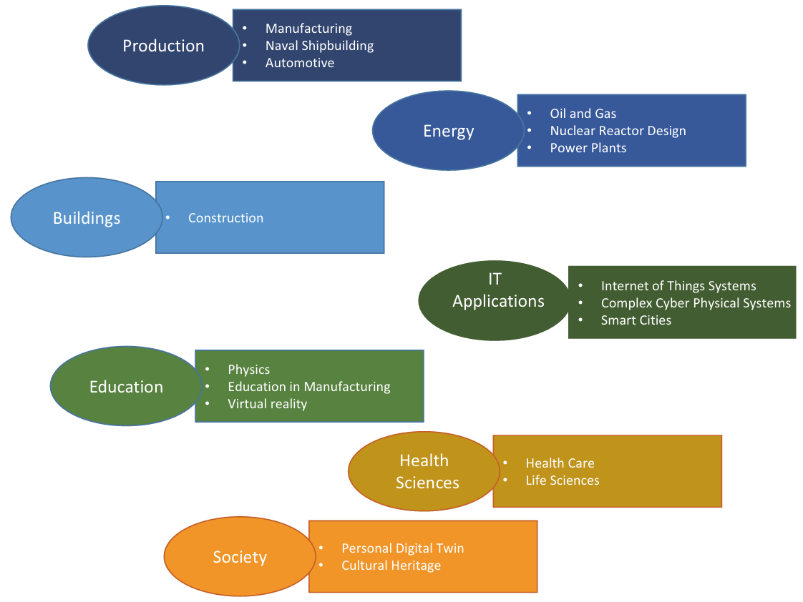

# Digital Twin: What and Why?
## چکیده
پیشرفت در قابلیت‌های ارتباطی، پردازشی، ذخیره‌سازی و حسگری، به‌طور فزاینده‌ای رویکرد **دوقلوی دیجیتال (Digital Twin)** را به‌عنوان ابزاری برای **تحول دیجیتال** امکان‌پذیر ساخته است. صنایع مختلف به‌صورت روزافزون در حال پیاده‌سازی راهکارهایی هستند که یا خود نوعی دوقلوی دیجیتال‌اند یا از این مفهوم الهام گرفته‌اند. این پیاده‌سازی‌ها نشان می‌دهند که چگونه می‌توان از دنیای فیزیکی به سطوح بالاتر و کارآمدتر **نرم‌افزاری‌سازی (Softwarization)** حرکت کرد. توضیح اینکه دوقلوی دیجیتال چیست و چرا به‌عنوان **یک راهکار فناورانه و یک محرک تجاری** اهمیت دارد، بسیار ضروری است. این فصل به معرفی برخی از **روندهای فعلی در استفاده از دوقلوی دیجیتال** و همچنین به بررسی **بازیگران کلیدی** که باید به کاربردهای آن علاقه‌مند باشند، می‌پردازد. استفاده از دوقلوی دیجیتال نیازمند **بستر فناورانه قابل‌توجهی** و **مهارت‌های تخصصی مرتبط** برای پیاده‌سازی و بهره‌برداری موفق است. ازاین‌رو، برای دستیابی به مزایای مورد انتظار این رویکرد، باید **ریسک‌ها و بهترین شیوه‌ها (Best Practices)** به‌دقت مورد توجه قرار گیرند. در نهایت، این فصل نگاهی جامع ارائه می‌دهد به اینکه چگونه می‌توان **راهکارهای مبتنی بر دوقلوی دیجیتال** را توسعه داد و چه مراحلی برای وارد کردن این فناوری به **جریان اصلی صنایع گوناگون** لازم است.

Keywords: Artificial intelligence, Data management, Data modeling, Internet of things, Digital twin, Product life cycle

## 1- مقدمه
مفهوم **دوقلوی دیجیتال (Digital Twin)** طی سال‌های اخیر در زمینه‌های صنعتی گوناگونی پدیدار شده و شکل‌های متفاوتی به خود گرفته است. این مفهوم توسط فناوری‌ها و ابزارهای مختلفی پشتیبانی شده است — از **شبیه‌سازی‌ها** گرفته تا **عامل‌ها (Agents)**، از **نمایش‌های گرافیکی** تا **پلتفرم‌های خدماتی**. تعاریف متعددی از دوقلوی دیجیتال (DT) وجود دارد (برای مثال [1, 2])، و یک جستجوی ساده در Google Scholar می‌تواند هزاران تعریف، مدل مفهومی یا برداشت متفاوت از این مفهوم را نشان دهد. یکی از ساده‌ترین راه‌ها برای درک ماهیت اصلی دوقلوی دیجیتال، نگاه **عمل‌گرایانه (pragmatic)** به آن است:

> «اگر داده‌ی کافی داشته باشید، می‌توانید یک دوقلوی دیجیتال مدل‌سازی کنید و از دنیای واقعی به دنیای دیجیتال حرکت کنید.»
> — *مایکل گریوز (Michael Grieves)*

با این حال، هنوز نیاز است که درک شود چرا رسیدن به یک تعریف عمومی و مورد توافق برای این مفهوم تا این اندازه دشوار است. یکی از ملاحظات اولیه این است که **ایده‌ی مدل‌سازی یک شیء فیزیکی با استفاده از نرم‌افزار، پیش از پیدایش واژه‌ی "دوقلوی دیجیتال" در حوزه‌های مختلف کاربردی وجود داشته است.** ابزارهای مدل‌سازی و روش‌های برتر (Best Practices) مدت‌ها قبل از مطرح شدن اصطلاح دوقلوی دیجیتال از چنین ایده‌هایی پشتیبانی کرده‌اند.هدف این فصل، حل این بحث نیست، بلکه ارائه‌ی **درکی از اهمیت و مزایای رویکرد دوقلوی دیجیتال** است؛ اینکه چگونه این رویکرد می‌تواند به صنایع و حوزه‌های کاربردی مختلف **ارزش و تحول** ببخشد.

---
> این پرسش‌ها توسط **جورج هایلمایر (George Heilmeier)**، مدیر وقت **دارپا (DARPA)** در اواخر دههٔ ۱۹۷۰، تدوین شدند. او سابقه‌ای درخشان در **ترویج فناوری‌های تحول‌آفرین** و **مدیریت موفق نوآوری‌های مهم** داشت. وی مسئول **کشف دیودهای نوری (LEDs)** بود — اجزای اصلی نمایشگرهای امروزی که از تلویزیون‌های بزرگ با وضوح بالا گرفته تا میلیاردها صفحه‌نمایش گوشی‌های هوشمند را تشکیل می‌دهند و امروزه برای ما بدیهی به نظر می‌رسند. هایلمایر همچنین بر پروژه‌های بزرگ و راهبردی نظارت داشت که منجر به توسعه‌ی **لیزرهای فضایی** برای نقشه‌برداری از زمین، **هواپیماهای رادارگریز (Stealth Aircraft)** برای مصارف نظامی، و همچنین بسیاری از **پایه‌های هوش مصنوعی امروزی** شد که امروزه شاهد شکوفایی آن‌ها هستیم [3, 4].

---

ما بحث را با مجموعه‌ای از **پرسش‌های اساسی درباره دوقلوی دیجیتال (Digital Twin)** آغاز می‌کنیم؛ پرسش‌هایی که در ابتدا توسط **جورج هایلمایر (George Heilmeier)** در «کتکیزم» معروف خود (در جعبهٔ سمت راست) مطرح شده‌اند. این پرسش‌ها همان فیلتری بودند که به او کمک کردند تا بفهمد **چه چیزهایی مهم‌اند و چرا**. این بخش (امید است) توضیح دهد که **چرا دوقلوی دیجیتال شایستهٔ توجه است** و چگونه می‌تواند **شیوه‌های مرسوم در صنعت، بخش عمومی، دانشگاه و پژوهش، و حتی در بازار مصرف‌کننده را متحول کند**. پیش‌بینی ما این است که **تغییراتی که دوقلوی دیجیتال به همراه می‌آورد، بنیادی و ماندگار خواهند بود.**

## 2- دوقلوی دیجیتال چیست و چرا مهم است؟
به‌عنوان نقطهٔ آغاز، **دوقلوی دیجیتال** یا به اختصار **DT**، به‌عنوان یک **مدل نرم‌افزاری متن‌محور (contextualized) از یک شیء در دنیای واقعی** در نظر گرفته می‌شود. این شیء واقعی معمولاً یک **شیء فیزیکی** است، اما **اشیای مفهومی** نیز می‌توانند نمایش دیجیتال خود را داشته باشند. منظور از مدل «متن‌محور» (Contextualized Model) این است که **رفتار شیء فیزیکی بتواند در نرم‌افزار بازتولید شود**. بدین ترتیب، می‌توان آن را **مطالعه، تحلیل و پیش‌بینی کرد**، بر اساس «قوانینی» که محیط متن‌محور (context) آن شیء را کنترل می‌کنند. به‌عنوان مثال، می‌توان **نمایش دیجیتال یک ماهواره** را در نظر گرفت که تحت قوانین فیزیک و با آگاهی از سایر اجرام در مدار سیاره مدل‌سازی می‌شود. بدیهی است که **میزان جزئیات و دقت در متن‌سازی (contextualization)** می‌تواند ساده باشد یا شامل فاکتورهای متعدد و پیچیده‌ای شود که بر رفتار شیء فیزیکی تأثیر می‌گذارند. رابطه میان شیء فیزیکی و **همتای نرم‌افزاری آن** توسط ویژگی‌هایی تعیین و محدود می‌شود که در مدل انتخاب شده‌اند. این ویژگی‌ها مشخص می‌کنند **کدام جنبه‌های خاص از شیء فیزیکی در متن مربوطه غالب و مهم هستند**. انتخاب این ویژگی‌ها میزان **نزدیکی مدل نرم‌افزاری به رفتار واقعی شیء فیزیکی** را تعیین می‌کند — یعنی **میزان کارایی مدل‌سازی** و اینکه تا چه اندازه مدل نرم‌افزاری می‌تواند رفتار واقعی شیء را در شرایط مختلف بازتاب دهد. اما اوضاع می‌تواند به‌سرعت پیچیده‌تر شود، زمانی‌که **اجزای تشکیل‌دهندهٔ یک شیء فیزیکی** نیز در نظر گرفته شوند. در این حالت، باید **خود اشیاء، روابط و وابستگی‌های متقابل آن‌ها** نیز مدل‌سازی و بازنمایی شوند. این وابستگی‌ها ممکن است بسیار پیچیده باشند و **در محیط‌های عملیاتی متفاوت، میزان این پیچیدگی افزایش یابد**. برای مثال، **اجزای یک ساختمان** را در نظر بگیرید — اینکه چگونه به یکدیگر مرتبط هستند، چه محدودیت‌ها و قوانین فیزیکی یا ساختاری باید در محیط مدل‌سازی منعکس شوند، و چگونه این روابط در دوقلوی دیجیتال بازنمایی می‌شوند.

این کتاب، در فصل‌های مختلف و با تمرکز بر چندین حوزهٔ کاربردی گوناگون، **نمونه‌ها و نمایش‌های عملی از ویژگی‌ها و روابط میان اشیای فیزیکی و همتایان نرم‌افزاری آن‌ها**، و همچنین **میان خود دوقلوهای دیجیتال** ارائه می‌دهد. «بافت‌ها» یا **زمینه‌ها (Contexts)** اشاره دارند به **حوزه‌های کاربردی خاصی** که در آن‌ها دوقلوهای دیجیتال (DTها) **نمایش داده می‌شوند و فعالیت می‌کنند**.

اهمیت **نمایش (representation)** به **توانایی انتزاعی (abstraction capabilities)** بستگی دارد که توسط قابلیت‌های مدل‌سازی پشتیبان فراهم می‌شود. اگر یک مدل بتواند **توصیفی دقیق از شیء فیزیکی و رفتار آن در محیط** ارائه دهد، آنگاه دوقلوی دیجیتال (DT) می‌تواند در **مراحل طراحی، آزمون و بهره‌برداری، جایگزین شیء فیزیکی** شود. این توانایی امکان می‌دهد تا **رفتار یک محصول یا شیء در شرایط عادی و همچنین در شرایط فشار بالا (high-stress)** درک شود و **نقاط بحرانی در طراحی، مواد به‌کاررفته، یا نحوهٔ استفادهٔ موردنظر** شناسایی گردد. هرچه **مدل‌سازی دقیق‌تر و مؤثرتر** باشد، دوقلوی دیجیتال بهتر می‌تواند برای **درک رفتار شیء فیزیکی در موقعیت‌های خاص** مورد استفاده قرار گیرد. این امر می‌تواند به **صرفه‌جویی در مرحلهٔ طراحی** (برای مثال، استفاده از تجربیات محصولات قبلی از طریق قابلیت‌های مدل‌سازی)، در **مرحلهٔ آزمون** (زیرا اعمال فشار بر نمایش نرم‌افزاری تنها نیازمند توان پردازشی است)، و در **پیش‌بینی رفتارهای غیرمنتظره در مرحلهٔ بهره‌برداری** منجر شود. در بسیاری از **بخش‌های صنعتی**، این توانایی‌ها بسیار باارزش‌اند و می‌توانند به **ادغام موفق دوقلوهای دیجیتال** در فرایندهای صنعتی منجر شوند.

دوقلوی دیجیتال نخستین بار **در صنعت تولید (Manufacturing)** متولد شد و کاربردهای اولیهٔ خود را در آن حوزه پیدا کرد. با این حال، **نمایش مؤثر اشیای فیزیکی توسط نرم‌افزار** در سایر حوزه‌های کاربردی نیز از اهمیت بسیار بالایی برخوردار است. برای مثال، در **حوزهٔ آموزش**، دسترسی به قابلیت‌های دوقلوی دیجیتال می‌تواند به **دانشجویان یا متخصصان** اجازه دهد تا آزمایش‌هایی را بر روی **نمایش‌های منطقی (logical representations)** انجام دهند که همانند اشیای واقعی **واکنش نشان می‌دهند و رفتار می‌کنند**. به‌عنوان نمونه، **جراحان** می‌توانند در قالب **شبیه‌سازی‌های خاص**، عمل‌های دشوار را تمرین کنند بدون آنکه نیاز به انجام آن در محیط واقعی باشد. همچنین **مهندسان در حال آموزش** می‌توانند یاد بگیرند چگونه **سیستم‌های کلیدی** را بدون خطر آسیب واقعی، راه‌اندازی و کنترل کنند. این کتاب **حوزه‌های کاربردی متنوعی** را معرفی می‌کند که در آن‌ها رویکرد دوقلوی دیجیتال **مرتبط، مؤثر و موفق** بوده است.

همان‌طور که پیش‌تر بیان شد، **تعریف دوقلوی دیجیتال** — به‌جز مفهوم اصلی آن که بر **دسترسی به دادهٔ کافی برای نمایش یک شیء فیزیکی** استوار است — همچنان موضوعی برای **بحث و گفت‌وگو در میان جوامع مختلف کاربران و متخصصان** است. در فصل‌های مختلف این کتاب، **تعاریف متن‌محور (contextualized)** و **ویژه‌سازی‌شده (specialized)** از دوقلوی دیجیتال معرفی و بررسی خواهند شد. این تعاریف لزوماً به یک تعریف یکپارچه و جهانی منتهی نخواهند شد، چراکه هدف این کتاب **ارائهٔ «تعریف جهانی دوقلوی دیجیتال» نیست**. در عوض، این تعاریف به‌عنوان **ابزارهایی کاربردی** برای درک و استفاده از **ویژگی‌ها و قابلیت‌های خاص دوقلوی دیجیتال** در **بافت‌ها و حوزه‌های کاربردی مشخص** به‌کار گرفته می‌شوند. هدف این کتاب آن است که همچون یک **راهنما (guide)** به خوانندگان کمک کند تا بر **موضوعات و فناوری‌های مرتبط و مهم** متمرکز شوند و درک کنند که چگونه رویکرد دوقلوی دیجیتال می‌تواند **برای حل مسائل اساسی و حیاتی (cogent problems)** با موفقیت به کار رود.

هدف این کتاب، **ارائهٔ مجموعه‌ای از مفاهیم و فناوری‌هایی** است که **پایه و اساس مفهوم دوقلوی دیجیتال (Digital Twin)** را تشکیل می‌دهند. برای دستیابی به این هدف، لازم است **فرآیندهای فناورانهٔ طولانی‌مدت و مسیرهای تکامل تدریجی** که به فعالیت‌ها و دستاوردهای پویای کنونی در زمینهٔ دوقلوی دیجیتال منجر شده‌اند، **تحلیل و درک شوند**. از سوی دیگر، باید دربارهٔ **مسیرهای احتمالی تکامل این مفهوم در میان‌مدت و بلندمدت** نیز تأمل شود. این رویکرد، دیدگاهی همراه با **چشم‌انداز (perspective)** و **عمق (depth)** نسبت به موضوعاتی ارائه می‌دهد که در سراسر کتاب معرفی و مورد بحث قرار گرفته‌اند.

## 3- دوقلوی دیجیتال امروزه چگونه مورد استفاده قرار می‌گیرد و محدودیت‌های روش‌های فعلی چیست؟

دوقلوی دیجیتال در حال یافتن **کاربردهایی در حوزه‌های گوناگون** است — از **صنعت تولید (manufacturing)** گرفته تا **حفظ و بهره‌برداری از میراث فرهنگی (cultural heritage)**. شکل زیر تعدادی از **حوزه‌های مسئله‌ای (problem domains)** را نشان می‌دهد که مستقیماً در این کتاب مورد بررسی قرار گرفته‌اند. البته **حوزه‌های دیگری نیز وجود دارند** که در آیندهٔ نزدیک احتمالاً **پدیدار خواهند شد و توسعه خواهند یافت**.

هر حوزه، از **مفهوم دوقلوی دیجیتال (DT)** به شیوه‌ای متفاوت استفاده می‌کند. بنابراین، رویکرد فعلی در به‌کارگیری دوقلوهای دیجیتال **بسیار پراکنده (fragmented)** و **به‌شدت تخصصی** است. بسیاری از **شرکت‌ها و ابتکارهای پژوهشی** از رویکرد دوقلوی دیجیتال به‌عنوان **ابزاری توانمندساز (enabler)** برای دستیابی به اهداف خاص خود بهره گرفته‌اند. دوقلوهای دیجیتال مرتبط با **محصولات یا راهکارهای مشخص** ظهور یافته‌اند و ثابت کرده‌اند که در **بهبود چرخهٔ عمر محصولات** یا **پشتیبانی از حل مسائل بسیار پیچیده در دنیای واقعی**، بسیار سودمند هستند. به‌عنوان مثال، ظهور **راهکارهای «بیمار مجازی» (virtual patient solutions)** [5] نشان‌دهندهٔ امکان به‌کارگیری این مفهوم در **علوم زیستی و کاربردهای پزشکی** است. دوقلوی دیجیتال همچنین در **حوزهٔ گستردهٔ اینترنت اشیاء (IoT)** کاربرد یافته و به‌عنوان **راهکاری نوآورانه برای نمایش محیط‌های پیچیده و قابلیت‌های حسگری و کنترلی (sensing/actuation)** مطرح شده است [6, 7]. برای نمونه، از دوقلوی دیجیتال در **بهینه‌سازی شبکه‌های بزرگ حسگرها** و در **نمایش و مدیریت شهرهای هوشمند (smart cities)** استفاده می‌شود [8].

این ابتکارها و موارد مشابه در حوزه‌های گوناگون، **راه را برای استفادهٔ گسترده از مفهوم دوقلوی دیجیتال** در **کسب‌وکارها و محیط‌های مختلف** هموار کرده‌اند. به‌دلیل **دامنهٔ وسیع کاربردپذیری**، رویکرد دوقلوی دیجیتال به‌عنوان **راه‌حلی عمومی و قابل‌اعمال برای مجموعه‌ای از حوزه‌های مسئله‌ای** در نظر گرفته می‌شود. با وجود این گستردگی کاربرد، **استفادهٔ عملی از دوقلوی دیجیتال هنوز عمدتاً به‌صورت «عمودی» (vertically)** و در چارچوب هر حوزهٔ خاص انجام می‌شود و **فاقد یک چارچوب قابل‌بازیابی و مشترک برای تعامل میان حوزه‌ها و کاربردهای مختلف** است. مفهوم **«قابلیت انتقال» (portability)** میان حوزه‌ها هنوز **نیازمند بررسی و اثبات** است.

رویکرد **دوقلوی دیجیتال (DT)** این امکان را فراهم می‌کند که **داده‌ها پیرامون یک شیء فیزیکی جمع‌آوری و سازمان‌دهی شوند**. این موضوع جنبه‌ای بسیار مهم دارد؛ چراکه **داده‌های تاریخی مربوط به رفتار یک شیء در شرایط مختلف** می‌توانند برای **درک بهتر و بهبود آن محصول یا شیء** مورد استفاده قرار گیرند. داده‌های تاریخی همچنین بازتابی از **دانش (knowledge)** و **انتخاب‌هایی** هستند که در **فرآیند طراحی و ساخت محصول** صورت گرفته‌اند. **تحلیل و بهره‌برداری از این اطلاعات** می‌تواند به **بهبود و تکامل مصنوعات (artifacts)** در نسل‌های بعدی آن‌ها منجر شود.

دوقلوهای دیجیتال (DTs) نه‌تنها ارتباطی تنگاتنگ با داده‌ها دارند، بلکه **ابزاری کلیدی برای پیشرفت در حوزهٔ هوش مصنوعی (AI)** نیز محسوب می‌شوند. یکی از کاربردهای آشکار آن‌ها، **پیش‌بینی رفتار اشیای فیزیکی با استفاده از فناوری‌های یادگیری ماشین و یادگیری عمیق (Machine/Deep Learning)** است. با این حال، دوقلوهای دیجیتال می‌توانند از **فناوری‌های پیشرفته‌ٔ دیگری در حوزهٔ هوش مصنوعی** نیز بهره‌مند شوند. دوقلوهای دیجیتال ممکن است نیاز داشته باشند **شرایط محیطی خود را درک کنند** و **رفتارها و تصمیمات هوشمندانه‌ای** را برای دستیابی به اهدافشان به اجرا بگذارند. این ویژگی، بستری ایده‌آل برای **به‌کارگیری روش‌های استدلال و درک (reasoning and understanding)** فراهم می‌کند. همچنین **بهینه‌سازی اهداف و نتایج میان دوقلوهای دیجیتال همکار** (cooperating DTs) یکی از چالش‌های مهم و زمینه‌های پیشرو در توسعهٔ هوش مصنوعی است. دوقلوهای دیجیتال **خودگردان (autonomous DTs)** برای عملکرد صحیح در محیط‌های واقعی — به‌ویژه هنگامی که در **تعامل مستقیم با انسان‌ها** قرار دارند — نیازمند **پشتیبانی قوی از سامانه‌های هوش مصنوعی بلادرنگ (real-time AI)** هستند.

در سال‌های اخیر، افزایش علاقه به **واقعیت مجازی (Virtual Reality)** و **متاورس (Metaverse)** منجر به **ادغام دوقلوی دیجیتال (Digital Twin)** با این فناوری‌ها شده است [9]. با این حال، در کنار شباهت‌ها و هم‌پوشانی‌های میان این مفاهیم، باید به یک **تفاوت اساسی** توجه کرد:  **دوقلوی دیجیتال به‌صورت مستقیم و از طریق داده‌ها، با ویژگی‌های قابل‌اندازه‌گیری دنیای فیزیکی مرتبط است**، در حالی که در **واقعیت مجازی** این ارتباط **لزومی ندارد**. این **پیوند با ویژگی‌های قابل‌اندازه‌گیری**، در کاربردهای واقعی **اهمیت زیادی** دارد.   دوقلوی دیجیتال **بازتاب‌دهندهٔ واقعیِ آن چیزی است که در دنیای واقعی رخ می‌دهد** (حقیقی و معتبر – _genuine and veritable_)، در حالی که **اشیای واقعیت مجازی** تنها می‌توانند **رویدادها یا جلوه‌های قابل‌باور و محتملی از واقعیت** (_verisimilitude_) را نمایش دهند. در میان این دو مفهوم، ممکن است **رویدادها و ویژگی‌ها تغییر کنند**؛ با این وجود، هر دو مفهوم می‌توانند **کاربردی و مکمل یکدیگر** باشند — برای مثال، در **نمایش و شبیه‌سازی رویدادها و اشیای فیزیکی** در محیط‌های مجازی.

هدف این کتاب آن است که **ویژگی‌ها و کاربردهای مهم و اساسی دوقلوی دیجیتال (DT)** را **شناسایی و معرفی** کند تا بتوان از این طریق، **تعریف و دیدگاه کلی‌تری** از آن ارائه داد و همچنین **زمینه‌ای مشترک و واژگان تخصصی (jargon)** لازم را برای **بهره‌برداری کامل از جنبه‌های گوناگون دوقلوی دیجیتال** فراهم ساخت.

## 4- چه چیز جدیدی در رویکرد دوقلوهای دیجیتال وجود دارد و چرا تصور می‌شود این رویکرد موفق خواهد بود؟

