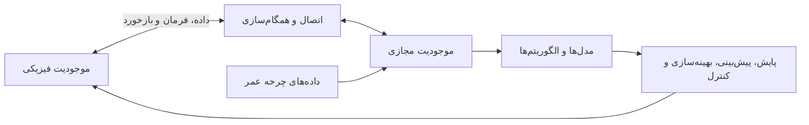
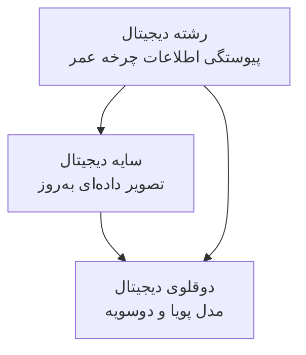
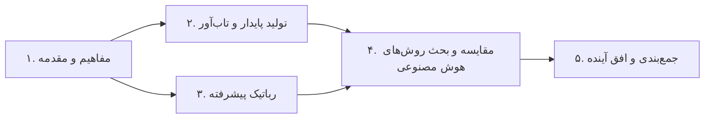
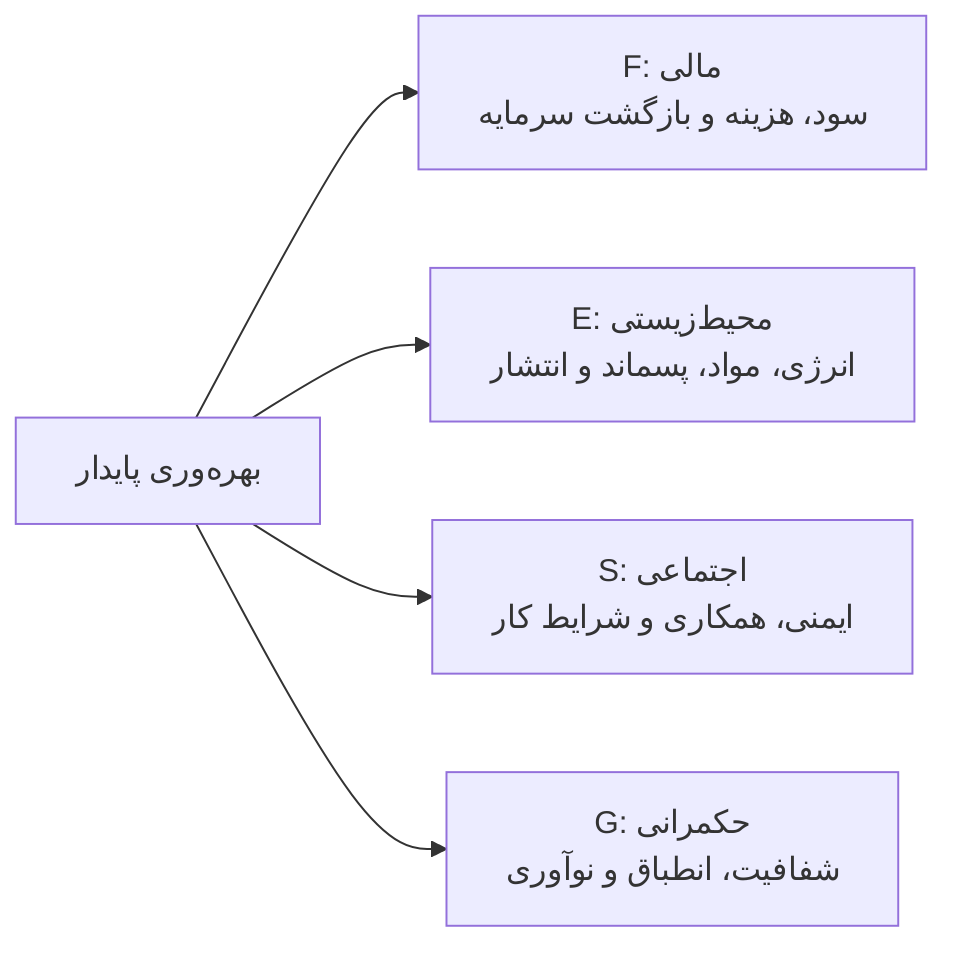
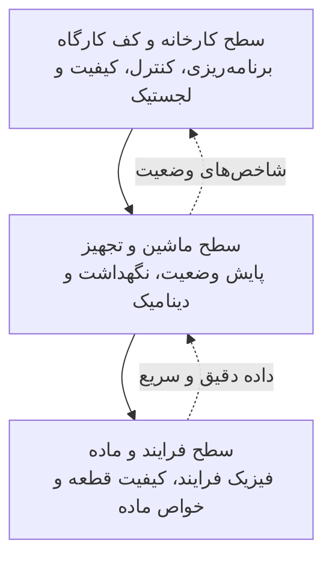
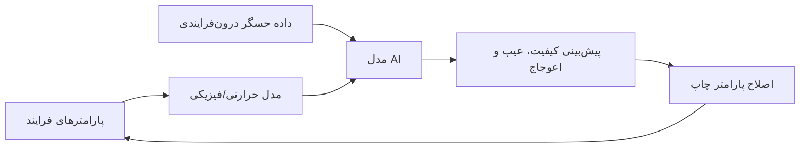
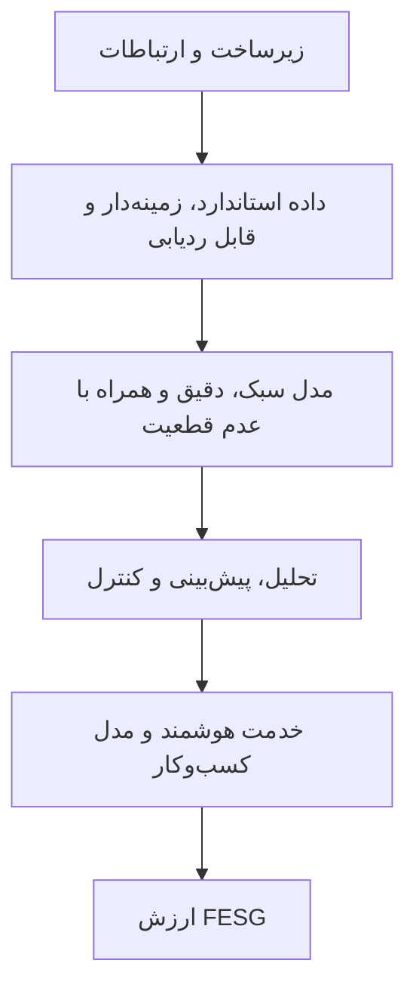
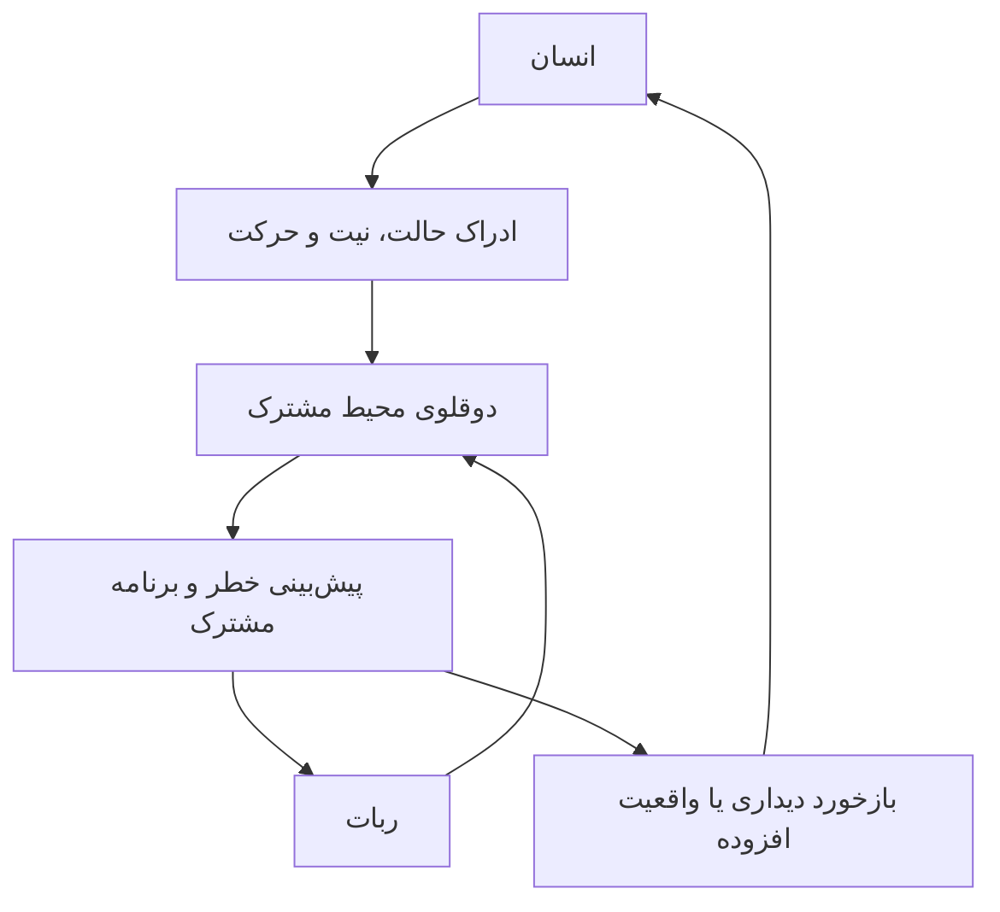
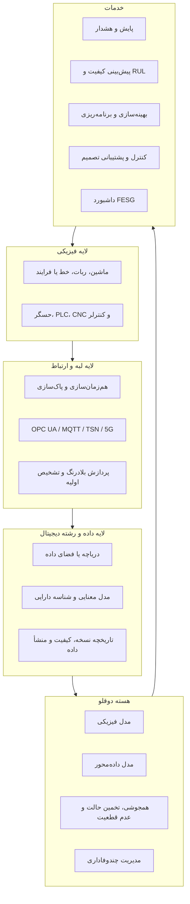

<div dir="rtl">

# دوقلوهای دیجیتال مبتنی بر هوش مصنوعی در صنعت ۴٫۰
## تولید هوشمند، تولید پایدار و رباتیک پیشرفته

> **نوع متن:** بازنویسی و تشریح فارسی جامع برای استفاده در Git/GitHub  
> **مقاله مبنا:** Huang et al., *A Survey on AI-Driven Digital Twins in Industry 4.0: Smart Manufacturing and Advanced Robotics*, Sensors, 2021, 21(19), 6340.  
> DOI: `10.3390/s21196340`
>
> **توضیح:** این فایل ترجمه واژه‌به‌واژه نیست؛ بلکه معادل فارسی روشن، ساختاریافته و تحلیلی مقاله است. ترتیب بخش‌های اصلی مقاله حفظ شده و مطالب افزوده‌شده با عنوان **یادداشت تکمیلی** مشخص شده‌اند. شماره‌های داخل کروشه در جدول‌ها، شماره منبع در مقاله اصلی هستند.

---

## فهرست مطالب

- [چکیده فارسی](#چکیده-فارسی)
- [۱. مقدمه](#۱-مقدمه)
- [۲. تولید پایدار و تاب‌آور](#۲-تولید-پایدار-و-تابآور)
- [۳. رباتیک پیشرفته](#۳-رباتیک-پیشرفته)
- [۴. بحث و تحلیل افقی روش‌های هوش مصنوعی](#۴-بحث-و-تحلیل-افقی-روشهای-هوش-مصنوعی)
- [۵. جمع‌بندی](#۵-جمعبندی)
- [۶. معماری اجرایی پیشنهادی](#۶-معماری-اجرایی-پیشنهادی)
- [۷. چک‌لیست پیاده‌سازی صنعتی](#۷-چکلیست-پیادهسازی-صنعتی)
- [۸. واژه‌نامه اختصارات](#۸-واژهنامه-اختصارات)
- [۹. نکات ارجاع و استفاده](#۹-نکات-ارجاع-و-استفاده)

---

# چکیده فارسی

دوقلوی دیجیتال و هوش مصنوعی در سال‌های اخیر به دو فناوری کلیدی برای تحقق صنعت ۴٫۰ تبدیل شده‌اند. دوقلوی دیجیتال را می‌توان بازنمایی دیجیتالِ پویا، متصل و به‌روزشونده یک موجودیت فیزیکی، فرایند، تجهیز، کارخانه یا سامانه دانست. در این دیدگاه:

- **زیرساخت و داده**، شالوده دوقلو را تشکیل می‌دهند؛
- **مدل و الگوریتم**، هسته محاسباتی آن هستند؛
- **نرم‌افزار و خدمت**، لایه کاربرد و ارزش‌آفرینی را می‌سازند.

هوش مصنوعی سبب می‌شود دوقلوی دیجیتال صرفاً یک مدل شبیه‌سازی ثابت نباشد، بلکه بتواند از داده‌های گذشته و جاری یاد بگیرد، خود را با تغییر شرایط تطبیق دهد، وضعیت‌های آینده را پیش‌بینی کند و تصمیم‌های کنترلی یا مدیریتی پیشنهاد دهد.

مقاله مبنا بیش از ۳۰۰ پژوهش را بررسی کرده و وضعیت به‌کارگیری دوقلوهای دیجیتال مبتنی بر هوش مصنوعی را در دو حوزه اصلی تحلیل می‌کند:

1. **تولید هوشمند و پایدار**؛ از برنامه‌ریزی و کنترل کارخانه تا پایش وضعیت، نگهداشت پیش‌بینانه، ماشین‌کاری، ساخت افزایشی و مواد مرکب؛
2. **رباتیک پیشرفته**؛ شامل کنترل، برنامه‌ریزی حرکت، تعامل انسان و ربات، همکاری انسان و ربات و نگهداشت ربات‌ها.

یک محور مهم مقاله، پیوند دوقلوی دیجیتال با توسعه پایدار است. نویسندگان ارزیابی عملکرد صنعتی را فقط به سودآوری محدود نمی‌کنند و چهار بعد را در نظر می‌گیرند:

- **F — مالی**؛
- **E — محیط‌زیستی**؛
- **S — اجتماعی**؛
- **G — حکمرانی و حاکمیت سازمانی**.

نتیجه اصلی این است که دوقلوهای دیجیتال مبتنی بر هوش مصنوعی، در صورت برخورداری از داده باکیفیت، ارتباطات استاندارد، مدل‌های سبک و قابل اعتماد، و سازوکار مناسب مالکیت و امنیت داده، می‌توانند شفافیت، تاب‌آوری، کیفیت، بهره‌وری و پایداری صنعتی را به‌طور هم‌زمان ارتقا دهند.

---

# ۱. مقدمه

## ۱.۰. زمینه مسئله

صنعت ۴٫۰ در پی ایجاد معماری تولیدی شبکه‌شده‌ای است که اجزای مختلف اتوماسیون، ماشین‌آلات، سامانه‌های اطلاعاتی و واحدهای سازمانی بتوانند با یکدیگر تعامل داشته باشند. هدف این معماری، افزایش انعطاف‌پذیری، چابکی و توان تطبیق کارخانه با تقاضای متغیر بازار است.

در کنار آن، رباتیک پیشرفته نقش عامل اجرایی هوشمند را در خطوط تولید، لجستیک، مونتاژ، بازرسی و نگهداشت بر عهده دارد. با رشد اینترنت اشیا، پردازش ابری و لبه‌ای، حسگرهای صنعتی، شبیه‌سازی و هوش مصنوعی، امکان ساخت نسخه‌های دیجیتال زنده و متصل از سامانه‌های فیزیکی فراهم شده است.

در نگاه مقاله، دوقلوی دیجیتال می‌تواند رویکردهای مدل‌محور سنتی را برای شرایط مرزی متغیر توسعه دهد و یک مبنای تحلیلی نزدیک به زمان واقعی برای تصمیم‌گیری چندهدفه ایجاد کند. این ویژگی به‌ویژه زمانی اهمیت دارد که اهدافی مانند هزینه، کیفیت، زمان، مصرف انرژی، ایمنی و انتشار کربن با یکدیگر تعارض دارند.

## پرسش‌های پژوهشی مقاله

مقاله چهار پرسش اصلی را دنبال می‌کند:

1. وضعیت فعلی پژوهش و نمونه‌های اجرایی دوقلوهای دیجیتال چیست؟
2. هوش مصنوعی در دوقلوهای دیجیتال تولید و رباتیک تا چه اندازه و با چه روش‌هایی ادغام شده است؟
3. دوقلوهای دیجیتال مبتنی بر هوش مصنوعی چه سودی برای توسعه پایدار دارند؟
4. چالش‌های اجرایی و مسیرهای آینده این فناوری چیست؟

## دستاوردهای اصلی مقاله

1. جمع‌بندی توسعه‌ها و کاربردهای دوقلوی دیجیتال هوشمند در صنعت ۴٫۰؛
2. تحلیل اثر این فناوری بر پایداری بر اساس ابعاد FESG؛
3. تفکیک چالش‌ها در سطوح زیرساخت، داده، مدل و کاربرد؛
4. ارائه مسیری برای ادغام هوش مصنوعی در دوقلوهای چندمقیاسی و چندوفاداری در چرخه عمر محصول.

---

## ۱.۱. تعریف مفاهیم پایه

### ۱.۱.۱. دوقلوی دیجیتال

ناسا دوقلوی دیجیتال را نوعی شبیه‌سازی چندفیزیکی، چندمقیاسی و احتمالاتی معرفی کرده است که از مدل‌های فیزیکی، داده حسگر، تاریخچه ناوگان و داده‌های عملیاتی برای بازتاب دادن زندگی موجودیت فیزیکی استفاده می‌کند.

در تعریف چرخه‌عمرمحور، دوقلوی دیجیتال یک مدل پویاست که در مراحل ایجاد، تولید، بهره‌برداری، نگهداشت و کنارگذاری تغییر می‌کند. مدل پنج‌بعدی توسعه‌یافته دوقلو شامل اجزای زیر است:

1. موجودیت فیزیکی؛
2. موجودیت مجازی؛
3. داده؛
4. اتصال؛
5. خدمت.



دوقلوی دیجیتال کامل باید تا حدی دارای **حلقه بازخورد دوسویه** باشد؛ یعنی فقط داده را از سیستم واقعی دریافت نکند، بلکه بتواند تصمیم یا فرمانی را نیز به سیستم فیزیکی بازگرداند.

### ۱.۱.۲. سایه دیجیتال

سایه دیجیتال بازنمایی به‌اندازه کافی دقیق و کامل از فرایندهای تولید، توسعه و حوزه‌های مجاور است که هدف آن ایجاد مبنای تحلیل نزدیک به زمان واقعی از داده‌های مرتبط است.

تفاوت مهم آن با دوقلوی دیجیتال این است که سایه دیجیتال الزاماً به حلقه کنترل دوسویه و مدل بسیار پرجزئیات نیاز ندارد. در بسیاری از کاربردها، سایه دیجیتال بیشتر یک سامانه اطلاعاتی یا مدل اطلاعاتی چنددیدگاهی است که داده‌ها را از منابع مختلف یکپارچه و قابل تحلیل می‌کند.

### ۱.۱.۳. رشته دیجیتال

رشته دیجیتال، پیوند منسجم و قابل ردیابی اطلاعات در سراسر چرخه عمر محصول است. این مفهوم طراحی، مهندسی سیستم مبتنی بر مدل، تولید، بازرسی، کیفیت، عملکرد تجهیز و خدمات پس از تولید را به هم متصل می‌کند.

رشته دیجیتال پاسخ می‌دهد که:

- هر داده از کجا آمده است؟
- در کدام مرحله تولید شده است؟
- با کدام محصول، قطعه، ماشین، دستور ساخت یا نسخه طراحی ارتباط دارد؟
- چه تغییراتی روی آن انجام شده است؟
- کدام تصمیم یا رخداد بر اساس آن شکل گرفته است؟

### مقایسه سه مفهوم

| مفهوم | جهت اصلی جریان اطلاعات | هدف غالب | میزان پویایی | حلقه بازخورد به سیستم فیزیکی |
|---|---|---|---|---|
| سایه دیجیتال | عمدتاً فیزیکی ← دیجیتال | تجمیع، شفاف‌سازی و تحلیل داده | متوسط تا بالا | معمولاً الزامی نیست |
| دوقلوی دیجیتال | فیزیکی ↔ دیجیتال | شبیه‌سازی، پیش‌بینی، بهینه‌سازی و کنترل | بالا | معمولاً مورد انتظار است |
| رشته دیجیتال | افقی در طول چرخه عمر | ردیابی و پیوستگی اطلاعات | وابسته به کاربرد | مستقیم نیست؛ زیرساخت اطلاعاتی است |



> **یادداشت تکمیلی:** در بسیاری از پروژه‌های صنعتی، چیزی که «دوقلوی دیجیتال» نامیده می‌شود، در عمل یک داشبورد یا سایه دیجیتال است. وجود مدل قابل به‌روزرسانی، همگام‌سازی مستمر، قابلیت پیش‌بینی و امکان اثرگذاری بر سیستم فیزیکی، معیارهای مناسبی برای تشخیص بلوغ واقعی دوقلو هستند.

---

## ۱.۲. محدوده و پوشش مقاله

مقاله بر کاربردهای دوقلوی دیجیتال هوشمند در صنعت ۴٫۰ تمرکز دارد و سه مفهوم دوقلو، سایه و رشته دیجیتال را در بر می‌گیرد. با این حال:

- فناوری 5G و اینترنت اشیا فقط به‌عنوان زیرساخت پشتیبان مطرح‌اند؛
- پژوهش‌های صرفاً یادگیری ماشین که فاقد بازنمایی دیجیتال مرتبط با یک موجودیت فیزیکی هستند، در مرکز بحث نیستند؛
- تمرکز اصلی بر تولید هوشمند و رباتیک پیشرفته است؛
- کاربردهایی مانند شهر هوشمند، انرژی، سلامت و جابه‌جایی هوشمند در حوزه آینده مقاله قرار گرفته‌اند.

## ۱.۳. ساختار مقاله



شکل ۱ مقاله اصلی در صفحه ۳، همین سازمان‌دهی را در یک نمای شهری-صنعتی نمایش می‌دهد و پیوند حوزه‌های تولید، رباتیک و پایداری FESG را برجسته می‌کند.

---

# ۲. تولید پایدار و تاب‌آور

## ۲.۱. نمای کلی

وظیفه بنیادی تولید، ساخت محصول باکیفیت، با بهره‌وری بالا و دسترس‌پذیری مناسب تجهیزات است. این سه هدف همیشه هم‌جهت نیستند:

- افزایش سرعت تولید ممکن است کیفیت را کاهش دهد؛
- نگهداشت زیاد می‌تواند دسترس‌پذیری کوتاه‌مدت را کم کند؛
- افزایش حاشیه ایمنی ممکن است هزینه و مصرف منابع را بالا ببرد.

در محیط‌های VUCA، یعنی محیط‌های **نوسانی، نامطمئن، پیچیده و مبهم**، افق تصمیم‌گیری کوتاه‌تر شده و شرایط به‌سرعت تغییر می‌کند. دوقلوی دیجیتال با تکیه بر شبیه‌سازی، داده جاری و اتصال سراسری می‌تواند تصمیم‌گیری را سریع‌تر و سازگارتر کند.

مقاله مفهوم «بهره‌وری پایدار» را مطرح می‌کند. در این نگاه، عملکرد تولید فقط با سود یا نرخ تولید سنجیده نمی‌شود، بلکه باید چهار بعد زیر هم‌زمان دیده شوند:



شکل ۲ مقاله اصلی در صفحه ۴، ارزیابی جامع تولید پایدار را در امتداد توسعه محصول، خرید، برنامه‌ریزی، لجستیک، تولید، تضمین کیفیت و خدمات نشان می‌دهد.

مقاله تحلیل تولید را در سه سطح انجام می‌دهد:

1. کارخانه و کف کارگاه؛
2. ماشین‌آلات و تجهیزات؛
3. فرایند و ماده.



---

## ۲.۲. سطح کارخانه و کف کارگاه

### ۲.۲.۱. توسعه‌های عمومی

افزایش تنوع محصول و تقاضای شخصی‌سازی‌شده، طراحی و مدیریت سیستم‌های تولید را دشوارتر کرده است. در پاسخ، پژوهش‌ها به سمت موارد زیر حرکت کرده‌اند:

- خطوط تولید ماژولار و قابل پیکربندی مجدد؛
- سامانه‌های کمک‌کار واقعیت ترکیبی؛
- حسگرهای متصل و کنترل توزیع‌شده؛
- پردازش ابری و لبه‌ای؛
- بازسازی سه‌بعدی محیط تولید با ابرنقاط؛
- مدل‌های کارخانه و کارگاه که به‌طور خودکار به‌روز می‌شوند.

دوقلوی دیجیتال در این سطح برای حل مسائل زیر به‌کار می‌رود:

- برنامه‌ریزی و زمان‌بندی تولید؛
- پایش و کنترل تولید؛
- کنترل و مدیریت کیفیت؛
- لجستیک داخلی؛
- مدیریت زنجیره تأمین؛
- دمونتاژ، بازیافت و بازتولید.

شکل ۳ مقاله در صفحه ۵ یک سامانه مونتاژ متحرک و بدون خط ثابت را نشان می‌دهد. در این مفهوم، ایستگاه‌ها و واحدهای متحرک بر اساس محصول و سفارش بازآرایی می‌شوند و مدل‌سازی و زمان‌بندی دیجیتال، چابکی مونتاژ قطعات بزرگ را ممکن می‌کند.

### ۲.۲.۲. ادغام هوش مصنوعی

هدف اصلی هوش مصنوعی در این سطح، افزایش سازگاری دوقلو با تغییرات سریع محیط کارخانه است. سه حوزه مهم عبارت‌اند از:

1. برنامه‌ریزی تولید؛
2. کنترل تولید؛
3. کنترل کیفیت.

#### جدول جمع‌بندی روش‌ها در سطح کارخانه

| حوزه | دسته هوش مصنوعی | روش‌های کلیدی | نمونه کاربرد | منبع در مقاله |
|---|---|---|---|---|
| برنامه‌ریزی تولید | یادگیری نظارت‌شده | درخت تصمیم | انتخاب ماده و ابزارگیر، پیش‌بینی سایش ابزار | [86] |
| برنامه‌ریزی تولید | یادگیری تقویتی | DQN | زمان‌بندی پویای سیستم تولید انعطاف‌پذیر | [87] |
| برنامه‌ریزی تولید | هوش محاسباتی | GA، شبیه‌سازی رویدادگسسته | بهینه‌سازی زمان‌بندی تولید | [88] |
| برنامه‌ریزی تولید | هوش محاسباتی | GA | بهینه‌سازی خط مونتاژ هوشمند | [89] |
| برنامه‌ریزی تولید | هوش محاسباتی | ابرشبکه | زمان‌بندی کارگاه تولید چرخ‌دنده | [90] |
| برنامه‌ریزی تولید | بهینه‌سازی | چندهدفه | طراحی سیستم تولید جریان‌کار خودکار | [91] |
| کنترل تولید | یادگیری نظارت‌شده | مدل گرافی احتمالاتی | تخصیص منابع عملیات متوالی | [36] |
| کنترل تولید | یادگیری عمیق | DNN | بهینه‌سازی راه‌اندازی مونتاژ | [92] |
| کنترل تولید | مدل‌های درختی | AdaBoost، CART، Gradient Boosting | شناسایی عوامل مؤثر بر توان عملیاتی کارخانه نیمه‌رسانا | [93] |
| کنترل تولید | مدل‌های درختی | AdaBoost، XGBoost، درخت تصمیم | بهینه‌سازی بازده تولید روغن سبک | [94] |
| کنترل تولید | یادگیری تقویتی عمیق | Deep RL | بهبود کیفیت هندسی مونتاژ | [95] |
| کنترل تولید | یادگیری تقویتی | Q-Learning | مرتب‌سازی جعبه و کنترل جریان مواد | [96] |
| کنترل تولید | یادگیری تقویتی | DQN | بهینه‌سازی فرایند ساخت ویفر | [97] |
| کنترل تولید | یادگیری تقویتی | DQN | بهینه‌سازی نوار نقاله | [98] |
| کنترل تولید | یادگیری تقویتی | TRPO | بهینه‌سازی اعزام سفارش | [99] |
| کنترل تولید | یادگیری تقویتی | TRPO | پیش‌بینی رفتار انسان | [100] |
| کنترل کیفیت | یادگیری نظارت‌شده | ANN | پیش‌بینی تغییرشکل جوش در خط مونتاژ | [101] |
| کنترل کیفیت | یادگیری نظارت‌شده | درخت تصمیم، k-NN، SVM | کشف انحراف سطحی قطعات | [102] |
| کنترل کیفیت | بینایی عمیق | CNN | تشخیص ویژگی‌های قطعه | [103] |
| کنترل کیفیت | بینایی عمیق | ResNet | تشخیص ویژگی ماشین‌کاری از نماهای CAD | [104] |
| کنترل کیفیت | بینایی عمیق | CNN، Autoencoder، U-Net | بازسازی سه‌بعدی در پروفیلومتری فرافکنی نوار | [105] |
| لجستیک | هوش محاسباتی | موقعیت‌یابی خودآموز | کشف شرایط غیرعادی و حفظ اطلاعات مکان | [106] |

### ۲.۲.۲.۱. برنامه‌ریزی تولید

در یک سامانه برنامه‌ریزی و کنترل تولید بالغ، هوش مصنوعی باید بتواند برنامه‌هایی با شاخص‌های عملکرد بهتر تولید کند، اقدامات اصلاحی را استخراج کند، توالی عملیات و تخصیص منابع را بهبود دهد و در مراحل پیشرفته، اقدامات را به‌صورت خودکار اجرا کند.

در مرحله طراحی سبز و برنامه‌ریزی، درخت تصمیم می‌تواند قواعد قابل تفسیر برای انتخاب ماده، ابزار و راهبرد تولید ایجاد کند.

برای زمان‌بندی پویا، ترکیب شبکه پتری، شبکه Q عمیق و شبکه کانولوشن گرافی به‌کار رفته است. این ترکیب می‌تواند منابع مشترک، مسیرهای جایگزین، ورود تصادفی مواد، خرابی ماشین و تغییر اولویت سفارش‌ها را مدل کند.

الگوریتم‌های ژنتیک، شبیه‌سازی رویدادگسسته و سایر فراابتکاری‌ها نیز همچنان در حل مسائل زمان‌بندی و طراحی خط تولید نقش مهمی دارند.

> **یادداشت تکمیلی:** دوقلوی دیجیتال در برنامه‌ریزی زمانی ارزش واقعی پیدا می‌کند که الگوریتم فقط بر داده تاریخی متکی نباشد، بلکه وضعیت جاری ماشین‌ها، صف‌ها، نیروی انسانی، انرژی و مواد را از دوقلو دریافت کند. در این حالت، برنامه‌ریزی از یک مسئله آفلاین به «بازبرنامه‌ریزی پیوسته» تبدیل می‌شود.

### ۲.۲.۲.۲. کنترل تولید

در کنترل تولید، مدل‌های DNN، درخت تصمیم و مدل‌های تجمیعی مانند AdaBoost و XGBoost برای بهینه‌سازی تخصیص منابع و شاخص‌های تولید استفاده شده‌اند.

مسائل کارخانه اغلب چندهدفه، پویا و از نظر محاسباتی دشوارند. به همین دلیل، یادگیری تقویتی به‌عنوان جایگزین یا مکمل روش‌های ابتکاری مطرح می‌شود. مسئله معمولاً به‌صورت فرایند تصمیم‌گیری مارکوف تعریف می‌شود:

- **حالت:** وضعیت ماشین‌ها، سفارش‌ها، صف‌ها، موجودی و منابع؛
- **عمل:** تخصیص، اعزام، تغییر توالی یا تنظیم پارامتر؛
- **پاداش:** ترکیبی از زمان تحویل، هزینه، مصرف انرژی، نرخ تولید و کیفیت؛
- **سیاست:** قاعده تصمیم‌گیری عامل هوشمند.

کاربردها شامل کنترل جریان مواد، زمان‌بندی کارخانه نیمه‌رسانا، کنترل نوار نقاله و اعزام سفارش‌ها است.

مقاله همچنین بر نقش انسان تأکید دارد. در یک نمونه، رفتار اپراتور با یادگیری تقویتی پیش‌بینی می‌شود تا عامل کنترلی مناسب با موقعیت انتخاب شود.

### ۲.۲.۲.۳. کنترل کیفیت

در کنترل کیفیت، مدل‌های کلاسیک مانند ANN، درخت تصمیم و SVM برای تشخیص یا پیش‌بینی تغییرشکل، انحراف هندسی و عیوب سطحی به‌کار می‌روند.

مدل‌های بینایی عمیق می‌توانند ویژگی‌های ماشین‌کاری را از تصویر یا مدل CAD تشخیص دهند، نقص‌های سطحی را شناسایی کنند، هندسه سه‌بعدی را بازسازی کنند و اطلاعات کیفیت را به برنامه‌ریزی فرایند بازگردانند.


ترکیب دوقلوی سیستم تولید با مهندسی سیستم مبتنی بر مدل، یک بستر آزمایش مجازی ایجاد می‌کند که می‌توان در آن راهبردهای کنترل و بهینه‌سازی را پیش از اعمال روی کارخانه واقعی ارزیابی کرد.

### ۲.۲.۳. جمع‌بندی میانی سطح کارخانه

دوقلوی دیجیتال در سطح کارخانه، بهره‌وری، تاب‌آوری و شفافیت را افزایش می‌دهد و دسترسی انتهابه‌انتهای داده در زنجیره ارزش را ممکن می‌کند.

از دید کسب‌وکار، دوقلوی دیجیتال می‌تواند به‌صورت یک **عامل خدمت‌رسان** عمل کند و خدمات هوشمند را از طریق پلتفرم و مدل اشتراکی ارائه دهد. این تحول، تولیدکننده را از فروش یک‌باره سخت‌افزار به ارائه مستمر راهکار و خدمت سوق می‌دهد.

برای شرکت‌های کوچک و متوسط، استقرار کامل دوقلو، هوش مصنوعی و نگهداشت پیش‌بینانه ممکن است پرهزینه باشد. استفاده از خدمات مشترک پژوهشگاه‌ها، تأمین‌کنندگان بزرگ و پلتفرم‌های صنعتی می‌تواند مسیر گذار را هموار کند.


---

## ۲.۳. سطح ماشین‌آلات و تجهیزات

### ۲.۳.۱. توسعه‌های عمومی

دسترس‌پذیری ماشین‌آلات مستقیماً بر بهره‌وری، اثربخشی کلی تجهیز، انرژی و مصرف منابع اثر دارد. فرسایش و خرابی ماشین تحت تأثیر بار کاری، دما، آلودگی، روان‌کاری و شرایط محیطی است؛ ازاین‌رو مدل‌های سنتی فرسایش و خستگی عدم قطعیت قابل توجهی دارند.

کاربردهای مهم دوقلو در این سطح عبارت‌اند از:

- پایش ابزار برشی؛
- پایش یاتاقان؛
- پیچ ساچمه‌ای؛
- چرخ‌دنده؛
- پمپ؛
- مدل‌سازی انرژی تجهیزات؛
- کنترل بهینه؛
- تحلیل دینامیک ماشین؛
- تشخیص ارتعاش و چتر.

### ۲.۳.۲. ادغام هوش مصنوعی

یکی از انگیزه‌های مهم، ایجاد **حسگر نرم** است. نصب حسگر خارجی ممکن است گران باشد یا حتی رفتار ماشین را تغییر دهد. دوقلو به‌همراه یادگیری ماشین می‌تواند کمیت‌های غیرقابل اندازه‌گیری مستقیم، مانند نیروی برش، سایش یا سلامت داخلی را برآورد کند.

#### جدول جمع‌بندی روش‌ها در سطح ماشین و تجهیز

| حوزه | دسته | روش | کاربرد | منبع |
|---|---|---|---|---|
| پایش وضعیت | نظارت‌شده | ANN | پیش‌بینی نیروی فرایند | [133] |
| پایش وضعیت | نظارت‌شده | CNN | پیش‌بینی نیروی فرایند از داده تصویری | [134] |
| پایش وضعیت | نظارت‌شده | CNN، SVDD | تشخیص عیب سطح فولاد یا ابزار | [135] |
| پایش وضعیت | انتقال یادگیری | CNN-DLSTM | عیب‌یابی یاتاقان در شرایط کاری مختلف | [136] |
| پایش وضعیت | بدون‌نظارت | GAN | پیش‌بینی سیگنال ارتعاش ماشین‌کاری | [137] |
| پایش وضعیت | بدون‌نظارت | یادگیری فرهنگ‌لغت، انتقال یادگیری | پیش‌بینی میدان موج برای کشف آسیب | [138] |
| پایش وضعیت | هوش محاسباتی | استنتاج فازی | پایش ترمز جرثقیل سقفی | [139] |
| نگهداشت پیش‌بینانه | آماری/نظارت‌شده | PGM، MCMC | پیش‌بینی شدت تنش و عمر باقی‌مانده | [140] |
| نگهداشت پیش‌بینانه | آماری | مدل ضرایب تصادفی | تخمین RUL ماشین حفاری | [141] |
| نگهداشت پیش‌بینانه | ترکیبی | جنگل تصادفی، فیلتر ذره‌ای | پیش‌بینی سایش ابزار | [142] |
| نگهداشت پیش‌بینانه | عمیق | GRU پشته‌ای | پیش‌بینی سایش ابزار | [143] |
| نگهداشت پیش‌بینانه | عمیق | LSTM | پیش‌بینی بهره‌برداری تجهیز | [144] |
| نگهداشت پیش‌بینانه | عمیق | LSTM | پیش‌بینی وضعیت ابزار | [145] |
| نگهداشت پیش‌بینانه | عمیق | LSTM | تخمین RUL اجزای ماشین | [146] |
| نگهداشت پیش‌بینانه | بدون‌نظارت | GMM | پیش‌بینی خرابی ابزار | [147] |
| نگهداشت پیش‌بینانه | بدون‌نظارت | SSAE-PHMM | پیش‌بینی سایش ابزار | [148] |
| نگهداشت پیش‌بینانه | انتقال عمیق | SSAE و انتقال یادگیری | پیش‌آگاهی عیب خط تولید بدنه خودرو | [149] |
| نگهداشت پیش‌بینانه | مولد | GAN، VAE | ساخت شاخص سلامت سامانه دوار | [150] |
| نگهداشت پیش‌بینانه | خودرمزگذار | CAE | ساخت شاخص سلامت یاتاقان | [151] |
| نگهداشت پیش‌بینانه | خوشه‌بندی توزیع‌شده | k-means | معماری چندعاملی نگهداشت مشارکتی | [152] |
| نگهداشت پیش‌بینانه | احتمالاتی | شبکه بیزی | برنامه‌ریزی مأموریت با عدم قطعیت ترک خستگی | [153] |
| دینامیک و کنترل | نظارت‌شده | RNN | پیش‌بینی حالت دینامیکی برش فلز | [154] |
| دینامیک و کنترل | نظارت‌شده | ANN | پیش‌بینی فرکانس تشدید | [155] |
| دینامیک و کنترل | احتمالاتی | فرایند گاوسی | برآورد سامانه دینامیکی | [156،157] |
| دینامیک و کنترل | فراابتکاری | بهینه‌سازی گرگ خاکستری | تنظیم سامانه کنترل حرکت | [158] |

### ۲.۳.۲.۱. پایش وضعیت

در یک رویکرد ترکیبی، سیگنال‌های داخلی ماشین و نقشه درگیری ابزار و قطعه حاصل از شبیه‌سازی مجازی، ورودی شبکه عصبی می‌شوند تا نیروی برش تخمین زده شود.

در رویکرد دیگر، تصویر چارچوب برش به CNN داده می‌شود تا نیروی لحظه‌ای برش پیش‌بینی شود. این نمونه نشان می‌دهد که داده تصویری می‌تواند مکمل سیگنال‌های ارتعاش، جریان و موقعیت باشد.

یادگیری مادام‌العمر عمیق برای تشخیص کلاس‌های عیب جدید نیز مطرح شده است؛ یعنی سامانه باید بتواند عیب‌هایی را که در آموزش اولیه وجود نداشته‌اند، با دریافت داده جدید یاد بگیرد.

روش‌های انتقال یادگیری، GAN و یادگیری فرهنگ‌لغت برای تشخیص سیگنال‌های غیرعادی و تجسم آسیب استفاده شده‌اند.

### ۲.۳.۲.۲. نگهداشت پیش‌بینانه

پس از پایش وضعیت، شاخص‌هایی مانند **عمر مفید باقی‌مانده** محاسبه می‌شوند. این شاخص‌ها به برنامه‌ریزی نگهداشت کمک می‌کنند تا تعمیر نه خیلی زود و نه پس از خرابی انجام شود.

مدل‌های LSTM و GRU برای داده‌های زمانی مناسب‌اند، زیرا روند فرسایش و وابستگی زمانی را یاد می‌گیرند.

مشکل مهم صنعت، کمبود داده خرابی است. ماشین‌ها بیشتر زمان خود را در حالت سالم کار می‌کنند و نمونه‌های خرابی واقعی کم، پرهزینه، خطرناک و دشوار برای برچسب‌گذاری هستند. به همین دلیل روش‌های بدون‌نظارت و نیمه‌نظارت‌شده مانند GMM، خودرمزگذار، GAN و VAE اهمیت پیدا می‌کنند.


> **یادداشت تکمیلی:** خروجی RUL باید همراه با بازه اطمینان ارائه شود. یک عدد قطعی بدون سنجش عدم قطعیت ممکن است تصمیم نگهداشت را پرریسک کند.

### ۲.۳.۲.۳. دینامیک و کنترل

پایداری ماشین به رفتار دینامیکی سازه، میرایی، تغییر ابزار، بار و اندرکنش ابزار-قطعه وابسته است. مدل‌سازی دقیق این عوامل پیچیده است.

مدل‌های جانشین مانند ANN، RNN و فرایند گاوسی می‌توانند پاسخ دینامیکی را سریع‌تر از مدل اجزای محدود محاسبه کنند. این مدل‌ها برای کنترل بلادرنگ، تنظیم کنترلر و پیش‌بینی ارتعاش مفیدند.

کاهش مرتبه مدل نیز روشی کلیدی است. در آن، مدل فیزیکی پرجزئیات به یک مدل کم‌بعد تبدیل می‌شود که دقت کافی را با هزینه محاسباتی کمتر حفظ می‌کند.

### ۲.۳.۳. جمع‌بندی میانی سطح ماشین

اگرچه مدل‌های تحلیلی ماشین سابقه طولانی دارند، انتقال آن‌ها به محیط صنعتی به علت شرایط متغیر و کمبود داده دشوار است.

کارخانه شبکه‌شده می‌تواند هر ماشین را به یک «آزمایشگاه عملیاتی» تبدیل کند. داده‌های جمع‌آوری‌شده از ناوگان ماشین‌ها، دامنه کاربرد و قابلیت انتقال مدل را افزایش می‌دهد.

ارتباطات پرسرعت مانند 5G نیز امکان پایش پدیده‌های سریع و فرکانس‌بالا را فراهم می‌کنند. شکل ۴ مقاله در صفحه ۱۰، نمونه‌ای از پایش وضعیت یک قطعه دوار در تولید شبکه‌شده و تطبیقی را نمایش می‌دهد.

---

## ۲.۴. سطح فرایند و ماده

### ۲.۴.۱. توسعه‌های عمومی

در این سطح، تمرکز بر کیفیت قطعه و خواص مکانیکی ماده است. کنترل کیفیت سنتی اغلب پس از پایان فرایند انجام می‌شود. این تأخیر می‌تواند باعث تولید تعداد زیادی قطعه معیوب شود.

دوقلوی فرایند امکان می‌دهد کیفیت در حین تولید تخمین زده شود. برای مثال، در ماشین‌کاری می‌توان با شبیه‌سازی برداشت ماده و اندازه‌گیری مجازی، کیفیت سطح و هندسه را پیش از پایان تولید ارزیابی کرد.

کاربردهای مطرح‌شده شامل موارد زیرند:

- ماشین‌کاری و برش فلز؛
- جوشکاری؛
- قالب‌گیری تزریقی؛
- سیم‌پیچی؛
- نوارگذاری مواد مرکب؛
- شکل‌دهی فلز؛
- پولیش لیزری؛
- جایگذاری خودکار الیاف؛
- ساخت رشته ذوبی؛
- ساخت افزایشی فلز.

### ۲.۴.۲. ادغام هوش مصنوعی

هرچه مدل فیزیکی دقیق‌تر شود، زمان محاسبه افزایش می‌یابد. برای دستیابی به عملکرد نزدیک به زمان واقعی، می‌توان مدل یادگیری ماشین را به‌عنوان **مدل جانشین** شبیه‌سازی عددی آموزش داد.

مدل جانشین می‌تواند راه‌اندازی تولید را سریع‌تر کند، پایش کیفیت درون‌خطی انجام دهد، فضای پارامترها را سریع جست‌وجو کند، روابط نهفته فرایند و ماده را آشکار کند و توسعه فرایند را تسریع نماید.

#### جدول جمع‌بندی روش‌ها در سطح فرایند و ماده

| حوزه | دسته | روش | کاربرد | منبع |
|---|---|---|---|---|
| برش فلز | نظارت‌شده | PIO و SVM | پیش‌بینی زبری سطح | [195] |
| برش فلز | نظارت‌شده | روش‌های تجمیعی و ANN | مدل‌سازی رفتار رئولوژیک سیال حفاری | [196] |
| برش فلز | نظارت‌شده | ANN | مدل جانشین اجزای محدود برای تنش و خستگی | [197] |
| برش فلز | محاسبات هوشمند | محاسبات DNA و زنجیره مارکوف | پیش‌بینی زبری سطح | [198] |
| برش فلز | یادگیری تقویتی | DDPG | بهینه‌سازی تصمیم بر اساس عملکرد و ماشین‌کاری‌پذیری | [199] |
| برش فلز | فراابتکاری | PSO | شناسایی معکوس پارامترهای مدل ماده | [200] |
| ساخت افزایشی فلز | نظارت‌شده | SVM | پیش‌بینی عیب در LPBF و LMD | [201] |
| ساخت افزایشی فلز | عمیق | CNN، LSTM، RNN | تضمین کیفیت ساخت افزایشی | [202] |
| ساخت افزایشی فلز | درختی | CART | پیش‌بینی قابلیت ساخت افزودنی | [203] |
| پردازش لیزری | احتمالاتی | HMM | تطبیق مدل و ارزیابی کیفیت | [204] |
| برش لیزری | بدون‌نظارت | k-means | کشف ناهنجاری و بهینه‌سازی فرایند | [205] |
| مواد مرکب | انتقال یادگیری | CNN | تشخیص نواحی خشک در پلیمر تقویت‌شده | [206] |
| مواد مرکب | مدل جانشین | AdaBoost، XGBoost، RF | پیش‌بینی توزیع دما | [207] |
| مواد مرکب | مدل جانشین عمیق | DNN | جانشین اجزای محدود برای فرایند درپینگ | [208] |
| مواد مرکب | یادگیری احتمالاتی | PML | پیش‌بینی خواص ماده مرکب | [209] |
| مواد مرکب | تکاملی | ISRES | شناسایی پارامتر ماده ورق پیش‌آغشته | [210] |
| اتصال | ترکیبی | DNN و GA | پیش‌بینی اعوجاج جوش | [211] |
| شکل‌دهی | نظارت‌شده | ANN | پیش‌بینی سرعت ورودی در پرکردن قالب ماسه‌ای | [212] |

### ۲.۴.۲.۱. برش فلز

کیفیت در فرایندهایی مانند فرزکاری و حفاری به رفتار ماشین، تماس ابزار و قطعه، ساختار نازک قطعه و حرکت چندمحوره وابسته است.

در یک نمونه، SVM با بهینه‌سازی الهام‌گرفته از کبوتر برای پیش‌بینی زبری سطح و تنظیم تطبیقی پارامترهای ماشین‌کاری استفاده شده است.

شبکه عصبی و مدل‌سازی معنایی نیز برای پیش‌بینی خستگی و کیفیت مطرح شده‌اند.

در سطح طراحی برای ساخت، DDPG برای تصمیم‌گیری هم‌زمان بر اساس عملکرد قطعه و ماشین‌کاری‌پذیری به‌کار رفته است. این رویکرد می‌تواند زمان و هزینه توسعه محصول را کاهش دهد.

در سطح ماده، PSO برای شناسایی معکوس پارامترهای مدل ماده از شبیه‌سازی برش استفاده می‌شود.

### ۲.۴.۲.۲. ساخت افزایشی فلز و پردازش لیزری

در LPBF و LMD، اثر حرارتی بر ریزساختار، اعوجاج، تنش پسماند و کیفیت سطح بسیار مهم است.

یک رویکرد، ترکیب مدل انتقال حرارت مبتنی بر گراف با SVM است تا احتمال عیب در فرایند چاپ پیش‌بینی شود.

رویکرد جعبه خاکستری، دانش فیزیکی را با شبکه‌های عصبی ترکیب می‌کند. مقاله گزارش می‌کند که وارد کردن دانش پیشینی فرایند در شبکه‌های عصبی کم‌عمق می‌تواند از مدل‌های صرفاً داده‌محور بهتر عمل کند.

CART نیز برای پیش‌بینی قابلیت ساخت افزودنی و توسعه پایگاه دانش ساخت افزایشی استفاده شده است. HMM و k-means برای تطبیق مدل، ارزیابی کیفیت و کشف ناهنجاری کاربرد دارند.



### ۲.۴.۲.۳. پردازش مواد مرکب

فرایندهای مواد مرکب هنوز نسبت به ماشین‌کاری سنتی بلوغ کمتری دارند و بسیاری از متغیرهای مهم آن‌ها مستقیم اندازه‌گیری نمی‌شوند.

کاربردهای مقاله شامل موارد زیر است:

- CNN و انتقال یادگیری برای پایش پلیمریزاسیون و کشف ناحیه خشک؛
- AdaBoost، XGBoost و جنگل تصادفی به‌عنوان جانشین مدل اجزای محدود؛
- DNN برای بهینه‌سازی پارامتر درپینگ منسوج مرکب؛
- یادگیری احتمالاتی برای به‌روزرسانی شبیه‌سازی چندمقیاسی؛
- الگوریتم ISRES برای شناسایی پارامترهای ورق و پیش‌بینی رفتار لایه‌گذاری.

این روش‌ها امکان لایه‌گذاری بدون عیب در سلول‌های همکاری انسان و ربات را نیز تقویت می‌کنند.

### ۲.۴.۳. جمع‌بندی میانی سطح فرایند

دوقلوی فرایند مبتنی بر هوش مصنوعی باید هم‌بستگی‌های پنهان بین پارامترهای ماده، فرایند، ماشین و محیط را یاد بگیرد و برای توسعه فرایند، راه‌اندازی، تضمین کیفیت و بهینه‌سازی استفاده کند.

با وجود اهمیت الگوریتم، حسگر و زنجیره دیجیتال نباید نادیده گرفته شوند. شکل ۵ مقاله در صفحه ۱۳، دوقلوی کیفیت قطعه هوافضایی را نشان می‌دهد که اطلاعات طراحی، برنامه‌ریزی CAM، رخدادهای CNC، جریان محرکه، موقعیت واقعی و داده‌های تضمین کیفیت را به هم متصل می‌کند.

فناوری‌های نابالغ مانند چاپ سه‌بعدی و تولید سبک‌وزن هنوز در بسیاری موارد با آزمون و خطا تنظیم می‌شوند. بلوغ دوقلو می‌تواند مصرف ماده و انرژی را کاهش دهد، چرخه توسعه را کوتاه کند، قابلیت تعمیر و استفاده مجدد را بهبود دهد و انتشار کربن چرخه عمر را کم کند.

---

## ۲.۵. چالش‌ها و افق آینده تولید

### چالش ۱: تعامل‌پذیری عمودی

هنوز چارچوب استانداردی برای توسعه دوقلوهای چندمقیاسی از سطح فرایند تا کارخانه وجود ندارد. مدل‌ها، زمان‌های پاسخ، داده‌ها و اهداف در هر سطح متفاوت‌اند.

نیاز آینده شامل معماری مرجع چندسطحی، تعریف رابطه میان مدل‌های کارخانه، ماشین و فرایند، و همکاری میان مهندسی مکانیک، کنترل، مخابرات، داده و نرم‌افزار است.

### چالش ۲: تعامل‌پذیری افقی و کیفیت داده

داده چرخه عمر از نرم‌افزارها و سخت‌افزارهای ناهمگون می‌آید. سیلوهای CAD، CAM، CNC، MES، ERP، CAQ و نگهداشت باید به هم متصل شوند.

نیاز آینده:

- مدل معنایی مشترک؛
- شناسه یکتای محصول و تجهیز؛
- رابط استاندارد تبادل اطلاعات؛
- ثبت منشأ و کیفیت داده؛
- هم‌ترازی زمانی داده‌ها.

### چالش ۳: مدل‌های دقیق، سبک و همراه با عدم قطعیت

فرایندهای واقعی دارای متغیرهای تصادفی و روابط پیچیده‌اند. مدل‌های بسیار دقیق ممکن است بلادرنگ نباشند و مدل‌های ساده ممکن است قابل اعتماد نباشند.

مسیر پیشنهادی مقاله شامل مدل ترکیبی فیزیک و داده، مدل جانشین، کاهش مرتبه، یادگیری انتقالی و کمّی‌سازی عدم قطعیت است.

### چالش ۴: خدمات هوشمند و مدل کسب‌وکار

پلتفرم‌های دیجیتال می‌توانند دوقلوهای جداگانه را به خدمات یکپارچه تبدیل کنند. مدل XaaS فرصتی برای فروش نتیجه، قابلیت یا دسترس‌پذیری به‌جای فروش صرف تجهیز است.

اما این امر نیازمند تمایل به اشتراک داده، قرارداد روشن مالکیت داده، امنیت سایبری، تقسیم ارزش میان شرکا و اعتماد به خروجی مدل است.



شکل ۶ مقاله در صفحه ۱۴، چرخه بهره‌وری پایدار را نمایش می‌دهد که در آن اینترنت تولید و دوقلوی دیجیتال، اطلاعات مالی، محیط‌زیستی، اجتماعی و حکمرانی را در چرخه توسعه، تولید و استفاده به هم متصل می‌کنند.


---

# ۳. رباتیک پیشرفته

## ۳.۱. نمای کلی

با گسترش ربات‌ها در صنعت و زندگی روزمره، دوقلوی دیجیتال ربات برای کاربردهایی مانند هماهنگی چندرباته، کنترل، برنامه‌ریزی حرکت، تعامل انسان و ربات و نگهداشت اهمیت یافته است.

نمونه کاربردها:

- جوشکاری؛
- نظافت؛
- برداشتن و قراردادن؛
- مونتاژ؛
- تولید؛
- انبارداری؛
- نگهداشت؛
- ساخت‌وساز؛
- مأموریت‌های امداد و نجات.

ابزارهای شبیه‌سازی شناخته‌شده شامل Gazebo، MuJoCo و CoppeliaSim هستند.

در رباتیک، دو مسیر دوقلو قابل تشخیص است:

- **دوقلوی مدل‌محور:** وقتی دینامیک و ساختار سیستم به‌خوبی شناخته شده است؛
- **دوقلوی داده‌محور یا مدل‌آزاد:** وقتی ساخت مدل فیزیکی دقیق دشوار است و رفتار از داده آموخته می‌شود.

شکل ۷ مقاله در صفحه ۱۵، استفاده از دوقلو برای بهبود دقت موقعیت‌دهی یک ربات چاپ سه‌بعدی‌شده را نشان می‌دهد. شکل ۸ در صفحه ۱۷ نیز ادغام دوقلوی فیزیک‌محور و داده‌محور را در یک پلتفرم رباتیک نمایش می‌دهد.

### جدول جمع‌بندی روش‌های رباتیک

| حوزه | دسته | روش | کاربرد | منبع |
|---|---|---|---|---|
| کنترل | نظارت‌شده/بدون‌نظارت | SVM، PCA | تشخیص شیء با گیره هوشمند | [260] |
| کنترل | یادگیری تقویتی | جست‌وجوی آزمون و خطا | کنترل ربات وزنه‌بردار | [261] |
| کنترل | نظارت‌شده | گرادیان کاهشی | تنظیم پارامتر کنترلر و خدمات چرخه عمر | [262] |
| کنترل | هوش محاسباتی | زنجیره مارکوف مبتنی بر بینایی | بازسازی پره فن هوافضا | [263] |
| کنترل | بهینه‌سازی | QP | پشتیبانی مأموریت امداد و نجات | [264] |
| برنامه‌ریزی | یادگیری تقویتی | PPO | برداشتن و قراردادن با بازوی صنعتی | [265] |
| برنامه‌ریزی | یادگیری تقویتی | DDPG | کنترل و برنامه‌ریزی مسیر بازو | [266] |
| برنامه‌ریزی | یادگیری تقویتی | DQN | خودکارسازی سامانه تولید هوشمند | [267] |
| برنامه‌ریزی | یادگیری عمیق | LSTM-MACG | اجتناب از برخورد چند پهپاد | [268] |
| برنامه‌ریزی | فراابتکاری | کلونی مورچگان | برنامه‌ریزی مسیر ربات صنعتی | [269] |
| HRI/HRC | بینایی عمیق | CNN | تشخیص حالت ایستادن انسان | [270] |
| HRI/HRC | یادگیری عمیق | DL | سامانه مکاترونیکی تعاملی | [271] |
| HRI/HRC | نظارت‌شده | ANN | عبور ربات از موانع | [272] |
| HRI/HRC | توالی | LSTM | پرسش و پاسخ بصری در همکاری انسان و ماشین | [273] |
| HRI/HRC | ترکیبی | FFT-PCA-SVM | تحلیل جوشکار و سطح مهارت | [274] |
| HRI/HRC | یادگیری تقویتی | DDPG | افزایش بهره‌وری مونتاژ تجهیزات پزشکی | [275] |
| نگهداشت | عمیق | DNN | پایش سلامت و نگهداشت سفارشی | [276،277] |
| مدل‌سازی فضای کاری | آماری | مونت‌کارلو | شبیه‌سازی فضای کاری مکانیزم | [278] |
| کاربرد دیگر | نظارت‌شده | جنگل تصادفی | تخمین طول چمن برای ربات چمن‌زن | [279] |

---

## ۳.۲. کنترل

کنترل ربات به بازخورد دقیق و سریع از حسگرهای داخلی و محیطی نیاز دارد. دوقلوی دیجیتال هوشمند می‌تواند در سه سطح کمک کند:

1. حس‌کردن و ادراک؛
2. تنظیم و یادگیری کنترلر؛
3. اجرای کاربرد صنعتی.

در یک گیره نرم رباتیکی، حسگرهای نانوژنراتور تریبوالکتریک، اطلاعات حرکت و تماس را ثبت می‌کنند و PCA و SVM برای پیش‌بینی بلادرنگ استفاده می‌شوند.

در سطح کنترلر، یادگیری تقویتی آنلاین در دوقلو به ربات انسان‌نما اجازه داده است جرم ناشناخته را با آزمون و خطا بلند کند.

در نمونه‌های دیگر:

- گرادیان کاهشی پارامتر کنترل ربات متحرک را تنظیم می‌کند؛
- دوقلو برای توسعه کنترل ربات نرم در عملیات قرار دادن میخ در سوراخ استفاده می‌شود؛
- زنجیره مارکوف مبتنی بر بینایی، بازسازی پره فن را خودکار می‌کند؛
- دوقلوی ربات امدادی، مأموریت در محیط‌های خطرناک را پشتیبانی می‌کند.


---

## ۳.۳. برنامه‌ریزی

کنترل سطح پایین بر پاسخ سریع و پایداری تمرکز دارد، در حالی که برنامه‌ریزی سطح بالا باید از میان گزینه‌های ممکن، مسیر یا توالی مناسب را با رعایت محدودیت‌ها انتخاب کند.

یادگیری تقویتی برای برنامه‌ریزی ربات‌های با درجات آزادی زیاد جذاب است؛ اما آموزش مستقیم روی ربات واقعی گران و زمان‌بر است. دوقلوی دیجیتال محیط امنی برای تولید تجربه فراهم می‌کند.

نمونه‌ها:

- برنامه‌ریزی برداشتن و قراردادن برای بازوی ۶ درجه آزادی؛
- برنامه‌ریزی چندوظیفه‌ای حرکت بازوی ربات با DDPG؛
- آموزش عامل عمیق برای خودکارسازی کارخانه؛
- اجتناب از برخورد چند پهپاد در فضای محدود؛
- برنامه‌ریزی مسیر با الگوریتم کلونی مورچگان.

> **یادداشت تکمیلی:** انتقال سیاست از شبیه‌سازی به واقعیت با مشکل «شکاف شبیه‌سازی-واقعیت» روبه‌رو است. تصادفی‌سازی دامنه، تطبیق آنلاین مدل و یادگیری انتقالی سه راه مهم برای کاهش این شکاف‌اند.

---

## ۳.۴. تعامل و همکاری انسان و ربات

در HRI و HRC، ایمنی انسان اولویت اصلی است. این سناریوها از محیط ربات‌محور پیچیده‌ترند، زیرا رفتار انسان متنوع، تصادفی و گاهی ضمنی است.

دوقلوی هوشمند می‌تواند:

- حالت بدن انسان را تشخیص دهد؛
- حرکت بعدی انسان را پیش‌بینی کند؛
- محدوده ایمن را به‌روز کند؛
- برنامه ربات را با رفتار انسان تطبیق دهد؛
- سطح مهارت اپراتور را تحلیل کند؛
- فضای مشترک را در واقعیت مجازی نمایش دهد.

در یک کاربرد ساخت‌وساز، مدل BIM طراحی‌شده با هندسه واقعی محیط که از حسگرهای محل کار به‌دست آمده ترکیب می‌شود. واقعیت مجازی امکان برنامه‌ریزی و بداهه‌سازی مشترک را فراهم می‌کند.

در جوشکاری تعاملی، زنجیره FFT-PCA-SVM برای تحلیل رفتار جوشکار و تشخیص سطح حرفه‌ای او استفاده شده است.

در مونتاژ تجهیزات پزشکی، یادگیری تقویتی و دوقلو برای افزایش بهره‌وری همکاری انسان و ربات در شرایط همه‌گیری به‌کار رفته‌اند.



---

## ۳.۵. نگهداشت ربات و کاربردهای دیگر

ربات‌ها نیز دچار فرسایش، خرابی و توقف می‌شوند. دوقلوی داده‌محور می‌تواند برای موارد زیر استفاده شود:

- کشف ناهنجاری؛
- تشخیص خرابی جعبه‌دنده؛
- پایش سلامت کل سامانه؛
- نگهداشت پیش‌بینانه سفارشی؛
- مدل‌سازی منحنی تخریب؛
- بیشینه‌سازی دسترس‌پذیری خط.

کاربردهای دیگر مقاله شامل مدل‌سازی فضای کاری با روش مونت‌کارلو و تخمین طول چمن برای ربات چمن‌زن با جنگل تصادفی است.

---

## ۳.۶. چالش‌ها و افق آینده رباتیک

### ۱. شبیه‌سازی چندجسمی و تماس

تعامل ربات-ربات، ربات-انسان و ربات-محیط دارای تماس، اصطکاک، تغییرشکل و عدم قطعیت است. شبیه‌سازی دقیق این روابط هزینه محاسباتی زیادی دارد.

### ۲. نیاز به بازخورد بلادرنگ

حرکت ربات صنعتی می‌تواند بسیار سریع باشد. تأخیر شبکه، حسگر و پردازش مستقیماً بر ایمنی و پایداری اثر می‌گذارد.

### ۳. محدودیت شبیه‌سازها

شبیه‌سازهای رایج هنوز در مدل‌سازی تماس، مواد نرم، حسگرهای پیچیده و محیط‌های بسیار پویا محدودیت دارند و گاهی به سخت‌افزار محاسباتی قوی نیازمندند.

### ۴. عدم قطعیت رفتار انسان

رفتار انسان لایه دیگری از عدم قطعیت ایجاد می‌کند. علاوه بر رعایت استانداردهای ایمنی، واقعیت افزوده و مجازی می‌توانند تعامل را شهودی‌تر کنند.

### ۵. یکپارچگی اطلاعات چرخه عمر

اطلاعات طراحی، برنامه، وظیفه، نگهداشت و تغییرات ربات باید در دوقلو و رشته دیجیتال یکپارچه شوند.


---

# ۴. بحث و تحلیل افقی روش‌های هوش مصنوعی

مقاله روش‌های هوش مصنوعی را در چهار دسته کلی قرار می‌دهد:

1. یادگیری نظارت‌شده؛
2. یادگیری بدون‌نظارت و نیمه‌نظارت‌شده؛
3. یادگیری تقویتی؛
4. هوش محاسباتی و بهینه‌سازی.

## ۴.۱. یادگیری نظارت‌شده

نمونه‌ها شامل SVM، درخت تصمیم، k-NN، CNN، RNN، LSTM، شبکه عصبی عمیق و مدل‌های تجمیعی هستند.

مزایا:

- عملکرد پایدار در صورت وجود داده مناسب؛
- ارزیابی کمی روشن؛
- مناسب برای طبقه‌بندی و رگرسیون.

محدودیت‌ها:

- نیاز به داده برچسب‌دار؛
- هزینه بالای ایجاد نمونه خرابی؛
- وابستگی به کیفیت ویژگی و برچسب؛
- کاهش تعمیم در شرایط کاری جدید.

## ۴.۲. یادگیری بدون‌نظارت و نیمه‌نظارت‌شده

نمونه‌ها شامل k-means، GMM، PCA، Autoencoder، CAE، GAN، VAE و یادگیری فرهنگ‌لغت هستند.

مزایا:

- استفاده از داده فراوان بدون برچسب؛
- مناسب برای کشف ناهنجاری و ساخت شاخص سلامت؛
- کاهش وابستگی به داده خرابی.

محدودیت‌ها:

- تفسیر دشوار خوشه‌ها؛
- نامشخص بودن تعداد خوشه؛
- حساسیت به معیار فاصله؛
- احتمال یادگیری الگوهای غیرمرتبط.

> **نکته فنی:** PCA در اصل یک روش کاهش بعد است و الزاماً الگوریتم خوشه‌بندی نیست، هرچند در مقاله در دسته روش‌های بدون‌نظارت مطرح شده است.

## ۴.۳. یادگیری تقویتی

عامل با محیط تعامل می‌کند و می‌آموزد چه عملی پاداش تجمعی را بیشینه می‌کند.

کاربردهای مناسب:

- زمان‌بندی پویا؛
- تخصیص منابع؛
- کنترل جریان مواد؛
- برنامه‌ریزی حرکت ربات؛
- کنترل تطبیقی؛
- تصمیم‌گیری بلندمدت.

چالش‌ها:

- طراحی تابع پاداش؛
- ایمنی هنگام اکتشاف؛
- نیاز به تجربه زیاد؛
- ثبت صحیح حالت و عمل؛
- انتقال سیاست از دوقلو به سامانه واقعی.

## ۴.۴. هوش محاسباتی و بهینه‌سازی

این گروه شامل الگوریتم ژنتیک، PSO، کلونی مورچگان، گرگ خاکستری، شبکه بیزی، استنتاج فازی، شبیه‌سازی رویدادگسسته و بهینه‌سازی چندهدفه است.

این روش‌ها هنوز در مهندسی صنعتی کاربرد گسترده دارند و می‌توانند با یادگیری ماشین ترکیب شوند.

### مقایسه کلی

| رویکرد | داده برچسب‌دار | بهترین کاربرد | مزیت اصلی | ریسک اصلی |
|---|---:|---|---|---|
| نظارت‌شده | زیاد | پیش‌بینی کیفیت و عیب | دقت و ارزیابی روشن | هزینه برچسب |
| بدون‌نظارت | کم یا صفر | ناهنجاری و شاخص سلامت | استفاده از داده خام | تفسیر دشوار |
| نیمه‌نظارت‌شده | کم | خرابی‌های نادر | تعادل داده و دقت | پیچیدگی آموزش |
| تقویتی | پاداش و محیط | کنترل و تصمیم ترتیبی | یادگیری سیاست | ایمنی و نمونه‌ناکارآمدی |
| فیزیک‌محور | پارامتر و مدل | پدیده‌های شناخته‌شده | قابلیت تفسیر | هزینه محاسبات |
| ترکیبی فیزیک و داده | متوسط | دوقلوی صنعتی قابل اعتماد | تعمیم بهتر و داده کمتر | طراحی پیچیده |

---

## ۴.۵. دوقلوی چندمقیاسی و چندوفاداری

وفاداری دوقلو به سه عامل وابسته است:

- دانه‌بندی و جزئیات مدل؛
- پیچیدگی محیط کاربرد؛
- کیفیت و وفاداری داده.

در مقیاس‌های بالاتر کارخانه، تصمیم‌ها معمولاً در بازه ساعت، روز یا هفته گرفته می‌شوند. در مقیاس فرایند و کنترل، پاسخ ممکن است در ثانیه، میلی‌ثانیه یا میکروثانیه لازم باشد.

در چرخه عمر نیز داده‌ها کیفیت و هزینه متفاوت دارند:

- شبیه‌سازی: حجم زیاد، وفاداری متوسط؛
- آزمایشگاه: حجم محدود، کنترل و دقت بالا؛
- تولید: داده فراوان ولی آلوده و ناهمگون؛
- بهره‌برداری: داده واقعی اما برچسب خرابی کم؛
- نگهداشت: داده ارزشمند ولی پراکنده و رویدادمحور.


شکل ۹ مقاله در صفحه ۲۰ این مسیر را به‌صورت یک نقشه زمان پاسخ، سطح کاربرد، مرحله چرخه عمر و نوع یادگیری نشان می‌دهد. نتیجه آن شکل چنین است:

- یادگیری نظارت‌شده، پایدارترین و رایج‌ترین روش است؛
- یادگیری تقویتی برای محیط پیچیده و تصمیم‌های بلندمدت مناسب است؛
- روش‌های بدون‌نظارت برای کشف وضعیت و پیش‌بینی عمر مفیدند؛
- روش‌های سنتی هوش محاسباتی همچنان قابل ترکیب و مؤثرند.

---

## ۴.۶. ارتباط با FESG

| بعد | سازوکار ایجاد ارزش توسط دوقلو |
|---|---|
| مالی | افزایش تولید، کاهش توقف، کاهش ضایعات، بهبود کیفیت و برنامه‌ریزی |
| محیط‌زیستی | کاهش انرژی و ماده، نگهداشت بهینه، طراحی سبک، بازتولید و بازیافت |
| اجتماعی | ایمنی بیشتر، همکاری انسان و ربات، کاهش کار خطرناک و بهبود شرایط کار |
| حکمرانی | شفافیت، ردیابی تصمیم، انطباق، مدیریت دانش و نوآوری مشارکتی |

### نگاشت کاربردها به ابعاد پایداری

- **بهره‌وری:** برنامه‌ریزی، کنترل تولید و کیفیت؛
- **دسترس‌پذیری:** پایش وضعیت، نگهداشت پیش‌بینانه و کنترل دینامیکی؛
- **کیفیت:** برش فلز، ساخت افزایشی و مواد مرکب؛
- **محیط‌زیست:** حسگری نرم، مصرف کمتر ماده و انرژی، بازیافت؛
- **اجتماعی و حکمرانی:** HRI/HRC، خدمات هوشمند، XaaS، اشتراک دانش و شفافیت.

---

## ۴.۷. مدل ریاضی ساده برای دوقلوی ترکیبی

> **یادداشت تکمیلی — فرمول‌بندی پیشنهادی و نه عین متن مقاله**

یک دوقلوی ترکیبی را می‌توان به‌صورت زیر نمایش داد:

\[
\mathbf{x}_{k+1}
=
f_{\text{physics}}(\mathbf{x}_k,\mathbf{u}_k,\boldsymbol{\theta})
+
\Delta_{\phi}(\mathbf{x}_k,\mathbf{u}_k,\mathbf{z}_k)
+
\mathbf{w}_k
\]

که در آن:

- \(\mathbf{x}_k\): حالت واقعی یا پنهان سامانه؛
- \(\mathbf{u}_k\): ورودی و فرمان؛
- \(f_{\text{physics}}\): مدل فیزیکی یا مهندسی؛
- \(\Delta_{\phi}\): مدل یادگیری برای اصلاح خطای مدل؛
- \(\mathbf{z}_k\): داده زمینه‌ای مانند دما، ماده و حالت کار؛
- \(\mathbf{w}_k\): عدم قطعیت فرایند.

مدل اندازه‌گیری:

\[
\mathbf{y}_k=h(\mathbf{x}_k)+\mathbf{v}_k
\]

تابع هزینه آموزش می‌تواند ترکیبی باشد:

\[
\mathcal{L}
=
\lambda_d\mathcal{L}_{data}
+
\lambda_p\mathcal{L}_{physics}
+
\lambda_u\mathcal{L}_{uncertainty}
+
\lambda_c\mathcal{L}_{consistency}
\]

این ساختار سه مزیت اصلی دارد:

1. نیاز کمتر به داده؛
2. حفظ سازگاری فیزیکی؛
3. امکان کمّی‌سازی اعتماد به پیش‌بینی.

---

## ۴.۸. راهنمای انتخاب روش

> **یادداشت تکمیلی**

- اگر داده برچسب‌دار کافی و هدف مشخص دارید: **یادگیری نظارت‌شده**؛
- اگر خرابی نادر و داده سالم فراوان است: **خودرمزگذار، GMM یا یادگیری یک‌کلاسه**؛
- اگر تصمیم ترتیبی و محیط شبیه‌سازی معتبر دارید: **یادگیری تقویتی**؛
- اگر مدل فیزیکی دقیق ولی کند است: **مدل جانشین یا کاهش مرتبه**؛
- اگر داده کم و دانش فیزیکی زیاد است: **مدل ترکیبی یا فیزیک‌آگاه**؛
- اگر تغییر دامنه زیاد است: **انتقال یادگیری و تطبیق دامنه**؛
- اگر تصمیم پرریسک است: **مدل احتمالاتی و کمّی‌سازی عدم قطعیت**.

---

# ۵. جمع‌بندی

فناوری‌های صنعتی سنتی رشد اقتصادی ایجاد کرده‌اند، اما پیامدهای محیط‌زیستی و اجتماعی قابل توجهی نیز داشته‌اند. تحول دیجیتال و هوش مصنوعی می‌توانند برای ایجاد تعادل میان سودآوری و پایداری به‌کار روند.

مهم‌ترین پیام‌های مقاله عبارت‌اند از:

1. دوقلوی دیجیتال هوشمند در تولید و رباتیک از مرحله مفهوم به کاربردهای واقعی وارد شده است؛
2. هوش مصنوعی مرز مدل‌های سنتی را در شرایط متغیر توسعه می‌دهد؛
3. دانش پیشینی و مدل فیزیکی برای جبران کمبود داده صنعتی ضروری‌اند؛
4. کمّی‌سازی عدم قطعیت برای پذیرش مدل در کاربردهای پرریسک حیاتی است؛
5. زیرساخت، حسگر، ارتباط، مدل معنایی و استاندارد داده به‌اندازه الگوریتم اهمیت دارند؛
6. 5G، OPC UA TSN و پردازش لبه‌ای می‌توانند همگام‌سازی سریع‌تر را ممکن کنند؛
7. خدمات هوشمند و مدل‌های XaaS می‌توانند الگوی کسب‌وکار تولیدکنندگان را تغییر دهند؛
8. مالکیت، امنیت و اشتراک مسئولانه داده پیش‌شرط همکاری میان‌سازمانی‌اند.

مقاله تأکید می‌کند که دوقلوی دیجیتال نباید فقط برای بهینه‌سازی سود استفاده شود؛ بلکه باید شفافیت لازم برای ارزیابی مالی، محیط‌زیستی، اجتماعی و حکمرانی را در سراسر چرخه عمر فراهم کند.

> **محدودیت زمانی مقاله:** این مرور در سال ۲۰۲۱ منتشر شده است. بنابراین نمای بسیار خوبی از پایه‌های مفهومی و پژوهش‌های تا آن زمان ارائه می‌دهد، اما برای مرور آخرین معماری‌ها، مدل‌های بنیادی، یادگیری چندوجهی، دوقلوهای مولد و استانداردهای جدید باید منابع جدیدتر نیز بررسی شوند.

---

# ۶. معماری اجرایی پیشنهادی

> **یادداشت تکمیلی — جمع‌بندی مهندسی برای پیاده‌سازی**



### اجزای کلیدی این معماری

1. **مدیریت هویت دارایی:** هر قطعه، ماشین و مدل باید شناسه یکتا داشته باشد؛
2. **همگام‌سازی زمانی:** داده حسگر، فرمان، تصویر و رخداد باید روی یک محور زمان قرار گیرند؛
3. **مدل زمینه:** وضعیت کاری، محصول، ماده، ابزار و اپراتور باید همراه داده ثبت شود؛
4. **مدیریت مدل:** نسخه، داده آموزش، معیارها و دامنه اعتبار مدل ذخیره شود؛
5. **نظارت بر رانش:** تغییر رفتار داده یا سیستم فیزیکی تشخیص داده شود؛
6. **حالت امن:** در صورت عدم اطمینان، کنترل به راهبرد محافظه‌کار یا اپراتور بازگردد؛
7. **ثبت تصمیم:** هر پیشنهاد یا فرمان دوقلو قابل ردیابی باشد.

---

# ۷. چک‌لیست پیاده‌سازی صنعتی

## تعریف مسئله

- [ ] موجودیت فیزیکی دقیقاً چیست؟
- [ ] هدف دوقلو پایش، پیش‌بینی، بهینه‌سازی یا کنترل است؟
- [ ] تصمیم نهایی را انسان می‌گیرد یا سامانه؟
- [ ] شاخص موفقیت فنی و اقتصادی چیست؟
- [ ] اثر محیط‌زیستی، اجتماعی و حکمرانی چگونه سنجیده می‌شود؟

## داده

- [ ] حسگرهای موجود و نرخ نمونه‌برداری مشخص‌اند؟
- [ ] داده‌ها هم‌زمان و کالیبره هستند؟
- [ ] داده مفقود، پرت و رانش حسگر مدیریت می‌شود؟
- [ ] برچسب عیب و کیفیت قابل اعتماد است؟
- [ ] مالکیت و سطح دسترسی داده روشن است؟

## مدل

- [ ] مدل پایه فیزیکی وجود دارد؟
- [ ] دامنه اعتبار مدل تعریف شده است؟
- [ ] عدم قطعیت خروجی محاسبه می‌شود؟
- [ ] مدل در شرایط جدید و خارج از آموزش آزموده شده است؟
- [ ] معیار بلادرنگ بودن برآورده می‌شود؟

## زیرساخت

- [ ] پروتکل تبادل استاندارد است؟
- [ ] پردازش لبه‌ای برای حلقه سریع در نظر گرفته شده است؟
- [ ] نسخه نرم‌افزار، مدل و داده قابل ردیابی است؟
- [ ] امنیت سایبری و تفکیک شبکه رعایت شده است؟
- [ ] حالت قطع ارتباط و بازیابی تعریف شده است؟

## بهره‌برداری

- [ ] نقش اپراتور و نحوه نمایش اعتماد مدل روشن است؟
- [ ] مدل به‌صورت مستمر پایش می‌شود؟
- [ ] برنامه بازآموزی و بازاعتبارسنجی وجود دارد؟
- [ ] اثر تصمیم دوقلو روی KPI اندازه‌گیری می‌شود؟
- [ ] تجربه و دانش اپراتور به چرخه یادگیری بازمی‌گردد؟

---

# ۸. واژه‌نامه اختصارات

| اختصار | عبارت انگلیسی | معادل فارسی |
|---|---|---|
| AI | Artificial Intelligence | هوش مصنوعی |
| AM | Additive Manufacturing | ساخت افزایشی |
| ANN | Artificial Neural Network | شبکه عصبی مصنوعی |
| AR | Augmented Reality | واقعیت افزوده |
| CAD | Computer-Aided Design | طراحی به کمک رایانه |
| CAE | Convolutional AutoEncoder | خودرمزگذار کانولوشنی |
| CAM | Computer-Aided Manufacturing | ساخت به کمک رایانه |
| CAQ | Computer-Aided Quality Assurance | تضمین کیفیت به کمک رایانه |
| CART | Classification and Regression Tree | درخت طبقه‌بندی و رگرسیون |
| CM | Condition Monitoring | پایش وضعیت |
| CNC | Computer Numerical Control | کنترل عددی رایانه‌ای |
| CNN | Convolutional Neural Network | شبکه عصبی کانولوشنی |
| CRM | Customer Relationship Management | مدیریت ارتباط با مشتری |
| DDPG | Deep Deterministic Policy Gradient | گرادیان سیاست قطعی عمیق |
| DES | Discrete Event Simulation | شبیه‌سازی رویدادگسسته |
| DfX | Design for X | طراحی برای هدف یا قید خاص |
| DL | Deep Learning | یادگیری عمیق |
| DNN | Deep Neural Network | شبکه عصبی عمیق |
| DOF | Degrees of Freedom | درجات آزادی |
| DQN | Deep Q-Network | شبکه Q عمیق |
| DT | Digital Twin | دوقلوی دیجیتال |
| ERP | Enterprise Resource Planning | برنامه‌ریزی منابع سازمان |
| FE/FEM | Finite Element/Method | عنصر یا روش اجزای محدود |
| FFT | Fast Fourier Transform | تبدیل فوریه سریع |
| GA | Genetic Algorithm | الگوریتم ژنتیک |
| GAN | Generative Adversarial Network | شبکه مولد تخاصمی |
| GCN | Graph Convolution Network | شبکه کانولوشن گرافی |
| GMM | Gaussian Mixture Model | مدل مخلوط گاوسی |
| GP | Gaussian Process | فرایند گاوسی |
| GPU | Graphics Processing Unit | واحد پردازش گرافیکی |
| GRU | Gated Recurrent Unit | واحد بازگشتی دروازه‌ای |
| HMM | Hidden Markov Model | مدل مارکوف پنهان |
| HPC | High-Performance Computing | محاسبات با کارایی بالا |
| HRC | Human-Robot Collaboration | همکاری انسان و ربات |
| HRI | Human-Robot Interaction | تعامل انسان و ربات |
| IoT | Internet of Things | اینترنت اشیا |
| k-NN | k-Nearest Neighbors | نزدیک‌ترین همسایه‌های kتایی |
| KPI | Key Performance Indicator | شاخص کلیدی عملکرد |
| LMD | Laser Metal Deposition | رسوب‌دهی فلز با لیزر |
| LPBF | Laser Powder Bed Fusion | همجوشی بستر پودر لیزری |
| LSTM | Long Short-Term Memory | حافظه بلند-کوتاه‌مدت |
| MAS | Multi-Agent System | سامانه چندعاملی |
| MBSE | Model-Based Systems Engineering | مهندسی سیستم مبتنی بر مدل |
| MDP | Markov Decision Process | فرایند تصمیم‌گیری مارکوف |
| MES | Manufacturing Execution System | سامانه اجرای تولید |
| ML | Machine Learning | یادگیری ماشین |
| PCA | Principal Component Analysis | تحلیل مؤلفه‌های اصلی |
| PdM | Predictive Maintenance | نگهداشت پیش‌بینانه |
| PHM | Prognostics and Health Management | پیش‌آگاهی و مدیریت سلامت |
| PLM | Product Lifecycle Management | مدیریت چرخه عمر محصول |
| PPC | Production Planning and Control | برنامه‌ریزی و کنترل تولید |
| PSO | Particle Swarm Optimization | بهینه‌سازی ازدحام ذرات |
| RF | Random Forest | جنگل تصادفی |
| RL | Reinforcement Learning | یادگیری تقویتی |
| RNN | Recurrent Neural Network | شبکه عصبی بازگشتی |
| RUL | Remaining Useful Life | عمر مفید باقی‌مانده |
| SCM | Supply Chain Management | مدیریت زنجیره تأمین |
| SME | Small and Medium-sized Enterprise | بنگاه کوچک و متوسط |
| SVM | Support Vector Machine | ماشین بردار پشتیبان |
| TRPO | Trust Region Policy Optimization | بهینه‌سازی سیاست ناحیه اعتماد |
| UAV | Unmanned Aerial Vehicle | پرنده بدون سرنشین |
| VAE | Variational AutoEncoder | خودرمزگذار تغییراتی |
| VR | Virtual Reality | واقعیت مجازی |
| VUCA | Volatile, Uncertain, Complex, Ambiguous | نوسانی، نامطمئن، پیچیده و مبهم |
| XaaS | X-as-a-Service | هرچیز به‌عنوان خدمت |

---

# ۹. نکات ارجاع و استفاده

- این متن بر اساس مقاله اصلی تهیه شده و برای استفاده آموزشی، پژوهشی و مستندسازی Git مناسب است.
- شکل‌های این فایل بازطراحی مفهومی با Mermaid هستند و تصویر عین مقاله محسوب نمی‌شوند.
- برای بررسی همه ۳۰۱ منبع و جزئیات هر مطالعه، به فهرست منابع مقاله اصلی مراجعه شود.
- در نگارش مقاله علمی، لازم است به مقاله اصلی ارجاع داده شود، نه فقط به این متن فارسی.

### ارجاع پیشنهادی

```bibtex
@article{huang2021aidriven,
  title   = {A Survey on AI-Driven Digital Twins in Industry 4.0:
             Smart Manufacturing and Advanced Robotics},
  author  = {Huang, Ziqi and Shen, Yang and Li, Jiayi and Fey, Marcel and Brecher, Christian},
  journal = {Sensors},
  volume  = {21},
  number  = {19},
  pages   = {6340},
  year    = {2021},
  doi     = {10.3390/s21196340}
}
```

---

## نتیجه نهایی در یک جمله

**دوقلوی دیجیتال مبتنی بر هوش مصنوعی، زمانی به ابزار واقعی صنعت ۴٫۰ تبدیل می‌شود که داده قابل اعتماد، مدل فیزیکی و یادگیری، همگام‌سازی بلادرنگ، کمّی‌سازی عدم قطعیت و سازوکار ارزش‌آفرینی پایدار در یک معماری واحد به هم متصل شوند.**

</div>
