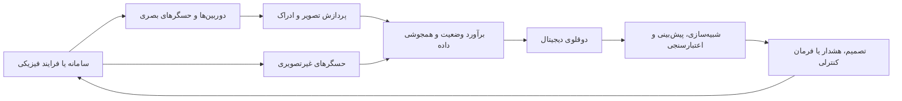
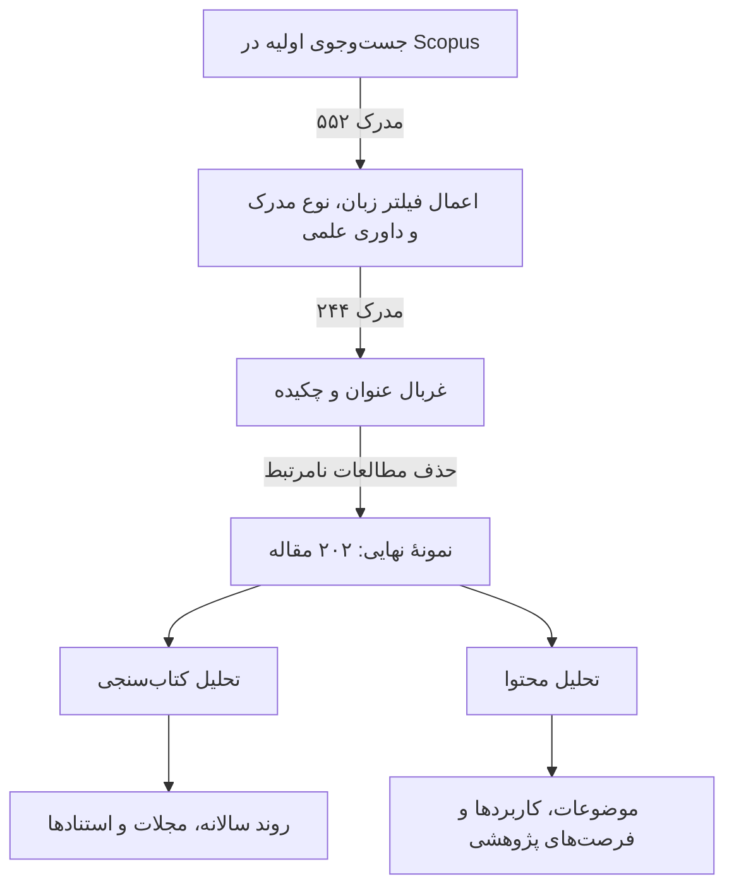
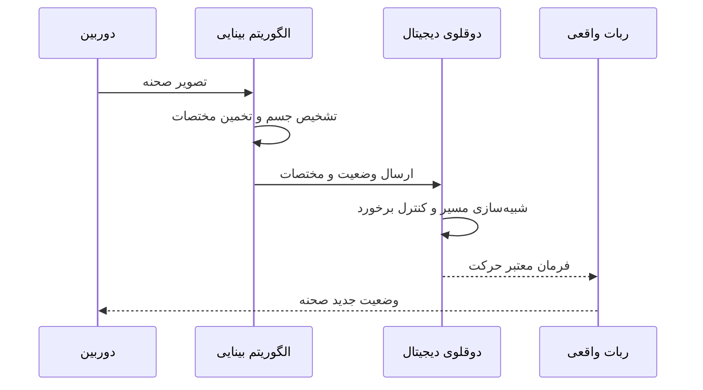
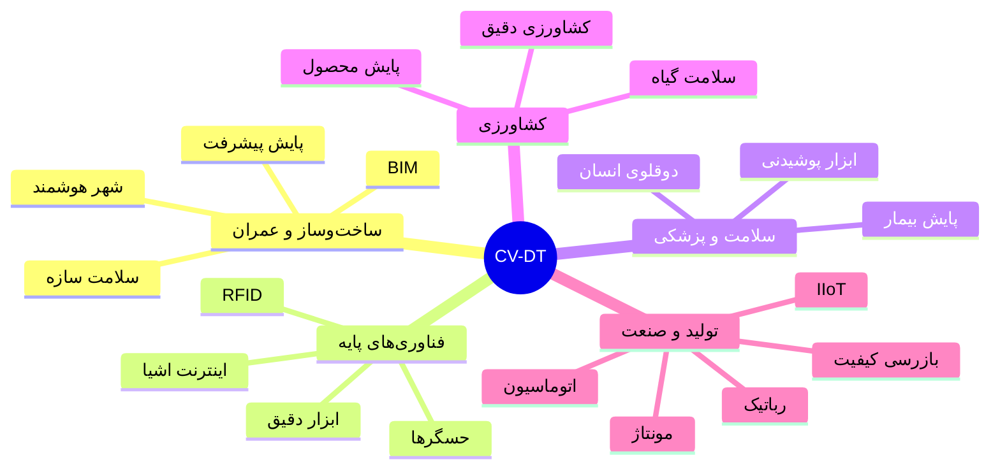
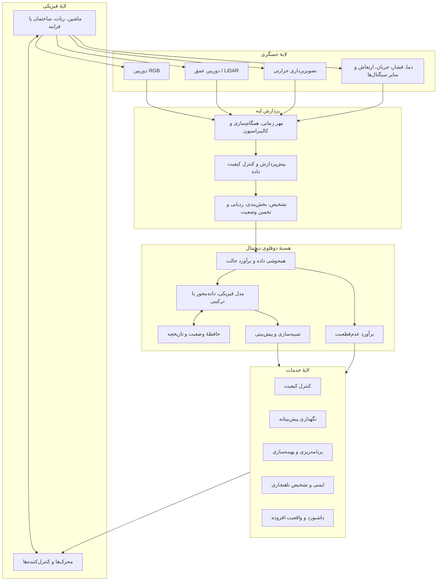

<div dir="rtl">

# دوقلوهای دیجیتال توانمندسازی‌شده با بینایی ماشین
## مرور اکتشافی ادبیات، وضعیت پژوهش و فرصت‌های آینده

> **مشخصات مقالهٔ مبنا**  
> **عنوان اصلی:** *Computer Vision-enabled Digital Twins: an Exploratory Literature Review and Research Opportunities*  
> **نویسندگان:** Gabriel Rodrigues Santos، Syed Nasir Shah، Haroon Jan Khan، Maurício Barbosa de Camargo Salles و Eduardo de Senzi Zancul  
> **محل ارائه:** چهل‌وپنجمین همایش ملی مهندسی تولید برزیل (ENEGEP 2025)، ناتال، برزیل، ۱۴ تا ۱۷ اکتبر ۲۰۲۵  
> **نوع این متن:** بازنویسی و توضیح فارسیِ جامع و مناسب برای مخزن Git/GitHub؛ ساختار و تمام نکات اصلی مقاله حفظ شده‌اند، اما متن به‌صورت تحت‌اللفظی ترجمه نشده است. مطالبی که برای تکمیل بحث افزوده شده‌اند، با برچسب **«افزودهٔ تحلیلی»** مشخص شده‌اند.

---

## فهرست مطالب

1. [چکیده](#چکیده)
2. [مقدمه](#1-مقدمه)
3. [مبانی نظری](#2-مبانی-نظری)
   - [دوقلوی دیجیتال](#21-دوقلوی-دیجیتال)
   - [بینایی ماشین](#22-بینایی-ماشین)
   - [مفهوم دوقلوی دیجیتال توانمندسازی‌شده با بینایی ماشین](#23-مفهوم-دوقلوی-دیجیتال-توانمندسازیشده-با-بینایی-ماشین)
4. [روش‌شناسی مرور ادبیات](#3-روششناسی-مرور-ادبیات)
5. [نتایج و بحث](#4-نتایج-و-بحث)
   - [روند انتشار مقالات](#41-روند-انتشار-مقالات)
   - [مجلات فعال](#42-مجلات-فعال)
   - [روند استنادها](#43-روند-استنادها)
   - [پراستنادترین مقالات](#44-پراستنادترین-مقالات)
   - [نحوهٔ هم‌افزایی بینایی ماشین و دوقلوی دیجیتال](#45-نحوهٔ-همافزایی-بینایی-ماشین-و-دوقلوی-دیجیتال)
   - [حوزه‌های کاربردی](#46-حوزههای-کاربردی)
   - [خوشه‌های اصلی پژوهش](#47-خوشههای-اصلی-پژوهش)
6. [معماری مرجع پیشنهادی](#5-معماری-مرجع-پیشنهادی-افزودهٔ-تحلیلی)
7. [صورت‌بندی ریاضی حداقلی](#6-صورتبندی-ریاضی-حداقلی-افزودهٔ-تحلیلی)
8. [چالش‌های فنی و اجرایی](#7-چالشهای-فنی-و-اجرایی-افزودهٔ-تحلیلی)
9. [فرصت‌های پژوهشی](#8-فرصتهای-پژوهشی)
10. [نقد روش‌شناسی مقاله](#9-نقد-روششناسی-مقاله-افزودهٔ-تحلیلی)
11. [جمع‌بندی](#10-جمعبندی)
12. [منابع](#منابع)

---

# چکیده

دوقلوهای دیجیتال یکی از فناوری‌های مهم صنعت ۴٫۰ هستند که با ایجاد یک نمایش دیجیتال پویا از یک دارایی، فرایند یا سامانهٔ فیزیکی، ارتباط میان جهان واقعی و محیط محاسباتی را برقرار می‌کنند. در سوی دیگر، بینایی ماشین به‌سرعت در بازرسی صنعتی، کنترل کیفیت، تشخیص اشیا، پایش فرایندها و خودکارسازی عملیات تولیدی گسترش یافته است. ترکیب این دو فناوری می‌تواند دوقلوی دیجیتال را از یک مدل وابسته به داده‌های عددی و حسگرهای متعارف، به سامانه‌ای دارای «ادراک بصری» تبدیل کند؛ سامانه‌ای که قادر است وضعیت محیط، موقعیت قطعات، عیوب ظاهری، پیشرفت عملیات و تغییرات هندسی را به‌صورت خودکار دریافت و تحلیل کند.

با وجود ظرفیت بالا، پیاده‌سازی یکپارچه و واقعی دوقلوهای دیجیتال و بینایی ماشین هنوز محدود است. دشواری طراحی معماری، ناهمگونی نرم‌افزارها و تجهیزات، همگام‌سازی زمانی داده‌ها، هزینهٔ محاسبات بلادرنگ، مقیاس‌پذیری و نبود استانداردهای مشترک از موانع مهم این مسیر هستند.

مقالهٔ مبنا برای ترسیم وضعیت این حوزه، یک مرور نظام‌مند اکتشافی انجام داده است. جست‌وجو در پایگاه Scopus تا ماه مه ۲۰۲۵ در ابتدا ۵۵۲ مدرک را بازیابی کرد. پس از اعمال فیلترها، ۲۴۴ مقاله باقی ماند و با غربال عنوان و چکیده، نمونهٔ نهایی به ۲۰۲ مقاله رسید. این مجموعه با روش‌های کتاب‌سنجی و تحلیل محتوا بررسی شد. نتایج نشان می‌دهد انتشار مقالات از سال ۲۰۱۹ تا ۲۰۲۴ به‌سرعت افزایش یافته و کاربردهای برجسته در ساخت‌وساز، تولید، مراقبت سلامت، کشاورزی، رباتیک و زیرساخت شکل گرفته‌اند.

جمع‌بندی اصلی آن است که هم‌افزایی بینایی ماشین و دوقلوی دیجیتال می‌تواند دقت، سازگاری، خودمختاری و کارایی سامانه‌های مدرن را افزایش دهد؛ اما برای تبدیل نمونه‌های آزمایشگاهی به سامانه‌های صنعتی پایدار، توسعهٔ معماری‌های استاندارد، قابلیت همکاری بین پلتفرم‌ها، الگوریتم‌های مقاوم و ارزیابی‌های مقیاس واقعی ضروری است.

**کلیدواژه‌ها:** دوقلوی دیجیتال، بینایی ماشین، بینایی رایانه‌ای، صنعت ۴٫۰، تولید هوشمند، مرور نظام‌مند ادبیات، ادراک بلادرنگ، همجوشی داده.

---

# 1. مقدمه

گذار تولید صنعتی از سامانه‌های مستقل و نیمه‌خودکار به سامانه‌های سایبرفیزیکی، نیاز به فناوری‌هایی را افزایش داده است که بتوانند وضعیت تجهیزات و فرایندها را به‌صورت پیوسته دریافت، تحلیل و پیش‌بینی کنند. در صنعت ۴٫۰، داده فقط برای ثبت تاریخچه استفاده نمی‌شود؛ بلکه باید به تصمیم، کنترل و بهینه‌سازی بلادرنگ منجر شود. دوقلوی دیجیتال یکی از فناوری‌های کلیدی برای تحقق این هدف است.

دوقلوی دیجیتال را می‌توان یک نمایش دیجیتالِ متصل به یک موجودیت فیزیکی دانست. این نمایش دیجیتال با داده‌های واقعی به‌روزرسانی می‌شود و می‌تواند برای مشاهدهٔ وضعیت، شبیه‌سازی رفتار، پیش‌بینی خرابی، بررسی سناریوها و بهینه‌سازی عملکرد به کار رود. کاربرد دوقلوهای دیجیتال به تولید محدود نیست و در سلامت، ساختمان، شهر هوشمند، کشاورزی، زنجیرهٔ تأمین و زیرساخت نیز دنبال می‌شود. با این حال، استفادهٔ صنعتی فراگیر از آن هنوز در مراحل رشد قرار دارد.

هم‌زمان، دیجیتالی‌شدن خطوط تولید باعث افزایش استفاده از بینایی ماشین شده است. بازرسی سنتی معمولاً متکی بر نیروی انسانی است و در محیط‌های پرتکرار، سریع یا خسته‌کننده، ممکن است دقت یکنواختی نداشته باشد. دوربین‌ها، حسگرهای عمق، سامانه‌های تصویربرداری و الگوریتم‌های یادگیری عمیق امکان تشخیص عیب، ردیابی قطعه، تخمین وضعیت، اندازه‌گیری ابعاد و نظارت بر ایمنی را فراهم می‌کنند.

با وجود بلوغ نسبی هر یک از دو حوزه، بررسی یکپارچهٔ دوقلوی دیجیتال و بینایی ماشین کمتر مورد توجه قرار گرفته است. بسیاری از پژوهش‌ها یا بر مدل‌سازی و شبیه‌سازی دوقلوی دیجیتال تمرکز دارند، یا بر الگوریتم‌های بینایی ماشین؛ در حالی که ارزش اصلی زمانی ایجاد می‌شود که ادراک بصری به چرخهٔ به‌روزرسانی، پیش‌بینی و کنترل دوقلوی دیجیتال متصل شود.

مقالهٔ مبنا با هدف پاسخ به این خلأ، چشم‌انداز پژوهشی «دوقلوهای دیجیتال توانمندسازی‌شده با بینایی ماشین» را مرور می‌کند. اهداف آن عبارت‌اند از:

- تشریح مبانی دوقلوی دیجیتال و بینایی ماشین؛
- تعیین روند رشد انتشارات علمی در نقطهٔ تلاقی این دو حوزه؛
- شناسایی مجلات و مقالات اثرگذار؛
- استخراج موضوعات کاربردی و خوشه‌های پژوهشی؛
- معرفی مسیرهای مناسب برای پژوهش‌های آینده.

> **افزودهٔ تحلیلی:** در یک دوقلوی دیجیتال سنتی، بسیاری از متغیرها از حسگرهای اسکالر مانند دما، جریان، فشار و ارتعاش دریافت می‌شوند. بینایی ماشین یک کانال اندازه‌گیری بسیار پُربعد به سامانه اضافه می‌کند. یک تصویر می‌تواند هم‌زمان اطلاعاتی دربارهٔ شکل، مکان، کیفیت سطح، وضعیت مونتاژ، حضور انسان و شرایط محیط ارائه کند. این غنای اطلاعاتی مهم‌ترین دلیل جذابیت ترکیب دو فناوری است، اما همان عامل، چالش‌های محاسباتی و عدم‌قطعیت را نیز افزایش می‌دهد.

---

# 2. مبانی نظری

## 2.1. دوقلوی دیجیتال

### 2.1.1. ریشهٔ تاریخی

ایدهٔ دوقلوی دیجیتال را می‌توان به فعالیت‌های فضایی دههٔ ۱۹۶۰ و مأموریت‌های آپولو نسبت داد؛ زمانی که ناسا مدل‌هایی از سامانه‌های فضایی را روی زمین نگهداری می‌کرد تا شرایط مختلف را بازسازی کرده و واکنش سامانه را ارزیابی کند. این مدل‌ها هنوز دوقلوی دیجیتال به معنای امروزی نبودند، اما منطق «همتای قابل آزمایش برای سامانهٔ واقعی» را شکل دادند.

در اوایل دههٔ ۲۰۰۰، Michael Grieves مفهوم دوقلوی دیجیتال را در زمینهٔ تولید به‌صورت رسمی‌تر مطرح کرد. هدف آن بود که مدل‌های مجازی کارخانه، محصول یا تجهیز به داده‌های واقعی متصل شوند تا عملیات پایش، خرابی‌ها پیش‌بینی و بهره‌وری افزایش یابد.

### 2.1.2. تعریف عملیاتی

دوقلوی دیجیتال یک مدل ایستا یا صرفاً سه‌بعدی نیست. برای آنکه یک مدل دیجیتال واقعاً «دوقلو» باشد، باید میان موجودیت فیزیکی و نمایش دیجیتال آن ارتباط داده‌ای وجود داشته باشد. این ارتباط می‌تواند یک‌طرفه یا دوطرفه باشد:

- **فیزیکی به دیجیتال:** حسگرها، سامانه‌های اطلاعاتی و داده‌های عملیاتی، وضعیت واقعی را به مدل منتقل می‌کنند.
- **دیجیتال به فیزیکی:** نتایج شبیه‌سازی، تصمیم‌های بهینه یا فرمان‌های کنترلی به سامانهٔ واقعی بازگردانده می‌شوند.

بنابراین، دوقلوی دیجیتال معمولاً چهار قابلیت اصلی دارد:

1. **بازنمایی:** نمایش ساختار، وضعیت و رفتار سامانهٔ فیزیکی؛
2. **همگام‌سازی:** به‌روزرسانی مدل با داده‌های جدید؛
3. **تحلیل و پیش‌بینی:** شبیه‌سازی آینده و کشف رفتارهای غیرعادی؛
4. **تصمیم و بهینه‌سازی:** پیشنهاد یا اجرای اقدام اصلاحی.

### 2.1.3. دوقلوی نمونه و دوقلوی نمونهٔ عملیاتی

Grieves و Vickers میان دو مفهوم تمایز قائل می‌شوند:

- **نمونهٔ اولیهٔ دوقلوی دیجیتال (Digital Twin Prototype یا DTP):** مدل دیجیتالی که در مرحلهٔ طراحی، پیش از تولید نمونهٔ واقعی، برای ارزیابی گزینه‌ها و رفتار محصول استفاده می‌شود.
- **نمونهٔ عملیاتی دوقلوی دیجیتال (Digital Twin Instance یا DTI):** دوقلویی که به یک دارایی فیزیکی واقعی و مشخص متصل است و در طول بهره‌برداری آن به‌روزرسانی می‌شود.

این تمایز اهمیت دارد؛ زیرا نیازهای داده‌ای، دقت مدل و نرخ به‌روزرسانی در مرحلهٔ طراحی با مرحلهٔ بهره‌برداری یکسان نیستند.

### 2.1.4. دوقلوهای دیجیتال مبتنی بر ابر

بسیاری از سازمان‌ها از زیرساخت ابری برای ذخیره‌سازی داده، اجرای شبیه‌سازی و مدیریت دوقلوها استفاده می‌کنند. نگهداری دوقلوی دیجیتال در ابر چند مزیت دارد:

- دسترسی متمرکز به داده‌ها و مدل‌ها؛
- مقیاس‌پذیری محاسباتی؛
- امکان مدیریت تعداد زیادی دارایی؛
- به‌روزرسانی نرم‌افزار و مدل به‌صورت متمرکز؛
- تحلیل تاریخی و مقایسهٔ عملکرد چند تجهیز.

با این حال، برای کاربردهای بلادرنگ، تکیهٔ کامل بر ابر ممکن است تأخیر ایجاد کند و به همین دلیل معماری‌های لبه–ابر اهمیت پیدا می‌کنند.

### 2.1.5. چارچوب‌های مفهومی

به دلیل تنوع کاربردها، چارچوب‌های متعددی برای دوقلوی دیجیتال پیشنهاد شده‌اند. یک چارچوب کامل باید بتواند ویژگی‌های زیر را پوشش دهد:

- مدل فیزیکی یا داده‌محور سامانه؛
- دریافت دادهٔ بلادرنگ؛
- سازگاری با تجهیزات و نرم‌افزارهای مختلف؛
- مدل‌سازی تعامل اجزا؛
- شبیه‌سازی و پیش‌بینی؛
- مدیریت چرخهٔ عمر؛
- ارائهٔ خدمات تحلیلی یا کنترلی.

مقاله تأکید می‌کند که دوقلوی دیجیتال فقط در تولید کاربرد ندارد و در حوزه‌هایی مانند سلامت و برنامه‌ریزی شهری نیز قابل استفاده است.

---

## 2.2. بینایی ماشین

بینایی ماشین به سامانه‌هایی گفته می‌شود که تصاویر یا ویدئو را دریافت کرده و از آن‌ها اطلاعات قابل استفاده استخراج می‌کنند. در صنعت، این فناوری برای مشاهدهٔ خودکار محیط و تبدیل دادهٔ تصویری به تصمیم عملیاتی به کار می‌رود.

### 2.2.1. تشخیص بلادرنگ اشیا

تشخیص شیء بلادرنگ شامل دو مسئله است:

1. **تشخیص نوع شیء:** تعیین اینکه در تصویر چه چیزی وجود دارد؛
2. **مکان‌یابی شیء:** تعیین موقعیت آن با جعبهٔ محدودکننده، ماسک پیکسلی یا مختصات سه‌بعدی.

در خط تولید، شیء می‌تواند یک قطعه، محصول معیوب، ابزار، ربات، اپراتور یا جزء مونتاژ باشد. دوربین‌ها و حسگرها به‌صورت پیوسته داده تولید می‌کنند و الگوریتم‌ها آن را برای تشخیص اختلاف با حالت مورد انتظار تحلیل می‌کنند.

### 2.2.2. مزایای صنعتی

ادغام دوربین و تحلیل تصویر در فرایند تولید می‌تواند مزایای زیر را ایجاد کند:

- کشف سریع عیب یا عدم انطباق؛
- کاهش ضایعات؛
- افزایش سرعت بازرسی؛
- ایجاد سابقهٔ تصویری از تولید؛
- کاهش وابستگی به بازرسی دستی؛
- امکان واکنش فوری و اصلاح فرایند؛
- پایش نقاطی که برای انسان خطرناک یا دشوار هستند.

### 2.2.3. فراتر از تشخیص شیء

> **افزودهٔ تحلیلی:** مقاله بیشتر بر تشخیص شیء تأکید دارد، اما بینایی ماشین در دوقلوی دیجیتال می‌تواند طیف گسترده‌تری از وظایف را پوشش دهد:
>
> - دسته‌بندی تصویر؛
> - بخش‌بندی معنایی و نمونه‌ای؛
> - تخمین وضعیت و جهت سه‌بعدی؛
> - ردیابی چندشیئی؛
> - بازسازی سه‌بعدی و فتوگرامتری؛
> - تخمین عمق؛
> - تشخیص فعالیت انسان؛
> - اندازه‌گیری تغییر شکل یا ترک؛
> - تشخیص ناهنجاری بدون نمونهٔ عیب؛
> - خواندن متن، کد و نشانگرهای صنعتی.

---

## 2.3. مفهوم دوقلوی دیجیتال توانمندسازی‌شده با بینایی ماشین

دوقلوی دیجیتال توانمندسازی‌شده با بینایی ماشین یا **CV-DT** سامانه‌ای است که در آن داده‌های تصویری یکی از منابع اصلی به‌روزرسانی دوقلوی دیجیتال هستند. در این سامانه، دوربین فقط یک ابزار نظارتی مستقل نیست؛ خروجی پردازش تصویر باید به مدل وضعیت، شبیه‌ساز، موتور تصمیم یا حلقهٔ کنترل دوقلو متصل شود.

تعریف پیشنهادی:

> **CV-DT یک دوقلوی دیجیتال پویا است که از اطلاعات استخراج‌شده از تصویر یا ویدئو برای مشاهده، همگام‌سازی، اعتبارسنجی، پیش‌بینی یا کنترل موجودیت فیزیکی استفاده می‌کند.**

### چرخهٔ مفهومی CV-DT



در این چرخه، بینایی ماشین نقش «ادراک» را دارد و دوقلوی دیجیتال نقش «حافظه، مدل‌سازی و استدلال» را ایفا می‌کند. ارزش واقعی از بسته‌شدن حلقهٔ میان این دو حاصل می‌شود.

---

# 3. روش‌شناسی مرور ادبیات

پژوهش مقالهٔ مبنا بر اساس دستورالعمل‌های مرور نظام‌مند Kitchenham طراحی شده است. هدف، توصیف وضعیت موجود پژوهش در زمینهٔ دوقلوهای دیجیتال توانمندسازی‌شده با بینایی ماشین بود.

## 3.1. پایگاه داده و بازهٔ زمانی

جست‌وجو در پایگاه **Scopus** انجام شد و مقالات منتشرشده تا **ماه مه ۲۰۲۵** را پوشش داد.

## 3.2. عبارت جست‌وجو

عبارت اصلی جست‌وجو به‌صورت زیر بود:

```text
("digital twin*") AND ("computer vision" OR "machine vision")
```

علامت ستاره پس از `digital twin` باعث می‌شود شکل مفرد و جمع و برخی صورت‌های نزدیک عبارت بازیابی شوند. دو اصطلاح `computer vision` و `machine vision` نیز برای پوشش ادبیات دانشگاهی و صنعتی به کار رفته‌اند.

## 3.3. نتایج اولیه و فیلترها

جست‌وجوی اولیه **۵۵۲ مدرک** را بازیابی کرد. سپس معیارهای زیر اعمال شدند:

- زبان مقاله انگلیسی باشد؛
- مقاله در مجلهٔ علمی داوری‌شده منتشر شده باشد؛
- نوع مدرک «مقالهٔ پژوهشی» یا «مقالهٔ مروری» باشد.

پس از فیلترها، تعداد مدارک به **۲۴۴ مقاله** کاهش یافت.

مقاله با آگاهی از اهمیت کنفرانس‌ها در حوزه‌های مهندسی، آن‌ها را کنار گذاشته است. استدلال نویسندگان این است که مقالات مجله‌ای معمولاً جزئیات، ارزیابی و زمینهٔ نظری کامل‌تری دارند و برای استخراج روندهای کلی مناسب‌ترند.

## 3.4. غربال عنوان و چکیده

عنوان و چکیدهٔ ۲۴۴ مقاله بررسی شد. مطالعاتی که به توسعهٔ دوقلوی دیجیتال، بینایی ماشین یا ترکیب آن‌ها ارتباط مستقیم نداشتند حذف شدند. تمرکز اصلی بر کاربردها و پیشرفت‌ها در محیط‌های زیر بود:

- تولید و صنعت ۴٫۰؛
- ساخت‌وساز و مهندسی عمران؛
- پزشکی و سلامت؛
- مهندسی و زیرساخت؛
- سایر سامانه‌های فیزیکی مرتبط.

پس از این مرحله، **۲۰۲ مقاله** در نمونهٔ نهایی باقی ماند.

## 3.5. روش تحلیل

دو دسته تحلیل روی نمونه انجام شد:

1. **تحلیل کتاب‌سنجی:** بررسی تعداد انتشارات سالانه، مجلات فعال، تعداد استنادها و مقالات پراستناد؛
2. **تحلیل محتوا:** شناسایی موضوعات، حوزه‌های کاربردی و فرصت‌های پژوهشی.

### بازطراحی شکل روش‌شناسی مقاله



---

# 4. نتایج و بحث

## 4.1. روند انتشار مقالات

نتایج نشان می‌دهد حوزهٔ CV-DT از سال ۲۰۱۹ تا ۲۰۲۴ رشد بسیار سریعی داشته است. تعداد مقالات تا پیش از ۲۰۲۱ محدود بود، اما از سال ۲۰۲۲ جهش محسوسی رخ داد و در سال ۲۰۲۴ به بیشترین مقدار رسید.

مقادیر قابل خواندن از نمودار مقاله عبارت‌اند از:

| سال | تعداد مقاله |
|---:|---:|
| ۲۰۱۹ | ۲ |
| ۲۰۲۰ | ۶ |
| ۲۰۲۱ | ۱۰ |
| ۲۰۲۲ | ۳۷ |
| ۲۰۲۳ | ۵۳ |
| ۲۰۲۴ | ۶۷ |
| ۲۰۲۵ تا ماه مه | ۲۷ |
| **جمع** | **۲۰۲** |

### نمایش متنی روند

```text
۲۰۱۹ | ██ 2
۲۰۲۰ | ██████ 6
۲۰۲۱ | ██████████ 10
۲۰۲۲ | █████████████████████████████████████ 37
۲۰۲۳ | █████████████████████████████████████████████████████ 53
۲۰۲۴ | ███████████████████████████████████████████████████████████████████ 67
۲۰۲۵ | ███████████████████████████ 27  ← فقط بخشی از سال
```

رشد از سال ۲۰۲۲ را می‌توان به بلوغ فناوری‌های مکمل مانند اینترنت اشیا، یادگیری عمیق، شبیه‌سازی بلادرنگ، زیرساخت ابری و سخت‌افزارهای پردازش تصویر مرتبط دانست. کاهش ظاهری سال ۲۰۲۵ نباید به‌عنوان افت واقعی پژوهش تفسیر شود، زیرا داده‌های این سال فقط تا ماه مه گردآوری شده‌اند و نمایه‌سازی نیز کامل نبوده است.

> **افزودهٔ تحلیلی:** بین سال‌های ۲۰۲۱ و ۲۰۲۴ تعداد مقالات از ۱۰ به ۶۷ رسیده است؛ یعنی بیش از شش برابر شده است. این رشد نشان می‌دهد موضوع از مرحلهٔ نمونه‌های محدود به سمت شکل‌گیری یک حوزهٔ مستقل حرکت می‌کند. با این حال، افزایش تعداد مقالات لزوماً معادل افزایش بلوغ صنعتی نیست؛ برای سنجش بلوغ باید تعداد استقرارهای واقعی، دسترسی به داده‌های صنعتی، مقیاس آزمایش و شاخص آمادگی فناوری نیز بررسی شوند.

---

## 4.2. مجلات فعال

جدول زیر ۱۵ مجلهٔ دارای بیشترین تعداد مقاله در نمونه را نشان می‌دهد. تعدادها از نمودار مقاله استخراج شده‌اند.

| رتبه | مجله | تعداد مقاله |
|---:|---|---:|
| ۱ | Automation in Construction | ۱۴ |
| ۲ | Sensors | ۹ |
| ۳ | IEEE Access | ۸ |
| ۴ | IEEE Journal of Radio Frequency Identification | ۶ |
| ۵ | Journal of Intelligent Manufacturing | ۶ |
| ۶ | Applied Sciences | ۵ |
| ۷ | Linguistic and Philosophical Investigations | ۴ |
| ۸ | Robotics and Computer-Integrated Manufacturing | ۳ |
| ۹ | IEEE Robotics and Automation Letters | ۳ |
| ۱۰ | International Journal of Advanced Manufacturing Technology | ۳ |
| ۱۱ | Buildings | ۳ |
| ۱۲ | Engineering Structures | ۳ |
| ۱۳ | IEEE Transactions on Industrial Informatics | ۳ |
| ۱۴ | International Journal of Computer Assisted Radiology and Surgery | ۲ |
| ۱۵ | Advances in Structural Engineering | ۲ |

صدرنشینی **Automation in Construction** نشان می‌دهد محیط ساخته‌شده، ساختمان، BIM، پایش پیشرفت ساخت و مدیریت زیرساخت از نخستین حوزه‌هایی هستند که ترکیب بینایی ماشین و دوقلوی دیجیتال را به‌صورت جدی دنبال کرده‌اند.

حضور **Sensors** و **IEEE Access** نیز ماهیت چندرشته‌ای حوزه را نشان می‌دهد. CV-DT در مرز میان پردازش تصویر، حسگرها، اینترنت اشیا، رباتیک، شبیه‌سازی و مهندسی کاربردی قرار دارد؛ در نتیجه، پژوهش‌ها در مجلات عمومی‌تر و میان‌رشته‌ای نیز منتشر می‌شوند.

نویسندگان مقاله یک نکتهٔ انتقادی مطرح می‌کنند: حجم انتشار بالا همیشه با اثر علمی بالا همبستگی ندارد. ممکن است رشد تعداد مقاله ناشی از افزایش واقعی نوآوری باشد، اما ممکن است بخشی از آن از گسترش مجلات پُرحجم و پراکندگی موضوعی ناشی شود. بنابراین، تعداد مقاله به‌تنهایی معیار مناسبی برای سنجش پیشرفت نظری یا کیفیت روش‌شناختی نیست.

> **افزودهٔ تحلیلی:** برای ارزیابی دقیق‌تر یک حوزه باید چند شاخص هم‌زمان بررسی شوند: کیفیت داده و آزمایش، تازگی روش، قابلیت بازتولید، تعداد استناد نرمال‌شده بر اساس عمر مقاله، انتشار کد و داده، و شواهد استقرار صنعتی. در CV-DT، مقاله‌ای که فقط یک مدل تشخیص شیء را در کنار یک مدل سه‌بعدی قرار می‌دهد، الزاماً یک دوقلوی دیجیتال کامل ایجاد نکرده است.

---

## 4.3. روند استنادها

مقاله مجموع استنادهای منتسب به مقالات منتشرشده در سال‌های مختلف را گزارش می‌کند:

| سال انتشار مقالات | مجموع استناد گزارش‌شده |
|---:|---:|
| ۲۰۱۹ | ۱۶۸ |
| ۲۰۲۰ | ۳۰۷ |
| ۲۰۲۱ | ۸۵۳ |
| ۲۰۲۲ | ۱۲۰۳ |
| ۲۰۲۳ | ۸۰۳ |
| ۲۰۲۴ | ۴۸۴ |
| ۲۰۲۵ | ۴۸ |

بیشترین مقدار به مقالات سال ۲۰۲۲ تعلق دارد. مقالهٔ مبنا کاهش مقادیر در سال‌های بعد را نشانهٔ کاهش توجه تلقی می‌کند؛ اما این برداشت باید با احتیاط انجام شود.

> **افزودهٔ تحلیلی و اصلاح تفسیری:** مقالات جدیدتر زمان بسیار کمتری برای دریافت استناد داشته‌اند. بنابراین، پایین‌بودن استنادهای ۲۰۲۴ و ۲۰۲۵ عمدتاً می‌تواند ناشی از «پنجرهٔ استنادی کوتاه» باشد، نه کاهش اهمیت علمی. مقایسهٔ منصفانه‌تر باید با شاخص‌هایی مانند استناد سالانه، استناد نرمال‌شده نسبت به سال انتشار یا تحلیل هم‌دوره‌ای انجام شود. خود جدول مقالات پراستناد نیز نشان می‌دهد برخی مقالات جدید، نرخ استناد سالانهٔ بالایی دارند.

---

## 4.4. پراستنادترین مقالات

ده مقالهٔ پراستناد نمونه در جدول زیر آمده‌اند:

| رتبه | عنوان مقاله | سال | کل استناد | استناد در سال |
|---:|---|---:|---:|---:|
| ۱ | Roles of Artificial Intelligence in Construction Engineering and Management: A Critical Review | ۲۰۲۱ | ۷۱۲ | ۱۷۸٫۰ |
| ۲ | Intelligent Small Object Detection for Digital Twin Perception in Industrial Logistics | ۲۰۲۲ | ۲۱۷ | ۷۲٫۳ |
| ۳ | Agrilora: A Digital Twin Framework for Smart Agriculture | ۲۰۲۰ | ۱۲۳ | ۲۴٫۶ |
| ۴ | Sustainable and Flexible Industrial Human Machine Interface (HMI) for Digital Twin | ۲۰۱۹ | ۱۰۹ | ۱۸٫۲ |
| ۵ | Computer Vision-based Construction Progress Monitoring Using Deep Learning and Digital Twins | ۲۰۲۲ | ۱۰۱ | ۳۳٫۷ |
| ۶ | Digital Twin-driven Smart Manufacturing: Connotation, Reference Model, Applications and Research Issues | ۲۰۲۲ | ۹۸ | ۳۲٫۷ |
| ۷ | SmartSteelFactory: A Digital Twin Framework for Steel Industry 4.0 | ۲۰۲۳ | ۹۱ | ۴۵٫۵ |
| ۸ | Applications of Digital Twins in the Built Environment: A Systematic Review | ۲۰۲۰ | ۹۰ | ۱۸٫۰ |
| ۹ | A Review on Digital Twin Applications in Manufacturing | ۲۰۲۱ | ۸۷ | ۲۱٫۸ |
| ۱۰ | Digital Twin and Smart Product-Service Systems: A Comprehensive Review | ۲۰۲۱ | ۸۴ | ۲۱٫۰ |

پراستنادترین مقاله دربارهٔ نقش هوش مصنوعی در مهندسی و مدیریت ساخت است. این موضوع بار دیگر پیوند قوی میان هوش مصنوعی، ساخت‌وساز، بینایی ماشین و دوقلوی دیجیتال را نشان می‌دهد.

مقالات جدول حوزه‌های متنوعی را پوشش می‌دهند:

- لجستیک صنعتی و تشخیص اشیای کوچک؛
- کشاورزی هوشمند؛
- رابط انسان–ماشین؛
- پایش پیشرفت ساخت؛
- تولید هوشمند؛
- صنعت فولاد؛
- محیط ساخته‌شده؛
- سامانه‌های محصول–خدمت هوشمند.

با وجود تنوع کاربرد، چند مضمون مشترک در آن‌ها مشاهده می‌شود:

1. **یکپارچه‌سازی سامانه‌ها** به‌جای توسعهٔ یک الگوریتم منفرد؛
2. **ادراک بلادرنگ** از وضعیت فیزیکی؛
3. **یادگیری عمیق** برای استخراج اطلاعات از داده‌های پیچیده؛
4. **چارچوب یا مدل مرجع** قابل استفاده در چند سناریو؛
5. **اتصال داده به تصمیم و عملیات**.

این مقالات نقش زیربنایی در شکل‌گیری ادبیات CV-DT داشته‌اند و مسیرهای بعدی پژوهش را تحت تأثیر قرار داده‌اند.

---

## 4.5. نحوهٔ هم‌افزایی بینایی ماشین و دوقلوی دیجیتال

دوقلوی دیجیتال با استفاده از دادهٔ بلادرنگ، وضعیت سامانهٔ فیزیکی را بازتاب می‌دهد، رفتار آینده را پیش‌بینی می‌کند و امکان آزمایش سناریوها را فراهم می‌سازد. بینایی ماشین در این چارچوب سه نقش پایه دارد:

1. **دریافت داده:** تصویربرداری از محیط، تجهیز، محصول یا انسان؛
2. **استخراج اطلاعات:** تشخیص، مکان‌یابی، اندازه‌گیری، ردیابی یا تشخیص ناهنجاری؛
3. **اعتبارسنجی مدل:** مقایسهٔ وضعیت مشاهده‌شده با وضعیت مورد انتظار در دوقلو.

### نمونهٔ سامانهٔ برداشتن و قراردادن

مقاله به کار Jakhotiya و همکاران اشاره می‌کند. در آن پژوهش، یک سامانهٔ برداشتن و قراردادن با ترکیب MATLAB و Tecnomatix Process Simulate ایجاد شده است:

1. دوربین موقعیت جسم را مشاهده می‌کند؛
2. الگوریتم بینایی مختصات جسم را استخراج می‌کند؛
3. مختصات به محیط شبیه‌سازی منتقل می‌شود؛
4. دوقلوی دیجیتال حرکت ربات را پیش از اجرا بررسی می‌کند؛
5. در صورت معتبر بودن مسیر، فرمان به سامانهٔ واقعی داده می‌شود.



این حلقه باعث کاهش مداخلهٔ انسانی، افزایش دقت و کاهش خطای راه‌اندازی می‌شود.

### نقش اینترنت اشیا و یادگیری ماشین

در چارچوب‌های پیشرفته، دادهٔ تصویری با دادهٔ حسگرهای اینترنت اشیا و مدل‌های یادگیری ماشین ترکیب می‌شود. در نتیجه، دوقلو فقط وضعیت فعلی را نمایش نمی‌دهد، بلکه می‌تواند الگوهای خرابی، کاهش کیفیت یا تغییر رفتار را نیز تشخیص دهد.

> **افزودهٔ تحلیلی:** ادراک بصری به‌تنهایی همیشه قابل اعتماد نیست. نور، انسداد، انعکاس، لرزش دوربین و تغییر زاویه می‌توانند خروجی مدل را مختل کنند. به همین دلیل، دوقلوی دیجیتال می‌تواند به‌عنوان یک «قید زمینه‌ای» عمل کند. برای مثال، اگر مدل فیزیکی نشان دهد قطعه فقط در محدودهٔ مشخصی می‌تواند حرکت کند، تخمین بصری خارج از آن محدوده را می‌توان رد یا اصلاح کرد. بنابراین، رابطه فقط «بینایی به دوقلو» نیست؛ مدل دوقلو نیز می‌تواند کیفیت ادراک بصری را افزایش دهد.

---

## 4.6. حوزه‌های کاربردی

### 4.6.1. تولید و مونتاژ

CV-DT می‌تواند وظایف تکراری را خودکار کرده و دقت تولید را افزایش دهد. کاربردهای اصلی عبارت‌اند از:

- تشخیص قطعه و تعیین موقعیت آن؛
- بررسی کامل‌بودن مونتاژ؛
- کنترل کیفیت سطح؛
- اعتبارسنجی ترتیب عملیات؛
- پایش حرکت ربات و انسان؛
- بررسی امکان‌پذیری عملیات پیش از اجرا؛
- مقایسهٔ محصول واقعی با مدل CAD یا وضعیت مرجع.

در رباتیک مشارکتی، بینایی ماشین موقعیت اشیا و انسان را تعیین می‌کند و دوقلوی دیجیتال پیش از اجرای حرکت، امکان‌پذیری و ایمنی آن را می‌سنجد.

### 4.6.2. نگهداری و تعمیرات پیش‌بینانه

ترکیب تصویر و دوقلو می‌تواند علائم اولیهٔ خرابی را آشکار کند. نمونه‌ها:

- تشخیص ترک، خوردگی یا تغییر رنگ؛
- بررسی سایش ابزار؛
- پایش تغییر شکل مکانیکی؛
- تشخیص نشتی قابل مشاهده؛
- مقایسهٔ روند ظاهری خرابی با مدل فرسودگی.

دوقلو می‌تواند وضعیت فرسایش را شبیه‌سازی کند و زمان احتمالی خرابی یا نیاز به تعمیر را تخمین بزند. در نتیجه، توقف ناگهانی کاهش یافته و برنامهٔ تعمیرات دقیق‌تر می‌شود.

### 4.6.3. پایش زیرساخت

دوربین‌های با وضوح بالا، پهپادها و تصویربرداری سه‌بعدی برای بررسی پل، ساختمان، تونل و سایر زیرساخت‌ها قابل استفاده‌اند. ناهنجاری‌های مشاهده‌شده وارد دوقلوی دیجیتال می‌شوند و سناریوهای تعمیر یا گسترش خرابی در آن بررسی می‌گردند.

### 4.6.4. ساخت‌وساز

در پروژه‌های ساخت، بینایی ماشین می‌تواند تصاویر کارگاه را با مدل BIM مقایسه کند تا میزان پیشرفت، تأخیر یا اختلاف اجرایی مشخص شود. دوقلوی دیجیتال نیز نمایی به‌روز از وضعیت پروژه ایجاد می‌کند.

### 4.6.5. سلامت و دوقلوی انسان

در حوزهٔ پزشکی، تصاویر، ویدئو، ابزارهای پوشیدنی و داده‌های فیزیولوژیک می‌توانند برای ساخت مدل‌های دیجیتال از اندام یا وضعیت بیمار به کار روند. کاربردهای مطرح‌شده شامل پایش وضعیت سلامت و توسعهٔ دوقلوی دیجیتال انسان است.

### 4.6.6. کشاورزی هوشمند

در کشاورزی، تصاویر مزرعه، گیاه یا محصول برای ارزیابی سلامت، رشد، آفت، تنش آبی و شرایط محیطی استفاده می‌شوند. دوقلوی دیجیتال می‌تواند این داده‌ها را با مدل رشد و داده‌های اقلیمی ترکیب کند و تصمیم‌هایی مانند آبیاری، کوددهی یا زمان برداشت را بهبود دهد.

---

## 4.7. خوشه‌های اصلی پژوهش

مقاله پنج گروه اصلی را در ادبیات شناسایی می‌کند.



### خوشهٔ اول: ساخت‌وساز و مهندسی عمران

این خوشه شامل ادغام دوقلوهای دیجیتال با BIM، ساختمان هوشمند، شهر هوشمند، پایش پیشرفت و بررسی سلامت سازه است. مجلاتی مانند *Automation in Construction*، *Buildings* و *Advances in Structural Engineering* در این گروه قرار می‌گیرند.

مقالهٔ Zhou و همکاران در سال ۲۰۲۵ نمونه‌ای از چارچوبی است که چند دوربین را با مدل اطلاعات ساختمان ترکیب می‌کند تا یک دوقلوی ساختمانی به‌روز ایجاد شود.

### خوشهٔ دوم: فناوری‌های پایه و ابزار دقیق

این گروه بر حسگرها، RFID، شبکهٔ ارتباطی، ابزار دقیق و زیرساخت فنی تمرکز دارد. بدون این لایه، ارتباط پایدار میان محیط واقعی و مدل دیجیتال ممکن نیست.

### خوشهٔ سوم: سلامت و پزشکی

موضوعاتی مانند ابزارهای پوشیدنی، پایش وضعیت بیمار، پردازش تصویر پزشکی و دوقلوی دیجیتال انسان در این خوشه قرار دارند.

### خوشهٔ چهارم: کشاورزی

این حوزه شامل کشاورزی دقیق، پایش بلادرنگ گیاه، تشخیص بیماری، ارزیابی سلامت محصول و ترکیب تصویر با داده‌های محیطی است.

### خوشهٔ پنجم: تولید و کاربردهای صنعتی

این خوشه شامل رباتیک پیشرفته، اتوماسیون، اینترنت صنعتی اشیا، بازرسی کیفیت، تولید و مونتاژ است. مجلات شاخص آن شامل *Journal of Intelligent Manufacturing*، *Robotics and Computer-Integrated Manufacturing* و *IEEE Transactions on Industrial Informatics* هستند.

نویسندگان این خوشه را به صنعت ۴٫۰، تولید هوشمند، زنجیرهٔ تأمین هوشمند، محصول هوشمند و کار هوشمند مرتبط می‌دانند. ویژگی تعیین‌کننده، جریان ارتباطی دوسویه‌ای است که دوقلوی دیجیتال میان جهان فیزیکی و دیجیتال ایجاد می‌کند.

---

# 5. معماری مرجع پیشنهادی — افزودهٔ تحلیلی

مقاله به نیاز معماری استاندارد اشاره می‌کند، اما یک معماری فنی کامل ارائه نمی‌دهد. شکل زیر یک معماری مرجع برای CV-DT پیشنهاد می‌کند.



## 5.1. لایهٔ فیزیکی

شامل دارایی واقعی، تجهیزات، محیط، انسان، ربات و کنترل‌کننده‌ها است. دوقلو باید دقیقاً مشخص کند همتای کدام موجودیت یا سطح از سامانه است: یک قطعه، یک دستگاه، یک سلول تولید، یک خط یا کل کارخانه.

## 5.2. لایهٔ حسگری

ممکن است شامل دوربین معمولی، استریو، عمق، حرارتی، فراطیفی، LiDAR و حسگرهای غیرتصویری باشد. انتخاب حسگر باید بر اساس متغیر مورد نیاز انجام شود، نه صرفاً در دسترس‌بودن دوربین.

## 5.3. لایهٔ پردازش لبه

پردازش اولیه نزدیک به منبع داده انجام می‌شود تا تأخیر و حجم انتقال کاهش یابد. وظایف مهم عبارت‌اند از:

- همگام‌سازی زمانی؛
- کالیبراسیون دوربین و دستگاه؛
- حذف فریم‌های خراب؛
- فشرده‌سازی یا انتخاب فریم؛
- استنتاج مدل بینایی؛
- ناشناس‌سازی داده‌های حساس.

## 5.4. هستهٔ دوقلوی دیجیتال

هسته باید مدل وضعیت فعلی، تاریخچه، مدل رفتاری و موتور پیش‌بینی را نگهداری کند. مدل می‌تواند یکی از حالت‌های زیر باشد:

- فیزیک‌مبنا؛
- داده‌محور؛
- مبتنی بر قواعد؛
- ترکیبی فیزیک و یادگیری ماشین.

## 5.5. لایهٔ خدمات

خروجی دوقلو باید به یک خدمت قابل استفاده تبدیل شود: هشدار، گزارش، توصیه، بهینه‌سازی، تصمیم نگهداری یا فرمان کنترلی. بدون این لایه، سامانه صرفاً یک نمایشگر پیشرفته خواهد بود.

---

# 6. صورت‌بندی ریاضی حداقلی — افزودهٔ تحلیلی

برای بیان دقیق‌تر مسئله، سامانهٔ فیزیکی را می‌توان با مدل حالت زیر نمایش داد:

$$
\mathbf{x}_{t+1}=f(\mathbf{x}_t,\mathbf{u}_t,\mathbf{w}_t)
$$

که در آن:

- $\mathbf{x}_t$ حالت واقعی سامانه در زمان $t$ است؛
- $\mathbf{u}_t$ ورودی یا فرمان کنترلی است؛
- $\mathbf{w}_t$ اغتشاش فرایند است؛
- $f(\cdot)$ دینامیک سامانه را نمایش می‌دهد.

دادهٔ بصری پس از پردازش به یک بردار مشاهده تبدیل می‌شود:

$$
\mathbf{y}^{v}_t=h_v(\mathbf{x}_t)+\mathbf{v}_t
$$

و دادهٔ حسگرهای غیرتصویری به‌صورت زیر است:

$$
\mathbf{y}^{s}_t=h_s(\mathbf{x}_t)+\mathbf{n}_t
$$

در این روابط، $\mathbf{v}_t$ و $\mathbf{n}_t$ عدم‌قطعیت و نویز اندازه‌گیری هستند. دوقلوی دیجیتال باید با استفاده از همهٔ مشاهدات، حالت سامانه را تخمین بزند:

$$
\hat{\mathbf{x}}_t=
\mathcal{F}\left(
\hat{\mathbf{x}}_{t-1},
\mathbf{y}^{v}_t,
\mathbf{y}^{s}_t,
\mathbf{u}_{t-1}
\right)
$$

سپس مدل دوقلو می‌تواند پیش‌بینی چندگام آینده را تولید کند:

$$
\hat{\mathbf{x}}_{t+k|t}=\mathcal{M}^{(k)}(\hat{\mathbf{x}}_t,\mathbf{u}_{t:t+k-1})
$$

و تصمیم مناسب بر اساس وضعیت تخمینی، پیش‌بینی و عدم‌قطعیت گرفته شود:

$$
\mathbf{u}_t=\pi\left(
\hat{\mathbf{x}}_t,
\hat{\mathbf{x}}_{t+1:t+H},
\boldsymbol{\Sigma}_t
\right)
$$

که $\boldsymbol{\Sigma}_t$ عدم‌قطعیت برآورد و $H$ افق پیش‌بینی است.

## 6.1. همگام‌سازی زمانی

یکی از مسائل مهم، اختلاف زمانی تصویر و سایر حسگرها است:

$$
\Delta t_{\text{sync}}=
\left|t_{\text{image}}-t_{\text{sensor}}\right|
$$

اگر این اختلاف نسبت به سرعت دینامیک سامانه بزرگ باشد، دوقلو ممکن است داده‌هایی از دو وضعیت متفاوت را با یکدیگر ترکیب کند.

## 6.2. سنجهٔ وفاداری دوقلو

یک معیار ساده برای خطای همگام‌سازی حالت می‌تواند به‌صورت زیر تعریف شود:

$$
E_{\text{twin}}=
\frac{1}{T}
\sum_{t=1}^{T}
\left\|\mathbf{x}_t-\hat{\mathbf{x}}_t\right\|_2^2
$$

در عمل، چون همهٔ مؤلفه‌های حالت واقعی قابل اندازه‌گیری نیستند، باید از متغیرهای مرجع یا آزمایش‌های کالیبراسیون استفاده شود.

## 6.3. نکتهٔ مهم دربارهٔ خروجی بینایی

خروجی مدل بینایی نباید فقط یک برچسب قطعی باشد. بهتر است همراه با احتمال یا عدم‌قطعیت به دوقلو منتقل شود. برای مثال:

$$
P(c_i\mid I_t),\qquad
\hat{\mathbf{p}}_i,\qquad
\Sigma_{\mathbf{p}_i}
$$

که به‌ترتیب احتمال کلاس، موقعیت تخمینی و عدم‌قطعیت موقعیت شیء $i$ هستند. این اطلاعات به دوقلو اجازه می‌دهند تصمیم‌های محافظه‌کارانه‌تری بگیرد.

---

# 7. چالش‌های فنی و اجرایی — افزودهٔ تحلیلی

## 7.1. همگام‌سازی زمانی و مکانی

داده‌های تصویری و سیگنال‌های حسگر ممکن است نرخ نمونه‌برداری، تأخیر و مهر زمانی متفاوت داشته باشند. علاوه بر آن، مختصات دوربین باید به دستگاه مختصات مدل سه‌بعدی یا ربات تبدیل شود. خطای کالیبراسیون می‌تواند باعث انتقال نادرست وضعیت به دوقلو شود.

## 7.2. بلادرنگ‌بودن

مدل‌های بینایی عمیق ممکن است محاسبات سنگینی داشته باشند. در یک حلقهٔ کنترلی، تأخیر فقط زمان استنتاج شبکه نیست و شامل موارد زیر است:

$$
T_{\text{total}}=
T_{\text{capture}}+
T_{\text{transfer}}+
T_{\text{preprocess}}+
T_{\text{inference}}+
T_{\text{fusion}}+
T_{\text{simulation}}+
T_{\text{actuation}}
$$

اگر زمان کل از محدودیت فرایند بیشتر باشد، سامانه دیگر بلادرنگ محسوب نمی‌شود.

## 7.3. تغییر دامنه و فرسایش مدل

مدل بینایی ممکن است در زمان آموزش دقت مناسبی داشته باشد، اما با تغییر نور، دوربین، محصول، رنگ، سرعت خط یا شرایط محیطی دچار افت شود. دوقلو باید سازوکاری برای پایش کیفیت مدل و تشخیص فرسایش داده داشته باشد.

## 7.4. انسداد و مشاهده‌پذیری ناقص

در محیط واقعی، بخشی از جسم ممکن است پشت ابزار، انسان یا تجهیز پنهان شود. استفاده از چند دوربین، حسگر عمق یا مدل دینامیکی دوقلو می‌تواند مشاهده‌پذیری را افزایش دهد.

## 7.5. مقیاس‌پذیری

یک نمونهٔ آزمایشگاهی با یک دوربین و یک ربات با کارخانه‌ای دارای صدها دوربین تفاوت اساسی دارد. مسائل اصلی عبارت‌اند از:

- پهنای باند شبکه؛
- ذخیره‌سازی ویدئو؛
- مدیریت نسخهٔ مدل‌ها؛
- پردازش هم‌زمان؛
- مدیریت هویت دارایی‌ها؛
- معماری چنددوقلویی و سلسله‌مراتبی.

## 7.6. قابلیت همکاری و استانداردسازی

پلتفرم‌های CAD، BIM، شبیه‌ساز، PLC، سامانه‌های MES، پایگاه‌های داده و چارچوب‌های هوش مصنوعی از قالب‌ها و مدل‌های اطلاعاتی متفاوت استفاده می‌کنند. نبود مدل معنایی مشترک، اتصال اجزا را پرهزینه و شکننده می‌کند.

## 7.7. امنیت و حریم خصوصی

دادهٔ تصویری ممکن است شامل چهره، رفتار کارکنان، طراحی محصول یا اطلاعات حساس کارخانه باشد. علاوه بر حملات سایبری متعارف، مدل بینایی در برابر حملات خصمانه، دست‌کاری تصویر و جعل داده آسیب‌پذیر است.

## 7.8. ایمنی حلقهٔ بسته

در کاربردهایی که خروجی دوقلو مستقیماً به ربات یا کنترل‌کننده ارسال می‌شود، خطای تشخیص می‌تواند پیامد فیزیکی داشته باشد. بنابراین باید از محدودیت‌های ایمنی، کنترل نظارتی، حالت توقف امن و تأیید چندمنبعی استفاده شود.

## 7.9. کمبود داده و برچسب

جمع‌آوری نمونهٔ خرابی یا عیب واقعی دشوار است. تصاویر صنعتی ممکن است محرمانه باشند و توزیع کلاس‌ها نیز نامتوازن باشد. دادهٔ مصنوعی تولیدشده در دوقلو می‌تواند کمک کند، اما شکاف شبیه‌سازی تا واقعیت باید مدیریت شود.

## 7.10. تعریف مبهم «دوقلوی دیجیتال»

برخی سامانه‌ها یک مدل سه‌بعدی یا داشبورد را دوقلوی دیجیتال می‌نامند، حتی اگر همگام‌سازی پویا، مدل رفتاری یا حلقهٔ بازخورد نداشته باشند. پژوهش باید سطح بلوغ دوقلو را صریح گزارش کند.

---

# 8. فرصت‌های پژوهشی

مقاله پنج حوزهٔ کاربردی را به‌عنوان مسیرهای اصلی معرفی می‌کند و بر قابلیت همکاری، معماری استاندارد و کاربردهای صنعتی مقاوم تأکید دارد. بر اساس نتایج مقاله، فرصت‌ها را می‌توان دقیق‌تر به محورهای زیر گسترش داد.

## 8.1. دوقلوهای دیجیتال چندوجهی

ترکیب تصویر با ارتعاش، صوت، جریان، دما، فشار و دادهٔ متنی می‌تواند برآورد وضعیت را مقاوم‌تر کند. پرسش کلیدی این است که همجوشی در چه سطحی انجام شود:

- همجوشی دادهٔ خام؛
- همجوشی ویژگی؛
- همجوشی تصمیم؛
- همجوشی مبتنی بر مدل حالت.

## 8.2. دوقلوهای فیزیک‌آگاه و بینایی‌آگاه

مدل‌های فیزیکی می‌توانند خروجی بینایی را مقید کنند و دادهٔ بصری نیز پارامترهای مدل فیزیکی را به‌روز کند. این رابطهٔ دوسویه، مسیر مناسبی برای کاهش نیاز به داده و افزایش تعمیم‌پذیری است.

## 8.3. بازسازی سه‌بعدی پویا

بسیاری از دوقلوها از مدل هندسی ایستا استفاده می‌کنند. بازسازی سه‌بعدی بلادرنگ با چند دوربین، NeRF، Gaussian Splatting، LiDAR یا SLAM می‌تواند هندسهٔ دوقلو را به‌صورت پیوسته به‌روز کند.

## 8.4. یادگیری با دادهٔ مصنوعی و انتقال شبیه‌سازی به واقعیت

دوقلوی دیجیتال می‌تواند تصاویر برچسب‌خوردهٔ مصنوعی تولید کند. این تصاویر برای آموزش مدل‌های تشخیص قابل استفاده‌اند، اما باید روش‌هایی برای کاهش شکاف ظاهری و فیزیکی میان شبیه‌سازی و واقعیت توسعه یابد.

## 8.5. عدم‌قطعیت و تصمیم‌گیری ریسک‌محور

به‌جای خروجی قطعی، مدل باید عدم‌قطعیت ادراک، مدل و پیش‌بینی را گزارش کند. تصمیم کنترلی یا نگهداری باید با توجه به ریسک خطا گرفته شود.

## 8.6. یادگیری پیوسته و مدیریت فرسایش

سامانه باید بتواند تغییر محصول، شرایط محیط و فرایند را تشخیص دهد و بدون فراموش‌کردن دانش قبلی، مدل خود را به‌روز کند.

## 8.7. پردازش لبه–ابر

تقسیم وظایف میان دوربین هوشمند، گرهٔ لبه و ابر یک مسئلهٔ بهینه‌سازی است. پردازش لبه تأخیر را کاهش می‌دهد، در حالی که ابر منابع بیشتر و دید سراسری فراهم می‌کند.

## 8.8. امنیت دوقلوی بصری

پژوهش‌های آینده باید حملات زیر را در نظر بگیرند:

- تزریق فریم جعلی؛
- دست‌کاری برچسب یا مدل؛
- حملهٔ خصمانه به شبکهٔ بینایی؛
- تغییر مهر زمانی؛
- جعل وضعیت دوقلو؛
- نفوذ به کانال فرمان.

## 8.9. معیارها و بنچمارک‌های استاندارد

فقط گزارش mAP یا دقت تشخیص کافی نیست. ارزیابی یک CV-DT باید چندلایه باشد:

| لایه | معیارهای نمونه |
|---|---|
| بینایی | mAP، IoU، F1، خطای موقعیت، نرخ ردیابی |
| زمان | تأخیر انتها به انتها، نرخ به‌روزرسانی، jitter |
| دوقلو | خطای حالت، خطای پیش‌بینی، وفاداری مدل |
| عملیات | کاهش توقف، کاهش ضایعات، افزایش OEE |
| قابلیت اطمینان | نرخ هشدار کاذب، دسترس‌پذیری، مقاومت در برابر خرابی حسگر |
| مقیاس | تعداد دارایی، دوربین و جریان دادهٔ قابل پشتیبانی |

## 8.10. دوقلوی انسان و تعامل انسان–ماشین

بینایی ماشین امکان تخمین وضعیت، حرکت و ارگونومی انسان را فراهم می‌کند. باید مرز میان کمک به ایمنی و نظارت مداخله‌گرانه به‌دقت تعریف شود. حریم خصوصی و رضایت کارکنان بخشی از طراحی سامانه هستند، نه موضوعاتی فرعی.

## 8.11. توضیح‌پذیری

در محیط صنعتی، اپراتور باید بداند چرا سامانه یک عیب یا خطر را اعلام کرده است. اتصال تصویر، ناحیهٔ مورد توجه، وضعیت دوقلو و دلیل تصمیم می‌تواند اعتماد و قابلیت عیب‌یابی را افزایش دهد.

## 8.12. اعتبارسنجی در مقیاس صنعتی

بخش مهمی از ادبیات هنوز در سطح نمونهٔ اولیه یا محیط کنترل‌شده است. پژوهش‌های آینده باید موارد زیر را گزارش کنند:

- مدت اجرای پیوسته؛
- حجم و تنوع داده؛
- تعداد دارایی‌ها؛
- شرایط خطا و بازیابی؛
- هزینهٔ محاسبات و نگهداری؛
- مقایسه با روش موجود کارخانه؛
- اثر واقعی بر شاخص‌های عملکرد.

---

## 8.13. ماتریس پیشنهادی فرصت‌های پژوهشی — افزودهٔ تحلیلی

| شکاف پژوهشی | سؤال نمونه | روش‌های مناسب | معیار ارزیابی |
|---|---|---|---|
| همجوشی تصویر و سیگنال | چگونه تصویر، ارتعاش و جریان برای تخمین حالت ترکیب شوند؟ | فیلتر بیزین، ترنسفورمر چندوجهی، GNN | RMSE حالت، تأخیر، پایداری در خرابی حسگر |
| فیزیک‌آگاهی | چگونه قیود فیزیکی خطاهای ادراک بصری را اصلاح کنند؟ | PINN، فیلتر مقید، مدل هیبرید | نرخ نقض قید، تعمیم خارج از توزیع |
| همگام‌سازی | چه مقدار اختلاف زمانی قابل قبول است؟ | time alignment، interpolation، event-based fusion | خطای حالت در برابر jitter |
| دادهٔ مصنوعی | چه میزان دادهٔ مصنوعی برای آموزش کافی است؟ | domain randomization، adaptation | افت دقت sim-to-real |
| عدم‌قطعیت | چگونه عدم‌قطعیت به تصمیم عملیاتی منتقل شود؟ | Bayesian DL، ensembles، conformal prediction | calibration، ریسک تصمیم |
| امنیت | حملهٔ بصری چگونه وضعیت دوقلو را منحرف می‌کند؟ | adversarial training، sensor fusion | نرخ کشف حمله، افت عملکرد |
| مقیاس‌پذیری | چگونه صدها جریان ویدئویی مدیریت شوند؟ | edge orchestration، model compression | throughput، مصرف انرژی، هزینه |
| یادگیری پیوسته | چگونه مدل با تغییر محصول سازگار شود؟ | continual learning، active learning | forgetting، نیاز به برچسب |

---

## 8.14. پیشنهادهای ویژه برای پژوهش با دید پردازش سیگنال و هوش مصنوعی — افزودهٔ تحلیلی

با توجه به ماهیت CV-DT، چند موضوع می‌توانند برای پژوهش دکتری جذاب باشند:

### موضوع ۱: دوقلوی دیجیتال چندوجهی برای تخمین حالت بلادرنگ

ترکیب تصویر، ویدئو و سیگنال‌های حسگری برای تخمین متغیرهایی که مستقیماً قابل اندازه‌گیری نیستند. نوآوری می‌تواند در همجوشی ناهمزمان، مدیریت دادهٔ مفقود و تخمین عدم‌قطعیت باشد.

### موضوع ۲: دوقلوی دیجیتال فیزیک‌آگاه با بازخورد بصری

استفاده از مدل فیزیکی برای محدودکردن شبکهٔ بینایی و استفاده از تصویر برای شناسایی پارامترهای متغیر مدل.

### موضوع ۳: دوقلوی دیجیتال مقاوم در برابر خطای حسگر و حمله

تشخیص ناسازگاری میان تصویر، سیگنال و مدل پیش‌بینی‌شده برای کشف حملهٔ تزریق داده، خرابی دوربین یا دست‌کاری وضعیت.

### موضوع ۴: ادراک فعال مبتنی بر دوقلو

دوقلو تعیین کند دوربین متحرک، ربات یا پهپاد از کدام زاویه داده جمع‌آوری کند تا عدم‌قطعیت وضعیت بیشترین کاهش را داشته باشد.

### موضوع ۵: دوقلوی سه‌بعدی پویا برای پایش تغییر شکل

بازسازی سه‌بعدی بلادرنگ و اتصال آن به مدل مکانیکی برای پایش سازه، قطعه یا فرایند شکل‌دهی.

---

# 9. نقد روش‌شناسی مقاله — افزودهٔ تحلیلی

مقاله یک نمای سریع و مفید از حوزه ارائه می‌دهد، اما چند محدودیت دارد که باید هنگام استفاده از نتایج در نظر گرفته شوند.

## 9.1. استفاده از یک پایگاه داده

جست‌وجو فقط در Scopus انجام شده است. افزودن Web of Science، IEEE Xplore، ACM Digital Library، PubMed و Engineering Village می‌توانست پوشش را افزایش دهد.

## 9.2. محدودبودن عبارت جست‌وجو

عبارت جست‌وجو فقط `computer vision` و `machine vision` را پوشش می‌دهد. برخی پژوهش‌های مرتبط ممکن است از اصطلاحات زیر استفاده کرده باشند و بازیابی نشده باشند:

- visual perception؛
- image processing؛
- visual inspection؛
- object detection؛
- pose estimation؛
- photogrammetry؛
- 3D reconstruction؛
- video analytics؛
- vision-based monitoring.

## 9.3. حذف کنفرانس‌ها

در بینایی ماشین، رباتیک و یادگیری ماشین، بسیاری از نوآوری‌های مهم ابتدا در کنفرانس‌ها منتشر می‌شوند. حذف آن‌ها باعث افزایش انسجام نمونهٔ مجله‌ای شده، اما ممکن است جدیدترین روش‌های فنی را کنار گذاشته باشد.

## 9.4. سوگیری زبان

محدودکردن به مقالات انگلیسی می‌تواند پژوهش‌های صنعتی یا منطقه‌ای را حذف کند، به‌ویژه در حوزه‌هایی که گزارش‌های کاربردی به زبان محلی منتشر می‌شوند.

## 9.5. ارزیابی کیفیت مطالعات

در متن مقاله، پروتکل مفصلی برای امتیازدهی کیفیت، ریسک سوگیری یا سطح شواهد هر مطالعه ارائه نشده است. در نتیجه، مقالهٔ مفهومی، نمونهٔ آزمایشگاهی و استقرار صنعتی ممکن است در یک سطح شمارش شده باشند.

## 9.6. تفسیر استنادها

همان‌طور که گفته شد، مقالات جدید زمان کمتری برای استناد داشته‌اند. نتیجه‌گیری دربارهٔ کاهش ارتباط علمی بر اساس مجموع استناد سال‌های اخیر می‌تواند گمراه‌کننده باشد.

## 9.7. نبود تحلیل دقیق شبکه‌ای

تحلیل‌های هم‌رخدادی کلیدواژه، هم‌استنادی، هم‌نویسندگی یا خوشه‌بندی شبکه‌ای می‌توانست ساختار دانش را دقیق‌تر نشان دهد. خوشه‌های نهایی بیشتر بر اساس حوزهٔ کاربرد توضیح داده شده‌اند.

## 9.8. نبود تعریف عملیاتی سخت‌گیرانه برای CV-DT

مقاله تعریف مرزی دقیقی ارائه نمی‌کند که بر اساس آن بتوان تشخیص داد یک مطالعه واقعاً دوقلوی دیجیتال بصری است یا فقط از تصویر در کنار یک مدل دیجیتال استفاده کرده است. یک معیار بلوغ می‌تواند شامل موارد زیر باشد:

1. وجود همتای فیزیکی مشخص؛
2. ارتباط دادهٔ پویا؛
3. به‌روزرسانی وضعیت دیجیتال؛
4. مدل رفتار یا پیش‌بینی؛
5. بازخورد یا خدمت عملیاتی؛
6. استفادهٔ واقعی از خروجی بینایی در چرخهٔ دوقلو.

با وجود این محدودیت‌ها، ارزش اصلی مقاله در ارائهٔ یک نقشهٔ اولیه از حوزه‌ای نوظهور و شناسایی مسیرهای کاربردی آن است.

---

# 10. جمع‌بندی

مقالهٔ مبنا نشان می‌دهد دوقلوهای دیجیتال توانمندسازی‌شده با بینایی ماشین به یک حوزهٔ پژوهشی در حال رشد تبدیل شده‌اند. از سال ۲۰۱۹ به بعد تعداد مطالعات افزایش یافته و جهش اصلی از سال ۲۰۲۲ رخ داده است. ساخت‌وساز، تولید، سلامت، کشاورزی و فناوری‌های حسگری پنج محور اصلی پژوهش هستند.

بینایی ماشین به دوقلوی دیجیتال امکان می‌دهد وضعیت فیزیکی را با جزئیات بیشتری درک کند؛ از تشخیص موقعیت قطعه و عیب ظاهری گرفته تا پایش پیشرفت ساختمان، سلامت گیاه و شرایط زیرساخت. در مقابل، دوقلوی دیجیتال زمینه، مدل و قدرت پیش‌بینی لازم را در اختیار ادراک بصری قرار می‌دهد. حاصل این تعامل، سامانه‌ای است که فقط واقعیت را نمایش نمی‌دهد، بلکه از آن یاد می‌گیرد، آینده را شبیه‌سازی می‌کند و با شرایط جدید سازگار می‌شود.

با این حال، فاصلهٔ میان نمونهٔ پژوهشی و استقرار صنعتی همچنان قابل توجه است. چالش‌هایی مانند قابلیت همکاری پلتفرم‌ها، معماری استاندارد، تأخیر بلادرنگ، همگام‌سازی، عدم‌قطعیت، امنیت، تغییر دامنه و مقیاس‌پذیری باید حل شوند. همچنین لازم است ارزیابی‌ها از سنجه‌های صرفاً الگوریتمی فراتر رفته و اثر سامانه بر کیفیت، توقف، هزینه، ایمنی و پایداری عملیاتی را اندازه‌گیری کنند.

نتیجهٔ نهایی آن است که CV-DT یک فناوری واحد نیست، بلکه یک معماری چندلایه و میان‌رشته‌ای است که بینایی ماشین، پردازش سیگنال، اینترنت اشیا، شبیه‌سازی، هوش مصنوعی و کنترل را به یک حلقهٔ ادراک–پیش‌بینی–تصمیم متصل می‌کند. آیندهٔ این حوزه به سامانه‌هایی تعلق دارد که چندوجهی، عدم‌قطعیت‌آگاه، فیزیک‌آگاه، امن و قابل استقرار در مقیاس واقعی باشند.

---

# نکات کلیدی در یک نگاه

- نمونهٔ نهایی مرور شامل **۲۰۲ مقاله** بود.
- جست‌وجو در **Scopus** و تا **ماه مه ۲۰۲۵** انجام شد.
- تعداد مقالات از **۲ مقاله در ۲۰۱۹** به **۶۷ مقاله در ۲۰۲۴** رسید.
- فعال‌ترین مجله **Automation in Construction** با ۱۴ مقاله بود.
- کاربردهای اصلی: ساخت‌وساز، تولید، سلامت، کشاورزی و زیرساخت حسگری.
- ارزش اصلی CV-DT در اتصال ادراک بصری به مدل، پیش‌بینی و تصمیم است.
- حجم انتشار بالا به‌تنهایی نشانهٔ بلوغ یا کیفیت علمی نیست.
- کاهش استناد مقالات جدیدتر عمدتاً باید با اثر پنجرهٔ زمانی تفسیر شود.
- نیازهای آینده: استانداردسازی، همجوشی چندوجهی، عدم‌قطعیت، لبه–ابر، امنیت و ارزیابی صنعتی.

---

# منابع

> عناوین و مشخصات زیر بر اساس فهرست منابع مقالهٔ اصلی حفظ شده‌اند.

1. Ahmed, V. S. Z., & Desai, K. (2024). Real-time Object Detection in Computer Vision for Quality Control in Industries. *2024 International Conference on Advances in Computing Research on Science Engineering and Technology (ACROSET)*.
2. Barricelli, B. R., Casiraghi, E., & Fogli, D. (2019). A Survey on Digital Twin: Definitions, Characteristics, Applications, and Design Implications. *IEEE Access*, 7, 167653–167671.
3. Barykin, S. Y., Bochkarev, A. A., Kalinina, O. V., & Yadykin, V. K. (2020). Concept for a Supply Chain Digital Twin. *International Journal of Mathematical, Engineering and Management Sciences*, 5(6), 1498–1515.
4. Ferguson, S. (2020). Apollo 13: The First Digital Twin. *Siemens Blogs*.
5. Frank, A. G., Dalenogare, L. S., & Ayala, N. F. (2019). Industry 4.0 Technologies: Implementation Patterns in Manufacturing Companies. *International Journal of Production Economics*, 210, 15–26.
6. Gill, R., Srivastava, D., Hooda, S., Singla, C., & Chaudhary, R. (2024). Unleashing Sustainable Efficiency: The Integration of Computer Vision into Industry 4.0. *Engineering Management Journal*, 1–19.
7. Grieves, M., & Vickers, J. (2017). Digital Twin: Mitigating Unpredictable, Undesirable Emergent Behavior in Complex Systems. In *Transdisciplinary Perspectives on Complex Systems*, 85–113.
8. Ikpaahindi, L. (1985). An Overview of Bibliometrics: Its Measurements, Laws and Their Applications. *Libri*, 35.
9. Jakhotiya, Y., Rahul, M. R., & Chiddarwar, S. S. (2024). Integrating Digital Twin and Computer Vision System for Efficient Pick-and-Place Operation Using Tecnomatix Process Simulate. *International Journal on Interactive Design and Manufacturing*, 18, 7429–7443.
10. Jiang, Z., Guo, Y., & Wang, Z. (2021). Digital Twin to Improve the Virtual-Real Integration of Industrial IoT. *Journal of Industrial Information Integration*, 22, 100196.
11. Kagermann, H., Wahlster, W., & Helbig, J. (2013). *Recommendations for Implementing the Strategic Initiative INDUSTRIE 4.0*. acatech.
12. Kitchenham, B. (2004). *Procedures for Performing Systematic Reviews*. Keele University.
13. Kitchenham, B. (2007). *Guidelines for Performing Systematic Literature Reviews in Software Engineering*. Keele University.
14. Pan, Y., & Zhang, L. (2021). Roles of Artificial Intelligence in Construction Engineering and Management. *Automation in Construction*, 122, 103517.
15. Santos, G. R., Viselli, B. P., Zancul, E. S., Sampaio, C. M. P., & Carvalho, M. M. (2023). Megaprojetos: Desafios e Oportunidades de Pesquisa. *ENEGEP 2023*.
16. Tao, F., Zhang, H., Liu, A., & Nee, A. Y. C. (2019a). Digital Twin in Industry: State-of-the-Art. *IEEE Transactions on Industrial Informatics*, 15(4), 2405–2415.
17. Tao, F., Sui, F., Liu, A., Qi, Q., Zhang, M., Song, B., Guo, Z., Lu, S. C.-Y., & Nee, A. Y. C. (2019b). Digital Twin-Driven Product Design Framework. *International Journal of Production Research*, 57(12), 3935–3953.
18. Tao, F., Xiao, B., Qi, Q., Cheng, J., & Ji, P. (2022). Digital Twin Modeling. *Journal of Manufacturing Systems*, 64, 372–389.
19. Zancul, E., Martins, H. O., Lopes, F. P., & da Silva Neto, F. A. T. V. (2020). Machine Vision Applications in a Learning Factory. *Procedia Manufacturing*, 45, 516–521.
20. Zheng, Y., Yang, S., & Cheng, H. (2019). An Application Framework of Digital Twin and Its Case Study. *Journal of Ambient Intelligence and Humanized Computing*, 10, 1141–1153.
21. Zhou, X., Li, X., Zhu, Y., & Ma, C. (2025). Towards Building Digital Twin: A Computer Vision Enabled Approach Jointly Using Multi-Camera and Building Information Model. *Energy and Buildings*, 335, 115523.
22. Židek, K., Piteľ, J., Adámek, M., Lazorík, P., & Hošovský, A. (2020). Digital Twin of Experimental Smart Manufacturing Assembly System for Industry 4.0 Concept. *Sustainability*, 12(9).

---

## شیوهٔ استناد به مقالهٔ اصلی

```bibtex
@inproceedings{santos2025cvdt,
  title     = {Computer Vision-enabled Digital Twins: an Exploratory Literature Review and Research Opportunities},
  author    = {Santos, Gabriel Rodrigues and Shah, Syed Nasir and Khan, Haroon Jan and Salles, Maurício Barbosa de Camargo and Zancul, Eduardo de Senzi},
  booktitle = {XLV Encontro Nacional de Engenharia de Produção},
  year      = {2025},
  address   = {Natal, Rio Grande do Norte, Brazil}
}
```

</div>
