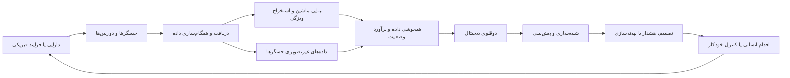
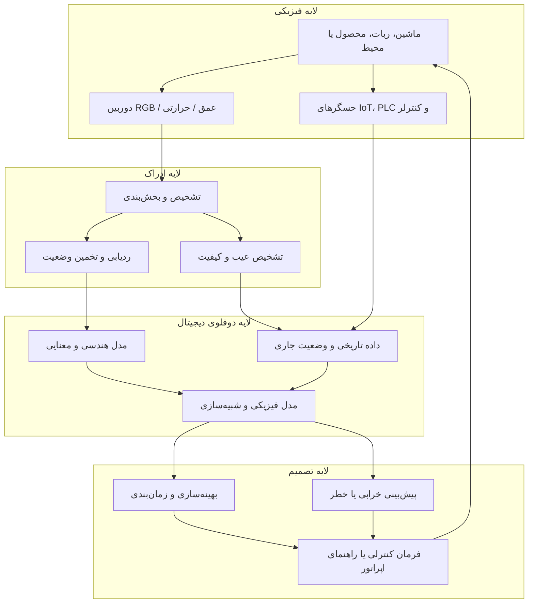
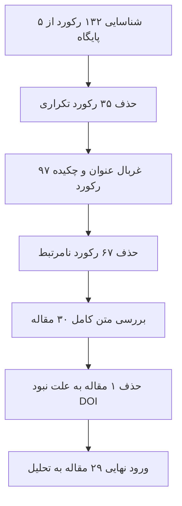
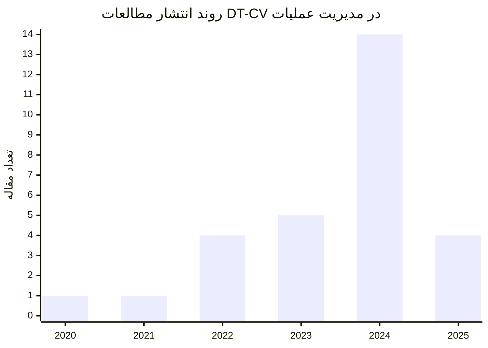
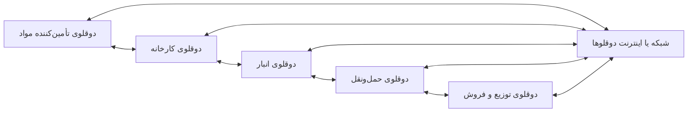
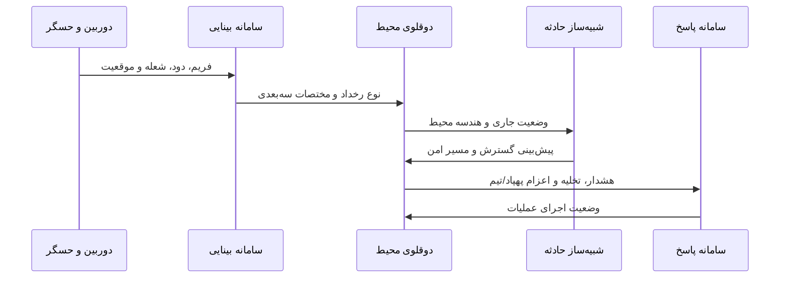
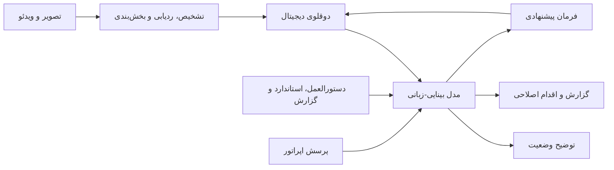
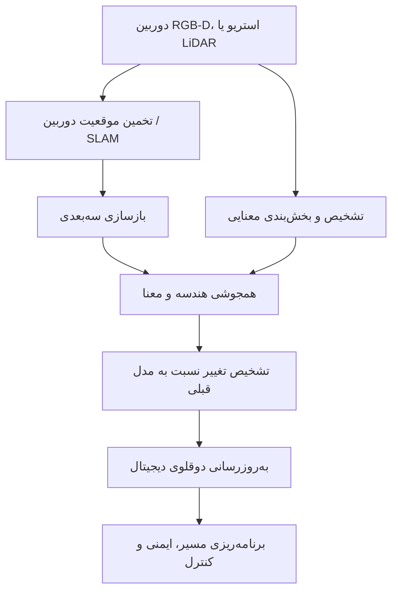
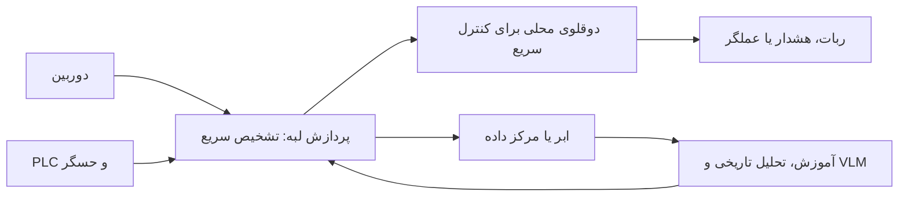

# ترکیب دوقلوی دیجیتال و بینایی ماشین در تولید و عملیات

## بازنویسی و معادل فارسیِ روشن از یک مرور نظام‌مند ادبیات

> **مقاله مبنا:**  
> Faqeer, H. A., & Khajavi, S. H. (2025). *Digital Twin and Computer Vision Combination for Manufacturing and Operations: A Systematic Literature Review*. Applied Sciences, 15, 10157.  
> DOI: `10.3390/app151810157`
>
> **نوع این متن:** ترجمه واژه‌به‌واژه نیست؛ بلکه بازنویسی علمی، وفادار به ساختار و محتوای مقاله، با بیان فارسی روشن و مناسب برای قرارگیری در GitHub است.  
> هر بخشی که با عنوان **«یادداشت تکمیلی»** مشخص شده، توضیح یا تحلیل افزوده‌شده توسط نگارنده این نسخه است و جزو متن اصلی مقاله نیست.

---

## فهرست مطالب

- [چکیده](#چکیده)
- [۱. مقدمه](#۱-مقدمه)
- [۲. پیشینه پژوهش](#۲-پیشینه-پژوهش)
  - [۲.۱. دوقلوی دیجیتال در تولید و مدیریت عملیات](#۲۱-دوقلوی-دیجیتال-در-تولید-و-مدیریت-عملیات)
  - [۲.۲. بینایی ماشین در تولید و مدیریت عملیات](#۲۲-بینایی-ماشین-در-تولید-و-مدیریت-عملیات)
  - [۲.۳. ترکیب دوقلوی دیجیتال و بینایی ماشین](#۲۳-ترکیب-دوقلوی-دیجیتال-و-بینایی-ماشین)
- [۳. مواد و روش‌ها](#۳-مواد-و-روشها)
- [۴. نتایج](#۴-نتایج)
  - [۴.۱. کاربردها در حوزه‌های مدیریت عملیات](#۴۱-کاربردها-در-حوزههای-مدیریت-عملیات)
  - [۴.۲. جمع‌بندی پژوهش‌ها و کاربردهای صنعتی](#۴۲-جمعبندی-پژوهشها-و-کاربردهای-صنعتی)
  - [۴.۳. موانع پیاده‌سازی و روندهای نوظهور](#۴۳-موانع-پیادهسازی-و-روندهای-نوظهور)
  - [۴.۴. شکاف‌های پژوهشی](#۴۴-شکافهای-پژوهشی)
- [۵. بحث](#۵-بحث)
- [۶. جمع‌بندی نهایی](#۶-جمعبندی-نهایی)
- [واژه‌نامه](#واژهنامه)

---

# چکیده

این مقاله نقش تحول‌آفرین ترکیب **دوقلوی دیجیتال** و **بینایی ماشین** را در تولید و عملیات صنعتی بررسی می‌کند. در این متن، این ترکیب با نماد **DT-CV** نمایش داده می‌شود:

- **DT: Digital Twin** — دوقلوی دیجیتال
- **CV: Computer Vision** — بینایی ماشین
- **OM: Operations Management** — مدیریت عملیات

هدف اصلی مقاله، دسته‌بندی کاربردهای DT-CV، شناسایی چالش‌های پیاده‌سازی و ترسیم مسیرهای آینده پژوهش در مدیریت عملیات است. نویسندگان با استفاده از چارچوب **PRISMA** یک مرور نظام‌مند انجام داده‌اند و ادبیات منتشرشده از ژانویه ۲۰۲۰ تا ژوئن ۲۰۲۵ را در پنج منبع علمی بررسی کرده‌اند.

نتیجه جست‌وجو نشان می‌دهد که حوزه DT-CV هنوز جوان است. از میان ۱۳۲ رکورد اولیه، تنها **۲۹ مطالعه** معیارهای ورود به مرور را برآورده کرده‌اند. بیشتر کارها در سطح آزمایشگاهی، نمونه اولیه یا اثبات مفهوم انجام شده‌اند و مطالعات صنعتیِ میدانی و مستند بسیار اندک‌اند.

کاربردهای اصلی شناسایی‌شده عبارت‌اند از:

- طراحی محصول و فرایند؛
- نمونه‌سازی، شبیه‌سازی و اعتبارسنجی مجازی؛
- پایش بلادرنگ تولید؛
- تشخیص عیب و تضمین کیفیت؛
- بهینه‌سازی فرایند؛
- تشخیص و کاهش خطر؛
- آموزش ایمنی و شبیه‌سازی واکنش اضطراری؛
- تخصیص بهینه منابع؛
- پایش وضعیت و نگهداری پیش‌بینانه؛
- مدیریت موجودی و لجستیک؛
- زمان‌بندی و بهبود بهره‌وری عملیاتی.

مهم‌ترین مزایای گزارش‌شده نیز شامل کاهش خطای انسانی، افزایش انطباق با استانداردهای کیفیت، کاهش هزینه نگهداری، کم‌شدن توقف تولید، رفع گلوگاه‌های عملیاتی، کاهش حوادث شغلی و افزایش اثربخشی آموزش است.

مقاله در پایان، ترکیب **دوقلوی دیجیتال و مدل‌های بینایی‌ـ‌زبانی** یا **DT-VLM** را یکی از مسیرهای آینده می‌داند؛ مسیری که می‌تواند میان ادراک بصری، مدل دیجیتال، استدلال زمینه‌ای و تعامل زبانی با اپراتور پل ایجاد کند.

---

# ۱. مقدمه

تولید و مدیریت عملیات در دوره‌ای از گذار قرار دارند. پیچیده‌ترشدن زنجیره‌های تأمین، سیاست‌های تجاری و تعرفه‌ای، کمبود نیروی ماهر و رشد فناوری‌های اخلالگر مانند هوش مصنوعی و ساخت افزایشی، سازمان‌های صنعتی را وادار کرده است تا هم‌زمان چند هدف را دنبال کنند:

1. حفظ پایداری عملیات؛
2. افزایش انعطاف‌پذیری؛
3. بهبود بهره‌وری؛
4. کاهش هزینه و اتلاف؛
5. تصمیم‌گیری سریع‌تر و مبتنی بر داده.

در این محیط، استفاده از فناوری‌های دیجیتال پیشرفته به یکی از راهبردهای اصلی صنایع تبدیل شده است. در میان این فناوری‌ها، ترکیب دوقلوی دیجیتال و بینایی ماشین جایگاه ویژه‌ای دارد.

دوقلوی دیجیتال یک نمایش مجازی و همگام‌شونده از یک دارایی، فرایند یا سامانه فیزیکی است. این نمایش می‌تواند برای پایش، تحلیل، شبیه‌سازی، پیش‌بینی، بهینه‌سازی و کنترل به کار رود. بینایی ماشین نیز امکان استخراج خودکار اطلاعات از تصویر و ویدئو را فراهم می‌کند؛ برای مثال:

- تشخیص قطعه؛
- مکان‌یابی اشیا؛
- ردیابی حرکت؛
- اندازه‌گیری ابعاد و شکل؛
- تشخیص عیب سطحی؛
- تشخیص رفتار ناایمن؛
- درک رخدادهای محیطی.

هنگامی که این دو فناوری ترکیب می‌شوند، دوقلوی دیجیتال دیگر فقط به داده‌های عددی حسگرها متکی نیست، بلکه می‌تواند از داده‌های غنی بصری نیز برای به‌روزرسانی وضعیت خود استفاده کند.

## ۱.۱. ریشه تاریخی مفهوم دوقلو

ریشه مفهومی دوقلو به برنامه فضایی آپولو در دهه ۱۹۶۰ بازمی‌گردد. ناسا نمونه‌ای فیزیکی از سامانه فضایی را روی زمین نگه می‌داشت تا وضعیت فضاپیما را بازسازی و راه‌حل‌های احتمالی را آزمایش کند. در مأموریت آپولو ۱۳، این رویکرد برای بررسی و آزمون راه‌حل‌های مرتبط با خرابی خطرناک سامانه اکسیژن اهمیت زیادی یافت.

در نسل امروزی، این همتای فیزیکی به یک مدل دیجیتال تبدیل شده است که از طریق جریان داده با سامانه واقعی در ارتباط است.

## ۱.۲. اجزای معمول یک دوقلوی دیجیتال صنعتی

یک دوقلوی دیجیتال صنعتی معمولاً از ترکیب عناصر زیر شکل می‌گیرد:

- مدل هندسی یا سه‌بعدی؛
- مدل فیزیکی یا شبیه‌سازی؛
- حسگرهای اینترنت اشیا؛
- پایگاه داده تاریخی و بلادرنگ؛
- الگوریتم‌های تحلیل داده و یادگیری ماشین؛
- لایه ارتباطی میان دارایی و مدل؛
- رابط بصری برای اپراتور؛
- سازوکار بازخورد و کنترل.



## ۱.۳. چرا بینایی ماشین برای دوقلوی دیجیتال مهم است؟

حسگرهای متداول معمولاً یک متغیر خاص را اندازه‌گیری می‌کنند؛ برای مثال دما، فشار، ارتعاش یا جریان. این داده‌ها دقیق‌اند، اما زمینه بصری محیط را به‌طور کامل نمایش نمی‌دهند.

در مقابل، تصویر می‌تواند به‌طور هم‌زمان اطلاعاتی از موارد زیر ارائه دهد:

- شکل و هندسه؛
- رنگ و بافت؛
- وضعیت سطح؛
- حرکت اشیا و انسان‌ها؛
- چیدمان محیط؛
- تعامل میان عامل‌ها؛
- وجود مانع، خطر یا ناهنجاری.

بنابراین CV می‌تواند شکاف میان «داده‌های عددی محدود» و «درک زمینه‌ای از محیط واقعی» را کاهش دهد.

> **یادداشت تکمیلی:**  
> از دید پردازش سیگنال، دوربین را می‌توان یک حسگر با بعد بسیار بالا در نظر گرفت. هر فریم تصویر شامل تعداد بزرگی نمونه مکانی و کانال‌های رنگی است. مسئله اصلی فقط جمع‌آوری داده نیست، بلکه استخراج ویژگی پایدار، کاهش نویز، هم‌ترازسازی زمانی و مکانی و تبدیل تصویر به یک حالت قابل استفاده برای دوقلوی دیجیتال است.

## ۱.۴. نمونه‌هایی از کاربرد دوقلوی دیجیتال در صنایع مختلف

اگرچه مقاله بر تولید و عملیات تمرکز دارد، برای نشان‌دادن وسعت مفهوم دوقلو، نمونه‌هایی از حوزه‌های دیگر نیز معرفی می‌کند:

- **خودرو:** طراحی و شبیه‌سازی ابزارها و سامانه‌های خودرو؛
- **کشاورزی:** جمع‌آوری داده مزرعه، تحلیل یادگیری ماشین و افزایش عملکرد محصول؛
- **ساختمان هوشمند:** ترکیب IoT و مدل CAD/BIM برای مدیریت انرژی و تاب‌آوری؛
- **انرژی:** پایش و کنترل مبدل‌ها و تجهیزات توان؛
- **فرودگاه:** تشخیص وضعیت تجهیزات و پیش‌بینی عملیات گردش پرواز؛
- **لجستیک:** زمان‌بندی توزیع، مدیریت زنجیره سرد و بسته‌بندی.

## ۱.۵. نمونه‌هایی از کاربرد بینایی ماشین

- کنترل کیفیت در کارخانه؛
- تصویربرداری پزشکی و کمک‌جراحی؛
- کشاورزی دقیق؛
- پایش سازه و ایمنی در ساخت‌وساز؛
- پایش سایه روی پنل‌های خورشیدی؛
- قرائت خودکار کنتورها؛
- شمارش، دسته‌بندی و ردیابی کالا.

## ۱.۶. پرسش‌های پژوهش

مقاله دو پرسش اصلی را دنبال می‌کند:

### پرسش اول

ادبیات موجود درباره کاربرد DT-CV در مدیریت عملیات چگونه قابل دسته‌بندی است و مهم‌ترین کاربردهای صنعتی فعلی آن کدام‌اند؟

### پرسش دوم

چالش‌های یکپارچه‌سازی DT-CV چیست و با توجه به پیشرفت این فناوری، آینده عملیات صنعتی چگونه خواهد بود؟

---

# ۲. پیشینه پژوهش

## ۲.۱. دوقلوی دیجیتال در تولید و مدیریت عملیات

مدیریت عملیات سنتی عمدتاً بر برنامه‌ریزی ثابت، مرحله‌به‌مرحله و مبتنی بر MRP تکیه داشت. با دیجیتالی‌شدن کارخانه، سامانه‌های ERP و زیرساخت‌های داده‌محور امکان تصمیم‌گیری انعطاف‌پذیرتر و نزدیک به بلادرنگ را فراهم کرده‌اند.

تغییر مهم دیگر این است که بهینه‌سازی دیگر فقط در سطح یک ماشین یا یک ایستگاه انجام نمی‌شود. سازمان می‌تواند چند جریان کاری را به‌صورت هماهنگ و پویا مدیریت کند.

دوقلوی دیجیتال در این گذار نقش‌های زیر را ایفا می‌کند:

- همگام‌سازی مدل با دارایی واقعی؛
- پایش وضعیت؛
- شناسایی ناهنجاری؛
- نگهداری پیش‌بینانه؛
- شبیه‌سازی سناریوهای چندفیزیکی؛
- تصمیم‌گیری تطبیقی؛
- هماهنگی میان مهندسی، برنامه‌ریزی و کف کارخانه؛
- کاهش ریسک از طریق اعتبارسنجی آنلاین؛
- آموزش نیروی انسانی در محیط مجازی؛
- راه‌اندازی مجازی و کاهش ضایعات.

### مقایسه رویکرد سنتی و رویکرد مبتنی بر دوقلوی دیجیتال

| جنبه مدیریت عملیات | رویکرد متداول | رویکرد نوین مبتنی بر DT |
|---|---|---|
| برنامه‌ریزی و کنترل | برنامه ثابت و مرحله‌ای مبتنی بر MRP | تصمیم‌گیری بلادرنگ و انعطاف‌پذیر مبتنی بر ERP و داده |
| بهینه‌سازی فرایند | بهینه‌سازی جداگانه هر فرایند | هماهنگ‌سازی پویا میان چند جریان کاری |
| نگهداری | بازرسی دستی و برنامه زمان‌بندی ثابت | پایش همگام، تشخیص ناهنجاری و نگهداری پیش‌بینانه |
| طراحی و شبیه‌سازی | آزمون فیزیکی محدود و اتکا به تجربه کارشناس | شبیه‌سازی چندفیزیکی و تصمیم‌گیری تطبیقی |
| پایداری عملیات | کنترل‌های نسبتاً صلب | حفظ پایداری در شرایط نامطمئن |
| هماهنگی سازمانی | جزیره‌های اطلاعاتی | اتصال مهندسی، برنامه‌ریزی و عملیات کارخانه |
| مدیریت ریسک | تشخیص واکنشی خرابی | اعتبارسنجی آنلاین و تشخیص زودهنگام |
| راه‌اندازی و پایداری | زمان اعتبارسنجی و مصرف ماده بیشتر | راه‌اندازی مجازی، کاهش زمان و کاهش ضایعات |

> **یادداشت تکمیلی:**  
> بلوغ دوقلوی دیجیتال را می‌توان در چند سطح دید:  
> **مدل دیجیتال ایستا → سایه دیجیتال یک‌طرفه → دوقلوی همگام دوطرفه → دوقلوی پیش‌بین → دوقلوی خودبهینه‌ساز.**  
> بسیاری از سامانه‌هایی که در صنعت «دوقلوی دیجیتال» نامیده می‌شوند، در عمل هنوز در سطح مدل ایستا یا سایه دیجیتال قرار دارند.

---

## ۲.۲. بینایی ماشین در تولید و مدیریت عملیات

بینایی ماشین با خودکارکردن بازرسی، وابستگی به بازرسی دستی را کاهش می‌دهد و می‌تواند نرخ تشخیص عیب را افزایش دهد. کاربردهای مهم مطرح‌شده عبارت‌اند از:

### ساخت افزایشی

در چاپ سه‌بعدی، دوربین فرایند ساخت را لایه‌به‌لایه رصد می‌کند تا ناهنجاری هندسی، شکست، جداشدگی یا خطای رسوب‌گذاری را تشخیص دهد.

### صنایع سنگین

در صنعت فولاد و ورق فلزی، CV برای تشخیص عیوب سطحی و حفظ یکنواختی کیفیت به‌کار می‌رود.

### شرکت‌های کوچک و متوسط

سامانه‌های بصری می‌توانند کنترل کیفیت مقیاس‌پذیرتری ایجاد کنند؛ هرچند هزینه دوربین، پردازش، داده برچسب‌خورده و نگهداری مدل همچنان مانع مهمی است.

### زنجیره تأمین و موجودی

CV می‌تواند برای شمارش کالا، ردیابی موجودی، تشخیص بسته و خودکارسازی لجستیک استفاده شود.

### تولید پایدار

بینایی ماشین به نگهداری پیش‌بینانه، کاهش ضایعات، استفاده بهتر از مواد و مدیریت منابع کمک می‌کند.

### ایمنی نیروی کار

تشخیص تجهیزات حفاظت فردی مانند کلاه و جلیقه، ورود به ناحیه ممنوعه و رفتار ناایمن از کاربردهای مهم CV است.

### مقایسه رویکرد سنتی و رویکرد مبتنی بر CV

| جنبه | روش سنتی | روش مبتنی بر بینایی ماشین |
|---|---|---|
| بازرسی کیفیت | دستی، وابسته به اپراتور | تشخیص خودکار عیب و پایش پیوسته |
| چاپ سه‌بعدی | مشاهده محدود فرایند | کنترل تصویری لایه‌به‌لایه |
| صنایع سنگین | بازرسی سطحی انسانی | تشخیص خودکار عیب سطح |
| موجودی و لجستیک | شمارش و ثبت دستی | مکان‌یابی و ردیابی تصویری |
| پایداری | نگهداری واکنشی و ضایعات بیشتر | پایش پیش‌بینانه و بهینه‌سازی مصرف |
| ایمنی | کنترل سرپرست | پایش خودکار PPE و خطر |

---

## ۲.۳. ترکیب دوقلوی دیجیتال و بینایی ماشین

ترکیب DT-CV به این معناست که داده بصری صرفاً برای نمایش استفاده نشود، بلکه به مدل دیجیتال وارد شده و وضعیت، هندسه، رخدادها یا پارامترهای آن را به‌روزرسانی کند. سپس مدل دیجیتال نیز بتواند خروجی‌هایی برای تصمیم، شبیه‌سازی یا کنترل تولید کند.

### معماری مفهومی DT-CV



### نمونه‌های کاربردی مطرح‌شده در مقاله

- شبیه‌سازی عملیات ماشین‌کاری و پیش‌بینی سایش ابزار؛
- استخراج ویژگی‌های هندسی برای ساخت قطعات پیچیده هوافضا؛
- تشخیص عیب در ساخت با رشته مذاب؛
- پیش‌بینی عیب در ساخت افزایشی قوسی با سیم؛
- کنترل ایمنی ربات‌های همکار بر اساس حضور انسان؛
- عملیات خودکار برداشتن و قراردادن قطعه؛
- کنترل گیره نرم رباتیکی با تخمین موقعیت و فشار؛
- بازرسی جوش خودرو؛
- آموزش نیروی کار در کارخانه یادگیری کوچک؛
- پایش آتش، دود و خطر در کارخانه.

### نمونه‌های شرکتی

- **Siemens و NVIDIA:** دوقلوی صنعتی، هوش مصنوعی و نگهداری پیش‌بینانه؛
- **BMW و Dassault Systèmes:** دوقلوی مجازی خودرو و همکاری مهندسی؛
- **Amazon، AWS و NavVis:** ایجاد و به‌روزرسانی دوقلوهای محیط داخلی و لجستیک؛
- **Konecranes:** کارخانه هوشمند و مدل سه‌بعدی بلادرنگ؛
- **Detectium:** تشخیص آتش، دود و مخاطرات؛
- **Addepto:** پایش فرایند و تشخیص عیب.

---

# ۳. مواد و روش‌ها

## ۳.۱. نوع مطالعه

پژوهش از روش مرور نظام‌مند ادبیات استفاده کرده و برای غربالگری مطالعات از چارچوب PRISMA بهره گرفته است.

## ۳.۲. بازه زمانی

مطالعات منتشرشده از **ژانویه ۲۰۲۰ تا ژوئن ۲۰۲۵** بررسی شده‌اند.

## ۳.۳. پایگاه‌ها و منابع جست‌وجو

پنج منبع اصلی مورد استفاده عبارت‌اند از:

1. Google Scholar؛
2. IEEE Xplore؛
3. ScienceDirect؛
4. SpringerLink؛
5. ResearchGate.

منطق انتخاب این منابع چنین بوده است:

- Google Scholar برای پوشش گسترده و میان‌رشته‌ای؛
- IEEE Xplore برای مهندسی و علوم رایانه؛
- ScienceDirect و SpringerLink برای مجلات علمی اصلی؛
- ResearchGate برای یافتن پیش‌چاپ‌ها و کارهای نوظهور.

## ۳.۴. کلیدواژه‌ها

کلیدواژه‌های اصلی شامل موارد زیر بودند:

- digital twin؛
- computer vision؛
- industrial operations؛
- production؛
- manufacturing؛
- quality control؛
- predictive maintenance؛
- logistics؛
- defect detection؛
- safety monitoring.

عبارت جست‌وجوی اصلی:

```text
("digital twin" AND "computer vision")
AND
("manufacturing" OR "operations")
```

## ۳.۵. معیارهای ورود

- مقاله پژوهشی داوری‌شده؛
- مقاله کنفرانسی؛
- مطالعه موردی؛
- تمرکز روشن بر ادغام DT و CV؛
- ارتباط با تولید، عملیات یا مدیریت صنعتی.

## ۳.۶. معیارهای خروج

- مطالعاتی که فقط DT یا فقط CV را بررسی کرده‌اند؛
- حوزه‌های خارج از تمرکز مقاله، مانند:
  - سلامت؛
  - حمل‌ونقل؛
  - شهر و ساختمان هوشمند؛
  - ساخت‌وساز و املاک؛
  - دفاع و امنیت؛
  - کشاورزی دقیق.

## ۳.۷. فرایند PRISMA



| مرحله | تعداد |
|---|---:|
| رکوردهای اولیه | ۱۳۲ |
| رکوردهای تکراری حذف‌شده | ۳۵ |
| رکوردهای غربال‌شده | ۹۷ |
| رکوردهای حذف‌شده پس از غربال | ۶۷ |
| متن کامل ارزیابی‌شده | ۳۰ |
| مقاله نهایی | ۲۹ |

## ۳.۸. شیوه کدگذاری و طبقه‌بندی

دو نویسنده به‌صورت مستقل متن کامل مطالعات را بررسی کردند. نتایج در یک فایل Excel کدگذاری شد. معیارهای کدگذاری شامل موارد زیر بود:

- روش پژوهش؛
- حوزه کاربرد؛
- مسئله صنعتی؛
- راه‌حل پیشنهادی؛
- فناوری‌های استفاده‌شده؛
- محدودیت‌ها؛
- نوع اعتبارسنجی.

طبقه‌بندی بر پایه حوزه‌های مدیریت عملیات انجام شد:

1. طراحی محصول و فرایند؛
2. تولید و تضمین کیفیت؛
3. انتخاب مکان و طراحی چیدمان؛
4. منابع انسانی و ایمنی کارکنان؛
5. زنجیره تأمین، موجودی و لجستیک؛
6. زمان‌بندی و بهره‌وری عملیاتی؛
7. نگهداری.

> **یادداشت تکمیلی:**  
> استفاده از ResearchGate به‌عنوان «پایگاه» از نظر روش‌شناختی به‌اندازه پایگاه‌هایی مانند Scopus یا Web of Science استاندارد نیست. همچنین حذف یک مقاله فقط به علت نبود DOI می‌تواند سوگیری ایجاد کند؛ زیرا نداشتن DOI لزوماً به معنای بی‌کیفیت یا نامعتبر بودن مطالعه نیست.

---

# ۴. نتایج

## ۴.۱. کاربردها در حوزه‌های مدیریت عملیات

روند انتشار مقالات نشان می‌دهد تعداد پژوهش‌ها از ۲۰۲۰ تا ۲۰۲۴ رشد کرده است. داده‌های گزارش‌شده در نمودار مقاله عبارت‌اند از:

| سال | تعداد مقاله |
|---:|---:|
| ۲۰۲۰ | ۱ |
| ۲۰۲۱ | ۱ |
| ۲۰۲۲ | ۴ |
| ۲۰۲۳ | ۵ |
| ۲۰۲۴ | ۱۴ |
| ۲۰۲۵ تا ژوئن | ۴ |



> توجه: عدد سال ۲۰۲۵ فقط تا پایان ژوئن را پوشش می‌دهد و با سال‌های کامل قابل مقایسه مستقیم نیست.

---

## ۴.۱.۱. طراحی محصول و فرایند

در مدیریت عملیات، طراحی محصول به ایجاد محصولی با کیفیت و ارزش مناسب برای مشتری می‌پردازد و طراحی فرایند بر تولید کارا و کم‌هزینه تمرکز دارد. DT-CV می‌تواند قبل از اجرای فیزیکی، طرح و فرایند را در محیط مجازی بررسی کند.

### کاربردهای کلیدی

- اعتبارسنجی مجازی فرایند؛
- تشخیص زودهنگام خطای طراحی؛
- انتخاب ماده؛
- بهینه‌سازی مسیر ابزار؛
- استخراج ویژگی از نقشه و مدل؛
- آزمون پارامترهای فرایندی پیش از اجرای واقعی؛
- کاهش نیاز به نمونه فیزیکی.

### مطالعات مهم

#### چاپ سه‌بعدی بتن هم‌ریخت

در مطالعه Çapunaman و همکاران، حسگری مبتنی بر بینایی و دوقلوی دیجیتال برای دستیابی به دقت هندسی بهتر، کمک به انتخاب ماده و تنظیم تطبیقی مسیر چاپ به کار گرفته شد.

#### طراحی ابزار ماشین‌کاری

Pivkin و همکاران مفهوم یک سامانه سایبرفیزیکی دیجیتال برای طراحی و ساخت ابزار فرز مخروطی را مطرح کردند. هدف، شبیه‌سازی عملیات و کاهش آزمون‌های فیزیکی پرهزینه بود.

#### تبدیل نمودار مهندسی به مدل شبیه‌سازی

Stürmer و همکاران نشان دادند که CV می‌تواند پارامترها و اجزای نمودارهای مهندسی را استخراج کند و به تولید خودکار مدل شبیه‌سازی سامانه‌های هیدرولیکی کمک کند.

#### دوقلوی دیجیتال در سطح ویژگی برای هوافضا

Li و همکاران مدل **FL-DTPM** را ارائه کردند. این مدل فرایند را در سطح ویژگی‌های هندسی و ماشین‌کاری دنبال می‌کند و داده کارگاه، شاخص کیفیت و دانش فرایندی را در برنامه‌ریزی وارد می‌کند.

#### بازسازی پره فن موتور توربوفن

Oyekan و همکاران یک سلول رباتیکی شامل دوقلوی دیجیتال، بازوی صنعتی شش درجه آزادی و ابزار سنگ‌زنی ساختند. مقدار برداشت ماده در یک حلقه بسته اجرا، پایش و اصلاح شد. الگوریتم جست‌وجو در دوقلو اجازه می‌داد پارامترهایی مانند عمق برش ابتدا در محیط مجازی آزموده شوند.

### اثر عملیاتی

- کوتاه‌شدن چرخه توسعه؛
- کاهش بازطراحی؛
- کاهش ضایعات ماده؛
- افزایش دقت هندسی؛
- کاهش وابستگی به تجربه فردی؛
- بهبود امکان آزمون سناریو.

---

## ۴.۱.۲. تولید و تضمین کیفیت

تولید باید محصول را با نرخ، هزینه و کیفیت مناسب ایجاد کند. تضمین کیفیت نیز باید انطباق خروجی با الزامات طراحی و استانداردها را حفظ کند.

### مهم‌ترین کاربردها

- تشخیص خودکار عیب؛
- اصلاح ربات بر اساس تصویر؛
- پایش چاپ سه‌بعدی؛
- کنترل گیره رباتیکی؛
- بازرسی جوش؛
- شبیه‌سازی آسیاب و مواد؛
- پایش تولید کامپوزیت؛
- کنترل ماشین‌کاری قطعات کامپوزیتی.

### نمونه‌های پژوهشی

#### اعتبارسنجی خودکار مونتاژ

Yousif و همکاران سامانه‌ای ارائه کردند که با تشخیص شیء، مونتاژ را اعتبارسنجی کرده و در صورت مشاهده خطا، اصلاحات رباتیکی انجام می‌دهد.

#### پایش ساخت با رشته مذاب

Moretti و همکاران تصویر را برای کشف شکست یا انحراف در لایه چاپ‌شده به کار بردند. دوقلوی دیجیتال امکان مقایسه هندسه واقعی و مرجع و انجام اصلاحات نزدیک به بلادرنگ را فراهم می‌کرد.

#### کنترل گیره نرم رباتیکی

Xiang و همکاران با استفاده از بینایی، موقعیت و فشار گیره را تخمین زدند و مدل دوقلو را برای کنترل دقیق‌تر به کار گرفتند.

#### بازرسی نقطه‌جوش خودرو

سامانه DT-CV در یک بستر Industry 4.0 برای بازرسی کیفیت نقطه‌جوش توسعه یافت تا وابستگی به کنترل دستی کاهش یابد.

#### آسیاب گلوله‌ای و شبیه‌سازی DEM-SPH

Doroszuk و همکاران دوقلوی یک آسیاب آزمایشگاهی را با CV و دو روش شبیه‌سازی تلفیق کردند:

- **DEM:** مدل‌سازی حرکت و برخورد ذرات مجزا؛
- **SPH:** مدل‌سازی بدون شبکه سیال یا محیط پیوسته به‌صورت ذره‌ای.

این ترکیب برای شبیه‌سازی برهم‌کنش ذره و سیال و بهینه‌سازی عملیات خردایش استفاده شد.

#### پایش جهت الیاف کامپوزیت

Döbrich و همکاران از دوربین Azure Kinect برای مشاهده جهت الیاف و شبیه‌سازی انحراف‌های احتمالی استفاده کردند.

#### مکانیزم گیره تطبیقی مبتنی بر ابر

Weckx و همکاران یک دوقلوی ابری برای کنترل گیره در ماشین‌کاری کامپوزیت توسعه دادند. داده‌ها روی Microsoft Azure پردازش می‌شدند تا خم‌شدگی و لایه‌لایه‌شدن کاهش یابد.

### مزایای این گروه

- کاهش خطای انسانی؛
- افزایش سرعت بازرسی؛
- یکنواختی بیشتر کنترل کیفیت؛
- کاهش ضایعات؛
- امکان اصلاح خودکار؛
- مقیاس‌پذیری بهتر در خطوط تولید.

---

## ۴.۱.۳. منابع انسانی و ایمنی کارکنان

در این حوزه، هدف ایجاد محیط کاری ایمن، سالم و عاری از خطر و همچنین افزایش آمادگی کارکنان است.

### آموزش ایمنی در نفت و گاز

Aiken و همکاران از دوقلوی دیجیتال و واقعیت ترکیبی برای آموزش تشخیص خطر استفاده کردند. محیط مجازی اجازه می‌داد کارکنان بدون مواجهه با خطر واقعی، سناریوهای عملیاتی را تمرین کنند.

### همکاری انسان و ربات

Yi و همکاران از سامانه‌های بینایی آموزش‌دیده روی داده مصنوعی دوقلو استفاده کردند تا بازرسی میان خطوط مونتاژ مختلف استانداردتر شود.

### کنترل سرعت ربات همکار

Humphries و همکاران با ترکیب CV و شبیه‌سازی دوقلو، سرعت ربات را متناسب با موقعیت انسان تنظیم کردند تا ریسک برخورد کاهش یابد.

### کنترل از راه دور در محیط خطرناک

Cristofoletti و همکاران چارچوبی ارائه کردند که عملیات ربات در محیط پرخطر را از راه دور کنترل می‌کند. آموزش و آزمایش رفتار ربات در محیط مجازی، هم خطر برای انسان و هم ریسک آسیب تجهیزات را کاهش می‌دهد.

### آثار مورد انتظار

- کاهش حادثه؛
- افزایش آگاهی موقعیتی؛
- آموزش مؤثرتر؛
- کاهش مواجهه انسان با محیط خطرناک؛
- افزایش انطباق با مقررات ایمنی.

> **یادداشت تکمیلی:**  
> در سامانه ایمنی، نرخ دقت کلی به‌تنهایی کافی نیست. باید معیارهایی مانند **نرخ عدم کشف خطر، زمان کشف، نرخ هشدار کاذب، فاصله زمانی تا برخورد و قابلیت عملکرد در نور و زاویه متفاوت** نیز ارزیابی شوند.

---

## ۴.۱.۴. زنجیره تأمین، موجودی و لجستیک

این حوزه بر جریان مؤثر مواد، موجودی، حمل‌ونقل، هماهنگی تأمین‌کننده و تحویل به‌موقع تمرکز دارد.

### مسیر‌یابی در تولید نیمه‌رسانا

Arbabian و همکاران یک پلتفرم دوقلوی عملیات مبتنی بر هوش مصنوعی برای افزایش بهره‌وری تولید نیمه‌رسانا بررسی کردند. CV می‌تواند موقعیت محموله، کانتینر یا دارایی را ردیابی و شرایط آن را ارزیابی کند.

### بازسازی سه‌بعدی فروشگاه و پایش موجودی

Liu و همکاران از رویکرد چندوجهی برای شناسایی محصول و بازسازی سه‌بعدی فروشگاه استفاده کردند. مدل دوقلو با تغییر جای محصول به‌روزرسانی می‌شود.

### برداشت رباتیکی از مخزن

در سامانه bin picking، دوربین مونو یا استریو برای تشخیص رنگ، اندازه و موقعیت قطعات استفاده می‌شود و ربات می‌تواند برنامه برداشت را در محیط شبیه‌سازی‌شده تمرین کند.

### مزایا

- کاهش گلوگاه؛
- افزایش دقت موجودی؛
- کاهش خطای شمارش؛
- افزایش سرعت عملیات انبار؛
- هماهنگی بهتر ربات‌ها؛
- بهبود مقیاس‌پذیری.

---

## ۴.۱.۵. زمان‌بندی و بهره‌وری عملیاتی

هدف این حوزه، استفاده بهینه از منابع، افزایش توان عملیاتی، کاهش زمان چرخه و پاسخ‌گویی به تقاضا است.

### نمونه‌های اصلی

#### برداشتن و قراردادن با ربات همکار

Jakhotiya و همکاران از Tecnomatix Process Simulate برای ایجاد دوقلو و هدایت عملیات pick-and-place استفاده کردند. CV خطا را کاهش و دقت را افزایش داد.

#### مونتاژ مشترک انسان و ماشین

Cheng و همکاران از مدل‌های سبک YOLO برای راهنمایی مونتاژ کاهنده دنده بهره بردند. هدف، افزایش دقت و سرعت در عملیات پیچیده بود.

#### زمان‌بندی پویا و تولید ناب

پژوهش‌های این حوزه نشان می‌دهند ترکیب داده بصری و وضعیت مدل می‌تواند برنامه تولید را در برابر تغییرات محیطی به‌روزرسانی کند.

#### مهندسی معکوس سامانه دریایی

Legaz و همکاران CV را برای بازسازی اجزا و ایجاد مدل مناسب شبیه‌سازی و بهره‌برداری به کار بردند.

#### ردیابی چندشیء در تولید

Ward و همکاران با دوربین‌های تجاری و PLC، اشیا را در فرایند تولید ردیابی کردند و وضعیت دوقلو را نزدیک به بلادرنگ به‌روز کردند.

#### ردیابی دارایی در کارخانه انعطاف‌پذیر

Ullah و همکاران از اثرانگشت Wi-Fi، یادگیری عمیق و CV برای مدیریت AGVها، اجتناب از مانع و کاهش مصرف انرژی استفاده کردند.

#### آموزش CNN با داده مصنوعی کارخانه

Urgo و همکاران از دوقلوی کارخانه برای تولید داده مصنوعی و آموزش شبکه‌های کانولوشنی استفاده کردند. این راهکار به‌ویژه در شرایط کمبود داده واقعی یا رخدادهای نادر ارزشمند است.

### نتایج عملیاتی

- کوتاه‌شدن زمان چرخه؛
- کاهش توقف؛
- تخصیص بهتر منابع؛
- برنامه‌ریزی پویاتر؛
- تصمیم‌گیری دقیق‌تر؛
- افزایش توان تولید.

---

## ۴.۱.۶. نگهداری

نگهداری باید قابلیت استفاده بالا از تجهیزات را حفظ کند و خرابی را پیش از وقوع پیش‌بینی یا پس از وقوع به‌سرعت رفع کند.

### پایش تجهیزات فشارقوی

Zhang از تصویربرداری سه‌بعدی و مدل دوقلو برای پایش بوشینگ فشارقوی GIS و تشخیص ترکیب گاز و نشتی استفاده کرد. هدف، افزایش قابلیت اطمینان حتی در محیط دارای تداخل الکترومغناطیسی بود.

### نگهداری پیش‌بینانه مبتنی بر تصویر

Pila استفاده از پردازش تصویر و یادگیری ماشین را برای تشخیص بلادرنگ و برنامه‌ریزی تعمیر توضیح داد.

### دوقلوی ایستگاه خدمات خودرو

Kozin یک مدل شبیه‌سازی برای مدیریت ایستگاه تعمیر خودرو ارائه کرد. CV، شبیه‌سازی و AI برای بهبود جریان کار، کاهش اتلاف و زمان‌بندی نگهداری ترکیب شدند.

### نتایج مورد انتظار

- افزایش عمر تجهیز؛
- کاهش هزینه نگهداری؛
- کاهش توقف تولید؛
- افزایش قابلیت اطمینان؛
- حرکت از نگهداری زمان‌محور به وضعیت‌محور.

---

## ۴.۲. جمع‌بندی پژوهش‌ها و کاربردهای صنعتی

### ۴.۲.۱. نوع انتشارات

از ۲۹ مدرک بررسی‌شده:

- ۱۷ مقاله مجله؛
- ۱۱ مقاله کنفرانسی؛
- ۱ فصل کتاب.

از نظر حوزه انتشار:

- ۹ مورد در تولید و مهندسی صنایع؛
- ۶ مورد در برق، الکترونیک و مخابرات؛
- ۴ مورد در علوم رایانه؛
- ۳ مورد در مکاترونیک، رباتیک و کنترل؛
- ۳ مورد در مجلات عمومی مهندسی؛
- ۴ مورد در آموزش، انرژی، مواد و مکانیک.

فقط سه مقاله در نشریات پیشرو و پُراثر مانند *Journal of Intelligent Manufacturing* و *Additive Manufacturing* منتشر شده‌اند. این موضوع نشان می‌دهد حوزه هنوز هم از نظر کمیت و هم از نظر کیفیت مطالعات نیاز به رشد دارد.

### ۴.۲.۲. خلاصه ۲۹ مطالعه اصلی

#### طراحی محصول و فرایند

| پژوهش | کاربرد | خروجی اصلی |
|---|---|---|
| Çapunaman et al. | چاپ سه‌بعدی بتن | انتخاب ماده، دقت هندسی و مسیر تطبیقی |
| Pivkin et al. | طراحی ابزار برشی | نمونه‌سازی و شبیه‌سازی مجازی |
| Stürmer et al. | تبدیل دیاگرام مهندسی | تولید خودکار مدل شبیه‌سازی |
| Li et al. | ساخت هوافضا | دوقلوی فرایند در سطح ویژگی |
| Oyekan et al. | بازسازی پره فن | کنترل حلقه‌بسته سنگ‌زنی |

#### تولید و تضمین کیفیت

| پژوهش | کاربرد | خروجی اصلی |
|---|---|---|
| Yousif et al. | مونتاژ خودکار | تشخیص شیء و اصلاح ربات |
| Moretti et al. | چاپ FFF | کشف عیب و اصلاح هندسه |
| Xiang et al. | گیره نرم | تخمین موقعیت و فشار |
| Sousa et al. | جوش نقطه‌ای | بازرسی کیفیت خودرو |
| Doroszuk et al. | آسیاب گلوله‌ای | هم‌کالیبراسیون CV و DEM-SPH |
| Döbrich et al. | کامپوزیت | پایش جهت الیاف |
| Weckx et al. | ماشین‌کاری کامپوزیت | کنترل گیره و کیفیت سوراخ |

#### منابع انسانی و ایمنی

| پژوهش | کاربرد | خروجی اصلی |
|---|---|---|
| Humphries et al. | ایمنی انسان-ربات | کنترل سرعت ربات و کاهش برخورد |
| Cristofoletti et al. | محیط خطرناک | کنترل از راه دور و آموزش مجازی |
| Aiken et al. | نفت و گاز | آموزش واقعیت ترکیبی و تشخیص خطر |
| Yi et al. | مونتاژ مشترک | آموزش فدرال با داده مصنوعی دوقلو |

#### زنجیره تأمین، موجودی و لجستیک

| پژوهش | کاربرد | خروجی اصلی |
|---|---|---|
| Liu et al. | فروشگاه | تشخیص محصول و بازسازی سه‌بعدی |
| Arbabian et al. | نیمه‌رسانا | مسیر‌یابی و ردیابی داخلی |
| Rivera-Calderón et al. | bin picking | دسته‌بندی و برداشت رباتیکی |

#### زمان‌بندی و بهره‌وری عملیاتی

| پژوهش | کاربرد | خروجی اصلی |
|---|---|---|
| Jakhotiya et al. | pick-and-place | افزایش دقت ربات همکار |
| Urgo et al. | کارخانه دیجیتال | آموزش CNN با داده مصنوعی |
| Cheng et al. | مونتاژ خودرو | راهنمایی انسان-ماشین با YOLO |
| Kovári / مطالعه ارجاع‌شده در مقاله | تحلیل چندبعدی | یکپارچه‌سازی جریان بصری و عملیاتی |
| Legaz et al. | سامانه دریایی | مهندسی معکوس و بازسازی مدل |
| Ward et al. | خط تولید | ردیابی بلادرنگ چندشیء |
| Ullah et al. | کارخانه انعطاف‌پذیر | ردیابی دارایی و مدیریت AGV |

#### نگهداری

| پژوهش | کاربرد | خروجی اصلی |
|---|---|---|
| Zhang | تجهیزات GIS | پایش عایقی و تشخیص گاز |
| Pila | تجهیزات صنعتی | تشخیص و برنامه تعمیر خودکار |
| Kozin | خدمات خودرو | شبیه‌سازی نگهداری و جریان کار |

> **یادداشت تکمیلی درباره ناسازگاری مقاله:**  
> در نمودار طبقه‌بندی، تعداد مطالعات «منابع انسانی و ایمنی» برابر ۳ و «زنجیره تأمین و لجستیک» برابر ۴ نمایش داده شده است؛ اما جدول مرور، ۴ مطالعه در ایمنی و ۳ مطالعه در لجستیک فهرست می‌کند. جمع کل در هر دو حالت ۲۹ است. همچنین در متن، نام و شماره بعضی ارجاع‌ها با جدول کاملاً هم‌راستا نیستند. در استفاده پژوهشی، بهتر است منابع اولیه دوباره کنترل شوند.

### ۴.۲.۳. محرک‌های پذیرش صنعتی

سه محرک مهم پذیرش DT-CV عبارت‌اند از:

1. **کاهش هزینه:** نمونه فیزیکی و بازطراحی کمتر؛
2. **کاهش زمان عرضه:** توسعه و اعتبارسنجی سریع‌تر؛
3. **چابکی عملیاتی:** پایش و بهینه‌سازی تکرارشونده در زمان اجرا.

### ۴.۲.۴. نمونه‌های صنعتی

#### Siemens

استفاده از Industrial Copilot، Industrial Edge و دوقلوی دیجیتال برای تصمیم‌گیری، نگهداری و پشتیبانی عملیات.

#### NVIDIA

پلتفرم Omniverse و Isaac Sim برای شبیه‌سازی ربات، تولید تصویر مصنوعی واقع‌گرایانه و آموزش مدل‌های بینایی.

#### Amazon

استفاده از شبیه‌سازی و بینایی برای عملیات ربات‌های انبار و مراکز پردازش سفارش.

#### BMW و Dassault Systèmes

استفاده از 3DEXPERIENCE برای همکاری میان واحدهای مهندسی و توسعه دوقلوهای مجازی خودرو.

#### Konecranes

پایش تولید و نگهداری بر پایه مدل سه‌بعدی بلادرنگ، از جمله تحلیل توقف ماشین و علت اختلال.

#### Vimaan

دوربین فقط بارکد را نمی‌خواند؛ بلکه تصویر موجودی و محیط اطراف را تحلیل می‌کند تا دقت موجودی و بهره‌وری انبار افزایش یابد.

#### Detectium

تشخیص آتش، دود و شرایط خطرناک و نمایش فوری محل رخداد در دوقلوی محیط.

### محدودیت شواهد صنعتی

با وجود تبلیغات شرکتی، ادبیات علمی هنوز مطالعه موردی دقیق و قابل تکرار از استقرارهای بزرگ مانند انبارهای آمازون ارائه نکرده است. بیشتر اطلاعات از وب‌سایت شرکت‌ها، ویدئوهای نمایشی و اطلاعیه‌ها می‌آید.

همچنین بیشتر نمونه‌های گزارش‌شده در کشورهایی با زیرساخت دیجیتال صنعتی پیشرفته قرار دارند، مانند:

- ایالات متحده؛
- آلمان؛
- فرانسه؛
- فنلاند.

این امر می‌تواند به تفاوت در زیرساخت، سرمایه، نیروی ماهر، سیاست صنعتی یا سوگیری انتشار مرتبط باشد.

---

## ۴.۳. موانع پیاده‌سازی و روندهای نوظهور

### ۴.۳.۱. موانع پیاده‌سازی

#### هزینه اولیه بالا

- خرید دوربین و حسگر؛
- زیرساخت شبکه و پردازش؛
- ساخت مدل سه‌بعدی؛
- توسعه و آموزش مدل AI؛
- یکپارچه‌سازی با PLC، MES، ERP و سامانه‌های قدیمی.

#### مقاومت سازمانی

مدیران و کارکنان ممکن است به علت تغییر نقش‌ها، نیاز به آموزش، نگرانی شغلی یا ابهام در بازگشت سرمایه مقاومت کنند.

#### کمبود مهارت

پیاده‌سازی DT-CV به ترکیب چند تخصص نیاز دارد:

- بینایی ماشین؛
- یادگیری ماشین؛
- کنترل و اتوماسیون؛
- شبکه صنعتی؛
- شبیه‌سازی؛
- مدل‌سازی سه‌بعدی؛
- امنیت سایبری؛
- مدیریت عملیات.

#### وابستگی به داده دقیق

اگر داده حسگر یا تصویر ناقص، دیررس، ناهمگام یا کالیبره‌نشده باشد، وضعیت دوقلو اشتباه می‌شود.

#### تأخیر

پردازش تصویر سنگین است. تأخیر می‌تواند در رباتیک، پایش خطر یا کنترل حلقه‌بسته غیرقابل قبول باشد.

> **یادداشت تکمیلی — بودجه تأخیر:**
>
> می‌توان تأخیر انتهابه‌انتها را چنین نوشت:
>
> \[
> T_{total}=T_{capture}+T_{preprocess}+T_{inference}+T_{network}+T_{fusion}+T_{twin}+T_{decision}+T_{actuation}
> \]
>
> در کاربرد ایمنی یا کنترل سریع، فقط زمان استنتاج مدل مهم نیست؛ بلکه مجموع زمان دوربین، شبکه، همجوشی، به‌روزرسانی دوقلو و اعمال فرمان باید کمتر از مهلت سامانه باشد.

#### تعامل‌پذیری

سامانه‌ها از قالب داده، پروتکل و مدل اطلاعاتی متفاوت استفاده می‌کنند. این ناهمگونی توسعه در مقیاس کارخانه یا زنجیره تأمین را دشوار می‌کند.

#### محیط ساختاریافته

بسیاری از مدل‌های CV در نور، زاویه و پس‌زمینه کنترل‌شده خوب عمل می‌کنند، اما در محیط بی‌ساختار یا تغییرپذیر افت می‌کنند.

#### یکپارچه‌سازی سامانه قدیمی و جدید

هماهنگ‌کردن تجهیزات قدیمی با پردازش ابری، شبکه جدید و مدل‌های مدرن پرهزینه و پیچیده است.

#### هزینه محاسباتی

مدل‌های بزرگ و پردازش سه‌بعدی برای شرکت‌های کوچک و متوسط می‌توانند غیرقابل‌دسترس باشند.

#### امنیت سایبری

اگر داده تصویر، مدل سه‌بعدی یا مسیر کنترل دستکاری شود، دوقلو می‌تواند تصمیم نادرست بگیرد. تهدیدها شامل جعل تصویر، تزریق داده، ربایش جریان و دستکاری مدل هستند.

---

### ۴.۳.۲. روندهای نوظهور

#### Industrial Copilot و Industrial Edge

Siemens در حال ترکیب دوقلوی صنعتی، مدل‌های AI و مدیریت مدل در لبه است. هدف، کاهش توقف و افزایش تصمیم‌گیری سریع در تولید است.

#### شبیه‌سازی و کنترل بلادرنگ

Addepto و GE Vernova بر استفاده از دوقلوی بصری برای پایش خط تولید، نگهداری و کنترل کیفیت تأکید دارند.

#### دوقلوی انبار

AWS، NavVis و Vimaan از داده تصویری برای به‌روزرسانی موجودی، تحلیل فضا، کیفیت و ایمنی استفاده می‌کنند.

#### داده مصنوعی

دوقلو می‌تواند تصویر برچسب‌خورده مصنوعی تولید کند. این راهکار در موارد زیر مهم است:

- عیب نادر؛
- حادثه خطرناک؛
- نبود داده کافی؛
- محدودیت حریم خصوصی؛
- نیاز به تنوع زاویه و نور.

> **یادداشت تکمیلی:**  
> داده مصنوعی مسئله کمبود داده را کاهش می‌دهد، اما «شکاف واقعیت» ایجاد می‌کند. مدل آموزش‌دیده روی رندر ممکن است در تصویر واقعی ضعیف‌تر عمل کند. روش‌هایی مانند randomization دامنه، تطبیق دامنه، fine-tuning با داده واقعی و ارزیابی خارج از توزیع برای کاهش این شکاف لازم‌اند.

---

## ۴.۴. شکاف‌های پژوهشی

### ۴.۴.۱. کمبود مطالعه موردی واقعی

تنها یک مورد از ۲۹ مطالعه از یک مطالعه موردی صنعتی واقعی در توسعه راه‌حل استفاده کرده است. غالب پژوهش‌ها روی مسئله عمومی، آزمایشگاه یا اثبات مفهوم تمرکز دارند.

نمونه‌ای که نیازمند تحلیل علمی دقیق است، استقرار ربات‌های خودمختار Amazon Proteus با NVIDIA Isaac Sim و Omniverse است.

### پرسش‌های پیشنهادی مقاله

- هزینه راهبردی و صرفه‌جویی واقعی استقرار DT-CV چقدر است؟
- کدام صنایع «فرصت‌های کم‌هزینه و زودبازده» دارند؟
- پیامدهای بلندمدت پایداری چیست؟

---

### ۴.۴.۲. شکاف در زمینه و روش

حوزه‌هایی که کمبود پژوهش دارند:

- نگهداری؛
- زنجیره تأمین و لجستیک؛
- منابع انسانی و ایمنی؛
- مقایسه کمی با روش‌های سنتی؛
- پیاده‌سازی در محیط بی‌ساختار؛
- توسعه در شرکت‌های کوچک و متوسط.

#### اینترنت دوقلوهای دیجیتال

مقاله پیشنهاد می‌کند در آینده دوقلوهای چند شرکت و چند زنجیره تأمین به هم متصل شوند و یک شبکه جهانی از دوقلوها شکل دهند. این مفهوم می‌تواند با CV و VLM برای افزایش تاب‌آوری، کارایی و پایداری استفاده شود.



### پرسش‌های پژوهشی

- کاربرد واقعی DT-CV در نگهداری صنعتی چیست؟
- چگونه می‌توان هم ایمنی را افزایش داد و هم اعتماد کارکنان را حفظ کرد؟
- چگونه DT-CV می‌تواند اثر شلاق چرمی و شوک تأمین‌کننده را کاهش دهد؟
- DT-CV و DT-VLM در اینترنت دوقلوها چه اثری بر تاب‌آوری دارند؟
- اثر کمی این سامانه‌ها بر هزینه و بهره‌وری چقدر است؟

---

### ۴.۴.۳. مسائل اخلاقی و مقرراتی

ترکیب دوربین با دوقلوی محیط کاری، اطلاعات بسیار حساسی تولید می‌کند:

- تصویر کارکنان؛
- رفتار و الگوی حرکت؛
- طراحی کارخانه؛
- فرایندهای محرمانه؛
- دانش فنی و مالکیت فکری؛
- وضعیت تولید و موجودی.

بنابراین چارچوب حکمرانی باید میان استفاده از داده و حفاظت از حریم خصوصی تعادل برقرار کند.

### مسائل مهم

- رضایت و اطلاع‌رسانی به کارکنان؛
- ناشناس‌سازی هویت؛
- محدودیت دسترسی؛
- زمان نگهداری داده؛
- مالکیت تصویر و مدل سه‌بعدی؛
- انتقال داده میان شرکت‌ها؛
- یادگیری فدرال؛
- مسئولیت خطای تصمیم خودکار؛
- ممیزی الگوریتم.

### پرسش‌های مطرح‌شده

- چگونه حریم خصوصی کارکنان حفظ شود؟
- قوانین کشورها چه تفاوتی دارند؟
- چه مدل حکمرانی‌ای اشتراک داده و مالکیت فکری را متوازن می‌کند؟
- چگونه مقررات هم انطباق و هم نوآوری را ممکن می‌سازند؟

---

# ۵. بحث

## ۵.۱. خروجی عملیاتی برای ایمنی

دوقلوی دیجیتال می‌تواند سناریوهای حادثه را از قبل شبیه‌سازی و نتایج را ذخیره کند. وقتی CV یک رخداد مشابه را تشخیص دهد، سامانه می‌تواند نزدیک‌ترین سناریوی شبیه‌سازی‌شده را بازیابی و پیشنهاد اقدام ارائه کند.

### مثال آتش‌سوزی کارخانه یا انبار

1. دوربین دود، شعله یا افزایش حرارت را تشخیص می‌دهد؛
2. مکان آتش در مدل سه‌بعدی تعیین می‌شود؛
3. دوقلو سناریوی انتشار آتش را بازیابی یا شبیه‌سازی می‌کند؛
4. مسیر خروج کارکنان محاسبه می‌شود؛
5. مسیر تیم امداد و پهپاد مشخص می‌شود؛
6. منابع اطفا تخصیص می‌یابد؛
7. وضعیت به‌صورت بلادرنگ به‌روزرسانی می‌شود.



### پهپاد اطفای حریق

دوقلو می‌تواند مسیر کم‌خطر و کوتاه را برای پهپاد دارای مخزن آب یا ماده اطفا محاسبه کند. این مسیر باید با موانع، دود، حضور انسان و تغییر وضعیت محیط به‌روزرسانی شود.

> **یادداشت تکمیلی:**  
> برای کاربرد ایمنی بحرانی، خروجی مدل نباید تنها مبنای تصمیم باشد. معماری باید شامل لایه‌های fail-safe، آستانه اطمینان، تأیید حسگر چندگانه، امکان مداخله انسانی و ثبت رویداد برای ممیزی باشد.

---

## ۵.۲. ترکیب با مدل‌های بینایی‌ـ‌زبانی

مدل بینایی‌ـ‌زبانی یا VLM می‌تواند تصویر و زبان را هم‌زمان پردازش کند. افزودن VLM به دوقلوی دیجیتال می‌تواند قابلیت‌های زیر را ایجاد کند:

- توضیح زبانی رخداد؛
- پاسخ به پرسش اپراتور؛
- استدلال درباره زمینه؛
- تولید گزارش؛
- پیشنهاد اقدام اصلاحی؛
- تبدیل دستور زبان طبیعی به جست‌وجو یا عملیات دوقلو.

### معماری DT-VLM



### مثال کنترل انطباق ایمنی

سامانه می‌تواند تشخیص دهد که یک فعالیت با دستورالعمل ایمنی یا الزامات محل سازگار نیست. سپس:

- محل رخداد را در دوقلو تعیین کند؛
- استاندارد مرتبط را بازیابی کند؛
- اختلاف را توضیح دهد؛
- اقدام اصلاحی تولید کند؛
- مدیر یا اپراتور را مطلع سازد.

### ممیزی استانداردها

مقاله به امکان استفاده از DT-VLM برای کمک به ممیزی استانداردهایی مانند موارد زیر اشاره می‌کند:

- ISO 9001:2015 برای مدیریت کیفیت؛
- ISO 14001:2015 برای مدیریت محیط زیست.

دوقلوی تأییدشده می‌تواند وضعیت مرجع باشد و VLM وضعیت واقعی را با آن مقایسه کند. سامانه می‌تواند مغایرت و گزارش اولیه تولید کند.

### چالش‌ها

- هزینه محاسباتی VLM؛
- نیاز به تطبیق با واژگان صنعتی؛
- امکان تولید پاسخ نادرست؛
- حفاظت از داده محرمانه؛
- اجرای محلی در برابر ابر؛
- نیاز به مدل کوچک و تخصصی.

---

## ۵.۳. بازمدل‌سازی پویا و نقشه‌برداری معنایی سه‌بعدی آنلاین

یکی از مشکلات مهم دوقلوی دیجیتال، ایجاد و به‌روزرسانی دستی مدل سه‌بعدی است. محیط کارخانه ثابت نمی‌ماند:

- ماشین جابه‌جا می‌شود؛
- قفسه تغییر می‌کند؛
- کالا اضافه یا حذف می‌شود؛
- مسیر مسدود می‌شود؛
- انسان و ربات حرکت می‌کنند.

**نقشه‌برداری معنایی سه‌بعدی آنلاین** به سامانه اجازه می‌دهد هندسه محیط را بازسازی و اشیا و فضاها را هم‌زمان برچسب‌گذاری کند.



این قابلیت برای موارد زیر مهم است:

- ربات‌های متحرک؛
- کارخانه مشترک انسان و ربات؛
- انبار پویا؛
- تشخیص و مکان‌یابی آتش؛
- مسیریابی امداد؛
- جلوگیری از برخورد خارج از میدان دید محلی ربات.

همچنین می‌توان انسان‌ها را در مدل به‌صورت ناشناس، برای مثال اسکلت یا شناسه موقت، نمایش داد تا حریم خصوصی بهتر حفظ شود.

---

## ۵.۴. مسیرهای آینده و محدودیت‌ها

### مسیرهای آینده پیشنهادی

- توسعه معماری‌های مقیاس‌پذیر؛
- استانداردسازی پروتکل ارتباطی دوقلوها؛
- اتصال پهپادها و ربات‌ها به دوقلو؛
- اینترنت دوقلوهای دیجیتال؛
- مدل‌های VLM کوچک و تخصصی برای لبه؛
- تقسیم وظیفه روشن میان CV و VLM؛
- تعیین محل اجرای پردازش: لبه، کارخانه یا ابر؛
- تحلیل اقتصادی و بازگشت سرمایه؛
- مطالعه صنعتی واقعی؛
- مقایسه صنایع مختلف؛
- حکمرانی اخلاقی و امنیتی.

### سؤال مهم در معماری DT-CV-VLM

کدام وظیفه باید توسط CV و کدام توسط VLM انجام شود؟

- CV برای تشخیص دقیق، سریع و ساختاریافته مناسب‌تر است؛
- VLM برای درک زمینه، استدلال، گزارش و تعامل زبانی مناسب‌تر است؛
- کارهای ایمنی بحرانی بهتر است به مدل‌های کوچک، قابل آزمون و قطعی‌تر سپرده شوند؛
- VLM باید بیشتر نقش پشتیبان تصمیم داشته باشد، نه کنترل مستقیم بدون محدودیت.

### محدودیت‌های مرور

- محدودیت زمانی ۲۰۲۰ تا ژوئن ۲۰۲۵؛
- احتمال سوگیری الگوریتم جست‌وجو؛
- اتکا به ادبیات منتشرشده؛
- سوگیری انتشار نتایج مثبت؛
- نبود اعتبارسنجی تجربی مستقل؛
- تأثیر تفسیر نویسندگان؛
- احتمال پوشش‌ندادن جدیدترین توسعه‌های منتشرنشده.

---

# ۶. جمع‌بندی نهایی

ترکیب دوقلوی دیجیتال و بینایی ماشین می‌تواند عملیات صنعتی را از یک سامانه عمدتاً واکنشی به یک سامانه **قابل مشاهده، پیش‌بین، زمینه‌آگاه و تا حدی خوداصلاح‌گر** تبدیل کند.

دوقلوی دیجیتال ساختار، تاریخچه، مدل و ظرفیت شبیه‌سازی را فراهم می‌کند. بینایی ماشین نیز وضعیت واقعی و تغییرات محیط را از تصویر استخراج می‌کند. اتصال این دو، حلقه‌ای ایجاد می‌کند که در آن سامانه می‌تواند:

1. ببیند؛
2. وضعیت را تخمین بزند؛
3. مدل دیجیتال را به‌روزرسانی کند؛
4. پیامد آینده را شبیه‌سازی کند؛
5. تصمیم یا اقدام اصلاحی پیشنهاد دهد؛
6. نتیجه اقدام را دوباره مشاهده کند.

بر اساس مقاله، مهم‌ترین حوزه‌های کاربرد عبارت‌اند از:

- طراحی محصول و فرایند؛
- تولید و تضمین کیفیت؛
- ایمنی و آموزش؛
- لجستیک و موجودی؛
- زمان‌بندی و بهره‌وری؛
- نگهداری.

با این حال، شواهد علمیِ استقرار در مقیاس بزرگ هنوز محدود است. چالش‌های اصلی شامل هزینه، تأخیر، تعامل‌پذیری، داده، محاسبات، امنیت، حریم خصوصی و پذیرش سازمانی‌اند.

آینده این حوزه احتمالاً به سمت **DT-CV-VLM** حرکت می‌کند؛ یعنی سامانه‌ای که علاوه بر مشاهده و شبیه‌سازی، بتواند وضعیت را به زبان طبیعی توضیح دهد، با اپراتور گفت‌وگو کند، مستندات و استانداردها را تحلیل کند و پیشنهاد قابل اقدام ارائه دهد.

> **یادداشت تکمیلی — نتیجه پژوهشی:**  
> ارزش واقعی DT-CV زمانی ایجاد می‌شود که تصویر صرفاً به داشبورد اضافه نشود، بلکه به یک **متغیر حالت معتبر** در دوقلوی دیجیتال تبدیل شود. این امر نیازمند کالیبراسیون، همگام‌سازی زمانی، مدل عدم‌قطعیت، اعتبارسنجی آنلاین و طراحی حلقه بازخورد ایمن است.

---

# چارچوب پیشنهادی تکمیلی برای طراحی یک سامانه DT-CV

> **این بخش افزوده‌شده توسط نگارنده نسخه فارسی است.**

## ۱. مدل حالت

فرض کنید وضعیت واقعی سامانه در زمان \(t\) برابر \(x_t\) باشد:

\[
x_{t+1}=f(x_t,u_t)+w_t
\]

که در آن:

- \(u_t\): ورودی یا فرمان؛
- \(w_t\): اغتشاش و عدم‌قطعیت فرایند.

داده غیرتصویری حسگرها:

\[
z_t^{s}=h_s(x_t)+n_t^{s}
\]

داده استخراج‌شده از تصویر:

\[
z_t^{v}=h_v(x_t)+n_t^{v}
\]

سپس برآورد وضعیت از همجوشی این دو منبع حاصل می‌شود:

\[
\hat{x}_t=\mathcal{F}(z_t^s,z_t^v,\hat{x}_{t-1})
\]

این برآورد به دوقلو وارد می‌شود و مدل دیجیتال را به‌روز می‌کند.

## ۲. اجزای ارزیابی

یک سامانه DT-CV باید حداقل در پنج محور ارزیابی شود:

| محور | نمونه شاخص |
|---|---|
| دقت ادراک | Precision، Recall، mAP، IoU |
| دقت دوقلو | خطای موقعیت، خطای هندسه، خطای حالت |
| زمان | تأخیر انتهابه‌انتها، نرخ فریم، jitter |
| عملیات | کاهش توقف، کاهش ضایعات، افزایش throughput |
| ایمنی و اعتماد | نرخ عدم کشف خطر، هشدار کاذب، قابلیت توضیح |

## ۳. الگوی استقرار لبه و ابر



- وظایف کم‌تأخیر باید نزدیک ماشین اجرا شوند؛
- آموزش مدل و تحلیل تاریخی می‌تواند در ابر انجام شود؛
- اطلاعات حساس بهتر است تا حد امکان در محل باقی بماند؛
- ارتباط باید قطع‌پذیر و تحمل‌خطا باشد.

## ۴. موضوعات مناسب برای پژوهش آینده

- همجوشی تصویر، ارتعاش، صوت و داده PLC؛
- دوقلوی دیجیتال آگاه از عدم‌قطعیت؛
- کشف تغییر هندسی آنلاین؛
- داده مصنوعی واقع‌گرایانه و تطبیق دامنه؛
- VLM صنعتی کوچک و قابل اجرا در لبه؛
- حفاظت در برابر حملات خصمانه تصویری؛
- دوقلوی قابل توضیح؛
- شاخص بلوغ و استاندارد ارزیابی DT-CV؛
- تحلیل هزینه چرخه عمر؛
- مطالعه چندسایتی و چندکارخانه‌ای.

---

# واژه‌نامه

| اصطلاح انگلیسی | معادل پیشنهادی فارسی | توضیح کوتاه |
|---|---|---|
| Digital Twin | دوقلوی دیجیتال | مدل مجازی همگام با سامانه واقعی |
| Computer Vision | بینایی ماشین | استخراج اطلاعات از تصویر و ویدئو |
| Operations Management | مدیریت عملیات | طراحی و کنترل فرایند تولید و خدمت |
| Digital Shadow | سایه دیجیتال | جریان داده عمدتاً یک‌طرفه از فیزیکی به دیجیتال |
| Predictive Maintenance | نگهداری پیش‌بینانه | پیش‌بینی خرابی پیش از وقوع |
| Condition-Based Maintenance | نگهداری وضعیت‌محور | تعمیر بر اساس وضعیت واقعی تجهیز |
| Visual Inspection | بازرسی بصری | کنترل کیفیت بر پایه تصویر |
| Object Detection | تشخیص شیء | تعیین نوع و کادر شیء |
| Semantic Segmentation | بخش‌بندی معنایی | برچسب‌گذاری پیکسل‌ها |
| Tracking | ردیابی | دنبال‌کردن شیء در زمان |
| Point Cloud | ابرنقاط | مجموعه نقاط سه‌بعدی محیط |
| SLAM | مکان‌یابی و نقشه‌برداری هم‌زمان | تخمین مسیر و ساخت نقشه |
| Vision-Language Model | مدل بینایی‌ـ‌زبانی | مدل چندوجهی تصویر و زبان |
| Synthetic Data | داده مصنوعی | داده تولیدشده با شبیه‌ساز یا مولد |
| Domain Adaptation | تطبیق دامنه | کاهش تفاوت داده آموزش و محیط واقعی |
| Interoperability | تعامل‌پذیری | توان تبادل و استفاده مشترک از داده |
| Edge Computing | رایانش لبه | پردازش نزدیک دارایی فیزیکی |
| Digital Thread | رشته دیجیتال | اتصال داده در کل چرخه عمر محصول |

---

# نکات کلیدی در یک نگاه

- DT-CV یک حوزه جوان اما رو به رشد است.
- فقط ۲۹ مطالعه در مرور نهایی وارد شده‌اند.
- بیشتر مطالعات آزمایشگاهی و اثبات مفهوم‌اند.
- بیشترین تمرکز بر کیفیت، تولید و بهره‌وری عملیاتی است.
- نگهداری، لجستیک و ایمنی هنوز جای پژوهش گسترده دارند.
- داده مصنوعی یکی از مزیت‌های مهم دوقلو برای آموزش CV است.
- تأخیر، تعامل‌پذیری، هزینه و امنیت موانع اصلی هستند.
- شرکت‌های بزرگ کاربردهایی ارائه کرده‌اند، اما مستندات علمی دقیق کم است.
- DT-VLM مسیر مهم آینده برای توضیح، گزارش و تعامل طبیعی است.
- نقشه‌برداری معنایی سه‌بعدی آنلاین برای دوقلوی پویا ضروری است.
- حفظ حریم خصوصی کارکنان و مالکیت فکری باید از ابتدا در طراحی لحاظ شود.

---

# منابع منتخب و اصلی مورد استفاده در مقاله

> فهرست زیر منابع محوری مقاله را برای ادامه مطالعه نشان می‌دهد. شماره‌گذاری با مقاله اصلی یکسان نیست.

1. Rasheed, A., San, O., & Kvamsdal, T. Digital twin: Values, challenges and enablers from a modeling perspective. IEEE Access, 2020.
2. Liu, M., Fang, S., Dong, H., & Xu, C. Review of digital twin concepts, technologies, and industrial applications. Journal of Manufacturing Systems, 2021.
3. Mihai, S. et al. Digital twins: Enabling technologies, challenges, trends and future prospects. IEEE Communications Surveys & Tutorials, 2022.
4. Soori, M., Arezoo, B., & Dastres, R. Digital twin for smart manufacturing: A review. 2023.
5. Moretti, M., Rossi, A., & Senin, N. In-process monitoring in fused filament fabrication using CV and digital twins. Additive Manufacturing, 2021.
6. Ward, R. et al. Real-time vision-based multiple object tracking of a production process. 2021.
7. Yousif, I. et al. Leveraging computer vision toward autonomous industrial facilities. Journal of Intelligent Manufacturing, 2024.
8. Urgo, M., Terkaj, W., & Simonetti, G. Training CNNs on synthetic data from a digital factory twin. 2024.
9. Humphries, J. et al. Managing safety of the human on the factory floor using computer vision fusion. 2024.
10. Jakhotiya, Y. et al. Integrating digital twin and computer vision for pick-and-place operations. 2024.
11. Li, J. et al. Feature-level digital twin process model for intelligent process planning. 2025.
12. Çapunaman, Ö. B. et al. Vision-based sensing and digital twins in conformal 3D concrete printing. 2025.
13. Kovári, A. J. Integrating vision transformers with digital twins in Industry 5.0. 2025.
14. Ullah, A. et al. Digital twin framework using real-time asset tracking for flexible manufacturing. 2025.
15. Ghosh, A. et al. Vision-language models: Methodologies and future directions. 2024.
16. Sundby, T. et al. Geometric change detection in digital twins using 3D machine learning. 2021.
17. Webb, A. M. et al. ORB-SLAM-CNN and semantic map construction. 2019.

---

## استناد پیشنهادی برای این فایل فارسی

```text
بازنویسی فارسی مقاله:
Faqeer, H. A., & Khajavi, S. H. (2025),
Digital Twin and Computer Vision Combination for Manufacturing and Operations:
A Systematic Literature Review, Applied Sciences, 15, 10157.
```
