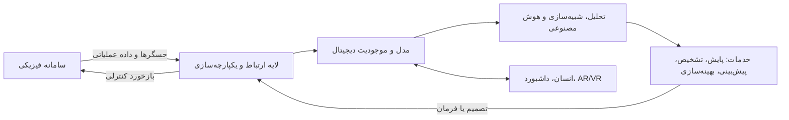
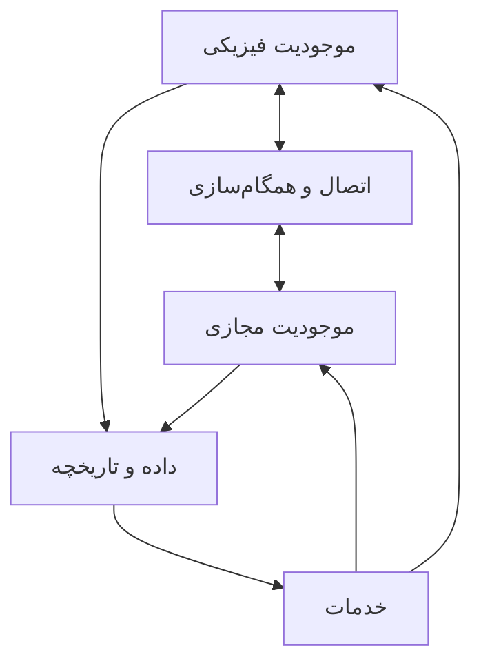
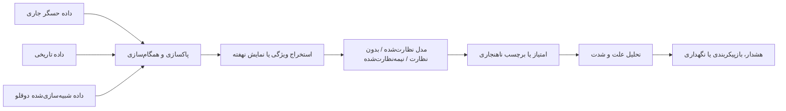
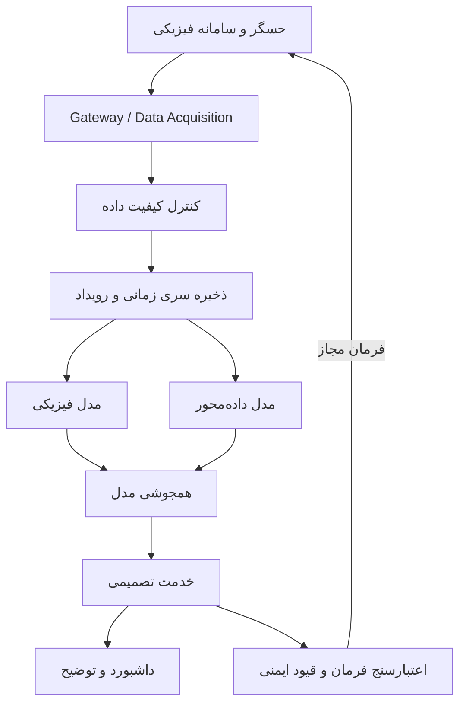

# دوقلوهای دیجیتال: فناوری‌های توانمندساز، چالش‌ها، روندها و چشم‌اندازهای آینده

> **معادل فارسیِ توضیحی و بازنویسی‌شده برای استفاده در Git/GitHub**
>
> این متن بر پایه مقاله زیر تهیه شده است:
>
> **S. Mihai et al., “Digital Twins: A Survey on Enabling Technologies, Challenges, Trends and Future Prospects,” IEEE Communications Surveys & Tutorials, vol. 24, no. 4, pp. 2255–2291, 2022. DOI: 10.1109/COMST.2022.3208773**
---

## فهرست مطالب

- [چکیده](#چکیده)
- [واژگان کلیدی](#واژگان-کلیدی)
- [۱. مقدمه](#۱-مقدمه)
  - [۱.۱. پیش‌زمینه و انگیزه](#۱۱-پیشزمینه-و-انگیزه)
  - [۱.۲. مرور مقالات مروری پیشین](#۱۲-مرور-مقالات-مروری-پیشین)
  - [۱.۳. دستاوردهای مقاله](#۱۳-دستاوردهای-مقاله)
  - [۱.۴. ساختار مقاله](#۱۴-ساختار-مقاله)
- [۲. تعریف دوقلوی دیجیتال](#۲-تعریف-دوقلوی-دیجیتال)
- [۳. ظرفیت بازار و روندهای توسعه](#۳-ظرفیت-بازار-و-روندهای-توسعه)
- [۴. فناوری‌های توانمندساز دوقلوی دیجیتال](#۴-فناوریهای-توانمندساز-دوقلوی-دیجیتال)
  - [۴.۱. یادگیری ماشین](#۴۱-یادگیری-ماشین)
  - [۴.۲. رایانش ابری، مه و لبه](#۴۲-رایانش-ابری-مه-و-لبه)
  - [۴.۳. اینترنت اشیا و اینترنت اشیای صنعتی](#۴۳-اینترنت-اشیا-و-اینترنت-اشیای-صنعتی)
  - [۴.۴. سامانه‌های سایبرفیزیکی](#۴۴-سامانههای-سایبرفیزیکی)
  - [۴.۵. واقعیت مجازی، افزوده و ترکیبی](#۴۵-واقعیت-مجازی-افزوده-و-ترکیبی)
  - [۴.۶. روش‌های مدل‌سازی](#۴۶-روشهای-مدلسازی)
- [۵. موارد کاربرد و خدمات دوقلوی دیجیتال](#۵-موارد-کاربرد-و-خدمات-دوقلوی-دیجیتال)
  - [۵.۱. موارد کاربرد](#۵۱-موارد-کاربرد)
  - [۵.۲. خدمات](#۵۲-خدمات)
- [۶. مطالعات موردی](#۶-مطالعات-موردی)
- [۷. درس‌آموخته‌ها، چالش‌های پژوهشی و مسیرهای آینده](#۷-درسآموختهها-چالشهای-پژوهشی-و-مسیرهای-آینده)
- [۸. جمع‌بندی](#۸-جمعبندی)
- [واژه‌نامه اختصارات](#واژهنامه-اختصارات)
- [نکات تکمیلی افزوده‌شده برای توسعه عملی و پژوهشی](#نکات-تکمیلی-افزودهشده-برای-توسعه-عملی-و-پژوهشی)

---

## چکیده

دوقلوی دیجیتال یا **Digital Twin (DT)** یکی از فناوری‌های محوری تحول دیجیتال است که ظرفیت آن را دارد تا شیوه طراحی، بهره‌برداری، نگهداری و تصمیم‌گیری در صنایع و حتی سامانه‌های اجتماعی را تغییر دهد. دوقلوی دیجیتال صرفاً یک مدل سه‌بعدی یا شبیه‌ساز رایانه‌ای نیست؛ بلکه یک **سامانه متشکل از چند زیرسامانه** است که عناصر، فرایندها، پویایی‌ها، منطق کنترلی، نرم‌افزار و وضعیت یک موجودیت فیزیکی را در یک همتای دیجیتال بازنمایی می‌کند.

موجودیت فیزیکی و همتای دیجیتال آن به‌صورت هم‌زمان وجود دارند و از طریق تبادل داده پیوسته و، در صورت نیاز، بلادرنگ با یکدیگر همگام می‌شوند. داده از حسگرها و سامانه فیزیکی به مدل دیجیتال منتقل می‌شود؛ در سوی دیگر، نتایج تحلیل، پیش‌بینی، بهینه‌سازی یا فرمان‌های کنترلی می‌توانند از بخش دیجیتال به سامانه فیزیکی بازگردانده شوند. بنابراین، ارتباط میان دو بخش در یک دوقلوی دیجیتال کامل، اصولاً باید **دوطرفه** باشد.

فناوری‌هایی مانند اینترنت اشیا، هوش مصنوعی، یادگیری ماشین، مدل‌سازی سه‌بعدی، ارتباطات نسل پنجم و ششم، واقعیت افزوده و مجازی، رایانش ابری و لبه، یادگیری انتقالی، زنجیره‌بلوکی و حسگرهای هوشمند، اجزای توانمندساز این معماری هستند. ترکیب این فناوری‌ها امکان پایش پیوسته، تشخیص ناهنجاری، تحلیل علت، پیش‌بینی خرابی، آزمایش سناریوهای پرخطر، بهینه‌سازی عملکرد و کنترل تطبیقی را فراهم می‌کند.

در مقابل، تحقق دوقلوهای دیجیتال با چالش‌هایی مانند ناهمگونی و کیفیت پایین داده، کمبود داده خرابی برای آموزش مدل‌های یادگیری ماشین، هزینه بالای محاسبات و ذخیره‌سازی، امنیت و مالکیت داده، نبود روش‌های استاندارد توسعه و اعتبارسنجی، نیاز به همکاری میان‌رشته‌ای و دشواری محاسبه بازگشت سرمایه روبه‌رو است.

این مقاله مروری، تعریف دوقلوی دیجیتال، ظرفیت بازار، فناوری‌های توانمندساز، کاربردها و خدمات، مطالعات موردی و مهم‌ترین چالش‌ها و مسیرهای آینده را بررسی می‌کند.

## واژگان کلیدی

دوقلوی دیجیتال، تحول دیجیتال، تولید هوشمند، صنعت ۴٫۰، اینترنت اشیای صنعتی، سامانه سایبرفیزیکی، نگهداری پیش‌بینانه، تشخیص ناهنجاری، پایش سلامت سازه، 5G، 6G.

---

# ۱. مقدمه

انقلاب صنعتی چهارم بر دیجیتالی‌سازی، اتصال تجهیزات، خودکارسازی فرایندها و تصمیم‌گیری مبتنی بر داده تمرکز دارد. همه‌گیری کووید-۱۹ نیز این روند را شتاب داد؛ محدودیت‌های رفت‌وآمد و نیاز به نظارت و بهره‌برداری از راه دور سبب شد بسیاری از سازمان‌ها سرمایه‌گذاری در فناوری‌های دیجیتال را از یک گزینه بلندمدت به یک ضرورت عملی تبدیل کنند.

افزایش تعداد کاربران اینترنت، رشد تعداد تجهیزات متصل، توسعه حسگرهای ارزان و کاهش تأخیر شبکه، بستری فراهم کرده است که در آن سامانه‌های فیزیکی می‌توانند به‌طور مداوم داده تولید کنند و نسخه‌های دیجیتال آن‌ها این داده را تحلیل کنند. در چنین محیطی، دوقلوی دیجیتال به حلقه اتصال میان جهان فیزیکی و فضای محاسباتی تبدیل می‌شود.

هدف صنعت ۴٫۰ این است که تجهیزات و عملیات سنتی را تا حد ممکن به فضای دیجیتال بیاورد. در این رویکرد، دوقلوی دیجیتال می‌تواند عناصر، عملکردها، منطق عملیاتی و پویایی یک سامانه فیزیکی را بازنمایی کند و امکاناتی مانند آزمایش، تحلیل، پیش‌بینی، پیشگیری از خطر و بهینه‌سازی را بدون ایجاد اختلال مستقیم در سامانه واقعی فراهم آورد.

پیشرفت‌های اخیر در یادگیری ماشین، هوش مصنوعی، یکپارچه‌سازی داده، واقعیت مجازی و افزوده، حسگری، امنیت، ذخیره‌سازی ابری، یادگیری انتقالی، مصورسازی داده و ارتباطات فوق‌قابل‌اعتماد با تأخیر کم، سبب شده‌اند دوقلوهای دیجیتال از مدل‌های ساده مربوط به یک تجهیز به بازنمایی سامانه‌های پیچیده و حتی «سامانه‌ای از سامانه‌ها» گسترش یابند.

دوقلوی دیجیتال با ایجاد یک تصویر دیجیتال همگام از سامانه واقعی، امکان می‌دهد که:

- وضعیت تجهیز یا فرایند از راه دور پایش شود؛
- رفتار آینده پیش‌بینی شود؛
- تغییرات پیشنهادی ابتدا در محیط دیجیتال آزمایش شوند؛
- اثر تصمیم‌ها پیش از اعمال در دنیای واقعی ارزیابی شود؛
- خرابی‌ها و خطرها زودتر شناسایی شوند؛
- عملکرد، انرژی، هزینه، کیفیت و ایمنی بهینه شوند.

### نکته تکمیلی ـ افزوده نویسنده این نسخه

ارزش اصلی دوقلوی دیجیتال در «زیبایی مدل سه‌بعدی» نیست، بلکه در **بسته‌شدن چرخه داده–مدل–تصمیم–اقدام** است. هرچه این چرخه کامل‌تر، قابل‌اعتمادتر و سریع‌تر باشد، سامانه به یک دوقلوی دیجیتال واقعی نزدیک‌تر می‌شود.

## ۱.۱. پیش‌زمینه و انگیزه

مفهوم دوقلوی دیجیتال در سال ۲۰۰۲ و در ارائه مایکل گریوز درباره مدیریت چرخه عمر محصول مطرح شد. معماری اولیه شامل سه جزء بود:

1. **فضای واقعی**؛
2. **فضای مجازی**؛
3. **پیوند ارتباطی میان این دو فضا**.

مزیت مهم این دیدگاه، پیوند چرخه عمر موجودیت فیزیکی و دیجیتال بود. مدل دیجیتال باید از زمان طراحی و ساخت تا بهره‌برداری، نگهداری و کنارگذاری، وضعیت همتای فیزیکی را دنبال کند. به این ترتیب، نسخه دیجیتال فقط یک مدل طراحی اولیه نیست، بلکه حافظه‌ای پویا از کل عمر سامانه محسوب می‌شود.

ریشه تاریخی قدیمی‌تر این مفهوم را می‌توان در برنامه فضایی ناسا و به‌ویژه مأموریت آپولو ۱۳ دید. پس از انفجار در فضاپیما، مهندسان زمینی با استفاده از شبیه‌سازها و داده‌های واقعی ارسالی از فضاپیما، رفتار آن را تقریباً به‌صورت بلادرنگ بازسازی کردند، سناریوهای مختلف را آزمودند و دستورهای مناسب را برای بازگشت ایمن فضانوردان ارسال کردند. این رویداد دارای سه رکن اصلی دوقلوی دیجیتال بود: سامانه فیزیکی، بازنمایی زمینی و تبادل پیوسته اطلاعات و تصمیم.

افزایش جست‌وجوی عبارت «Digital Twin» در موتورهای جست‌وجو و رشد سریع تعداد مقالات نمایه‌شده در Scopus نشان می‌دهد که علاقه عمومی، دانشگاهی و صنعتی به این حوزه به‌ویژه از نیمه دوم دهه ۲۰۱۰ افزایش یافته است. نویسندگان مقاله برای تحلیل روند انتشار، با استفاده از API پایگاه Scopus و بسته `pybliometrics` تعداد آثاری را بررسی کرده‌اند که عبارت «digital twin» در چکیده آن‌ها وجود داشته است.

> **توجه:** نمودارهای بازار و میزان جست‌وجوی مقاله مربوط به داده‌های موجود تا زمان انتشار مقاله در سال ۲۰۲۲ هستند و نباید به‌عنوان آمار لحظه‌ای سال‌های بعد در نظر گرفته شوند.

## ۱.۲. مرور مقالات مروری پیشین

پیش از این مقاله، مرورهای متعددی درباره دوقلوی دیجیتال منتشر شده بود، اما هرکدام بر بخشی از موضوع تمرکز داشتند:

- **Barricelli و همکاران** تعریف‌ها، ویژگی‌ها، کاربردها و ملاحظات طراحی را بررسی کردند و بر تولید، سلامت و هوانوردی تمرکز داشتند؛ اما ظرفیت بازار و جزئیات فناوری‌های توانمندساز را با عمق کمتر پوشش دادند.
- **Minerva و همکاران** مدل‌های معماری، ویژگی‌های فنی، مالکیت داده، زمینه‌مندی، سرویس‌گرایی و کاربردهایی مانند شهر دیجیتال و بیمار دیجیتال را بررسی کردند؛ ولی وارد جزئیات فناوری‌های موردنیاز برای ساخت هر کاربرد نشدند.
- **Löcklin و همکاران** استفاده از دوقلوی دیجیتال در صحه‌گذاری و اعتبارسنجی را مطالعه کردند و میان دوقلوی دیجیتال پایشی و دوقلوی دیجیتال هوشمندِ دارای بازخورد تمایز گذاشتند.
- **Biesinger و همکاران** از طریق مصاحبه با برنامه‌ریزان تولید خودرو، نیاز صنعت به دوقلوی دیجیتال قابل‌پیکربندی را بررسی کردند؛ اما راه‌حل‌های فنی را تشریح نکردند.
- **He و همکاران** بیشتر بر پایش و نظارت در چرخه عمر و یک مورد صنعتی برای ایستگاه مبدل ولتاژ فوق‌بالا متمرکز بودند.
- **Pires و همکاران** مرور فشرده‌ای از تعریف، فناوری‌ها، کاربردها و یک ربات همکار UR3 ارائه دادند.
- **Rasheed و همکاران** ارزش، پلتفرم‌ها، خدمات، فناوری‌های توانمندساز، کاربردها، چالش‌ها و برخی آثار اجتماعی–اقتصادی را بررسی کردند.
- **Tao و همکاران** ۵۰ مقاله و ۸ پتنت را از منظر تعامل اجزا، همجوشی داده، خدمات و مدل‌سازی مرور کردند و تمرکز اصلی آن‌ها تولید بود.
- **Huang و همکاران** دوقلوهای دیجیتال مبتنی بر هوش مصنوعی را در تولید هوشمند و رباتیک پیشرفته بررسی کردند.
- **Fuller و همکاران** بر ادغام دوقلوی دیجیتال با اینترنت اشیا و تحلیل داده و کاربردهای شهر هوشمند، سلامت و تولید تمرکز کردند.

مقاله حاضر تلاش می‌کند تعریف، بازار، فناوری‌های توانمندساز، کاربردها، خدمات، مطالعات موردی و چالش‌ها را در یک تصویر جامع کنار هم قرار دهد.

## ۱.۳. دستاوردهای مقاله

دستاوردهای اصلی مقاله عبارت‌اند از:

1. مرور و دسته‌بندی تعریف‌های دوقلوی دیجیتال؛
2. بررسی ظرفیت بازار و روندهای تجاری؛
3. مرور فناوری‌های توانمندساز شامل یادگیری ماشین، رایانش ابری/مه/لبه، IoT/IIoT، سامانه‌های سایبرفیزیکی، VR/AR و مدل‌سازی؛
4. بررسی چارچوب‌ها و کاربردها در کارخانه هوشمند، زیرساخت و شبکه‌های 6G؛
5. بررسی دو خدمت مستقل از حوزه کاربرد: تشخیص ناهنجاری و نگهداری پیش‌بینانه؛
6. ارائه سه مطالعه موردی درباره صنعت چای هند، کارخانه سایبرفیزیکی Festo در بریتانیا و پایش سلامت پل‌ها؛
7. استخراج درس‌آموخته‌ها، چالش‌های باز و مسیرهای آینده.

## ۱.۴. ساختار مقاله

ساختار اصلی مقاله چنین است:

- بخش دوم: تعریف دوقلوی دیجیتال؛
- بخش سوم: ظرفیت بازار و روندها؛
- بخش چهارم: فناوری‌های توانمندساز؛
- بخش پنجم: کاربردها و خدمات؛
- بخش ششم: مطالعات موردی؛
- بخش هفتم: درس‌آموخته‌ها و چالش‌های آینده؛
- بخش هشتم: نتیجه‌گیری.

---

# ۲. تعریف دوقلوی دیجیتال

با وجود سابقه چندده‌ساله ایده، تعریف واحدی برای دوقلوی دیجیتال وجود ندارد. نویسندگان تعریف‌های موجود را در پنج گروه قرار می‌دهند:

| رویکرد تعریف | محتوای اصلی | محدودیت |
|---|---|---|
| شبیه‌سازی چندفیزیکی و چندمقیاسی | مدل احتمالاتی یکپارچه که عمر سامانه فیزیکی را بازتاب می‌دهد | اجزای دوقلو و نوع تعامل را روشن نمی‌کند |
| مدل دیجیتال هوشمند با بازخورد | مدل داده سامانه فیزیکی را می‌گیرد و بازخورد هوشمند می‌دهد | نیازمندی‌های ارتباطی، نرخ همگام‌سازی و محدودیت‌ها را کامل بیان نمی‌کند |
| بازنمایی دقیق برای پایش چرخه عمر | نسخه دیجیتال برای نظارت بر وضعیت سامانه | ارتباط دوطرفه را نادیده می‌گیرد و بیشتر به «سایه دیجیتال» نزدیک است |
| سه‌گانه فیزیکی–مجازی–ارتباط | موجودیت فیزیکی، موجودیت مجازی و کانال ارتباطی دوطرفه | درباره قابلیت‌ها و خدمات توضیح کمی می‌دهد |
| مجموعه خدمات | پایش، بهینه‌سازی و نگهداری پیش‌بینانه | ساختار و فناوری‌های لازم را صریح مشخص نمی‌کند |

برای توضیح تفاوت‌ها، مقاله مثال خودروی خودران را مطرح می‌کند. یک دوقلوی دیجیتال برای خودروی خودران باید به‌طور دائم از وضعیت خودرو و محیط آگاه باشد، ارتباط بسیار کم‌تأخیر داشته باشد، داده فراوان را ذخیره و پردازش کند و مدل باوفایی از خودرو و محیط ارائه دهد. تعریفی که فقط «بازتاب عمر خودرو» را بیان کند، حلقه بازخورد و کنترل را پوشش نمی‌دهد. از سوی دیگر، نرخ همگام‌سازی لازم برای خودروی خودران با نرخ موردنیاز برای یک دیگ صنعتی یکسان نیست.

## تعریف پیشنهادی مقاله

مقاله دوقلوی دیجیتال را چنین توصیف می‌کند:

> دوقلوی دیجیتال یک **سامانه خودسازگار، خودتنظیم، خودپایش و خودتشخیص از نوع سامانه‌ای از سامانه‌ها** است که:
>
> 1. میان موجودیت فیزیکی و بازنمایی مجازی آن رابطه‌ای همزیستانه و دوطرفه برقرار می‌کند؛
> 2. میزان وفاداری، نرخ همگام‌سازی و فناوری‌های توانمندساز آن متناسب با کاربرد هدف انتخاب می‌شوند؛
> 3. خدماتی ارائه می‌دهد که برای موجودیت فیزیکی ارزش عملیاتی یا تجاری ایجاد می‌کنند.

این تعریف چند موضوع را هم‌زمان روشن می‌کند:

- دوقلو یک نرم‌افزار منفرد نیست، بلکه مجموعه‌ای از زیرسامانه‌ها است؛
- دست‌کم یک موجودیت فیزیکی و یک موجودیت دیجیتال دارد؛
- ارتباط آن‌ها باید متقابل و سودمند باشد؛
- هدف نهایی، تولید بینش و اقدام ارزش‌آفرین است؛
- دقت مدل و سرعت همگام‌سازی تابع کاربرد هستند، نه یک الزام ثابت برای همه سامانه‌ها.

## ویژگی‌های Self-X

### خودسازگاری (Self-Adapting)

دوقلو باید در برابر تغییرات محیط یا پیکربندی همتای فیزیکی واکنش نشان دهد و مدل یا تصمیم خود را تطبیق دهد، بدون آنکه عملکرد مطلوب از دست برود.

### خودتنظیمی (Self-Regulating)

تطبیق و بهینه‌سازی نباید محدودیت‌های فیزیکی، ایمنی یا عملیاتی سامانه را نقض کند. برای مثال، افزایش نرخ تولید نباید باعث عبور موتور از دمای مجاز شود.

### خودپایشی (Self-Monitoring)

دوقلو باید پارامترهای مرتبط با هدف را به‌صورت پیوسته مشاهده کند و از وضعیت و محیط سامانه آگاه بماند.

### خودتشخیصی (Self-Diagnosing)

سامانه باید بتواند افت سلامت، علت احتمالی مشکل و ناتوانی در ادامه عملکرد مطلوب را تشخیص دهد.

ترکیب این چهار ویژگی، دوقلو را به سامانه‌ای **خودتکامل‌یاب یا Self-Evolving** نزدیک می‌کند.

### نکته تکمیلی ـ افزوده نویسنده این نسخه: تفاوت مدل، سایه و دوقلو

| مفهوم | جریان داده | بازخورد به سامانه فیزیکی | نمونه |
|---|---|---|---|
| مدل دیجیتال | معمولاً انتقال خودکار ندارد | ندارد | مدل CAD یا شبیه‌سازی آفلاین |
| سایه دیجیتال | عمدتاً فیزیکی → دیجیتال | معمولاً ندارد | داشبورد پایش حسگرها |
| دوقلوی دیجیتال | فیزیکی ↔ دیجیتال | دارد یا در معماری آن پیش‌بینی شده است | سامانه پیش‌بینی خرابی و تنظیم خودکار |

وجود مدل سه‌بعدی به‌تنهایی سامانه را به دوقلوی دیجیتال تبدیل نمی‌کند. دوقلو ممکن است اصلاً مدل هندسی سه‌بعدی نداشته باشد و برای یک فرایند، شبکه یا زنجیره تأمین ساخته شود.

---

# ۳. ظرفیت بازار و روندهای توسعه

دوقلوی دیجیتال در پژوهش‌های دانشگاهی به‌عنوان یکی از فناوری‌های مرکزی صنعت ۴٫۰ مطرح شده است، اما پذیرش صنعتی آن به سادگی پژوهش دانشگاهی نیست. یکی از موانع اصلی، دشواری محاسبه **بازگشت سرمایه (ROI)** است. دوقلو معمولاً محصولی نیست که مستقیماً فروخته شود؛ بلکه با کاهش خرابی، توقف، مصرف انرژی، خطای طراحی یا هزینه نگهداری ارزش ایجاد می‌کند.

برخی نمونه‌های تجاری گزارش‌شده در مقاله عبارت‌اند از:

- IBM ارزش بازار دوقلوی دیجیتال را در سال ۲۰۲۰ حدود ۳٫۱ میلیارد دلار برآورد کرده بود.
- مؤسسه ASTRI با استفاده از دوقلو برای اعتبارسنجی بسته‌های نرم‌افزاری پیش از استقرار، حدود ۳۰ درصد هزینه توسعه را کاهش و استقرار را ۴۰ درصد سریع‌تر کرد.
- دانشگاه کالیفرنیا در سان‌فرانسیسکو با دوقلوی دیجیتال ساختمان بیمارستان، زمان تشخیص و تعمیر لوله‌ها را از چند روز به چند ساعت کاهش داد.
- Mecuris از محصولات Ansys برای طراحی و آزمون ارتز و پروتز سفارشی بهره گرفت.
- Jet Towers زمان طراحی و نصب برج‌های مخابراتی ماژولار را تا حدود ۸۰ درصد کاهش داد.
- General Electric برای نیروگاه‌های دیجیتال، کاهش زمان راه‌اندازی، کاهش هزینه نگهداری و کاهش هزینه خاموشی را گزارش کرده است.
- Spirent دوقلوی شبکه را برای آزمون V2X، شبکه خصوصی 5G کارخانه و طراحی شبکه اپراتورها پیشنهاد می‌کند.
- گزارش‌های صنعتی مورد استناد مقاله، کاهش خرابی ماشین تا ۷۰ درصد و صرفه‌جویی نگهداری تا ۲۵ درصد را برای نگهداری پیش‌بینانه مطرح کرده‌اند.
- یکی از پیش‌بینی‌های زمان انتشار مقاله، رشد بازار جهانی از ۳٫۲ میلیارد دلار در سال ۲۰۲۰ به ۴۸٫۲۷ میلیارد دلار در سال ۲۰۲۶ با نرخ رشد مرکب حدود ۵۸ درصد بود.

با وجود این خوش‌بینی، در زمان انتشار مقاله تنها بخش محدودی از سازمان‌ها دوقلوی دیجیتال را به‌شکل صنعت‌ناوابسته به‌کار گرفته بودند.

### نکته تکمیلی ـ افزوده نویسنده این نسخه

برای ارزیابی اقتصادی یک پروژه دوقلو، بهتر است ROI به چند شاخص قابل‌اندازه‌گیری شکسته شود:

- کاهش ساعت توقف؛
- کاهش تعمیر اضطراری؛
- افزایش عمر باقی‌مانده تجهیز؛
- کاهش ضایعات و دوباره‌کاری؛
- کاهش مصرف انرژی؛
- کاهش زمان طراحی و راه‌اندازی؛
- کاهش ریسک ایمنی؛
- افزایش نرخ تولید یا کیفیت محصول.

یک پروژه آزمایشی کوچک با KPI روشن معمولاً قابل‌دفاع‌تر از تلاش برای ساخت «دوقلوی کامل کل کارخانه» در گام نخست است.

---

# ۴. فناوری‌های توانمندساز دوقلوی دیجیتال

دوقلوی دیجیتال را بهتر است یک **سامانه از سامانه‌ها** بدانیم، نه یک فناوری منفرد. فناوری‌های موردنیاز به کاربرد وابسته‌اند؛ برای مثال، همه دوقلوها به ارتباط نیاز دارند، اما پروتکل و میزان تأخیر مجاز در جراحی از راه دور با پایش ماهانه یک سازه یکسان نیست.

یک نمای مفهومی از اجزای دوقلو به شکل زیر است:



> **نکته تکمیلی ـ افزوده نویسنده این نسخه:** نمودار بالا بازطراحی مفهومی بر اساس اجزای مطرح‌شده در مقاله است و عین شکل مقاله نیست.

## ۴.۱. یادگیری ماشین

یکی از ارزش‌های دوقلوی دیجیتال، افزودن «آگاهی محاسباتی» به دارایی فیزیکی است؛ یعنی توانایی استخراج الگو، تشخیص وضعیت، پیش‌بینی و تصمیم‌گیری از حجم زیادی از داده. در این معنا، یادگیری ماشین را می‌توان مغز تحلیلی دوقلو دانست.

در پژوهش‌های مرورشده، طیف وسیعی از روش‌ها استفاده شده‌اند:

- یادگیری نظارت‌شده و بدون نظارت؛
- دسته‌بندی و رگرسیون؛
- شبکه‌های عصبی عمیق؛
- یادگیری تقویتی؛
- جنگل تصادفی، AdaBoost، LightGBM و XGBoost؛
- الگوریتم ژنتیک؛
- LSTM و مدل‌های سری زمانی؛
- شبکه‌های کانولوشنی؛
- یادگیری انتقالی.

### کاربردهای اصلی یادگیری ماشین در دوقلو

#### ۱. بهینه‌سازی

مدل داده‌محور می‌تواند یک تابع هدف را کمینه یا بیشینه کند. نمونه‌های مقاله:

- استفاده از DNN برای افزایش بهره‌وری انرژی در رایانش لبه سیار با توجه به تخصیص منابع و ارتباط کاربران؛
- استفاده از الگوریتم ژنتیک برای یافتن شرایط مساعد وقوع آتش‌سوزی جنگل و پیشگیری پیش‌دستانه؛
- بهینه‌سازی بازده تولید پتروشیمی با مقایسه چند الگوریتم یادگیری ماشین؛
- یادگیری تقویتی برای افزایش کیفیت محصول یا کاهش زمان و منابع در رباتیک.

#### ۲. پیش‌بینی رفتار آینده

شبکه‌های عصبی برای پیش‌بینی نمونه‌های آتی توان فعال، سلامت ماشین یا پارامترهای فرایند استفاده می‌شوند. با این حال، مدل‌های عمیق اغلب جعبه‌سیاه هستند و علت تصمیم آن‌ها روشن نیست؛ موضوعی که در تشخیص عیب، تحلیل علت ریشه‌ای و کاربردهای ایمنی اهمیت زیادی دارد.

#### ۳. ترکیب مدل فیزیکی و داده‌محور

برای افزایش شفافیت و قابلیت تعمیم، برخی پژوهش‌ها مدل فیزیکی را با یادگیری ماشین ترکیب کرده‌اند. در یک نمونه، مدل فیزیکی داده‌های چندمقیاس زمانی را پیش‌پردازش و مدل ترکیبی Mixture of Experts و Gaussian Processes رفتار آینده را پیش‌بینی می‌کند.

#### ۴. امنیت

در نمونه جراحی از راه دور، شبکه عصبی برای تشخیص و جلوگیری از حمله منع خدمت به لینک ارتباطی حساس میان بخش فیزیکی و دیجیتال به‌کار رفته است.

#### ۵. ساخت خود مدل دیجیتال

شبکه کانولوشنی عمیق برای بخش‌بندی تصاویر میکرو-CT و ساخت همتای دیجیتال مواد الیافی استفاده شده است. بنابراین، یادگیری ماشین فقط تحلیل‌گر دوقلو نیست؛ گاهی یکی از ابزارهای ساخت بازنمایی دیجیتال نیز هست.

#### ۶. تولید داده مصنوعی و یادگیری انتقالی

دوقلوی دیجیتال می‌تواند برای تولید داده برچسب‌خورده مصنوعی استفاده شود. مشکل این است که اگر توزیع داده مصنوعی با داده واقعی هم‌خوان نباشد، مدل دچار سوگیری و ضعف تعمیم می‌شود. یادگیری انتقالی می‌تواند مدل آموزش‌دیده بر داده مصنوعی را با مقدار محدودی داده واقعی به محیط عملیاتی سازگار کند.

#### ۷. کنترل و تعامل از راه دور

در نگهداری ایستگاه فضایی، معماری HA-SSD بر پایه MobileNet برای تشخیص ژست فضانورد پیشنهاد شده است. این معماری سبک است و روی سخت‌افزار کم‌توان نیز قابل استقرار است.

### چالش‌های یادگیری ماشین در دوقلو

1. روش‌های کلاسیک به مهندسی ویژگی و طراحی زنجیره پردازش تخصصی نیاز دارند؛
2. یادگیری عمیق داده و توان محاسباتی زیادی می‌خواهد؛
3. مدل‌های عمیق شفافیت کمی دارند؛
4. تولید داده مصنوعی در صورت نبود تطابق دامنه، سوگیری ایجاد می‌کند؛
5. تغییر شرایط فیزیکی باعث رانش داده و افت مدل می‌شود.

### نکته تکمیلی ـ افزوده نویسنده این نسخه

برای کاربردهای حساس، رویکرد مناسب اغلب یک مدل **هیبریدی یا Physics-Informed** است؛ یعنی قوانین فیزیکی، قیود کنترلی و داده واقعی هم‌زمان در مدل لحاظ شوند. این کار می‌تواند فضای پاسخ‌های نامعتبر را محدود و اعتمادپذیری تصمیم‌ها را بیشتر کند.

## ۴.۲. رایانش ابری، مه و لبه

دوقلو ممکن است از یک محور حرکتی ماشین CNC تا ناوگان هواپیما را بازنمایی کند. مدل‌سازی سامانه‌های پیچیده، تحلیل چندمتغیره، ذخیره کلان‌داده و اجرای یادگیری عمیق به توان پردازشی زیادی نیاز دارد. از طرف دیگر، همگام‌سازی بلادرنگ به پردازش نزدیک به منبع داده نیازمند است.

### نقش رایانش ابری

ابر معمولاً وظایف زیر را انجام می‌دهد:

- انبارش داده تاریخی؛
- آموزش مدل‌های سنگین یادگیری عمیق؛
- اجرای شبیه‌سازی‌های پیچیده؛
- میزبانی همتاهای دیجیتال زیرسامانه‌های ناهمگون؛
- به‌اشتراک‌گذاری داده خرابی و تعمیر میان سازمان‌ها؛
- ایجاد بستر مشترک میان بیمار و ارائه‌دهنده خدمات سلامت.

### نقش لبه و مه

پردازش لبه و مه برای موارد زیر مناسب است:

- پیش‌پردازش داده نزدیک حسگر؛
- کاهش حجم ارسال به ابر؛
- تصمیم‌گیری کم‌تأخیر؛
- حفظ حریم خصوصی داده خام؛
- ادامه عملکرد هنگام اختلال ارتباط با ابر.

برخی معماری‌ها وظایف کوچک و سریع را در لبه و تحلیل‌های سنگین را در ابر قرار می‌دهند. در سیستم‌های بزرگ، ترکیب ابر، مه و لبه از وابستگی کامل به ابر جلوگیری می‌کند.

| لایه | وظایف معمول | مزیت اصلی |
|---|---|---|
| لبه | فیلتر، استخراج ویژگی، کنترل سریع | تأخیر بسیار کم |
| مه | تجمیع چند گره، تحلیل منطقه‌ای | تعادل میان مقیاس و تأخیر |
| ابر | ذخیره‌سازی، آموزش عمیق، شبیه‌سازی بزرگ | مقیاس‌پذیری و توان پردازشی |

## ۴.۳. اینترنت اشیا و اینترنت اشیای صنعتی

IoT و IIoT پل اصلی میان موجودیت فیزیکی و دیجیتال هستند. حسگرهای هوشمند، RFID، ابزارهای پوشیدنی، تجهیزات شبکه و گیت‌وی‌ها داده را از منابع ناهمگون جمع‌آوری و به دوقلو منتقل می‌کنند.

کاربردهای گزارش‌شده شامل موارد زیر است:

- کاهش عدم‌قطعیت در جزایر مونتاژ ثابت؛
- بهینه‌سازی کلیدخانه‌های قدرت؛
- نگهداری پیش‌بینانه لنت ترمز؛
- نمایش تنش سازه فلزی با واقعیت افزوده؛
- شبیه‌سازی خطر برای شهرها؛
- پایش ایمنی نیروی کار؛
- ردیابی موقعیت و رفتار تجهیزات و افراد.

پروتکل‌ها و استانداردهای مورد اشاره مقاله شامل MQTT، CoAP، MTConnect، OPC-UA و 5G uRLLC هستند. انتخاب پروتکل مستقیماً بر نرخ همگام‌سازی، قابلیت اطمینان و امنیت اثر می‌گذارد.

رابطه IoT و دوقلو دوطرفه است:

- IoT داده و اتصال را برای دوقلو فراهم می‌کند؛
- دوقلو می‌تواند انتزاع خودسازگار از دستگاه‌های IoT ایجاد کند، شبکه حسگر را شبیه‌سازی کند و پیکربندی ارتباط را بهینه سازد.

در یک نمونه، دوقلوی شبکه لبه با یادگیری فدرال ترکیب شد تا مدل‌ها روی دستگاه‌ها آموزش ببینند و داده خام منتقل نشود. در توسعه بعدی، پارامترهای مدل تجمیع‌شده با زنجیره‌بلوکی محافظت شدند.

### نکته تکمیلی ـ افزوده نویسنده این نسخه

در عمل، کیفیت دوقلو از کیفیت زنجیره اندازه‌گیری بهتر نخواهد بود. کالیبراسیون حسگر، مهر زمانی دقیق، هم‌ترازی زمانی داده‌ها، مدیریت داده مفقود و ثبت متادیتا باید بخشی از طراحی اولیه باشند، نه فعالیتی که پس از افت عملکرد به آن توجه شود.

## ۴.۴. سامانه‌های سایبرفیزیکی

در ادبیات، CPS دست‌کم با دو معنای نزدیک استفاده می‌شود.

### معنای اول: اکوسیستم هوشمند سایبرفیزیکی

در این دیدگاه، CPS یک سامانه پیچیده از تجهیزات، حسگرها، عملگرها، انسان‌ها و لایه‌های کنترلی هوشمند است. اجزای سایبری بازنمایی دیجیتال اجزای فیزیکی هستند و قابلیت‌هایی مانند خودپیکربندی، خودسازگاری و تاب‌آوری را ایجاد می‌کنند. در این برداشت، CPS می‌تواند مجموعه‌ای از چند دوقلوی دیجیتال متصل باشد؛ بنابراین دوقلو یکی از فناوری‌های سازنده CPS است.

### معنای دوم: تجهیز فیزیکی آماده صنعت ۴٫۰

در برداشت دوم، CPS یک سامانه فیزیکی مجهز به حسگر، عملگر، شبکه و کنترل رایانه‌ای است. چنین تجهیزی لزوماً هوشمندی سطح بالا ندارد، اما بستر مناسبی برای ساخت دوقلوی دیجیتال است؛ زیرا داده قابل‌اعتماد فراهم می‌کند و کنترل بازخوردی را در لبه امکان‌پذیر می‌سازد.

### نمونه‌های ادغام CPS و دوقلو

- استفاده از معماری سرویس‌گرا برای جداسازی خدمات؛
- معرفی گره‌های دوقلوی دیجیتال در اکوسیستم CPS؛
- استفاده از Functional Mock-up Unit برای اتصال استاندارد مدل‌ها؛
- استفاده از MES به‌عنوان مسیر فرمان از مدل به فرایند؛
- زمان‌بندی تولید با الگوریتم ژنتیک و شاخص سلامت تجهیز؛
- کنترل و پایش جریان پیچیده مواد.

مرز میان CPS و دوقلوی دیجیتال کاملاً صلب نیست. CPS بیشتر بر هم‌گرایی محاسبه، ارتباط و کنترل فیزیکی تأکید می‌کند؛ دوقلوی دیجیتال بر بازنمایی همگام، چرخه عمر و خدمات تحلیلی و تصمیمی تمرکز دارد.

## ۴.۵. واقعیت مجازی، افزوده و ترکیبی

واقعیت مجازی و افزوده، تعامل انسان و دوقلو را طبیعی‌تر می‌کنند.

- **VR** کاربر را در محیط دیجیتال غوطه‌ور می‌کند؛
- **AR** اطلاعات دیجیتال را روی محیط واقعی قرار می‌دهد؛
- **MR** اجازه می‌دهد اشیای واقعی و مجازی در یک محیط مشترک با هم تعامل کنند.

### کاربردها

- کنترل ربات جراحی از راه دور با هدست و مدل مجازی؛
- آموزش کار با تجهیزات بدون توقف خط واقعی؛
- آزمایش فرایند دمونتاژ و اقتصاد چرخشی؛
- تولید تصاویر مصنوعی برای آموزش ایمنی؛
- نمایش اطلاعات تجهیز هنگام مشاهده آن با دوربین؛
- ردیابی حرکت ربات با هم‌پوشانی مدل مجازی؛
- آموزش اپراتورهای ماشین‌آلات غذایی یا صنعتی.

VR/AR می‌توانند سه نیاز را پاسخ دهند: بازنمایی باوفا، دسترسی هم‌زمان به داده واقعی و شبیه‌سازی‌شده و رابط شهودی. با این حال، برای ادغام کامل محیط واقعی و مجازی، MR مناسب‌تر است.

## ۴.۶. روش‌های مدل‌سازی

روش مدل‌سازی جزء مرکزی دوقلو است، ولی معماری واحدی برای همه کاربردها وجود ندارد. علت آن ماهیت میان‌رشته‌ای و کاربردمحور دوقلو است. همتای فیزیکی ممکن است یک محصول، فرایند، عملیات، شبکه یا حتی شهر باشد؛ بنابراین همیشه وجود هندسه سه‌بعدی ضروری نیست.

### دیدگاه‌های مهم

- تفکیک دوقلوی محصول، دوقلوی فرایند و دوقلوی عملیات؛
- همگام‌سازی مدل سه‌بعدی با مدل مکانیزم؛
- معماری حداقلی شامل بازنمایی مجازی و API؛
- افزودن ذخیره داده، کنترل دسترسی، رویدادها، روش‌ها و رابط انسان–ماشین؛
- استفاده از میان‌افزار API برای اتصال دوقلو به سامانه‌های خارجی.

### معماری پنج‌بعدی Tao

معماری رایج پنج‌بعدی شامل موارد زیر است:

1. موجودیت فیزیکی؛
2. موجودیت مجازی؛
3. ارتباط؛
4. داده؛
5. خدمات.

این تفکیک معماری را ماژولار و قابل‌فهم می‌کند. پژوهش‌های بعدی آن را توسعه داده‌اند:

- **System Design Digital Twin** برای پیوند طراحی نظری و سامانه فیزیکی؛
- مدل اطلاعاتی **GHOST** شامل هندسه، تاریخچه، شیء، Snapshot و توپولوژی؛
- توسعه مدل TRIZ با منطق رفتاری، قواعد، جریان شرطی و تعامل محیط؛
- معماری لایه‌ای شامل ذخیره داده، پردازش اولیه، مدل و الگوریتم، تحلیل و رابط کاربر.



> **نکته تکمیلی ـ افزوده نویسنده این نسخه:** شکل بالا بیان ساده‌شده معماری پنج‌بعدی است. جزئیات هر لایه باید بر پایه کاربرد، خطر، بودجه و نرخ همگام‌سازی طراحی شوند.

---
# ۵. موارد کاربرد و خدمات دوقلوی دیجیتال

فناوری‌های توانمندساز بر اساس کاربرد و خدمت مورد انتظار انتخاب می‌شوند. حتی در یک حوزه مشترک، دو دوقلوی دیجیتال ممکن است معماری بسیار متفاوتی داشته باشند. مقاله میان **مورد کاربرد** و **خدمت** تمایز می‌گذارد:

- مورد کاربرد، محیطی است که دوقلو در آن به‌کار می‌رود؛ مانند کارخانه، شهر یا شبکه مخابراتی؛
- خدمت، قابلیتی است که دوقلو ارائه می‌دهد؛ مانند تشخیص ناهنجاری یا نگهداری پیش‌بینانه.

## ۵.۱. موارد کاربرد

### ۵.۱.۱. کارخانه هوشمند و صنعت ۴٫۰

در کارخانه هوشمند، ایستگاه‌های تولید می‌توانند مستقیماً با یکدیگر ارتباط برقرار کنند و همه تصمیم‌ها الزاماً از کنترل‌کننده مرکزی عبور نکند. این تمرکززدایی، همراه با ماژولارشدن تجهیزات و IoT، انعطاف‌پذیری و امکان تولید محصولات سفارشی را افزایش می‌دهد.

در خط سنتی، یک کنترل‌کننده مرکزی دستورها را به ترتیب به ماشین‌ها می‌فرستد. در خط هوشمند، ماشین‌ها وضعیت محصول نیمه‌ساخته را تبادل می‌کنند و آن را به ایستگاه مناسب بعدی می‌سپارند. حسگرهای ایمنی نیز امکان هم‌کاری نزدیک‌تر انسان و ربات را فراهم می‌کنند.

#### سطوح تکامل دوقلوی تولید

یکی از پژوهش‌های مرورشده چند سطح را معرفی می‌کند:

- **Pre-DT:** نمونه مجازی پیش از ساخت برای کاهش ریسک طراحی؛
- **DT:** همتای دیجیتال مرتبط با سامانه واقعی؛
- **Adaptive DT:** دوقلوی سازگار که ترجیحات اپراتور را از طریق رابط کاربری درک می‌کند؛
- **Intelligent DT:** دوقلوی هوشمند که با یادگیری بدون نظارت الگوهای محیط و فرایند را تشخیص می‌دهد.

این تکامل می‌تواند هزینه تعمیر را کم، کنترل کیفیت را بهتر و تعداد نقص محصول را کاهش دهد.

#### چارچوب چندسطحی طراحی و پیاده‌سازی کارخانه

در چارچوب Lee و همکاران، طراحی خط تولید در چهار سطح بررسی می‌شود:

1. سطح واحد؛
2. سطح سیستم؛
3. سطح CPS؛
4. سطح کسب‌وکار.

طرح‌های مجازی در هر سطح با KPIهای همان سطح آزموده می‌شوند. تنها طرح‌هایی که معیارها را برآورده کنند به سطح بعد می‌روند. پس از انتخاب، طرح به‌صورت تدریجی در فضای فیزیکی اجرا می‌شود و داده واقعی برای اصلاح KPIها و مدل مجازی بازمی‌گردد.

#### قطع‌کننده مدار نرم‌افزاری

برای جلوگیری از انتشار خطا در معماری چندلایه، مفهوم **Software Circuit Breaker** پیشنهاد شده است. خطاهای محلی مانند موارد زیر باید در همان ایستگاه ایزوله شوند:

- داده حسگر مفقود؛
- شکست انتقال؛
- قطع حسگر؛
- خرابی سخت‌افزار یا عملگر؛
- حمله منع خدمت.

هدف همیشه حذف کامل خطا نیست؛ بلکه جلوگیری از آبشاری‌شدن آن به لایه‌های بالاتر است. شدت خطا تعیین می‌کند که سامانه متوقف، بازپیکربندی یا در حالت محدود ادامه داده شود.

#### نگهداری پیش‌بینانه CNC و نقش 5G

در چارچوب نگهداری پیش‌بینانه ماشین CNC، یادگیری عمیق، IoT و دوقلوی دیجیتال ترکیب شده‌اند. برای چنین سامانه‌ای:

- تأخیر انتقال باید پایین باشد؛
- حسگرها بهتر است هوشمند، Plug-and-Play و مقیاس‌پذیر باشند؛
- 5G می‌تواند ستون ارتباطی میان تجهیزات، لبه و مدل تحلیلی باشد.

#### محدودیت OPC

در آزمایش کارخانه بطری‌سازی سایبرفیزیکی، OPC برای یافتن گلوگاه تولید و افت نرخ خروجی استفاده شد. تأخیر گزارش‌شده حدود ۱۰۰ تا ۵۰۰ میلی‌ثانیه بود. با افزایش تعداد اتصال‌ها، تأخیر بیشتر می‌شد؛ بنابراین OPC به‌تنهایی برای تمام مسیرهای زمانی حساس کافی نیست.

#### معماری سه‌لایه

یک مدل پیاده‌سازی‌شده روی خط مونتاژ SMT شامل سه لایه بود:

- **لایه عملیات:** ردیابی دارایی‌های فیزیکی؛
- **لایه مصورسازی:** شبیه‌سازی بلادرنگ و پایش از راه دور؛
- **لایه هوشمندی:** ایجاد بانک داده تاریخی و تحلیل سلامت و کارایی با داده تاریخی و جاری.

این معماری روی یک سامانه آزمایشی هفت‌ایستگاهی اعتبارسنجی شد.

#### زنجیره‌بلوکی در فرایند ساخت دوقلو

چند پژوهش از زنجیره‌بلوکی برای موارد زیر استفاده کرده‌اند:

- ثبت تغییرات مدل و مشخص‌کردن مسئول هر تغییر؛
- ایجاد تاریخچه شفاف و قابل‌ممیزی؛
- افزایش اعتماد میان تیم‌های طراحی؛
- اعمال امنیت، پاسخ‌گویی و یکپارچگی به‌صورت «By Design» و «As a Service»؛
- ردیابی داده و تبادل امن در زنجیره تأمین صنعتی کنف.

در یک نمونه از قرارداد هوشمند Ethereum و زبان Solidity استفاده شد.

#### بینایی ماشین و کنترل کیفیت

در یک خط مونتاژ آزمایشی، قطعات روی نوار نقاله با تگ‌های UHF و دستگاه‌های IoT ردیابی شدند. سامانه بینایی صنعتی وجود قطعه، ابعاد و خطاهای پیش و پس از مونتاژ را بررسی می‌کرد.

#### شبیه‌سازی خط تولید

در نمونه دیگری، ابزار Siemens Plant Simulation برای ساخت نسخه مجازی دقیق خط مونتاژ پیستون هیدرولیکی استفاده شد. تعداد حرکت‌ها و داده رویدادها با سرور OPC زیمنس مبادله و ذخیره شدند.

### نکته تکمیلی ـ افزوده نویسنده این نسخه

یک معماری مناسب برای کارخانه هوشمند باید حالت‌های شکست ارتباط را صریح تعریف کند. کنترل‌های ایمنی و حلقه‌های سریع نباید فقط به ابر وابسته باشند. بهتر است:

- کنترل ایمنی در PLC یا لبه باقی بماند؛
- دوقلو توصیه یا Setpoint ایمن ارائه کند؛
- فرمان‌های پرخطر پیش از اعمال با قیدهای فیزیکی و منطقی بررسی شوند؛
- امکان بازگشت به حالت دستی و Fail-Safe وجود داشته باشد.

---

### ۵.۱.۲. زیرساخت

زیرساخت‌های عمرانی از طراحی مفهومی تا ساخت، بهره‌برداری و تعمیر، چرخه عمر طولانی و چندبازیگری دارند. هدف مدیریت زیرساخت، افزایش ایمنی و عمر خدمت و کاهش هزینه ساخت و نگهداری است. دوقلوی دیجیتال می‌تواند BIM، حسگرها، مدل‌های فیزیکی، داده تاریخی و هوش مصنوعی را در یک چارچوب یکپارچه ترکیب کند.

#### الف) ساختمان هوشمند

یک ساختمان شامل زیرسامانه‌های انرژی، تهویه، گرمایش، سرمایش، لوله‌کشی، مکانیک و امنیت است. مدیریت هم‌زمان این حوزه‌ها به‌ویژه در ساختمان‌های بلند و مجتمع‌های تجاری دشوار است.

**چارچوب تشخیص رفتار غیرعادی:**

- داده پایگاه‌های ناهمگون با شناسه اشیا یکپارچه می‌شود؛
- الگوریتم Bayesian Online Change-Point Detection نقاط تغییر مشکوک را پیدا می‌کند؛
- زمان، مکان و علت احتمالی تغییر گزارش می‌شود.

**دوقلوی پردیس دانشگاه کمبریج:**

این چارچوب پنج لایه دارد:

1. گردآوری داده از BIM، حسگر IoT، ثبت دارایی، تگ‌گذاری و مدیریت فضا؛
2. انتقال از طریق Wi-Fi، 5G و LPWAN؛
3. مدل‌سازی دیجیتال؛
4. یکپارچه‌سازی داده و مدل و تحلیل بلادرنگ با AI؛
5. رابط کاربردی برای مدیران تأسیسات.

**آسانسور Thyssenkrupp:**

در ساختمان بلند Rottweil آلمان، آسانسوری که حرکت عمودی و افقی داشت با IoT و Azure Digital Twins پایش شد. هدف، کاهش توقف، تحلیل اشغال و استفاده، افزایش دسترس‌پذیری برای بیش از ده‌هزار کاربر روزانه و بهینه‌سازی زمان سفر کاربران پرتکرار بود.

#### ب) زیرساخت هوشمند و پایش سلامت سازه

**سامانه یک درجه آزادی با دو مقیاس زمانی:**

در یک مدل SDOF، مقیاس سریع پاسخ دینامیکی سامانه واقعی و مقیاس آهسته تحول دوقلو را بازنمایی می‌کرد. این ساختار اثر تغییر هم‌زمان جرم و سختی را ثبت می‌کرد.

**پل فولادی در مرحله ساخت:**

BIM و داده حسگرهای تعبیه‌شده برای پایش فرایند ساخت، منابع کارگاه، فرایندهای کسب‌وکار، نیروی انسانی و تعامل زنده آن‌ها استفاده شدند تا ساخت ناب و کنترل‌شده حاصل شود.

**نگهداری پیش‌دستانه پل:**

دو مدل ساخته شد:

- مدل نخست از اسناد As-Built و BIM؛
- مدل دوم از اسکن سه‌بعدی با پهپاد و اسکنر لیزری.

یک فرایند دیجیتال وضعیت سازه را در چرخه عمر به‌روز می‌کرد.

**مدل افزوده‌شده با داده:**

برای جبران اختلاف مدل عددی و سازه واقعی، ابتدا خطای مدل با اندازه‌گیری واقعی کمی و کیفی می‌شود. سپس مدل بایاس‌اصلاح‌شده کالیبره می‌شود تا خروجی به رفتار واقعی نزدیک شود.

**سوزن و تقاطع راه‌آهن:**

مدل BIM سه‌بعدی به مدل شش‌بعدی گسترش یافت:

- سه بعد هندسی؛
- زمان؛
- هزینه و زیرگروه‌های آن؛
- ردپای کربن.

اطلاعات برنامه‌ریزی، طراحی، پیش‌مونتاژ، عملیات، نگهداری و حتی تخریب در مدل قرار گرفت. رویکرد مشابهی برای نوسازی ایستگاه King’s Cross استفاده شد.

**سازه‌های فراساحلی:**

چارچوب Akselos با رایانش موازی ابری، تصمیم‌های بلادرنگ مبتنی بر ریسک را در برابر عدم‌قطعیت موج، باد و محیط دریایی فراهم می‌کند.

**پلتفرم Predix شرکت GE:**

این دوقلو جنبه‌های حرارتی، مکانیکی، مواد، الکتریکی، اقتصادی، آماری و محیطی را یکپارچه می‌کند. اهداف شامل افزایش سودآوری، ایمنی، پیش‌بینی بهره‌وری و هماهنگی ماشین‌ها هستند.

داده‌های مورد استفاده شامل:

- پارامترهایی مانند دما و فشار؛
- داده تصویری و مادون قرمز؛
- داده طیفی؛
- سری زمانی حسگر و شتاب‌سنج؛
- متن سوابق سرویس؛
- تاریخچه نگهداری.

مدل‌های فیزیکی مانند ترمودینامیک، احتراق و دینامیک گذرا با مدل‌های آماری، تشخیص ناهنجاری و رگرسیون/دسته‌بندی عمیق ترکیب می‌شوند. «Expert Twin» نیز متخصصان سازمان را برای تبادل دانش و تجربه متصل می‌کند.

#### ج) شهر هوشمند

**شهر مجازی و مشارکت شهروندان:**

نسخه مجازی شهر در Unity ساخته شد و کاربران با VR در آن حرکت کردند. ماژول AR جمع‌سپاری بازخورد شهروندان درباره زیرساخت واقعی را وارد پلتفرم کرد. هدف، ثبت تعامل انسان–زیرساخت–فناوری و بهبود پایداری و رفاه بود.

**دوقلوی هلسینکی:**

مدل سه‌بعدی CityGML اطلاعات جغرافیایی، هندسه، توپولوژی و ظاهر را نگهداری می‌کرد. داده حسگر از طریق پلتفرم SensorThings به مدل متصل شد و مدل سه‌بعدی به یک اکوسیستم معنایی با قابلیت همکاری بالا تبدیل شد.

**Cog-DT برای کاهش بار شناختی:**

- اطلاعات شناختی، عصبی، فیزیولوژیک و ارگونومیک با VR گردآوری می‌شود؛
- واکنش شناختی انسان به محرک‌های اطلاعاتی شبیه‌سازی می‌شود؛
- سامانه اطلاعاتی محتوا را بلادرنگ با نیاز فرد تطبیق می‌دهد.

**معماری پنج‌لایه West Cambridge:**

این معماری برای بیش از ۲۰ ساختمان و تأسیسات طراحی شد و قابلیت گسترش به مقیاس شهر را دارد:

1. داده حسگر، هوا، انرژی، امنیت، فرهنگ و سیاست؛
2. انتقال از اینترنت، 4G/5G و HTTP؛
3. مدل BIM، مدل انرژی و هوا؛
4. یکپارچه‌سازی با تحلیل داده و AI؛
5. خدمات انرژی، دارایی و امنیت برای ذی‌نفعان مختلف.

**پارکینگ زیرزمینی هوشمند:**

WSN گاز، دما و رطوبت را اندازه‌گیری می‌کرد. مدل BIM در Revit و Navisworks ساخته شد. سطح CO و آسایش کاربر با کد رنگ سبز و قرمز روی مدل نمایش داده شد.

---

### ۵.۱.۳. حرکت به‌سوی 5G و 6G با دوقلوی دیجیتال

صنعت ۵٫۰ تعامل یکپارچه انسان، دستگاه و زیرساخت را هدف قرار می‌دهد. تحقق آن به شبکه‌ای قابل‌اعتماد، پرظرفیت و کم‌تأخیر وابسته است. رابطه دوقلو و 5G/6G دو جهت دارد:

1. **5G/6G توانمندساز دوقلو است**؛
2. **دوقلو ابزار طراحی، پایش و بهینه‌سازی شبکه 5G/6G است**.

#### 5G به‌عنوان توانمندساز دوقلو

- معماری IIoT مبتنی بر 5G برای تولید هوشمند؛
- مقایسه لینک سیمی، LTE عمومی و 5G uRLLC برای بازوی رباتیک در Gazebo؛
- بهبود بهره‌وری و زمان پردازش در شبکه کم‌تأخیر؛
- ارتباط V2X در سامانه Providentia؛
- جمع‌آوری اطلاعات خودرو و محیط و بازگرداندن خدمت دوقلو به خودرو؛
- استفاده از گره لبه برای جمع‌آوری بلادرنگ داده ترافیک؛
- ترکیب تاریخچه راننده، ML، Data Lake، ITS، دوقلو و زنجیره‌بلوکی؛
- بهینه‌سازی Offloading در رایانش لبه با ارزیابی مصرف انرژی، تأخیر و قابلیت اطمینان؛
- پشتیبانی از اینترنت لمسی و تعاملاتی مانند لمس یا بویایی از راه دور؛
- فرمان و تصمیم‌گیری برای کشتی خودران.

#### مجازی‌سازی شبکه

در تولید هوشمند، خدمات شبکه می‌توانند از چند VNF ساخته شوند. پلتفرم 5GTANGO برای نمونه‌سازی NFV و راهکار MIGRATE برای انتقال نرم‌افزارها و بازنمایی دستگاه‌های فیزیکی با توابع مجازی مطرح شده‌اند.

#### دوقلوی شبکه 6G

کاربردهایی مانند هولوگرافی، VR/AR پیشرفته و جراحی از راه دور الزامات QoS سخت‌گیرانه‌ای دارند. مقاله 6G را به‌عنوان بستری برای تعامل سه جهان مطرح می‌کند:

- جهان انسانی: حس، بدن و هوش؛
- جهان دیجیتال: اطلاعات، ارتباط و محاسبه؛
- جهان فیزیکی: اشیا، جانداران و فرایندها.

در چشم‌انداز مورد اشاره مقاله، 6G سرعتی بسیار بالاتر از 5G، ارتباطات ماشین‌نوع فوق‌انبوه و تأخیر کمتر از یک میلی‌ثانیه را هدف می‌گیرد.

دوقلوی شبکه می‌تواند:

- نسخه زنده کل شبکه یا بخشی از آن را ایجاد کند؛
- عملکرد را پیوسته پایش کند؛
- خرابی پیش‌بینی‌نشده را پیش‌بینی کند؛
- پیکربندی و منابع را بهینه کند؛
- تصمیم AI را در یک حلقه بسته روی شبکه فیزیکی اعمال کند.

### نکته تکمیلی ـ افزوده نویسنده این نسخه

در دوقلوی شبکه، علاوه بر تأخیر و نرخ داده، باید شاخص‌هایی مانند Jitter، از‌دست‌رفتن بسته، قابلیت دسترس‌پذیری، انرژی، پوشش، مهاجرت سرویس، امنیت Slice و پایداری تصمیم‌های خودکار نیز مدل شوند.

---

## ۵.۲. خدمات

### ۵.۲.۱. تشخیص ناهنجاری

تشخیص ناهنجاری یکی از ابزارهای تحلیل تشخیصی است و بخش‌هایی از داده را شناسایی می‌کند که از رفتار عادی مورد انتظار پیروی نمی‌کنند. این خدمت در مرحله بهره‌برداری و نگهداری کارخانه‌ها اهمیت زیادی دارد.

### گردش کار عمومی



> **نکته تکمیلی ـ افزوده نویسنده این نسخه:** نمودار، جمع‌بندی بازطراحی‌شده فرایند توضیح‌داده‌شده در مقاله است.

منابع داده می‌توانند شامل داده جاری IoT، لاگ تاریخی و داده شبیه‌سازی‌شده دوقلو باشند. مدل تک‌متغیره یا چندمتغیره و تشخیص تک‌مرحله‌ای یا چندمرحله‌ای بر عملکرد اثر می‌گذارند. انتخاب میان یادگیری نظارت‌شده، بدون نظارت و نیمه‌نظارت‌شده به میزان داده برچسب‌خورده وابسته است.

#### Living Digital Twin در تولید افزایشی

حسگرهای صوت، ارتعاش و میدان مغناطیسی رفتار تجهیز را ثبت می‌کردند. کتابخانه‌ای از «اثر انگشت» وضعیت‌های عادی ساخته شد و داده لحظه‌ای با آن مقایسه شد.

#### یکپارچه‌سازی داده ساختمان

داده‌های ناهمگون دارایی ساختمان در قالب واحد ذخیره شدند تا تشخیص برای هر تجهیز ساده‌تر و قابل‌استفاده مجدد شود.

#### یادگیری نیمه‌نظارت‌شده

در یک پژوهش، بخش عمده داده عادی و بدون برچسب توسط دوقلو شبیه‌سازی شد و نمونه‌های ناهنجار از کارخانه واقعی آمدند. امتیاز AUC روش نیمه‌نظارت‌شده ۰٫۸۷۲ و روش کاملاً بدون نظارت ۰٫۷۵۶ گزارش شد.

#### تحلیل ریسک کارخانه

در مدل ارزیابی ریسک، حسگر و عملگر در لبه و PLC در ایستگاه کنترل قرار داشت. داده شبکه حسگر برای آموزش مدل خطر و فعال‌کردن اقدام احتیاطی استفاده شد.

#### ناوگان موتور هواپیما

مدل فیزیکی موتور توربوفن سه‌محوره و امضاهای خرابی شبیه‌سازی شدند. برای بازنمایی ناوگان، چند نسخه موتور با تغییرات تصادفی کوچک ساخته شد تا پراکندگی تولید لحاظ شود.

#### BOCD و پایش پمپ

در آزمایش دانشگاه کمبریج، داده سری زمانی دو پمپ خنک‌کننده تحلیل شد و الگوریتم BOCD تغییر ناگهانی ارتعاش و رفتار غیرعادی را شناسایی کرد.

#### دوقلوهای چندگانه برای CNC

برای هر فرایند یا موجودیت حساس یک دوقلو در نظر گرفته شد. محدوده رفتار عادی از داده تاریخی به‌دست آمد و خروج از محدوده پیش از آسیب ابزار گزارش شد. سپس تجهیز «معیوب» علامت‌گذاری، نگهداری درخواست و توپولوژی خط موقتاً بازپیکربندی شد.

### مزیت دوقلو در تشخیص ناهنجاری

دوقلو می‌تواند:

- مدل مرجع رفتار عادی بسازد؛
- داده آموزشی و خرابی شبیه‌سازی کند؛
- داده ناهمگون را یکپارچه کند؛
- تحلیل بلادرنگ انجام دهد؛
- امضای دیجیتال هر دارایی را نگهداری کند؛
- خروجی تشخیص را به تصمیم نگهداری یا کنترل متصل کند.

### نکته تکمیلی ـ افزوده نویسنده این نسخه

تشخیص ناهنجاری با تشخیص حمله یکسان نیست. هر حمله می‌تواند ناهنجاری ایجاد کند، اما هر ناهنجاری حمله نیست. برای تفکیک خرابی، تغییر بهره‌برداری، نویز حسگر و حمله سایبری، باید زمینه عملیاتی، منطق کنترل و قیود فیزیکی نیز تحلیل شوند.

---

### ۵.۲.۲. نگهداری پیش‌بینانه

نگهداری پیش‌بینانه تلاش می‌کند زمان و علت خرابی را پیش از وقوع برآورد کند و زمان مناسب مداخله را پیشنهاد دهد. معماری پایه شامل این اجزاست:

1. گردآوری داده؛
2. تحلیل داده و تشخیص وضعیت؛
3. ارزیابی سلامت و پیش‌آگاهی؛
4. هشدار و اقدام نگهداری.

این اجزا با معماری OSA-CBM هم‌راستا هستند.

#### همکاری لبه و ابر

در خط تولید یاتاقان، پیش‌پردازش در لبه و پیش‌بینی عمر مفید باقی‌مانده در ابر انجام شد. مدل ترکیبی ARIMA-LSTM استفاده شد:

- ARIMA مؤلفه خطی سری زمانی را پیش‌بینی می‌کند؛
- LSTM مؤلفه غیرخطی را مدل می‌کند؛
- دو خروجی برای پیش‌بینی نهایی جمع می‌شوند.

در روش دیگر، روندها با ARIMA استخراج، ویژگی‌های نامرتبط با PCA انتخاب و RUL با Support Vector Regression برآورد شد.

#### معماری تصمیم‌یار نگهداری

یک چارچوب مفصل شامل:

- ورود خودکار، نیمه‌خودکار یا دستی داده؛
- تحلیل آفلاین و LSTM؛
- پایش پویا و نمایش زودهنگام خرابی؛
- سامانه تصمیم‌یار با دستور ساده برای اپراتور.

لایه‌ها به‌صورت ترتیبی ارتباط داشتند، ولی ارتباط غیرمجاور برای بهینه‌سازی نیز ممکن بود.

#### خودکارسازی با یادگیری عمیق

در چارچوب CPS–DT–DL، شبکه عمیق مسئول استخراج خودکار ویژگی، تشخیص وضعیت، ارزیابی سلامت، تخمین RUL و تولید توصیه بود. این رویکرد دخالت انسان را کم می‌کند، اما به داده، ذخیره‌سازی، محاسبات و تجهیزات هوشمند فراوان نیاز دارد.

#### معماری کم‌تأخیر CNN

پردازش سریع در ترمینال و مه انجام و آموزش CNN در ابر نگه داشته شد. این تفکیک تأخیر استنتاج را کم و بار آموزش را از لبه دور می‌کند.

#### مدل هیبریدی

یک مدل نگهداری پیش‌بینانه ترکیبی:

- مدل فیزیکی تخریب و شبیه‌سازی برای خط مبنا؛
- مدل داده‌محور برای تحلیل جریان واقعی حسگر؛
- ادغام دو خروجی برای پیش‌بینی سایش ابزار CNC.

مدل هیبریدی از هرکدام از مدل‌های فیزیکی یا داده‌محور به‌تنهایی بهتر عمل کرد.

#### مشکل کمبود داده خرابی

در بسیاری از تجهیزات، داده حالت معیوب کم است؛ زیرا:

- ایجاد خرابی عمدی خطرناک است؛
- تجهیز به‌ندرت خراب می‌شود؛
- سامانه‌های قدیمی تاریخچه مناسبی ندارند؛
- توقف Run-to-Failure مجاز نیست.

در کوره القایی، داده ۲۴ ماه جمع‌آوری شد، اما اجرای آزمایش خرابی خطرناک بود؛ بنابراین تولید داده خطا با شبیه‌سازی پیشنهاد شد.

در شبکه راه‌آهن سریع چین، سامانه تغذیه کششی خرابی کمی داشت. چارچوب به دو بخش تقسیم شد:

- سامانه پیش‌دستانه برای مدل‌سازی تصادفی حالت خرابی؛
- سامانه پیش‌بینانه آموزش‌دیده با داده مصنوعی و اعتبارسنجی‌شده با داده مصنوعی و میدانی.

عملکرد روی داده مصنوعی بهتر بود، اما نتایج واقعی نیز امیدوارکننده بود.

#### نمایش نهفته برای RUL

در روش دیگری، RNN از پنجره زمانی حسگرها ویژگی نهفته یا Embedding استخراج می‌کرد. شاخص سلامت با نمونه‌های تاریخی مقایسه و RUL برآورد می‌شد. این روش در برابر نویز، وابستگی زمانی حسگرها و داده ناقص مقاوم‌تر بود، مشروط به وجود داده آموزشی کافی.

#### تحول رویکردها

ادبیات از مدل‌های کاملاً تحلیلی و تجهیزمحور به مدل‌های داده‌محور حرکت کرده است. مدل تحلیلی شفاف است، ولی ساخت آن برای سامانه پیچیده دشوار است. مدل داده‌محور مقیاس‌پذیرتر است، ولی به داده فراوان و اعتبارسنجی دقیق نیاز دارد. مدل هیبریدی راهی برای ترکیب مزایای این دو است.

---
# ۶. مطالعات موردی

مقاله سه مسیر پژوهشی مرکز دوقلوی دیجیتال لندن را به‌عنوان مطالعه موردی بررسی می‌کند. این نمونه‌ها نشان می‌دهند که فناوری‌ها، نرخ همگام‌سازی، نوع مدل و معیار ارزیابی در هر کاربرد متفاوت است.

## ۶.۱. صنعت تولید چای در هند

کارخانه مورد مطالعه نیمه‌خودکار بود و ماشین و اپراتور انسانی به‌طور مشترک فرایند تولید چای کیسه‌ای را کنترل می‌کردند. ماشین به‌طور متوسط روزانه ۲۰ ساعت کار و حدود ۲ ساعت استراحت داشت.

فرایند شامل مراحل زیر بود:

- ورود چای و گیاهان؛
- دوزینگ و ترکیب؛
- ورود کاغذ فیلتر؛
- برش و تا کردن؛
- دو چرخ انتقال بالا و پایین؛
- دوخت نخ و اتصال برچسب مقوایی با سوزن؛
- بسته‌بندی؛
- کنترل وزن جعبه؛
- بررسی محصول ردشده و امکان استفاده مجدد از مواد.

در هر شبانه‌روز حدود ۶ تا ۸ توقف رخ می‌داد که هرکدام تقریباً ۱۵ دقیقه طول می‌کشید. دلایل توقف شامل تغییر محصول، بارگذاری مواد اولیه، خرابی مکانیکی، ناهماهنگی خوراک و اثر محصول جدید بر تنظیمات ماشین بود. نظارت دقیق در شیفت شب نیز دشوار بود.

### ناهنجاری‌های اصلی

هفت ناهنجاری عمده شناسایی شد:

1. گره‌خوردگی نخ؛
2. خارج‌بودن چاپ پاکت بیرونی از مرکز؛
3. نبود کیسه فیلتر داخل پاکت؛
4. خارج‌بودن چاپ برچسب از مرکز؛
5. مفقودبودن کاغذ پاکت بیرونی؛
6. معیوب‌بودن لوله کاغذ فیلتر؛
7. خطا در برش کاغذ فیلتر.

ماهیت متفاوت این ناهنجاری‌ها سبب شد یک روش چندمرحله‌ای پیشنهاد شود.

### اهمیت کیفیت داده

دوقلو در صورت دریافت داده آلوده، ناقص یا نویزی عملکرد ضعیفی خواهد داشت. الگوریتم تشخیص ناهنجاری باید میان دو معیار تعادل ایجاد کند:

- دقت؛
- زمان اجرا.

خدمت تشخیص ناهنجاری سه ویژگی Self-X را در این مطالعه پشتیبانی می‌کند:

- **خودپایشی:** ورود پیوسته داده؛
- **خودتشخیصی:** شناسایی رفتار غیرعادی یا افت سلامت؛
- **خودسازگاری:** فعال‌کردن رویه مناسب هنگام مشاهده شرایط جدید.

### رویکرد N-Step

نسخه دو‌مرحله‌ای اولیه با افزایش تعداد نقاط پرت دقت کمتری داشت؛ بنابراین به رویکرد N-Step تعمیم یافت. منطق کلی شامل موارد زیر بود:

1. تحلیل هر نمونه؛
2. ارزیابی رابطه نقاط همسایه؛
3. شناسایی ناهنجاری؛
4. سنجش عملکرد زنجیره چندمرحله‌ای.

الگوریتم‌های پیشنهادی به‌ترتیب:

1. **DBSCAN:** جداسازی اولیه نقاط پرت و کاهش مثبت کاذب؛
2. **Isolation Forest:** حذف نقاط منفرد باقی‌مانده؛
3. **Local Outlier Factor:** بررسی چگالی محلی و نقاط مرزی؛
4. **K-Nearest Neighbour:** ارزیابی همسایگی؛
5. **روش‌های طبقه‌بندی سلسله‌مراتبی:** پالایش نهایی.

طراحی مناسب ترتیب مراحل می‌تواند نسبت موفقیت را با افزایش محدود زمان محاسبات بهبود دهد.

### نکته تکمیلی ـ افزوده نویسنده این نسخه

اجرای چند الگوریتم پشت‌سرهم همیشه بهتر نیست. هر مرحله ممکن است خطای مرحله قبل را تشدید کند. لازم است سهم هر مرحله با آزمون Ablation سنجیده شود و آستانه‌ها با تغییر محصول، شیفت و سرعت ماشین تطبیق یابند.

---

## ۶.۲. کارخانه سایبرفیزیکی Festo

مطالعه دوم بر پایش پیوسته و بلادرنگ یک خط مونتاژ آزمایشی متمرکز است. همتای فیزیکی، **Festo Cyber-Physical Factory for Industry 4.0 (CP-Lab)** در دانشگاه Middlesex است که تلفن همراه نمونه را مونتاژ می‌کند.

### ساختار خط

کارخانه از شش ایستگاه عملکردی، دو ایستگاه انتقال و دو جزیره تولید تشکیل شده است.

#### جزیره نخست

1. قراردادن قاب پلاستیکی پشتی روی حامل؛
2. ایستگاه دستی برای قراردادن PCB؛
3. بازرسی بینایی برای تطبیق PCB با سفارش؛
4. انتقال حامل به AGV از طریق ایستگاه پل.

#### جزیره دوم

1. دریافت حامل از AGV؛
2. قراردادن پوشش پلاستیکی دوم؛
3. اعمال فشار مشخص برای بستن قاب‌ها؛
4. عبور محصول از کوره تا دمای تعیین‌شده.

### ساخت مدل دیجیتال

مدل حرکتی ابتدا یک ایستگاه را بازنمایی می‌کرد و سپس کل خط در Unity مدل شد. داده حسگر از CP-Lab با پروتکل TCP وارد مدل شد.

در توسعه بعدی، داشبورد پایش دما و توان و یک چارچوب نگهداری پیش‌بینانه ساخته شد. داده واقعی کارخانه با داده پیکربندی ذخیره‌شده در دوقلو ترکیب می‌شد تا:

- رژیم کاری تشخیص داده شود؛
- ایستگاه فعال مشخص شود؛
- سلامت هر ایستگاه با استفاده از داده کل جزیره ارزیابی شود.

### تمرکز بر کوره

خرابی کوره می‌تواند خطر آتش‌سوزی ایجاد کند. سامانه Safety Shutdown در دمای بالاتر از ۸۰ درجه سانتی‌گراد کل عملیات را متوقف می‌کند، اما این مکانیزم نیز ممکن است خطا داشته باشد یا بدون ضرورت فعال شود.

دوقلو از دو نوع داده استفاده کرد:

- دمای داخل کوره؛
- توان مصرفی کل جزیره دوم.

داده پیکربندی مشخص می‌کرد کدام بخش از توان به کوره مربوط است. بنابراین، اگر حسگر دما یا المنت دچار مشکل شود، الگوی توان می‌تواند برای بررسی رفتار کوره استفاده شود.

مزیت‌های مورد انتظار:

- پیش‌بینی فعال‌شدن Safety Shutdown؛
- جلوگیری از توقف غیرضروری؛
- هشدار پیش از رسیدن دما به سطح بحرانی؛
- افزایش بهره‌وری و ایمنی.

---

## ۶.۳. پایش سلامت سازه برای پل‌های ویتنام

چارچوب **Cloud Digital Twin Structural Health Monitoring (cDTSHM)** از چهار جزء اصلی تشکیل شده است:

1. سازه واقعی و حسگرهای نصب‌شده؛
2. لایه مه برای پیش‌پردازش محلی؛
3. لایه ابری برای ذخیره و تحلیل؛
4. برنامه وب برای نمایش داده و نتایج.

این چارچوب با خدمات AWS، زبان Python و کتابخانه PyTorch توسعه یافت و ورودی اصلی آن داده ارتعاش شتاب‌سنج بود.

### مطالعه اول: مدل Sydney Harbour Bridge با K’nex

- مدل با میله‌های پلاستیکی ساخته شد؛
- با تکان‌دادن دستی تحریک شد؛
- حسگرهای MPU-6050 ارتعاش را ثبت کردند؛
- Arduino Uno داده را جمع‌آوری کرد؛
- آسیب با حذف تصادفی یک یا دو عضو خرپا ایجاد شد؛
- یک مدل ریاضی سبک و یک مدل ML برای تشخیص وضعیت استفاده شدند؛
- مدل ML محل و شدت آسیب را نیز برآورد کرد.

### مطالعه دوم: مدل آزمایشگاهی پل کابلی

- تحریک با ضربه چکش و نیروی کوتاه‌مدت انجام شد؛
- ارتعاش و تغییرشکل دقیق‌تر اندازه‌گیری شدند؛
- آسیب از طریق تغییر سفتی پیچ مهاری و افت پیش‌تنیدگی کابل‌ها ایجاد شد؛
- چارچوب با زمان CPU کمتر، تحلیل سلامت دقیقی ارائه داد؛
- نیاز به پیش‌پردازش پیچیده مودال کاهش یافت.

### مطالعه سوم: پل واقعی Z24 سوئیس

برای سازه واقعی، مدل ریاضی سبک یا ML کم‌عمق کافی نبود. معماری ماژولار طراحی شد تا الگوریتم‌های DL و داده چندحسگری به‌سادگی جایگزین یا ترکیب شوند. دقت تشخیص آسیب ۹۰٫۱ درصد با پیچیدگی زمانی و حافظه نسبتاً کم گزارش شد.

### مطالعه چهارم: پل راه‌آهن Nam O در ویتنام

این پل حدود ۶۰ سال قدمت دارد و در معرض محیط دریایی خورنده و بار دینامیکی قطار است. شکل مود و مشتقات مرتبه بالای آن به آسیب حساس هستند.

یک شبکه **1D-CNN عمیق تقویت‌شده با دانش** طراحی شد تا ویژگی‌های مودال را مستقیم از ارتعاش خام استخراج کند و کاهش سختی اتصال را تشخیص و کمی‌سازی کند.

نتایج گزارش‌شده:

- دقت تا ۹۵ درصد؛
- تشخیص آسیب جزئی معادل ۵ درصد افت سختی؛
- همگرایی سریع‌تر؛
- پایداری بیشتر نسبت به MLP و چند معماری DL دیگر.

این مطالعات نشان می‌دهند که فناوری پشتیبان دوقلو تابع مقیاس و کاربرد است. چارچوب cDTSHM قابلیت خودپایشی و خودتشخیصی را در چند سطح پیچیدگی نشان داد.

---

# ۷. درس‌آموخته‌ها، چالش‌های پژوهشی و مسیرهای آینده

## ۷.۱. هزینه سرمایه‌گذاری

هزینه دوقلو را نمی‌توان فقط با قیمت نرم‌افزار محاسبه کرد. هزینه‌ها شامل موارد زیر هستند:

- حسگر و تجهیز فیزیکی؛
- شبکه و زیرساخت ارتباطی؛
- ذخیره‌سازی و پردازش؛
- مدل‌سازی فیزیکی و داده‌محور؛
- یکپارچه‌سازی سامانه‌های قدیمی؛
- توسعه رابط و خدمات؛
- امنیت و اعتبارسنجی؛
- نیروی انسانی میان‌رشته‌ای؛
- نگهداری در کل چرخه عمر.

تغییر سامانه فیزیکی، به‌روزرسانی نرم‌افزار، تعویض حسگر یا تغییر فرایند ممکن است مدل دیجیتال را نیز نیازمند بازنگری کند. بنابراین، هزینه نگهداری و مدیریت در بلندمدت می‌تواند سهم بزرگی از کل سرمایه‌گذاری باشد.

## ۷.۲. چالش‌های اجتماعی و اخلاقی

دوقلوها در حال حرکت از سامانه‌های صرفاً فیزیکی و مهندسی به **دوقلوهای دیجیتال اجتماعی–فنی (STDT)** هستند. در این سامانه‌ها انسان، ماشین، سازمان و محیط کاری با هم تعامل دارند.

ویژگی‌های STDT عبارت‌اند از:

- عامل‌های ناهمگون و شبکه‌شده؛
- رفتار تطبیقی و هدف‌گرا؛
- تکامل هم‌زمان بخش اجتماعی و فنی؛
- رفتار emergent یا برآیندی؛
- نیاز به مدل‌سازی خرد، میانی و کلان.

برای نمونه، دوقلوی شهر جهت مدل‌سازی همه‌گیری به مشارکت جغرافی‌دان اجتماعی، اقتصاددان، پزشک و متخصص رایانه نیاز دارد. رسیدن به زبان مشترک و روش کاری مشترک یک چالش اساسی است.

### اعتبارسنجی STDT

در سامانه اجتماعی همیشه هدف صرفاً پیش‌بینی نیست. مدل ممکن است برای موارد زیر به‌کار رود:

- توضیح پدیده؛
- کشف پرسش جدید؛
- نمایش مصالحه‌ها؛
- آزمون نظریه‌هایی که شواهد محدود دارند.

به‌جای ادعای «اثبات صحت کامل»، می‌توان مدل را با معیارهای استاندارد ارزیابی و به‌عنوان مدل معتبر یا پذیرفته‌شده در یک دامنه مشخص معرفی کرد.

### ملاحظات اخلاقی

هنگامی که دوقلو از ML تصمیم می‌گیرد، نگرانی‌های زیر ایجاد می‌شوند:

1. نتیجه احتمالی است و قطعیت معرفتی ندارد؛
2. مسیر از داده ورودی تا نتیجه ممکن است شفاف نباشد؛
3. نتیجه به کیفیت و نمایندگی داده وابسته است؛
4. اقدام حاصل ممکن است تبعیض‌آمیز باشد؛
5. ارزش‌هایی مانند حریم خصوصی، شفافیت و امنیت در مدل کدگذاری می‌شوند.

### نکته تکمیلی ـ افزوده نویسنده این نسخه

در دوقلوهای انسان‌محور، باید پیش از توسعه یک **ارزیابی اثر الگوریتمی** انجام شود: چه کسی از تصمیم سود یا زیان می‌بیند؟ آیا امکان اعتراض و توضیح وجود دارد؟ داده چه مدت نگهداری می‌شود؟ آیا رضایت و حداقل‌سازی داده رعایت شده است؟

## ۷.۳. وفاداری و نرخ همگام‌سازی

یک تصور نادرست این است که دوقلو باید تمام جزئیات سامانه را با بیشترین دقت و به‌صورت بلادرنگ بازسازی کند. این کار همیشه ممکن یا ضروری نیست.

وفاداری و نرخ همگام‌سازی باید از کاربرد مشتق شوند:

- دوقلوی جراحی از راه دور به مدل دقیق و تأخیر بسیار کم نیاز دارد؛
- دوقلوی ترافیک شاید فقط به مختصات چراغ‌ها، زمان‌بندی آن‌ها و چگالی خودرو نیاز داشته باشد؛
- مدل کامل سه‌بعدی کل شهر ممکن است هزینه ایجاد کند، بدون آنکه بهبود متناسبی در تصمیم ترافیکی بدهد؛
- دوقلوی سامانه تسلیحاتی ملی ممکن است به‌دلیل مقیاس و دقت موردنیاز هزینه بسیار بالایی داشته باشد.

### اصل طراحی

> تنها اطلاعاتی را با نرخ و دقت بالا مدل کنید که بر خدمت هدف اثر معنادار دارد.

### نکته تکمیلی ـ افزوده نویسنده این نسخه

می‌توان نیازمندی همگام‌سازی را به چند کلاس تقسیم کرد:

| کلاس | بازه تقریبی | نمونه |
|---|---:|---|
| بسیار سریع | میکروثانیه تا میلی‌ثانیه | حفاظت، کنترل حرکت، جراحی |
| سریع | ده‌ها تا صدها میلی‌ثانیه | رباتیک و V2X |
| نزدیک بلادرنگ | ثانیه تا دقیقه | پایش خط تولید |
| دوره‌ای | ساعت تا روز | سلامت سازه و مدیریت دارایی |

اعداد فوق قاعده عمومی نیستند و باید از تحلیل خطر و دینامیک سامانه استخراج شوند.

## ۷.۴. استانداردسازی

ماژولارشدن دوقلو می‌تواند بازاستفاده و توسعه سریع را ممکن کند، اما دوقلوهای سفارشی با نرم‌افزار، سازنده و هدف متفاوت، قابلیت همکاری را دشوار می‌کنند.

تلاش‌های اشاره‌شده در مقاله:

- کمیته ISO/IEC JTC 1/SC 41 برای IoT و دوقلو؛
- استاندارد ISO 23247 برای چارچوب دوقلوی دیجیتال در تولید؛
- پیش‌نویس NISTIR 8356 درباره تعریف، عملیات پایه و سناریوهای استفاده؛
- Digital Twin Consortium برای توسعه، پذیرش، تعامل‌پذیری و امنیت؛
- پیشنهاد APIهای استاندارد که مستقل از نرم‌افزار پیاده‌سازی باشند؛
- زبان DTDL مایکروسافت برای توصیف مدل در Azure Digital Twins.

DTDL عمدتاً بر توصیف منبع تمرکز دارد و همه مسائل کشف و دسترسی به منابع را حل نمی‌کند. نبود استاندارد مشترک همچنان مانع اتصال دوقلوهای ناهمگون است.

### نکته تکمیلی ـ افزوده نویسنده این نسخه

استانداردسازی فقط فرمت داده نیست. دست‌کم این سطوح باید هماهنگ شوند:

- معناشناسی و شناسه دارایی؛
- مدل داده و واحد اندازه‌گیری؛
- API و رویداد؛
- زمان و همگام‌سازی؛
- امنیت و هویت؛
- نسخه‌بندی مدل؛
- معیار اعتبارسنجی و کیفیت خدمت.

## ۷.۵. مالکیت و حاکمیت داده

در اکوسیستم متصل، مالک سامانه فیزیکی، توسعه‌دهنده دوقلو، بهره‌بردار، ارائه‌دهنده ابر و سازنده تجهیز ممکن است متفاوت باشند. پرسش‌های مهم:

- مالک داده خام چه کسی است؟
- مالک مدل و پارامترهای آموخته‌شده چه کسی است؟
- چه کسی مجاز است داده را به اشتراک بگذارد؟
- مسئول خطای تصمیم دوقلو چه کسی است؟
- داده پس از پایان قرارداد چگونه حذف یا منتقل می‌شود؟

مقاله مفهوم **Industrial Data Space (IDS)** را به‌عنوان فضای داده توزیع‌شده مبتنی بر استاندارد باز و حاکمیت مشترک مطرح می‌کند. همچنین چارچوب مدیریت اطلاعات برای «دوقلوی دیجیتال ملی» با هدف ایجاد منبع اطلاعاتی مشترک کشوری بررسی شده است.

## ۷.۶. امنیت داده

امنیت از دو زاویه بررسی می‌شود:

1. امنیت خود دوقلو؛
2. استفاده از دوقلو برای افزایش امنیت سامانه فیزیکی.

### امنیت خود دوقلو

کانال ارتباطی همه داده‌های میان فیزیک و دیجیتال را حمل می‌کند و نقطه حمله مهمی است. اصول موردنیاز:

- محرمانگی؛
- احراز هویت؛
- یکپارچگی؛
- قابلیت ردیابی؛
- کنترل دسترسی؛
- در دسترس بودن.

اقدام‌های پیشنهادی:

- رمزنگاری داده؛
- حداقل‌سازی سطح دسترسی؛
- اسکن خودکار کد؛
- آزمون نفوذ؛
- پایش و بررسی دوره‌ای؛
- ثبت تغییرات و رخدادها؛
- استفاده محتاطانه از زنجیره‌بلوکی برای اعتماد و شفافیت.

معماری امنیت باید از ابتدا در مدل لحاظ شود، زیرا ممکن است ساختار دوقلو را تغییر دهد.

### دوقلو به‌عنوان دروازه امنیتی

در یک معماری، همه ارتباطات بیرونی با تجهیز فیزیکی از مدل مجازی و دروازه همگام‌سازی عبور می‌کند. دروازه ترافیک را فیلتر و سامانه فیزیکی را از عامل مخرب جدا می‌کند.

در نمونه اینورتر هوشمند، دوقلو فرمان‌های ورودی را بررسی می‌کرد تا فقط دستورهای غیرمخرب به تجهیز اعمال شوند.

### نکته تکمیلی ـ افزوده نویسنده این نسخه

خود دوقلو می‌تواند سطح حمله را افزایش دهد؛ زیرا نسخه دقیق فرایند، توپولوژی شبکه و رفتار تجهیز را در اختیار دارد. بنابراین باید اصول **Zero Trust، Least Privilege، جداسازی IT/OT، امضای فرمان، ثبت ممیزی و تشخیص دستکاری مدل** در طراحی لحاظ شوند.

## ۷.۷. هوش عمومی مصنوعی و فراتر از عملکرد انسان

تعریف خودسازگار، خودتنظیم، خودپایش و خودتشخیص، دوقلو را به آرمان گسترده هوش مصنوعی نزدیک می‌کند. مقاله میان دو مفهوم تمایز می‌گذارد:

- **ANI:** هوش تخصصی که در یک وظیفه مشخص عملکرد بالا دارد؛
- **AGI:** سامانه‌ای با هوش عمومی و رفتار قابل‌مقایسه با انسان در طیف وسیع وظایف.

دوقلوی دیجیتال از یک جهت تخصصی است؛ زیرا برای همتای فیزیکی و کاربرد مشخص ساخته می‌شود. با این حال، برای خودتکامل‌یابی واقعی باید بتواند در تمام وظایف مرتبط با آن دارایی، حتی سناریوهای جدید، یاد بگیرد و از ویژگی‌های فیزیکی سامانه به‌شکل خلاقانه استفاده کند.

چالش‌های اصلی:

- نبود Benchmark استاندارد برای هر صنعت و کاربرد؛
- دشواری سنجش «هوشمندی» دوقلو؛
- نبود شفافیت در استدلال مدل‌های AI؛
- کمبود اعتماد به تصمیم‌های غیرقابل‌توضیح؛
- فاصله میان عملکرد فراتر از انسان در یک وظیفه و درک عمومی.

دوقلو ممکن است در پیش‌بینی یا بهینه‌سازی مشخص از انسان بهتر باشد، اما این به‌معنای فهم عمومی یا استدلال انسانی نیست.

---

# ۸. جمع‌بندی

دوقلوی دیجیتال یکی از مهم‌ترین مسیرهای گذار به صنعت ۴٫۰ است. این مفهوم از شبیه‌سازی ایستا فراتر می‌رود و رابطه‌ای پویا، همگام و ترجیحاً دوطرفه میان سامانه فیزیکی و مدل دیجیتال ایجاد می‌کند.

مقاله نشان می‌دهد که:

- تعریف دوقلو باید اجزا، تعامل، خدمت، وفاداری و وابستگی به کاربرد را هم‌زمان پوشش دهد؛
- فناوری‌های توانمندساز از IoT و رایانش توزیع‌شده تا AI، VR/AR و مدل‌سازی ترکیبی گسترده‌اند؛
- تولید هوشمند، زیرساخت، شهر و شبکه مخابراتی از مهم‌ترین کاربردها هستند؛
- تشخیص ناهنجاری و نگهداری پیش‌بینانه از ارزش‌آفرین‌ترین خدمات‌اند؛
- داده در مرکز چرخه دوقلو قرار دارد؛
- کمبود داده خرابی، هزینه، استاندارد، امنیت، مالکیت و اعتبارسنجی همچنان موانع اصلی هستند؛
- دوقلوی واقعی باید با نیاز کاربرد و محدودیت فیزیکی طراحی شود، نه با هدف مدل‌کردن همه چیز.

در نهایت، پیشرفت مداوم حسگرها، ارتباطات، رایانش و هوش مصنوعی، دوقلوهای دیجیتال را به تحقق نزدیک‌تر می‌کند. با این حال، موفقیت آن‌ها به همان اندازه که فنی است، به مدیریت داده، اقتصاد، اخلاق، استاندارد و همکاری میان‌رشته‌ای نیز وابسته است.

---

# واژه‌نامه اختصارات

| اختصار | عبارت انگلیسی | معادل یا توضیح فارسی |
|---|---|---|
| AGV | Automated Guided Vehicle | وسیله هدایت‌شونده خودکار |
| AI | Artificial Intelligence | هوش مصنوعی |
| ANN | Artificial Neural Network | شبکه عصبی مصنوعی |
| AR | Augmented Reality | واقعیت افزوده |
| ARIMA | Autoregressive Integrated Moving Average | میانگین متحرک خودرگرسیو یکپارچه |
| AUC | Area Under Curve | مساحت زیر منحنی ارزیابی |
| BIM | Building Information Modelling | مدل‌سازی اطلاعات ساختمان |
| BOCD | Bayesian Online Change-Point Detection | تشخیص برخط نقطه تغییر بیزی |
| CNC | Computerized Numerical Control | کنترل عددی رایانه‌ای |
| CNN | Convolutional Neural Network | شبکه عصبی کانولوشنی |
| CoAP | Constrained Application Protocol | پروتکل کاربرد محدودشده |
| CP-Lab | Cyber-Physical Factory Laboratory | آزمایشگاه کارخانه سایبرفیزیکی |
| CPPS | Cyber-Physical Production System | سامانه تولید سایبرفیزیکی |
| CPS | Cyber-Physical System | سامانه سایبرفیزیکی |
| DA | Diagnostic Analytics | تحلیل تشخیصی |
| DBSCAN | Density-Based Spatial Clustering of Applications with Noise | خوشه‌بندی چگالی‌مبنا با تشخیص نویز |
| DCNN | Deep Convolutional Neural Network | شبکه کانولوشنی عمیق |
| DL | Deep Learning | یادگیری عمیق |
| DNN | Deep Neural Network | شبکه عصبی عمیق |
| DoS | Denial of Service | منع خدمت |
| DQN | Deep Q Network | شبکه Q عمیق |
| DRL | Deep Reinforcement Learning | یادگیری تقویتی عمیق |
| DT | Digital Twin | دوقلوی دیجیتال |
| DTDL | Digital Twin Definition Language | زبان تعریف دوقلوی دیجیتال |
| FL | Federated Learning | یادگیری فدرال |
| GA | Genetic Algorithm | الگوریتم ژنتیک |
| HMI | Human-Machine Interface | رابط انسان–ماشین |
| I4.0 | Industry 4.0 | صنعت ۴٫۰ |
| IIoT | Industrial Internet of Things | اینترنت اشیای صنعتی |
| IoT | Internet of Things | اینترنت اشیا |
| KPI | Key Performance Indicator | شاخص کلیدی عملکرد |
| KNN | K-Nearest Neighbour | نزدیک‌ترین همسایه |
| LOF | Local Outlier Factor | عامل پرت محلی |
| LSTM | Long Short-Term Memory | حافظه بلند–کوتاه‌مدت |
| MES | Manufacturing Execution System | سامانه اجرای تولید |
| ML | Machine Learning | یادگیری ماشین |
| MQTT | Message Queuing Telemetry Transport | پروتکل انتقال تله‌متری صف پیام |
| MR | Mixed Reality | واقعیت ترکیبی |
| NFV | Network Function Virtualization | مجازی‌سازی تابع شبکه |
| O&M | Operations and Maintenance | بهره‌برداری و نگهداری |
| OPC | Open Platform Communications | ارتباطات سکوی باز |
| OPC-UA | OPC Unified Architecture | معماری یکپارچه OPC |
| OSA-CBM | Open System Architecture for Condition-Based Maintenance | معماری باز نگهداری مبتنی بر وضعیت |
| PCA | Principal Component Analysis | تحلیل مؤلفه اصلی |
| PCB | Printed Circuit Board | برد مدار چاپی |
| PdM | Predictive Maintenance | نگهداری پیش‌بینانه |
| PLC | Programmable Logic Controller | کنترل‌گر منطقی برنامه‌پذیر |
| PLM | Product Lifecycle Management | مدیریت چرخه عمر محصول |
| QoS | Quality of Service | کیفیت خدمت |
| RFID | Radio Frequency Identification | شناسایی فرکانس رادیویی |
| RL | Reinforcement Learning | یادگیری تقویتی |
| RNN | Recurrent Neural Network | شبکه عصبی بازگشتی |
| ROI | Return on Investment | بازگشت سرمایه |
| RUL | Remaining Useful Life | عمر مفید باقی‌مانده |
| SDOF | Single Degree of Freedom | یک درجه آزادی |
| SHM | Structural Health Monitoring | پایش سلامت سازه |
| SOA | Service-Oriented Architecture | معماری سرویس‌گرا |
| STDT | Socio-Technical Digital Twin | دوقلوی دیجیتال اجتماعی–فنی |
| TL | Transfer Learning | یادگیری انتقالی |
| uRLLC | Ultra-Reliable Low-Latency Communications | ارتباط فوق‌قابل‌اعتماد با تأخیر کم |
| V2X | Vehicle-to-Everything | ارتباط خودرو با همه‌چیز |
| VNF | Virtual Network Function | تابع مجازی شبکه |
| VR | Virtual Reality | واقعیت مجازی |
| WSN | Wireless Sensor Network | شبکه حسگر بی‌سیم |

---

# نکات تکمیلی افزوده‌شده برای توسعه عملی و پژوهشی

> تمام مطالب این بخش افزوده نویسنده نسخه فارسی است و به‌صورت مستقیم در مقاله اصلی ارائه نشده است؛ هرچند با نتایج و چالش‌های آن سازگار است.

## ۱. حداقل معماری قابل‌قبول برای یک پروژه دوقلو

یک نمونه اولیه کاربردی بهتر است دست‌کم این اجزا را داشته باشد:



## ۲. معیارهای ارزیابی پیشنهادی

### کیفیت مدل

- خطای تخمین حالت؛
- خطای پیش‌بینی؛
- دقت تشخیص؛
- نرخ مثبت و منفی کاذب؛
- کالیبراسیون عدم‌قطعیت؛
- پایداری در برابر نویز و داده مفقود.

### کیفیت همگام‌سازی

- تأخیر انتهابه‌انتها؛
- تازگی داده؛
- Jitter؛
- نرخ از‌دست‌رفتن پیام؛
- اختلاف زمانی فیزیکی و دیجیتال.

### کیفیت عملیاتی

- کاهش توقف؛
- افزایش OEE؛
- کاهش انرژی؛
- کاهش هزینه نگهداری؛
- زمان واکنش به هشدار؛
- درصد توصیه‌های پذیرفته‌شده توسط اپراتور.

### کیفیت اعتماد و امنیت

- قابلیت توضیح؛
- پوشش سناریوهای خطر؛
- مقاومت در برابر دستکاری داده؛
- قابلیت ممیزی تصمیم؛
- زمان بازیابی پس از اختلال.

## ۳. سطوح بلوغ پیشنهادی

| سطح | ویژگی |
|---|---|
| ۰. مدل آفلاین | بدون اتصال خودکار به دارایی |
| ۱. سایه دیجیتال | دریافت خودکار داده و نمایش وضعیت |
| ۲. دوقلوی تشخیصی | تشخیص ناهنجاری و علت احتمالی |
| ۳. دوقلوی پیش‌بین | پیش‌بینی وضعیت و RUL |
| ۴. دوقلوی توصیه‌گر | پیشنهاد اقدام به اپراتور |
| ۵. دوقلوی نیمه‌خودکار | اجرای اقدام پس از تأیید انسانی |
| ۶. دوقلوی خودگردان | تصمیم و اقدام خودکار در قیود اثبات‌شده |

پرش مستقیم به سطح خودگردان بدون اعتبارسنجی مراحل پایین‌تر، ریسک ایمنی و تجاری بالایی دارد.

## ۴. مسیرهای پژوهشی ارزشمند

- دوقلوهای Physics-Informed و Control-Logic-Aware؛
- همجوشی مدل فیزیکی، گرافی و سری زمانی؛
- تخمین عدم‌قطعیت و اعتمادپذیری؛
- تشخیص هم‌زمان خرابی و حمله سایبری؛
- دوقلوهای فدرال و حفظ حریم خصوصی؛
- یادگیری پیوسته در برابر رانش داده؛
- مدل‌های پایه چندوجهی برای حسگر، تصویر، متن و لاگ؛
- انتقال دوقلو میان تجهیزات مشابه؛
- استاندارد Benchmarks برای وفاداری و همگام‌سازی؛
- دوقلوی شبکه 6G و مدیریت هوشمند منابع؛
- دوقلوهای اجتماعی–فنی توضیح‌پذیر و منصفانه.

## ۵. ساختار پیشنهادی مخزن GitHub

```text
digital-twin-project/
├── README.md
├── docs/
│   ├── architecture.md
│   ├── data-model.md
│   ├── validation.md
│   ├── security.md
│   └── ethics-and-governance.md
├── configs/
├── data/
│   ├── sample/
│   └── schemas/
├── edge/
├── cloud/
├── models/
│   ├── physics/
│   ├── ml/
│   └── hybrid/
├── services/
│   ├── monitoring/
│   ├── anomaly_detection/
│   └── predictive_maintenance/
├── dashboards/
├── tests/
│   ├── unit/
│   ├── integration/
│   ├── simulation/
│   └── safety/
└── deployment/
```

---

## منبع اصلی

Mihai, S., Yaqoob, M., Hung, D. V., et al. **Digital Twins: A Survey on Enabling Technologies, Challenges, Trends and Future Prospects.** *IEEE Communications Surveys & Tutorials*, 24(4), 2255–2291, 2022. DOI: `10.1109/COMST.2022.3208773`.

