# یادگیری عمیق مبتنی بر تصویر برای دوقلوهای دیجیتال هوشمند: مرور جامع

> **یادداشت تدوین:**  
> این سند ترجمهٔ لفظ‌به‌لفظ مقاله نیست؛ بلکه یک **بازنویسی علمی، روشن و ساختاریافته به زبان فارسی** است که همهٔ محورهای اصلی مقاله را پوشش می‌دهد و برای انتشار در Git، مطالعهٔ پژوهشی و استفادهٔ آموزشی آماده شده است. هر بخشی که با عنوان **«نکتهٔ تکمیلی تدوین‌کننده»** مشخص شده، تحلیل یا توضیح افزوده‌ای است که برای کامل‌ترشدن بحث اضافه شده است.

## مشخصات مقالهٔ مرجع

- **عنوان اصلی:** Image-based Deep Learning for Smart Digital Twins: A Review
- **نویسندگان:** Md Ruman Islam، Mahadevan Subramaniam و Pei-Chi Huang
- **نشریه:** Artificial Intelligence Review
- **سال انتشار:** 2025
- **شماره مقاله:** 146
- **DOI:** `10.1007/s10462-024-11002-y`
- **تاریخ پذیرش:** 12 اکتبر 2024
- **تاریخ انتشار آنلاین:** 24 فوریهٔ 2025

---

# چکیده

دوقلوهای دیجیتال هوشمند یا **Smart Digital Twins (SDTs)** نسل پیشرفته‌ای از دوقلوهای دیجیتال هستند که با دریافت مداوم داده از سامانهٔ فیزیکی، رفتار آن را در محیط دیجیتال بازنمایی، پیش‌بینی و بهینه‌سازی می‌کنند. در یک دوقلوی دیجیتال معمولی، هدف اصلی ایجاد یک نسخهٔ مجازی همگام با دارایی یا فرایند فیزیکی است؛ اما در دوقلوی دیجیتال هوشمند، مدل دیجیتال با استفاده از هوش مصنوعی، یادگیری ماشین و به‌ویژه یادگیری عمیق، توانایی یادگیری، استنتاج، پیش‌بینی و تصمیم‌گیری پیدا می‌کند.

داده‌های تصویری در کاربردهایی مانند تولید هوشمند، سلامت، کشاورزی، حمل‌ونقل، ساخت‌وساز، پایش زیرساخت و تعامل انسان و ربات نقش اساسی دارند. تصاویر RGB، تصاویر حرارتی، داده‌های عمق، ویدئو، تصاویر ۳۶۰ درجه و اسکن‌های سه‌بعدی می‌توانند اطلاعاتی را آشکار کنند که حسگرهای عددی متعارف قادر به ثبت مستقیم آن نیستند؛ برای مثال ترک سطحی، تغییر شکل، وضعیت بدن انسان، کیفیت میوه، شکست ابزار، فرسودگی سازه یا فاصلهٔ اجتماعی.

این مقاله خانواده‌های اصلی مدل‌های بینایی عمیق شامل CNN، R-CNN، Fast R-CNN، Faster R-CNN، YOLO، SSD، MediaPipe، Swin Transformer، 3D-VGG و 3D-ResNet را بررسی کرده و مزایا، محدودیت‌ها، سرعت، دقت و تناسب آن‌ها با کاربردهای دوقلوی دیجیتال را مقایسه می‌کند. علاوه بر آن، معماری دوقلوی دیجیتال هوشمند، جریان داده میان سامانهٔ فیزیکی، لبه، ابر و دوقلوی مجازی، روش‌های اخذ و پیش‌پردازش تصویر، کاربردهای پژوهشی اخیر، چالش‌های جاری و جهت‌های آیندهٔ تحقیق تشریح می‌شوند.

نتیجهٔ اصلی آن است که هیچ مدل یادگیری عمیقی برای تمام کاربردها بهترین نیست. انتخاب معماری باید بر اساس نوع وظیفه، نرخ فریم موردنیاز، کیفیت و حجم داده، توان پردازشی، نوع حسگر، میزان تأخیر قابل‌قبول، قابلیت تفسیر و محدودیت‌های عملیاتی انجام شود.

**کلیدواژه‌ها:** هوش مصنوعی، یادگیری ماشین، یادگیری عمیق، دوقلوی دیجیتال، دوقلوی دیجیتال هوشمند، سامانه‌های سایبری‌فیزیکی، پردازش تصویر، بینایی ماشین

## نمای کلی مقاله

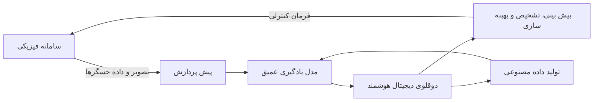

چرخهٔ اصلی در یک دوقلوی دیجیتال تصویری شامل پنج مرحله است:

1. مشاهدهٔ سامانهٔ فیزیکی با دوربین و حسگر؛
2. انتقال و پیش‌پردازش داده؛
3. استخراج اطلاعات با مدل یادگیری عمیق؛
4. به‌روزرسانی مدل دیجیتال و تصمیم‌گیری؛
5. ارسال بازخورد یا فرمان به سامانهٔ فیزیکی.

---

# 1. مقدمه

## 1.1 دوقلوی دیجیتال چیست؟

دوقلوی دیجیتال یک بازنمایی مجازی از یک شیء، فرایند، سامانه یا محیط فیزیکی است که هم‌زمان با نمونهٔ واقعی کار می‌کند و به‌طور پیوسته با داده‌های واقعی به‌روزرسانی می‌شود. تفاوت بنیادی دوقلوی دیجیتال با شبیه‌سازی سنتی در این است که شبیه‌سازی معمولاً بر اساس فرض‌ها، شرایط اولیه و سناریوهای از پیش تعیین‌شده اجرا می‌شود، اما دوقلوی دیجیتال از جریان زندهٔ داده بهره می‌گیرد و وضعیت جاری سامانهٔ فیزیکی را دنبال می‌کند.

ویژگی‌های اصلی یک دوقلوی دیجیتال عبارت‌اند از:

- اتصال پیوسته به سامانهٔ فیزیکی؛
- دریافت و همگام‌سازی دادهٔ بلادرنگ یا نزدیک به بلادرنگ؛
- وجود مدل محاسباتی یا شبیه‌سازی؛
- قابلیت پایش و تشخیص وضعیت؛
- پیش‌بینی رفتار آینده؛
- امکان آزمایش تصمیم‌ها در فضای مجازی؛
- ایجاد حلقهٔ بازخورد به سامانهٔ فیزیکی.

دوقلوهای دیجیتال می‌توانند از داده‌های حسگرها برای کاهش زمان توقف، پیش‌بینی خرابی، افزایش عمر تجهیزات، بهینه‌سازی عملکرد و آزمودن طراحی‌های جدید پیش از پیاده‌سازی واقعی استفاده کنند.

## 1.2 تفاوت شبیه‌سازی، دوقلوی دیجیتال و دوقلوی دیجیتال هوشمند

| ویژگی | شبیه‌سازی سنتی | دوقلوی دیجیتال | دوقلوی دیجیتال هوشمند |
|---|---|---|---|
| اتصال مستقیم به سامانهٔ واقعی | معمولاً ندارد | دارد | دارد |
| به‌روزرسانی با دادهٔ زنده | محدود یا آفلاین | پیوسته | پیوسته |
| یادگیری از داده | معمولاً ندارد | ممکن است محدود باشد | بخش محوری معماری است |
| پیش‌بینی | مبتنی بر مدل از پیش تعریف‌شده | مدل و داده | مدل، داده و هوش مصنوعی |
| تصمیم‌گیری خودکار | معمولاً ندارد | گاهی | معمولاً دارد |
| سازگاری با تغییرات | کم | متوسط | بالا |
| تولید فرمان کنترلی | نادر | ممکن | یکی از قابلیت‌های اصلی |

## 1.3 نقش هوش مصنوعی در هوشمندسازی دوقلو

هوش مصنوعی، یادگیری ماشین و یادگیری عمیق به دوقلوی دیجیتال اجازه می‌دهند تا:

- الگوهای پیچیده را در داده پیدا کند؛
- ناهنجاری‌ها را شناسایی کند؛
- خرابی‌های آینده را پیش‌بینی کند؛
- از تجربه‌های گذشته یاد بگیرد؛
- تصمیم‌های کنترلی را بهینه کند؛
- خود را با شرایط جدید تطبیق دهد؛
- از داده‌های چندحسگری و چندوجهی استفاده کند.

در سامانه‌های تصویری، یادگیری عمیق برای طبقه‌بندی تصویر، تشخیص شیء، قطعه‌بندی معنایی، ردیابی، تخمین حالت بدن، تحلیل ویدئو، بازسازی سه‌بعدی و تشخیص عیب به کار می‌رود.

## 1.4 چرا دادهٔ تصویری مهم است؟

تصویر معمولاً حاوی اطلاعات مکانی بسیار غنی است. یک فریم دوربین می‌تواند هم‌زمان اطلاعات زیر را در اختیار دوقلوی دیجیتال قرار دهد:

- تعداد و موقعیت اشیا؛
- وضعیت سطح و ظاهر محصول؛
- شکل، رنگ، بافت و هندسه؛
- حضور یا عدم حضور انسان؛
- وضعیت بدن، ژست یا حرکت؛
- دما در تصاویر حرارتی؛
- عمق و فاصله در دوربین‌های RGB-D؛
- تغییرات زمانی در ویدئو.

در نتیجه، تصویر می‌تواند وضعیت‌هایی را آشکار کند که اندازه‌گیری آن‌ها با حسگرهای عددی دشوار یا پرهزینه است.

## 1.5 چالش اولیهٔ ادغام تصویر و دوقلوی دیجیتال

با وجود مزایای زیاد، ادغام مدل‌های بینایی عمیق با دوقلوی دیجیتال ساده نیست. مشکلات اصلی عبارت‌اند از:

- نیاز به مجموعه‌داده‌های بزرگ و باکیفیت؛
- هزینهٔ برچسب‌گذاری؛
- پردازش سنگین تصاویر با وضوح بالا؛
- دشواری همگام‌سازی بلادرنگ؛
- حساسیت به نور، زاویه و شرایط محیطی؛
- تفسیرپذیری پایین شبکه‌های عمیق؛
- محدودیت منابع در لبه و تجهیزات توکار؛
- تهدیدهای امنیتی و حریم خصوصی.

## 1.6 مشارکت‌های اصلی مقاله

مقاله چهار مشارکت اصلی دارد:

1. مرور و مقایسهٔ مدل‌های یادگیری عمیق قابل استفاده در دوقلوهای دیجیتال تصویری؛
2. تشریح معماری دوقلوی دیجیتال هوشمند و جریان داده در لایه‌های مختلف؛
3. بررسی چالش‌های اخذ تصویر، انتخاب دوربین، پردازش و استقرار مدل؛
4. مرور کاربردهای موجود، شناسایی شکاف پژوهشی و پیشنهاد جهت‌های آینده.

---

# 2. مرور پژوهش‌های پیشین دربارهٔ دوقلوی دیجیتال

مطالعات مروری موجود دوقلوی دیجیتال را از دیدگاه‌های گوناگون بررسی کرده‌اند، اما بیشتر آن‌ها بر تعریف، معماری عمومی، کاربرد یا فناوری‌های توانمندساز تمرکز دارند و کمتر به‌صورت اختصاصی به نقش مدل‌های عمیق مبتنی بر تصویر پرداخته‌اند.

## 2.1 مرورهای عمومی دوقلوی دیجیتال

پژوهش‌های عمومی موضوعات زیر را پوشش می‌دهند:

- تعریف و ویژگی‌های دوقلوی دیجیتال؛
- معماری فیزیکی ـ دیجیتال؛
- فناوری‌های توانمندساز؛
- اینترنت اشیا؛
- داده‌های بزرگ؛
- رایانش ابری و لبه؛
- یادگیری ماشین؛
- امنیت و استانداردسازی؛
- چالش‌های پیاده‌سازی.

نتیجهٔ مشترک این مطالعات آن است که ترکیب هوش مصنوعی، پردازش دادهٔ بزرگ، رایانش توزیع‌شده و ارتباطات پرسرعت می‌تواند دوقلوهای دیجیتال را از ابزارهای صرفاً نمایشی به سامانه‌های تصمیم‌یار و خودسازگار تبدیل کند.

## 2.2 کشاورزی

در کشاورزی، دوقلوی دیجیتال می‌تواند یک مزرعه، گلخانه، دامداری یا زنجیرهٔ تأمین کشاورزی را بازنمایی کند. منابع داده شامل حسگر خاک، دادهٔ آب‌وهوایی، تصاویر پهپاد و تصاویر محصول هستند.

کاربردها:

- تحلیل وضعیت خاک؛
- تشخیص آفت و بیماری؛
- مدیریت آبیاری؛
- پیش‌بینی عملکرد محصول؛
- پایش سلامت دام؛
- کاهش مصرف آب و کود؛
- بهینه‌سازی کشاورزی پایدار.

## 2.3 صنعت هوانوردی

در هوانوردی، دوقلوهای دیجیتال برای مدیریت چرخهٔ عمر هواپیما، طراحی، ساخت، تعمیر و نگهداری و تعامل انسان و ماشین استفاده می‌شوند. ترکیب مدل‌های با وفاداری بالا، داده‌های حسگر و هوش مصنوعی می‌تواند خرابی سازه یا موتور را پیش‌بینی کند.

## 2.4 دوقلوهای دیجیتال شهری

دوقلوی شهر، یک مدل دیجیتال پویا از زیرساخت، حمل‌ونقل، انرژی، ساختمان، محیط‌زیست و جمعیت است. کاربردها شامل مدیریت ترافیک، برنامه‌ریزی شهری، واکنش به بحران، پایش آلودگی، نگهداری زیرساخت و بهینه‌سازی انرژی است.

## 2.5 ساخت‌وساز و مدیریت تأسیسات

در صنعت ساخت‌وساز، دوقلوی دیجیتال با BIM، حسگرهای سازه‌ای و تصاویر کارگاه ترکیب می‌شود. کاربردها شامل پایش سلامت سازه، کنترل پیشرفت پروژه، تشخیص عیب، مدیریت تأسیسات، نگهداری پیش‌بینانه و تطبیق مدل ساخته‌شده با نقشهٔ طراحی است.

## 2.6 امنیت سایبری

دوقلوی دیجیتال می‌تواند برای شبیه‌سازی حمله، کشف ناهنجاری، ارزیابی آسیب‌پذیری و پیش‌بینی حادثهٔ امنیتی استفاده شود. در این کاربرد، هوش مصنوعی الگوهای غیرعادی را در دادهٔ شبکه، حسگر و کنترل تشخیص می‌دهد.

## 2.7 سلامت

در سلامت، دوقلوهای دیجیتال می‌توانند مدل‌های شخصی‌سازی‌شده‌ای از بیمار، عضو بدن یا مسیر درمان بسازند. تصاویر پزشکی و داده‌های پوشیدنی می‌توانند برای پایش بیمار و پشتیبانی از تصمیم‌گیری پزشکی استفاده شوند.

چالش‌های سلامت عبارت‌اند از اعتبارسنجی بالینی، حفظ حریم خصوصی، سوگیری داده، تفسیرپذیری و مسئولیت‌پذیری تصمیم‌های خودکار.

## 2.8 صنعت و تولید هوشمند

دوقلوی دیجیتال در صنعت 4.0 برای برنامه‌ریزی تولید، پایش خط تولید، کنترل کیفیت، نگهداری پیش‌بینانه، لجستیک داخلی، کنترل ربات، شناسایی نقص محصول و بهینه‌سازی مصرف انرژی استفاده می‌شود.

## 2.9 شبکه‌های پیشرفته، 5G، 6G و اینترنت اشیا

دوقلوهای دیجیتال شبکه می‌توانند وضعیت شبکهٔ واقعی را بازنمایی کنند و برای تخصیص منابع، مدیریت ترافیک، پیش‌بینی خرابی و بهینه‌سازی ارتباطات به کار روند. فناوری‌های مرتبط شامل شبکه‌های لبه‌ای دوقلوی دیجیتال، 5G و 6G، NB-IoT، LPWAN، Wi-Fi، ZigBee، LoRa، رایانش لبه و یادگیری فدرال هستند.

## 2.10 حمل‌ونقل

در حمل‌ونقل، دوقلوهای دیجیتال برای راه‌آهن، جاده، پل، تونل، خودرو و زیرساخت ترافیکی به کار می‌روند. کاربردهای مهم شامل ارزیابی وضعیت سازه، تشخیص ترک و خرابی، پایش جاده، مدیریت ناوگان و نگهداری پیش‌بینانه است.

## 2.11 کاربردهای میان‌رشته‌ای

مطالعاتی نیز دوقلوی دیجیتال را در نفت و گاز، طراحی محصول، شبکهٔ هوشمند، مدیریت انرژی و توسعهٔ محصول بررسی کرده‌اند. این مطالعات بر یکپارچه‌سازی CAD، اینترنت اشیا، هوش مصنوعی و تحلیل داده تأکید می‌کنند.

## 2.12 شکاف مطالعات پیشین

مرورهای قبلی بیشتر توضیح می‌دهند که دوقلوی دیجیتال چیست و در چه حوزه‌هایی استفاده می‌شود. شکاف اصلی آن‌ها، نبود تحلیل متمرکز دربارهٔ موارد زیر است:

- انتخاب نوع دوربین؛
- جریان پردازش تصویر؛
- مدل‌های تخصصی بینایی عمیق؛
- مقایسهٔ سرعت و دقت؛
- استفاده از دادهٔ مصنوعی تصویری؛
- کاربرد مدل‌های تصویر در حلقهٔ کنترل دوقلوی دیجیتال.

---

# 3. معماری دوقلوی دیجیتال هوشمند

معماری عمومی یک دوقلوی دیجیتال هوشمند را می‌توان به چهار لایه تقسیم کرد:

1. سامانهٔ فیزیکی؛
2. رایانش لبه؛
3. سامانهٔ دیجیتال؛
4. شبکهٔ دوقلوهای دیجیتال.

## 3.1 نمای معماری چهارلایه

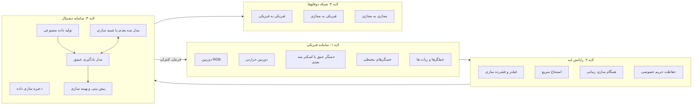

## 3.2 لایهٔ سامانهٔ فیزیکی

سامانهٔ فیزیکی منبع اصلی داده است. این لایه می‌تواند شامل تجهیزات صنعتی، انسان، ربات، خودرو، ساختمان، مزرعه یا هر دارایی واقعی باشد.

اجزای متداول:

- دوربین‌های نظارتی؛
- حسگرهای دما و رطوبت؛
- حسگر موقعیت؛
- رادار و LiDAR؛
- حسگر عمق؛
- عملگر و ربات؛
- ایستگاه پایهٔ ارتباطی؛
- کنترل‌کنندهٔ محلی.

وظایف این لایه:

- اندازه‌گیری وضعیت واقعی؛
- ارسال داده به لایهٔ دیجیتال؛
- اجرای فرمان‌های کنترلی؛
- فراهم‌کردن ارتباط دوطرفه.

## 3.3 لایهٔ رایانش لبه

رایانش لبه میان سامانهٔ فیزیکی و فضای ابری قرار می‌گیرد. هدف آن کاهش تأخیر و حجم انتقال داده است.

وظایف:

- حذف فریم‌های بی‌اهمیت؛
- فشرده‌سازی ویدئو؛
- پیش‌پردازش تصویر؛
- استنتاج مدل سبک؛
- تشخیص اولیهٔ رخداد؛
- ناشناس‌سازی چهره یا اطلاعات حساس؛
- کش‌کردن داده؛
- تداوم سرویس در قطع ارتباط با ابر.

## 3.4 سامانهٔ دیجیتال

سامانهٔ دیجیتال همتای منطقی و محاسباتی سامانهٔ فیزیکی است. این بخش ممکن است در ابر، مرکز داده یا ترکیبی از لبه و ابر پیاده‌سازی شود.

اجزای اصلی:

- مدل هندسی یا سه‌بعدی؛
- موتور شبیه‌سازی؛
- پایگاه داده؛
- مدل‌های یادگیری عمیق؛
- مدل تصمیم‌گیری؛
- داشبورد و رابط کاربر؛
- ماژول تولید دادهٔ مصنوعی؛
- ماژول بهینه‌سازی و کنترل.

سامانهٔ دیجیتال می‌تواند از موتورهایی مانند Unity، Unreal یا نرم‌افزارهای شبیه‌سازی صنعتی برای ایجاد محیط مجازی استفاده کند.

## 3.5 شبکهٔ دوقلوهای دیجیتال

وقتی چند دوقلوی دیجیتال با یکدیگر تبادل داده می‌کنند، مفهوم **Digital Twin Network (DTN)** شکل می‌گیرد.

سه نوع ارتباط مهم:

- **P2P:** ارتباط موجودیت فیزیکی با موجودیت فیزیکی؛
- **P2V:** ارتباط موجودیت فیزیکی با مدل مجازی؛
- **V2V:** ارتباط مدل مجازی با مدل مجازی.

در یک سامانهٔ ساده، تنها یک ارتباط یک‌به‌یک میان دارایی و دوقلوی آن وجود دارد؛ اما در کارخانه، شهر یا شبکهٔ مخابراتی، ارتباط‌ها چندبه‌چند هستند. DTNها می‌توانند از 5G، 6G، LoRa، Wi-Fi، ZigBee، LPWAN و NB-IoT استفاده کنند. هر نوع ارتباط به سطح متفاوتی از قابلیت اطمینان، تأخیر، ظرفیت و اتصال نیاز دارد.

## 3.6 جریان داده در دوقلوی دیجیتال هوشمند

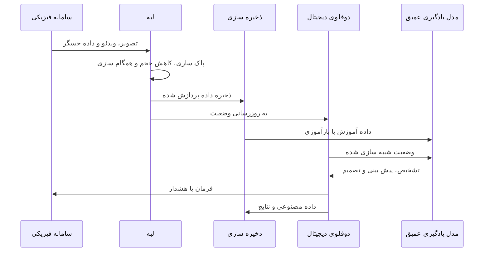

## 3.7 نقش دادهٔ مصنوعی

سامانهٔ دیجیتال فقط مصرف‌کنندهٔ داده نیست؛ می‌تواند دادهٔ مصنوعی نیز تولید کند. دادهٔ مصنوعی برای افزایش تنوع نمونه‌ها، شبیه‌سازی حالت‌های نادر، کاهش هزینهٔ برچسب‌گذاری، تمرین مدل در شرایط خطرناک و ایجاد داده برای عیوبی که هنوز در سامانهٔ واقعی رخ نداده‌اند مفید است.

ابزارهای رایج تولید دادهٔ مصنوعی عبارت‌اند از Unity Perception، Microsoft AirSim، UnrealROX، موتورهای CAD و مدل‌های مولد مانند GAN و Diffusion.

> **نکتهٔ تکمیلی تدوین‌کننده — صورت‌بندی سیستمی دوقلو**
>
> می‌توان یک دوقلوی دیجیتال تصویری را به‌صورت یک سامانهٔ حالت گسسته نمایش داد:
>
> $$
> x_{t+1}=f(x_t,u_t,w_t)
> $$
>
> $$
> y_t^{\text{img}}=h(x_t,v_t)
> $$
>
> که در آن، \(x_t\) حالت واقعی سامانه، \(u_t\) ورودی کنترلی، \(w_t\) اغتشاش فرایند، \(y_t^{\text{img}}\) تصویر یا ویژگی تصویری و \(v_t\) نویز اندازه‌گیری است. مدل بینایی نگاشت \(\hat{x}_t=g_\theta(y_t^{\text{img}})\) را می‌آموزد و دوقلو بر اساس حالت تخمینی، فرمان مناسب را می‌سازد.


---

# 4. اخذ و پیش‌پردازش دادهٔ تصویری

دادهٔ تصویری ورودی اصلی مدل‌های بینایی در دوقلوهای دیجیتال تصویری است. کیفیت طراحی زنجیرهٔ اخذ داده، به‌اندازهٔ انتخاب معماری شبکهٔ عصبی اهمیت دارد؛ زیرا مدل قوی نمی‌تواند خطاهای جدی کالیبراسیون، برچسب‌گذاری یا همگام‌سازی را به‌طور کامل جبران کند.

## 4.1 انتخاب حسگر و دوربین

انتخاب حسگر باید با نوع کاربرد و اطلاعات موردنیاز سازگار باشد.

| نوع حسگر | دادهٔ تولیدی | کاربرد مناسب | محدودیت اصلی |
|---|---|---|---|
| دوربین RGB | رنگ و بافت دوبعدی | تشخیص عیب، شیء و انسان | حساسیت به نور |
| دوربین حرارتی | توزیع دما | پایش کیفیت، تشخیص داغی و نشتی | تأثیر دمای محیط و رطوبت |
| دوربین عمق | فاصله و هندسه | رباتیک، اندازه‌گیری و تعامل انسان ـ ماشین | برد و نویز عمق |
| RGB-D | رنگ به همراه عمق | بازسازی سه‌بعدی و ردیابی | هزینه و حجم داده |
| دوربین ۳۶۰ درجه | دید پیرامونی | پایش جاده و محیط گسترده | اعوجاج تصویر |
| دوربین مادون قرمز | تصویر در نور کم | پایش شب و حضور انسان | جزئیات رنگی محدود |
| وب‌کم | تصویر کم‌هزینه | سلامت و تعامل کاربر | کیفیت و پایداری محدود |
| دوربین تک‌چشمی | تصویر دوبعدی | BIM و پایش ساختمان | تخمین عمق دشوار |
| اسکنر سه‌بعدی | ابرنقاط یا مش | اندازه‌گیری سطح و عیب هندسی | هزینه و پردازش بالا |
| پهپاد | تصویر هوایی | کشاورزی و زیرساخت | محدودیت باتری و مقررات |
| LiDAR | ابرنقاط دقیق | راه‌آهن، خودرو و نقشه‌برداری | هزینه و دادهٔ حجیم |

نوع دوربین باید بر اساس سؤال مهندسی انتخاب شود. اگر هدف تشخیص تغییر دما یا نقاط داغ است، دوربین RGB به‌تنهایی مناسب نیست. اگر هدف تخمین فاصلهٔ انسان از ربات باشد، دوربین عمق یا سامانهٔ چنددوربینه ارزش بیشتری دارد. اگر تنها تشخیص حضور یا کلاس شیء لازم باشد، دوربین تک‌چشمی کم‌هزینه ممکن است کافی باشد.

## 4.2 مسیر اخذ تا تصمیم

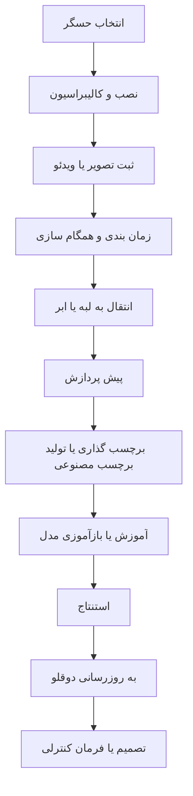

سامانهٔ فیزیکی ابتدا داده را ثبت می‌کند. داده ممکن است در همان محل به‌صورت اولیه پردازش شود یا از طریق شبکه به سرور لبه یا ابر منتقل شود. تصاویر پردازش‌شده در مخزن داده ذخیره می‌شوند و برای آموزش یا بازآموزی مدل به کار می‌روند. خروجی مدل، وضعیت دوقلو را به‌روزرسانی کرده و در صورت نیاز به فرمان، هشدار یا اقدام منجر می‌شود.

## 4.3 تولید و استفاده از تصویر مصنوعی

دادهٔ واقعی همیشه کافی نیست. ممکن است برخی خطاها به‌ندرت رخ دهند، ایجاد آن‌ها خطرناک باشد یا برچسب‌گذاری دقیق آن‌ها هزینهٔ زیادی داشته باشد. محیط مجازی می‌تواند حالت‌های مختلف را شبیه‌سازی کند:

- نورهای متفاوت؛
- زاویه‌های مختلف دوربین؛
- خرابی‌های متنوع؛
- شرایط اضطراری؛
- اشیای با اندازه و رنگ متفاوت؛
- ازدحام؛
- انسداد جزئی؛
- نویز و تاری.

ترکیب دادهٔ واقعی و مصنوعی، مجموعه‌داده را غنی‌تر می‌کند. همچنین در محیط مجازی می‌توان برای هر شیء، جعبهٔ محدودکننده، ماسک قطعه‌بندی، عمق، وضعیت سه‌بعدی و کلاس را به‌صورت خودکار تولید کرد. با این حال، اختلاف میان دادهٔ شبیه‌سازی‌شده و واقعی یا **شکاف دامنه** باید مدیریت شود.

## 4.4 مراحل پیش‌پردازش تصویر

### 4.4.1 تغییر اندازه

برای یکسان‌سازی ورودی شبکه:

\[
I'=\operatorname{Resize}(I,H,W)
\]

تغییر اندازه باید با دقت انجام شود؛ زیرا کشیدن تصویر بدون حفظ نسبت ابعاد می‌تواند هندسهٔ اشیا را تغییر دهد.

### 4.4.2 نرمال‌سازی

یک روش رایج:

\[
I_{\text{norm}}=\frac{I-\mu}{\sigma}
\]

یا تبدیل شدت پیکسل از بازهٔ 0 تا 255 به بازهٔ 0 تا 1. نرمال‌سازی می‌تواند آموزش را پایدارتر کند.

### 4.4.3 حذف نویز

فیلترهای قابل استفاده:

- Gaussian؛
- Median؛
- Bilateral؛
- Non-local Means؛
- مدل‌های یادگیری عمیق حذف نویز.

انتخاب فیلتر باید با نوع نویز سازگار باشد؛ برای مثال فیلتر میانه برای نویز ضربه‌ای مناسب است، در حالی که فیلتر Gaussian ممکن است لبه‌های ظریف را محو کند.

### 4.4.4 بهبود تصویر

- افزایش کنتراست؛
- اصلاح گاما؛
- Histogram Equalization؛
- CLAHE؛
- ابرتفکیک‌پذیری؛
- اصلاح نور و سایه؛
- تصحیح اعوجاج لنز.

### 4.4.5 ثبت و هم‌ترازی تصویر

در دوقلوهای دیجیتال لازم است تصویر واقعی با مدل مجازی، تصویر مرجع یا فریم‌های قبلی هم‌راستا شود. این کار می‌تواند با نقاط کلیدی، تخمین هموگرافی، Optical Flow، ICP برای ابرنقاط، تطبیق ویژگی و کالیبراسیون داخلی و خارجی دوربین انجام شود.

### 4.4.6 افزایش داده

- چرخش؛
- برش؛
- وارونگی؛
- تغییر روشنایی؛
- نویز مصنوعی؛
- MixUp؛
- CutMix؛
- Mosaic؛
- تغییر مقیاس.

افزایش داده باید با واقعیت فیزیکی سازگار باشد. برای مثال وارونگی عمودی یک قطعه ممکن است در خط تولید واقعی ناممکن باشد و استفادهٔ بی‌قاعده از آن مدل را دچار یادگیری غیرواقعی کند.

## 4.5 چالش‌های کار با تصویر

### 4.5.1 کالیبراسیون و همگام‌سازی

دوربین و حسگر باید از نظر زمان و فضا همگام باشند. خطای زمانی کوچک می‌تواند در سامانه‌های سریع، باعث نسبت‌دادن تصویر به وضعیت اشتباه شود. همگام‌سازی زمانی برای ترکیب تصویر با دادهٔ لرزش، فشار، موقعیت یا فرمان کنترل ضروری است.

### 4.5.2 حجم بالای داده

ویدئوی با وضوح بالا پهنای باند و ذخیره‌سازی زیادی نیاز دارد. راهکارها:

- پردازش در لبه؛
- نمونه‌برداری تطبیقی؛
- فشرده‌سازی؛
- ذخیرهٔ رخدادمحور؛
- نگهداری ویژگی به‌جای تمام فریم‌ها؛
- حذف فریم‌های تکراری.

### 4.5.3 امنیت و حریم خصوصی

تصویر ممکن است شامل چهره، محیط خصوصی، اطلاعات صنعتی یا دارایی‌های حساس باشد. باید از رمزنگاری، کنترل دسترسی، ناشناس‌سازی، ثبت رخداد، تفکیک داده و سیاست نگهداری داده استفاده شود.

### 4.5.4 تنوع محیط واقعی

یک مدل آموزش‌دیده در محیط کنترل‌شده ممکن است در نور کم، گردوغبار، مه، سایه، لرزش یا انسداد عملکرد ضعیفی داشته باشد. این مسئله یکی از دلایل اصلی فاصلهٔ عملکرد آزمایشگاهی و صنعتی است.

> **نکتهٔ تکمیلی تدوین‌کننده — کیفیت داده به‌عنوان بخشی از حالت دوقلو**
>
> بهتر است کیفیت تصویر فقط به‌عنوان یک مسئلهٔ پیش‌پردازش دیده نشود. دوقلوی دیجیتال می‌تواند یک متغیر «اطمینان مشاهده» نیز نگه دارد:
>
> $$
> q_t=\phi(\text{blur},\text{noise},\text{illumination},\text{occlusion})
> $$
>
> سپس وزن تصمیم مدل بر اساس کیفیت مشاهده تنظیم شود:
>
> $$
> \hat{x}_t=q_t\hat{x}^{\text{vision}}_t+(1-q_t)\hat{x}^{\text{model}}_t
> $$
>
> به این ترتیب، وقتی کیفیت تصویر پایین است، دوقلو بیشتر به مدل فیزیکی یا حسگرهای دیگر تکیه می‌کند.

---

# 5. مدل‌های هوش تصویری در دوقلوهای دیجیتال

آشکارسازهای عمیق به دو گروه کلی تقسیم می‌شوند:

- **دو‌مرحله‌ای:** ابتدا ناحیه‌های پیشنهادی تولید و سپس طبقه‌بندی می‌شوند؛ مانند Faster R-CNN.
- **تک‌مرحله‌ای:** مکان و کلاس در یک مسیر واحد پیش‌بینی می‌شوند؛ مانند YOLO و SSD.

مدل‌های دو‌مرحله‌ای معمولاً دقت بالاتری دارند، ولی مدل‌های تک‌مرحله‌ای برای پردازش بلادرنگ مناسب‌ترند.

## 5.1 شبکه‌های عصبی کانولوشنی

شبکهٔ عصبی کانولوشنی یا CNN یکی از پایه‌ای‌ترین معماری‌های پردازش تصویر است.

### 5.1.1 ساختار کلی CNN

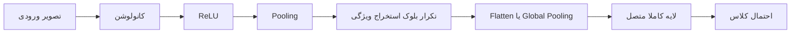

### 5.1.2 عملیات کانولوشن

\[
Y_{i,j,k}=\sum_m\sum_u\sum_v W_{u,v,m,k}X_{i+u,j+v,m}+b_k
\]

فیلترهای اولیه معمولاً لبه و گوشه را استخراج می‌کنند و لایه‌های عمیق‌تر الگوهای پیچیده مانند بافت، شکل یا جزء یک شیء را یاد می‌گیرند.

### 5.1.3 تابع فعال‌سازی ReLU

\[
\operatorname{ReLU}(x)=\max(0,x)
\]

### 5.1.4 Pooling

Pooling ابعاد ویژگی را کاهش داده و مقاومت مدل را در برابر جابه‌جایی جزئی افزایش می‌دهد. Max Pooling بیشترین مقدار و Average Pooling میانگین مقادیر یک ناحیه را نگه می‌دارد.

### 5.1.5 معماری‌های مهم CNN

- AlexNet؛
- VGG؛
- GoogLeNet؛
- ResNet.

در گزارش مقاله، خطای Top-5 روی ImageNet برای این مدل‌ها به‌ترتیب حدود 16.4، 7.3، 6.7 تا 7.4 و 3.6 درصد گزارش شده است. این روند نشان می‌دهد که پیشرفت معماری، ماژول‌های Inception و اتصال‌های باقیمانده عملکرد طبقه‌بندی را بهبود داده‌اند.

### 5.1.6 کاربرد CNN در دوقلوی دیجیتال

- طبقه‌بندی کیفیت میوه از تصویر حرارتی؛
- تشخیص عیب ریل؛
- تعامل انسان و ربات؛
- طبقه‌بندی وضعیت تجهیزات؛
- استخراج ویژگی برای سایر آشکارسازها.

### 5.1.7 مزایا و محدودیت‌ها

**مزایا:**

- مناسب برای استخراج ویژگی مکانی؛
- عملکرد قوی در طبقه‌بندی؛
- امکان یادگیری انتهابه‌انتها؛
- وجود مدل‌های ازپیش‌آموزش‌دیده.

**محدودیت‌ها:**

- پارامتر زیاد؛
- نیاز به دادهٔ فراوان؛
- خطر بیش‌برازش؛
- هزینهٔ محاسباتی؛
- محدودیت CNN ساده در تشخیص چند شیء، اشیای کوچک، هم‌پوشانی و کنتراست پایین.

---

## 5.2 خانوادهٔ R-CNN

مدل‌های R-CNN آشکارسازی شیء را به‌صورت دو مرحله‌ای انجام می‌دهند:

1. تولید ناحیهٔ پیشنهادی؛
2. طبقه‌بندی و اصلاح جعبهٔ محدودکننده.

## 5.2.1 R-CNN

مراحل R-CNN:

1. تولید حدود 2000 ناحیه با Selective Search؛
2. تغییر اندازهٔ هر ناحیه به اندازهٔ ثابت؛
3. عبور جداگانهٔ هر ناحیه از CNN؛
4. استخراج یک بردار ویژگی؛
5. طبقه‌بندی با SVM؛
6. اصلاح جعبه با Bounding Box Regression؛
7. حذف جعبه‌های تکراری با NMS.

### معیار IoU

\[
\operatorname{IoU}(A,B)=\frac{|A\cap B|}{|A\cup B|}
\]

### Non-Maximum Suppression

در NMS، جعبه‌ای که بیشترین امتیاز را دارد نگه داشته می‌شود و جعبه‌های هم‌پوشان ضعیف‌تر حذف می‌شوند. در توضیح مقاله، آستانهٔ 0.5 به‌عنوان نمونه مطرح شده است.

### محدودیت R-CNN

پردازش هر ناحیه به‌صورت جداگانه بسیار کند است. مقاله زمان تقریبی 47 ثانیه برای هر تصویر را ذکر می‌کند؛ بنابراین این مدل برای حلقهٔ بلادرنگ دوقلو مناسب نیست. همچنین Selective Search یک الگوریتم ثابت است و توانایی یادگیری ناحیه‌های بهتر را ندارد.

## 5.2.2 Fast R-CNN

Fast R-CNN کل تصویر را یک‌بار از CNN عبور می‌دهد و سپس ویژگی نواحی را با RoI Pooling استخراج می‌کند. مزیت اصلی آن اشتراک محاسبات کانولوشنی بین تمام نواحی است و حدود 9 برابر سریع‌تر از R-CNN گزارش شده است. با این حال، هنوز از Selective Search استفاده می‌کند و تولید ناحیه همچنان گلوگاه است.

## 5.2.3 Faster R-CNN

Faster R-CNN، Selective Search را با **Region Proposal Network (RPN)** جایگزین می‌کند. RPN بخشی قابل‌آموزش از شبکه است و ناحیه‌های پیشنهادی را مستقیماً از نقشهٔ ویژگی می‌سازد.

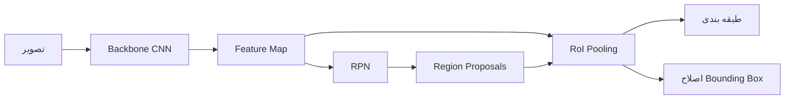

مقاله زمان حدود 0.2 ثانیه برای پردازش یک تصویر با Faster R-CNN را ذکر می‌کند که بسیار سریع‌تر از R-CNN اولیه است، هرچند همچنان در بسیاری از کاربردهای سخت بلادرنگ از YOLO کندتر است.

### کاربرد در دوقلو

Faster R-CNN برای تشخیص عیب سطح محصول در دوقلوهای تولیدی مناسب است؛ به‌خصوص زمانی که دقت از سرعت مهم‌تر باشد.

### مزایا

- دقت بالا؛
- مناسب صحنه‌های پیچیده؛
- آشکارسازی خوب اشیای کوچک‌تر نسبت به برخی مدل‌های تک‌مرحله‌ای؛
- ناحیه‌سازی قابل‌آموزش.

### محدودیت‌ها

- نسبت به YOLO کندتر؛
- پردازش و حافظهٔ بیشتر؛
- استقرار دشوارتر روی لبه؛
- پیچیدگی بیشتر زنجیرهٔ استنتاج.

---

## 5.3 خانوادهٔ YOLO

YOLO یک آشکارساز تک‌مرحله‌ای است. این مدل تصویر را به شبکه‌ای از سلول‌ها تقسیم می‌کند و جعبه‌ها و احتمال کلاس‌ها را در یک عبور پیش‌بینی می‌کند.

### 5.3.1 ساختار پیش‌بینی

خروجی کلاسیک YOLO:

\[
S\times S\times(B\times 5+C)
\]

که در آن:

- \(S\times S\): شبکهٔ مکانی؛
- \(B\): تعداد جعبه در هر سلول؛
- 5: مختصات \(x,y,w,h\) و اطمینان؛
- \(C\): تعداد کلاس‌ها.

در نسخهٔ اصلی، با \(S=7\)، \(B=2\) و \(C=20\)، خروجی برابر \(7\times7\times30\) است.

### 5.3.2 اطمینان جعبه

\[
\text{Confidence}=P(\text{Object})\times \operatorname{IoU}
\]

### 5.3.3 امتیاز کلاس

\[
\text{ClassScore}_i=P(\text{Class}_i|\text{Object})\times \text{Confidence}
\]

### 5.3.4 مسیر پردازش YOLO

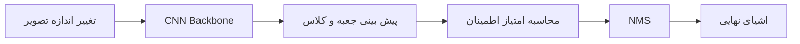

نسخهٔ استاندارد YOLO اولیه حدود 45 FPS و نسخهٔ سریع آن تا حدود 145 FPS گزارش شده است. دلیل سرعت بالا این است که کل تصویر در یک مدل واحد و یک عبور پردازش می‌شود.

### 5.3.5 نسخه‌های بررسی‌شده

- YOLO اصلی؛
- YOLOv3 و YOLOv3-tiny؛
- YOLOv4 و YOLOv4-tiny؛
- YOLOv5s و YOLOv5x.

YOLOv3 از Darknet-53 استفاده می‌کند و نسخهٔ Tiny آن به معماری سبک‌تری متکی است. YOLOv4 برای بهبود مکان‌یابی از Complete-IoU استفاده می‌کند. YOLOv5 با PyTorch توسعه یافته و اندازه‌های مختلف s، m، l و x دارد.

### 5.3.6 نمونهٔ مقایسهٔ سرعت و دقت

طبق نتایج مقاله در مسئلهٔ شمارش خوشهٔ انگور:

| مدل | mAP@50 | FPS |
|---|---:|---:|
| YOLOv3-tiny | 56.4% | 200 |
| YOLOv4-tiny | 65.7% | 196 |
| YOLOv5s | 77.5% | 61.1 |
| YOLOv3 | 72.9% | 34.7 |
| YOLOv4 | 79.2% | 31.1 |
| YOLOv5x | 79.66% | 32.2 |

نتیجه روشن است: نسخه‌های Tiny بسیار سریع‌اند، اما دقت پایین‌تری دارند.

### 5.3.7 کاربرد در دوقلوی دیجیتال

- پایش فاصلهٔ اجتماعی؛
- تشخیص وضعیت بدن؛
- آشکارسازی شکست ابزار؛
- تشخیص اشیای محیط؛
- کنترل آنتن و بازتابنده؛
- تطبیق تصویر ساختمان با BIM.

### 5.3.8 مزایا و محدودیت‌ها

**مزایا:**

- سرعت بالا؛
- مناسب استنتاج بلادرنگ؛
- معماری یکپارچه؛
- تعادل مناسب دقت و سرعت.

**محدودیت‌ها:**

- دشواری در اشیای کوچک و متراکم؛
- حساسیت به انسداد؛
- نیاز محاسباتی نسخه‌های بزرگ؛
- وابستگی عملکرد به اندازهٔ ورودی؛
- محدودیت شبکه‌بندی کلاسیک در اشیای گروهی.


---

## 5.4 MediaPipe

MediaPipe یک چارچوب متن‌باز و چندسکویی برای ساخت زنجیره‌های پردازش ادراکی است که توسط Google توسعه داده شده است. این چارچوب روی iOS، Android، دسکتاپ، ابر و برخی بسترهای IoT قابل استفاده است و می‌تواند از CPU، GPU و TPU بهره بگیرد.

کاربردهای آمادهٔ آن شامل موارد زیر است:

- تشخیص چهره؛
- ردیابی دست؛
- تخمین وضعیت بدن؛
- قطعه‌بندی مو؛
- تشخیص و ردیابی اشیای دوبعدی و سه‌بعدی؛
- پردازش بلادرنگ روی موبایل و وب.

### مزایا

- استقرار آسان؛
- پشتیبانی از موبایل، دسکتاپ، وب و IoT؛
- مدل‌های ازپیش‌ساخته؛
- مناسب نمونه‌سازی سریع؛
- عملکرد بلادرنگ؛
- قابلیت انتقال زنجیرهٔ پردازش میان پلتفرم‌ها.

### محدودیت‌ها

- انعطاف‌پذیری کمتر برای وظایف بسیار تخصصی؛
- محدودیت در سفارشی‌سازی عمیق؛
- افت عملکرد در مدل‌های پیچیده یا دادهٔ حجیم؛
- وابستگی به قابلیت‌ها و مدل‌های موجود در چارچوب.

### کاربرد در دوقلوی دیجیتال

در یک دوقلوی سلامت می‌توان با وب‌کم، چهره و حالت بدن بیمار را دریافت و با MediaPipe ویژگی‌های حرکتی یا احساسی را استخراج کرد. خروجی این ماژول سپس به یک طبقه‌بند یادگیری ماشین داده می‌شود تا حالت بیمار تخمین زده شود.

---

## 5.5 Swin Transformer

Transformerهای بینایی در پردازش وابستگی‌های دوربرد موفق‌اند، اما Self-Attention سراسری برای تصاویر بزرگ هزینهٔ محاسباتی مربعی دارد. ViTهای اولیه همچنین نقشهٔ ویژگی با وضوح ثابت می‌سازند و برای وظایفی مانند تشخیص و قطعه‌بندی که به ویژگی چندمقیاسی نیاز دارند، محدودیت دارند.

Swin Transformer این مشکل را با دو ایده حل می‌کند:

1. Self-Attention در پنجره‌های محلی؛
2. جابه‌جایی پنجره‌ها بین لایه‌های متوالی.

## 5.5.1 سازوکار پنجرهٔ جابه‌جا‌شونده

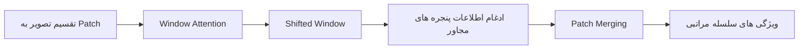

در یک لایه، Self-Attention درون پنجره‌های جداگانه انجام می‌شود. در لایهٔ بعدی، مرز پنجره‌ها جابه‌جا می‌شود تا توکن‌هایی که قبلاً در پنجره‌های جدا بودند با یکدیگر ارتباط پیدا کنند. این روش ضمن حفظ هزینهٔ محاسباتی مدیریت‌پذیر، زمینهٔ گسترده‌تری از تصویر را پوشش می‌دهد.

## 5.5.2 مراحل معماری

- Patch Partition؛
- Linear Embedding؛
- Swin Transformer Block؛
- Patch Merging؛
- تکرار مراحل در چهار سطح.

اگر تصویر ورودی ابعاد \(H\times W\) داشته باشد، پس از تقسیم اولیه ابعاد مکانی ویژگی حدود \(H/4\times W/4\) است و در مراحل بعدی تا \(H/32\times W/32\) کاهش می‌یابد، در حالی که تعداد کانال‌ها افزایش می‌یابد. این ساختار سلسله‌مراتبی به مدل اجازه می‌دهد جزئیات محلی و مفاهیم سطح بالا را هم‌زمان بیاموزد.

## 5.5.3 نتایج گزارش‌شده

- Top-1 Accuracy برابر 87.3% روی ImageNet-1K؛
- Box AP برابر 58.7 روی COCO؛
- Mask AP برابر 51.1 روی COCO.

## 5.5.4 کاربرد در دوقلوی دیجیتال

Swin-T می‌تواند برای استخراج ویژگی از تصاویر رنگی با وضوح بالا، تشخیص عیب سطح، طبقه‌بندی، آشکارسازی و قطعه‌بندی استفاده شود. در سامانه‌های تولیدی، ترکیب Swin-T با تصاویر دوبعدی و اسکن سه‌بعدی برای تشخیص محصول معیوب مطرح شده است.

## 5.5.5 مزایا و محدودیت‌ها

**مزایا:**

- مناسب تصویر با وضوح بالا؛
- قابلیت مدل‌کردن وابستگی‌های دور؛
- ساختار چندمقیاسی؛
- کاربردپذیری در طبقه‌بندی، تشخیص و قطعه‌بندی؛
- پیچیدگی تقریباً خطی نسبت به اندازهٔ تصویر در ساختار پنجره‌ای.

**محدودیت‌ها:**

- نیاز پردازشی بیشتر از مدل‌های سبک؛
- استقرار دشوارتر روی سخت‌افزار محدود؛
- حساسیت به اندازه و تنظیم Patch؛
- نیاز به داده و تنظیم دقیق؛
- افزایش حافظه برای تصاویر بسیار باکیفیت.

---

## 5.6 مدل‌های 3D-VGG و 3D-ResNet

ویدئو علاوه بر ویژگی مکانی، اطلاعات زمانی دارد. روش‌های سنتی دو‌جریانه معمولاً از تصویر RGB و Optical Flow استفاده می‌کنند، اما محاسبهٔ Optical Flow پرهزینه است. مدل‌های 3D-CNN با فیلترهای سه‌بعدی، هم‌زمان روی زمان و مکان کانولوشن انجام می‌دهند.

\[
Y_{t,i,j,k}=
\sum_{\tau,u,v,m}
W_{\tau,u,v,m,k}
X_{t+\tau,i+u,j+v,m}
\]

## 5.6.1 3D-VGG

نسخهٔ سه‌بعدی VGG است که کانولوشن و Pooling دوبعدی را به سه‌بعدی تبدیل می‌کند. ساختار اصلی VGG حفظ می‌شود، اما ورودی، کانال‌ها و هسته‌های کانولوشن برای دادهٔ ویدئویی تغییر می‌کنند.

## 5.6.2 3D-ResNet

از اتصال‌های باقیمانده استفاده می‌کند:

\[
\mathbf{y}=\mathcal{F}(\mathbf{x})+\mathbf{x}
\]

این اتصال آموزش شبکه‌های عمیق را پایدارتر می‌کند و مشکل کاهش گرادیان را کاهش می‌دهد.

## 5.6.3 کاربردها

- تشخیص حرکت انسان؛
- تولید اسکلت از ویدئو؛
- تعامل انسان و ماشین؛
- تحلیل رفتار در محیط مجازی؛
- تشخیص فعالیت؛
- همکاری انسان و ربات در دوقلوهای سه‌بعدی.

## 5.6.4 عملکرد گزارش‌شده

| مدل | UCF-101 | HMDB-51 |
|---|---:|---:|
| 3D-VGG | 84.6% | 54.1% |
| 3D-ResNet | 86.2% | 53.2% |

3D-ResNet در UCF-101 بهتر از 3D-VGG عمل کرده است، ولی نتیجهٔ HMDB-51 اندکی متفاوت است. این تفاوت نشان می‌دهد عملکرد فقط به معماری وابسته نیست و ویژگی‌های مجموعه‌داده نیز اهمیت دارند.

## 5.6.5 مزایا و محدودیت‌ها

**مزایا:**

- استخراج مشترک ویژگی مکانی و زمانی؛
- مناسب ویدئو؛
- عملکرد خوب در تشخیص کنش؛
- عدم نیاز مستقیم به محاسبهٔ جداگانهٔ Optical Flow.

**محدودیت‌ها:**

- حافظه و توان پردازشی بالا؛
- دشواری استقرار بلادرنگ؛
- مصرف انرژی زیاد؛
- نیاز به ویدئوی برچسب‌خورده؛
- محدودیت در تجهیزات لبه‌ای سبک.

---

## 5.7 آشکارساز SSD

SSD یک آشکارساز تک‌مرحله‌ای است که از نقشه‌های ویژگی در چند مقیاس استفاده می‌کند. این مدل تلاش می‌کند سرعت مدل‌های تک‌مرحله‌ای را با توانایی تشخیص اشیا در اندازه‌های متفاوت ترکیب کند.

## 5.7.1 ایدهٔ اصلی

- اشیای بزرگ در نقشه‌های ویژگی کم‌وضوح؛
- اشیای کوچک در نقشه‌های ویژگی پر‌وضوح؛
- استفاده از Anchor Box با اندازه و نسبت ابعاد مختلف؛
- پیش‌بینی هم‌زمان کلاس و اصلاح مکان جعبه.

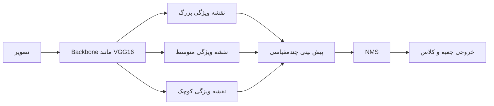

در معماری کلاسیک SSD، لایه‌هایی مانند Conv4_3، Conv7 و لایه‌های اضافی، پیش‌بینی‌های چندمقیاسی تولید می‌کنند. مقاله اشاره می‌کند که در یک پیکربندی، 8732 تشخیص اولیه برای هر کلاس ایجاد می‌شود و سپس با NMS پالایش می‌گردد.

## 5.7.2 تابع زیان SSD

\[
L=\frac{1}{N}\left(L_{\text{conf}}+\alpha L_{\text{loc}}\right)
\]

که در آن:

- \(L_{\text{conf}}\): خطای طبقه‌بندی، معمولاً Cross-Entropy؛
- \(L_{\text{loc}}\): خطای مکان جعبه، معمولاً Smooth L1؛
- \(\alpha\): وزن خطای مکان؛
- \(N\): تعداد Anchorهای تطبیق‌یافته با اشیای واقعی.

## 5.7.3 مزایا

- سریع و مناسب بلادرنگ؛
- تشخیص چندمقیاسی؛
- معماری ساده‌تر از مدل‌های دو‌مرحله‌ای؛
- مناسب نظارت، خودرو و ردیابی؛
- سرعت خوب برای اشیای متوسط و بزرگ.

## 5.7.4 محدودیت‌ها

- دقت کمتر روی اشیای کوچک؛
- حساسیت به تنوع نسبت ابعاد؛
- نیاز به تنظیم Anchorها؛
- احتمال افت دقت در صحنه‌های بسیار شلوغ؛
- دشواری تشخیص در انسداد یا اختلاف مقیاس شدید.

## 5.7.5 کاربرد در دوقلو

SSD در پایش زیرساخت جاده با دوربین ۳۶۰ درجه، GPS، دما، رطوبت و حسگر کیفیت هوا استفاده شده است. داده می‌تواند محلی پردازش و سپس برای پایش گسترده‌تر به سرور ارسال شود.

---

## 5.8 مقایسهٔ خلاصهٔ مدل‌ها

| مدل | Backbone یا ساختار | هدف اصلی | مزایا | محدودیت‌ها |
|---|---|---|---|---|
| CNN | کانولوشن، فعال‌سازی، Pooling و FC | طبقه‌بندی تصویر | مناسب پردازش تصویر و مدل‌های متعدد ازپیش‌آموزش‌دیده | پارامتر زیاد، بیش‌برازش و هزینهٔ محاسباتی |
| Faster R-CNN | CNN، معمولاً ResNet، به همراه RPN | تشخیص شیء | دقت بالا در صحنهٔ پیچیده | کندتر از YOLO و نیازمند منابع بیشتر |
| YOLO | CNN و آشکارساز تک‌مرحله‌ای | تشخیص بلادرنگ | سرعت و دقت متوازن | اشیای کوچک، متراکم و مسدود |
| SSD | VGG، MobileNet یا ResNet | تشخیص سریع چندمقیاسی | سریع و مناسب اشیای بزرگ | محدودیت در اشیای کوچک و تغییرات شدید مقیاس |
| MediaPipe | زنجیرهٔ پردازش وابسته به کاربرد | چهره، دست و بدن | بلادرنگ، چندسکویی و ساده | سفارشی‌سازی محدود در مسئله‌های خاص |
| Swin-T | Transformer سلسله‌مراتبی | طبقه‌بندی، تشخیص و قطعه‌بندی | مناسب تصویر بزرگ و وظایف چندگانه | توان پردازشی بیشتر |
| 3D-VGG | 3D-CNN بر پایهٔ VGG | طبقه‌بندی ویدئو | استخراج مکانی ـ زمانی | حافظه و محاسبهٔ بالا |
| 3D-ResNet | 3D-CNN با اتصال باقیمانده | ویدئو و تشخیص حرکت | آموزش پایدارتر و عملکرد خوب | استقرار بلادرنگ دشوار |

---

# 6. مقایسهٔ عملکرد مدل‌ها

عملکرد مدل فقط به معماری وابسته نیست. نوع وظیفه، دوبعدی یا سه‌بعدی‌بودن داده، حجم مجموعه‌داده، وضوح تصویر، اندازهٔ Batch، سخت‌افزار، روش آموزش و کیفیت برچسب‌ها همگی مؤثرند.

## 6.1 معیارهای ارزیابی

### دقت طبقه‌بندی

\[
\text{Accuracy}=\frac{TP+TN}{TP+TN+FP+FN}
\]

### Precision

\[
\text{Precision}=\frac{TP}{TP+FP}
\]

### Recall

\[
\text{Recall}=\frac{TP}{TP+FN}
\]

### امتیاز F1

\[
F1=2\frac{\text{Precision}\times\text{Recall}}
{\text{Precision}+\text{Recall}}
\]

### Average Precision و mAP

Average Precision مساحت زیر منحنی Precision-Recall برای یک کلاس است. میانگین آن برای همهٔ کلاس‌ها با mAP نمایش داده می‌شود. نمادهایی مانند mAP@50 به معنی استفاده از آستانهٔ IoU برابر 0.5 هستند.

### FPS

\[
FPS=\frac{\text{تعداد فریم پردازش‌شده}}{\text{زمان}}
\]

FPS فقط سرعت مدل را نشان می‌دهد و لزوماً تأخیر کامل سامانه، شامل اخذ تصویر، انتقال، صف و فرمان کنترلی را منعکس نمی‌کند.

## 6.2 جدول مقایسهٔ گزارش‌شده در مقاله

| خانواده | نسخه | داده | معیار | عملکرد | FPS | بلادرنگ |
|---|---|---|---|---:|---:|---|
| CNN | AlexNet | ImageNet | Top-5 Error | 16.4% | — | وابسته |
| CNN | VGG | ImageNet | Top-5 Error | 7.3% | — | وابسته |
| CNN | GoogLeNet | ImageNet | Top-5 Error | 6.7% | — | وابسته |
| CNN | ResNet | ImageNet | Top-5 Error | 3.6% | — | وابسته |
| R-CNN | R-CNN | PASCAL VOC 2010 | mAP | 53.7% | — | معمولاً خیر |
| R-CNN | Fast R-CNN | VOC 2007+2012 | mAP | 68.4% | — | معمولاً خیر |
| R-CNN | Faster R-CNN | VOC 2007+2012 | mAP | 70.4% | — | وابسته |
| R-CNN | Faster R-CNN | VOC+COCO | mAP | 75.9% | — | وابسته |
| YOLO | Fast YOLO | VOC 2007 | mAP | 52.7% | 155 | بله |
| YOLO | YOLO VGG16 | VOC 2007 | mAP | 66.4% | 21 | بله |
| YOLO | YOLO VGG16 | VOC 2007+2012 | mAP | 57.9% | — | بله |
| YOLO | v3-tiny | OIDv6+GrapeCS-ML | mAP@50 | 56.4% | 200 | بله |
| YOLO | v3 | OIDv6+GrapeCS-ML | mAP@50 | 72.9% | 34.7 | بله |
| YOLO | v4-tiny | OIDv6+GrapeCS-ML | mAP@50 | 65.7% | 196 | بله |
| YOLO | v4 | OIDv6+GrapeCS-ML | mAP@50 | 79.2% | 31.1 | بله |
| YOLO | v5s | OIDv6+GrapeCS-ML | mAP@50 | 77.5% | 61.1 | بله |
| YOLO | v5x | OIDv6+GrapeCS-ML | mAP@50 | 79.66% | 32.2 | بله |
| SSD | SSD300 | VOC 2007+2012 | mAP | 72.4% | — | بله |
| SSD | SSD300 | VOC+COCO | mAP | 77.5% | — | بله |
| SSD | SSD300 | VOC 2007 | mAP | 74.3% | 59 | بله |
| SSD | SSD512 | VOC 2007+2012 | mAP | 74.9% | — | بله |
| SSD | SSD512 | VOC+COCO | mAP | 80.0% | — | بله |
| SSD | SSD512 | VOC 2007 | mAP | 76.8% | 22 | بله |
| 3D-VGG | — | UCF-101 | Accuracy | 84.6% | — | معمولاً خیر |
| 3D-VGG | — | HMDB-51 | Accuracy | 54.1% | — | معمولاً خیر |
| 3D-ResNet | — | UCF-101 | Accuracy | 86.2% | — | وابسته |
| 3D-ResNet | — | HMDB-51 | Accuracy | 53.2% | — | وابسته |
| Swin-T | Classification | ImageNet-1K | Top-1 Accuracy | 87.3% | 42.1 | وابسته |
| Swin-T | Detection | COCO | Box AP | 58.7 | — | وابسته |
| Swin-T | Segmentation | COCO | Mask AP | 51.1 | — | وابسته |
| MediaPipe | مدل‌های آماده | متنوع | وابسته به کاربرد | وابسته | وابسته | بله |

> **هشدار در تفسیر جدول:** مقایسهٔ مستقیم اعداد متعلق به مجموعه‌داده‌ها، سخت‌افزارها، اندازهٔ ورودی و تنظیمات متفاوت، از نظر علمی کاملاً منصفانه نیست. اعداد بالا بیشتر برای درک روند کلی خانوادهٔ مدل‌ها مناسب‌اند.

## 6.3 طبقه‌بندی تصویر

CNNهای کلاسیک برای طبقه‌بندی طراحی شده‌اند. با عمیق‌ترشدن معماری و معرفی ماژول‌های Inception و اتصال‌های باقیمانده، خطا کاهش یافته است. با این حال، عمیق‌ترشدن به‌تنهایی تضمین‌کنندهٔ بهبود نیست و کیفیت طراحی، داده و آموزش اهمیت دارد.

## 6.4 تشخیص شیء دقیق

مدل‌های R-CNN معمولاً دقت خوبی دارند و برای صحنه‌های پیچیده مناسب‌اند. Faster R-CNN زمانی مطلوب است که:

- دقت اهمیت بیشتری از نرخ فریم دارد؛
- اشیای کوچک وجود دارند؛
- سخت‌افزار قوی در دسترس است؛
- حلقهٔ کنترلی فوق‌سریع نیست.

## 6.5 تشخیص بلادرنگ

YOLO و SSD برای کاربردهایی مناسب‌اند که نیاز به واکنش سریع دارند؛ مانند جلوگیری از برخورد ربات، تشخیص ورود انسان به منطقهٔ خطر، پایش خط تولید، ردیابی خودرو و هشدار خرابی سریع.

## 6.6 پردازش ویدئو و سه‌بعدی

3D-VGG و 3D-ResNet برای ویدئو و حرکت مناسب‌اند، ولی هزینهٔ پردازشی آن‌ها بالاست. اگر هدف فقط ردیابی شیء باشد، ترکیب آشکارساز دوبعدی و ردیاب می‌تواند سبک‌تر باشد.

## 6.7 نقش اندازهٔ مجموعه‌داده

در مقاله مشاهده می‌شود که آموزش روی دادهٔ بزرگ‌تر معمولاً mAP را افزایش می‌دهد. برای نمونه:

- Faster R-CNN از 70.4% روی VOC به 75.9% روی ترکیب VOC و COCO رسیده است؛
- SSD300 از 72.4% به 77.5% افزایش یافته است.

اما دادهٔ بیشتر فقط زمانی مفید است که باکیفیت باشد، برچسب صحیح داشته باشد، تنوع واقعی را پوشش دهد، عدم توازن کلاس‌ها کنترل شود و با دامنهٔ عملیاتی سازگار باشد.

## 6.8 مصالحهٔ سرعت و دقت

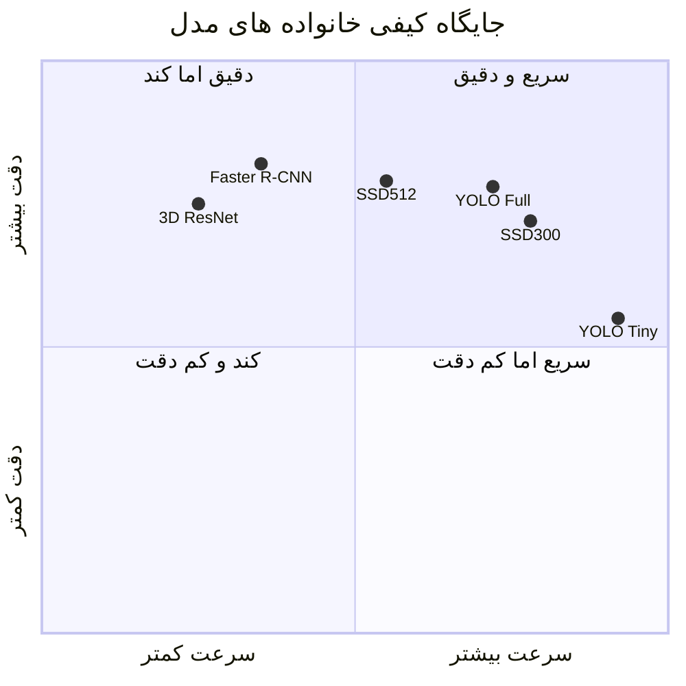

> نمودار بالا **کیفی** است و برای جمع‌بندی مفهومی ترسیم شده است، نه بازتولید یک آزمایش مشترک.

در کاربرد بلادرنگ، انتخاب نسخهٔ سریع‌تر همیشه بهترین تصمیم نیست. یک مدل 200 FPS که اشیای خطرناک کوچک را از دست می‌دهد ممکن است از یک مدل 40 FPS دقیق‌تر نامناسب‌تر باشد. معیار درست باید بر مبنای نیاز عملیاتی تعریف شود.

## 6.9 نتیجهٔ مقایسه

هیچ مدل واحدی برای تمام کاربردها مناسب نیست:

- **CNN:** طبقه‌بندی؛
- **Faster R-CNN:** آشکارسازی دقیق؛
- **YOLO:** آشکارسازی سریع؛
- **SSD:** تعادل مناسب سرعت و دقت؛
- **MediaPipe:** پیاده‌سازی سریع ژست، دست و چهره؛
- **Swin-T:** وظایف چندمنظوره و تصویر با وضوح بالا؛
- **3D-VGG/ResNet:** تحلیل ویدئو و کنش.


---

# 7. کاربردهای اخیر یادگیری عمیق تصویری در دوقلوهای دیجیتال

دوقلوهای دیجیتال تصویری از دوربین‌ها و حسگرهای متفاوت و نیز مدل‌های متنوع یادگیری عمیق استفاده می‌کنند. جدول زیر پژوهش‌های اصلی مرورشده در مقاله را جمع‌بندی می‌کند.

| مرجع پژوهشی | کاربرد | حسگرها | مدل | هدف دوقلو |
|---|---|---|---|---|
| Ferdousi et al. | تشخیص عیب ریل | دوربین، رادار، پهپاد، LiDAR، موقعیت و رطوبت | CNN | تشخیص خرابی راه‌آهن |
| Yi et al. | تعامل انسان و ربات | دوربین رنگی، IR، Kinect v2 و پروژکتور IR | CNN | کنترل ربات |
| Melesse et al. | پایش کیفیت میوه | دوربین حرارتی | CNN | اطلاع‌رسانی کیفیت |
| Alexopoulos et al. | هوش مصنوعی در تولید | دوربین | Inception-v3 و TensorFlow | برچسب‌گذاری خودکار داده |
| Wu et al. | تشخیص عیب تولید | دوربین 2D و اسکنر 3D | Faster R-CNN و Swin-T | تشخیص محصول معیوب |
| Pengnoo et al. | شبکه و ارتباطات | دو دوربین، ایستگاه پایه و بازتابنده | YOLO و شبیه‌سازی Python | کنترل آنتن و بازتابنده |
| Mukhopadhyay et al. | ایمنی محیط کار در VR | دوربین، دما و رطوبت | CNN و YOLOv3 | پایش فاصلهٔ اجتماعی |
| Mukhopadhyay et al. | ایمنی محیط کار | دوربین | YOLOv3 | پایش حالت بدن و فاصله |
| Jeong et al. | پایش شکست ابزار | دوربین عمق | YOLOv3 | تشخیص شکست ابزار |
| Mukhopadhyay et al. | بهبود تشخیص شیء | دوربین و دادهٔ مصنوعی | YOLOv3 | افزایش دقت با دادهٔ مصنوعی |
| Zhou et al. | مهندسی ساخت | دوربین تک‌چشمی | YOLOv5، MLP و Camera-BIM | عملیات و نگهداری |
| Subramanian et al. | سلامت | وب‌کم | MediaPipe و طبقه‌بند ML | تشخیص احساس بیمار |
| Wang et al. | تعامل انسان ـ ماشین | دوربین | 3D-VGG و 3D-ResNet | استخراج اسکلت از ویدئو |
| Marai et al. | پایش زیرساخت جاده | دوربین 360، GPS و حسگر محیطی | SSD، تشخیص چهره و Google Vision | پایش جاده |

## 7.1 تشخیص عیب راه‌آهن

ترکیب تصویر، ویدئوی استریو، LiDAR، رادار و اطلاعات موقعیت می‌تواند یک بازنمایی غنی از خط‌آهن ایجاد کند. CNN برای شناسایی ترک، خرابی سطح یا مانع استفاده می‌شود. دوقلو وضعیت نقاط مختلف مسیر را ذخیره کرده و امکان مقایسهٔ زمانی را فراهم می‌کند.

## 7.2 تعامل انسان و ربات

دوقلو می‌تواند موقعیت و ژست انسان را از تصویر استخراج کند و در محیط مجازی بازنمایی نماید. سپس ربات بر اساس وضعیت انسان، مسیر یا رفتار خود را تغییر می‌دهد. دوربین رنگی اطلاعات ظاهر را فراهم می‌کند و دوربین IR یا Kinect اطلاعات عمق و اسکلت را بهبود می‌دهد.

## 7.3 پایش کیفیت میوه

تصویر حرارتی می‌تواند تغییرات دمایی مرتبط با رسیدگی یا فساد را نشان دهد. مدل CNN کیفیت را طبقه‌بندی کرده و دوقلو روند تغییر کیفیت را دنبال می‌کند. خروجی می‌تواند به کاربر نهایی یا مدیر زنجیرهٔ تأمین اطلاع داده شود.

## 7.4 برچسب‌گذاری خودکار در تولید

یک دوقلوی دیجیتال می‌تواند تصاویر شبیه‌سازی‌شده و برچسب دقیق تولید کند. Inception-v3 یا مدل‌های مشابه می‌توانند برای طبقه‌بندی و برچسب‌گذاری خودکار دادهٔ تولید استفاده شوند. این روش هزینهٔ برچسب‌گذاری دستی را کاهش داده و توسعهٔ کاربردهای هوش مصنوعی را تسریع می‌کند.

## 7.5 تشخیص عیب سطح

Faster R-CNN و Swin-T می‌توانند عیوب کوچک سطح را در تصاویر دوبعدی و اسکن سه‌بعدی پیدا کنند. نتیجه در مدل دیجیتال ثبت و برای هشدار، توقف خط یا جداسازی محصول استفاده می‌شود.

## 7.6 کنترل اجزای شبکه

در کاربرد ارتباطات تراهرتز، YOLO می‌تواند موقعیت اجزا را از تصویر تشخیص دهد و دوقلوی دیجیتال جهت آنتن یا بازتابنده را تنظیم کند. این مثال نشان می‌دهد که دوقلوی تصویری فقط برای صنعت مکانیکی نیست و در شبکه‌های نسل آینده نیز کاربرد دارد.

## 7.7 ایمنی محیط کار

دوقلوی دیجیتال مبتنی بر واقعیت مجازی، با تشخیص افراد و فاصلهٔ آن‌ها، می‌تواند رعایت فاصله، ورود به منطقهٔ خطر یا وضعیت بدنی نامناسب را پایش کند. ترکیب دوربین با دما و رطوبت، وضعیت محیط را نیز به مدل مجازی اضافه می‌کند.

## 7.8 پایش شکست ابزار

تصاویر عمق واقعی و مصنوعی برای آموزش YOLO استفاده می‌شوند. هدف، تشخیص سریع شکست ابزار در ماشین‌کاری و جلوگیری از آسیب بیشتر است. دادهٔ مصنوعی می‌تواند حالت‌های شکست نادر را پوشش دهد.

## 7.9 دوقلوی مبتنی بر BIM

تصویر دوربین با مدل BIM تطبیق داده می‌شود تا وضعیت اجزای ساختمان، عملیات و نگهداری به‌روزرسانی شود. YOLOv5 اشیا را تشخیص می‌دهد و الگوریتم Camera-BIM موقعیت آن‌ها را در مدل ساختمان مرتبط می‌کند.

## 7.10 سلامت و تشخیص احساس

MediaPipe ویژگی‌های چهره و بدن را استخراج می‌کند. الگوریتم طبقه‌بندی می‌تواند حالت عاطفی بیمار را تخمین بزند و دوقلوی شخصی را به‌روزرسانی کند. مقاله تأکید می‌کند که افزودن گفتار و سایر داده‌های چندوجهی می‌تواند عملکرد را بهتر کند.

## 7.11 تعامل انسان ـ ماشین سه‌بعدی

3D-VGG و 3D-ResNet می‌توانند از ویدئو دادهٔ اسکلتی تولید کنند. اسکلت در فضای مجازی بازسازی شده و برای همکاری انسان و ماشین، آموزش یا کنترل استفاده می‌شود.

## 7.12 پایش زیرساخت جاده

تصاویر ۳۶۰ درجه با دادهٔ GPS و حسگرهای محیطی ترکیب می‌شوند. SSD اشیای جاده را تشخیص داده و اطلاعات برای پایش زیرساخت به سرور ارسال می‌شود. این معماری می‌تواند برای نگهداری جاده و شهر هوشمند گسترش یابد.

---

# 8. چالش‌ها، اثرات و جهت‌های پژوهشی

دوقلوهای دیجیتال هوشمند در تولید، سلامت، انرژی، حمل‌ونقل و شهر هوشمند در حال گسترش‌اند. با این حال، ساخت یک دوقلوی تصویری قابل‌اعتماد نیازمند حل هم‌زمان مسائل داده، محاسبه، ارتباط، مدل‌سازی، امنیت و اخلاق است.

# 8.1 چالش‌های ساخت دوقلوی دیجیتال هوشمند

## 8.1.1 نیاز به دادهٔ زیاد و باکیفیت

مدل‌های عمیق برای عملکرد قابل‌اعتماد به دادهٔ متنوع نیاز دارند. مشکلات رایج:

- کمبود نمونهٔ خرابی؛
- برچسب اشتباه؛
- عدم توازن کلاس‌ها؛
- تغییر نور و زاویه؛
- نویز؛
- تفاوت محیط آموزش و استقرار؛
- بیش‌برازش؛
- هزینه و زمان زیاد برچسب‌گذاری.

انتخاب نوع دوربین نیز بخشی از مسئلهٔ داده است. دوربین حرارتی، RGB، عمق و ۳۶۰ درجه هر کدام محدودیت‌ها و سوگیری‌های خاص خود را دارند.

## 8.1.2 پیچیدگی محاسباتی

پردازش ویدئوی با وضوح بالا به GPU، حافظه و توان زیاد نیاز دارد. در محیط لبه باید از روش‌های زیر استفاده شود:

- مدل سبک؛
- Quantization؛
- Pruning؛
- Knowledge Distillation؛
- شتاب‌دهندهٔ سخت‌افزاری؛
- پردازش انتخابی فریم؛
- تقسیم وظیفه میان لبه و ابر.

در کاربردهایی مانند خودرو، پزشکی یا هوانوردی، تصمیم باید در زمان محدود ساخته شود و تأخیر زیاد می‌تواند پیامد ایمنی داشته باشد.

## 8.1.3 همگام‌سازی بلادرنگ

مدل دیجیتال باید وضعیت جاری را منعکس کند. تأخیر ممکن است ناشی از ثبت فریم، شبکه، صف پردازش، استنتاج، انتقال نتیجه و اجرای فرمان باشد.

> در یک حلقهٔ کنترل، معیار مهم فقط FPS مدل نیست؛ بلکه **تأخیر انتهابه‌انتها** است.

\[
T_{\text{e2e}}=
T_{\text{capture}}+
T_{\text{network}}+
T_{\text{queue}}+
T_{\text{inference}}+
T_{\text{decision}}+
T_{\text{actuation}}
\]

جریان ویدئو ممکن است انفجاری یا غیریکنواخت باشد و مدیریت صف و زمان‌بندی را دشوار کند.

## 8.1.4 تفسیرپذیری و اعتماد

مدل عمیق ممکن است تصمیم صحیح بدهد، اما دلیل آن روشن نباشد. در سلامت، خودرو یا صنعت، اپراتور باید بداند:

- کدام ناحیهٔ تصویر مهم بوده است؛
- اطمینان مدل چقدر است؛
- آیا ورودی خارج از دامنهٔ آموزش است؛
- چه عاملی باعث هشدار شده است.

راهکارهای احتمالی:

- Grad-CAM؛
- Attention Map؛
- SHAP؛
- مدل‌های قابل‌تفسیر؛
- نمایش عدم‌قطعیت؛
- قواعد ایمنی مستقل.

## 8.1.5 تغییرات محیطی

نور، رطوبت، دما، گردوغبار، لرزش، بازتاب و سایه بر تصویر اثر می‌گذارند. برای مثال تغییر نور می‌تواند سایه یا انعکاس ایجاد کند و مدل را به اشتباه بیندازد. تصویر حرارتی نیز به دما و رطوبت محیط حساس است.

راهکارها:

- افزایش دادهٔ هدفمند؛
- تطبیق دامنه؛
- آموزش چندمحیطی؛
- حسگر چندوجهی؛
- کالیبراسیون آنلاین؛
- پایش رانش داده؛
- ابرتفکیک‌پذیری و نرمال‌سازی ورودی.

## 8.1.6 مقیاس‌پذیری

با افزایش تعداد دوربین‌ها و دوقلوها، حجم داده و تعداد مدل‌ها زیاد می‌شود. چالش‌ها:

- مدیریت نسخهٔ مدل؛
- زمان‌بندی منابع؛
- ذخیره‌سازی؛
- همگام‌سازی چنددوقلو؛
- هزینهٔ ابر؛
- امنیت ارتباطات؛
- حفظ دقت مدل در مقیاس بزرگ.

رایانش توزیع‌شده و ابر مقیاس‌پذیری را افزایش می‌دهند، ولی می‌توانند هزینه، تأخیر و سطح حمله را نیز بیشتر کنند.

## 8.1.7 یکپارچه‌سازی با سامانه‌های قدیمی

سامانه‌های قدیمی ممکن است پروتکل اختصاصی داشته باشند، دادهٔ ساختاریافته تولید نکنند، توان پردازشی کم داشته باشند، از API مدرن پشتیبانی نکنند یا زمان‌بندی متفاوت داشته باشند. یکپارچه‌سازی نیازمند Gateway، تبدیل داده، Adapter و استانداردهای ارتباطی است.

تعویض کامل سامانهٔ قدیمی معمولاً ممکن نیست؛ بنابراین مهاجرت باید تدریجی و بدون اختلال در عملیات انجام شود.

## 8.1.8 امنیت و حریم خصوصی

تهدیدها شامل موارد زیر است:

- دستکاری تصویر؛
- حملهٔ خصمانه به شبکهٔ عصبی؛
- جعل داده؛
- سرقت مدل؛
- افشای ویدئو؛
- حمله به ارتباط فیزیکی ـ دیجیتال؛
- Poisoning دادهٔ آموزش؛
- دسترسی غیرمجاز به مخزن دوقلو.

راهکارها:

- امضای داده؛
- رمزنگاری؛
- کنترل دسترسی؛
- تشخیص ورودی خصمانه؛
- یادگیری فدرال؛
- ثبت منشأ داده؛
- مدل Zero-Trust؛
- ناشناس‌سازی و حداقل‌سازی داده.

## 8.1.9 اعتبارسنجی و آزمون

دوقلوی دیجیتال باید در برابر واقعیت اعتبارسنجی شود. مسائل مهم:

- معیار تطابق مدل و سامانه؛
- پوشش حالت‌های نادر؛
- آزمون در سناریوی بحرانی؛
- تعیین محدودهٔ اعتبار مدل؛
- ارزیابی عدم‌قطعیت؛
- آزمون Hardware-in-the-Loop و Twin-in-the-Loop؛
- کالیبراسیون مجدد در طول زمان.

مدل ریاضی ممکن است تمام غیرخطی‌ها و شرایط واقعی را پوشش ندهد و دادهٔ واقعی نیز ممکن است ناقص یا ناهمگام باشد.

## 8.1.10 ملاحظات اخلاقی

- سوگیری نسبت به گروه‌های انسانی؛
- نظارت بیش‌ازحد؛
- تصمیم‌گیری خودکار در حوزهٔ حساس؛
- جابه‌جایی شغلی؛
- مالکیت داده؛
- پاسخ‌گویی در صورت خطا؛
- شفافیت در استفاده از دادهٔ تصویری.

استقرار مسئولانه باید منافع اجتماعی و پیامدهای انسانی را نیز در نظر بگیرد.

---

# 8.2 اثرات مثبت دوقلوهای تصویری

## 8.2.1 بهبود قابلیت پیش‌بینی

نشانه‌های بصری مانند ترک، تغییر رنگ، خراش، تغییر شکل یا گرمایش موضعی می‌توانند پیش از خرابی کامل آشکار شوند. مدل می‌تواند این نشانه‌ها را با تاریخچهٔ دوقلو ترکیب کرده و زمان مناسب تعمیر را پیشنهاد دهد.

## 8.2.2 پایش بلادرنگ

دوقلو می‌تواند تغییرات را در لحظه تشخیص دهد و به‌سرعت واکنش نشان دهد؛ برای مثال توقف ماشین، هشدار اپراتور یا تغییر مسیر ربات. این ویژگی در تولید، حمل‌ونقل و محیط‌های خطرناک ارزش زیادی دارد.

## 8.2.3 تشخیص پیشرفته

مدل عمیق می‌تواند الگوهای ظریف را پیدا کند که برای انسان یا حسگرهای ساده قابل مشاهده نیستند. در کنترل کیفیت، عیب‌های کوچک و کم‌کنتراست می‌توانند به‌طور خودکار کشف شوند.

## 8.2.4 خودکارسازی وظایف پیچیده

پردازش خودکار حجم زیادی از تصویر، نیاز به بازرسی دستی را کاهش می‌دهد. در کشاورزی، دوقلو می‌تواند وضعیت گیاه، آفت یا کمبود مواد مغذی را پایش کند و عملیات را هدفمند سازد.

## 8.2.5 قابلیت استفاده در حوزه‌های گوناگون

یک چارچوب عمومی شامل حسگر، پردازش، مدل، دوقلو و بازخورد را می‌توان با تغییر داده و مدل در سلامت، صنعت، ساخت‌وساز، حمل‌ونقل، شبکه و کشاورزی استفاده کرد.

## 8.2.6 تحریک نوآوری

ترکیب دوقلو، تصویر و هوش مصنوعی، زمینهٔ پژوهش در بینایی ماشین، کنترل، ارتباطات، رایانش لبه و مدل‌سازی را گسترش می‌دهد و می‌تواند روش‌های جدیدی برای مدیریت سامانه‌های پیچیده ایجاد کند.

---

# 8.3 جهت‌های پژوهشی پیشنهادی در مقاله

## 8.3.1 ادغام عمیق‌تر AI و ML

هدف آینده، دوقلوهایی است که به‌صورت خودکار ناهنجاری را تشخیص دهند، حالت آینده را پیش‌بینی کنند و تصمیم مناسب را انتخاب نمایند. هوش مصنوعی باید علاوه بر تشخیص، در بهینه‌سازی و کنترل نیز نقش داشته باشد.

## 8.3.2 رایانش لبه و بلادرنگ

پژوهش باید به مدل‌های سبک و معماری توزیع‌شده بپردازد تا پردازش نزدیک به سامانهٔ فیزیکی انجام شود. کاهش تأخیر برای حلقهٔ بازخورد سریع ضروری است.

## 8.3.3 شبکهٔ دوقلوهای دیجیتال

DTN هنوز موضوعی نو است. مسائل مهم:

- هماهنگی چند دوقلو؛
- مسیریابی داده؛
- اعتماد میان دوقلوها؛
- مدیریت هویت؛
- کیفیت سرویس؛
- کنترل ازدحام؛
- همگام‌سازی؛
- استانداردهای ارتباطی.

## 8.3.4 انتخاب دوربین مناسب

نوع حسگر باید بر اساس هدف انتخاب شود. پژوهش‌های آینده باید روش‌های نظام‌مند انتخاب دوربین و ترکیب حسگرها را ارائه کنند. هزینه، میدان دید، وضوح، نرخ فریم، محیط و محدودیت حریم خصوصی باید هم‌زمان بررسی شوند.

## 8.3.5 مقاوم‌سازی تصویر حرارتی در برابر اقلیم

دما، رطوبت و شرایط محیطی می‌توانند تفسیر تصویر حرارتی را تغییر دهند. مدل‌ها باید نسبت به این تغییرات مقاوم شوند یا به‌صورت خودکار اثر شرایط محیطی را جبران کنند.

## 8.3.6 تشخیص احساس با دادهٔ چندوجهی

ترکیب چهره، بدن، گفتار، متن و دادهٔ فیزیولوژیک می‌تواند تشخیص احساس را دقیق‌تر کند. اتکا به چهره به‌تنهایی ممکن است در حالت‌های مبهم کافی نباشد.

## 8.3.7 بهینه‌سازی مصالحهٔ سرعت و دقت

هدف، مدل‌هایی است که بدون افت محسوس دقت، نرخ فریم بالا ارائه دهند. این موضوع شامل معماری سبک، شتاب‌دهی سخت‌افزاری، فشرده‌سازی مدل و استنتاج تطبیقی است.

## 8.3.8 یادگیری با دادهٔ کم

روش‌های مهم:

- Transfer Learning؛
- Few-Shot Learning؛
- Self-Supervised Learning؛
- Synthetic Data؛
- Active Learning؛
- Semi-Supervised Learning.

این روش‌ها زمانی مهم‌اند که جمع‌آوری و برچسب‌گذاری دادهٔ خرابی دشوار باشد.

---

# 8.4 نکات تکمیلی تدوین‌کننده: دستورکار پژوهشی پیشرفته

> بخش زیر تحلیل تکمیلی است و به‌صورت مستقیم در مقالهٔ اصلی ارائه نشده است.

## 8.4.1 همجوشی تصویر و سیگنال

یک دوقلوی صنعتی نباید فقط به تصویر وابسته باشد. بهتر است تصویر با داده‌های لرزش، جریان، صدا، دما و فشار ترکیب شود.

سه سطح همجوشی:

1. **همجوشی در سطح داده:** ترکیب ورودی‌های هم‌تراز؛
2. **همجوشی در سطح ویژگی:** استخراج ویژگی جداگانه و سپس ترکیب؛
3. **همجوشی در سطح تصمیم:** ترکیب خروجی چند مدل.

مدل عمومی:

\[
z_t^{v}=f_v(I_t),\qquad z_t^{s}=f_s(s_t)
\]

\[
z_t=\operatorname{Fusion}(z_t^{v},z_t^{s})
\]

\[
\hat{x}_t=g(z_t)
\]

## 8.4.2 دوقلوهای فیزیک‌آگاه

مدل عمیق باید با قوانین فیزیکی سازگار باشد. تابع هزینه می‌تواند شامل خطای داده و خطای فیزیکی باشد:

\[
\mathcal{L}=\mathcal{L}_{\text{data}}+\lambda_{\text{phy}}\mathcal{L}_{\text{physics}}
\]

این رویکرد به‌ویژه در دادهٔ کم، شرایط خارج از توزیع و سامانه‌های ایمنی‌بحرانی مفید است.

## 8.4.3 یادگیری پیوسته

سامانهٔ فیزیکی در طول زمان فرسوده یا تغییر می‌کند. مدل باید بدون فراموش‌کردن دانش قبلی به‌روزرسانی شود.

موضوعات مهم:

- Concept Drift؛
- Catastrophic Forgetting؛
- Replay Buffer؛
- Online Fine-Tuning؛
- Model Versioning؛
- تشخیص زمان مناسب بازآموزی.

## 8.4.4 تخمین عدم‌قطعیت

دوقلو باید بداند چه زمانی مطمئن نیست. روش‌ها:

- Monte Carlo Dropout؛
- Deep Ensemble؛
- Bayesian Neural Network؛
- Conformal Prediction.

فرمان خودکار فقط زمانی صادر شود که:

\[
P(\text{decision is reliable})>\tau
\]

در غیر این صورت، سامانه باید از اپراتور انسانی یا مدل پشتیبان استفاده کند.

## 8.4.5 تشخیص خارج از توزیع

مدل ممکن است تصویری را ببیند که مشابه دادهٔ آموزش نیست. سامانه باید چنین ورودی‌ای را تشخیص داده و به حالت ایمن برود. این موضوع برای جلوگیری از تصمیم مطمئن اما اشتباه ضروری است.

## 8.4.6 یادگیری فدرال

در صنایع یا بیمارستان‌ها ممکن است داده قابل انتقال نباشد. در یادگیری فدرال، مدل محلی آموزش می‌بیند و فقط به‌روزرسانی پارامترها به اشتراک گذاشته می‌شود. چالش‌های آن شامل ناهمگونی داده، هزینهٔ ارتباط و حمله به به‌روزرسانی‌ها است.

## 8.4.7 مدل‌های مولد

مدل‌های Diffusion و GAN می‌توانند:

- عیب مصنوعی بسازند؛
- شرایط نادر را شبیه‌سازی کنند؛
- تصویر با نور متفاوت تولید کنند؛
- دادهٔ متوازن ایجاد کنند؛
- بازسازی یا حذف نویز انجام دهند.

دادهٔ مولد باید از نظر واقع‌گرایی فیزیکی و تنوع اعتبارسنجی شود.

## 8.4.8 هوش توضیح‌پذیر

بهتر است خروجی دوقلو شامل موارد زیر باشد:

- نتیجه؛
- امتیاز اطمینان؛
- نقشهٔ ناحیهٔ مؤثر؛
- دلیل متنی؛
- حسگرهای پشتیبان؛
- سطح خطر؛
- پیشنهاد اقدام.

## 8.4.9 بنچمارک استاندارد

برای مقایسهٔ منصفانه باید مجموعه‌داده‌هایی ایجاد شود که شامل تصویر واقعی، دادهٔ مصنوعی، حسگر عددی، برچسب زمان، وضعیت واقعی سامانه، فرمان کنترلی، سناریوهای خرابی و تغییرات محیطی باشند.

## 8.4.10 معماری عامل‌محور

در نسل آینده، عامل‌های هوشمند می‌توانند مسئولیت‌های جدا داشته باشند:

- عامل ادراک؛
- عامل تخمین حالت؛
- عامل تشخیص خرابی؛
- عامل برنامه‌ریزی؛
- عامل کنترل؛
- عامل توضیح؛
- عامل امنیت.

## 8.4.11 یادگیری خودنظارتی تصویری

بخش بزرگی از ویدئوهای صنعتی بدون برچسب هستند. یادگیری خودنظارتی می‌تواند با پیش‌متن‌هایی مانند بازسازی Patch، پیش‌بینی فریم آینده یا یادگیری کنتراستی، نمایش‌های مفیدی را بدون برچسب دستی ایجاد کند.

## 8.4.12 حسگرهای رخدادمحور

دوربین‌های Event-based به‌جای ارسال فریم کامل، تغییرات روشنایی را گزارش می‌کنند. این فناوری می‌تواند برای سامانه‌های بسیار سریع، کم‌تأخیر و کم‌مصرف مفید باشد و موضوعی مناسب برای دوقلوهای بلادرنگ آینده است.


---

# 9. جمع‌بندی

دوقلوی دیجیتال هوشمند، نسخهٔ دیجیتال زنده و یادگیرنده‌ای از یک سامانهٔ فیزیکی است. استفاده از تصویر، توان مشاهدهٔ جزئیات ظاهری، هندسی و رفتاری را به دوقلو می‌دهد. مدل‌های یادگیری عمیق این داده‌ها را به اطلاعات قابل استفاده برای پایش، تشخیص، پیش‌بینی و کنترل تبدیل می‌کنند.

مدل‌های مختلف وظایف متفاوتی دارند:

- CNN برای طبقه‌بندی؛
- R-CNN و Faster R-CNN برای تشخیص دقیق؛
- YOLO و SSD برای تشخیص بلادرنگ؛
- MediaPipe برای ژست، دست و چهره؛
- Swin Transformer برای وظایف چندمقیاسی و تصاویر بزرگ؛
- 3D-CNN برای ویدئو و حرکت.

مهم‌ترین چالش‌ها عبارت‌اند از:

- کیفیت و حجم داده؛
- هزینهٔ محاسبات؛
- تأخیر؛
- همگام‌سازی؛
- امنیت؛
- تفسیرپذیری؛
- تغییر شرایط محیطی؛
- مقیاس‌پذیری؛
- اعتبارسنجی؛
- اخلاق.

آیندهٔ این حوزه به سمت مدل‌های چندوجهی، فیزیک‌آگاه، مولد، قابل‌تفسیر، سبک، توزیع‌شده و خودسازگار حرکت می‌کند. دوقلوی دیجیتال تصویری زمانی بیشترین ارزش را ایجاد می‌کند که بینایی عمیق نه به‌صورت یک ماژول جدا، بلکه به‌عنوان بخشی از حلقهٔ تخمین حالت، پیش‌بینی و کنترل طراحی شود.

نتیجهٔ راهبردی مقاله این است که توسعهٔ دوقلوی دیجیتال تصویری یک مسئلهٔ صرفاً «انتخاب مدل یادگیری عمیق» نیست. یک سامانهٔ موفق باید به‌صورت هم‌زمان موارد زیر را طراحی کند:

1. مدل فیزیکی یا مجازی مناسب؛
2. حسگر و دوربین مناسب؛
3. زنجیرهٔ انتقال و همگام‌سازی؛
4. پیش‌پردازش و مدیریت کیفیت داده؛
5. مدل بینایی متناسب با وظیفه؛
6. تصمیم‌گیری و بازخورد؛
7. امنیت، حریم خصوصی و اعتبارسنجی؛
8. سازوکار بازآموزی و نگهداری مدل.

---

# راهنمای انتخاب مدل برای یک پروژهٔ دوقلوی دیجیتال

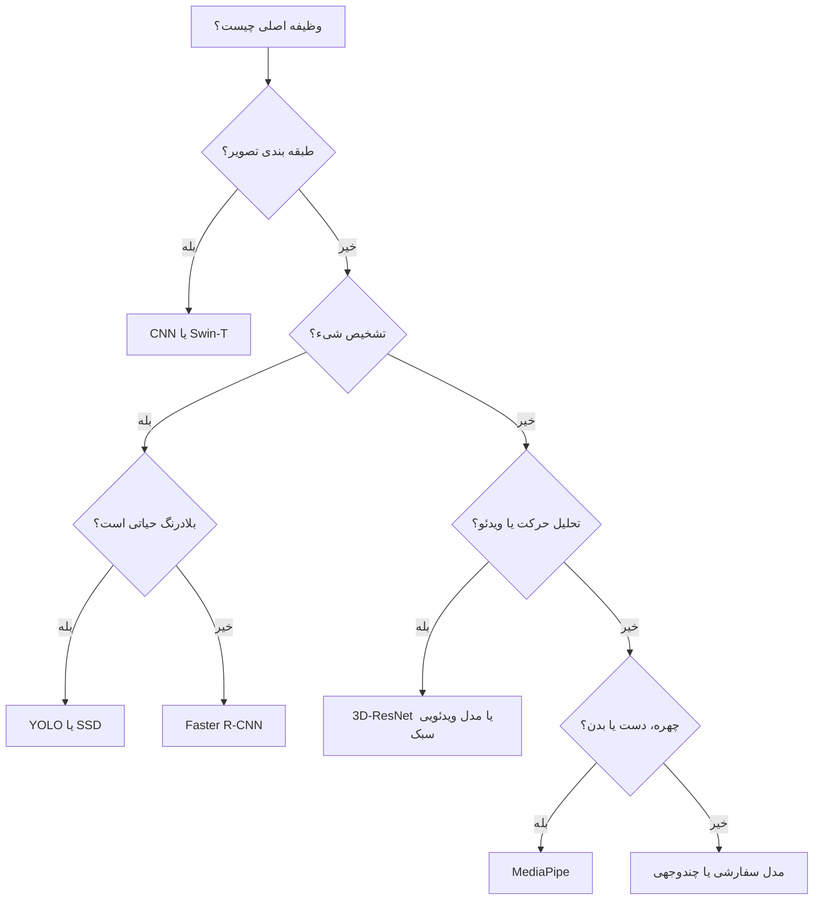

## توصیهٔ عملی

| نیاز پروژه | گزینهٔ مناسب |
|---|---|
| کمترین تأخیر | YOLO Tiny یا مدل سبک |
| تعادل سرعت و دقت | YOLOs یا SSD300 |
| بیشترین دقت تشخیص | Faster R-CNN یا مدل Transformer-based |
| تصویر با وضوح بالا | Swin-T |
| دستگاه لبه‌ای | MobileNet-SSD، YOLO سبک یا MediaPipe |
| تحلیل حرکت | 3D-ResNet یا مدل ویدئویی |
| دادهٔ کم | Transfer Learning و دادهٔ مصنوعی |
| محیط متغیر | Domain Adaptation و Multi-modal Fusion |
| کاربرد ایمنی‌بحرانی | مدل همراه عدم‌قطعیت و قاعدهٔ ایمنی |
| چهره، دست و وضعیت بدن | MediaPipe |
| عیب‌های کوچک در صحنهٔ پیچیده | Faster R-CNN یا آشکارساز چندمقیاسی دقیق |

## پرسش‌هایی که پیش از انتخاب مدل باید پاسخ داده شوند

1. مسئله طبقه‌بندی است، تشخیص است یا قطعه‌بندی؟
2. کوچک‌ترین شیء مهم چه اندازه‌ای در تصویر دارد؟
3. نرخ فریم و تأخیر مجاز چقدر است؟
4. سخت‌افزار استقرار چیست؟
5. آیا دادهٔ واقعی کافی وجود دارد؟
6. آیا دادهٔ مصنوعی قابل تولید است؟
7. محیط از نظر نور و شرایط جوی چقدر متغیر است؟
8. آیا تصمیم مدل مستقیماً فرمان کنترلی تولید می‌کند؟
9. خطای مثبت یا منفی کدام‌یک پرهزینه‌تر است؟
10. آیا مدل باید توضیح‌پذیر باشد؟

---

# معماری پیشنهادی برای پیاده‌سازی عملی

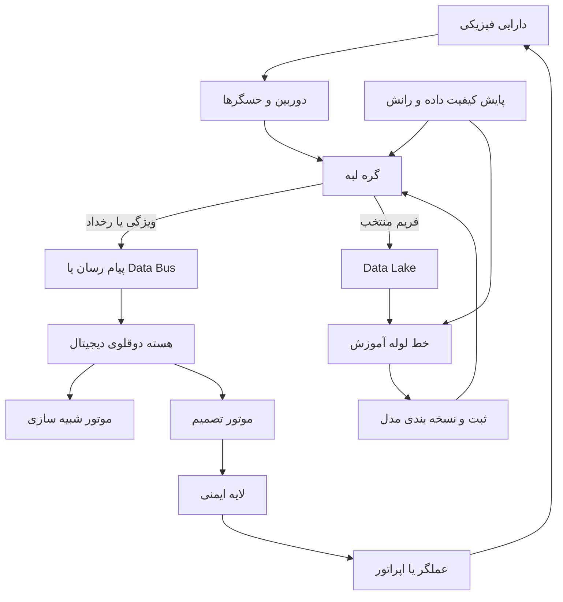

این معماری، آموزش و استنتاج را از یکدیگر جدا می‌کند. مدل آموزش‌دیده پس از اعتبارسنجی در Model Registry ثبت و سپس روی لبه مستقر می‌شود. لایهٔ ایمنی مستقل از مدل عمیق، فرمان‌ها را بررسی می‌کند تا یک خروجی نامطمئن مستقیماً به اقدام خطرناک تبدیل نشود.

---

# چک‌لیست طراحی یک دوقلوی دیجیتال تصویری

## تعریف مسئله

- [ ] دارایی فیزیکی مشخص است.
- [ ] هدف دوقلو مشخص است.
- [ ] خروجی مدل تعریف شده است.
- [ ] تأخیر مجاز مشخص است.
- [ ] سطح خودکاربودن تصمیم مشخص است.
- [ ] هزینهٔ خطاهای مختلف تعیین شده است.

## داده

- [ ] نوع دوربین انتخاب شده است.
- [ ] کالیبراسیون انجام شده است.
- [ ] زمان حسگرها همگام است.
- [ ] سیاست ذخیره‌سازی مشخص است.
- [ ] دادهٔ شرایط نادر وجود دارد.
- [ ] دادهٔ مصنوعی در صورت نیاز تولید شده است.
- [ ] سوگیری و عدم توازن بررسی شده است.
- [ ] کیفیت و منشأ داده ثبت می‌شود.

## مدل

- [ ] معماری با وظیفه سازگار است.
- [ ] معیارهای دقت و سرعت تعیین شده‌اند.
- [ ] مدل روی دادهٔ خارج از آموزش آزمون شده است.
- [ ] عدم‌قطعیت تخمین زده می‌شود.
- [ ] امکان بازآموزی وجود دارد.
- [ ] نسخه‌بندی مدل انجام می‌شود.
- [ ] افت عملکرد در شرایط محیطی مختلف بررسی شده است.

## استقرار

- [ ] تقسیم کار لبه و ابر مشخص است.
- [ ] تأخیر انتهابه‌انتها اندازه‌گیری شده است.
- [ ] رفتار سامانه در قطع شبکه مشخص است.
- [ ] حالت ایمن تعریف شده است.
- [ ] پایش عملکرد مدل فعال است.
- [ ] ظرفیت پردازش و ذخیره‌سازی سنجیده شده است.

## امنیت و اخلاق

- [ ] داده رمزنگاری می‌شود.
- [ ] کنترل دسترسی وجود دارد.
- [ ] حریم خصوصی رعایت شده است.
- [ ] حملات خصمانه بررسی شده‌اند.
- [ ] خروجی برای کاربر توضیح‌پذیر است.
- [ ] مسئولیت تصمیم مشخص است.
- [ ] سیاست حذف و نگهداری تصویر تعریف شده است.

## نگهداری چرخهٔ عمر

- [ ] رانش داده پایش می‌شود.
- [ ] زمان بازآموزی مشخص است.
- [ ] Rollback مدل امکان‌پذیر است.
- [ ] داده و مدل قابل ردیابی هستند.
- [ ] عملکرد نسخه‌های مختلف مقایسه می‌شود.
- [ ] بازخورد اپراتور در بهبود مدل استفاده می‌شود.

---

# واژه‌نامهٔ فارسی ـ انگلیسی

| فارسی | انگلیسی |
|---|---|
| دوقلوی دیجیتال | Digital Twin |
| دوقلوی دیجیتال هوشمند | Smart Digital Twin |
| سامانهٔ سایبری‌فیزیکی | Cyber-Physical System |
| شبکهٔ دوقلوهای دیجیتال | Digital Twin Network |
| شبکهٔ لبه‌ای دوقلوی دیجیتال | Digital Twin Edge Network |
| رایانش لبه | Edge Computing |
| دادهٔ مصنوعی | Synthetic Data |
| تشخیص شیء | Object Detection |
| طبقه‌بندی تصویر | Image Classification |
| قطعه‌بندی معنایی | Semantic Segmentation |
| جعبهٔ محدودکننده | Bounding Box |
| ناحیهٔ پیشنهادی | Region Proposal |
| شبکهٔ پیشنهاد ناحیه | Region Proposal Network |
| سرکوب غیر بیشینه | Non-Maximum Suppression |
| اشتراک بر اجتماع | Intersection over Union |
| نرخ فریم | Frames Per Second |
| میانگین دقت متوسط | Mean Average Precision |
| تطبیق دامنه | Domain Adaptation |
| یادگیری پیوسته | Continual Learning |
| تفسیرپذیری | Interpretability |
| عدم‌قطعیت | Uncertainty |
| بیش‌برازش | Overfitting |
| شبکهٔ عصبی کانولوشنی | Convolutional Neural Network |
| ترنسفورمر بینایی | Vision Transformer |
| پنجرهٔ جابه‌جا‌شونده | Shifted Window |
| مدل فیزیک‌آگاه | Physics-Informed Model |
| همجوشی چندوجهی | Multi-modal Fusion |
| ثبت تصویر | Image Registration |
| ابرتفکیک‌پذیری | Super-Resolution |
| مدل خارج از توزیع | Out-of-Distribution Model/Input |
| یادگیری فدرال | Federated Learning |
| تقطیر دانش | Knowledge Distillation |
| هرس شبکه | Network Pruning |
| کوانتیزه‌سازی | Quantization |

---

# منابع منتخب

> فهرست کامل منابع در مقالهٔ اصلی موجود است. در این نسخه، منابع کلیدی مرتبط با معماری‌ها و کاربردهای اصلی آورده شده‌اند.

1. Islam, M. R., Subramaniam, M., & Huang, P.-C. (2025). Image-based deep learning for smart digital twins: a review. *Artificial Intelligence Review*, 58, 146.
2. Rosen, R. et al. (2015). About the importance of autonomy and digital twins for the future of manufacturing.
3. El Saddik, A. (2018). Digital twins: The convergence of multimedia technologies.
4. Fuller, A. et al. (2020). Digital Twin: Enabling technologies, challenges and open research.
5. Rasheed, A. et al. (2020). Digital twin: Values, challenges and enablers from a modeling perspective.
6. Mihai, S. et al. (2022). Digital twins: A survey on enabling technologies, challenges, trends and future prospects.
7. Girshick, R. et al. (2014). Rich feature hierarchies for accurate object detection and semantic segmentation.
8. Girshick, R. (2015). Fast R-CNN.
9. Ren, S. et al. (2017). Faster R-CNN: Towards real-time object detection with region proposal networks.
10. Redmon, J. et al. (2015). You Only Look Once: Unified, real-time object detection.
11. Redmon, J., & Farhadi, A. (2018). YOLOv3: An incremental improvement.
12. Liu, W. et al. (2016). SSD: Single Shot MultiBox Detector.
13. Liu, Z. et al. (2021). Swin Transformer: Hierarchical Vision Transformer using shifted windows.
14. Lugaresi, C. et al. (2019). MediaPipe: A framework for building perception pipelines.
15. Ji, S. et al. (2013). 3D convolutional neural networks for human action recognition.
16. Wang, T. et al. (2021). Digital twin for human-machine interaction with convolutional neural network.
17. Wu, Y. et al. (2022). Digital twin of intelligent small surface defect detection with cyber-manufacturing systems.
18. Jeong, S. et al. (2022). Digital twin-based cutting tool breakage detection using synthetic depth map and deep learning.
19. Zhou, X. et al. (2023). Computer vision enabled building digital twin using building information model.
20. Mukhopadhyay, A. et al. (2021). Generating synthetic data for deep learning using VR digital twin.
21. Melesse, T. Y. et al. (2022). Machine learning-based digital twin for monitoring fruit quality evolution.
22. Subramanian, B. et al. (2022). Digital twin model: A real-time emotion recognition system for personalized healthcare.
23. Marai, O. E. et al. (2021). Roads infrastructure digital twin: A step toward smarter cities realization.
24. Tang, F. et al. (2022). Survey on digital twin edge networks toward 6G.
25. Khan, L. U. et al. (2022). Digital twin of wireless systems: Overview, taxonomy, challenges, and opportunities.

---

# نحوهٔ ارجاع به مقالهٔ اصلی

```text
Islam, M. R., Subramaniam, M., & Huang, P.-C. (2025).
Image-based deep learning for smart digital twins: a review.
Artificial Intelligence Review, 58, 146.
https://doi.org/10.1007/s10462-024-11002-y
```

---

> **پایان سند**
