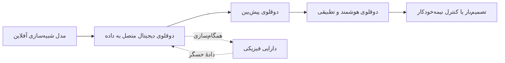
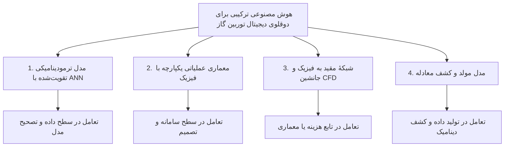
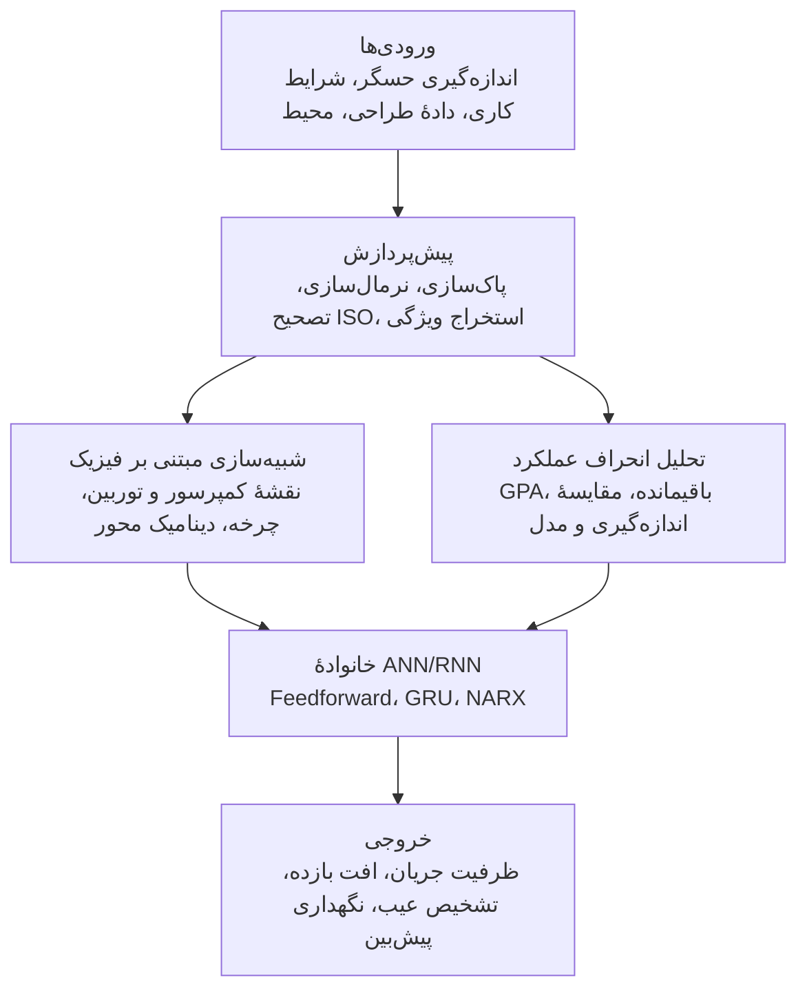
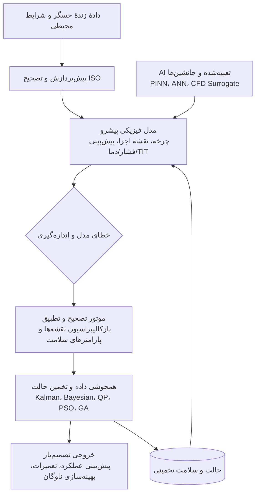
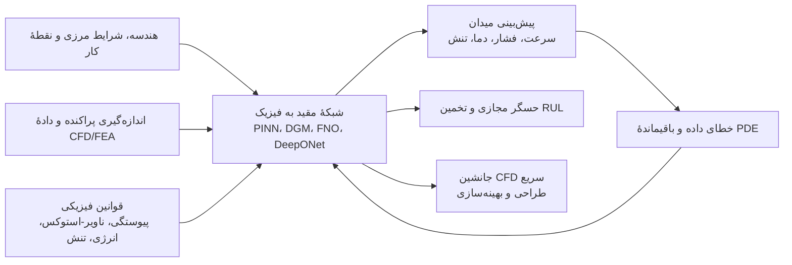
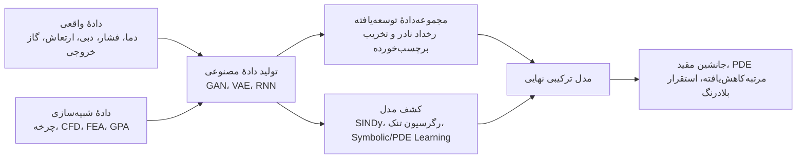
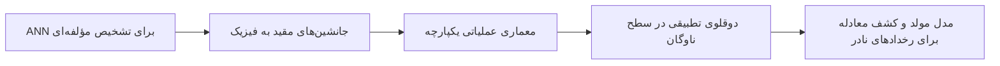
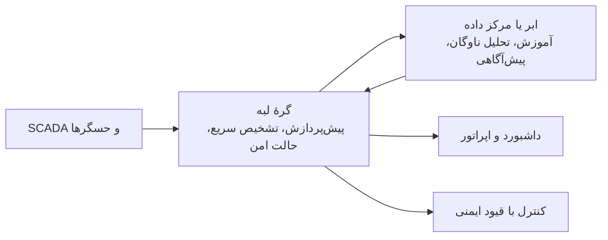
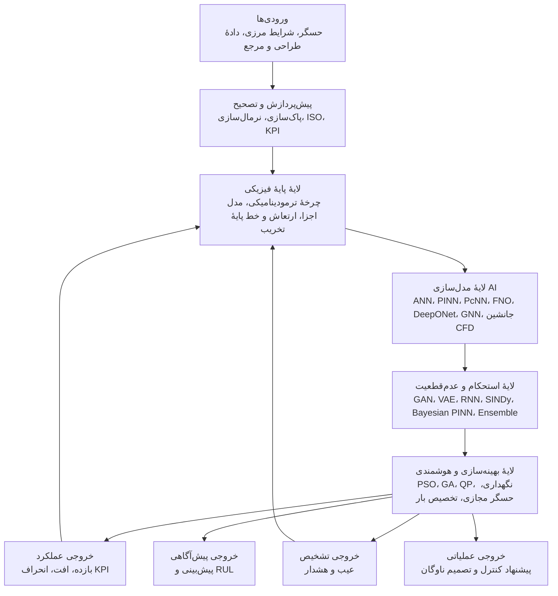

# یادگیری ماشین آگاه از فیزیک برای دوقلوهای دیجیتال هوشمند توربین گاز

> بازنویسی و معادل فارسیِ توضیحی مقالهٔ **Physics-Informed Machine Learning for Intelligent Gas Turbine Digital Twins: A Review**
>
> نویسندگان مقاله: **Hiyam Farhat** و **Amani Altarawneh**  
> مجله: **Energies**، سال 2025، جلد 18، مقالهٔ 5523  
> DOI: `10.3390/en18205523`  
> تاریخ انتشار: 20 اکتبر 2025  
> مجوز مقالهٔ اصلی: **CC BY 4.0**

---

## دربارهٔ این نسخه

این فایل، ترجمهٔ واژه‌به‌واژهٔ مقاله نیست؛ بلکه یک **بازنویسی علمی، وفادار، روان و مناسب انتشار در Git/GitHub** است. ساختار اصلی مقاله حفظ شده، اصطلاحات تخصصی در اولین کاربرد به فارسی و انگلیسی آمده‌اند، شکل‌های اصلی به‌صورت نمودارهای Mermaid بازطراحی شده‌اند و در بخش‌هایی که توضیح بیشتر برای فهم موضوع لازم بوده، نکات تکمیلی افزوده شده است.

> **روش تشخیص مطالب افزوده‌شده:** هر مطلبی که مستقیماً جزء متن مقاله نبوده و برای تکمیل بحث اضافه شده، با عبارت **«نکتهٔ تکمیلی از من»** مشخص شده است.

---

## چکیده

این مقالهٔ مروری، پیشرفت‌های اخیر در زمینهٔ رویکردهای **هوش مصنوعی ترکیبی** برای ساخت دوقلوهای دیجیتال هوشمند توربین گاز را بررسی می‌کند؛ رویکردهایی که مدل‌های مبتنی بر فیزیک را با یادگیری ماشین ترکیب می‌کنند. مسئلهٔ اصلی آن است که مدل‌های صرفاً فیزیکی، اگرچه تفسیرپذیر و قابل اعتمادند، معمولاً محاسبات سنگینی دارند و در برابر شرایط گذرا، فرسودگی و رفتارهای مدل‌نشده انعطاف محدودی نشان می‌دهند. در مقابل، مدل‌های صرفاً داده‌محور سریع و توانمند در یادگیری روابط غیرخطی هستند، اما ممکن است خارج از دامنهٔ آموزش تعمیم ضعیفی داشته باشند و با قوانین فیزیکی ناسازگار شوند.

مقاله چهار گروه اصلی از روش‌های ترکیبی را معرفی می‌کند:

1. **مدل‌های ترمودینامیکی تقویت‌شده با شبکهٔ عصبی**؛
2. **معماری‌های عملیاتی یکپارچه با فیزیک**؛
3. **شبکه‌های عصبی مقید به فیزیک و جانشین‌های CFD**؛
4. **روش‌های مولد و کشف مدل**.

همچنین یک چارچوب بلوغ مقایسه‌ای بر پایهٔ پنج معیار ارائه می‌شود: وابستگی به داده، تفسیرپذیری فیزیکی، پیچیدگی استقرار، سازگاری با جریان‌کارهای مهندسی و قابلیت بلادرنگ. نمونه‌های صنعتی شامل دوقلوی توربین EPRI، سامانهٔ SmartSignal شرکت GE Vernova و چارچوب ATOM زیمنس هستند. جمع‌بندی مقاله نشان می‌دهد که آیندهٔ دوقلوهای دیجیتال توربین گاز در گرو ترکیب لایه‌ای مدل‌های ترمودینامیکی، یادگیری آگاه از فیزیک، کمّی‌سازی عدم‌قطعیت، داده‌سازی کنترل‌شده، بهینه‌سازی و یکپارچه‌سازی امن با سامانه‌های SCADA است.

**کلیدواژه‌ها:** یادگیری ماشین آگاه از فیزیک، مدل‌سازی ترکیبی، عیب‌یابی توربین گاز، شبکهٔ عصبی مصنوعی، دوقلوی دیجیتال هوشمند، حسگر مجازی، عمر مفید باقی‌مانده، یادگیری انتقالی، مدل‌های مولد.

---

## فهرست مطالب

- [1. مقدمه](#1-مقدمه)
- [2. روش‌های هوش مصنوعی ترکیبی برای توربین گاز](#2-روشهای-هوش-مصنوعی-ترکیبی-برای-کاربردهای-توربین-گاز)
  - [2.1 مدل‌های ترمودینامیکی تقویت‌شده با ANN](#21-مدلهای-ترمودینامیکی-تقویتشده-با-شبکهٔ-عصبی)
  - [2.2 معماری‌های عملیاتی یکپارچه با فیزیک](#22-معماریهای-عملیاتی-یکپارچه-با-فیزیک)
  - [2.3 شبکه‌های مقید به فیزیک و جانشین‌های CFD](#23-شبکههای-عصبی-مقید-به-فیزیک-و-جانشینهای-cfd)
  - [2.4 روش‌های مولد و کشف مدل](#24-روشهای-مولد-و-کشف-مدل)
- [3. نتایج و چارچوب ارزیابی بلوغ](#3-نتایج-و-چارچوب-ارزیابی-بلوغ)
- [4. بحث و روندهای آینده](#4-بحث-و-روندهای-آینده)
- [5. محدودیت‌های مقاله](#5-محدودیتهای-مقاله)
- [6. نتیجه‌گیری](#6-نتیجهگیری)
- [پیوست الف: واژه‌نامه](#پیوست-الف-واژهنامهٔ-اختصارات)
- [پیوست ب: چک‌لیست اجرایی](#پیوست-ب-چکلیست-اجرایی-برای-ساخت-یک-دوقلوی-دیجیتال-ترکیبی)
- [منابع](#منابع)

---

# 1. مقدمه

## 1.1 جایگاه توربین گاز در گذار انرژی

توربین‌های گاز همچنان یکی از ارکان اصلی زیرساخت انرژی جهان هستند. آن‌ها در نیروگاه‌ها برای تولید برق پایه و برق قابل‌دیسپاچ، در سامانه‌های پیشرانش و در محرک‌های مکانیکی صنعتی استفاده می‌شوند. با افزایش سهم منابع تجدیدپذیر، نقش توربین گاز از کارکرد پایدار در بار پایه به سمت **کارکرد انعطاف‌پذیر** تغییر کرده است.

این تغییر دو جنبهٔ مهم دارد:

- توربین‌ها باید برای سوخت‌های کم‌کربن یا بدون کربن مانند هیدروژن و آمونیاک، سوخت‌های سنتزی خنثی از نظر کربن و زیست‌سوخت‌ها سازگار شوند؛
- در شبکه‌هایی با سهم بالای باد و خورشید، توربین گاز باید در زمان افت تولید تجدیدپذیرها، سریع وارد مدار شود و نقش پشتیبان قابل اعتماد را ایفا کند.

نتیجه آن است که الگوی بهره‌برداری از حالت تقریباً ثابت به حالتی شامل تغییرات سریع بار، راه‌اندازی و توقف‌های مکرر، سیکل‌زنی زیاد و کار طولانی در بار جزئی تبدیل می‌شود.

## 1.2 سازوکارهای فرسودگی در بهره‌برداری انعطاف‌پذیر

در چنین شرایطی چندین سازوکار تخریب می‌توانند هم‌زمان و با نرخ‌های متفاوت فعال شوند:

- رشد ترک ناشی از خستگی؛
- خوردگی داغ؛
- فرسایش سطوح آیرودینامیکی؛
- افزایش لقی نوک پره؛
- پیچش یا تغییر شکل پره؛
- افزایش تنش‌های چرخه‌ای حرارتی-مکانیکی؛
- افت ظرفیت عبور جریان کمپرسور و کاهش بازده اجزا.

این پدیده‌ها باعث کاهش عملکرد آیرودینامیکی، افزایش مصرف سوخت، افت توان و کاهش بازده کلی می‌شوند. مهم‌تر آن‌که در بهره‌برداری انعطاف‌پذیر، الگوهای تخریب دیگر به‌سادگی قابل پیش‌بینی نیستند؛ زیرا شرایط گذرا و سیکل‌های حرارتی، رفتار فرسودگی را پیچیده و غیرخطی می‌کنند.

بنابراین، پایش سنتی مبتنی بر حدود ثابت یا بازرسی‌های دوره‌ای برای مدیریت دارایی کافی نیست. دوقلوی دیجیتال ترکیبی می‌تواند دادهٔ بهره‌برداری را با مدل‌های تخریب و عملکرد تلفیق کند تا نگهداری پیش‌نگر، بهینه‌سازی عملکرد و افزایش عمر تجهیز ممکن شود.

## 1.3 از دوقلوی دیجیتال تا دوقلوی دیجیتال هوشمند

**دوقلوی دیجیتال** یک بازنمایی مجازی از یک تجهیز، سامانه یا فرایند فیزیکی است که وضعیت و رفتار آن را در طول چرخهٔ عمر بازتاب می‌دهد. یک دوقلوی دیجیتال کامل صرفاً یک مدل شبیه‌سازی نیست؛ بلکه باید با داده‌های دارایی فیزیکی به‌روزرسانی شود و برای پایش، تحلیل، پیش‌بینی و تصمیم‌گیری به کار رود.

**دوقلوی دیجیتال هوشمند** یک گام جلوتر می‌رود و هوش مصنوعی، یادگیری ماشین و تحلیل پیشرفته را به این بازنمایی اضافه می‌کند. در نتیجه، دوقلو می‌تواند:

- از داده‌های چندمنبعی یاد بگیرد؛
- خود را با تغییر شرایط کاری و فرسودگی تطبیق دهد؛
- متغیرهای اندازه‌گیری‌نشده را تخمین بزند؛
- خرابی یا افت عملکرد را پیش‌بینی کند؛
- برای کنترل، برنامه‌ریزی تعمیرات و تخصیص بار پیشنهاد ارائه دهد.

> **نکتهٔ تکمیلی از من:** هر مدلی که رفتار توربین را شبیه‌سازی کند، لزوماً دوقلوی دیجیتال نیست. اتصال مستمر یا دوره‌ای به دادهٔ تجهیز واقعی، قابلیت کالیبراسیون، مدیریت نسخهٔ مدل و ارائهٔ خروجی قابل استفاده در عملیات، مرز میان «شبیه‌ساز» و «دوقلو» را مشخص می‌کند.

## 1.4 محدودیت دو رویکرد خالص

| رویکرد | نقاط قوت | محدودیت‌های اصلی |
|---|---|---|
| مدل‌سازی فیزیکی و ترمودینامیکی | تفسیرپذیری، سازگاری با قوانین بقا، امکان تحلیل علت و معلول، قابلیت بازتولید | هزینهٔ محاسباتی، نیاز به کالیبراسیون، ضعف در بازنمایی پدیده‌های مدل‌نشده و شرایط فرسوده یا گذرا |
| یادگیری کاملاً داده‌محور | استنتاج سریع، یادگیری روابط غیرخطی، مناسب برای داده‌های چندمتغیره | وابستگی به داده، تعمیم ضعیف خارج از دامنهٔ آموزش، امکان تولید پاسخ غیرفیزیکی، تفسیرپذیری محدود |
| رویکرد ترکیبی یا PIML | استفاده هم‌زمان از دانش مهندسی و انعطاف یادگیری ماشین | طراحی و اعتبارسنجی دشوارتر، نیاز به هماهنگی میان داده، مدل، نرم‌افزار و عملیات |

رویکردهای ترکیبی تلاش می‌کنند بخشی از فیزیک را در یکی از نقاط زیر وارد یادگیری کنند:

- در **دادهٔ آموزش**، از طریق داده‌های مصنوعی حاصل از شبیه‌سازی؛
- در **ورودی یا ویژگی‌ها**، از طریق متغیرها و باقیمانده‌های فیزیکی؛
- در **معماری شبکه**، از طریق ساختارهای حفظ‌کنندهٔ ناورداها؛
- در **تابع هزینه**، با اضافه‌کردن باقیماندهٔ معادلات حاکم؛
- در **لایهٔ تصمیم و کنترل**، با اعمال قیود فیزیکی و عملیاتی.

## 1.5 روندهای روش‌شناختی مرتبط

مقاله چند خانوادهٔ مهم را به‌عنوان زمینهٔ علمی دوقلوهای هوشمند معرفی می‌کند:

- **SINDy و PySINDy:** کشف معادلات حاکم کم‌تعداد و تفسیرپذیر از روی داده؛
- **PINN و NSFnet:** واردکردن معادلات ناویر-استوکس، پیوستگی و انرژی در تابع هزینه؛
- **توجه مبتنی بر باقیمانده:** تمرکز آموزش بر نواحی‌ای که خطای فیزیکی بیشتری دارند؛
- **FNO و DeepONet:** یادگیری عملگر نگاشت ورودی‌های یک PDE به میدان پاسخ، بدون وابستگی سخت به مش و تفکیک؛
- **LNN:** حفظ ساختار انرژی و دینامیک لاگرانژی؛
- **GNN:** مدل‌سازی سامانه‌های چندجزئی، هندسه‌های نامنظم و اتصال‌های مش؛
- **مدل‌های حرارتی آگاه از فیزیک:** پیش‌بینی میدان دما و انتقال حرارت برای پوشش‌ها، ساخت افزودنی و اجزای داغ توربین.

## 1.6 نوآوری مقاله

مرورهای پیشین غالباً روی خود PINN، روی روش‌های یادگیری ماشین در توربوماشین‌ها یا روی عیب‌یابی مسیر گاز متمرکز بوده‌اند. نوآوری این مقاله در سه محور است:

1. طبقه‌بندی روش‌های ترکیبی بر اساس **محل تعامل فیزیک و هوش مصنوعی در معماری مدل**؛
2. ارائهٔ چارچوب بلوغ مقایسه‌ای با پنج معیار؛
3. پیوند دادن مطالعات دانشگاهی با نمونه‌های صنعتی EPRI، GE Vernova و Siemens.

---

# 2. روش‌های هوش مصنوعی ترکیبی برای کاربردهای توربین گاز

مقاله روش‌ها را نه صرفاً بر اساس نوع شبکه، بلکه بر اساس نقطه‌ای طبقه‌بندی می‌کند که فیزیک و هوش مصنوعی در آن با یکدیگر ترکیب می‌شوند.

این چهار گروه از نظر دقت، تعمیم، هزینهٔ محاسباتی، تفسیرپذیری و آمادگی برای کار بلادرنگ تفاوت دارند.

---

## 2.1 مدل‌های ترمودینامیکی تقویت‌شده با شبکهٔ عصبی

### 2.1.1 ایدهٔ اصلی

در این دسته، یک مدل کلاسیک چرخهٔ ترمودینامیکی یا **تحلیل مسیر گاز** (Gas Path Analysis یا GPA) پایهٔ فیزیکی سامانه را تشکیل می‌دهد و یک شبکهٔ عصبی برای یادگیری اصلاحات غیرخطی، تخمین پارامترهای سلامت یا تشخیص الگوهای خرابی به آن اضافه می‌شود.

مدل ترمودینامیکی می‌تواند داده‌های مصنوعی برای حالت سالم و حالت‌های تخریب‌شده تولید کند. سپس ANN رابطهٔ میان متغیرهای قابل اندازه‌گیری و شاخص‌های پنهان سلامت را می‌آموزد.

ورودی‌های متداول:

- فشارها و دماهای مسیر گاز؛
- دبی سوخت و دبی هوا؛
- سرعت محور و بار؛
- شرایط محیطی؛
- داده‌های طراحی و نقشه‌های اجزا.

خروجی‌های متداول:

- افت ظرفیت عبور جریان کمپرسور؛
- افت بازده کمپرسور یا توربین؛
- شدت رسوب یا فرسودگی؛
- نوع و محل خرابی؛
- هشدار نگهداری پیش‌نگر.

### 2.1.2 بازطراحی جریان‌کار شکل 1 مقاله

### 2.1.3 نمایش ریاضی ساده

یک ساختار متداول، تصحیح باقیماندهٔ مدل فیزیکی است:

$$
\hat{y}_{\mathrm{hybrid}}
=
\underbrace{f_{\mathrm{physics}}(x;\theta)}_{\text{پیش‌بینی مدل فیزیکی}}
+
\underbrace{f_{\mathrm{ANN}}(x,r;w)}_{\text{تصحیح داده‌محور}}
$$

که در آن:

- $x$ بردار ورودی‌ها و شرایط کار است؛
- $\theta$ پارامترهای فیزیکی و نقشه‌های اجزاست؛
- $r=y-f_{\mathrm{physics}}$ باقیماندهٔ میان اندازه‌گیری و مدل است؛
- $w$ وزن‌های شبکهٔ عصبی است.

شبکه می‌تواند مستقیماً پارامترهای سلامت را نیز تخمین بزند:

$$
\hat{h}=f_{\mathrm{ANN}}(P,T,\dot{m}_f,N,\text{ambient})
$$

که $h$ می‌تواند افت بازده، افت ظرفیت جریان یا شدت خرابی باشد.

### 2.1.4 کاربردها و نتایج گزارش‌شده

مطالعات بررسی‌شده نشان داده‌اند که ترکیب ANN با نقشه‌های عملکرد و مدل چرخه می‌تواند:

- حساسیت تشخیص را در برابر خرابی‌های کوچک افزایش دهد؛
- چند خرابی هم‌زمان را طبقه‌بندی، مکان‌یابی و کمّی‌سازی کند؛
- در حضور نویز حسگر از GPA کلاسیک مقاوم‌تر باشد؛
- در شرایط خارج از نقطهٔ طراحی پاسخ سریع‌تری فراهم کند؛
- با استفاده از دادهٔ مصنوعی، کمبود دادهٔ واقعی خرابی را تا حدی جبران کند.

### 2.1.5 مزایا

- دقت بیشتر از مدل صرفاً فیزیکی در سناریوهای غیرخطی و چندمتغیره؛
- استنتاج سریع و مناسب برای پایش برخط؛
- امکان آموزش با داده‌های مصنوعی زمانی که خرابی واقعی کم‌رخداد است؛
- حفظ بخشی از تفسیرپذیری، زیرا پیش‌بینی بر یک مدل چرخهٔ شناخته‌شده تکیه دارد؛
- مقاومت مناسب در برابر نویز و شرایط خارج از طراحی.

### 2.1.6 محدودیت‌ها

- کیفیت خروجی شبکه شدیداً به صحت شبیه‌ساز و نقشه‌های پایه وابسته است؛
- خرابی‌هایی که در دادهٔ مصنوعی دیده نشده‌اند ممکن است تشخیص داده نشوند؛
- تعمیم خارج از محدودهٔ طراحی یا آموزش محدود است؛
- لایهٔ ANN همچنان می‌تواند رفتار جعبه‌سیاه داشته باشد؛
- برای هر خانواده یا مدل توربین، بازآموزی و کالیبراسیون لازم می‌شود؛
- بسیاری از پیاده‌سازی‌ها روی حالت ماندگار تمرکز دارند و در گذراها ضعیف‌ترند؛
- سوگیری مدل ترمودینامیکی می‌تواند به شبکه منتقل و حتی تثبیت شود.

> **نکتهٔ تکمیلی از من:** تولید دادهٔ مصنوعی کافی نیست؛ باید «شکاف شبیه‌سازی تا واقعیت» سنجیده شود. یکی از راه‌های عملی، آموزش اولیه با شبیه‌سازی و سپس تنظیم محدود مدل با دادهٔ واقعی، همراه با اعتبارسنجی جداگانه برای بارهای گذرا، شرایط محیطی شدید و حسگرهای رانش‌کرده است.

---

## 2.2 معماری‌های عملیاتی یکپارچه با فیزیک

### 2.2.1 تعریف و سطح عملکرد

این دسته از سطح یک الگوریتم تشخیص فراتر می‌رود و یک معماری کامل برای بهره‌برداری ارائه می‌کند. داده‌های زنده، مدل‌های ترمودینامیکی، حسگرهای مجازی، جانشین‌های هوش مصنوعی، تخمین حالت و الگوریتم‌های بهینه‌سازی در یک جریان‌کار واحد قرار می‌گیرند.

اهداف این معماری‌ها می‌تواند شامل موارد زیر باشد:

- کنترل و تنظیم نقطهٔ کار؛
- تخصیص بار میان چند واحد؛
- پایش وضعیت و تشخیص ناهنجاری؛
- نگهداری پیشگیرانه و پیش‌بینانه؛
- پیش‌بینی عملکرد کوتاه‌مدت؛
- برنامه‌ریزی در سطح نیروگاه یا ناوگان.

مدل چرخه و معادلات بقای اجزا، ستون فقرات فیزیکی را می‌سازند. ماژول‌های AI برای افزایش سرعت، جبران عدم‌قطعیت حسگر و بازنمایی تخریب‌های غیرخطی اضافه می‌شوند.

### 2.2.2 متغیرهای کلیدی

دو نمونه از پارامترهایی که ممکن است مستقیماً اندازه‌گیری نشوند عبارت‌اند از:

- **دمای ورودی توربین** (TIT)؛
- **مصرف ویژهٔ سوخت** (SFC).

حسگر مجازی می‌تواند با ترکیب مدل فیزیکی و دادهٔ واقعی، این متغیرها را تخمین بزند. اختلاف میان اندازه‌گیری و پیش‌بینی مدل نیز برای به‌روزرسانی پارامترهای سلامت استفاده می‌شود.

### 2.2.3 بازطراحی جریان‌کار شکل 2 مقاله

### 2.2.4 نقش الگوریتم‌های بهینه‌سازی

- **PSO:** جست‌وجوی تکاملی در فضای راه‌حل برای بهینه‌سازی چندپارامتری؛
- **QP:** بهینه‌سازی محدب و مقید با ساختار ریاضی شفاف؛
- **GA:** جست‌وجوی تکاملی در مسائل غیرخطی یا گسسته؛
- **Kalman/Bayesian:** تخمین حالت و ترکیب عدم‌قطعیت اندازه‌گیری و مدل.

این الگوریتم‌ها می‌توانند برای بازیابی عملکرد، تنظیم بار، تخمین متغیرهای پنهان و تعیین زمان مناسب تعمیر استفاده شوند.

### 2.2.5 نمونه‌های صنعتی

#### الف) دوقلوی دیجیتال توربین EPRI

این سکوی صنعتی، دادهٔ حسگر و Historian را با ماژول‌های ترمودینامیکی و حسگرهای مجازی مبتنی بر AI یکپارچه می‌کند. کاربردها شامل:

- پیش‌بینی عملکرد؛
- کشف ناهنجاری از طریق انحراف حسگر مجازی؛
- پایش روند افت عملکرد؛
- پشتیبانی از تعمیرات پیش‌بینانه.

طبق گزارش مقاله، این سامانه روی حدود 25 واحد از چهار نوع توربین به کار رفته و در زیرساخت مناسب، زمان تبدیل دادهٔ خام به مدل کالیبره‌شده می‌تواند تا حدود یک روز کاهش یابد.

#### ب) GE Vernova SmartSignal

SmartSignal داده‌های SCADA و Historian را با خط پایهٔ عملکردی و تحلیل پیش‌بین مبتنی بر شبکهٔ عصبی مقایسه می‌کند. باقیمانده‌ها برای شناسایی زودهنگام رسوب، ناهنجاری جریان و افت بازده استفاده می‌شوند. مقاله به نقل از GE گزارش می‌کند که این فناوری روی بیش از 7000 دارایی پایش‌شده به کار رفته و شرکت، بیش از 1.6 میلیارد دلار زیان اجتناب‌شده را اعلام کرده است.

> ارقام فوق ادعاهای گزارش‌شده توسط ارائه‌دهندهٔ صنعتی هستند و نباید بدون ارزیابی مستقل به‌عنوان معیار عمومی عملکرد تلقی شوند.

#### ج) Siemens ATOM

ATOM یک دوقلوی دیجیتال عامل‌محور است که توربین‌ها، مراکز تعمیر، زنجیرهٔ تأمین و فرایندهای نگهداری را به‌صورت عامل‌های متعامل مدل می‌کند. این چارچوب برای:

- آزمون سناریوهای ناوگان؛
- تحلیل گلوگاه؛
- برنامه‌ریزی تعمیرات؛
- تصمیم‌گیری سرمایه‌گذاری؛
- تخصیص بار و هماهنگی زنجیرهٔ تأمین

به کار می‌رود. نمونهٔ گزارش‌شده مربوط به توربین صنعتی هوایی SGT-A65 است و این سامانه جایگزین ابزارهای پیش‌بینی مبتنی بر صفحات گسترده شده است.

### 2.2.6 مقایسهٔ سه سکوی صنعتی

| سکو | ساختار مدل | نقش عملیاتی غالب |
|---|---|---|
| EPRI Turbine Digital Twin | ماژول‌های ترمودینامیکی NPSS همراه با حسگر مجازی AI | تشخیص در خدمت اپراتور، کشف ناهنجاری و پیش‌بینی عملکرد |
| GE Vernova SmartSignal | تحلیل پیش‌بین ANN در کنار خط پایهٔ ترمودینامیکی | نگهداری پیش‌بین، کاهش توقف و بهینه‌سازی O&M در مقیاس وسیع |
| Siemens ATOM | شبیه‌سازی عامل‌محور همراه با مدل فیزیکی و لایهٔ بهینه‌سازی | هماهنگی ناوگان، اشتراک بار، برنامه‌ریزی تعمیر و لجستیک |

### 2.2.7 مزایا

- نمایش برخط و کل‌سامانه‌ای رفتار موتور؛
- امکان تخمین متغیرهای غیرقابل اندازه‌گیری؛
- ترکیب تشخیص، پیش‌بینی و بهینه‌سازی در یک سکو؛
- مقیاس‌پذیری از یک تجهیز تا سطح نیروگاه و ناوگان؛
- کاهش هزینهٔ محاسباتی برخط با جانشین‌های سریع؛
- امکان تطبیق پارامترهای سلامت با دادهٔ زنده؛
- سازگاری با جریان‌کارهای مهندسی مانند NPSS، GPA، SCADA و Historian.

### 2.2.8 محدودیت‌ها

- پیچیدگی همگام‌سازی حسگرها، کالیبراسیون و مدیریت کیفیت داده؛
- نیاز به خطوط دادهٔ مطمئن و کم‌تأخیر؛
- وابستگی به پوشش داده‌ای شرایط فرسوده و گذرا؛
- هزینهٔ بالای توسعه، نگهداری و مدیریت چرخهٔ عمر مدل؛
- لزوم همکاری چندرشته‌ای میان ترمودینامیک، کنترل، داده، نرم‌افزار، شبکه و امنیت؛
- دشواری تعمیم مدل کالیبره‌شده میان پلتفرم‌های متفاوت؛
- نبود معیارهای استاندارد و مجموعه‌داده‌های باز؛
- خطر حمله یا دست‌کاری داده در شبکه‌های SCADA؛
- تأخیر ارتباطی و وابستگی به زیرساخت IT/OT؛
- اعتبارسنجی دشوار مدل‌های میدان جریان و حرارت در نبود دادهٔ آزمایشگاهی باکیفیت.

> **نکتهٔ تکمیلی از من:** در سامانهٔ صنعتی، دقت مدل تنها معیار پذیرش نیست. قابلیت بازگشت به حالت امن، ثبت کامل تصمیم‌ها، کنترل نسخهٔ مدل، محدودکردن دامنهٔ توصیه‌ها، تشخیص رانش داده و امکان مداخلهٔ اپراتور باید از ابتدا جزئی از معماری باشد.

---

## 2.3 شبکه‌های عصبی مقید به فیزیک و جانشین‌های CFD

### 2.3.1 مفهوم شبکهٔ مقید یا آگاه از فیزیک

در این روش‌ها، قوانین حاکم مانند ناویر-استوکس، پیوستگی، انرژی و معادلات تنش، مستقیماً در فرایند آموزش حضور دارند. به جای آن‌که شبکه فقط خطای داده را کمینه کند، باید باقیماندهٔ معادلات فیزیکی و شرایط مرزی را نیز کاهش دهد.

قیود می‌توانند به دو شکل اعمال شوند:

- **قید نرم:** به‌صورت جمله‌ای در تابع هزینه؛
- **قید سخت:** از طریق پارامتردهی یا معماری‌ای که نقض شرط را ناممکن یا بسیار محدود می‌کند.

### 2.3.2 تابع هزینهٔ عمومی

$$
\mathcal{L}
=
\lambda_d\mathcal{L}_{data}
+
\lambda_f\mathcal{L}_{PDE}
+
\lambda_b\mathcal{L}_{BC}
+
\lambda_i\mathcal{L}_{IC}
+
\lambda_c\mathcal{L}_{constraints}
$$

که در آن:

- $\mathcal{L}_{data}$ خطای شبکه نسبت به دادهٔ حسگر یا CFD است؛
- $\mathcal{L}_{PDE}$ باقیماندهٔ معادلات حاکم است؛
- $\mathcal{L}_{BC}$ و $\mathcal{L}_{IC}$ خطای شرایط مرزی و اولیه‌اند؛
- $\mathcal{L}_{constraints}$ قیودی مانند مثبت‌بودن دبی، حدود بازده یا بقای جرم و انرژی را اعمال می‌کند؛
- ضرایب $\lambda$ وزن نسبی هر هدف را تعیین می‌کنند.

### 2.3.3 بازطراحی جریان‌کار شکل 3 مقاله

### 2.3.4 کاربردهای اصلی در توربین گاز

- بازسازی میدان دما و سرعت با حسگرهای محدود؛
- تحلیل انتقال حرارت پره و وِین؛
- تخمین تنش سازه‌ای و خزش؛
- پیش‌بینی فلاتر و خستگی پره؛
- تحلیل آیرواکوستیک؛
- تشخیص ناپایداری احتراق؛
- بازسازی میدان‌های سه‌بعدی کمپرسور و توربین؛
- حسگر مجازی برای نقاطی که نصب حسگر واقعی دشوار است؛
- تخمین عمر مفید باقی‌ماندهٔ اجزای بخش داغ؛
- طراحی سریع و بررسی تعداد زیادی هندسه.

### 2.3.5 PINN و DGM

PINNها برای حل مسائل مستقیم و معکوس PDE مناسب‌اند. در مسئلهٔ مستقیم، پارامترهای فیزیکی معلوم و میدان مجهول است. در مسئلهٔ معکوس، بخشی از میدان اندازه‌گیری شده و پارامتر یا شرط مجهول باید تخمین زده شود.

روش DGM نیز PDE را با شبکهٔ عصبی و بدون نیاز به شبکه‌بندی ساخت‌یافته حل می‌کند. این ویژگی در هندسه‌های پیچیده و فضاهای چندبعدی جذاب است، هرچند آموزش همچنان می‌تواند دشوار باشد.

### 2.3.6 جانشین‌های CFD

یک حل CFD سه‌بعدی باوفاداری بالا ممکن است از چند دقیقه تا چندین ساعت یا بیشتر زمان ببرد. جانشین داده‌محور پس از آموزش می‌تواند پاسخ را تقریباً آنی تولید کند.

نمونه‌های بررسی‌شده شامل:

- ترنسفورمر برای پیش‌بینی جریان تراکم‌پذیر سه‌بعدی کمپرسور بدون تولید مش؛
- شبکه‌های عمیق برای اثر تغییرات ساخت و مونتاژ روی کمپرسور چندمرحله‌ای؛
- CNN و GNN برای میدان‌های فضایی؛
- مدل‌های مولد برای ایجاد یا بازسازی میدان جریان؛
- مدل داده‌محور سریع برای تقریب حل سه‌بعدی آیرودینامیک کمپرسور.

محدودیت مشترک این است که با دورشدن هندسه یا شرایط کار از توزیع آموزش، دقت افت می‌کند.

### 2.3.7 یادگیری عملگر

در FNO و DeepONet هدف فقط یادگیری یک پاسخ خاص نیست؛ بلکه شبکه نگاشتی میان یک تابع ورودی و تابع خروجی را می‌آموزد. این ویژگی برای خانواده‌ای از هندسه‌ها، شرایط مرزی یا نقاط کار مفید است.

- **FNO:** محاسبات را در فضای فوریه انجام می‌دهد و می‌تواند نسبت به تفکیک شبکه مقاوم باشد؛
- **DeepONet:** یک شبکهٔ شاخه ورودی تابع را نمونه‌برداری می‌کند و شبکهٔ تنه مختصات نقطهٔ خروجی را می‌گیرد.

این روش‌ها برای پیش‌بینی مستقل از مش، شتاب‌دهی طراحی و دوقلوی میدان کامل امیدوارکننده‌اند.

### 2.3.8 مزایا

- تولید خروجی سازگارتر با فیزیک در دادهٔ کم یا نویزی؛
- کاهش نیاز به برچسب‌های آزمایشگاهی متراکم؛
- امکان حل هم‌زمان مسئلهٔ مستقیم و معکوس؛
- سرعت بسیار بیشتر جانشین در مرحلهٔ استنتاج؛
- مناسب برای میدان جریان، انتقال حرارت، تنش و حسگر مجازی؛
- امکان تعمیم بهتر در تفکیک‌ها یا مش‌های متفاوت با یادگیری عملگر؛
- پیوند طبیعی با CFD، FEA و طراحی مهندسی.

### 2.3.9 محدودیت‌ها

- هزینهٔ آموزش زیاد به دلیل مشتق‌گیری خودکار و محاسبهٔ باقیماندهٔ PDE؛
- عدم توازن میان جمله‌های تابع هزینه؛
- همگرایی ضعیف در جریان‌های آشفته، شوک‌دار یا چندفیزیکی؛
- وابستگی جانشین به صحت دادهٔ مرجع CFD؛
- نیاز به اعتبارسنجی آزمایشگاهی مستقل؛
- انتقال‌پذیری محدود میان خانواده‌های توربین؛
- نبود بنچمارک و پروتکل مشترک؛
- امکان برقراری خطای دادهٔ کم اما خطای فیزیکی بالا، یا برعکس.

> **نکتهٔ تکمیلی از من:** عبارت «آگاه از فیزیک» به معنای «تضمین‌شده از نظر فیزیکی» نیست. اگر قیدها نرم باشند، شبکه می‌تواند برای کاهش خطای داده بخشی از فیزیک را نقض کند. گزارش جداگانهٔ خطای داده، باقیماندهٔ معادلات، تراز جرم و انرژی و آزمون خارج از توزیع ضروری است.

---

## 2.4 روش‌های مولد و کشف مدل

این دسته با سه مسئله روبه‌رو می‌شود:

1. کمبود دادهٔ خرابی و رخدادهای نادر؛
2. ناقص‌بودن مدل فیزیکی؛
3. نیاز به مدل‌های ساده‌تر و تفسیرپذیر برای کنترل و تشخیص.

### 2.4.1 مدل‌های مولد

مدل‌های مولد می‌توانند نمونه‌های مصنوعی از دادهٔ حسگر یا سناریوهای عملکرد تولید کنند:

- **GAN:** یادگیری رقابتی میان مولد و تمایزدهنده؛
- **VAE:** یادگیری فضای نهفتهٔ احتمالاتی و تولید نمونه؛
- **RNN/LSTM:** تولید دنباله‌های زمانی و گذرا؛
- **Diffusion Model:** تولید تدریجی داده از نویز با امکان اضافه‌کردن قید فیزیکی.

کاربردها:

- افزایش داده برای خرابی‌های کم‌نمونه؛
- شبیه‌سازی رخدادهای شدید یا گذرای نادر؛
- تقویت مدل RUL در شرایط کاری دیده‌نشده؛
- ایجاد سناریو برای آزمون تشخیص ناهنجاری؛
- جست‌وجوی فضای طراحی و ارزیابی سریع مفهوم‌ها.

### 2.4.2 کشف مدل با SINDy

SINDy فرض می‌کند دینامیک واقعی را می‌توان با تعداد کمی جمله از یک کتابخانهٔ بزرگ توابع توضیح داد:

$$
\dot{X}=\Theta(X)\Xi
$$

- $X$ ماتریس حالت‌های مشاهده‌شده است؛
- $\Theta(X)$ شامل توابع کاندید مانند $x$، $x^2$، $xy$ و توابع مثلثاتی است؛
- $\Xi$ ماتریس ضرایب تنک است.

با رگرسیون تنک، فقط جملات مهم باقی می‌مانند و یک مدل مرتبه‌کاهش‌یافته و قابل تفسیر حاصل می‌شود.

کاربردهای بالقوه در توربین گاز:

- کشف دینامیک افت عملکرد؛
- مدل‌سازی گذرای دما و فشار؛
- ساخت مدل سبک برای کنترل؛
- تشخیص تغییر رژیم و ناهنجاری؛
- استخراج معادله در ناحیه‌ای که مدل کلاسیک ناقص است.

### 2.4.3 بازطراحی جریان‌کار شکل 4 مقاله

### 2.4.4 معماری‌های نوظهور

- **Physics-Informed Graph Neural Galerkin Network:** حل مسائل مستقیم و معکوس PDE با گراف و ساختار گالرکین؛
- **Physics-Informed GCN:** شبیه‌سازی همرفت طبیعی روی هندسه‌های نامنظم؛
- **DiscretizationNet:** واردکردن منطق گسسته‌سازی حجم محدود در شبکه؛
- **Lagrangian Neural Network:** حفظ ساختار انرژی و دینامیک مکانیکی؛
- **Graph Physics Engine:** مدل‌کردن اجزای متصل به‌عنوان گره و تعامل‌ها به‌عنوان یال.

این ساختارها برای مسیر گاز داغ، سامانهٔ هوای ثانویه، میدان‌های حرارتی و ارتباط میان زیرسامانه‌های چندگانه مناسب‌اند.

### 2.4.5 مزایا

- افزایش پوشش رخدادهای نادر و شرایط مشاهده‌نشده؛
- امکان ساخت دادهٔ مصنوعی کنترل‌شده؛
- کشف معادلات کم‌مرتبه و تفسیرپذیر؛
- مناسب برای کنترل، تشخیص و مدل‌سازی سریع؛
- قابلیت مدل‌سازی سامانه‌های چندجزئی با گراف؛
- امکان ترکیب مستقیم با قیود بقا.

### 2.4.6 محدودیت‌ها

- دادهٔ مولد ممکن است از نظر فیزیکی نامعتبر باشد؛
- SINDy نسبت به نویز، مشتق‌گیری عددی و انتخاب کتابخانه حساس است؛
- مدل مولد می‌تواند نمونه‌های ظاهراً واقعی اما خارج از محدودهٔ مهندسی بسازد؛
- مقیاس‌دادن گراف‌ها به کل سامانه یا ناوگان پرهزینه است؛
- بلوغ صنعتی این گروه هنوز پایین‌تر از معماری‌های عملیاتی است؛
- ارزیابی رخداد مصنوعی دشوار است، زیرا دادهٔ واقعی متناظر ممکن است وجود نداشته باشد.

### 2.4.7 سازوکارهای اعتبارسنجی لازم

- بررسی بقای جرم و انرژی روی دادهٔ مصنوعی؛
- رد نمونه‌هایی با دبی منفی یا بازده ناممکن؛
- مقایسهٔ سناریوهای تولیدشده با CFD و شبیه‌ساز چرخه؛
- فیلتر خصمانه برای حذف سیگنال‌های غیرواقعی؛
- ارزیابی پوشش توزیع و جلوگیری از تکرار صرف داده‌های آموزش؛
- آزمون مدل کشف‌شده روی بازهٔ زمانی و نقطهٔ کار مستقل.

> **نکتهٔ تکمیلی از من:** دادهٔ مصنوعی باید همراه با متادیتای منشأ، نسخهٔ شبیه‌ساز، پارامترهای سناریو و سطح اعتبار ذخیره شود. مخلوط‌کردن دادهٔ واقعی و مصنوعی بدون نشانه‌گذاری، ارزیابی بعدی و ممیزی صنعتی را دشوار می‌کند.

---

# 3. نتایج و چارچوب ارزیابی بلوغ

مقاله نتیجه می‌گیرد که هیچ روش واحدی برای تمام دوقلوهای دیجیتال توربین گاز بهترین نیست. انتخاب روش به هدف، کیفیت داده، بودجهٔ محاسباتی، سطح یکپارچه‌سازی و نیاز بلادرنگ وابسته است.

## 3.1 پنج معیار بلوغ

### 1. وابستگی به داده

بررسی می‌کند که روش تا چه حد به مجموعه‌دادهٔ بزرگ وابسته است و آیا فیزیک می‌تواند نیاز داده را کاهش دهد یا خیر.

### 2. تفسیرپذیری فیزیکی

نشان می‌دهد خروجی تا چه حد با معادلات، پارامترهای سلامت و اصول مهندسی قابل توضیح است.

### 3. پیچیدگی استقرار

زیرساخت، کالیبراسیون، پردازش، HPC، امنیت و تخصص لازم برای پیاده‌سازی را ارزیابی می‌کند.

### 4. سازگاری با جریان‌کار

میزان اتصال به مدل‌های چرخه، CFD، NPSS، SCADA، Historian و فرایندهای ناوگان را نشان می‌دهد.

### 5. قابلیت بلادرنگ

مشخص می‌کند روش فقط آفلاین است، استنتاج سریع اما تأییدنشده دارد، یا در تشخیص، کنترل و نگهداری برخط آزموده شده است.

## 3.2 معیار امتیازدهی مقاله

| معیار | امتیاز 1 تا 2 | امتیاز 3 | امتیاز 4 تا 5 |
|---|---|---|---|
| وابستگی به داده | اتکای زیاد به دادهٔ حجیم یا مصنوعی و تعمیم محدود | ترکیب دادهٔ شبیه‌سازی و حسگر | کاهش نیاز داده با قید فیزیکی یا انتقال یادگیری |
| تفسیرپذیری | پیش‌بینی جعبه‌سیاه با پیوند فیزیکی کم | شفافیت نسبی از طریق مدل ترکیبی یا XAI | معادلات حاکم یا معماری حفظ‌کنندهٔ فیزیک |
| پیچیدگی استقرار | زیرساخت کم و پیاده‌سازی ساده | نیاز به کالیبراسیون و خط داده | نیاز به HPC، خط دادهٔ مقاوم و لایه‌های امنیتی |
| سازگاری جریان‌کار | مستقل از ابزارهای مهندسی | اتصال محدود به چند ماژول | اتصال کامل با SCADA، NPSS، CFD و ناوگان |
| قابلیت بلادرنگ | آفلاین یا گذشته‌نگر | استنتاج سریع ولی اعتبارسنجی برخط محدود | تشخیص، کنترل و نگهداری پیش‌بین بلادرنگ |

> **نکتهٔ تکمیلی از من:** در نمودار راداری مقاله همهٔ محورهای «بیشتر بهتر است» نیستند. برای مثال پیچیدگی استقرار هرچه بیشتر باشد، مطلوبیت کمتر می‌شود. بنابراین برای مقایسهٔ تصمیم‌گیری بهتر است معیارهای هزینه‌ای مانند پیچیدگی و وابستگی به داده معکوس یا نرمال‌سازی شوند؛ در غیر این صورت مساحت بزرگ‌تر نمودار الزاماً به معنای راه‌حل بهتر نیست.

## 3.3 جمع‌بندی چهار گروه

| گروه | مزیت غالب | محدودیت غالب | نیاز داده و محاسبات | بلوغ عملیاتی |
|---|---|---|---|---|
| مدل ترمودینامیکی + ANN | استنتاج سریع و افزایش حساسیت تشخیص | وابستگی به مدل پایه و تعمیم محدود | دادهٔ متوسط، آموزش آفلاین، استنتاج سبک | متوسط تا بالا برای تشخیص مؤلفه‌ای |
| معماری عملیاتی یکپارچه | یکپارچگی کامل با عملیات و تصمیم‌گیری | استقرار، امنیت و نگهداری پیچیده | دادهٔ عملیاتی زیاد و زیرساخت متوسط تا سنگین | بالاترین بلوغ صنعتی |
| PcNN و جانشین CFD | تفسیرپذیری و حفظ قوانین بقا | آموزش دشوار و نیاز به اعتبارسنجی مرجع | دادهٔ CFD/آزمایش باوفاداری بالا، آموزش سنگین | متوسط؛ قوی در طراحی و حسگر مجازی |
| مولد و کشف مدل | پوشش رخداد نادر و کشف معادله | اعتبارسنجی سخت و خطر خروجی غیرفیزیکی | دادهٔ متنوع و آموزش سنگین | پایین تا متوسط؛ عمدتاً پژوهشی |

## 3.4 تحلیل هر گروه

### مدل‌های ANN-تقویت‌شده: نقطهٔ ورود عملی

این مدل‌ها به دلیل پیچیدگی استقرار کم و استنتاج سریع، گزینهٔ مناسبی برای شروع هستند. آن‌ها به GPA و مدل چرخه نزدیک‌اند و برای پایش سلامت اجزا کاربرد دارند. با این حال، به دادهٔ مصنوعی و صحت مدل پایه وابسته‌اند.

### معماری‌های عملیاتی: بالغ‌ترین گزینه

این گروه بیشترین آمادگی را برای تصمیم‌گیری برخط، تعمیرات پیش‌بین و مدیریت ناوگان دارد. هزینهٔ این بلوغ، نیاز به دادهٔ زیاد، یکپارچه‌سازی پیچیده، امنیت و نگهداری دائمی است.

### PcNN و جانشین CFD: تعادل میان فیزیک و سرعت

این روش‌ها برای میدان جریان، حرارت، تنش و متغیرهای غیرقابل اندازه‌گیری مناسب‌اند. پس از آموزش، استنتاج سریع است، اما تولید داده و آموزش بسیار پرهزینه است.

### روش‌های مولد و کشف مدل: مرز پژوهش

این روش‌ها برای رخدادهای نادر، شکاف داده و کشف دینامیک امیدوارکننده‌اند، اما هنوز عمدتاً آفلاین، آزمایشگاهی و نیازمند اعتبارسنجی سخت‌گیرانه هستند.

## 3.5 مسیر تکامل پیشنهادی مقاله

این مسیر خطی و اجباری نیست؛ در یک سامانهٔ واقعی ممکن است همهٔ گروه‌ها به‌صورت لایه‌ای در کنار یکدیگر استفاده شوند.

---

# 4. بحث و روندهای آینده

## 4.1 مقایسهٔ بلوغ روش‌ها

شواهد مقاله نشان می‌دهد توسعهٔ دوقلوهای هوشمند از مدل‌های سادهٔ تشخیص مؤلفه به سمت سامانه‌های تطبیقی و یکپارچه حرکت می‌کند.

- ANNهای تقویت‌شده با ترمودینامیک، کم‌هزینه‌تر و سریع‌اند اما تعمیم محدود دارند؛
- PcNN و جانشین‌های CFD، فیزیک قوی‌تری دارند اما آموزششان دشوار است؛
- معماری‌های عملیاتی، بالاترین ارزش صنعتی را ایجاد می‌کنند اما پیچیده‌اند؛
- مدل‌های مولد و کشف معادله، شکاف داده را هدف می‌گیرند اما هنوز بالغ نیستند.

مقاله تأکید می‌کند که روش ترکیبی در شرایط فرسوده یا نامطمئن معمولاً از مدل صرفاً داده‌محور یا صرفاً فیزیکی بهتر عمل می‌کند. همچنین روندهای چندوفاداری، همجوشی بیزی و PINNهای احتمالاتی در حال تقویت اعتماد به پیش‌بینی هستند.

## 4.2 چالش‌ها و فرصت‌ها

### چالش‌های اصلی

1. **کمبود دادهٔ خرابی واقعی:** دادهٔ شرایط سالم فراوان، اما خرابی شدید یا گذرای خطرناک نادر است.
2. **نبود بنچمارک باز:** مقایسهٔ منصفانهٔ روش‌ها دشوار است.
3. **هزینهٔ محاسباتی:** آموزش PcNN، اپراتور عصبی و جانشین سه‌بعدی سنگین است.
4. **پیچیدگی یکپارچه‌سازی:** اتصال به SCADA، Historian، CMS و کنترل باید امن و کم‌تأخیر باشد.
5. **تعمیم میان پلتفرم‌ها:** مدل یک توربین لزوماً روی توربین دیگر کار نمی‌کند.
6. **اعتبارسنجی:** میدان واقعی دما، سرعت و تنش غالباً قابل اندازه‌گیری مستقیم نیست.
7. **اعتماد اپراتور:** یک هشدار بدون علت، عدم‌قطعیت و اقدام پیشنهادی ارزش عملی کمی دارد.

### فرصت‌های اصلی

- تولید دادهٔ نادر با مدل مولد مقید به فیزیک؛
- یادگیری انتقالی برای سازگارکردن مدل با پلتفرم دیگر؛
- همجوشی چندوجهی دما، فشار، ارتعاش، صوت و لاگ عملیاتی؛
- دوقلوهای ابری برای مدیریت ناوگان؛
- استنتاج لبه‌ای برای پاسخ سریع و تحمل قطع ارتباط؛
- کمّی‌سازی عدم‌قطعیت برای ارائهٔ بازهٔ اطمینان؛
- یادگیری عملگر برای تعمیم در هندسه و نقطهٔ کار.

---

## 4.2.1 یکپارچه‌سازی عملیاتی دوقلوهای هوشمند

### الف) نمایش قابل فهم برای اتاق کنترل

خروجی AI باید به زبان شاخص‌های شناخته‌شده ارائه شود:

- بازده؛
- Heat Rate؛
- TIT؛
- SFC؛
- افت ظرفیت جریان؛
- حاشیهٔ ایمنی؛
- عمر مفید باقی‌مانده.

نمایش صرف یک «امتیاز ناهنجاری» برای اپراتور کافی نیست. داشبورد باید علت احتمالی، شواهد، روند، سطح اطمینان و اقدام توصیه‌شده را نشان دهد.

### ب) انطباق با ایمنی و قابلیت اطمینان

پیشنهادهای AI باید در محدودهٔ مجاز و تأییدشده باقی بمانند. قیدهای دما، سرعت، ارتعاش، Surge Margin و تنش باید در حلقهٔ بهینه‌سازی اعمال شوند. تصمیم مدل نباید فاصلهٔ ایمنی را کاهش دهد، حتی اگر بازده کوتاه‌مدت بهتر شود.

### ج) یکپارچگی داده و امنیت

SCADA زیرساخت حیاتی است. خط داده باید:

- همگام‌سازی زمانی دقیق داشته باشد؛
- در برابر از‌دست‌رفتن بسته و دادهٔ خراب مقاوم باشد؛
- منشأ و تمامیت داده را بررسی کند؛
- کنترل دسترسی و ثبت رویداد داشته باشد؛
- در صورت قطع ابر، حداقل قابلیت محلی را حفظ کند.

> **نکتهٔ تکمیلی از من:** سطح اختیار مدل باید مرحله‌بندی شود: ابتدا پایش خاموش، سپس پیشنهاد به اپراتور، بعد تصمیم نیمه‌خودکار و تنها پس از شواهد کافی، کنترل محدود. عبور مستقیم از نمونهٔ پژوهشی به کنترل خودکار برای دارایی حیاتی قابل دفاع نیست.

---

## 4.2.2 امنیت سایبری و چالش‌های فنی یکپارچه‌سازی

### پردازش مشارکتی لبه و ابر

- **لبه:** پاک‌سازی، تشخیص سریع، حسگر مجازی سبک و واکنش در قطع ارتباط؛
- **ابر یا مرکز داده:** آموزش سنگین، بهینه‌سازی ناوگان و پیش‌آگاهی بلندمدت.

### خطوط دادهٔ تحمل‌پذیر خطا

مقاله به استفاده از پروتکل‌ها و میان‌افزارهای جریانی مانند MQTT و Kafka، افزونگی، بررسی چندلایه و فیلتر ناهنجاری اشاره می‌کند. هدف آن است که دادهٔ گمشده، خراب یا دست‌کاری‌شده وارد زنجیرهٔ تصمیم نشود.

### قید فیزیکی در حلقهٔ کنترل

مقایسهٔ اندازه‌گیری با خط پایهٔ NPSS یا مدل ترمودینامیکی می‌تواند ناسازگاری‌های ناشی از خرابی حسگر یا تزریق دادهٔ کاذب را آشکار کند. برای مثال، اگر مجموعهٔ فشار، دما و دبی ظاهراً معتبر باشد اما تراز انرژی را نقض کند، سامانه باید آن را مشکوک تلقی کند.

### شتاب‌دهی استنتاج

برای پاسخ زیرثانیه‌ای می‌توان از موارد زیر استفاده کرد:

- GPU و FPGA؛
- هرس شبکه؛
- کوانتیزه‌سازی؛
- دانش‌تقطیر؛
- جانشین ترنسفورمری یا گرافی؛
- تقسیم مدل میان لبه و ابر.

### سخت‌سازی امنیتی

- احراز هویت Zero Trust؛
- امضای داده و مدل؛
- پایش تغییر توزیع؛
- بررسی باقیماندهٔ فیزیکی؛
- آزمون خصمانه؛
- جداسازی شبکهٔ کنترل از محیط آموزش؛
- امکان بازگشت به مدل پایدار قبلی.

---

## 4.3 جهت‌گیری‌های پژوهشی و چارچوب ترکیبی پیشنهادی

مقاله چهار اولویت کلیدی را پیشنهاد می‌کند:

1. ایجاد مجموعه‌داده و بنچمارک باز؛
2. توسعهٔ کمّی‌سازی عدم‌قطعیت و انتقال یادگیری آگاه از فیزیک؛
3. طراحی مسیر استقرار امن و مقیاس‌پذیر در نیروگاه؛
4. ساخت معماری‌های لایه‌ای و Ensemble که چند روش را ترکیب می‌کنند.

### 4.3.1 چارچوب لایه‌ای

### 4.3.2 لایهٔ پایهٔ فیزیکی

این لایه خط پایهٔ قابل تفسیر را فراهم می‌کند:

- مدل چرخه و نقشهٔ اجزا؛
- موازنهٔ جرم و انرژی؛
- بازده و ظرفیت جریان؛
- باقیمانده‌های عملکرد؛
- مدل‌های تخریب؛
- سیگنال‌های ارتعاش محوری و شعاعی.

وجود کانال ارتعاش مهم است، زیرا دوقلو فقط نباید مسیر گاز را ببیند؛ رفتار روتوردینامیکی، یاتاقان، عدم‌بالانس و عیوب مکانیکی نیز باید در خط پایه حضور داشته باشند.

### 4.3.3 لایهٔ مدل‌سازی AI

این لایه سرعت و توان بازنمایی غیرخطی را افزایش می‌دهد:

- PINN و نسخه‌های بیزی یا واریانسی؛
- LSTM برای دینامیک زمانی؛
- GNN برای اتصال اجزا و مش؛
- FNO و DeepONet برای یادگیری عملگر؛
- جانشین CFD و سازه؛
- ANN بهینه‌شده با PSO برای پیش‌بینی چندخروجی.

کاربرد نمونه، تخمین نسبت هوا به سوخت، بازده احتراق، TIT، SFC و توان خروجی است.

سیگنال ارتعاش نیز از حوزهٔ زمان به ویژگی‌های فرکانسی تبدیل می‌شود:

- FFT؛
- Order Tracking؛
- Cepstrum؛
- Envelope Analysis.

ترکیب این ویژگی‌ها با باقیمانده‌های حرارتی و آیرودینامیکی، تشخیص عیب را تقویت می‌کند.

### 4.3.4 لایهٔ استحکام و عدم‌قطعیت

این لایه دو کار انجام می‌دهد:

- افزایش داده و پوشش رخداد نادر؛
- ارائهٔ میزان اعتماد به پیش‌بینی.

روش‌ها:

- GAN، VAE و RNN برای داده‌سازی؛
- PySINDy و یادگیری PDE تنک برای کشف معادله؛
- Bayesian PINN؛
- Monte Carlo Dropout؛
- Deep Ensemble؛
- بازه‌های پیش‌بینی و کالیبراسیون احتمال.

مقاله به مجموعه‌داده‌های CWRU Bearing و NASA Prognostics Data Repository به‌عنوان منابع عمومی برای اعتبارسنجی و انتقال یادگیری اشاره می‌کند؛ هرچند این داده‌ها جایگزین دادهٔ اختصاصی توربین گاز نیستند.

### 4.3.5 لایهٔ بهینه‌سازی و هوشمندی

در بالاترین لایه، خروجی مدل به اقدام تبدیل می‌شود:

- تنظیم نقطهٔ کار؛
- نگهداری پیش‌بین؛
- تخمین حسگر مجازی؛
- تخصیص بار؛
- برنامه‌ریزی ناوگان؛
- بازیابی عملکرد در شرایط هشدار.

بهینه‌سازی باید مقید به ایمنی، قابلیت اطمینان و حدود بهره‌برداری باشد.

## 4.4 اولویت‌بندی زمانی روندها

| افق زمانی | اولویت‌ها |
|---|---|
| کوتاه‌مدت | استانداردسازی داده و بنچمارک، داشبورد قابل فهم، خط پایهٔ فیزیکی، تشخیص و حسگر مجازی |
| میان‌مدت | PcNN و جانشین CFD معتبر، انتقال یادگیری، همجوشی چندحسگری، استنتاج لبه‌ای و عدم‌قطعیت |
| بلندمدت | مدل مولد مقید به فیزیک، یادگیری عملگر در مقیاس ناوگان، دوقلوی تطبیقی و کنترل محدود خودکار |

> **نکتهٔ تکمیلی از من:** موفقیت این چارچوب نیازمند MLOps معمولی و همچنین «ModelOps مهندسی» است: نسخه‌بندی معادلات و نقشه‌ها، ردیابی کالیبراسیون، آزمون رگرسیون فیزیکی، مانیتورینگ رانش و تأیید متخصص دامنه باید در یک زنجیرهٔ واحد قرار گیرند.

---

# 5. محدودیت‌های مقاله

مقاله محدودیت‌های خود را چنین بیان می‌کند:

1. بخش بزرگی از شواهد بر منابع ثانویه، دادهٔ مصنوعی و مدل‌های تخریب شبیه‌سازی‌شده متکی است؛
2. نبود مجموعه‌دادهٔ باز و استاندارد، مقایسه و بازتولید را محدود می‌کند؛
3. GAN، VAE و SINDy در توربین گاز هنوز بلوغ صنعتی کمی دارند؛
4. دستیابی هم‌زمان به وفاداری، تفسیرپذیری و سرعت محاسباتی دشوار است؛
5. دوقلوی کاملاً هوشمند، مقیاس‌پذیر، امن و متصل به کنترل صنعتی هنوز فراتر از وضعیت رایج فناوری است.

## 5.1 نقد تکمیلی روش مرور

> **نکتهٔ تکمیلی از من:** چند محدودیت تحلیلی دیگر نیز باید در خواندن مقاله در نظر گرفته شود:
>
> - چارچوب بلوغ عمدتاً کیفی است و وزن معیارها بر اساس کاربرد تغییر می‌کند؛
> - برخی شواهد صنعتی از گزارش شرکت‌ها گرفته شده‌اند و مقایسهٔ مستقل یکسانی ندارند؛
> - محورهای نمودار راداری جهت مطلوبیت یکسان ندارند؛
> - بعضی مراجع مربوط به حوزه‌های عمومی طراحی محصول یا هوافضا هستند و انتقال آن‌ها به توربین گاز نیازمند آزمون مستقیم است؛
> - مقاله پروتکل مرور نظام‌مند، معیار ورود و خروج منابع و تحلیل خطر سوگیری را با جزئیات یک مرور سیستماتیک گزارش نمی‌کند؛ بنابراین بهتر است آن را یک مرور روایی ساختاریافته دانست.

---

# 6. نتیجه‌گیری

این مقاله یک طبقه‌بندی چهارگانه و چارچوب بلوغ برای هوش مصنوعی ترکیبی در دوقلوهای دیجیتال توربین گاز ارائه می‌کند. پیام اصلی آن است که هیچ‌یک از فیزیک و یادگیری ماشین به‌تنهایی پاسخ کامل نیستند.

- مدل فیزیکی، سازگاری و تفسیرپذیری می‌دهد؛
- یادگیری ماشین، سرعت و انعطاف غیرخطی فراهم می‌کند؛
- قید فیزیکی، خطر پاسخ نامعتبر را کاهش می‌دهد؛
- مدل مولد، شکاف داده را هدف می‌گیرد؛
- کمّی‌سازی عدم‌قطعیت، اعتماد اپراتور را افزایش می‌دهد؛
- بهینه‌سازی، پیش‌بینی را به تصمیم تبدیل می‌کند؛
- امنیت و یکپارچگی عملیاتی، شرط ورود به نیروگاه است.

### اولویت‌های نهایی مقاله

- ایجاد مجموعه‌داده‌های باز و قابل بازتولید؛
- توسعهٔ یادگیری بیزی و عدم‌قطعیت آگاه از فیزیک؛
- ساخت جریان‌کار اعتبارسنجی مشترک ترمودینامیک و CFD؛
- طراحی استقرار سازگار با SCADA و CMS؛
- پذیرش استانداردهای امنیت و انطباق؛
- توسعهٔ داشبوردهایی که همراه پیش‌بینی، اقدام و سطح اطمینان ارائه دهند.

در نهایت، دوقلوی دیجیتال هوشمند توربین گاز باید نه صرفاً یک مدل دقیق، بلکه یک **سامانهٔ مهندسی قابل اعتماد، قابل ممیزی، امن، تفسیرپذیر و قابل استفاده در عملیات** باشد.

---

# پیوست الف: واژه‌نامهٔ اختصارات

| اختصار | عبارت انگلیسی | معادل فارسی |
|---|---|---|
| AI | Artificial Intelligence | هوش مصنوعی |
| ANN | Artificial Neural Network | شبکهٔ عصبی مصنوعی |
| ATOM | Autonomous Turbine Operation and Maintenance | عملیات و نگهداری خودکار توربین |
| CFD | Computational Fluid Dynamics | دینامیک سیالات محاسباتی |
| CHP | Combined Heat and Power | تولید هم‌زمان برق و حرارت |
| CMS | Condition Monitoring System | سامانهٔ پایش وضعیت |
| EPRI | Electric Power Research Institute | مؤسسهٔ پژوهش نیروی برق |
| FNO | Fourier Neural Operator | عملگر عصبی فوریه |
| GA | Genetic Algorithm | الگوریتم ژنتیک |
| GAN | Generative Adversarial Network | شبکهٔ مولد تخاصمی |
| GE | General Electric | جنرال الکتریک |
| GNN | Graph Neural Network | شبکهٔ عصبی گراف |
| GPA | Gas Path Analysis | تحلیل مسیر گاز |
| LNN | Lagrangian Neural Network | شبکهٔ عصبی لاگرانژی |
| ML | Machine Learning | یادگیری ماشین |
| NPSS | Numerical Propulsion System Simulation | شبیه‌سازی عددی سامانهٔ پیشرانش |
| NSFnet | Navier-Stokes Flow Network | شبکهٔ جریان ناویر-استوکس |
| PcNN | Physics-Constrained Neural Network | شبکهٔ عصبی مقید به فیزیک |
| PDE | Partial Differential Equation | معادلهٔ دیفرانسیل جزئی |
| PINN | Physics-Informed Neural Network | شبکهٔ عصبی آگاه از فیزیک |
| PIML | Physics-Informed Machine Learning | یادگیری ماشین آگاه از فیزیک |
| PSO | Particle Swarm Optimization | بهینه‌سازی ازدحام ذرات |
| PySINDy | Python implementation of SINDy | پیاده‌سازی پایتونی SINDy |
| QP | Quadratic Programming | برنامه‌ریزی درجهٔ دوم |
| RNN | Recurrent Neural Network | شبکهٔ عصبی بازگشتی |
| RUL | Remaining Useful Life | عمر مفید باقی‌مانده |
| SCADA | Supervisory Control and Data Acquisition | کنترل نظارتی و گردآوری داده |
| SFC | Specific Fuel Consumption | مصرف ویژهٔ سوخت |
| SINDy | Sparse Identification of Nonlinear Dynamics | شناسایی تنک دینامیک غیرخطی |
| TIT | Turbine Inlet Temperature | دمای ورودی توربین |
| VAE | Variational Autoencoder | خودرمزگذار واریانسی |

---

# پیوست ب: چک‌لیست اجرایی برای ساخت یک دوقلوی دیجیتال ترکیبی

> **این پیوست، نکتهٔ تکمیلی از من است و مستقیماً بخشی از مقاله نیست.**

## مرحلهٔ 1: تعریف مسئله

- دارایی، مرز سامانه و هدف تصمیم را مشخص کنید؛
- تعیین کنید خروجی تشخیص، پیش‌بینی، RUL، کنترل یا برنامه‌ریزی است؛
- نرخ پاسخ و حداکثر تأخیر مجاز را تعیین کنید؛
- حدود ایمنی و شاخص‌های قبولی را بنویسید.

## مرحلهٔ 2: ممیزی داده

- فهرست حسگرها، نرخ نمونه‌برداری و کیفیت زمانی؛
- درصد دادهٔ گمشده و رانش حسگر؛
- پوشش نقاط کار و شرایط محیطی؛
- وجود دادهٔ خرابی واقعی؛
- تفکیک دادهٔ واقعی، شبیه‌سازی و مصنوعی.

## مرحلهٔ 3: ساخت خط پایهٔ فیزیکی

- مدل چرخه و نقشه‌های اجزا؛
- تصحیح ISO؛
- موازنهٔ جرم و انرژی؛
- مدل افت عملکرد؛
- تعریف باقیمانده و پارامتر سلامت.

## مرحلهٔ 4: انتخاب سطح ترکیب

| وضعیت پروژه | انتخاب مناسب |
|---|---|
| نیاز به تشخیص سریع با مدل چرخهٔ موجود | ANN برای تصحیح یا تخمین سلامت |
| نیاز به حسگر مجازی و میدان کامل | PINN/PcNN یا جانشین CFD |
| نیاز به تصمیم در سطح نیروگاه | معماری عملیاتی یکپارچه |
| کمبود دادهٔ خرابی نادر | داده‌سازی مولد مقید و SINDy |

## مرحلهٔ 5: اعتبارسنجی

- جداسازی زمانی دادهٔ آموزش و آزمون؛
- آزمون شرایط خارج از توزیع؛
- آزمون خرابی حسگر و دادهٔ گمشده؛
- گزارش خطای داده و خطای فیزیکی به‌صورت جدا؛
- اعتبارسنجی روی توربین یا کمپین متفاوت؛
- تحلیل عدم‌قطعیت و کالیبراسیون احتمال.

## مرحلهٔ 6: استقرار ایمن

- اجرای اولیه در حالت Shadow؛
- مقایسه با تصمیم اپراتور؛
- محدودکردن خروجی به توصیه؛
- تعریف Fail-Safe و Rollback؛
- ثبت نسخهٔ داده، مدل و پارامتر؛
- مانیتورینگ رانش و بازآموزی کنترل‌شده.

## مرحلهٔ 7: معیارهای گزارش

- RMSE/MAE برای تخمین؛
- Precision/Recall/F1 برای تشخیص؛
- Early Warning Time؛
- خطای RUL و پوشش بازهٔ اطمینان؛
- نقض قیود جرم، انرژی و حدود عملیاتی؛
- تأخیر استنتاج و مصرف منابع؛
- نرخ هشدار کاذب در هر ساعت یا هر سیکل؛
- صرفه‌جویی اقتصادی و کاهش توقف با روش محاسبهٔ شفاف.

---

# منابع

منابع زیر مطابق شماره‌گذاری مقالهٔ اصلی آورده شده‌اند. عنوان‌ها به زبان اصلی حفظ شده‌اند تا جست‌وجوی علمی و ارجاع دقیق آسان باشد.

<strong>نمایش فهرست کامل 82 منبع</strong>

1. Farhat, H.; Salvini, C. Novel gas turbine challenges to support the clean energy transition. Energies 2022, 15, 5474. [CrossRef]
2. Farhat, H. Models for Gas-Turbine Performance Deterioration Predictions for Optimum Operation Management. Ph.D. Thesis, Università degli Studi Roma Tre, Rome, Italy, 2024.
3. Genrup, M. Theory for Turbomachinery Degradation and Monitoring Tools. Licentiate Thesis, Lund University, Lund, Sweden, 2003.
4. Liu, Y.; Jiang, X.; Ge, X.; Wei, M. A Physics-Informed Machine Learning Approach for Performance Degradation Monitoring of Gas Turbines. In Proceedings of the 4th Asia Pacific Conference of Prognostics and Health Management (PHM-Asia Pacific), Tokyo, Japan, 11–14 September 2023.
5. Lim, J.T.; Habibullah, A.; Ng, E.Y.K. Towards a digital twin for gas turbines: Thermodynamic modeling, critical parameter estimation, and performance optimization using PINN and PSO. Energies 2025, 18, 3721. [CrossRef]
6. Grieves, M.; Vickers, J. Digital twin: Mitigating unpredictable, undesirable emergent behavior in complex systems. In Transdisciplinary Perspectives on Complex Systems: New Findings and Approaches; Kahlen, F.-J., Flumerfelt, S., Alves, A., Eds.; Springer: Cham, Switzerland, 2017; pp. 85–113.
7. Tao, F.; Sui, F.; Liu, A.; Qi, Q.; Zhang, M.; Song, B.; Guo, Z.; Lu, S.C.-Y.; Nee, A.Y.C. Digital twin-driven product design framework. Int. J. Prod. Res. 2019, 57, 3935–3953. [CrossRef]
8. Xiong, J.; Fink, O.; Zhou, J.; Ma, Y. Controlled physics-informed data generation for deep learning-based remaining useful life prediction under unseen operation conditions. Mech. Syst. Signal Process. 2023, 197, 110359. [CrossRef]
9. Maschler, B.; Braun, D.; Jazdi, N.; Weyrich, M. Transfer Learning as an Enabler of the Intelligent Digital Twin. Procedia CIRP 2021, 100, 127–132. [CrossRef]
10. Fast, M.; Palmè, T. Application of artificial neural networks to the condition monitoring and diagnosis of a combined heat and power plant. Energy 2010, 35, 1114–1120. [CrossRef]
11. Sepe, M.; Graziano, A.; Badora, M.; Di Stazio, A.; Bellani, L.; Compare, M.; Zio, E. A physics-informed machine learning framework for predictive maintenance applied to turbomachinery assets. J. Glob. Power Propuls. Soc. 2021, 3, 1–15. [CrossRef] [PubMed]
12. Fentaye, A.D.; Gilani, S.I.; Baheta, A.T. Gas turbine gas path diagnostics: A review. MATEC Web Conf. 2016, 95, 00005. [CrossRef]
13. Ogaji, S.O.; Singh, R. Advanced Gas-Path Fault Diagnostics for Stationary Gas Turbines. Ph.D. Thesis, Cranfield University, Cranfield, UK, 2003.
14. Cerri, G.; Sandra, B.; Salvini, C. Models for simulation and diagnosis of energy plant components. In Proceedings of the ASME Power 2006, Atlanta, GA, USA, 2–6 May 2006. Paper No. PWR2006.
15. Cerri, G.; Borghetti, S.; Salvini, C. Inverse Methodologies for Actual Status Recognition of Gas Turbine Components. In Proceedings of the ASME Power Conference, Orlando, FL, USA, 19–23 June 2005. Paper No. PWR2005-50033.
16. Panov, V. Model-based control and diagnostic techniques for operational improvements of gas turbine engines. In Proceedings of the 10th European Conference on Turbomachinery—Fluid Dynamics & Thermodynamics (ETC10), Lappeenranta, Finland, 15–19 April 2013. Paper No. ETC2013-123.
17. Cuomo, S.; Di Cola, V.S.; Giampaolo, F.; Rozza, G.; Raissi, M.; Piccialli, F. Scientific machine learning through physics-informed neural networks: Where we are and what’s next. J. Sci. Comput. 2022, 92, 88. [CrossRef]
18. Asgari, H.; Chen, X.; Menhaj, M.B. Artificial neural network-based system identification for a single-shaft gas turbine. ASME J. Eng. Gas Turbines Power 2013, 135, 092601. [CrossRef]
19. Arias Chao, M.; Kulkarni, C.; Goebel, K.; Fink, O. Fusing physics-based and deep learning models for prognostics. Reliab. Eng. Syst. Saf. 2022, 217, 107961. [CrossRef]
20. Enríquez-Zárate, J.; Trujillo, L.; Larac, S.; Castelli, M.; Z-Flores, E.; Munoz, L.; Popovic, L. Automatic modeling of a gas turbine using genetic programming: An experimental study. Appl. Soft Comput. 2017, 52, 123–135. [CrossRef]
21. Sophiya, A.A.; Maleki, S.; Bruni, G.; Krishnababu, S.K. Physics-informed neural networks for industrial gas turbines: Recent trends, advancements and challenges. arXiv 2025, arXiv:2506.19503. [CrossRef]
22. Farhat, H.; Salvini, C. The Development of a Novel Hybrid Gas Turbine Digital Twin to Predict Performance Deterioration. In Proceedings of the International Workshop on Simulation for Energy, Sustainable Development and Environment (SESDE), Naples, Italy, 18–20 September 2023; pp. 1–10.
23. Cerri, G.; Monacchia, S.; Seyedan, B. Optimum load allocation in cogeneration gas–steam combined plants. In Proceedings of the ASME Turbo Expo 1999: Power for Land, Sea, and Air, Indianapolis, IN, USA, 7–10 June 1999. Paper No. GT1999-0006.
24. de Silva, B.; Callaham, J.; Kutz, J.N.; Brunton, S.L. PySINDy: A Python package for the sparse identification of nonlinear dynamical systems. J. Open Source Softw. 2020, 5, 2104. [CrossRef]
25. Jin, X.; Cai, S.; Li, Z.; Karniadakis, G.E. NSFnets (Navier–Stokes flow nets). arXiv 2020, arXiv:2003.06496.
26. Al Sayed, N.; Hamdouni, A.; Liberge, E.; Razafindralandy, D. The symmetry group of the non-isothermal Navier–Stokes equations and turbulence modelling. Symmetry 2010, 2, 848–867. [CrossRef]
27. Rishikesh, A.; Ahmed, R.; Gaitonde, D.V. DiscretizationNet: A machine-learning-based solver for Navier–Stokes equations using finite volume discretization. Comput. Methods Appl. Mech. Eng. 2023, 413, 116123.
28. Li, Z.; Kovachki, N.; Azizzadenesheli, K.; Liu, B.; Stuart, A.; Bhattacharya, K.; Anandkumar, A. Fourier neural operator for parametric partial differential equations. arXiv 2021, arXiv:2010.08895. [CrossRef]
29. Kharazmi, E.; Zhang, Z.; Karniadakis, G.E. Variational physics-informed neural networks for solving partial differential equations. arXiv 2019, arXiv:1912.00873. [CrossRef]
30. Schaeffer, H. Learning partial differential equations via data discovery and sparse optimization. Proc. R. Soc. A 2017, 473, 20160446. [CrossRef]
31. Raissi, M.; Perdikaris, P.; Karniadakis, G.E. Physics-informed neural networks: A deep learning framework for solving forward and inverse problems involving nonlinear partial differential equations. J. Comput. Phys. 2019, 378, 686–707. [CrossRef]
32. Sirignano, J.; Spiliopoulos, K. DGM: A deep learning algorithm for solving partial differential equations. arXiv 2018, arXiv:1806.07366. [CrossRef]
33. Cranmer, M.; Greydanus, S.; Battaglia, P.; Spergel, D.; Ho, S. Lagrangian neural networks. arXiv 2020, arXiv:2003.04630. [CrossRef]
34. Sanchez-Gonzalez, A.; Pfaff, T.; Ying, R.; Leskovec, J.; Battaglia, P. Learning to simulate complex physics with graph networks. arXiv 2020, arXiv:2002.09405.
35. Sanchez-Gonzalez, A.; Heess, N.; Springenberg, J.T.; Merel, J.; Riedmiller, M.; Hadsell, R.; Battaglia, P.W. Graph networks as learnable physics engines for inference and control. arXiv 2018, arXiv:1806.01242. [CrossRef]
36. Gao, H.; Zahr, M.J.; Wang, J.-X. Physics-Informed Graph Neural Galerkin Networks: A Unified Framework for Solving PDE- Governed Forward and Inverse Problems. Comput. Methods Appl. Mech. Eng. 2022, 390, 114502. [CrossRef]
37. Jiang, C.; Li, Y.; He, Y.; Jiang, Y.; He, S. Physics-Informed Graph Convolutional Neural Networks for Simulating Natural Convection. Comput. Methods Appl. Mech. Eng. 2022, 398, 115280.
38. Li, Q.; Li, X.; Chen, X.; Yao, W. A novel graph modeling method for GNN-based hypersonic aircraft flow field reconstruction. Eng. Appl. Comput. Fluid Mech. 2024, 18, 2394177. [CrossRef]
39. Zobeiry, N.; Humfeld, K.D. A physics-informed machine learning approach for solving heat transfer equation in advanced manufacturing and engineering applications. Eng. Appl. Artif. Intell. 2021, 101, 104232. [CrossRef]
40. Wang, J.-X.; Wu, Z.; Zhong, M.-L.; Ya, S. Data-driven modeling of a forced convection system for super-real-time transient thermal performance prediction. Int. Commun. Heat Mass Transf. 2021, 126, 105387. [CrossRef]
41. Marinai, L.; Probert, D.; Singh, R. Prospects for aero gas-turbine diagnostics: A review. Appl. Energy 2004, 79, 109–126. [CrossRef]
42. Talaat, M.; Gobran, M.H.; Wasfi, M. A hybrid model of an artificial neural network with thermodynamic model for system diagnosis of electrical power plant gas turbine. Eng. Appl. Artif. Intell. 2018, 68, 222–235. [CrossRef]
43. Alblawi, A. Fault diagnosis of an industrial gas turbine based on the thermodynamic model coupled with a multi feed-forward artificial neural networks. Energy Rep. 2020, 6, 123–135.
44. Joly, R.B.; Ogaji, S.O.T.; Singh, R.; Probert, S.D. Gas-turbine diagnostics using artificial neural networks for a high bypass ratio military turbofan engine. Appl. Energy 2003, 76, 523–535. [CrossRef]
45. Aulich, M.; Goinis, G.; Voß, C. Data-Driven AI Model for Turbomachinery Compressor Aerodynamics Enabling Rapid Approximation of 3D Flow Solutions. Aerospace 2024, 11, 723. [CrossRef]
46. Cerri, G.; Chennaoui, L.; Giovannelli, A.; Salvini, C. Gas path analysis and gas turbine re-mapping. In Proceedings of the ASME Turbo Expo 2011: Power for Land, Sea, and Air, Vancouver, BC, Canada, 6–10 June 2011. Paper No. GT2011-46424.
47. Capata, R. An artificial neural network-based diagnostic methodology for gas turbine path analysis—Part II: Case study. Energy Ecol. Environ. 2016, 1, 351–359. [CrossRef]
48. Wang, K.; Tan, R.; Peng, Q.; Wang, F.; Shao, P.; Gao, Z. A holistic method of complex product development based on a neural network-aided technological evolution system. Adv. Eng. Inform. 2021, 48, 101265. [CrossRef]
49. Ghorbanian, K.; Gholamrezaei, M. An artificial neural network approach to compressor performance prediction. Appl. Energy 2009, 86, 1210–1221. [CrossRef]
50. Yang, S.; Kim, H.; Hong, Y.; Yee, K.; Maulik, R.; Kang, N. Data-driven physics-informed neural networks: A digital twin perspective. arXiv 2024, arXiv:2401.08667. [CrossRef]
51. Hashmi, M.B.; Mansouri, M.; Fentaye, A.D.; Ahsan, S.; Kyprianidis, K. An Artificial Neural Network-Based Fault Diagnostics Approach for Hydrogen-Fueled Micro Gas Turbines. Energies 2024, 17, 719. [CrossRef]
52. Zhang, R.; Li, X.; Yao, W.; Zheng, X.; Wang, N.; Sun, J. Implicitly Physics-Informed Multi-Fidelity Physical Field Data Fusion Method Based on Taylor Modal Decomposition. Adv. Eng. Inform. 2024, 62 Pt 4, 102738. [CrossRef]
53. Ogaji, S.; Sampath, S.; Singh, R.; Probert, D. Novel approach for improving power-plant availability using advanced engine diagnostics. Appl. Energy 2002, 72, 67–83. [CrossRef]
54. Mumali, F. Artificial neural network-based decision support systems in manufacturing processes: A systematic literature review. Comput. Ind. Eng. 2022, 169, 107964. [CrossRef]
55. Goyal, R.K.; Kaushal, S.; Sangaiah, A.K. The utility-based non-linear fuzzy AHP optimization model for network selection in heterogeneous wireless networks. Appl. Soft Comput. 2018, 67, 800–811. [CrossRef]
56. Lim, J.; Perullo, C.A.; Milton, J.; Whitacre, R.; Jackson, C.; Griffin, C.; Noble, D.; Boche, L.; Seachman, S.; Angello, L.; et al. The EPRI turbine digital twin: A platform for operator-focused integrated diagnostics and performance forecasting. In Proceedings of the ASME Turbo Expo 2021: Turbomachinery Technical Conference & Exposition, Virtual Conference, 7–11 June 2021. Paper No. GT2021-10627.
57. GE Vernova. How CPV Used Digital Twin to Increase Power Output and Reduce Costs. GE Vernova—Customer Stories. 2023. Available online: https://www.gevernova.com/software/customer-stories/how-cpv-used-digital-twin-to-increase-poweroutput-reduce-costs (accessed on 31 July 2025).
58. DecisionLab Ltd. ATOM Digital Twin of Siemens Gas Turbine Fleet Operations. AnyLogic—Case Studies. 2023. Available online: https://www.anylogic.com/resources/case-studies/atom-digital-twin-of-siemens-gas-turbine-fleet-operations/ (accessed on 31 July 2025).
59. Bruni, G.; Maleki, S.; Krishnababu, S.K. Deep learning modeling of manufacturing and build variations on multistage axial compressors aerodynamics. Data-Cent. Eng. 2025, 6, e9. [CrossRef]
60. Soltani, M.; Akbari, G.; Montazerin, N. Trade-off between reconstruction accuracy and physical validity in modeling turbomachinery particle image velocimetry data by physics-informed convolutional neural networks. Mech. Eng. J. 2024, 12, 345–356. [CrossRef]
61. Wang, L.; Zhengchao, L. Data-driven product design evaluation method based on multi-stage artificial neural network. Appl. Soft Comput. 2021, 102, 107117. [CrossRef]
62. Tahan, M.; Tsoutsanis, E.; Muhammad, M.; Abdul Karim, Z.A. Performance-based health monitoring, diagnostics and prognostics for condition-based maintenance of gas turbines: A review. Appl. Energy 2017, 198, 122–145. [CrossRef]
63. Kanelopoulos, K.; Stamatis, A.; Mathioudakis, K. Incorporating neural networks into gas turbine performance diagnostics. In Proceedings of the ASME Turbo Expo 1997: Power for Land, Sea, and Air, Orlando, FL, USA, 2–5 June 1997. Paper No. 97-GT-321.
64. Anagnostopoulos, S.J.; Toscano, J.D.; Stergiopulos, N.; Karniadakis, G.E. Residual-based attention in physics-informed neural networks. arXiv 2022, arXiv:2205.01138. [CrossRef]
65. Lu, L.; Jin, P.; Karniadakis, G.E. DeepONet: Learning nonlinear operators for differential equations. Nat. Mach. Intell. 2021, 3, 218–229. [CrossRef]
66. Ghoreishi, S. Assessing the Role of Artificial Intelligence in Product Design Towards Circularity. Ph.D. Dissertation, Lappeenranta- Lahti University of Technology, Lappeenranta Finland, Lahti, Finland, 2019.
67. Hadian, M.; Ebrahimi Saryazdi, S.M.; Mohammadzadeh, A.; Babaei, M. Application of Artificial Intelligence in Modeling, Control, and Fault Diagnosis. In Applications of Artificial Intelligence in Process Systems Engineering; Zamarripa, M., Espuña, A., Eds.; Elsevier: Amsterdam, The Netherlands, 2021; pp. 1–28.
68. Kwong, C.K.; Huimin, J.; Luo, X.G. AI-based methodology of integrating affective design, engineering, and marketing for defining design specifications of new products. Eng. Appl. Artif. Intell. 2016, 55, 178–190. [CrossRef]
69. Brunton, S.L.; Proctor, J.L.; Kutz, J.N. Discovering governing equations from data: Sparse identification of nonlinear dynamical systems. Proc. Natl. Acad. Sci. USA 2016, 113, 3932–3937. [CrossRef]
70. Huang, Y.; Chen, Y.; Wang, J.; Zhang, H.; Lin, Z. Physics-Informed Diffusion Models for Unsupervised Anomaly Detection in Multivariate Time Series. arXiv 2025, arXiv:2508.11528. [CrossRef]
71. Sharma, P.; Chung, W.T.; Akoush, B.; Ihme, M. A review of physics-informed machine learning in fluid mechanics. Energies 2023, 16, 2343. [CrossRef]
72. Zaccaria, V.; Fentaye, A.D.; Kyprianidis, K.G. Bayesian information fusion for gas turbine diagnostics and prognostics. In Proceedings of the ASME Turbo Expo 2023: Turbomachinery Technical Conference & Exposition, Boston, MA, USA, 26–30 June 2023. Paper No. GT2023-103171.
73. Suarez, A.; Narvaez, C.; Jimenez, J. Nonlinear surrogate model design for aerodynamic dataset generation based on artificial neural networks. Aerospace 2024, 11, 607. [CrossRef]
74. Catalani, R.; Fesquet, J.; Bertrand, M.; Tost, D.; Morlier, J. Neural fields for rapid aircraft aerodynamics simulations. Sci. Rep. 2024, 14, 76983. [CrossRef]
75. Roznowicz, D.; Stabile, G.; Demo, N.; Fransos, D.; Rozza, G. Large-scale graph-machine-learning surrogate models for 3D flowfield prediction in external aerodynamics. Adv. Model. Simul. Eng. Sci. 2024, 11, 32. [CrossRef]
76. Catalani, R.; Fesquet, J.; Bertrand, M.; Tost, D.; Morlier, J. Towards scalable surrogate models based on neural fields for large-scale aerodynamic simulations. arXiv 2025, arXiv:2505.14704.
77. Gal, Y.; Ghahramani, Z. Dropout as a Bayesian Approximation: Representing Model Uncertainty in Deep Learning. In Proceedings of the 33rd International Conference on Machine Learning (ICML), New York, NY, USA, 19–24 June 2016; pp. 1050–1059.
78. Lakshminarayanan, B.; Pritzel, A.; Blundell, C. Simple and Scalable Predictive Uncertainty Estimation Using Deep Ensembles. arXiv 2017, arXiv:1612.01474. [CrossRef]
79. Abdar, M.; Pourpanah, F.; Hussain, S.; Rezazadegan, D.; Liu, L.; Ghavamzadeh, M.; Fieguth, P.; Cao, X.; Khosravi, A.; Acharya, U.R.; et al. A Review of Uncertainty Quantification in Deep Learning: Techniques, Applications, and Challenges. Inf. Fusion 2021, 76, 243–297. [CrossRef]
80. Karpenko, M.; Ževžikov, P.; Stosiak, M.; Skačkauskas, P.; Borucka, A.; Delembovskyi, M. Vibration Research on Centrifugal Loop Dryer Machines Used in Plastic Recycling Processes. Machines 2024, 12, 29. [CrossRef]
81. Case Western Reserve University Bearing Data Center. Bearing Vibration Dataset. Available online: https://engineering.case. edu/bearingdatacenter (accessed on 1 October 2025).
82. NASA Prognostics Center of Excellence. Prognostics Data Repository. Available online: https://www.nasa.gov/intelligentsystems-division/discovery-and-systems-health/pcoe/pcoe-data-set-repository/ (accessed on 1 October 2025).

---

## شیوهٔ ارجاع به مقالهٔ اصلی

Farhat, H.; Altarawneh, A. **Physics-Informed Machine Learning for Intelligent Gas Turbine Digital Twins: A Review.** *Energies* 2025, 18, 5523. DOI: `10.3390/en18205523`.

---

> این بازنویسی برای مطالعه، آموزش و انتشار ساختاریافته در مخزن Git تهیه شده است. برای استناد دانشگاهی، مقالهٔ اصلی و منابع آن مبنا قرار گیرند.
