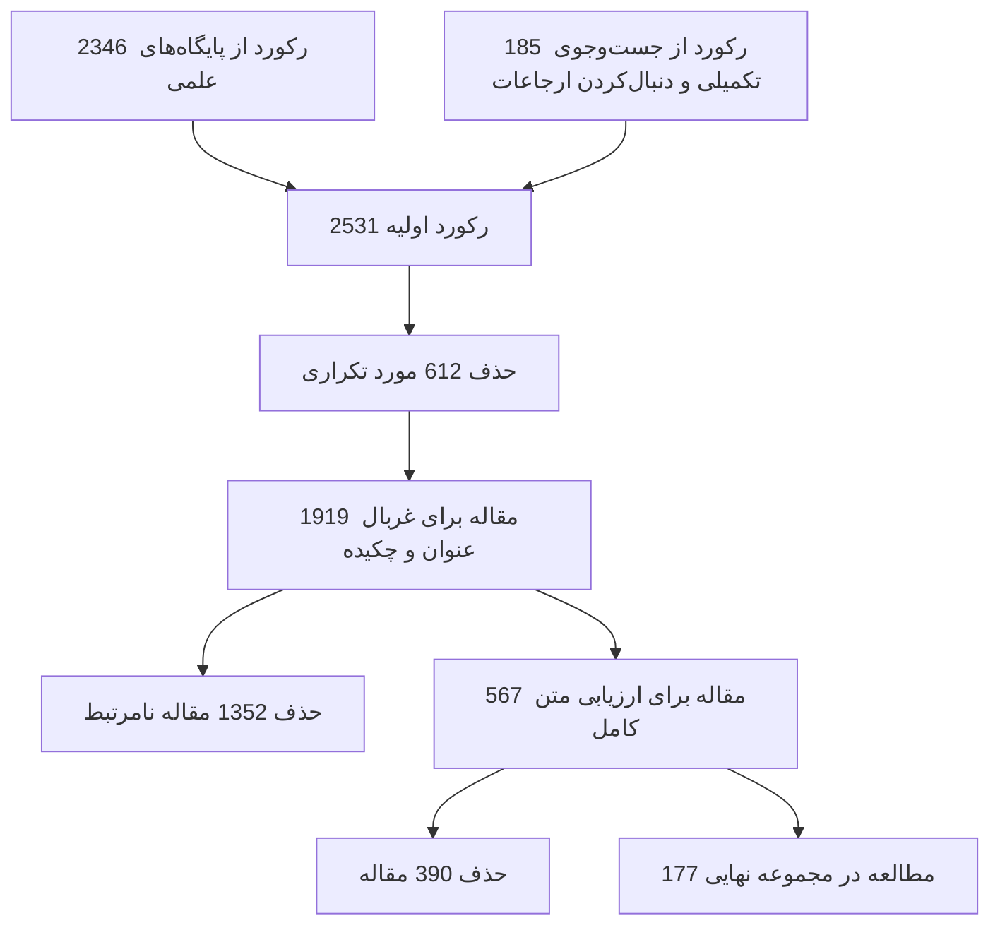
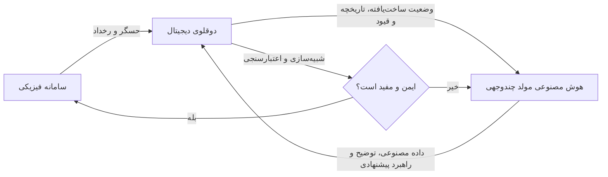
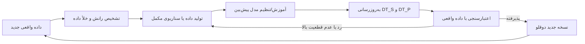
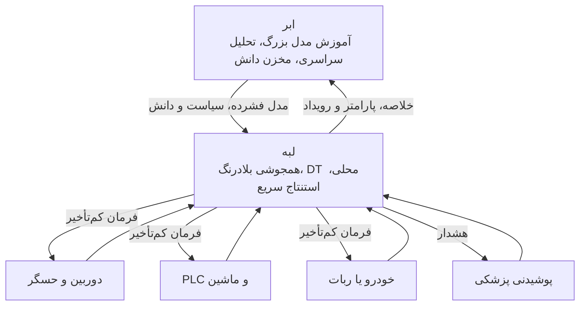
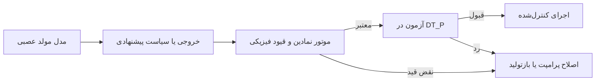
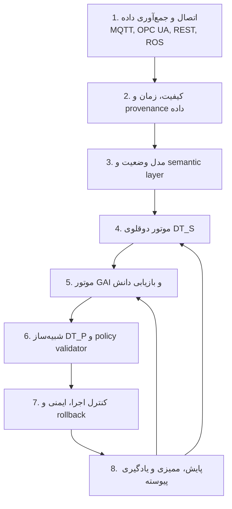

<div dir="rtl">

# به‌سوی AIoT هوشمند: مرور جامع یکپارچه‌سازی دوقلوی دیجیتال و هوش مصنوعی مولد چندوجهی

> **نوع متن:** بازنویسی و تبیین فارسیِ جامع برای انتشار در GitHub  
> **مقاله مبنا:** *Toward Intelligent AIoT: A Comprehensive Survey on Digital Twin and Multimodal Generative AI Integration*  
> **نویسندگان مقاله اصلی:** Xiaoyi Luo و همکاران  
> **مجله:** Mathematics، جلد ۱۳، مقاله ۳۳۸۲، سال ۲۰۲۵  
> **DOI:** `10.3390/math13213382`

---

## یادداشت درباره این نسخه فارسی

این متن یک ترجمه واژه‌به‌واژه نیست؛ بلکه **بازنویسی علمی، آموزشی و ساختاریافته**‌ای از مقاله اصلی است تا برای مطالعه، استناد مفهومی و انتشار در مخزن Git مناسب باشد. ساختار اصلی مقاله حفظ شده، روابط ریاضی با قالب LaTeX بازنویسی شده‌اند و جدول‌ها و شکل‌های کلیدی با Markdown و Mermaid بازطراحی شده‌اند.

هر بخشی که فراتر از محتوای مستقیم مقاله باشد، به‌صورت زیر مشخص شده است:

> **یادداشت تکمیلی نگارنده فارسی:** این بخش توضیح یا تحلیل افزوده‌شده برای کامل‌تر شدن بحث است.

---

## چکیده

هوش مصنوعی اشیا یا **AIoT** در حال عبور از مرحله اتصال ساده اشیا به مرحله‌ای است که در آن سامانه‌ها می‌توانند محیط را ادراک کنند، داده‌های ناهمگون را بفهمند، استدلال انجام دهند، آینده را پیش‌بینی کنند و تصمیم‌های خودکار بگیرند. این تحول در حوزه‌هایی مانند سلامت، تولید، حمل‌ونقل، شهر هوشمند و زیرساخت‌های صنعتی اهمیت ویژه‌ای دارد.

دو فناوری در این مسیر نقشی مکمل دارند:

- **دوقلوی دیجیتال (Digital Twin یا DT):** یک بازنمایی مجازیِ پویا و همگام با سامانه فیزیکی است که برای پایش بلادرنگ، شبیه‌سازی، پیش‌بینی و بهینه‌سازی استفاده می‌شود.
- **هوش مصنوعی مولد چندوجهی (Multimodal Generative AI یا GAI):** می‌تواند داده‌های متنی، تصویری، صوتی، حسگری و سری زمانی را به‌صورت مشترک تحلیل کند، میان وجه‌های مختلف ارتباط معنایی برقرار سازد، داده مصنوعی تولید کند و برای تصمیم‌گیری یا توضیح‌پذیری به‌کار رود.

مقاله، این دو فناوری را در قالب چرخه‌ای به نام **حس‌کردن–نگاشت–تولید–عمل** یا **SMGA** یکپارچه می‌کند. در این چرخه، داده‌های جهان فیزیکی حس می‌شوند، در دوقلوی دیجیتال به یک مدل وضعیت تبدیل می‌شوند، مدل‌های مولد راهبردهای ممکن را تولید می‌کنند و راهبردها پیش از اعمال در جهان واقعی، در یک محیط شبیه‌سازی‌شده اعتبارسنجی می‌شوند.

فناوری‌های کلیدی این یکپارچه‌سازی عبارت‌اند از:

- همجوشی و هم‌ترازی داده‌های چندوجهی؛
- تکامل پویای دوقلوی دیجیتال با کمک مدل‌های مولد؛
- یادگیری فدرال و تکمیل وجه‌های مفقود؛
- همکاری ابر–لبه–انتهای شبکه؛
- فشرده‌سازی مدل با هرس، کوانتیزه‌سازی و تقطیر دانش؛
- تخصیص هوشمند منابع با مدل‌های مولد و یادگیری تقویتی.

در پایان، مقاله چالش‌هایی مانند هزینه محاسباتی، توهم مدل‌های مولد، قابلیت اعتماد، امنیت و حریم خصوصی، نبود استانداردهای مشترک و دشواری تعامل‌پذیری را بررسی می‌کند و مسیرهایی مانند تولید عصبی–نمادین قابل‌راستی‌آزمایی، دوقلوهای سبک، AIoT سبز، یادگیری مادام‌العمر و حاکمیت اخلاقی را پیشنهاد می‌دهد.

**کلیدواژه‌ها:** هوش مصنوعی اشیا، دوقلوی دیجیتال، هوش مصنوعی مولد، یادگیری چندوجهی، همجوشی داده، رایانش لبه، همکاری ابر–لبه–انتها.

---

## فهرست مطالب

1. [مقدمه](#1-مقدمه)
2. [مبانی دوقلوی دیجیتال و هوش مصنوعی مولد چندوجهی](#2-مبانی-دوقلوی-دیجیتال-و-هوش-مصنوعی-مولد-چندوجهی)
3. [چارچوب یکپارچه SMGA](#3-چارچوب-یکپارچه-smga)
4. [فناوری‌های توانمندساز](#4-فناوریهای-توانمندساز)
5. [سناریوهای کاربردی](#5-سناریوهای-کاربردی)
6. [چالش‌ها و جهت‌گیری‌های آینده](#6-چالشها-و-جهتگیریهای-آینده)
7. [جمع‌بندی](#7-جمعبندی)
8. [نکات تکمیلی و نقشه راه پژوهشی](#8-نکات-تکمیلی-و-نقشه-راه-پژوهشی)
9. [واژه‌نامه](#9-واژهنامه)

---

# 1. مقدمه

## 1.1. زمینه و انگیزه

اینترنت اشیا در ابتدا عمدتاً بر اتصال حسگرها، دستگاه‌ها و سامانه‌ها متمرکز بود. با افزوده‌شدن یادگیری ماشین و هوش مصنوعی، مفهوم **AIoT** شکل گرفت؛ یعنی شبکه‌ای از اشیای متصل که نه‌تنها داده تولید می‌کنند، بلکه می‌توانند داده‌ها را تحلیل کرده و تصمیم‌هایی متناسب با شرایط محیطی بگیرند.

با وجود این، یک سامانه AIoT واقعی با چند دشواری اساسی روبه‌رو است:

1. **ناهمگونی داده‌ها:** دوربین، لیدار، میکروفن، حسگر دما، سیگنال‌های فیزیولوژیک، متن، لاگ و داده‌های ساخت‌یافته ماهیت‌های متفاوتی دارند.
2. **عدم هم‌زمانی:** حسگرها با نرخ نمونه‌برداری و تأخیرهای متفاوت کار می‌کنند.
3. **محدودیت منابع:** تجهیزات انتهایی و لبه‌ای معمولاً توان پردازشی، حافظه و انرژی محدودی دارند.
4. **کمبود داده‌های نادر:** خطاهای بحرانی، بیماری‌های نادر، تصادف‌ها و شرایط اضطراری به‌اندازه کافی در داده واقعی وجود ندارند.
5. **نیاز به تصمیم‌گیری ایمن:** تصمیم اشتباه در سلامت، خودرو خودران یا صنعت ممکن است خسارت جدی ایجاد کند.

دوقلوی دیجیتال و هوش مصنوعی مولد چندوجهی، هرکدام بخشی از این مشکل را حل می‌کنند:

- دوقلوی دیجیتال، **ساختار، وضعیت، تاریخچه و قوانین پویایی** سامانه را حفظ می‌کند.
- هوش مصنوعی مولد، **درک معنایی، تولید داده، استدلال و سازگاری بین‌وجهی** را تقویت می‌کند.

بنابراین، ترکیب آن‌ها می‌تواند سامانه‌ای ایجاد کند که هم به واقعیت فیزیکی متصل باشد و هم قدرت شناختی و تولیدی بالایی داشته باشد.

## 1.2. پرسش‌های اصلی پژوهش

مقاله بحث را حول سه پرسش سامان می‌دهد:

### RQ1 ـ مکمل‌بودن مفهومی

دوقلوی دیجیتال و هوش مصنوعی مولد چه نقش‌های متفاوت اما مکملی در AIoT دارند و چگونه می‌توان آن‌ها را در یک چارچوب نظری واحد برای «مجازی‌سازی» و «شناخت» ترکیب کرد؟

### RQ2 ـ چالش‌های سطح سامانه

مزایا، محدودیت‌ها و چالش‌های مشترک آن‌ها در حوزه‌های مختلف چیست؟ مهم‌ترین موضوعات تکرارشونده عبارت‌اند از کارایی، قابلیت اعتماد، حریم خصوصی، تعامل‌پذیری و استانداردسازی.

### RQ3 ـ مدل‌سازی و ارزیابی رسمی

تعامل DT و GAI چگونه می‌تواند با مدل‌های تابعی، احتمالاتی یا بهینه‌سازی بیان شود؟ چه شاخص‌هایی برای سنجش دقت، استحکام، پیچیدگی، کیفیت همجوشی و سازگاری دوقلو با واقعیت مناسب‌اند؟

## 1.3. روش مرور ادبیات

پایگاه‌های IEEE Xplore، ACM Digital Library، SpringerLink، ScienceDirect و Web of Science با ترکیب واژگان مرتبط با دوقلوی دیجیتال، هوش مصنوعی مولد، چندوجهی، AIoT، رایانش لبه، هرس، کوانتیزه‌سازی و تقطیر دانش جست‌وجو شدند.

فرایند انتخاب منابع به شکل زیر بود:



برای مدیریت منابع از EndNote و برای غربال‌گری از Rayyan استفاده شد. همچنین جست‌وجوی عقب‌رو در فهرست منابع و جست‌وجوی پیش‌رو در مقالات استنادکننده انجام گرفت.

> **یادداشت تکمیلی نگارنده فارسی:** وجود فرایند PRISMA نقطه قوت مقاله است، اما عبارت جست‌وجوی ارائه‌شده تا حدی به روش‌های فشرده‌سازی مانند pruning و quantization وابسته است. این وابستگی ممکن است بخشی از پژوهش‌های DT–GAI را که به این واژگان اشاره نکرده‌اند، از نتایج اولیه کنار بگذارد. برای یک مرور بازتولیدپذیرتر بهتر است عبارت‌های جست‌وجو برای هر پرسش پژوهش جداگانه گزارش شوند.

## 1.4. مشارکت‌های اصلی مقاله

1. **ارائه نگاه مکمل به DT و GAI:** دوقلو، بستر ساختاری و زمانی فراهم می‌کند و GAI، استدلال معنایی، تولید داده و سازگاری چندوجهی را اضافه می‌کند.
2. **ارائه چارچوب SMGA:** چرخه‌ای بسته برای حس‌کردن، ساخت وضعیت دوقلو، تولید راهبرد و اعمال ایمن تصمیم.
3. **مقایسه مدل‌های مولد:** بررسی مزایا و محدودیت‌های GAN، مدل‌های انتشار، VAE، Transformer و مدل‌های زبانی/چندوجهی.
4. **فرمول‌بندی ریاضی:** بیان نگاشت میان جهان فیزیکی، دوقلوی دیجیتال و مدل مولد با مدل‌های احتمالاتی و بهینه‌سازی.
5. **ارائه مجموعه شاخص‌های ارزیابی:** دقت، استحکام، سازگاری بین‌وجهی، هزینه محاسباتی و تطابق دوقلو با واقعیت.
6. **بررسی کاربردهای واقعی:** تولید هوشمند، شهر هوشمند، رانندگی خودکار و سلامت.
7. **ترسیم مسیر آینده:** تولید قابل‌راستی‌آزمایی، فشرده‌سازی دوقلو، پایداری انرژی، یادگیری پیوسته و حاکمیت اخلاقی.

---

# 2. مبانی دوقلوی دیجیتال و هوش مصنوعی مولد چندوجهی

## 2.1. دوقلوی دیجیتال در AIoT

دوقلوی دیجیتال یک مدل ایستا یا صرفاً سه‌بعدی نیست. یک DT کامل باید بین سامانه فیزیکی و مدل مجازی **جریان داده دوطرفه** برقرار کند و در طول زمان به‌روزرسانی شود.

سه ویژگی محوری آن عبارت‌اند از:

### 2.1.1. نگاشت فیزیکی–مجازی

داده‌های حسگر، تاریخچه و پارامترهای کنترلی به یک وضعیت نهفته در دوقلو نگاشت می‌شوند:

$$
x_t = g(s_t,h_t,c_t), \qquad y_t = h(x_t)
$$

که در آن:

- $s_t$: ورودی‌های حسگری لحظه‌ای؛
- $h_t$: تاریخچه وضعیت‌ها؛
- $c_t$: پارامترهای کنترل یا پیکربندی؛
- $x_t$: وضعیت نهفته دوقلو؛
- $y_t$: خروجی قابل مشاهده مدل مجازی.

هدف این است که $x_t$ تا حد امکان وضعیت واقعی سامانه را با جزئیات مناسب بازنمایی کند.

### 2.1.2. تعامل بلادرنگ

دوقلو فقط دریافت‌کننده داده نیست، بلکه می‌تواند دستور کنترلی به سامانه فیزیکی بازگرداند:

$$
x_{t+1}=f(x_t,u_t,w_t)
$$

در این رابطه:

- $u_t$ فرمان کنترلی تولیدشده توسط دوقلو است؛
- $w_t$ اغتشاش یا تغییر محیطی را نشان می‌دهد؛
- $f$ مدل انتقال وضعیت است.

برای پیاده‌سازی این ویژگی به صف پیام رویدادمحور، کانال ارتباطی کم‌تأخیر، پردازش لبه و جریان داده دوطرفه نیاز است.

### 2.1.3. بهینه‌سازی تکرارشونده

دوقلو باید با مشاهده خطای پیش‌بینی خود، پارامترهایش را اصلاح کند:

$$
\hat{x}_{t+1}=f(x_t,\theta)+\epsilon_t
$$

و سپس:

$$
\theta \leftarrow \theta-\eta\nabla_\theta \mathcal{L}(x_{t+1},\hat{x}_{t+1})
$$


که در آن $\theta$ پارامترهای مدل، $\eta$ نرخ یادگیری و $\mathcal{L}$ تابع زیان است.

> **یادداشت تکمیلی نگارنده فارسی:** در یک دوقلوی مهندسی، به‌روزرسانی پارامترها نباید بدون قید انجام شود. برای جلوگیری از ایجاد مدل‌های غیرواقعی، بهتر است قیود فیزیکی، محدوده مجاز پارامترها و قوانین ایمنی در تابع زیان یا مرحله اعتبارسنجی قرار گیرند.

## 2.2. نقش دوقلو در سامانه‌های AIoT

دوقلو در AIoT می‌تواند:

- داده حسگرهای توزیع‌شده را در یک مدل واحد جمع کند؛
- وضعیت سراسری سامانه را نمایش دهد؛
- پیش از اجرای تصمیم، پیامد آن را شبیه‌سازی کند؛
- خرابی و رفتار آینده را پیش‌بینی کند؛
- برای بهینه‌سازی عملیات، مصرف انرژی یا برنامه نگهداری به‌کار رود.

نمونه‌ها:

- **حمل‌ونقل:** ادغام اطلاعات خودرو، واحدهای کنار جاده و حسگرهای محیطی برای پیش‌بینی تراکم و زمان‌بندی مشترک.
- **سلامت:** ترکیب سیگنال‌های فیزیولوژیک، تصویر پزشکی و الگوی رفتاری برای ساخت دوقلوی شخصی بیمار.
- **تولید:** بازنمایی ماشین، خط تولید و وضعیت تجهیزات برای نگهداری پیش‌بینانه و بهینه‌سازی تولید.

## 2.3. هوش مصنوعی مولد چندوجهی

هوش مصنوعی مولد مجموعه‌ای از مدل‌هاست که توزیع داده را یاد می‌گیرد و می‌تواند نمونه، توضیح، پاسخ، طرح یا راهبرد جدید تولید کند. مقاله سه خانواده مهم را برجسته می‌کند.

### 2.3.1. مدل‌های زبانی بزرگ و Transformer

مبنای بسیاری از مدل‌های زبانی و چندوجهی جدید، سازوکار توجه است:

$$
\operatorname{Attention}(Q,K,V)=\operatorname{softmax}\left(\frac{QK^\top}{\sqrt{d_k}}\right)V
$$

Transformer امکان مدل‌سازی وابستگی‌های دور، ترکیب توکن‌های متنی و تصویری و یادگیری نمایش مشترک را فراهم کرده است.

کاربردهای آن در DT–AIoT شامل موارد زیر است:

- تفسیر لاگ‌های نگهداری؛
- تولید گزارش طبیعی از خروجی مدل‌های عددی؛
- پاسخ‌گویی مکالمه‌ای درباره وضعیت دوقلو؛
- استخراج دانش از اسناد فنی؛
- تولید سناریوهای «چه می‌شود اگر»؛
- تبدیل هدف سطح بالا به توالی اقدام.

### 2.3.2. شبکه‌های مولد تخاصمی

در GAN، مولد $G$ نمونه تولید می‌کند و تمایزدهنده $D$ تلاش می‌کند نمونه واقعی را از مصنوعی تشخیص دهد:

$$
\min_G\max_D\;
\mathbb{E}_{x\sim p_{data}}[\log D(x)]
+\mathbb{E}_{z\sim p_z}[\log(1-D(G(z)))]
$$

مزایا:

- تولید نمونه‌های باکیفیت؛
- مناسب برای افزایش داده و شبیه‌سازی خطا؛
- امکان کنترل‌پذیری با Conditional GAN؛
- کارایی مناسب در تولید تصویر یا سیگنال.

محدودیت‌ها:

- ناپایداری آموزش؛
- فروپاشی مد؛
- دشواری تضمین پوشش کل توزیع؛
- حساسیت به طراحی معماری و تابع زیان.

### 2.3.3. مدل‌های انتشار

مدل انتشار ابتدا به داده نویز اضافه می‌کند و سپس فرایند حذف نویز را می‌آموزد. زیان متداول آن به صورت زیر است:

$$
\mathcal{L}_{DDPM}=
\mathbb{E}_{x_0,\epsilon,t}
\left[\left\|\epsilon-\epsilon_\theta(x_t,t)\right\|_2^2\right]
$$

مزایا:

- کیفیت و تنوع بالای نمونه؛
- پایداری بیشتر نسبت به GAN؛
- مناسب برای مدل‌سازی عدم قطعیت؛
- امکان اعمال شرط و قید در فرایند تولید.

محدودیت اصلی، تعداد زیاد گام‌های نمونه‌برداری و هزینه محاسباتی است. مدل‌های انتشار نهفته با انجام فرایند در فضای latent این هزینه را کاهش می‌دهند.

### 2.3.4. خودرمزگذارهای واریاسیونی

VAE داده را به متغیر نهفته $z$ نگاشت و سپس بازسازی می‌کند. کران پایین شواهد به شکل زیر نوشته می‌شود:

$$
\mathcal{L}_{VAE}=\mathbb{E}_{q_\phi(z|x)}[\log p_\theta(x|z)]
-D_{KL}\big(q_\phi(z|x)\|p(z)\big)
$$

VAE برای نمایش نهفته، تکمیل داده مفقود، تولید نمونه و مدل‌سازی احتمالاتی مناسب است، هرچند ممکن است نمونه‌های آن از نظر جزئیات به تیزی مدل‌های انتشار یا GAN نباشند.

## 2.4. مسیرهای اصلی هوش چندوجهی

مقاله چهار مسیر مهم را مشخص می‌کند:

### 2.4.1. مدل‌های بینایی–زبان

مدل‌هایی مانند CLIP، BLIP، Flamingo و OFA میان متن و تصویر فضای معنایی مشترک ایجاد می‌کنند. نتایج مهم آن‌ها عبارت‌اند از:

- طبقه‌بندی صفرنمونه‌ای؛
- توصیف تصویر؛
- پرسش و پاسخ تصویری؛
- بازیابی متن–تصویر؛
- یادگیری چندنمونه‌ای؛
- یکپارچه‌سازی معماری و وظایف مختلف.

### 2.4.2. هم‌ترازی صوت و متن

مدل‌هایی مانند AudioPaLM و SALMONN پردازش گفتار، صوت محیطی، موسیقی و زبان را در یک چارچوب مشترک انجام می‌دهند. این قابلیت در دوقلوهای صنعتی برای تحلیل صدای ماشین و در سلامت برای تحلیل گفتار یا صدای تنفسی اهمیت دارد.

### 2.4.3. یادگیری نمایش بین‌وجهی

هدف، نگاشت وجه‌های مختلف به فضای مشترک است. زیان کنتراستی نمونه‌های متناظر را نزدیک و نمونه‌های نامرتبط را دور می‌کند:

$$
\mathcal{L}_{CL}=-\sum_{i=1}^{N}
\log\frac{\exp(\operatorname{sim}(h_v^{(i)},h_t^{(i)})/\tau)}
{\sum_{j=1}^{N}\exp(\operatorname{sim}(h_v^{(i)},h_t^{(j)})/\tau)}
$$

### 2.4.4. مهندسی پرامپت چندوجهی

پرامپت می‌تواند متن، تصویر، ناحیه موردنظر، نمونه، قید یا توالی استدلال را شامل شود. زنجیره فکر چندوجهی ابتدا شواهد متن و تصویر را ترکیب می‌کند و سپس پاسخ نهایی را می‌سازد.

> **یادداشت تکمیلی نگارنده فارسی:** در سامانه‌های صنعتی و پزشکی، نمایش زنجیره فکر داخلی مدل لزوماً روش مناسبی برای توضیح‌پذیری نیست. بهتر است توضیح نهایی بر شواهد قابل ممیزی مانند مقادیر حسگر، قواعد فیزیکی، رخدادهای ثبت‌شده و نتایج شبیه‌سازی تکیه کند.

## 2.5. هوش مصنوعی مولد به‌عنوان لایه تقویت شناختی دوقلو

مقاله تأکید می‌کند که GAI قرار نیست همه مدل‌های کلاسیک یادگیری ماشین در دوقلو را جایگزین کند. معماری مطلوب، سلسله‌مراتبی است:

- مدل‌های ML در لایه نگاشت، تخمین وضعیت، تشخیص ناهنجاری و پیش‌بینی عددی انجام می‌دهند.
- GAI در لایه بالاتر، نتایج را تفسیر می‌کند، داده مفقود را می‌سازد، سناریو تولید می‌کند و رابط انسانی ایجاد می‌کند.

برای مثال در کارخانه:

1. مدل ارتعاش، ناهنجاری یاتاقان را تشخیص می‌دهد.
2. دوقلو وضعیت تجهیز و تاریخچه تعمیرات را نگه می‌دارد.
3. مدل مولد علت‌های محتمل را در قالب گزارش توضیح می‌دهد.
4. چند راهبرد تعمیر یا کاهش بار تولید می‌شود.
5. دوقلو پیامد هر راهبرد را شبیه‌سازی می‌کند.
6. راهبرد کم‌خطرتر انتخاب می‌شود.

این لایه شناختی برای سازگاری با تغییرات سامانه نیز مفید است. وقتی تجهیز تغییر می‌کند یا در محیط جدیدی قرار می‌گیرد، GAI می‌تواند:

- داده متناظر با شرایط جدید تولید کند؛
- از متن تعمیرات و اسناد تغییر طراحی دانش استخراج کند؛
- برای سازگاری دامنه نمونه مصنوعی بسازد؛
- بدون بازآموزی کامل، دانش سامانه را به‌روز کند.

## 2.6. هم‌زیستی DT و GAI

رابطه مکمل را می‌توان به صورت یک نگاشت دوطرفه نمایش داد:

$$
D_{GAI}=\phi(D_{DT},y), \qquad E_{DT}=\psi(E_{GAI},u)
$$

- $D_{DT}$: جریان داده چندوجهی دوقلو؛
- $y$: دانش یا پیشین نهفته مدل مولد؛
- $D_{GAI}$: داده یا محتوای مصنوعی تولیدشده؛
- $E_{GAI}$: سیاست، پیش‌بینی یا پیشنهاد مدل مولد؛
- $u$: ورودی کنترلی؛
- $E_{DT}$: به‌روزرسانی وضعیت دوقلو.



### تقسیم نقش‌ها

| بُعد | دوقلوی دیجیتال | هوش مصنوعی مولد |
|---|---|---|
| اتصال به واقعیت | داده حسگر و همگام‌سازی زمانی | استفاده از زمینه و دانش تکمیلی |
| ساختار | مدل دارایی، فرایند و روابط | نمایش نهفته و معنایی |
| پیش‌بینی | شبیه‌سازی بر پایه مدل یا داده | تولید چند آینده و عدم قطعیت |
| داده کم | ثبت و سازمان‌دهی داده موجود | تولید داده مصنوعی و تکمیل وجه مفقود |
| تصمیم | آزمون راهبرد در محیط مجازی | تولید راهبرد و توضیح انسانی |
| ایمنی | قیود، sandbox و کنترل اجرا | نیازمند اتصال به دوقلو و راستی‌آزمایی |
| ضعف اصلی | هزینه ساخت و نگهداری مدل دقیق | توهم، عدم قطعیت و هزینه محاسباتی |

> **یادداشت تکمیلی نگارنده فارسی:** بهترین معماری، GAI را منبع حقیقت نمی‌داند. «حقیقت عملیاتی» باید از حسگرهای معتبر، مدل دوقلو، قواعد دامنه و ثبت رویدادها حاصل شود. GAI نقش مولد، خلاصه‌کننده و پیشنهاددهنده دارد و تصمیم آن باید در لایه اعتبارسنجی کنترل شود.

---

# 3. چارچوب یکپارچه SMGA

SMGA مخفف چهار مرحله **Sense–Map–Generate–Act** است. ایده اصلی آن است که یک AIoT قابل اعتماد نباید مستقیماً از داده خام به فرمان فیزیکی برسد. میان ادراک و اجرا باید دو مرحله مهم وجود داشته باشد:

1. تبدیل داده ناهمگون به یک وضعیت منسجم و قابل اتکا؛
2. آزمون راهبردهای تولیدشده در محیط مجازی پیش از اجرا.

در این معماری دو نوع دوقلو از یکدیگر تفکیک می‌شوند:

- **دوقلوی وضعیت یا $DT_S$:** بازنمایی جاری جهان و وضعیت فیزیکی؛
- **دوقلوی پیش‌بین/محیط آزمون یا $DT_P$:** محیطی برای شبیه‌سازی پیامد سیاست‌های پیشنهادی.

```mermaid
flowchart TB
    PW[جهان فیزیکی]
    S[لایه Sense<br/>دوربین، LiDAR، صوت، شتاب‌سنج و حسگر]
    M[لایه Map<br/>پاک‌سازی، هم‌زمان‌سازی، هم‌ترازی و تخمین وضعیت]
    DTS[دوقلوی وضعیت DT_S]
    G[لایه Generate<br/>Transformer، VAE، GAN، Diffusion و مدل چندوجهی]
    C[راهبردهای کاندید π1 تا πk]
    DTP[دوقلوی پیش‌بین DT_P<br/>Sandbox شبیه‌سازی]
    V{V(πi) > τ ؟}
    A[اجرای راهبرد بهینه π*]
    R[سیگنال بازخورد و بازتولید]

    PW -->|مشاهدات X(t)| S
    S -->|داده چندوجهی| M
    M --> DTS
    DTS -->|وضعیت st| G
    G --> C
    C --> DTP
    DTP --> V
    V -->|بله| A
    A --> PW
    V -->|خیر| R
    R --> G
    PW -->|بازخورد اجرای واقعی| M
```

## 3.1. لایه Sense

لایه حس با جهان فیزیکی در تماس مستقیم است. خروجی آن مجموعه‌ای از مشاهدات چندوجهی در زمان $t$ است:

$$
X(t)=\left\{x^{(1)}(t),x^{(2)}(t),\ldots,x^{(M)}(t)\right\}
$$

که $x^{(m)}(t)$ داده وجه یا حسگر $m$ام را نشان می‌دهد.

نمونه وجه‌ها:

- تصویر RGB یا حرارتی؛
- ابرنقاط LiDAR؛
- سیگنال ارتعاش و شتاب؛
- صوت و گفتار؛
- دما، فشار، جریان و ولتاژ؛
- موقعیت و سرعت؛
- متن، گزارش، لاگ و فرمان اپراتور.

### نویز و عدم قطعیت حسگر

اندازه‌گیری واقعی را می‌توان به‌صورت زیر مدل کرد:

$$
\tilde{x}^{(m)}(t)=x^{(m)}(t)+\epsilon^{(m)}(t),
\qquad \epsilon^{(m)}(t)\sim\mathcal{N}(0,\sigma_m^2)
$$

در عمل خطاها فقط گاوسی نیستند. ممکن است با موارد زیر مواجه شویم:

- داده پرت؛
- قطع کامل حسگر؛
- اشباع؛
- رانش کالیبراسیون؛
- بسته‌های گمشده؛
- حمله سایبری؛
- تأخیر و جابه‌جایی زمانی.

> **یادداشت تکمیلی نگارنده فارسی:** بهتر است لایه Sense علاوه بر مقدار داده، متادیتای کیفیت را نیز منتقل کند؛ مانند زمان نمونه‌برداری، شناسه حسگر، وضعیت کالیبراسیون، درصد بسته‌های گمشده و تخمین عدم قطعیت. بدون این اطلاعات، لایه Map ممکن است داده ضعیف را با داده معتبر هم‌وزن کند.

## 3.2. لایه Map

وظیفه این لایه ساخت یک «وضعیت مشترک جهان» از داده‌های خام است. فعالیت‌های اصلی آن شامل پاک‌سازی، تصحیح، هم‌زمان‌سازی، هم‌ترازی مکانی، همجوشی، استخراج ویژگی و تخمین وضعیت است.

### 3.2.1. هم‌ترازی زمانی

هر جریان حسگری به یک خط زمانی واحد نگاشت می‌شود:

$$
\bar{x}^{(m)}(t)=\mathcal{I}_m\left(x^{(m)}(\tau_m(t))\right)
$$

$$
\tau_m(t)=\alpha_m t+\beta_m-\Delta_m
$$

که در آن:

- $\alpha_m$ مقیاس ساعت؛
- $\beta_m$ جابه‌جایی زمانی؛
- $\Delta_m$ تأخیر برآوردشده؛
- $\mathcal{I}_m$ عملگر درون‌یابی یا نمونه‌برداری مجدد است.

### 3.2.2. هم‌ترازی مکانی

داده حسگرها باید به دستگاه مختصات جهان تبدیل شود:

$$
\tilde{p}^{W}=T_m\tilde{p}^{(m)},
\qquad
T_m=
\begin{bmatrix}
R_m&t_m\\
0^\top&1
\end{bmatrix}\in SE(3)
$$

برای دوربین، نگاشت نقطه جهان به صفحه تصویر با ماتریس درونی و بیرونی انجام می‌شود:

$$
\tilde{u}\sim K_m[R_m|t_m]\tilde{p}^{W}
$$

و مختصات دوبعدی با تقسیم همگن به‌دست می‌آید.

### 3.2.3. همجوشی آگاه از عدم قطعیت

یک روش پایه، میانگین‌گیری وزن‌دار بر اساس واریانس نویز است:

$$
z_t=\sum_{m=1}^{M} w_m(t)\bar{x}^{(m)}_W(t)
$$

$$
w_m(t)=
\frac{(\sigma_m^2(t)+\delta_m)^{-1}}
{\sum_{j=1}^{M}(\sigma_j^2(t)+\delta_j)^{-1}}
$$

حسگری که عدم قطعیت کمتری دارد وزن بیشتری می‌گیرد. $\delta_m$ از تقسیم بر صفر و وزن نامحدود جلوگیری می‌کند.

### 3.2.4. فضای معنایی مشترک

ابتدا برای هر وجه یک embedding ساخته می‌شود:

$$
e^{(m)}(t)=\phi_m(\bar{x}^{(m)}_W(t))
$$

سپس نمایش مشترک:

$$
e_t=\Psi\left(\{e^{(m)}(t)\}_{m=1}^{M}\right)
$$

یک زیان ساده هم‌ترازی میان وجه‌ها:

$$
\mathcal{L}_{align}=\sum_{m<n}\left\|e^{(m)}(t)-e^{(n)}(t)\right\|_2^2
$$

البته در سامانه واقعی، یکسان‌کردن کامل embeddingها همیشه مطلوب نیست؛ بخشی از اطلاعات هر وجه اختصاصی است. معمولاً باید هم نمایش مشترک و هم مؤلفه اختصاصی هر وجه حفظ شود.

### 3.2.5. تخمین وضعیت دوقلو

مدل حالت استاندارد:

$$
s_t=f(s_{t-1},u_t)+w_t
$$

$$
y_t=h(s_t)+v_t
$$

که در آن $w_t$ نویز فرایند و $v_t$ نویز مشاهده است.

در نگاه بیزی:

$$
p(s_t|y_{1:t})\propto p(y_t|s_t)
\int p(s_t|s_{t-1})p(s_{t-1}|y_{1:t-1})\,ds_{t-1}
$$

یا می‌توان وضعیت را از طریق بهینه‌سازی به‌دست آورد:

$$
s_t=\arg\min_s
\left\{
\|h(s)-y_t\|_R^2+
\lambda\|s-f(s_{t-1},u_t)\|_Q^2
\right\}
$$

جمله اول سازگاری با مشاهده و جمله دوم سازگاری با دینامیک را کنترل می‌کند.

### خروجی لایه Map

خروجی باید شامل این موارد باشد:

- وضعیت تخمین‌زده‌شده $s_t$؛
- عدم قطعیت یا توزیع پسین؛
- کیفیت و تازگی داده؛
- رخدادها و ناهنجاری‌ها؛
- قیود فیزیکی و عملیاتی؛
- سابقه کوتاه‌مدت موردنیاز لایه مولد.

## 3.3. لایه Generate

این لایه از وضعیت $DT_S$ استفاده می‌کند تا:

- آینده‌های محتمل را شبیه‌سازی کند؛
- داده یا وجه مفقود بسازد؛
- علت‌ها را استنباط کند؛
- چند راهبرد کنترلی یا عملیاتی تولید کند؛
- پیامدهای احتمالی را توضیح دهد؛
- عدم قطعیت و گزینه‌های جایگزین را گزارش کند.

خروجی را می‌توان مجموعه‌ای از سیاست‌های کاندید دانست:

$$
\Pi=\{\pi_1,\pi_2,\ldots,\pi_k\}
$$

مدل‌های قابل استفاده:

| مدل | نقش مناسب در لایه Generate | محدودیت مهم |
|---|---|---|
| VAE | نمونه‌گیری در فضای نهفته، تکمیل داده، برآورد عدم قطعیت | احتمال تولید خروجی نرم یا کم‌جزئیات |
| GAN | ساخت خطاها و سناریوهای واقع‌نما | ناپایداری و فروپاشی مد |
| Diffusion | تولید چند سناریوی متنوع و باکیفیت | زمان استنتاج بالا |
| Transformer/LLM | استدلال بر متن و توالی، تولید گزارش و برنامه | توهم و وابستگی به زمینه |
| مدل چندوجهی بزرگ | ترکیب تصویر، متن، صوت و حسگر | نیاز شدید به منابع و داده هم‌تراز |
| مدل گرافی مولد | تولید یا پیش‌بینی ساختار و تعامل اجزا | دشواری مقیاس و اعتبارسنجی ساختار |

### تولید راهبرد و ارزیابی چندهدفه

هر راهبرد می‌تواند بر اساس چند هدف ساخته شود:

$$
J(\pi)=
\alpha_1 J_{performance}(\pi)
+\alpha_2 J_{safety}(\pi)
+\alpha_3 J_{energy}(\pi)
+\alpha_4 J_{cost}(\pi)
$$

معمولاً هدف ایمنی باید به‌صورت قید سخت در نظر گرفته شود، نه صرفاً یک جمله با وزن قابل مصالحه:

$$
g_j(\pi)\leq 0,\qquad j=1,\ldots,r
$$

> **یادداشت تکمیلی نگارنده فارسی:** در کاربردهای ایمنی‌بحرانی، استفاده از میانگین وزنی ممکن است راهبردی را انتخاب کند که از نظر عملکرد عالی ولی از نظر ایمنی مرزی است. معماری مطمئن‌تر ابتدا همه سیاست‌های ناقض قید ایمنی را حذف می‌کند و سپس میان سیاست‌های مجاز بهینه‌سازی انجام می‌دهد.

## 3.4. لایه Act

Act حلقه اتصال برنامه مجازی به اجرای واقعی است. مقاله این لایه را بر چهار گام بنا می‌کند.

### 3.4.1. شبیه‌سازی

هر سیاست $\pi_i$ در $DT_P$ اجرا می‌شود. این دوقلو ممکن است شامل موارد زیر باشد:

- مدل فیزیکی؛
- مدل داده‌محور؛
- مدل عامل‌ها و رفتار انسان؛
- شبیه‌ساز شبکه و ارتباط؛
- تزریق خطا، تأخیر و اغتشاش؛
- سناریوهای بدترین حالت.

### 3.4.2. اعتبارسنجی

تابع اعتبارسنجی $V(\pi_i)$ با استفاده از KPIها محاسبه می‌شود:

$$
V(\pi_i)=F(
\text{دقت},
\text{استحکام},
\text{تأخیر},
\text{انرژی},
\text{ایمنی},
\text{سازگاری فیزیکی})
$$

### 3.4.3. تصمیم

یک سیاست زمانی معتبر است که:

$$
V(\pi_i)>\tau
$$

سیاست بهینه:

$$
\pi^*=\arg\max_{\pi_i\in\Pi_{valid}}V(\pi_i)
$$

پس از آن، سیاست به فرمان‌های قابل اجرا برای عملگرها تبدیل می‌شود.

### 3.4.4. بازخورد و اصلاح

اگر سیاست رد شود، فقط اعلام «رد» کافی نیست. باید علت شکست به Generate بازگردد، برای مثال:

- تجاوز دما از حد مجاز؛
- ناپایداری حلقه کنترل؛
- تأخیر بیش از سقف؛
- مصرف انرژی زیاد؛
- حساسیت شدید به یک حسگر؛
- تعارض با قاعده عملیاتی.

این بازخورد، تولید دور بعدی را هدایت می‌کند.

## 3.5. چرخه کامل SMGA

```text
داده فیزیکی
    ↓
[Sense] جمع‌آوری + کیفیت‌سنجی
    ↓
[Map] هم‌ترازی + همجوشی + تخمین وضعیت
    ↓
DT_S = تصویر جاری و قابل اتکای سامانه
    ↓
[Generate] تولید آینده‌ها و سیاست‌های کاندید
    ↓
DT_P = شبیه‌سازی و آزمون سیاست‌ها
    ↓
[Act] اعتبارسنجی، انتخاب و اجرای کنترل‌شده
    ↓
بازخورد واقعی و اصلاح دوقلو و مدل مولد
```

این چرخه، AIoT را از یک سامانه واکنشی ساده به سامانه‌ای با قابلیت پیش‌بینی، آزمون مجازی، سازگاری و یادگیری بلندمدت تبدیل می‌کند.

---

## 3.6. شاخص‌های کمی ارزیابی DT–GAI

ارزیابی فقط با Accuracy کافی نیست. یک سامانه DT–GAI باید از چند منظر سنجیده شود.

### 3.6.1. معیارهای طبقه‌بندی

$$
Accuracy=\frac{TP+TN}{TP+TN+FP+FN}
$$

$$
Precision=\frac{TP}{TP+FP}
$$

$$
Recall=\frac{TP}{TP+FN}
$$

$$
F1=2\times\frac{Precision\times Recall}{Precision+Recall}
$$

همچنین ROC-AUC و PR-AUC برای مقایسه مستقل از آستانه به‌کار می‌روند. PR-AUC در داده‌های بسیار نامتوازن، مانند تشخیص خطای نادر، معمولاً گویاتر است.

### 3.6.2. معیارهای رگرسیون

$$
MSE=\frac{1}{n}\sum_{i=1}^{n}(y_i-\hat{y}_i)^2
$$

$$
RMSE=\sqrt{MSE}
$$

$$
MAE=\frac{1}{n}\sum_{i=1}^{n}|y_i-\hat{y}_i|
$$

$$
R^2=1-\frac{\sum_i(y_i-\hat{y}_i)^2}{\sum_i(y_i-\bar{y})^2}
$$

### 3.6.3. افت عملکرد در نویز

اگر $M_0$ عملکرد روی داده پاک و $M_{noise}$ عملکرد روی داده آلوده باشد:

$$
Performance\ Drop=\frac{M_0-M_{noise}}{M_0}\times100\%
$$

این معیار باید برای شدت‌های مختلف نویز، وجه‌های مفقود و نرخ‌های متفاوت بسته گمشده گزارش شود.

### 3.6.4. استحکام خصمانه

$$
Adversarial\ Accuracy=
\frac{1}{n}\sum_{i=1}^{n}\mathbb{I}(\hat{y}^{adv}_i=y_i)
$$

در AIoT، حمله فقط perturbation تصویری نیست؛ می‌تواند جعل حسگر، دست‌کاری زمان، replay، تزریق داده یا تغییر متن دستور باشد.

### 3.6.5. پایداری آزمایش

واریانس عملکرد در اعتبارسنجی $k$-بخشی:

$$
CV\ Variance=\frac{1}{k}\sum_{j=1}^{k}(M_j-\bar{M})^2
$$

شکاف آموزش و آزمون:

$$
Train-Test\ Gap=M_{train}-M_{test}
$$

### 3.6.6. سازگاری میان وجه‌ها

برای دو وجه A و B:

$$
C_{modal}=\frac{1}{n}\sum_{i=1}^{n}\mathbb{I}(\hat{y}_i^A=\hat{y}_i^B)
$$

این معیار ساده است، اما توافق بالا همیشه به معنی درستی نیست؛ ممکن است هر دو وجه یک خطای مشترک داشته باشند.

### 3.6.7. دقت سازگاری دامنه

$$
Domain\ Accuracy=\frac{M_{target}}{M_{source}}\times100\%
$$

نسبت نزدیک به صد درصد نشان می‌دهد انتقال به دامنه هدف افت کمی ایجاد کرده است.

### 3.6.8. کارایی همجوشی

$$
Fusion\ Efficiency=
\frac{M_{fusion}-\max(M_{single})}{FLOPs_{fusion}}
$$

هدف آن است که نشان دهد افزایش دقت ناشی از همجوشی در برابر هزینه محاسباتی چقدر ارزش دارد.

### 3.6.9. تأخیر استنتاج

$$
T_{inference}=\frac{1}{n}\sum_{i=1}^{n}t_i
$$

برای سامانه بلادرنگ بهتر است علاوه بر میانگین، صدک‌های ۹۵ و ۹۹ نیز گزارش شوند؛ زیرا میانگین ممکن است تأخیرهای شدید و نادر را پنهان کند.

### 3.6.10. تعداد پارامتر و FLOPs

$$
P_{total}=\sum_{l=1}^{L}p_l
$$

$$
FLOPs_{total}=\sum_{l=1}^{L}FLOPs_l
$$

همراه با این دو باید حافظه اوج، انرژی هر استنتاج، پهنای باند و حجم ارتباط نیز اندازه‌گیری شود.

### 3.6.11. وفاداری دوقلو به واقعیت

مقاله یک معیار خطای متوسط وضعیت را مطرح می‌کند:

$$
\Delta=\frac{1}{T}\sum_{t=1}^{T}\|x_t-\hat{x}_t\|_2
$$

این معیار نشان می‌دهد دوقلو تا چه حد رفتار واقعی را بازتولید می‌کند.

> **یادداشت تکمیلی نگارنده فارسی:** وفاداری بهتر است چندمقیاسی گزارش شود: خطای لحظه‌ای، خطای تجمعی، خطای رویدادهای بحرانی و خطای توزیع. ممکن است یک دوقلو RMSE کمی داشته باشد اما یک رخداد نادر و مهم را کاملاً از دست بدهد.

### 3.6.12. ماتریس پیشنهادی ارزیابی

| محور | شاخص‌های نمونه | پرسش اصلی |
|---|---|---|
| دقت وظیفه | F1، MAE، RMSE، AUC | آیا خروجی درست است؟ |
| وفاداری دوقلو | خطای حالت، تطابق رخداد، خطای دینامیک | آیا مدل مجازی واقعیت را بازتاب می‌دهد؟ |
| چندوجهی | سازگاری، کیفیت alignment، افت با وجه مفقود | آیا وجه‌ها درست ترکیب شده‌اند؟ |
| استحکام | افت نویز، دقت خصمانه، سناریوی بدترین حالت | در شرایط نامطلوب چه می‌شود؟ |
| کارایی | تأخیر، انرژی، حافظه، FLOPs، ارتباط | آیا روی سخت‌افزار هدف قابل اجراست؟ |
| اعتماد | نرخ توهم، کالیبراسیون اطمینان، نقض قید | آیا می‌توان تصمیم را پذیرفت؟ |
| عملیات | uptime، زمان بازیابی، نرخ شکست حلقه | آیا سامانه در عمل پایدار است؟ |

---

# 4. فناوری‌های توانمندساز

## 4.1. همجوشی داده چندوجهی و یادگیری نمایش

داده‌های AIoT از نظر قالب، نرخ زمانی، مقیاس، معنا و کیفیت متفاوت‌اند. هدف همجوشی آن است که این داده‌ها به یک نمایش مشترک تبدیل شوند، بدون آن‌که اطلاعات اختصاصی هر وجه از بین برود.

### 4.1.1. پردازش تک‌وجهی

برای هر وجه، استخراج‌گر مناسب انتخاب می‌شود:

$$
h^{(m)}=f_{\theta_m}(x^{(m)}),
\qquad x^{(m)}\in\mathbb{R}^{d_m}
$$

نمونه‌ها:

- CNN یا Vision Transformer برای تصویر؛
- RNN، TCN یا Transformer برای سری زمانی؛
- مدل صوتی برای طیف یا waveform؛
- encoder زبانی برای متن؛
- GNN برای توپولوژی شبکه و ارتباط اجزا.

مزیت تک‌وجهی، سادگی و هزینه کمتر است. ضعف آن، ناتوانی در پوشش کامل سامانه‌هایی است که وضعیت آن‌ها به چند منبع وابسته است.

### 4.1.2. هم‌ترازی چندوجهی

در هم‌ترازی، داده‌های متناظر در فضای نهفته نزدیک می‌شوند. CLIP نمونه شناخته‌شده این رویکرد برای تصویر–متن است. روش‌های پیشرفته‌تر می‌توانند از موارد زیر استفاده کنند:

- گراف دانش و ontology؛
- قید منطقی؛
- هم‌ترازی پویا متناسب با وظیفه؛
- یادگیری ضعیف‌نظارتی؛
- برچسب‌گذاری شبه‌خودکار؛
- تولید وجه مفقود.

### 4.1.3. نگاشت‌های معنایی برای تعامل‌پذیری دوقلو

مقاله به نمونه‌هایی مانند نگاشت داده سامانه حمل‌ونقل هوشمند به مدل اطلاعات پل و نگاشت DTDL به OPC UA اشاره می‌کند. به‌صورت کلی:

$$
\Phi:\mathcal{O}_{source}\rightarrow\mathcal{O}_{target}
$$

یعنی مفاهیم، ویژگی‌ها و روابط در یک مدل داده باید به معادل معنایی خود در مدل دیگر تبدیل شوند. صرف تبدیل JSON یا نام فیلدها کافی نیست؛ معنا، واحد، مختصات و قید نیز باید سازگار باشد.

### 4.1.4. عامل‌های چندوجهی

ورودی عامل:

$$
X=\{x^{(v)},x^{(a)},x^{(t)},x^{(s)}\}
$$

نمایش مشترک:

$$
z=f_\theta(x^{(v)},x^{(a)},x^{(t)},x^{(s)})
$$

سیاست تصمیم:

$$
\pi(a|s)=\operatorname{softmax}(Wz+b)
$$

در محیط چندعاملی، نمایش همسایه‌ها می‌تواند با توجه ترکیب شود:

$$
z_i'=z_i+\sum_{j\in\mathcal{N}(i)}\alpha_{ij}z_j
$$

و دوقلو با بازخورد محیط به‌روز شود:

$$
M_{t+1}=M_t+\Delta M(z,E_t)
$$

این سازوکار برای خودروهای متصل، ربات‌های مشارکتی، شبکه برق و مدیریت بحران شهری مناسب است.

> **یادداشت تکمیلی نگارنده فارسی:** در معماری چندعاملی، لازم است میان «اشتراک نمایش» و «اشتراک داده خام» تفاوت گذاشته شود. ارسال embedding فشرده می‌تواند پهنای باند و خطر حریم خصوصی را کاهش دهد، اما embedding نیز ممکن است اطلاعات حساس را نشت دهد و باید محافظت شود.

---

## 4.2. یادگیری فدرال چندوجهی

در یادگیری فدرال، داده خام در محل باقی می‌ماند و فقط پارامتر، گرادیان یا نمایش به سرور هماهنگ‌کننده ارسال می‌شود. این الگو در بیمارستان‌ها، کارخانه‌ها و خودروها مفید است، اما سه مشکل اساسی دارد:

1. هر گره ممکن است وجه‌های متفاوتی داشته باشد؛
2. داده‌ها غیرهم‌توزیع و از نظر حجم و کیفیت نامتوازن‌اند؛
3. مدل‌های چندوجهی بزرگ، ارتباط و محاسبه زیادی نیاز دارند.

مقاله راهکارها را در شش دسته قرار می‌دهد.

### 4.2.1. نمایش مشترک بین‌وجهی

هر وجه به فضای مشترک نگاشت می‌شود:

$$
H^{(v)}=W^{(v)}X^{(v)},\qquad v=1,\ldots,V
$$

و نمایش‌ها ترکیب می‌شوند:

$$
H=\operatorname{Flatten}(H^{(1)},H^{(2)},\ldots,H^{(V)})
$$

رویکردهای این دسته از attention، یادگیری کنتراستی، هموارسازی نمایش و تقطیر دانش برای کاهش شکاف بین وجه‌ها استفاده می‌کنند.

### 4.2.2. تکمیل وجه مفقود

وقتی یک مشتری فقط بخشی از وجه‌ها را دارد، شبکه مترجم یا مدل مولد، وجه مفقود را بازسازی می‌کند:

$$
\mathcal{L}_{recon}=\|\hat{X}_m-X_m\|_2^2
$$

نمونه روش‌ها:

- prototypeهای مشترک؛
- contrastive regularization؛
- bottleneck feature translation؛
- VAE یا diffusion شرطی؛
- mask و imputation network.

نکته مهم آن است که داده تولیدشده باید همراه با برآورد عدم قطعیت وارد دوقلو شود تا با مشاهده واقعی اشتباه گرفته نشود.

### 4.2.3. تقطیر دانش و تجمیع ویژه هر وجه

در تقطیر، خروجی مدل محلی با مدل جهانی مقایسه می‌شود:

$$
\mathcal{L}^{(k)}_{KD}=\sum_{m=1}^{M}
KL\left(
\sigma(Z_m^{(k)}/T)\|\sigma(Z_m^{global}/T)
\right)
$$

تجمیع وزن‌دار:

$$
\theta_{global}=\sum_{v=1}^{V}\alpha_v\theta_v,
\qquad \sum_{v=1}^{V}\alpha_v=1
$$

وزن‌ها می‌توانند بر اساس تعداد نمونه، کیفیت وجه، تازگی مدل یا قابلیت اعتماد مشتری تعیین شوند.

### 4.2.4. یادگیری فدرال شخصی‌سازی‌شده

یک بخش مدل بین همه مشترک و بخشی محلی است. هدف، حفظ تعمیم جهانی و سازگاری با شرایط هر سازمان یا دستگاه است. این رویکرد در سلامت شخصی، تجهیزات با فرسودگی متفاوت و کارخانه‌های دارای فرایندهای غیرهمسان اهمیت دارد.

یک ترکیب خطی چندوجهی ساده:

$$
H=\sum_{v=1}^{V}W^{(v)}X^{(v)}
$$

و برای داده مفقود، توزیع شرطی می‌تواند استفاده شود:

$$
p(x|y,z)=
\frac{p(y|x)p(z|x)p(x)}
{\sum_{x'}p(y|x')p(z|x')p(x')}
$$

### 4.2.5. فدراسیون مدل‌های ناهمگون

همه گره‌ها الزاماً یک معماری ندارند. یک گره ممکن است مدل کوچک CNN و دیگری Transformer بزرگ داشته باشد. برای انتقال دانش میان مدل‌های متفاوت از این روش‌ها استفاده می‌شود:

- تطبیق پارامترهای هم‌معنا؛
- interpolation؛
- ensemble نمایش؛
- تقطیر بر logits یا embedding؛
- contrastive representation transfer.

تجمیع کلی:

$$
\theta_{global}=\sum_{k=1}^{K}a_k\theta_k,
\qquad \sum_{k=1}^{K}a_k=1
$$

در مدل‌های واقعاً ناهمگون، این رابطه بیشتر یک انتزاع است؛ زیرا همه پارامترها هم‌شکل نیستند و انتقال باید در سطح نمایش یا خروجی انجام شود.

### 4.2.6. بهینه‌سازی ارتباط و کارایی

راهکارها:

- انتخاب مشتری‌های مهم؛
- انتخاب وجه‌های مفید؛
- sparsification گرادیان؛
- quantization پیام؛
- به‌روزرسانی نامتناوب؛
- تجمیع سلسله‌مراتبی در لبه و ابر؛
- هرس مدل و انتقال فقط لایه‌های تغییرکرده.

گرادیان تنک‌شده:

$$
\widetilde{\nabla\theta_k}=Top_p(\nabla\theta_k)
$$

تجمیع خوشه‌ای:

$$
\theta_{cluster}=\frac{1}{|C|}\sum_{k\in C}\theta_k
$$

$$
\theta_{global}=\frac{1}{|G|}\sum_{C\in G}\theta_{cluster}
$$

### جمع‌بندی یادگیری فدرال چندوجهی

| مسئله | راهکار اصلی | ریسک باقی‌مانده |
|---|---|---|
| نبود بعضی وجه‌ها | تولید یا ترجمه ویژگی | خطای مصنوعی و عدم قطعیت |
| غیرهم‌توزیع‌بودن داده | شخصی‌سازی و وزن‌دهی | افت تعمیم جهانی |
| ناهمگونی مدل | تقطیر و ensemble نمایش | دشواری مقایسه و هم‌ترازی |
| هزینه ارتباط | sparsification و تجمیع سلسله‌مراتبی | کاهش دقت یا تأخیر همگرایی |
| حریم خصوصی | محلی‌ماندن داده، DP و رمزنگاری | حمله بازسازی از گرادیان |

---

## 4.3. هوش مصنوعی مولد برای تکامل پویای دوقلو

یک دوقلوی ثابت در محیط متغیر به‌سرعت دچار **model drift** می‌شود. GAI می‌تواند با تولید داده و به‌روزرسانی دانش، دوقلو را از یک تصویر ثابت به سامانه‌ای خودسازگار تبدیل کند.

دو مسیر اصلی وجود دارد:

1. تولید داده برای پوشش خلأها و سناریوهای نادر؛
2. بهبود پیش‌بینی و هشدار با استفاده از داده تولیدی.

### 4.3.1. تولید داده برای دوقلو

#### الف) یادگیری توزیع مشترک

مدل مولد اطلاعات عددی، دسته‌ای، زمانی و محیطی را با هم یاد می‌گیرد. برای نمونه در ترافیک، شرایط جوی، زمان روز، تعطیلات و تاریخچه جریان می‌توانند مشترکاً ورودی GAN باشند.

کاربردها:

- جبران عدم توازن کلاس خطا؛
- تولید ترکیب‌های شرایط آب‌وهوایی و ترافیکی؛
- تولید سیگنال نقص تجهیز؛
- ساخت داده برای مشتری‌های فدرال کم‌نمونه.

#### ب) تولید شخصی‌سازی‌شده

در دوقلوی بیمار، پارامترهای فردی باید حفظ شوند. مدل مولد نباید فقط «بیمار متوسط» تولید کند. باید سن، ژنتیک، سابقه درمان، علائم حیاتی و پاسخ دارویی فرد را شرط قرار دهد.

مقاله نمونه‌ای از شبیه‌سازی تکامل تومور با diffusion و مدل زمانی را مطرح می‌کند که برای ارزیابی مسیرهای درمانی استفاده می‌شود.

#### ج) تولید هیبریدی با حداقل ویژگی

در شرایطی که فقط تعداد محدودی ویژگی موجود است، مدل می‌تواند با ترکیب بین‌نمونه‌ای و بین‌وجهی سناریوهای ناهنجار بسازد. مدل‌های diffusion گسسته چندوجهی برای تولید توکن‌های متن، تصویر یا داده ساخت‌یافته در یک چارچوب واحد مطرح شده‌اند.

### 4.3.2. پیش‌بینی مبتنی بر GAI

#### الف) هشدار زودهنگام

سناریوهای آینده تولید و احتمال وقوع وضعیت خطرناک محاسبه می‌شود. نمونه‌های مقاله شامل پیش‌بینی افت قند خون و تولید waveformهای قلبی مصنوعی است.

#### ب) مدل‌های پیش‌بین تقویت‌شده

مدل مولد می‌تواند نمونه‌های مهم را بیشتر تولید کند، محدودیت‌های دامنه را در داده مصنوعی اعمال کند و عدم قطعیت را بهتر نمایش دهد. مدل‌های مقید برای داده جدولی، نمونه‌هایی می‌سازند که قواعد دامنه را نقض نکنند.

#### ج) ترکیب Transformer و diffusion

Transformer وابستگی بلندمدت را می‌آموزد و diffusion توزیع احتمالاتی آینده را می‌سازد. در ترافیک، افزودن قیود دینامیکی مبتنی بر Graph Neural ODE می‌تواند پیش‌بینی‌های ۱۵ تا ۶۰ دقیقه آینده را قابل اتکاتر کند.

#### د) فرا-یادگیری

Meta-learning باعث می‌شود مدل از چند وظیفه دانش عمومی کسب کند و با داده کم به شرایط جدید سازگار شود. روش‌های علّی می‌توانند همبستگی‌های کاذب میان ویژگی‌های خاص یک وظیفه و برچسب را کاهش دهند.

### چرخه تکامل پویای دوقلو



> **یادداشت تکمیلی نگارنده فارسی:** داده مصنوعی نباید بدون برچسب منشأ در مخزن اصلی مخلوط شود. برای هر نمونه لازم است منشأ، نسخه مدل مولد، شرط تولید، seed، سطح حریم خصوصی و امتیاز کیفیت ثبت شود تا ممیزی و بازتولید ممکن باشد.

---

## 4.4. هوشمندی مشارکتی ابر–لبه–انتها

در معماری AIoT سه سطح اصلی وجود دارد:

- **انتها (End):** حسگر، PLC، خودرو، پوشیدنی یا ربات؛ نزدیک‌ترین نقطه به جهان فیزیکی.
- **لبه (Edge):** gateway، سرور محلی، MEC یا رایانه صنعتی؛ مناسب برای تحلیل کم‌تأخیر.
- **ابر (Cloud):** محاسبه سنگین، آموزش مدل، ذخیره بلندمدت و بهینه‌سازی سراسری.



مزایا:

- کاهش تأخیر؛
- کاهش ارسال داده خام؛
- افزایش تاب‌آوری در قطع ارتباط؛
- استفاده از توان محاسباتی ابر برای آموزش؛
- اجرای تصمیم حساس به زمان در لبه.

دو محور پژوهشی اصلی عبارت‌اند از استقرار سبک مدل و تخصیص هوشمند منابع.

---

## 4.5. استقرار سبک مدل

### 4.5.1. هرس شبکه

هرس پارامترها یا ساختارهای کم‌اهمیت را حذف می‌کند.

- **هرس ساخت‌یافته:** حذف کانال، فیلتر، سر توجه یا بلوک؛ برای شتاب‌دهنده سخت‌افزاری مناسب‌تر.
- **هرس غیرساخت‌یافته:** صفرکردن وزن‌های منفرد؛ تراکم بالاتر ولی نیازمند پشتیبانی sparse.

FLOPs لایه convolution پس از هرس کانال:

$$
FLOPs_{pruned}=2H_oW_oC_i'C_o'K_hK_w
$$

مقاله به روش‌هایی اشاره می‌کند که با منظم‌سازی group-sparsity یا تحلیل حساسیت، نورون‌ها و فیلترهای کم‌اثر را حذف می‌کنند. در برخی آزمایش‌ها نرخ فشرده‌سازی بسیار بالا با افت محدود گزارش شده است.

### 4.5.2. کوانتیزه‌سازی

پارامترهای شناور به نمایش کم‌بیت مانند INT8، INT4 یا ترکیبی نگاشت می‌شوند:

$$
q(r;a,b,n)=
\left\lfloor
\frac{clamp(r;a,b)-a}{s(a,b,n)}
\right\rceil s(a,b,n)+a
$$

$$
s(a,b,n)=\frac{b-a}{n-1}
$$

کوانتیزه‌سازی مختلط، لایه‌های حساس را با دقت بیشتر و لایه‌های مقاوم را با بیت کمتر نگه می‌دارد. این روش برای مدل‌های چندوجهی بزرگ و شتاب‌دهنده‌های RRAM یا NPU اهمیت دارد.

### 4.5.3. تقطیر دانش

مدل معلم بزرگ، دانش خود را به دانش‌آموز کوچک منتقل می‌کند:

$$
\mathcal{L}_{KD}=(1-\alpha)\mathcal{L}_{CE}(y,z_s)
+\alpha T^2KL\left(
\sigma(z_t/T)\|\sigma(z_s/T)
\right)
$$

- $z_t$: logits معلم؛
- $z_s$: logits دانش‌آموز؛
- $T$: دمای نرم‌سازی؛
- $\alpha$: توازن زیان نظارتی و تقطیر.

تقطیر می‌تواند روی خروجی، ویژگی میانی، attention map یا رابطه میان نمونه‌ها انجام شود. روش‌های پویا و دوطرفه، تعامل بیشتری میان معلم و دانش‌آموز ایجاد می‌کنند.

### 4.5.4. ترکیب سه روش

یک خط لوله معمول:

1. آموزش مدل بزرگ در ابر؛
2. تقطیر به مدل کوچک‌تر؛
3. هرس ساختاری؛
4. fine-tuning؛
5. quantization-aware training؛
6. ارزیابی روی سخت‌افزار واقعی؛
7. استقرار در لبه یا انتها.

> **یادداشت تکمیلی نگارنده فارسی:** پارامتر کمتر الزاماً به تأخیر کمتر منجر نمی‌شود. سرعت واقعی به نوع عملگر، حافظه، پهنای باند، kernelهای سخت‌افزاری و اندازه batch وابسته است. معیار نهایی باید latency و انرژی روی دستگاه هدف باشد، نه فقط FLOPs.

---

## 4.6. تخصیص هوشمند منابع

سامانه باید تصمیم بگیرد:

- کدام وظیفه در انتها، لبه یا ابر اجرا شود؛
- چه مقدار CPU/GPU، حافظه و پهنای باند اختصاص یابد؛
- کدام مدل یا سطح کیفیت انتخاب شود؛
- چه زمانی مدل به‌روزرسانی شود؛
- کدام داده ارسال یا حذف شود.

### 4.6.1. زمان‌بندی مبتنی بر GAN

GAN می‌تواند حالت‌های شبکه و توزیع تقاضا را تولید کند تا سیاست زمان‌بندی در شرایط متنوع آموزش ببیند. نمونه‌های مقاله:

- ترکیب GAN با Deep Distributional Q-Network برای زمان‌بندی انتقال در اینترنت خودروها؛
- GANSlicing برای پیش‌بینی تقاضای سرویس و تخصیص پویا در برش شبکه.

### 4.6.2. زمان‌بندی مبتنی بر VAE

VAE الگوی نهفته ترافیک و وظایف را یاد می‌گیرد:

$$
\mathcal{L}_{VAE}= -\mathbb{E}_{q(z|x)}[\log p(x|z)]
+D_{KL}(q(z|x)\|p(z))
$$

نمایش نهفته می‌تواند برای پیش‌بینی بار آینده و رزرو منابع استفاده شود.

### 4.6.3. زمان‌بندی مبتنی بر diffusion

مدل انتشار از نویز شروع و یک برنامه تخصیص یا الگوی تقاضا تولید می‌کند. مزیت آن توانایی مدل‌سازی توزیع‌های پیچیده و چندقله‌ای است. مقاله به ترکیب diffusion با یادگیری تقویتی برای offloading در شبکه خودرو و متاورس لبه‌ای چندپهپادی اشاره می‌کند.

### 4.6.4. یادگیری تقویتی

پاداش ساده برای توازن تأخیر و انرژی:

$$
R=-(\lambda_1\cdot Latency+\lambda_2\cdot Energy)
$$

در عمل می‌توان QoS، هزینه، نقض SLA و ریسک را نیز اضافه کرد:

$$
R=-(\lambda_1L+\lambda_2E+\lambda_3C+\lambda_4Risk)
+\lambda_5QoS
$$

مقاله نمونه‌هایی از یادگیری تقویتی فدرال و چندعاملی برای D2D، MEC، UAV و شبکه خودرو معرفی می‌کند.

> **یادداشت تکمیلی نگارنده فارسی:** در متن اصلی پس از رابطه پاداش، از سه ضریب $\lambda_1,\lambda_2,\lambda_3$ نام برده شده، اما رابطه چاپ‌شده فقط دو مؤلفه تأخیر و انرژی دارد. رابطه توسعه‌یافته بالا، شکل منطقی‌تر برای واردکردن QoS یا هزینه است و به‌عنوان نکته تکمیلی ارائه شده است.

### 4.6.5. صورت کلی مسئله تخصیص

$$
\min_{o,r,m}
\quad
\alpha L(o,r,m)+\beta E(o,r,m)+\gamma C(o,r,m)
$$

با قیود:

$$
L_i\leq L_i^{max},
\qquad
E_i\leq E_i^{budget},
\qquad
\sum_i r_i\leq R_{total}
$$

که در آن:

- $o$: تصمیم offloading؛
- $r$: تخصیص منابع؛
- $m$: انتخاب مدل یا سطح دقت؛
- $L$: تأخیر؛
- $E$: انرژی؛
- $C$: هزینه.

---

# 5. سناریوهای کاربردی

## 5.1. تولید هوشمند: طراحی مولد و بهینه‌سازی خودکار

تولید هوشمند یکی از بالغ‌ترین حوزه‌ها برای دوقلوی دیجیتال است. یک دوقلوی کارخانه می‌تواند ماشین‌ها، ربات‌ها، جریان مواد، برنامه تولید، کیفیت محصول و مصرف انرژی را در یک محیط مجازی بازنمایی کند. افزودن GAI چند قابلیت جدید ایجاد می‌کند.

### 5.1.1. طراحی مولد

مدل مولد می‌تواند تعداد زیادی طرح محصول، قطعه، ماده یا چیدمان خط را تحت قیود تولید کند. سپس DT_P عملکرد هر طرح را از نظر استحکام، هزینه، قابلیت ساخت، مصرف ماده و زمان تولید ارزیابی می‌کند.

```text
نیازمندی مهندسی + قیود ساخت
          ↓
مدل مولد: تولید چند طرح
          ↓
دوقلوی پیش‌بین: تحلیل تنش، انرژی، زمان و هزینه
          ↓
حذف طرح‌های نامعتبر
          ↓
انتخاب یا اصلاح طرح‌های برتر
```

### 5.1.2. تشخیص و نگهداری پیش‌بینانه

- مدل کلاسیک ناهنجاری را در سیگنال ارتعاش یا جریان تشخیص می‌دهد.
- GAI نمونه‌های خطای نادر را برای آموزش می‌سازد.
- مدل زبانی، داده حسگر و گزارش تعمیرات را به توضیح علت تبدیل می‌کند.
- دوقلو زمان مناسب توقف، تعمیر یا کاهش بار را شبیه‌سازی می‌کند.

### 5.1.3. برنامه‌ریزی و بهبود فرایند

مقاله نمونه سامانه **Programmable Manufacturing Advisor** را توضیح می‌دهد. این سامانه سلامت تولید را تحلیل و پروژه‌های بهبود را پیشنهاد می‌کند. در یک خط مونتاژ زیر بدنه خودرو، کاهش میانگین زمان تعمیر ایستگاه‌های بحرانی به افزایش تأییدشده حدود ۱۰ درصدی throughput منجر شد. در کارخانه گالوانیزه گرم نیز سیاست آزادسازی ماده خام برای توازن throughput و lead time بهینه شد.

GAI می‌تواند این معماری را با تولید سیاست‌های بیشتر، تحلیل متن نگهداری و توضیح تصمیم برای مهندسان تقویت کند.

### 5.1.4. عامل‌های خودمختار و بلاک‌چین

در تولید شخصی‌سازی‌شده، عامل‌های ماشین، ربات، سفارش و لجستیک می‌توانند به‌صورت همتا‌به‌همتا مذاکره کنند. قرارداد هوشمند و بلاک‌چین برای ثبت تصمیم، اعتماد بین سازمانی و تاب‌آوری مطرح شده‌اند.

### چالش‌های تولید

- تفاوت زیاد خطوط و کارخانه‌ها؛
- دشواری تعمیم مدل از یک ماشین به ماشین دیگر؛
- اتصال تجهیزات قدیمی؛
- استاندارد نبودن داده و semantics؛
- خطر توقف تولید در صورت تصمیم اشتباه؛
- مالکیت داده و دانش فرایندی.

> **یادداشت تکمیلی نگارنده فارسی:** برای شروع عملی، بهتر است دوقلو ابتدا نقش «مشاور» داشته باشد و تصمیم نهایی را اپراتور تأیید کند. پس از جمع‌آوری شواهد و ارزیابی ایمنی، سطح خودمختاری به‌تدریج افزایش یابد.

---

## 5.2. شهر هوشمند: شبیه‌سازی شهری و پاسخ اضطراری

دوقلوی شهر، مدل واحدی از شبکه راه، ساختمان، جمعیت، حمل‌ونقل عمومی، آب‌وهوا، انرژی و رخدادها ایجاد می‌کند. پروژه‌هایی مانند DUET و METACITIES برای تحلیل «چه می‌شود اگر» و برنامه‌ریزی شهری مطرح شده‌اند.

### کاربردها

- کنترل ترافیک و چراغ‌ها؛
- شبیه‌سازی تخلیه اضطراری؛
- مدیریت سیل، آتش‌سوزی و آلودگی؛
- پیش‌بینی انتشار بیماری؛
- برنامه‌ریزی توسعه شهری؛
- تخصیص آمبولانس، آتش‌نشانی و منابع امداد؛
- تحلیل تاب‌آوری اقلیمی.

GAI در این حوزه می‌تواند:

- سناریوهای بحران نادر تولید کند؛
- گزارش چندمنبعی را خلاصه کند؛
- رفتار احتمالی جمعیت یا عامل‌ها را مدل کند؛
- پیام‌های عمومی متناسب با مکان و وضعیت بسازد؛
- گزینه‌های مداخله را پیشنهاد دهد.

### محدودیت‌ها

- مقیاس بسیار بزرگ؛
- تغییر دائمی شهر؛
- داده‌های متعلق به سازمان‌های مختلف؛
- تفاوت قالب‌ها و استانداردها؛
- حریم خصوصی شهروندان؛
- دشواری مدل‌کردن رفتار انسانی؛
- کمبود استقرار سراسری و باقی‌ماندن بسیاری از پروژه‌ها در سطح پایلوت.

> **یادداشت تکمیلی نگارنده فارسی:** یک دوقلوی شهری نباید به ابزار نظارت نامحدود تبدیل شود. اصل حداقل‌سازی داده، ناشناس‌سازی، کنترل دسترسی، دوره نگهداری مشخص و ارزیابی اثرات اجتماعی باید از ابتدا در معماری لحاظ شود.

---

## 5.3. رانندگی خودکار: یادگیری مادام‌العمر و آزمون شبیه‌سازی‌شده

آزمایش تمام شرایط رانندگی در جهان واقعی پرهزینه و خطرناک است. دوقلوی خودرو و محیط امکان آزمون موارد زیر را فراهم می‌کند:

- آب‌وهوای شدید؛
- عابر ناگهانی؛
- خرابی حسگر؛
- نور و دید نامناسب؛
- ترافیک غیرعادی؛
- تعامل چند خودرو؛
- حمله یا اختلال ارتباطی.

### 5.3.1. Sim2Real

چالش اصلی انتقال سیاست آموخته‌شده در شبیه‌ساز به جهان واقعی است. راهکارها:

- domain randomization؛
- adaptation؛
- ترکیب داده واقعی و شبیه‌سازی؛
- کالیبراسیون دوقلو با داده خودرو؛
- یادگیری انتقالی؛
- ارزیابی عدم قطعیت.

### 5.3.2. Digital Sibling

به‌جای اعتماد به یک شبیه‌ساز، چند شبیه‌ساز یا «خواهر/برادر دیجیتال» با مدل‌ها و فرض‌های مختلف استفاده می‌شوند. توافق یا اختلاف میان آن‌ها می‌تواند درباره قابلیت اعتماد نتیجه اطلاعات بدهد.

### 5.3.3. آزمون‌های حلقه‌ای

- Software-in-the-Loop؛
- Hardware-in-the-Loop؛
- Vehicle-in-the-Loop؛
- Scenario-in-the-Loop.

این روش‌ها توسعه کنترل‌گر را سریع‌تر و نیاز به آزمون فیزیکی را کمتر می‌کنند.

### نقش GAI

- تولید سناریوهای گوشه‌ای؛
- ساخت تصویر و ویدئوی شرایط نادر؛
- بازسازی حسگر مفقود؛
- تولید توصیف معنایی صحنه؛
- پیشنهاد سیاست و تحلیل شکست؛
- تولید برنامه آزمون بر اساس پوشش سناریو.

### چالش‌ها

- واقع‌گرایی شبیه‌ساز؛
- فاصله sim2real؛
- اثبات ایمنی؛
- استاندارد آزمون و گواهی؛
- هزینه محاسبه صحنه چندوجهی؛
- رفتار غیرقابل پیش‌بینی کاربران جاده.

---

## 5.4. سلامت: پزشکی شخصی و برنامه‌ریزی جراحی

دوقلوی بیمار می‌تواند داده‌های زیر را ترکیب کند:

- علائم حیاتی و پوشیدنی‌ها؛
- تصویر پزشکی؛
- پرونده سلامت الکترونیکی؛
- داده ژنومی و چنداُمیک؛
- دارو و سابقه درمان؛
- سبک زندگی و رفتار؛
- مدل فیزیولوژیک و پیشرفت بیماری.

### 5.4.1. درمان شخصی‌سازی‌شده

دوقلو می‌تواند پاسخ بیمار به چند دارو، دوز یا برنامه درمان را در فضای مجازی مقایسه کند. GAI برای تکمیل داده مفقود، ساخت cohort مصنوعی و توضیح نتایج به پزشک به‌کار می‌رود.

### 5.4.2. برنامه‌ریزی جراحی

برای نمونه، دوقلوی قلب می‌تواند مدل سه‌بعدی اختصاصی بیمار را بسازد و روش‌هایی مانند تعویض دریچه یا ablation را شبیه‌سازی کند. اتصال به XR امکان تمرین جراحی و مشاهده آناتومی را فراهم می‌کند.

### 5.4.3. پایش طولی

پس از درمان، داده پوشیدنی و آزمایش‌ها دوقلو را به‌روز می‌کنند. اگر ریتم غیرطبیعی یا تغییر فشار خون دیده شود، دوقلو سناریوهای عارضه را اجرا و هشدار زودهنگام تولید می‌کند.

### 5.4.4. کارآزمایی بالینی دیجیتال

هزاران تعامل دارو–بیمار می‌تواند در محیط in silico بررسی شود تا گزینه‌های امیدوارکننده برای آزمون واقعی اولویت‌بندی شوند. این کار جایگزین کامل کارآزمایی انسانی نیست، بلکه ابزار کاهش فضای جست‌وجو است.

### چالش‌های سلامت

- حریم خصوصی و رضایت؛
- مسئولیت حقوقی؛
- سوگیری جمعیتی؛
- تعامل‌پذیری داده پزشکی؛
- پیچیدگی مدل بدن انسان؛
- نیاز به اعتبارسنجی بالینی؛
- احتمال توهم در توضیح یا خلاصه‌سازی پزشکی.

> **یادداشت تکمیلی نگارنده فارسی:** خروجی مولد در سلامت باید به‌عنوان «پیشنهاد تصمیم» تلقی شود، نه تشخیص قطعی. هر توصیه باید به شواهد بیمار، نسخه مدل، سطح اطمینان و محدودیت‌های اعتبارسنجی متصل باشد.

---

## 5.5. مقایسه بلوغ حوزه‌ها

| حوزه | نمونه اعتبارسنجی | بلوغ گزارش‌شده | چالش کلیدی |
|---|---|---|---|
| تولید هوشمند | پایلوت خط تولید، نگهداری پیش‌بینانه، طراحی و برنامه‌ریزی | بالا در پایلوت‌های منتخب | تعمیم میان خطوط و استانداردسازی |
| شهر هوشمند | دوقلوی ترافیک، تخلیه و تحلیل چه-اگر | متوسط؛ بسیاری در پایلوت | همجوشی بلادرنگ و هماهنگی چندسازمانی |
| رانندگی خودکار | RL در دوقلو، sim2real، vehicle-in-the-loop | متوسط و در حال رشد | واقع‌گرایی سناریو و گواهی ایمنی |
| سلامت | دوقلوی بیمار، تمرین جراحی، آزمایش in silico | پژوهشی بالا، انتقال بالینی متوسط | حریم خصوصی، اخلاق و اعتبارسنجی بالینی |

### مشاهده کلی

- تولید و سلامت بیشترین شواهد موردی را دارند.
- شهر هوشمند با مشکل مقیاس و مدیریت داده روبه‌رو است.
- رانندگی خودکار از شبیه‌سازی گسترده استفاده می‌کند، ولی فاصله با واقعیت و گواهی ایمنی هنوز مهم است.
- مقایسه بین حوزه‌ها به benchmarkهای مشترک برای تأخیر، دقت، سازگاری و هزینه نیاز دارد.

---

# 6. چالش‌ها و جهت‌گیری‌های آینده

## 6.1. چالش‌های فنی

### 6.1.1. تنش میان نیاز محاسباتی و کارایی

مدل‌های مولد چندوجهی ممکن است میلیاردها پارامتر و پهنای باند حافظه زیادی داشته باشند، در حالی که گره انتهایی گاهی یک میکروکنترلر کم‌مصرف است. TinyML نشان داده است که inference طولانی‌مدت روی باتری کوچک ممکن است، اما این توان برای اجرای مستقیم مدل مولد بزرگ کافی نیست.

مشکل فقط اندازه مدل نیست. ناهمگونی پلتفرم‌ها، ابزارها و runtimeهای IoT نیز استقرار را دشوار می‌کند.

راهکارهای لازم:

- فشرده‌سازی مدل؛
- شتاب‌دهنده تخصصی؛
- طراحی مشترک الگوریتم و سخت‌افزار؛
- تقسیم مدل بین ابر و لبه؛
- پردازش رویدادمحور؛
- استفاده از مدل کوچک متخصص به‌جای مدل عمومی در همه نقاط.

### 6.1.2. قابلیت اعتماد و توهم

مدل مولد می‌تواند خروجی روان ولی نادرست تولید کند. در DT–GAI این مسئله خطرناک‌تر است؛ زیرا خروجی ممکن است به فرمان فیزیکی تبدیل شود.

نمونه خطرها:

- ساخت علت خرابی بدون شواهد؛
- پیشنهاد فرمان ناسازگار با فیزیک؛
- خلاصه پزشکی دارای واقعیت جعلی؛
- نادیده‌گرفتن عدم قطعیت حسگر؛
- تولید کد یا تنظیم کنترل‌گر نامعتبر.

راهکارها:

- grounding به داده دوقلو؛
- بازیابی از مخزن دانش معتبر؛
- راستی‌آزمایی رسمی؛
- قیود نمادین و فیزیکی؛
- تخمین عدم قطعیت مانند semantic entropy؛
- human-in-the-loop؛
- sandbox اجباری پیش از اجرا؛
- ثبت provenance هر پاسخ.

### 6.1.3. امنیت داده

سطح حمله گسترده است:

- حسگر و firmware؛
- کانال ارتباطی؛
- پیام میان edge و cloud؛
- مدل دوقلو؛
- پایگاه داده تاریخی؛
- API مدل مولد؛
- prompt injection؛
- زنجیره تأمین مدل؛
- حمله به مدل فدرال.

اگر مهاجم وضعیت دوقلو را دست‌کاری کند، مدل مولد ممکن است راهبردی منطقی بر اساس «واقعیت جعلی» تولید کند. بنابراین تشخیص ناهنجاری، امضای داده، کنترل دسترسی و attestation سخت‌افزاری اهمیت دارند.

### 6.1.4. حریم خصوصی

داده‌های سلامت، مسیر خودرو و عملیات کارخانه بسیار حساس‌اند. دو سازوکار محوری مقاله:

#### حریم خصوصی تفاضلی

DP با افزودن نویز، تضمین آماری برای محدودکردن اثر هر فرد ایجاد می‌کند. چالش اصلی مصالحه حریم خصوصی–کارایی است. روش‌های clipping تطبیقی و مکانیزم‌های گرادیانی برای کاهش افت دقت پیشنهاد شده‌اند.

#### یادگیری فدرال

داده خام را محلی نگه می‌دارد، اما گرادیان‌ها نیز ممکن است قابل بازسازی باشند. ترکیب FL و DP محافظت بیشتری ایجاد می‌کند.

راهکارهای تکمیلی آینده:

- secure multi-party computation؛
- homomorphic encryption؛
- trusted execution environment؛
- تخصیص پویای بودجه حریم خصوصی؛
- ترکیب هم‌زمان حریم خصوصی، انصاف و استحکام.

### 6.1.5. نبود استاندارد و تعامل‌پذیری

بسیاری از پلتفرم‌ها فقط تبادل داده سطح پایین دارند و در سطح معنا، مدل و همکاری سازگار نیستند. مشکل شامل موارد زیر است:

- نام و نوع متفاوت ویژگی‌ها؛
- واحدهای ناسازگار؛
- ontologyهای مختلف؛
- API و پروتکل اختصاصی؛
- نسخه‌بندی نامشخص مدل؛
- تفاوت قالب رخداد و زمان؛
- نبود مدل مشترک برای uncertainty و provenance.

بدون استاندارد، دوقلوها به جزیره‌های بسته تبدیل می‌شوند.

> **یادداشت تکمیلی نگارنده فارسی:** استانداردسازی باید چندلایه باشد: لایه ارتباط، قالب داده، semantics، مدل رفتار، سیاست امنیت، نسخه‌بندی و معیار ارزیابی. استاندارد کردن فقط transport، تعامل‌پذیری واقعی ایجاد نمی‌کند.

---

## 6.2. جهت‌گیری‌های آینده

### 6.2.1. تولید عصبی–نمادین قابل‌راستی‌آزمایی

مدل عصبی توان تولید و تعمیم دارد، و روش نمادین می‌تواند قانون و قید را دقیق بیان کند. ترکیب این دو امکان بررسی خروجی با منطق زمانی، automata یا قواعد فیزیکی را فراهم می‌کند.



مدل‌های Consistency نیز با کاهش تعداد مراحل تولید می‌توانند جایگزین سریع‌تری برای diffusion در کاربرد بلادرنگ باشند.

### 6.2.2. GAI برای فشرده‌سازی دوقلو

دوقلوی باوفاداری بالا محاسبه زیادی نیاز دارد. جهت‌های مطرح:

- تقطیر diffusion تک‌مرحله‌ای؛
- deep equilibrium برای generator سبک؛
- singular value scaling برای پالایش مدل هرس‌شده؛
- تولید داده آموزشی برای surrogate model؛
- ساخت اجزای ماژولار دوقلو؛
- انتخاب تطبیقی سطح جزئیات.

هدف، دوقلویی است که در شرایط عادی سبک اجرا شود و فقط هنگام رخداد بحرانی جزئیات بیشتر را فعال کند.

### 6.2.3. AIoT سبز و پایدار

مصرف انرژی آموزش و استنتاج مدل‌های بزرگ به نگرانی زیست‌محیطی تبدیل شده است. معیارهای آینده باید دقت را همراه با انرژی، کربن و عمر سخت‌افزار گزارش کنند.

راهکارها:

- معماری کم‌مصرف؛
- sparsity و quantization؛
- زمان‌بندی آگاه از کربن؛
- استفاده از انرژی تجدیدپذیر؛
- پردازش محلی برای کاهش ارتباط؛
- توقف زودهنگام و reuse مدل؛
- گزارش انرژی هر وظیفه و هر inference.

### 6.2.4. یادگیری مادام‌العمر و پیوسته

AIoT در محیط ثابت کار نمی‌کند. ماشین فرسوده می‌شود، شهر تغییر می‌کند و رفتار بیمار تحول می‌یابد. یادگیری پیوسته باید بدون فراموشی فاجعه‌بار انجام شود.

روش‌ها:

- rehearsal با نمونه‌های واقعی یا مصنوعی؛
- regularization پارامترهای مهم؛
- معماری پویا؛
- کتابخانه مهارت‌های قابل بازیابی؛
- generative replay؛
- ترکیب دانش قبلی و تجربه جدید در RL.

### 6.2.5. اخلاق و حاکمیت

حاکمیت مسئولانه باید کل چرخه عمر را پوشش دهد:

- هدف و دامنه مجاز؛
- منشأ و رضایت داده؛
- سنجش انصاف؛
- توضیح‌پذیری؛
- مسئولیت تصمیم؛
- ممیزی نسخه مدل؛
- مدیریت رخداد؛
- حق اعتراض و دخالت انسان؛
- معیار توقف سامانه.

یک چارچوب واحد برای همه حوزه‌ها کافی نیست. سلامت، خودرو، صنعت و شهر هوشمند نیازهای حقوقی و اخلاقی متفاوت دارند.

---

## 6.3. نقشه چالش تا راهکار

| چالش | علت | راهکار کوتاه‌مدت | مسیر پژوهشی بلندمدت |
|---|---|---|---|
| هزینه محاسباتی | مدل بزرگ و داده چندوجهی | هرس، تقطیر، تقسیم cloud-edge | طراحی مشترک مدل–سخت‌افزار و دوقلوی چنددقتی |
| توهم | تولید احتمالاتی بدون grounding کافی | RAG، قید و sandbox | تولید عصبی–نمادین قابل اثبات |
| داده مفقود | خرابی و ناهمگونی حسگر | imputation و مدل مولد | تولید همراه با uncertainty کالیبره |
| حریم خصوصی | داده شخصی و سازمانی | FL، DP و کنترل دسترسی | رمزنگاری قابل محاسبه و بودجه پویا |
| استاندارد | پلتفرم و ontology متفاوت | adapter و semantic mapping | استاندارد چندلایه دوقلو–GAI |
| رانش مدل | تغییر محیط و دارایی | پایش drift و fine-tuning | یادگیری مادام‌العمر ایمن |
| نبود اعتماد | دشواری ممیزی تصمیم | ثبت provenance و human approval | گواهی‌پذیری و حاکمیت خودکار |
| انرژی | آموزش و inference مداوم | مدل سبک و زمان‌بندی | AIoT سبز و کربن‌آگاه |

---

# 7. جمع‌بندی

مقاله، دوقلوی دیجیتال و هوش مصنوعی مولد چندوجهی را دو ستون مکمل برای نسل آینده AIoT معرفی می‌کند:

- **دوقلوی دیجیتال** ساختار، زمان، وضعیت و اتصال به جهان فیزیکی را فراهم می‌کند.
- **GAI** لایه شناختی برای تفسیر، تولید، استدلال و سازگاری را اضافه می‌کند.

چارچوب SMGA این هم‌زیستی را به چرخه‌ای عملی تبدیل می‌کند:

1. داده‌های چندوجهی از جهان فیزیکی جمع می‌شوند؛
2. داده‌ها به وضعیت منسجم $DT_S$ نگاشت می‌شوند؛
3. مدل مولد آینده‌ها و سیاست‌های کاندید می‌سازد؛
4. سیاست‌ها در $DT_P$ شبیه‌سازی و اعتبارسنجی می‌شوند؛
5. فقط سیاست معتبر به جهان واقعی اعمال می‌شود؛
6. بازخورد واقعی، دوقلو و مدل مولد را اصلاح می‌کند.

این یکپارچه‌سازی ظرفیت بالایی برای تولید، شهر، خودرو و سلامت دارد، اما عملیاتی‌شدن آن به حل هم‌زمان مسئله‌های کارایی، قابلیت اعتماد، امنیت، حریم خصوصی، تعامل‌پذیری، پایداری و حاکمیت نیاز دارد.

پیام محوری مقاله را می‌توان چنین خلاصه کرد:

> **GAI بدون دوقلوی معتبر ممکن است خلاق اما بی‌اتکا باشد؛ دوقلو بدون لایه شناختی ممکن است دقیق اما کم‌انعطاف باشد. ترکیب کنترل‌شده این دو، مسیر ساخت AIoT سازگار، قابل اعتماد و خودبهبوددهنده است.**

---

# 8. نکات تکمیلی و نقشه راه پژوهشی

> تمام مطالب این بخش، **تحلیل و پیشنهاد تکمیلی نگارنده فارسی** است و مستقیماً بخشی از متن مقاله اصلی نیست، هرچند بر مبنای مفاهیم آن تدوین شده است.

## 8.1. معماری مرجع پیشنهادی برای پیاده‌سازی

یک پیاده‌سازی عملی را می‌توان به هشت ماژول تقسیم کرد:



### ماژول ۱: اتصال

- MQTT برای telemetry سبک؛
- OPC UA برای صنعت؛
- ROS 2 برای رباتیک؛
- Kafka برای جریان رخداد بزرگ؛
- FHIR برای تبادل داده سلامت.

### ماژول ۲: کیفیت داده

هر رکورد بهتر است دارای موارد زیر باشد:

```yaml
sensor_id: S-104
asset_id: Motor-7
timestamp_source: 2026-07-20T10:15:30.125Z
timestamp_ingest: 2026-07-20T10:15:30.163Z
unit: mm/s
value: 4.82
quality_score: 0.94
calibration_version: C3
provenance: physical_sensor
uncertainty_std: 0.18
```

### ماژول ۳: لایه معنایی

- ontology دارایی؛
- روابط part-of و connected-to؛
- واحد و مقیاس؛
- قواعد دامنه؛
- نگاشت شناسه‌های سامانه‌های مختلف.

### ماژول ۴: دوقلوی وضعیت

ترکیبی از:

- مدل فیزیکی؛
- estimator مانند Kalman/Particle Filter؛
- مدل داده‌محور؛
- graph state؛
- historian و event store.

### ماژول ۵: GAI

- LLM یا MLLM برای رابط شناختی؛
- diffusion/GAN برای داده مصنوعی؛
- RAG روی اسناد فنی و تاریخچه؛
- tool use برای فراخوانی شبیه‌ساز و optimizer؛
- خروجی ساخت‌یافته به‌جای متن آزاد برای فرمان.

### ماژول ۶: اعتبارسنجی

- قید فیزیکی؛
- قید ایمنی؛
- تست Monte Carlo؛
- سناریوی worst case؛
- ارزیابی uncertainty؛
- rule engine؛
- formal verification برای بخش‌های حساس.

### ماژول ۷: اجرای امن

- approval انسانی متناسب با ریسک؛
- rate limit؛
- محدودیت دامنه فرمان؛
- حالت fail-safe؛
- rollback؛
- ثبت کامل فرمان و پاسخ سامانه.

### ماژول ۸: پایش

- drift داده؛
- drift مدل؛
- نرخ توهم؛
- خطای دوقلو؛
- مصرف انرژی؛
- تخلف از SLA؛
- رخداد امنیتی.

## 8.2. سطوح خودمختاری پیشنهادی

| سطح | نقش سامانه | نقش انسان |
|---|---|---|
| 0 | فقط پایش و نمایش | تصمیم کامل |
| 1 | تولید هشدار و توضیح | بررسی و اقدام |
| 2 | پیشنهاد چند راهبرد شبیه‌سازی‌شده | انتخاب راهبرد |
| 3 | اجرای خودکار اقدامات کم‌خطر | نظارت و امکان لغو |
| 4 | اجرای خودکار گسترده با قیود سخت | مداخله در استثنا |
| 5 | خودمختاری کامل در دامنه تعریف‌شده | حاکمیت و ممیزی دوره‌ای |

حرکت از یک سطح به سطح بعد باید بر اساس شواهد عملکرد، پوشش سناریو، گواهی ایمنی و توان rollback انجام شود.

## 8.3. سؤال‌های پژوهشی قابل استخراج

1. چگونه می‌توان uncertainty داده مصنوعی را وارد فیلتر حالت دوقلو کرد؟
2. چگونه باید میان داده واقعی و مصنوعی در به‌روزرسانی دوقلو وزن‌دهی شود؟
3. آیا می‌توان سیاست مولد را با قید معادلات فیزیکی مستقیماً آموزش داد؟
4. چگونه می‌توان نرخ توهم را در تصمیم چندوجهی بلادرنگ اندازه‌گیری کرد؟
5. چه معیار مشترکی برای fidelity دوقلو در حوزه‌های مختلف وجود دارد؟
6. چگونه می‌توان مدل مولد را بین ابر و لبه تقسیم کرد بدون افشای داده؟
7. چه زمانی تولید وجه مفقود بهتر از حذف آن وجه است؟
8. چگونه می‌توان کیفیت سناریوهای گوشه‌ای تولیدشده را سنجید؟
9. چگونه generative replay بدون تثبیت خطاهای قبلی استفاده شود؟
10. چگونه می‌توان دوقلوی چنددقتی را بر اساس ریسک به‌صورت پویا فعال کرد؟

## 8.4. طرح آزمایش پیشنهادی برای یک مقاله پژوهشی

### هدف

ارزیابی این فرضیه که افزودن GAI به دوقلوی چندوجهی، تشخیص و تصمیم‌گیری را در شرایط داده مفقود بهتر می‌کند، بدون آن‌که تأخیر از حد بلادرنگ عبور کند.

### سناریو

یک تجهیز صنعتی با داده ارتعاش، جریان، دما و صوت.

### مدل‌ها

- Baseline 1: مدل تک‌وجهی؛
- Baseline 2: همجوشی چندوجهی بدون GAI؛
- Model A: تکمیل وجه با VAE؛
- Model B: تکمیل وجه با diffusion؛
- Model C: SMGA کامل با DT_P.

### آزمایش‌ها

- داده کامل؛
- حذف تصادفی یک وجه؛
- حذف بلوکی؛
- نویز حسگر؛
- fault نادر؛
- تغییر دامنه و سرعت کار؛
- حمله جعل یک حسگر.

### معیارها

- F1 و PR-AUC؛
- RMSE تخمین وضعیت؛
- calibration uncertainty؛
- latency صدک ۹۹؛
- انرژی inference؛
- نرخ پذیرش سیاست ناایمن؛
- fidelity دوقلو؛
- کیفیت داده مصنوعی.

### آزمون Ablation

- حذف DT_P؛
- حذف قید فیزیکی؛
- حذف uncertainty؛
- حذف داده مصنوعی؛
- حذف RAG؛
- اجرای فقط cloud در برابر edge.

## 8.5. نکات انتقادی درباره مقاله اصلی

1. مقاله دامنه بسیار گسترده‌ای دارد و برخی فناوری‌ها را بیشتر در سطح مرور مفهومی پوشش می‌دهد تا مقایسه تجربی مستقیم.
2. شاخص‌های ارزیابی معرفی شده‌اند، اما یک benchmark واحد برای ارزیابی انتهابه‌انتهای SMGA ارائه نشده است.
3. بعضی روابط، معیارهای عمومی ML هستند و برای تعامل DT–GAI نیاز به تعریف عملیاتی دقیق‌تر دارند.
4. ارزیابی ایمنی سیاست مولد به تابع کلی $V(\pi)$ سپرده شده و نحوه ترکیب KPIهای متعارض کاملاً مشخص نیست.
5. برای کاربردهای بحرانی، تفاوت میان «پیشنهاد مدل» و «فرمان مجاز» باید رسمی‌تر تعریف شود.
6. در فهرست منابع مقاله، دست‌کم یک مورد ظاهراً با ادعای متن سازگار نیست: مرجع شماره ۹۹ در فهرست درباره یک مهارکننده مولکولی در فیبروز است، در حالی که متن آن را در زمینه معماری Transformer–diffusion برای پیش‌بینی ترافیک ذکر می‌کند. این مورد احتمالاً خطای ارجاع یا ویرایشی است و باید پیش از استفاده پژوهشی بررسی شود.
7. عبارت جست‌وجوی مرور ادبیات، واژگان فشرده‌سازی را به‌صورت AND وارد کرده است؛ بنابراین ممکن است ادبیات مرتبطی که درباره pruning/quantization/KD نیست از جست‌وجوی اولیه حذف شده باشد.

---

# 9. واژه‌نامه

| اصطلاح انگلیسی | معادل فارسی پیشنهادی | توضیح کوتاه |
|---|---|---|
| AIoT | هوش مصنوعی اشیا | ترکیب اینترنت اشیا و قابلیت‌های AI |
| Digital Twin | دوقلوی دیجیتال | بازنمایی پویا و متصل به دارایی یا فرایند فیزیکی |
| Multimodal GAI | هوش مصنوعی مولد چندوجهی | مدل مولد با ورودی/خروجی چند نوع داده |
| Sense Layer | لایه حس | جمع‌آوری داده جهان فیزیکی |
| Map Layer | لایه نگاشت | تبدیل داده به وضعیت منسجم دوقلو |
| Generate Layer | لایه تولید | تولید سناریو، محتوا یا سیاست |
| Act Layer | لایه عمل | اعتبارسنجی و اجرای تصمیم |
| State Digital Twin | دوقلوی وضعیت | بازنمایی وضعیت جاری سامانه |
| Predictive Sandbox Twin | دوقلوی پیش‌بین/محیط آزمون | شبیه‌ساز سیاست‌های کاندید |
| Data Fusion | همجوشی داده | ترکیب چند منبع برای نمایش مشترک |
| Alignment | هم‌ترازی | مرتبط‌کردن زمانی، مکانی یا معنایی داده‌ها |
| Missing Modality | وجه مفقود | نبود یکی از انواع داده مورد انتظار |
| Federated Learning | یادگیری فدرال | آموزش توزیع‌شده بدون جابه‌جایی داده خام |
| Differential Privacy | حریم خصوصی تفاضلی | تضمین آماری با افزودن نویز کنترل‌شده |
| Knowledge Distillation | تقطیر دانش | انتقال دانش مدل بزرگ به مدل کوچک |
| Pruning | هرس | حذف وزن یا ساختار کم‌اهمیت |
| Quantization | کوانتیزه‌سازی | کاهش دقت عددی پارامتر و محاسبه |
| Edge Computing | رایانش لبه | پردازش نزدیک منبع داده |
| Model Drift | رانش مدل | کاهش اعتبار مدل به‌علت تغییر محیط یا داده |
| Hallucination | توهم مدل | تولید محتوای ظاهراً معتبر اما نادرست |
| Fidelity | وفاداری/انطباق | میزان شباهت رفتار دوقلو به سامانه واقعی |
| Provenance | منشأ و سابقه داده | اطلاعات ایجاد، تبدیل و نسخه داده |
| Sim2Real | انتقال شبیه‌سازی به واقعیت | انتقال سیاست از محیط مجازی به واقعی |
| Human-in-the-Loop | انسان در حلقه | دخالت انسانی در بررسی یا تصمیم |
| Lifelong Learning | یادگیری مادام‌العمر | سازگاری پیوسته بدون فراموشی شدید |
| Neuro-Symbolic | عصبی–نمادین | ترکیب شبکه عصبی و قواعد منطقی |

---

## منابع کلیدی معرفی‌شده در مقاله اصلی

برای کوتاه‌ماندن نسخه Git، به‌جای بازنویسی کامل ۱۷۸ مرجع، مهم‌ترین خانواده منابع زیر ذکر می‌شوند. فهرست کامل منابع در مقاله اصلی موجود است.

- Vaswani et al.، معماری Transformer و سازوکار Attention.
- Goodfellow et al.، شبکه‌های مولد تخاصمی.
- Ho et al.، مدل‌های انتشار احتمالاتی حذف نویز.
- Kingma و Welling، خودرمزگذار واریاسیونی.
- Radford et al.، CLIP و هم‌ترازی تصویر–متن.
- Li et al.، BLIP.
- Alayrac et al.، Flamingo.
- Wu et al.، مرور شبکه‌های دوقلوی دیجیتال.
- Fuller et al.، فناوری‌های توانمندساز و چالش‌های DT.
- Tao et al.، دوقلوی دیجیتال در صنعت.
- Laubenbacher et al.، دوقلوهای دیجیتال در پزشکی.
- Wang et al.، مرور همکاری end–edge–cloud.
- Hinton et al.، تقطیر دانش.
- Cheng et al. و He et al.، مرور هرس شبکه.
- Schwartz et al.، Green AI.
- De Lange et al.، مرور یادگیری پیوسته.
- Papagiannidis et al.، حاکمیت مسئولانه هوش مصنوعی.

---

## اطلاعات استناد به مقاله مبنا

```bibtex
@article{luo2025intelligentaiot,
  title   = {Toward Intelligent AIoT: A Comprehensive Survey on Digital Twin and Multimodal Generative AI Integration},
  author  = {Luo, Xiaoyi and Wang, Aiwen and Zhang, Xinling and Huang, Kunda and Wang, Songyu and Chen, Lixin and Cui, Yejia},
  journal = {Mathematics},
  volume  = {13},
  number  = {21},
  pages   = {3382},
  year    = {2025},
  doi     = {10.3390/math13213382}
}
```

---

**پایان متن**

</div>
