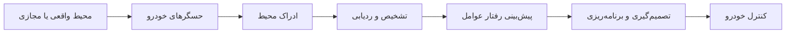
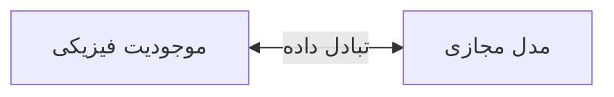
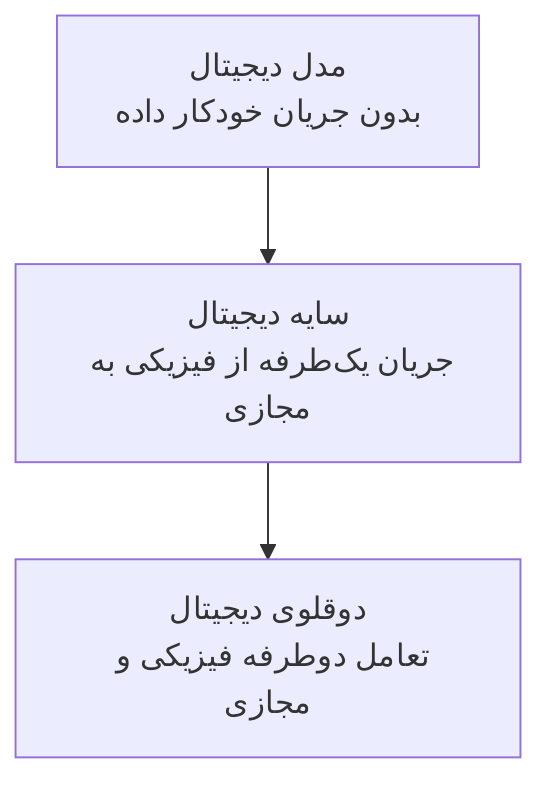
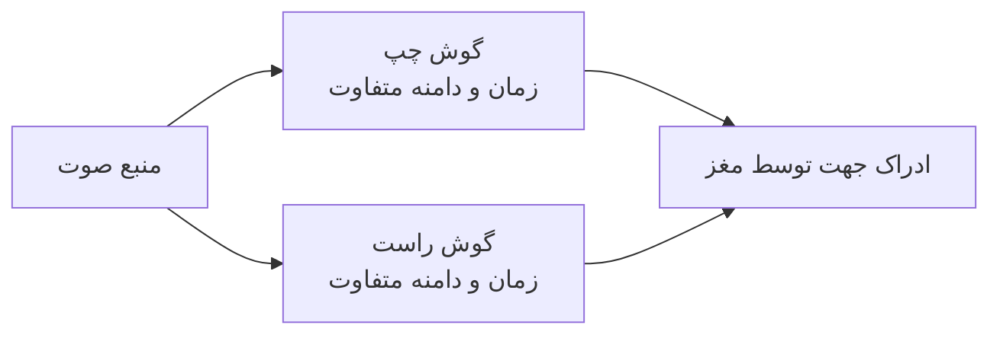
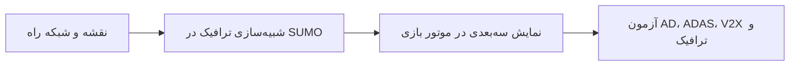
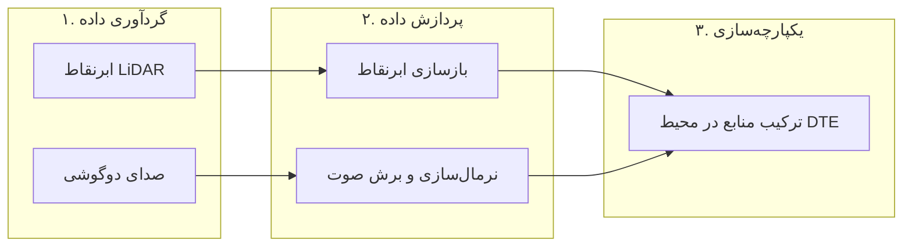
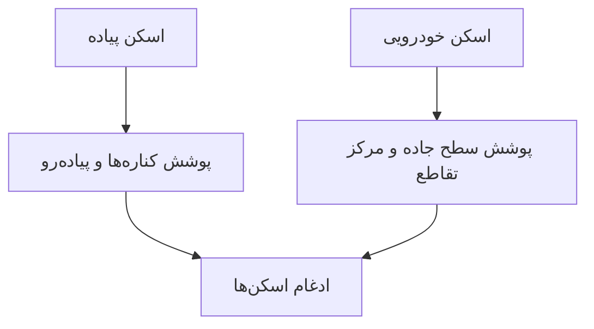
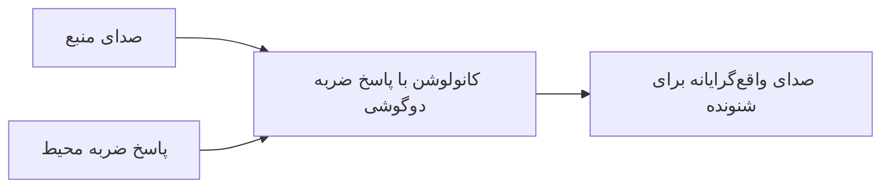
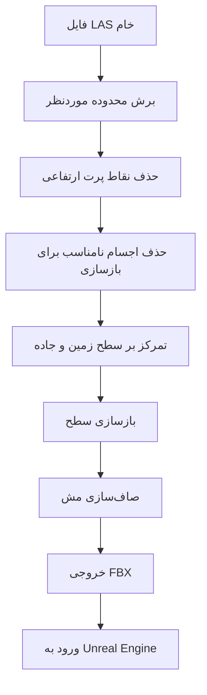
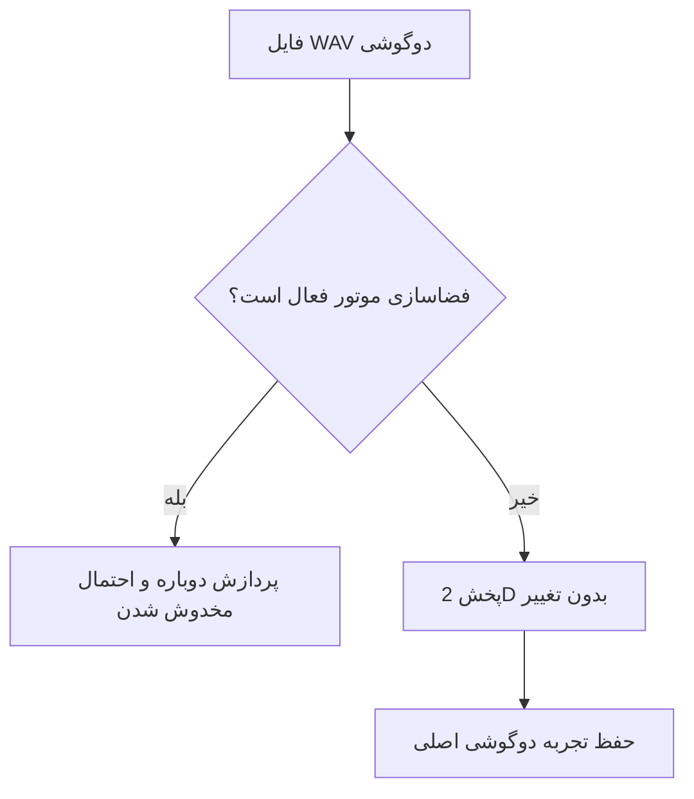

# به‌سوی محیط‌های دوقلوی دیجیتال چندوجهی برای کاربردهای خودرویی

> بازنویسی و معادل فارسیِ روان از مقاله  
> **Towards Multimodal Digital Twin Environments for Automotive Applications**  
> نویسندگان: Aleksi Vuorinen، Mikko Mäkitalo و Ella Peltonen  
> ارائه‌شده در کنفرانس **IoT 2025**  
> DOI: `10.1145/3770501.3770506`

---

## درباره این متن

این سند ترجمه تحت‌اللفظی نیست، بلکه **بازنویسی مفهومی، دقیق و ساختاریافته** مقاله به زبان فارسی است تا برای انتشار در GitHub، مطالعه پژوهشی و استفاده آموزشی مناسب باشد. ساختار اصلی مقاله حفظ شده و ایده‌ها، روش‌ها، تنظیمات آزمایش، محدودیت‌ها و مسیرهای آینده پوشش داده شده‌اند.

هر مطلبی که مستقیماً در مقاله بیان نشده و برای تکمیل بحث افزوده شده است، با برچسب زیر مشخص شده است:

> **نکته تکمیلی — افزوده‌شده توسط نگارنده**

نمودارهای این سند با Mermaid ترسیم شده‌اند و در GitHub قابل نمایش هستند.

---

## چکیده

با گسترش خودروهای برقی، خودران، متصل و نرم‌افزارمحور، استفاده از دوقلوهای دیجیتال در صنعت خودرو نیز با سرعت زیادی افزایش یافته است. بااین‌حال، تمرکز بخش بزرگی از پژوهش‌های موجود بر خود خودرو، باتری، سامانه‌های کنترلی یا فرایند تولید بوده و **محیطی که خودرو در آن حرکت می‌کند** کمتر به‌صورت یک موجودیت مستقل و پویا بررسی شده است.

محیط رانندگی صرفاً یک پس‌زمینه گرافیکی نیست. جاده، خط‌کشی، جدول، ساختمان‌ها، علائم، وضعیت آب‌وهوا، روشنایی، سروصدای شهری، عابران پیاده، وسایل نقلیه و ویژگی‌های سطح مسیر، همگی ورودی مستقیم یا غیرمستقیم حسگرها و سامانه‌های تصمیم‌گیری خودرو هستند. بنابراین، کیفیت مدل‌سازی محیط بر دقت ادراک، پیش‌بینی، ردیابی، برنامه‌ریزی مسیر و کنترل خودروهای خودران و سامانه‌های کمک‌راننده اثر می‌گذارد.

مقاله مفهوم **محیط دوقلوی دیجیتال** یا **Digital Twin Environment — DTE** را برای کاربردهای خودرویی بررسی می‌کند و یک چارچوب چندوجهی پیشنهاد می‌دهد که سه جنبه مهم از ادراک انسان را در بر می‌گیرد:

1. **ظاهر بصری و رنگ واقعی اشیا**؛
2. **هندسه و عمق سه‌بعدی محیط**؛
3. **چشم‌انداز صوتی و جهت‌مندی صداها**.

برای ساخت نمونه اولیه، از ابرنقاط LiDAR یک تقاطع واقعی شهری و ضبط صوت دوگوشی یا Binaural استفاده شده است. داده‌های LiDAR پس از پالایش و بازسازی به مدل مش سه‌بعدی تبدیل شده‌اند و صدای دوگوشی نیز به‌گونه‌ای در Unreal Engine وارد شده که جهت‌مندی طبیعی آن حفظ شود.

هدف اصلی مقاله، پایه‌گذاری روشی برای ایجاد محیط‌های مجازی معتبرتر، چندحسی‌تر و نزدیک‌تر به تجربه واقعی انسان است؛ محیط‌هایی که در آینده بتوانند برای آزمون خودروهای خودران، سامانه‌های ADAS، تحلیل رفتار انسان و ارزیابی ایمنی شهری به کار روند.

---

## کلیدواژه‌ها

دوقلوی دیجیتال، محیط دوقلوی دیجیتال، چندوجهی، LiDAR، ابرنقاط سه‌بعدی، صوت دوگوشی، دوقلوی آکوستیکی، شبیه‌سازی خودرو، خودرو خودران، ADAS، انسان در حلقه و Unreal Engine.

---

# ۱. مقدمه

پیشرفت سریع قابلیت‌های خودران، سامانه‌های کمک‌راننده و مؤلفه‌های نرم‌افزاری خودرو باعث شده است دوقلوهای دیجیتال در صنعت خودرو، به‌ویژه برای آزمون، اعتبارسنجی و صحه‌گذاری، اهمیت روزافزونی پیدا کنند.

با وجود پیشرفت مدل‌سازی خودرو، محیط مجازی مورد استفاده در شبیه‌سازی هنوز در بسیاری از موارد ساده، ایستا، ازپیش‌ساخته یا کم‌جزئیات است. این کمبود مهم است، زیرا محیط منبع اصلی داده برای حسگرهای خودرو محسوب می‌شود.

برای مثال، دوربین، LiDAR، رادار، حسگرهای فراصوت و الگوریتم‌های تشخیص صدا، همگی اطلاعات خود را از محیط پیرامون دریافت می‌کنند. در نتیجه، هر خطا یا ساده‌سازی بیش‌ازحد در محیط می‌تواند بر کل زنجیره تصمیم خودرو اثر بگذارد:

علاوه بر ورودی حسگرها، جنس سطح جاده، شیب، لغزندگی، بارندگی، نور و باد بر دینامیک خودرو نیز اثر می‌گذارند. بنابراین، محیط دوقلوی دیجیتال باید هم اطلاعات ادراکی و هم اطلاعات فیزیکی مؤثر بر خودرو را بازنمایی کند.

## ۱.۱. اهمیت محیط

برای تحلیل کامل یک سناریوی ترافیکی باید عناصر زیر در نظر گرفته شوند:

- هندسه دقیق جاده؛
- خط‌کشی‌ها، جدول و پیاده‌رو؛
- چراغ‌ها، علائم و تابلوها؛
- ساختمان‌ها و پوشش گیاهی؛
- عابران و وسایل نقلیه؛
- روشنایی و آب‌وهوا؛
- صدای موتور، ترمز، بوق و عبور خودرو؛
- نحوه ادراک راننده، سرنشین و عابر.

در صورت حضور انسان در حلقه شبیه‌سازی، اعتبار حسی محیط مهم‌تر می‌شود. انسان تنها از روی هندسه تصمیم نمی‌گیرد؛ رنگ، نور، فاصله، حرکت، شدت و جهت صدا نیز در واکنش او نقش دارند.

## ۱.۲. اهداف و دستاوردها

مقاله سه هدف اصلی دارد:

1. بررسی وضعیت محیط‌های دوقلوی دیجیتال در خودرو و حمل‌ونقل؛
2. ارائه معماری چندوجهی مبتنی بر LiDAR و صوت دوگوشی؛
3. ساخت نمونه اولیه یک تقاطع شهری و ادغام مدل و صدا در Unreal Engine.

سه وجه مورد توجه عبارت‌اند از:

| وجه | داده یا فناوری | هدف |
|---|---|---|
| ظاهر بصری | رنگ و اطلاعات محیط واقعی | بازنمایی ظاهر اشیا |
| عمق و هندسه | ابرنقاط LiDAR | بازسازی شکل و ابعاد محیط |
| صدا | ضبط دوگوشی | بازنمایی نحوه شنیدن انسان |

دستاوردهای اصلی مقاله شامل مرور روش‌های ساخت DTE، معرفی کاربردهای آن، پیشنهاد معماری و ساخت نمونه اولیه است. نویسندگان همچنین افزودن صدای محیطی دوگوشی را یکی از نوآوری‌های کار خود می‌دانند.

---

# ۲. از دوقلوی دیجیتال تا محیط دوقلوی دیجیتال

## ۲.۱. تعریف دوقلوی دیجیتال

دوقلوی دیجیتال را می‌توان یک مدل نرم‌افزاری وابسته به زمینه از یک موجودیت واقعی دانست. این مدل فقط شکل ظاهری شیء را نمایش نمی‌دهد، بلکه می‌کوشد رفتار، وضعیت و تعاملات آن را با استفاده از داده‌های واقعی بازنمایی کند.

سه مؤلفه کلاسیک دوقلوی دیجیتال عبارت‌اند از:

1. فضای فیزیکی؛
2. فضای مجازی؛
3. جریان داده میان این دو فضا.

دوقلوهای دیجیتال ممکن است از یک سلول باتری تا خودرو، ناوگان یا محیط شهری را پوشش دهند. یک خودرو کامل نیز می‌تواند از چند دوقلوی دیجیتال زیرسامانه تشکیل شود.

### دوقلوی غیرفعال

- وضعیت موجودیت فیزیکی را منعکس می‌کند؛
- عمدتاً برای پایش و نمایش استفاده می‌شود؛
- الزاماً توان اعمال فرمان یا آزمون سناریو ندارد.

### دوقلوی فعال

- علاوه بر بازنمایی، قابلیت شبیه‌سازی و کنترل دارد؛
- می‌تواند سناریوهای مختلف را اجرا کند؛
- ممکن است نتیجه تحلیل را به سامانه فیزیکی بازگرداند.

## ۲.۲. تفاوت شبیه‌سازی و دوقلوی دیجیتال

شبیه‌سازی به ایجاد مصنوعی مجموعه‌ای از شرایط برای مطالعه یک پدیده اشاره دارد و می‌تواند کاملاً فرضی باشد. در مقابل، دوقلوی دیجیتال به یک موجودیت واقعی مشخص وابسته است و معمولاً از جریان داده واقعی استفاده می‌کند.

| ویژگی | شبیه‌سازی | دوقلوی دیجیتال |
|---|---|---|
| وابستگی به نمونه واقعی مشخص | ضروری نیست | معمولاً ضروری است |
| دریافت داده واقعی | اختیاری | جزء اصلی مفهوم |
| به‌روزرسانی وضعیت | ممکن است دستی باشد | داده‌محور |
| بازخورد به موجودیت واقعی | معمولاً ندارد | در حالت کامل ممکن است |
| هدف | بررسی شرایط فرضی | بازنمایی و تحلیل موجودیت واقعی |

یک محیط شبیه‌سازی می‌تواند شامل چند دوقلوی دیجیتال باشد، اما هر شبیه‌سازی لزوماً دوقلوی دیجیتال نیست.

## ۲.۳. مدل دیجیتال، سایه دیجیتال و دوقلوی دیجیتال

| سطح | جریان داده | توضیح |
|---|---|---|
| مدل دیجیتال | ندارد | نسخه مجازی مستقل از موجودیت واقعی |
| سایه دیجیتال | یک‌طرفه | داده از جهان واقعی وارد مدل می‌شود |
| دوقلوی دیجیتال | دوطرفه | مدل و موجودیت واقعی بر یکدیگر اثر می‌گذارند |

## ۲.۴. محیط دوقلوی دیجیتال

محیط دوقلوی دیجیتال صرفاً یک مدل سه‌بعدی زیبا از شهر نیست. یک DTE کامل باید بتواند تغییرات محیط را با داده واقعی بازتاب دهد، از جمله:

- وضعیت جاده؛
- آب‌وهوا و روشنایی؛
- تراکم ترافیک؛
- صدای محیط؛
- ساخت‌وساز یا تغییر زیرساخت؛
- حضور عابر و وسیله نقلیه؛
- رویدادهای خطرناک.

محیط می‌تواند نتیجه عملکرد خودروها را نیز دریافت کند. برای مثال، اگر چند خودرو در یک تقاطع به‌طور مکرر ترمز اضطراری داشته باشند، DTE می‌تواند آن محل را به‌عنوان نقطه پرخطر شناسایی کند.

> **نکته تکمیلی — افزوده‌شده توسط نگارنده:**  
> DTE را می‌توان «بافت عملیاتی مشترک» میان چند دوقلوی دیجیتال دانست؛ خودرو، چراغ، جاده، عابر و سامانه مدیریت ترافیک می‌توانند دوقلوهای جداگانه‌ای باشند که در یک محیط مشترک تعامل می‌کنند.

---

# ۲.۵. دوقلوهای دیجیتال و LiDAR

LiDAR با ارسال پالس‌های لیزری و اندازه‌گیری زمان رفت‌وبرگشت آن‌ها، فاصله تا سطح را محاسبه می‌کند:

\[
d = \frac{c \times \Delta t}{2}
\]

خروجی اسکن سه‌بعدی، ابرنقاطی شامل مختصات \(X\)، \(Y\)، \(Z\)، شدت بازتاب، رنگ یا سایر ویژگی‌ها است.

ابرنقاط می‌توانند ایستا یا پویا باشند. برای نقشه‌برداری و مدل‌سازی محیط، LiDAR با وضوح بالا و نرخ برداشت پایین‌تر معمولاً مناسب‌تر از حسگرهای تشخیص بلادرنگ خودرو است.

کاربردهای LiDAR در ساخت مدل‌های پایه دوقلوی دیجیتال عبارت‌اند از:

- مدل شهر؛
- بازسازی جنگل؛
- محوطه باستان‌شناسی؛
- زیرساخت و ساختمان؛
- محیط آزمون خودرو؛
- ترکیب با دوربین و فتوگرامتری.

> **نکته تکمیلی — افزوده‌شده توسط نگارنده:**  
> LiDAR هندسه را خوب ثبت می‌کند، اما برای ظاهر واقعی بهتر است با تصویر یا فتوگرامتری ترکیب شود؛ LiDAR برای شکل و ابعاد، و تصویر برای رنگ و بافت.

---

# ۲.۶. دوقلوی آکوستیکی و صدای دوگوشی

دوقلوی آکوستیکی دیجیتال مدلی است که رفتار و انتشار صدا را در محیط بازنمایی یا شبیه‌سازی می‌کند. از آن می‌توان برای بررسی اثر موانع، مصالح، ترافیک و تغییرات محیط بر صدا استفاده کرد.

جهت صدا برای انسان بسیار مهم است. شنونده باید تشخیص دهد خودروی نزدیک‌شونده از کدام سمت می‌آید. ضبط دوگوشی با دو میکروفون در محل گوش‌های یک سر مصنوعی، اختلاف زمانی و دامنه‌ای میان گوش چپ و راست را ثبت می‌کند.

میکروفون Neumann KU 100 مورد استفاده مقاله، شکل و ساختار سر انسان را تقلید می‌کند. نتیجه با هدفون باکیفیت طبیعی‌تر شنیده می‌شود.

---

# ۳. محیط‌های دوقلوی دیجیتال در صنعت خودرو

صنعت خودرو یکی از پذیرندگان اصلی دوقلوی دیجیتال است. افزایش واحدهای الکترونیکی، حسگرها، نرم‌افزارها و قابلیت‌های متصل، خودرو را به سامانه‌ای پیچیده تبدیل کرده است.

کاربردها را می‌توان در دو گروه قرار داد:

### تولید و چرخه عمر

- مدل‌سازی خط تولید؛
- بهینه‌سازی مونتاژ؛
- کاهش توقف؛
- نگهداری پیش‌بینانه؛
- تحلیل کیفیت.

### طراحی و آزمون خودرو

- آزمون زیرسامانه‌ها پیش از تولید؛
- آزمون خودرو کامل در محیط مجازی؛
- ارزیابی AD و ADAS؛
- اجرای سناریوهای خطرناک؛
- تحلیل تعامل انسان و خودرو.

با وجود محیط‌های تصویری فراوان، تعداد محیط‌هایی که با داده واقعی و به‌صورت پویا به‌روزرسانی می‌شوند محدود است. مدل‌های شهر هوشمند معمولاً اطلاعات سطح‌بالایی مانند جریان ترافیک، حمل‌ونقل عمومی و وضعیت محیطی ارائه می‌کنند، اما الزاماً یک محیط سه‌بعدی با وفاداری بالا برای آزمون خودرو نیستند.

## ۳.۱. موتورهای بازی و شبیه‌سازها

پلتفرم‌های رایج شامل Unity، Unreal Engine، CARLA، AirSim و LGSVL هستند. موتورهای بازی رندر سه‌بعدی، نور، آب‌وهوا، فیزیک، اسکریپت‌نویسی و تعامل بلادرنگ را فراهم می‌کنند.

## ۳.۲. ترکیب SUMO و موتور سه‌بعدی

SUMO می‌تواند شبکه ترافیک را با استفاده از مختصات واقعی و داده OpenStreetMap تولید کند و سپس همان شبکه در Unity یا Unreal به محیط سه‌بعدی تبدیل شود.

ترکیب چند منبع نقشه نیز ممکن است لازم باشد، زیرا یک منبع شبکه جاده دقیق‌تری دارد و منبع دیگر اطلاعات ساختمان یا علائم بیشتری ارائه می‌کند.

> **نکته تکمیلی — افزوده‌شده توسط نگارنده:**  
> بهتر است برای هر شیء، منبع داده و تاریخ اعتبار آن ذخیره شود تا ترکیب نقشه‌های مختلف باعث ناسازگاری مکانی یا استفاده از اطلاعات قدیمی نشود.

## ۳.۳. جمع‌بندی کاربردها و نیازمندی‌ها

| کاربرد | نیاز به به‌روزرسانی | دقت موردنیاز |
|---|---:|---:|
| مدل تولید | دوره‌ای یا نزدیک بلادرنگ | بالا |
| آزمون ADAS | هم‌زمان با سناریو | بالا در هندسه و علائم |
| آزمون خودران | نزدیک بلادرنگ | بسیار بالا |
| شبیه‌سازی ترافیک | ثانیه‌ای تا دقیقه‌ای | متوسط تا بالا |
| انسان در حلقه | بلادرنگ | بالا در تصویر، صدا و پاسخ |
| شهر هوشمند | دقیقه‌ای تا ساعتی | متناسب با هدف |
| آلودگی صوتی | دوره‌ای یا رویدادمحور | بالا در طیف و مکان |
| تحلیل تقاطع خطرناک | پیوسته و رویدادمحور | بالا |

> **نکته تکمیلی — افزوده‌شده توسط نگارنده:**  
> لازم نیست همه اجزای DTE با نرخ یکسان به‌روزرسانی شوند. ساختمان ممکن است ماهانه، آب‌وهوا دقیقه‌ای و خودروها ده‌ها بار در ثانیه به‌روزرسانی شوند.

---

# ۴. نیازمندی‌های چارچوب DTE چندوجهی

مقاله با رویکرد علم طراحی، یک چارچوب نظری برای ساخت محیط دوقلوی دیجیتال مبتنی بر LiDAR و صوت دوگوشی ارائه می‌دهد. معماری سطح‌بالا سه مرحله دارد:

این معماری بازآفرینی مفهومی نمودار اصلی مقاله در صفحه ۴ است. در آن، داده حسگر از دو مسیر هندسی و صوتی وارد می‌شود، هر مسیر پردازش تخصصی خود را طی می‌کند و در پایان در یک محیط مشترک ادغام می‌شود.

---

# ۴.۱. مدل محیط

## ۴.۱.۱. ساختار داده ابرنقاط

ابرنقاط شامل دو گروه داده است:

### داده هندسی

- مختصات سه‌بعدی؛
- دستگاه مختصات کارتزین؛
- مقادیر معمولاً اعشاری.

### داده ویژگی

- شدت بازتاب؛
- رنگ؛
- بردار نرمال؛
- سایر ویژگی‌های سنجش.

ابرنقاط پویا در هر فریم تغییر می‌کنند، اما برای مدل‌سازی ثابت یک محیط شهری، ابرنقاط ایستا مناسب‌تر است.

## ۴.۱.۲. وضوح و کیفیت

تعیین یک عدد ثابت برای «وضوح کافی» دشوار است، زیرا نتیجه نهایی به عوامل زیر وابسته است:

- نوع LiDAR؛
- الگوریتم بازسازی؛
- فاصله تا سطح؛
- بازتابندگی ماده؛
- تراکم نقاط؛
- هم‌پوشانی اسکن‌ها؛
- نویز؛
- نیاز کاربرد.

بااین‌حال، وضوح باید برای ثبت موارد زیر کافی باشد:

- خط‌کشی مسیر؛
- علائم راهنمایی؛
- جدول و لبه پیاده‌رو؛
- هندسه تقاطع؛
- اختلاف ارتفاع و شیب؛
- شکل سطح جاده.

## ۴.۱.۳. پوشش فضایی

محیط باید با بیشترین پوشش و کمترین ناحیه کور اسکن شود.

در یک تقاطع:

- اسکن پیاده ممکن است مرکز جاده را ناقص ثبت کند؛
- اسکن خودرویی ممکن است بخش‌هایی از پیاده‌رو را از دست بدهد؛
- بهترین نتیجه با چند مسیر مکمل حاصل می‌شود.

## ۴.۱.۴. عوامل ایجاد نویز

مهم‌ترین عوامل کاهش کیفیت اسکن:

- خودروهای متحرک؛
- عابران؛
- حرکت شاخه و برگ؛
- وزش باد؛
- باران؛
- رطوبت؛
- بازتاب نامطلوب؛
- سطوح براق؛
- خطای ثبت مسیر.

هرچه تعداد اجسام متحرک کمتر باشد، ابرنقاط پاک‌تر است. باران می‌تواند باعث بازتاب پالس از قطرات شود. رطوبت نیز ممکن است نقاط غیرواقعی زیر سطح زمین ایجاد کند که معمولاً با برش حذف می‌شوند.

## ۴.۱.۵. تبدیل ابرنقاط به مش

ابرنقاط به‌تنهایی همیشه برای شبیه‌سازی مناسب نیستند. بسیاری از موتورهای بازی به مش پیوسته نیاز دارند.

### روش اول: مدل‌سازی دستی

ابزارهای ممکن:

- Blender؛
- MATLAB RoadRunner؛
- نرم‌افزارهای CAD و مدل‌سازی سه‌بعدی.

مزایا:

- کنترل زیاد؛
- اصلاح دقیق؛
- مناسب برای علائم و سازه‌های مهم.

معایب:

- زمان‌بر؛
- نیازمند متخصص؛
- دشوار در مقیاس بزرگ.

### روش دوم: بازسازی سطح خودکار

مزایا:

- سریع‌تر؛
- مناسب برای زمین و سطوح گسترده؛
- کاهش کار دستی.

معایب:

- احتمال از دست رفتن جزئیات؛
- ایجاد حفره یا سطح ناصاف؛
- نمایش ضعیف اجسام باریک مانند تابلو و تیر.

### راهکار پیشنهادی: روش ترکیبی

- بازسازی خودکار سطح جاده و زمین؛
- اصلاح دستی بخش‌های مهم؛
- افزودن علائم، درختان و چراغ‌ها به‌صورت دارایی مجزا؛
- استفاده از ابرنقاط به‌عنوان مرجع صحت هندسی.

> **نکته تکمیلی — افزوده‌شده توسط نگارنده:**  
> در محیط‌های بزرگ، استفاده از LOD ضروری است. مدل نزدیک خودرو باید دقیق باشد، اما اشیای دور می‌توانند مش ساده‌تری داشته باشند تا نرخ فریم حفظ شود.

---

# ۴.۲. مدل صوتی

## ۴.۲.۱. محدوده شنوایی و نرخ نمونه‌برداری

محدوده تقریبی شنوایی انسان:

\[
20\ \text{Hz} \leq f \leq 20\,000\ \text{Hz}
\]

طبق قضیه نایکوئیست:

\[
f_s \geq 2 f_{\max}
\]

بنابراین نرخ 44.1 کیلوهرتز برای پوشش شنوایی انسان کافی است. برای تحلیل فراصوت یا پاسخ دقیق‌تر محیط، نرخ بالاتر و میکروفون مناسب لازم است.

## ۴.۲.۲. هم‌پوشانی طیفی یا Aliasing

اگر مؤلفه‌های بالاتر از نصف نرخ نمونه‌برداری وارد سامانه شوند، ممکن است در فرکانس‌های پایین‌تر ظاهر شوند و سیگنال را تحریف کنند. واسط‌های صوتی برای جلوگیری از این مسئله از فیلتر پایین‌گذر استفاده می‌کنند.

> **نکته تکمیلی — افزوده‌شده توسط نگارنده:**  
> نرخ نمونه‌برداری بالاتر همیشه بهتر نیست؛ زیرا بار پردازشی، پهنای باند و فضای ذخیره‌سازی را افزایش می‌دهد. نرخ باید متناسب با هدف انتخاب شود.

## ۴.۲.۳. عمق بیت

عمق بیت تعداد سطوح ممکن برای نمایش دامنه هر نمونه را تعیین می‌کند.

- 16 بیت برای شنونده انسانی معمولاً کافی است؛
- 24 بیت دامنه دینامیکی و حاشیه امن بیشتری دارد؛
- عمق بیشتر، حجم داده را افزایش می‌دهد.

## ۴.۲.۴. بهره و نسبت سیگنال به نویز

در هنگام ضبط:

- سیگنال باید کافی تقویت شود؛
- بهره کم، سهم نویز را افزایش می‌دهد؛
- بهره زیاد، کلیپ و اعوجاج ایجاد می‌کند؛
- بلندترین صدای محتمل نباید از ظرفیت سیستم عبور کند.

سطح نویز را می‌توان با RMS اندازه گرفت. برای ادراک انسانی نیز واحدهای phon و sone مطرح‌اند.

## ۴.۲.۵. تأثیر آب‌وهوا

باد و باران کیفیت ضبط را کاهش می‌دهند. باد مستقیماً به کپسول برخورد کرده و نویز فرکانس پایین ایجاد می‌کند. بادگیر لازم است، اما در باد شدید ممکن است کافی نباشد.

## ۴.۲.۶. روش‌های ساخت چشم‌انداز صوتی دوگوشی

### روش اول: تبدیل استریوی معمولی به دوگوشی

- ساده و کم‌هزینه؛
- اما الزاماً متناظر با محیط واقعی نیست.

### روش دوم: مدل آکوستیکی فیزیک‌مبنا

باید ضریب جذب مصالح، شکل سطوح، بازتاب، پراش، فاصله منبع و شنونده و شرایط محیط مدل شوند. این روش دقیق اما پرهزینه است.

### روش سوم: پاسخ ضربه و کانولوشن

پاسخ ضربه محیط ثبت می‌شود و صدای منابع جدید با آن کانولوشن می‌شود. مقاله این راه را برای ادامه کار ترجیح می‌دهد.

---

# ۵. نمونه اولیه و نتایج آزمایش

مقاله یک نمونه اولیه کوچک از یک تقاطع شهری می‌سازد تا امکان ادغام داده‌های واقعی چندوجهی را نشان دهد. این نمونه اثبات مفهوم معماری است و هنوز سامانه کامل و زنده شهری نیست.

## ۵.۱. گردآوری داده

### ۵.۱.۱. انتخاب محل

محل آزمایش یک تقاطع چندخطه دارای گذرگاه عابر، در حاشیه مرکز شهر بود.

دلایل انتخاب:

- امکان اسکن کم‌نویز در ساعات خلوت؛
- وجود منابع صوتی متنوع در ساعات شلوغ؛
- حضور خودروهای سواری، کامیون، اتوبوس و عابر؛
- قرار داشتن در محدوده‌ای که پژوهشگران قصد توسعه مدل آن را داشتند.

### ۵.۱.۲. مدل محیط

دستگاه مورد استفاده:

**GeoSLAM ZEB Horizon**

| مشخصه | مقدار |
|---|---:|
| برد بیشینه در شرایط مطلوب | 100 متر |
| نرخ ثبت نقطه | 300,000 نقطه بر ثانیه |
| دقت اعلام‌شده | 6 میلی‌متر |
| روش حمل | دستی |
| زمان اسکن | 4 دقیقه و 37 ثانیه |
| تعداد نقاط | 29,564,843 |
| حجم فایل | 591 مگابایت |
| قالب خروجی | LAS |

به دلیل نبود پایه نصب روی خودرو، اسکن پیاده انجام شد. در نتیجه بخش‌هایی از مرکز تقاطع ناقص ثبت شدند. تصویر ابرنقاط در صفحه ۶ مقاله نیز این خلأ را در میانه سطح جاده نشان می‌دهد.

مقاله توصیه می‌کند:

- LiDAR روی خودرو نصب شود؛
- سطح جاده از فاصله نزدیک ثبت شود؛
- اسکن پیاده برای مناطق غیرقابل‌دسترسی خودرو انجام شود؛
- چند مسیر اسکن ترکیب شوند.

### ۵.۱.۳. داده صوتی

تجهیزات:

- Neumann KU 100؛
- Scarlett 4i4 نسل سوم؛
- MacBook؛
- Ableton Live 12.

| مشخصه | مقدار |
|---|---:|
| نرخ نمونه‌برداری | 48,000 هرتز |
| عمق بیت | 24 بیت |
| مدت ضبط | 20 دقیقه |
| زمان شروع | 17:45 |
| زمان انجام | مه 2025 |
| ارتفاع میکروفون | حدود 1.5 متر |
| فاصله از تقاطع | حدود 8 متر |
| جهت | رو به مرکز تقاطع |
| دما | حدود 21 درجه |
| هوا | صاف و آفتابی |
| باد | نسبتاً شدید از جنوب شرقی |

میکروفون در پارکی باز در شمال‌غربی تقاطع قرار گرفت و مانع مستقیمی میان آن و تقاطع نبود. باد از جهت روبه‌روی میکروفون می‌وزید و ضبط را دشوار کرد. بادگیر استفاده شد و بهره به‌گونه‌ای تنظیم شد که هم سیگنال کافی باشد و هم بلندترین صداها اعوجاج پیدا نکنند.

---

# ۵.۲. پردازش داده

## ۵.۲.۱. پردازش محیط

نرم‌افزار مورد استفاده:

**Agisoft Metashape**

مراحل اصلی:

1. انتخاب محدوده از نمای بالا؛
2. حذف نقاط خارج از ناحیه؛
3. حذف نقاط پرت در محور ارتفاع؛
4. حذف نویز ناشی از حرکت و رطوبت؛
5. کنار گذاشتن درخت، تابلو و پایه‌هایی که خوب ثبت نشده‌اند؛
6. بازسازی سطح زمین و جاده؛
7. صاف‌سازی؛
8. خروجی FBX.

نویسندگان ترجیح دادند اشیای جانبی با دارایی‌های آماده RoadRunner یا موتور بازی اضافه شوند.

## ۵.۲.۲. پردازش صوت

Unreal Engine از WAV استریو پشتیبانی می‌کند، بنابراین تبدیل قالب لازم نبود.

پردازش‌های مفید:

- حذف بخش اضافی ابتدا و انتها؛
- نرمال‌سازی دامنه؛
- کنترل کلیپ؛
- بررسی توازن چپ و راست؛
- حفظ اطلاعات فاز.

> **نکته تکمیلی — افزوده‌شده توسط نگارنده:**  
> بهتر است سطح SPL مرجع نیز ثبت شود تا صدای پخش‌شده از نظر فشار صوتی کالیبره باشد، نه اینکه فقط از نظر شنیداری بلند به نظر برسد.

---

# ۵.۳. یکپارچه‌سازی داده

## ۵.۳.۱. مدل سه‌بعدی

فایل FBX پس از ورود به Unreal Engine مانند یک مش عادی استفاده می‌شود. در توسعه کامل‌تر، تنظیم مقیاس، مبدأ مختصات، Collision، ماده سطح، نرمال‌ها و LOD نیز ضروری است.

## ۵.۳.۲. صدای دوگوشی

فایل از قبل اطلاعات جهت دارد. اگر موتور بازی دوباره فضاسازی انجام دهد، جهت‌مندی طبیعی مخدوش می‌شود.

باید موارد زیر غیرفعال شوند:

- Spatialization؛
- Attenuation؛
- HRTF Processing؛
- هر تبدیل مجدد به صدای سه‌بعدی.

فایل باید با حالت **2D Sound** پخش شود:

برای فایل‌های طولانی، Streaming توصیه می‌شود تا کل فایل یک‌باره در حافظه بارگذاری نشود.

---

# ۶. بحث

## ۶.۱. دشواری ساخت نسخه معتبر

ساخت نسخه مجازی محیط واقعی دشوار است و با افزایش وفاداری، پیچیدگی بیشتر می‌شود. مشکلات اصلی:

- ثبت کامل محیط؛
- اجسام متحرک؛
- بازسازی سطح؛
- مدل‌سازی اجسام باریک؛
- همگام‌سازی وجوه؛
- حفظ عملکرد بلادرنگ؛
- تعریف معیار صحت.

بسیاری از مقالات جزئیات ساخت محیط را توضیح نمی‌دهند، زیرا تمرکز آن‌ها بر خودرو یا الگوریتم است. این مقاله فرایند ساخت محیط را موضوع اصلی قرار می‌دهد.

## ۶.۲. محدودیت اسکن

نبود پایه خودرویی باعث شد مرکز تقاطع ناقص ثبت شود. بااین‌حال، بخش‌های ثبت‌شده از نظر هندسه دقیق به نظر می‌رسیدند. برای تأیید، مدل باید در سناریوی شبیه‌سازی خودرو آزمایش شود.

## ۶.۳. ارزیابی وفاداری

مقاله پیشنهاد می‌کند ابرنقاط پالایش‌شده به‌عنوان مرجع حقیقت زمینی استفاده شوند و مش با آن مقایسه شود. روش مطلوب:

- بازسازی خودکار سطح جاده؛
- مدل‌سازی خارجی علائم و سازه‌ها؛
- مقایسه مش با ابرنقاط؛
- آزمون در شبیه‌ساز خودرو.

## ۶.۴. شرایط برداشت

برای LiDAR و صوت، هوای صاف و آرام مطلوب‌تر است. نویسندگان اشاره می‌کنند که چون مش و نمونه صوتی پایه معمولاً یک‌بار ثبت می‌شوند، پس از برداشت موفق نیاز به تکرار دائمی نیست؛ مگر آنکه هدف، به‌روزرسانی زنده DTE باشد.

## ۶.۵. داده نقشه به‌عنوان جایگزین

اگر برداشت میدانی ممکن نباشد، داده نقشه قابل استفاده است؛ اما جزئیات، تازگی، ارتفاع، شکل دقیق، بافت و صدای واقعی ممکن است کافی نباشد.

## ۶.۶. مسیر آینده

نویسندگان قصد دارند:

- محدوده شهری بزرگ‌تری بسازند؛
- DTE را در شبیه‌سازی خودرو به کار گیرند؛
- روش گام‌به‌گام کامل ارائه دهند؛
- LiDAR را با CARLA و ابزارهای MATLAB ترکیب کنند؛
- چشم‌انداز صوتی را با کانولوشن پیاده‌سازی کنند؛
- تجربه صوتی‌ـ‌تصویری نزدیک‌تر به واقعیت بسازند.

---

# ۷. نتیجه‌گیری

مقاله وضعیت محیط‌های دوقلوی دیجیتال برای کاربردهای خودرویی را بررسی و معماری ساخت DTE چندوجهی با وفاداری بالا را پیشنهاد می‌کند.

چارچوب شامل سه مرحله است:

1. گردآوری داده واقعی؛
2. پردازش جداگانه وجوه هندسی و صوتی؛
3. یکپارچه‌سازی در محیط مشترک.

نمونه اولیه نشان می‌دهد که می‌توان:

- یک تقاطع واقعی را با LiDAR ثبت کرد؛
- ابرنقاط را به مدل مش تبدیل کرد؛
- صدای ترافیک را به‌صورت دوگوشی ضبط کرد؛
- مدل و صوت را در Unreal Engine ادغام کرد.

این کار پایه‌ای برای محیط‌هایی است که علاوه بر ظاهر هندسی، تجربه شنیداری انسان را نیز بازنمایی می‌کنند. چنین محیط‌هایی می‌توانند برای آزمون خودران، ADAS، تعامل انسان و خودرو، تحلیل ایمنی شهری و ارزیابی آلودگی صوتی استفاده شوند.

---

# ۸. تحلیل انتقادی و نکات تکمیلی

> تمام مطالب این بخش **افزوده‌شده توسط نگارنده** است و مستقیماً از متن مقاله نقل نشده است.

## ۸.۱. آیا نمونه اولیه یک دوقلوی دیجیتال کامل است؟

نمونه فعلی بیشتر بر «لایه بازنمایی محیط» تمرکز دارد:

- مش محیط ایستا است؛
- صوت از پیش ضبط شده است؛
- به‌روزرسانی زنده نشان داده نشده؛
- بازخورد دوطرفه پیاده‌سازی نشده است.

بنابراین، در طبقه‌بندی سخت‌گیرانه، نمونه فعلی به یک **مدل دیجیتال چندوجهی** یا پایه یک **سایه دیجیتال** نزدیک‌تر است. برای تبدیل شدن به دوقلوی کامل باید جریان داده زنده، همگام‌سازی و بازخورد اضافه شود.

## ۸.۲. همگام‌سازی زمانی

LiDAR و صوت در زمان‌های متفاوت ثبت شده‌اند. برای سناریوی واقعی‌تر باید:

- ساعت حسگرها همگام شود؛
- حرکت خودرو با صدای همان خودرو منطبق باشد؛
- رویدادهای صوتی و تصویری محور زمانی مشترک داشته باشند؛
- تأخیر هر جریان داده اندازه‌گیری شود.

## ۸.۳. هم‌ترازی مکانی صدا و هندسه

صدای دوگوشی از یک نقطه ثابت و جهت مشخص ثبت شده است. اگر کاربر در محیط مجازی حرکت کند، آن صدا لزوماً با موقعیت جدید سازگار نیست.

راهکارهای ممکن:

- ثبت چند نقطه شنیداری؛
- Ambisonics؛
- آرایه میکروفونی؛
- ثبت پاسخ ضربه در نقاط متعدد؛
- شبیه‌سازی انتشار صدا با هندسه محیط.

## ۸.۴. نرخ به‌روزرسانی چندلایه

| لایه | نرخ نمونه پیشنهادی |
|---|---|
| ساختمان و زیرساخت ثابت | روزانه تا ماهانه |
| کارگاه و تغییر موقت جاده | ساعتی تا روزانه |
| آب‌وهوا | دقیقه‌ای |
| چراغ راهنمایی | زیرثانیه تا ثانیه |
| خودرو و عابر | ده‌ها بار در ثانیه |
| صوت محیط | پیوسته |
| رخداد ایمنی | رویدادمحور |

معماری چندنرخی از بار غیرضروری جلوگیری می‌کند.

## ۸.۵. معیارهای ارزیابی ضروری

### هندسه

- خطای فاصله نقطه تا مش؛
- Hausdorff Distance؛
- RMSE مختصات؛
- کامل‌بودن پوشش؛
- صحت عرض خط؛
- صحت شیب و ارتفاع.

### صوت

- SNR؛
- خطای پاسخ فرکانسی؛
- شباهت مکانی ادراک‌شده؛
- اختلاف ITD و ILD؛
- ارزیابی شنیداری انسانی؛
- خطای سطح فشار صوت.

### شبیه‌سازی خودرو

- مقایسه عملکرد ادراک در محیط مجازی و واقعی؛
- شکاف انتقال از شبیه‌سازی به واقعیت؛
- خطای تشخیص خط و تابلو؛
- پاسخ کنترل خودرو؛
- نرخ رخدادهای ایمنی.

## ۸.۶. مقیاس‌پذیری

در نمونه مقاله، کمتر از پنج دقیقه اسکن حدود 591 مگابایت داده تولید کرده است. برای شهر کامل باید از موارد زیر استفاده شود:

- قطعه‌بندی مکانی؛
- فشرده‌سازی؛
- LOD؛
- بارگذاری جریانی؛
- حذف نقاط تکراری؛
- ذخیره‌سازی ابری؛
- کش محلی؛
- پردازش لبه.

## ۸.۷. معماری توسعه‌یافته پیشنهادی

## ۸.۸. وجوه تکمیلی

چارچوب مقاله بر دید، عمق و صوت تمرکز دارد. برای DTE کامل‌تر می‌توان افزود:

- اصطکاک سطح؛
- دمای جاده؛
- رطوبت؛
- نور و خیرگی؛
- بارش، مه و باد؛
- ارتعاش؛
- کیفیت هوا؛
- میدان ارتباطی V2X؛
- پوشش شبکه مخابراتی؛
- نقشه معنایی؛
- رفتار احتمالی انسان.

## ۸.۹. کاربرد ویژه خودروهای برقی

خودروهای برقی در سرعت پایین صدای کمتری دارند. DAT می‌تواند بررسی کند:

- آیا عابر خودرو را به‌موقع می‌شنود؟
- صدای هشدار AVAS چه ویژگی‌ای داشته باشد؟
- موانع شهری چگونه صدا را مسدود می‌کنند؟
- کدام تقاطع برای افراد کم‌بینا خطرناک‌تر است؟
- نویز مصنوعی خودرو چه اثری بر آسایش شهری دارد؟

## ۸.۱۰. حریم خصوصی و اخلاق

ثبت صوت و تصویر شهری ممکن است اطلاعات افراد را ضبط کند. پروژه عملی باید:

- چهره و پلاک را ناشناس‌سازی کند؛
- گفت‌وگوهای قابل‌شناسایی را حذف کند؛
- قوانین محلی را رعایت کند؛
- دسترسی به داده خام را محدود کند؛
- هدف و دوره نگهداری داده را مشخص کند.

---

# ۹. راهنمای عملی ساخت نمونه مشابه

> این بخش نیز **افزوده‌شده توسط نگارنده** است.

## گام ۱: تعریف سناریو

- هدف را مشخص کنید؛
- تعیین کنید محیط برای ADAS، خودران، HIL یا صوت ساخته می‌شود؛
- سطح دقت لازم را تعریف کنید؛
- محدوده مکانی را محدود کنید.

## گام ۲: طراحی برداشت داده

- مسیر LiDAR را برنامه‌ریزی کنید؛
- نقاط کور را شناسایی کنید؛
- محل میکروفون را تعیین کنید؛
- زمان خلوت برای LiDAR و زمان مناسب برای صوت انتخاب کنید؛
- وضعیت آب‌وهوا را ثبت کنید؛
- سیستم مختصات و زمان مشترک تعریف کنید.

## گام ۳: برداشت LiDAR

- دستگاه را کالیبره کنید؛
- مسیر دارای هم‌پوشانی طی کنید؛
- سرعت حرکت را ثابت نگه دارید؛
- از خودرو و اسکن پیاده به‌صورت مکمل استفاده کنید؛
- داده را در LAS یا LAZ ذخیره کنید.

## گام ۴: برداشت صوت

- میکروفون را در ارتفاع گوش قرار دهید؛
- جهت آن را ثبت کنید؛
- بهره را با بلندترین رویداد تنظیم کنید؛
- از بادگیر استفاده کنید؛
- چند دقیقه صدای مرجع ثبت کنید؛
- در صورت امکان SPL را کالیبره کنید.

## گام ۵: پردازش ابرنقاط

- حذف نقاط پرت؛
- ثبت و هم‌ترازی اسکن‌ها؛
- برش محدوده؛
- دسته‌بندی زمین و غیرزمین؛
- بازسازی سطح؛
- صاف‌سازی محدود؛
- خروجی FBX یا OBJ.

## گام ۶: پردازش صوت

- برش ابتدا و انتها؛
- حذف نویز فقط در صورت ضرورت؛
- کنترل فاز؛
- نرمال‌سازی محتاطانه؛
- ذخیره WAV بدون فشرده‌سازی اتلافی.

## گام ۷: یکپارچه‌سازی

- تنظیم مقیاس و مختصات؛
- تعریف Collision؛
- افزودن دارایی‌های مفقود؛
- غیرفعال کردن Spatialization برای صدای دوگوشی ثبت‌شده؛
- فعال کردن Streaming؛
- آزمون با هدفون؛
- بررسی نرخ فریم.

## گام ۸: اعتبارسنجی

- اندازه‌گیری چند فاصله واقعی و مجازی؛
- مقایسه خط‌کشی و جدول؛
- آزمون مسیر خودرو؛
- بررسی ادراک جهت صدا؛
- مقایسه با فیلم و صوت مرجع؛
- اجرای آزمون کاربر.

---

# ۱۰. خلاصه تنظیمات فنی نمونه مقاله

| مؤلفه | تنظیم یا ابزار |
|---|---|
| محیط | تقاطع چندخطه شهری |
| LiDAR | GeoSLAM ZEB Horizon |
| نرخ نقطه | 300,000 نقطه بر ثانیه |
| دقت اعلام‌شده | 6 میلی‌متر |
| زمان اسکن | 4:37 |
| تعداد نقاط | 29,564,843 |
| حجم LAS | 591 MB |
| نرم‌افزار پردازش | Agisoft Metashape |
| خروجی مدل | FBX |
| موتور نهایی | Unreal Engine |
| میکروفون | Neumann KU 100 |
| واسط صوتی | Scarlett 4i4 3rd Gen |
| نرم‌افزار ضبط | Ableton Live 12 |
| نرخ نمونه‌برداری | 48 kHz |
| عمق بیت | 24 bit |
| مدت ضبط | 20 دقیقه |
| حالت پخش | 2D Sound |
| پردازش‌های غیرفعال | Spatialization، Attenuation، HRTF |
| روش صوتی آینده | پاسخ ضربه و کانولوشن |

---

# ۱۱. واژه‌نامه فارسی

| اصطلاح انگلیسی | معادل پیشنهادی فارسی |
|---|---|
| Digital Twin | دوقلوی دیجیتال |
| Digital Twin Environment | محیط دوقلوی دیجیتال |
| Digital Acoustic Twin | دوقلوی آکوستیکی دیجیتال |
| Multimodal | چندوجهی یا چندحسی |
| Human-in-the-loop | انسان در حلقه |
| Point Cloud | ابرنقاط |
| Surface Reconstruction | بازسازی سطح |
| Mesh | مش یا شبکه سطحی |
| Binaural Audio | صوت دوگوشی |
| Soundscape | چشم‌انداز صوتی |
| Impulse Response | پاسخ ضربه |
| Convolution | کانولوشن یا هم‌نهشتی |
| Spatialization | فضاسازی صوت |
| Attenuation | تضعیف وابسته به فاصله |
| HRTF | تابع انتقال وابسته به سر |
| Fidelity | وفاداری یا تطابق با واقعیت |
| Data Acquisition | گردآوری داده |
| Data Processing | پردازش داده |
| Data Integration | یکپارچه‌سازی داده |
| Digital Shadow | سایه دیجیتال |
| ADAS | سامانه کمک‌راننده پیشرفته |
| Game Engine | موتور بازی |
| Streaming | بارگذاری جریانی |
| Aliasing | هم‌پوشانی طیفی |
| Bit Depth | عمق بیت |
| Sample Rate | نرخ نمونه‌برداری |
| Signal-to-Noise Ratio | نسبت سیگنال به نویز |

---

# ۱۲. جمع‌بندی نهایی برای پژوهشگران

ارزش اصلی مقاله در انتقال توجه از «دوقلوی خود خودرو» به «دوقلوی محیط عملیات خودرو» است. در بسیاری از پروژه‌ها محیط فقط یک صحنه سه‌بعدی است؛ اما در دیدگاه DTE، محیط باید سامانه‌ای داده‌محور، قابل‌به‌روزرسانی و چندحسی باشد.

پیام‌های کلیدی:

1. محیط بخش اصلی زنجیره ادراک و تصمیم خودرو است؛
2. هندسه دقیق به‌تنهایی کافی نیست؛
3. صوت برای ایمنی، رفتار و ادراک انسان مهم است؛
4. LiDAR پایه مناسبی برای هندسه واقعی است؛
5. بازسازی خودکار بهتر است با مدل‌سازی دستی ترکیب شود؛
6. صدای دوگوشی نباید دوباره در موتور بازی فضاسازی شود؛
7. شرایط برداشت مستقیماً بر کیفیت DTE اثر می‌گذارد؛
8. نمونه مقاله پایه پژوهشی است و برای دوقلوی کامل به به‌روزرسانی زنده، همگام‌سازی، بازخورد و اعتبارسنجی نیاز دارد.

---

## منبع اصلی

Vuorinen, A., Mäkitalo, M., & Peltonen, E. (2025).  
**Towards Multimodal Digital Twin Environments for Automotive Applications.**  
The 15th International Conference on the Internet of Things, Vienna, Austria.  
DOI: `10.1145/3770501.3770506`
