# به‌سوی کاربرد یادگیری ماشین در فناوری دوقلوی دیجیتال: یک مرور چندمقیاسی

> **معادل فارسیِ علمی، روان و مناسب برای Git/GitHub**  
> بر اساس مقالهٔ: **Towards the Application of Machine Learning in Digital Twin Technology: A Multi-scale Review**  
> نویسندگان: Luigi Nele، Giulio Mattera، Emily W. Yap، Mario Vozza و Silvestro Vespoli  
> مجله: *Discover Applied Sciences*، جلد ۶، مقالهٔ ۵۰۲، سال ۲۰۲۴  
> DOI: `10.1007/s42452-024-06206-4`

---

## دربارهٔ این نسخه

این متن، ترجمهٔ کلمه‌به‌کلمهٔ مقاله نیست؛ بلکه **بازنویسی فارسیِ وفادار به محتوا، ساختار و استدلال مقاله** است تا برای مطالعه، آموزش و قرار دادن در مخزن Git مناسب باشد. شماره‌گذاری بخش‌ها مطابق مقاله حفظ شده و روابط ریاضی با نمادگذاری خواناتر بازنویسی شده‌اند.

هر توضیحی که مستقیماً در مقاله نیامده و برای تکمیل بحث افزوده شده است، با برچسب زیر مشخص می‌شود:

> **نکتهٔ تکمیلی ـ افزودهٔ نویسندهٔ این نسخه**

نمودارها به‌صورت `Mermaid` نوشته شده‌اند و در GitHub، GitLab و بسیاری از نمایشگرهای Markdown قابل رندر هستند.

---

## فهرست مطالب

- [چکیده](#چکیده)
- [۱. مقدمه](#۱-مقدمه)
- [۲. یادگیری ماشین برای فناوری دوقلوی دیجیتال](#۲-یادگیری-ماشین-برای-فناوری-دوقلوی-دیجیتال)
  - [۲.۱. لایهٔ ادراک](#۲۱-لایهٔ-ادراک)
  - [۲.۲. لایهٔ شیء دیجیتال](#۲۲-لایهٔ-شیء-دیجیتال)
  - [۲.۳. یکپارچه‌سازی داده در دوقلوی دیجیتال](#۲۳-یکپارچهسازی-داده-در-دوقلوی-دیجیتال)
  - [۲.۴. لایهٔ کاربرد](#۲۴-لایهٔ-کاربرد)
- [۳. کاربرد یادگیری ماشین در فناوری دوقلوی دیجیتال](#۳-کاربرد-یادگیری-ماشین-در-فناوری-دوقلوی-دیجیتال)
  - [۳.۱. دوقلوهای دیجیتال برای مواد پیشرفته](#۳۱-دوقلوهای-دیجیتال-برای-مواد-پیشرفته)
  - [۳.۲. فرایندهای تولید](#۳۲-فرایندهای-تولید)
  - [۳.۳. سامانه‌های تولید](#۳۳-سامانههای-تولید)
  - [۳.۴. محیط ساخته‌شده و انرژی پاک](#۳۴-محیط-ساختهشده-و-انرژی-پاک)
- [۴. نتیجه‌گیری](#۴-نتیجهگیری)
- [تحلیل تکمیلی و مسیرهای پژوهشی](#تحلیل-تکمیلی-و-مسیرهای-پژوهشی)
- [راهنمای انتخاب روش یادگیری ماشین](#راهنمای-انتخاب-روش-یادگیری-ماشین)
- [واژه‌نامهٔ اختصارات](#واژهنامهٔ-اختصارات)
- [منابع مقاله](#منابع-مقاله)

---

# چکیده

دوقلوی دیجیتال چارچوبی برای ایجاد یک بازنمایی مجازی، پویا و همگام از یک موجودیت فیزیکی است. این موجودیت می‌تواند یک ماده، قطعه، ماشین، فرایند صنعتی، خط تولید، ساختمان یا حتی یک سامانهٔ بزرگ‌تر مانند کارخانه و شهر باشد. دوقلوی دیجیتال تنها یک مدل سه‌بعدی یا یک شبیه‌ساز آفلاین نیست؛ بلکه از داده‌های حسگرها، مدل‌های فیزیکی، اطلاعات تاریخی، الگوریتم‌های تحلیلی و سازوکار ارتباطی دوطرفه استفاده می‌کند تا وضعیت سامانه را بازتاب دهد، رفتار آینده را پیش‌بینی کند و در صورت نیاز تصمیم یا اقدام کنترلی انجام دهد.

مقالهٔ حاضر نقش محوری **یادگیری ماشین** را در توسعه و یکپارچه‌سازی دوقلوهای دیجیتال بررسی می‌کند. این نقش از پیش‌پردازش داده و همجوشی حسگرها آغاز می‌شود، در ساخت مدل‌های داده‌محور یا ترکیبی ادامه می‌یابد و به پایش، تشخیص ناهنجاری، بهینه‌سازی، کنترل، مصورسازی و تعامل زبانی با کاربر می‌رسد. نگاه اصلی مقاله **چندمقیاسی** است؛ یعنی نشان می‌دهد که اصول مشابه یادگیری ماشین را می‌توان از مقیاس اتم و ماده تا ماشین، کارخانه و ساختمان هوشمند به کار گرفت.

در این مرور، سه لایهٔ اصلی برای دوقلوی دیجیتال در نظر گرفته می‌شود:

1. **لایهٔ ادراک** برای جمع‌آوری و آماده‌سازی داده؛
2. **لایهٔ شیء دیجیتال** برای مدل‌سازی، شبیه‌سازی و پیش‌بینی؛
3. **لایهٔ کاربرد** برای تحلیل، پایش، تصمیم‌سازی، کنترل و ارتباط با کاربر.

مقاله سپس کاربرد این چارچوب را در مواد پیشرفته، فرایندهای تولید، سامانه‌های تولید، ساختمان‌های هوشمند و انرژی پاک مرور می‌کند و در کنار مزایا، چالش‌هایی مانند کمبود داده، بیش‌برازش، هزینهٔ محاسباتی، یکپارچه‌سازی مدل‌های چندفیزیکی و چندمقیاسی، نبود استانداردهای یکسان و دشواری تفسیر مدل‌های یادگیری ماشین را مطرح می‌سازد.

**کلیدواژه‌ها:** دوقلوی دیجیتال، یادگیری ماشین، آمار پیشرفته، مواد پیشرفته، ساختمان هوشمند، تولید، مدل‌سازی چندمقیاسی

---

# ۱. مقدمه

پیشرفت فناوری‌هایی مانند **اینترنت اشیا**، **هوش مصنوعی**، رایانش ابری، حسگرهای هوشمند و سامانه‌های ارتباطی، دیجیتالی‌سازی دارایی‌های صنعتی را امکان‌پذیر کرده است. یکی از مهم‌ترین فناوری‌های حاصل از این تحول، دوقلوی دیجیتال است.

دوقلوی دیجیتال را می‌توان یک شبیه‌سازی یکپارچه، چندفیزیکی، چندمقیاسی و تا حدی احتمالاتی از یک دارایی فیزیکی دانست که از سه منبع اصلی اطلاعات بهره می‌گیرد:

- مدل‌های فیزیکی و ریاضی؛
- داده‌های جاری حسگرها؛
- داده‌های تاریخی مربوط به عملکرد و خرابی‌های گذشته.

هدف آن است که بازنمایی دیجیتال، رفتار همتای واقعی خود را با دقت مناسب بازتولید کند. دوقلوی دیجیتال معمولاً در دل یک **سامانهٔ سایبرفیزیکی** قرار می‌گیرد و می‌تواند برای کنترل بازخوردی، بهینه‌سازی دارایی، پایش وضعیت، مصورسازی و پشتیبانی از تصمیم استفاده شود [1–6].

## ۱.۱. تفاوت مدل دیجیتال و دوقلوی دیجیتال

تمایز اصلی میان مدل دیجیتال و دوقلوی دیجیتال در **نوع و جهت تبادل داده** است.

### مدل دیجیتال

در یک مدل دیجیتال، اطلاعات از شیء فیزیکی به مدل منتقل می‌شود، اما مدل الزاماً قادر نیست به‌صورت خودکار بر شیء فیزیکی اثر بگذارد. مدل را می‌توان آفلاین به کار گرفت تا سناریوهای «چه می‌شود اگر» بررسی شوند؛ برای مثال:

- تغییر سرعت ماشین چه اثری بر کیفیت محصول دارد؟
- اگر دمای محیط افزایش یابد، مصرف انرژی چه مقدار تغییر می‌کند؟
- با تغییر هندسهٔ قطعه، تنش مکانیکی چگونه توزیع خواهد شد؟

### دوقلوی دیجیتال

در دوقلوی دیجیتال، ارتباط میان جهان فیزیکی و جهان دیجیتال **دوطرفه** است. داده‌های واقعی وارد مدل می‌شوند و خروجی مدل می‌تواند به یکی از دو شکل بازگردد:

- به‌شکل فرمان خودکار برای تغییر عملکرد دارایی فیزیکی؛
- به‌شکل اطلاعات، هشدار یا پیشنهاد برای اپراتور انسانی.

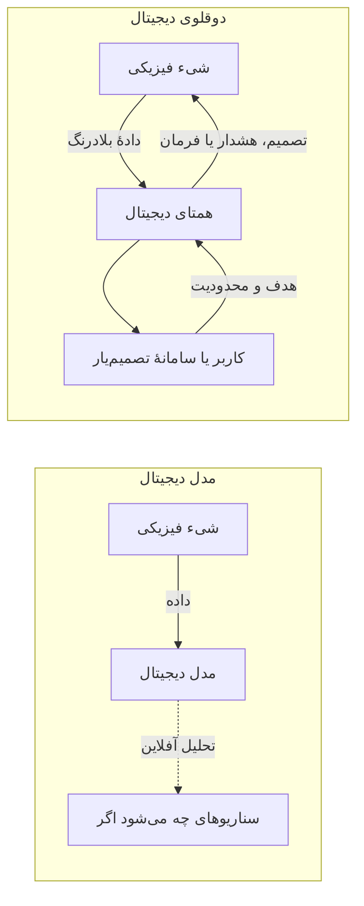

یک نمونهٔ متداول، **نگهداری و تعمیرات پیش‌بینانه** است. دوقلو داده‌های ماشین را دریافت می‌کند، یک ماژول پایش وجود رفتار غیرعادی را تشخیص می‌دهد و سپس سامانه می‌تواند فرایند را متوقف کند، پارامترهای آن را تغییر دهد یا زمان مناسب تعمیر را به کاربر پیشنهاد کند [9,10]. ارتباط با کاربر نیز می‌تواند از طریق رابط گرافیکی، مصورسازی سه‌بعدی یا واقعیت افزوده انجام شود [11].

> **نکتهٔ تکمیلی ـ افزودهٔ نویسندهٔ این نسخه**  
> در برخی منابع، میان سه مفهوم تمایز دقیق‌تری برقرار می‌شود:
> - **مدل دیجیتال:** تبادل خودکار و پیوستهٔ داده ندارد.
> - **سایهٔ دیجیتال:** داده از شیء فیزیکی به مدل به‌صورت خودکار منتقل می‌شود، اما مسیر برگشت خودکار وجود ندارد.
> - **دوقلوی دیجیتال:** تبادل خودکار دوطرفه و همگام‌سازی چرخه‌بسته دارد.  
> مقالهٔ اصلی عمدتاً مدل دیجیتال را در برابر دوقلوی دیجیتال قرار می‌دهد، ولی افزودن مفهوم سایهٔ دیجیتال مرز میان این دو را روشن‌تر می‌کند.

## ۱.۲. اجزای بنیادی دوقلوی دیجیتال

اجزای اصلی یک دوقلوی دیجیتال عبارت‌اند از:

- مدل‌سازی؛
- شبیه‌سازی؛
- پایش؛
- تفسیر و مصورسازی داده؛
- پیش‌بینی؛
- تصمیم‌گیری و در سامانه‌های پیشرفته، اعمال کنترل.

مقاله یک معماری لایه‌ای عمومی پیشنهاد می‌کند که از معماری‌های موجود الهام گرفته است [13,14].

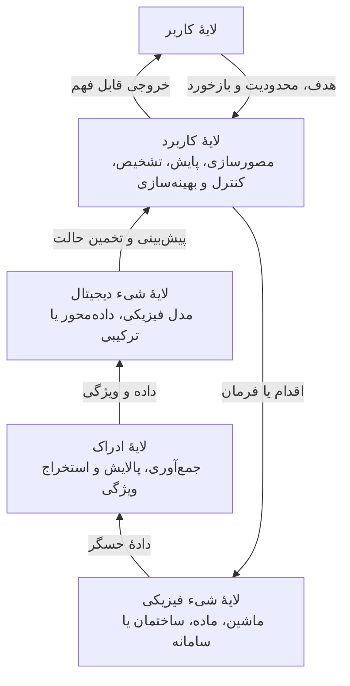

### لایهٔ ادراک

درگاه ورود اطلاعات از جهان فیزیکی است و وظایفی مانند دریافت داده، هم‌زمان‌سازی، حذف نویز، همجوشی حسگرها، شناسایی نقاط پرت و مقیاس‌بندی داده را انجام می‌دهد.

### لایهٔ شیء دیجیتال

از داده‌های آماده‌شده برای ساخت یا به‌روزرسانی مدل استفاده می‌کند. این مدل می‌تواند:

- **فیزیک‌مبنا یا جعبه‌سفید** باشد؛
- **داده‌محور یا جعبه‌سیاه** باشد؛
- **ترکیبی یا جعبه‌خاکستری** باشد.

مدل برای پیش‌بینی حالت سامانه، تخمین متغیرهای غیرقابل‌اندازه‌گیری و اجرای سناریوهای شبیه‌سازی به کار می‌رود.

### لایهٔ کاربرد

اطلاعات حسگرها و خروجی مدل را به نتایج قابل اقدام تبدیل می‌کند. کارکردهای این لایه شامل مصورسازی، تشخیص ناهنجاری، طبقه‌بندی، کنترل بازخوردی، بهینه‌سازی و پشتیبانی از تصمیم است.

## ۱.۳. مدل جعبه‌سفید، جعبه‌سیاه و جعبه‌خاکستری

| نوع مدل | منبع دانش | مزیت اصلی | محدودیت اصلی |
|---|---|---|---|
| جعبه‌سفید | قوانین فیزیکی و اصول اولیه | تفسیرپذیری و امکان تعمیم فیزیکی | هزینهٔ محاسباتی و نیاز به پارامترهای دقیق |
| جعبه‌سیاه | داده‌های ورودی و خروجی | توان مدل‌سازی روابط پیچیده بدون فرمول فیزیکی کامل | کمبود تفسیرپذیری و ضعف خارج از دامنهٔ آموزش |
| جعبه‌خاکستری | ترکیب فیزیک و داده | تعادل میان دقت، سرعت و تعمیم | دشواری طراحی، کالیبراسیون و ادغام دو نوع مدل |

مدل‌های فیزیکی شامل تحلیل اجزای محدود، دینامیک مولکولی یا مدل‌های پارامتر متمرکز هستند. مدل‌های داده‌محور از الگوهای آماری داده نتیجه‌گیری می‌کنند. مدل خاکستری می‌تواند داده‌های حاصل از شبیه‌سازی فیزیکی را برای غنی‌سازی داده‌های آموزشی به کار گیرد یا خروجی مدل فیزیکی را با دادهٔ حسگر ترکیب کند [16–19].


## ۱.۴. چرا یادگیری ماشین یک فناوری محوری است؟

حسگرها و تجهیزات اینترنت اشیا حجم بزرگی از داده تولید می‌کنند. تبدیل این داده به دانش عملی بدون روش‌های آماری و یادگیری ماشین دشوار است. یادگیری ماشین در دوقلوی دیجیتال برای موارد زیر به کار می‌رود:

- ساخت مدل جانشین سریع به‌جای شبیه‌سازی‌های سنگین؛
- تخمین متغیرهایی که حسگر مستقیم ندارند؛
- تشخیص خرابی و ناهنجاری؛
- پیش‌بینی عمر باقی‌ماندهٔ تجهیز؛
- طبقه‌بندی کیفیت محصول؛
- کاهش ابعاد برای مصورسازی؛
- تعیین سیاست کنترلی یا بهینه‌سازی؛
- تعامل طبیعی‌تر میان انسان و سامانه.

پیشرفت اینترنت اشیا نیز همگام‌سازی بلادرنگ میان همتای فیزیکی و دیجیتال را تقویت کرده است.

## ۱.۵. گسترهٔ کاربرد و ماهیت چندمقیاسی

دوقلوهای دیجیتال در شهر هوشمند، ساخت‌وساز، سلامت، تولید، انرژی، آموزش اپراتور و بسیاری حوزه‌های دیگر کاربرد دارند [20–27]. کاربردها می‌توانند شامل پایش وضعیت، کاهش مصرف انرژی، افزایش پایداری، کاهش ضایعات، پیش‌بینی شکست، تعمیرات پیش‌دستانه و آموزش تعاملی باشند.

موضوع مرکزی مقاله این است که دوقلوی دیجیتال را باید **چندمقیاسی** دید. مقیاس می‌تواند:

- مکانی باشد؛ از اتم و ماده تا قطعه، ماشین، خط تولید و کارخانه؛
- زمانی باشد؛ از پدیده‌های بسیار سریع تا فرسودگی و تغییرات بلندمدت؛
- سازمانی یا عملکردی باشد؛ از یک واحد منفرد تا سامانه و سامانه‌ای از سامانه‌ها.

---

# ۲. یادگیری ماشین برای فناوری دوقلوی دیجیتال

مفهوم دوقلوی دیجیتال در سال ۲۰۰۳ توسط Michael Grieves مطرح شد. در سال ۲۰۱۲ ناسا چارچوبی برای مأموریت‌های فضایی ارائه کرد و دوقلو را مدلی بسیار واقع‌گرایانه دانست که همراه با دارایی فیزیکی تکامل می‌یابد و از داده‌های حسگرهای نصب‌شده روی آن استفاده می‌کند [28].

با پیشرفت سخت‌افزار، ارتباطات و هوش مصنوعی، تعریف دوقلو از یک بازنمایی صرف فراتر رفته و قابلیت‌هایی مانند **خودپایشی** و **خودکنترلی** نیز به آن افزوده شده است؛ به‌ویژه در ساختمان هوشمند و تولید.

## ۲.۰. جایگاه یادگیری ماشین در چرخهٔ داده تا تصمیم

یادگیری ماشین زیرمجموعه‌ای از هوش مصنوعی است که به الگوریتم‌ها امکان می‌دهد بر اساس داده، الگو و رابطه بیاموزند و بدون برنامه‌نویسی صریح برای تک‌تک حالت‌ها، پیش‌بینی یا تصمیم تولید کنند.

چهار الگوی مهم یادگیری عبارت‌اند از:

- **یادگیری نظارت‌شده:** داده‌ها دارای برچسب یا خروجی هدف هستند؛ مانند پیش‌بینی زبری سطح یا طبقه‌بندی عیب.
- **یادگیری بدون نظارت:** داده‌ها برچسب ندارند؛ مانند خوشه‌بندی وضعیت‌های کاری یا کشف ناهنجاری.
- **یادگیری نیمه‌نظارت‌شده:** مقدار کمی دادهٔ برچسب‌دار و حجم زیادی دادهٔ بدون برچسب وجود دارد.
- **یادگیری تقویتی:** عامل با محیط تعامل می‌کند و از پاداش و جریمه سیاست تصمیم‌گیری می‌آموزد.

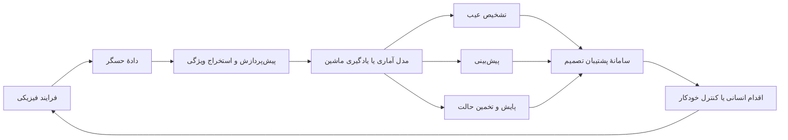

از دید مدل‌سازی، دوقلوی دیجیتال باید موجودیت فیزیکی را به فضای مجازی منتقل کند. این کار با مدل فیزیکی، مدل داده‌محور یا مدل ترکیبی انجام می‌شود. با توجه به هزینهٔ محاسباتی بالای مدل‌های فیزیکی دقیق، در بسیاری از دوقلوهای بلادرنگ، اتکا به مدل‌های داده‌محور یا جانشین بیشتر است [34–36].

روش‌های رگرسیون امکان ساخت مدل‌های ایستا و پویا را فراهم می‌کنند. طبقه‌بندی و خوشه‌بندی برای تشخیص حالت‌ها و ناهنجاری‌ها به کار می‌روند و کاهش ابعاد نیز به مصورسازی داده‌های پرابعاد و سبک‌تر شدن پردازش کمک می‌کند [37–44].

## ۲.۰.۱. مقیاس مکانی و زمانی

یک کارخانه را می‌توان در چند سطح مدل کرد:

- **سطح واحد:** یک ماده، قطعه، ابزار یا فرایند؛
- **سطح سامانه:** یک ماشین یا سلول تولید؛
- **سطح سامانه‌ای از سامانه‌ها:** خط تولید، کارخانه یا شبکهٔ کارخانه‌ها.

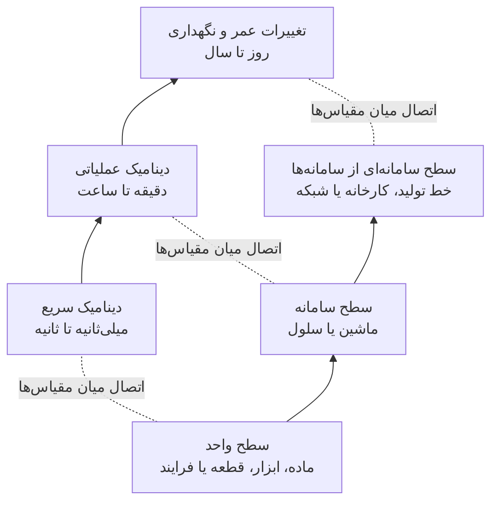

مدل در هر سطح می‌تواند ایستا یا پویا باشد. معماری عمومی لایه‌ای را می‌توان برای هر مقیاس تکرار کرد؛ با این تفاوت که نوع حسگر، مدل و تصمیم در هر سطح تغییر می‌کند.

---

## ۲.۱. لایهٔ ادراک

لایهٔ ادراک دروازهٔ ورود دادهٔ بلادرنگ به دوقلوی دیجیتال است. این لایه اطلاعات وضعیت، رفتار و عملکرد دارایی فیزیکی را از منابعی مانند حسگر، PLC، دوربین، میکروفون، سامانهٔ کنترل، تجهیزات اینترنت اشیا و پایگاه داده دریافت می‌کند.

صرف جمع‌آوری داده کافی نیست. دادهٔ خام ممکن است دارای نویز، دادهٔ گمشده، نمونه‌برداری ناهم‌زمان، خطای حسگر، مقیاس‌های متفاوت و نقاط پرت باشد. بنابراین لایهٔ ادراک باید پیش از ارسال داده به مدل، عملیات پالایش و استانداردسازی را انجام دهد.

### وظایف متداول لایهٔ ادراک

- همجوشی چند حسگر؛
- حذف یا کاهش نویز؛
- تشخیص دادهٔ پرت؛
- جای‌گذاری داده‌های گمشده؛
- هم‌زمان‌سازی سیگنال‌ها؛
- استخراج ویژگی در حوزهٔ زمان، فرکانس یا تصویر؛
- نرمال‌سازی یا استانداردسازی؛
- اعتبارسنجی کیفیت داده.

### ۲.۱.۱. همجوشی حسگرها

همجوشی حسگرها به معنی ترکیب اطلاعات چند حسگر برای افزایش دقت، قابلیت اعتماد و تاب‌آوری تخمین حالت است [46]. اندازه‌گیری حسگرها ممکن است تحت تأثیر نویز، بایاس، خرابی یا اغتشاش محیطی قرار گیرد. ترکیب مناسب چند منبع می‌تواند ضعف هر حسگر را با اطلاعات حسگرهای دیگر جبران کند.

#### فیلتر کالمن

فیلتر کالمن یکی از روش‌های احتمالاتی پرکاربرد است. این فیلتر در هر گام زمانی دو مرحلهٔ اصلی دارد:

1. پیش‌بینی حالت با استفاده از مدل دینامیکی؛
2. تصحیح پیش‌بینی با استفاده از اندازه‌گیری جدید و عدم‌قطعیت آن.

وزن نسبی مدل و حسگر بر اساس کوواریانس خطا تعیین می‌شود. اگر حسگر نامطمئن باشد، فیلتر بیشتر به مدل تکیه می‌کند و اگر مدل نامطمئن باشد، اندازه‌گیری نقش بیشتری می‌گیرد [47].

#### همجوشی بر پایهٔ رگرسیون

فرض کنید بردار اندازه‌گیری حسگرها برابر باشد با:

\[
\mathbf{x}=[x_1,x_2,\ldots,x_N]^T
\]

و هدف، تخمین بردار حالت یا متغیر خروجی \(\mathbf{y}\) باشد. مدل خطی عمومی را می‌توان چنین نوشت:

\[
\hat{\mathbf{y}}=\mathbf{W}\mathbf{x}+\boldsymbol{\varepsilon}
\tag{1}
\]

که در آن \(\mathbf{W}\) ماتریس وزن و \(\boldsymbol{\varepsilon}\) خطای تخمین است. در قالب داده‌های آموزشی \(\mathbf{X}\) و \(\mathbf{Y}\)، برآورد حداقل مربعات معمولی برابر است با:

\[
\hat{\mathbf{W}}=(\mathbf{X}^{T}\mathbf{X})^{-1}\mathbf{X}^{T}\mathbf{Y}
\tag{2}
\]

هدف آن است که وزن‌ها به‌گونه‌ای انتخاب شوند که خطای پیش‌بینی حداقل شود [48]. در صورت وجود رابطهٔ غیرخطی، می‌توان از روش‌های بیزی، ماشین بردار پشتیبان و شبکهٔ عصبی استفاده کرد [49–52].

> **نکتهٔ تکمیلی ـ افزودهٔ نویسندهٔ این نسخه**  
> در سامانه‌های واقعی، ماتریس \(\mathbf{X}^{T}\mathbf{X}\) ممکن است تکین یا بدشرط باشد، به‌خصوص وقتی حسگرها اطلاعات مشابه تولید می‌کنند. در چنین حالتی، رگرسیون Ridge، انتخاب حسگر، PCA یا برآوردگرهای مقاوم می‌توانند از ناپایداری عددی جلوگیری کنند. همچنین برای روابط دینامیکی غیرخطی، فیلتر کالمن توسعه‌یافته، فیلتر کالمن بدون بو و فیلتر ذره‌ای گزینه‌های رایج‌اند.

### ۲.۱.۲. حذف نقاط پرت

کیفیت مدل داده‌محور مستقیماً به کیفیت داده بستگی دارد. نقطهٔ پرت می‌تواند ناشی از خرابی حسگر، خطای انتقال، رخداد نادر واقعی، تغییر رژیم کاری یا حملهٔ سایبری باشد. بنابراین حذف کورکورانهٔ هر دادهٔ غیرمعمول صحیح نیست؛ ابتدا باید مشخص شود که داده واقعاً خطاست یا نشانهٔ رخدادی مهم.

مقاله سه خانوادهٔ اصلی را مطرح می‌کند:

1. روش‌های مبتنی بر توزیع؛
2. روش‌های مبتنی بر چگالی و خوشه‌بندی؛
3. روش‌های مبتنی بر جداسازی تصادفی.

#### فاصلهٔ ماهالانوبیس و برآورد کوواریانس مقاوم

اگر دادهٔ عادی تقریباً گاوسی باشد، می‌توان مرکز \(\boldsymbol{\mu}\) و ماتریس کوواریانس \(\mathbf{\Sigma}\) را برآورد کرد. روش **Minimum Covariance Determinant** یا MCD برآورد مقاوم‌تری از کوواریانس ارائه می‌دهد [53]. فاصلهٔ ماهالانوبیس یک نمونهٔ \(\mathbf{x}\) از مرکز توزیع چنین است:

\[
D_M(\mathbf{x})=
\sqrt{(\mathbf{x}-\boldsymbol{\mu})^T
\mathbf{\Sigma}^{-1}
(\mathbf{x}-\boldsymbol{\mu})}
\tag{3}
\]

برخلاف فاصلهٔ اقلیدسی، این معیار هم مقیاس متغیرها و هم هم‌بستگی میان آن‌ها را لحاظ می‌کند. نمونه‌هایی با فاصلهٔ بسیار زیاد می‌توانند پرت تلقی شوند.

#### DBSCAN

DBSCAN نقاط را بر اساس چگالی محلی گروه‌بندی می‌کند و قادر است خوشه‌هایی با شکل نامنظم را کشف کند [54]. نقاطی که در ناحیهٔ متراکم قرار نمی‌گیرند، به‌عنوان نویز علامت‌گذاری می‌شوند. مزیت آن نسبت به K-means این است که لازم نیست همهٔ نمونه‌ها را به یک خوشه اختصاص دهد و تعداد خوشه‌ها نیز از ابتدا مشخص نیست.

دو پارامتر مهم آن عبارت‌اند از:

- `eps`: شعاع همسایگی؛
- `min_samples`: حداقل تعداد نمونه برای تشکیل ناحیهٔ متراکم.

#### جنگل جداسازی

Isolation Forest با انتخاب تصادفی ویژگی و آستانه، داده را چند بار تقسیم می‌کند [55,56]. نمونهٔ غیرعادی معمولاً با تعداد تقسیم کمتر جدا می‌شود؛ زیرا در ناحیه‌ای کم‌تراکم یا دور از بقیه قرار دارد. کوتاه بودن متوسط طول مسیر در درخت‌ها، نشانهٔ ناهنجاری است.

| روش | فرض اصلی | مزیت | محدودیت |
|---|---|---|---|
| ماهالانوبیس/MCD | شکل توزیع تقریباً بیضوی | ساده و قابل تفسیر | ضعف در توزیع‌های بسیار پیچیده |
| DBSCAN | نقاط عادی نواحی متراکم تشکیل می‌دهند | کشف خوشه‌های نامنظم و نویز | حساس به انتخاب پارامتر و مقیاس |
| Isolation Forest | ناهنجاری سریع‌تر جدا می‌شود | مناسب دادهٔ پرابعاد و مقیاس‌پذیر | امتیاز ناهنجاری همیشه معنای فیزیکی روشن ندارد |

> **نکتهٔ تکمیلی ـ افزودهٔ نویسندهٔ این نسخه**  
> در دوقلوی دیجیتال، بهتر است خروجی تشخیص پرت در سه سطح تفسیر شود: **خطای داده، خرابی فیزیکی و تغییر رژیم کاری**. حذف خودکار همهٔ نقاط غیرعادی ممکن است نشانهٔ اولیهٔ خرابی را از بین ببرد. راهکار مطمئن‌تر، نگهداری دادهٔ خام، ثبت پرچم کیفیت و تصمیم‌گیری مرحله‌ای است.

### ۲.۱.۳. پیش‌پردازش داده

در دوقلوهای خودآموز و خودکنترل، الگوریتم باید بتواند به‌طور پیوسته از داده استفاده کند. توزیع نامناسب ویژگی‌ها، اختلاف شدید مقیاس یا وجود مقادیر بسیار بزرگ می‌تواند آموزش مدل را کند یا نامتعادل سازد.

#### نرمال‌سازی Min-Max

نرمال‌سازی مقدار ویژگی را معمولاً به بازهٔ صفر تا یک می‌برد:

\[
x' = \frac{x-x_{\min}}{x_{\max}-x_{\min}}
\]

مزایا:

- یکسان شدن دامنهٔ ویژگی‌ها؛
- جلوگیری از تسلط ویژگی‌های بزرگ‌مقیاس؛
- کمک به همگرایی الگوریتم‌های گرادیانی.

محدودیت: به مقادیر حدی و پرت حساس است، زیرا حداقل و حداکثر را تغییر می‌دهند.

#### استانداردسازی Z-score

\[
z = \frac{x-\mu}{\sigma}
\]

پس از تبدیل، میانگین ویژگی تقریباً صفر و انحراف معیار آن یک می‌شود.

مزایا:

- مناسب برای بسیاری از مدل‌های خطی، SVM، PCA و شبکهٔ عصبی؛
- قابل استفاده وقتی دامنهٔ فیزیکی ثابتی برای ویژگی وجود ندارد.

محدودیت: میانگین و انحراف معیار نیز در برابر نقاط پرت حساس‌اند.

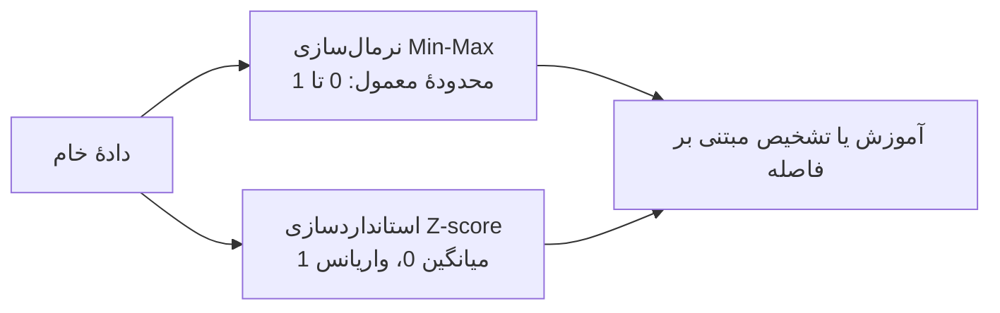

> **نکتهٔ تکمیلی ـ افزودهٔ نویسندهٔ این نسخه**  
> مقاله استانداردسازی را نسبت به اثر نقاط پرت مقاوم‌تر معرفی می‌کند؛ اما از نظر آماری، Z-score معمول نیز به نقاط پرت حساس است. برای داده‌های آلوده، **Robust Scaling** بر پایهٔ میانه و دامنهٔ بین چارکی مناسب‌تر است. همچنین پارامترهای مقیاس‌بندی باید فقط روی دادهٔ آموزش محاسبه شوند تا نشت اطلاعات از دادهٔ آزمون رخ ندهد.

> **نکتهٔ تکمیلی ـ افزودهٔ نویسندهٔ این نسخه: مواردی که در یک دوقلوی عملی باید به پیش‌پردازش افزوده شوند**  
> - هم‌ترازی زمانی حسگرهایی با نرخ نمونه‌برداری متفاوت؛
> - جبران تأخیر شبکه و مهر زمانی نادرست؛
> - مدیریت دادهٔ گمشده؛
> - تشخیص تغییر توزیع داده یا `Data Drift`؛
> - کنترل صحت و اصالت داده در برابر دست‌کاری سایبری؛
> - ثبت نسخهٔ الگوریتم و خط لولهٔ پیش‌پردازش برای بازتولیدپذیری.

---

## ۲.۲. لایهٔ شیء دیجیتال

مدل‌سازی و شبیه‌سازی هستهٔ دوقلوی دیجیتال را تشکیل می‌دهند. لایهٔ شیء دیجیتال باید رفتار و دینامیک موجودیت فیزیکی را با دقت کافی بازسازی کند تا بتوان از آن برای پیش‌بینی، آزمون سناریو، بهینه‌سازی و کنترل استفاده کرد.

ورودی این لایه می‌تواند دادهٔ خام، ویژگی‌های استخراج‌شده، پارامترهای محیطی، فرمان‌های کنترلی و داده‌های تاریخی باشد. خروجی آن نیز می‌تواند شامل حالت تخمینی، پیش‌بینی آینده، شاخص سلامت، احتمال خرابی یا پاسخ سامانه به یک سناریوی فرضی باشد.

### ۲.۲.۱. مدل‌های فیزیکی و داده‌محور

#### مدل فیزیکی یا جعبه‌سفید

مدل جعبه‌سفید از قوانین فیزیکی و اصول اولیه ساخته می‌شود. معادلات دیفرانسیل، روش اجزای محدود، مدل‌های حرارتی، الکترومغناطیسی، مکانیکی و مدل‌های پارامتر متمرکز در این گروه قرار می‌گیرند [58].

مزایا:

- ارتباط مستقیم پارامترها با کمیت‌های فیزیکی؛
- امکان بررسی شرایطی که دادهٔ تجربی کمی دارند؛
- تفسیرپذیری و اعمال قیود حفاظتی؛
- توان تحلیل علّی بهتر از مدل صرفاً داده‌محور.

محدودیت‌ها:

- نیاز به پارامترهای دقیق ماده و شرایط مرزی؛
- دشواری مدل‌سازی همهٔ عدم‌قطعیت‌ها و پدیده‌های ناشناخته؛
- هزینهٔ محاسباتی زیاد؛
- نیاز به ساده‌سازی برای کاربرد بلادرنگ.

#### مدل داده‌محور یا جعبه‌سیاه

مدل داده‌محور رابطهٔ پنهان میان ورودی و خروجی را از داده‌های آزمایش یا بهره‌برداری می‌آموزد. رگرسیون، خودرگرسیون، شبکهٔ عصبی و روش‌های طبقه‌بندی از ابزارهای اصلی آن هستند.

مزایا:

- مدل‌سازی روابط پیچیده بدون استخراج کامل معادلات؛
- سرعت زیاد استنتاج پس از آموزش؛
- سازگاری با داده‌های چندحسگری و تصویر.

محدودیت‌ها:

- ضعف در تعمیم به شرایط خارج از دامنهٔ آموزش؛
- دشواری تفسیر سازوکار فیزیکی؛
- نیاز به دادهٔ کافی و نماینده؛
- حساسیت به تغییر توزیع و کیفیت داده.

#### بیش‌برازش و شرایط مرزی

بیش‌برازش زمانی رخ می‌دهد که مدل جزئیات و نویز دادهٔ آموزش را بیش از حد یاد بگیرد. در نتیجه، خطای آموزش کم اما خطای اعتبارسنجی یا آزمون زیاد می‌شود [59].

این مسئله در دوقلوی دیجیتال مهم‌تر است، زیرا دادهٔ مربوط به شرایط خطرناک، حدی یا خرابی شدید معمولاً کم است. حتی اگر تعداد کل نمونه‌ها زیاد باشد، تنوع آن‌ها در مرزهای عملیاتی ممکن است پایین باشد. مدل در ناحیهٔ عادی عملکرد خوبی دارد، اما در نقطه‌ای که تصمیم حفاظتی اهمیت بیشتری دارد، قابل اعتماد نیست.

راهکارهای متداول:

- منظم‌سازی وزن‌ها؛
- توقف زودهنگام؛
- ساده‌تر کردن مدل؛
- اعتبارسنجی متقاطع؛
- افزایش تنوع داده؛
- تولید دادهٔ مصنوعی با مدل فیزیکی؛
- استفاده از مدل خاکستری.

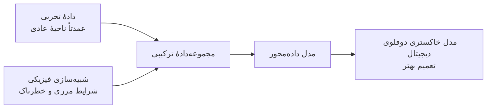

مدل خاکستری از شبیه‌سازی برای پر کردن نواحی کم‌داده استفاده می‌کند و می‌تواند واریانس مجموعه‌داده و تعمیم‌پذیری را افزایش دهد.

> **نکتهٔ تکمیلی ـ افزودهٔ نویسندهٔ این نسخه**  
> دادهٔ شبیه‌سازی‌شده همیشه معادل دادهٔ واقعی نیست. اختلاف میان شبیه‌سازی و جهان واقعی با عنوان `Sim-to-Real Gap` شناخته می‌شود. بنابراین دادهٔ مصنوعی باید با دادهٔ واقعی کالیبره شود و عدم‌قطعیت آن در آموزش لحاظ گردد.

### ۲.۲.۲. رگرسیون چندجمله‌ای برای مدل ایستا

رگرسیون نگاشتی میان ورودی \(\mathbf{x}\) و خروجی \(y\) می‌آموزد:

\[
\hat{y}=f_{\boldsymbol{\theta}}(\mathbf{x})
\tag{4}
\]

در رگرسیون خطی، خروجی ترکیبی خطی از ویژگی‌ها است. پارامترها را می‌توان با حداقل مربعات، برآوردگرهای \(L_p\) یا گرادیان نزولی به دست آورد [60].

برای ثبت رفتار غیرخطی، رگرسیون چندجمله‌ای به کار می‌رود. برای یک ورودی اسکالر:

\[
\hat{y}=
\beta_0+
\beta_1x+
\beta_2x^2+
\cdots+
\beta_nx^n+
\varepsilon
\tag{5}
\]

در این رابطه:

- \(\beta_i\) ضرایب مدل؛
- \(n\) درجهٔ چندجمله‌ای؛
- \(\varepsilon\) خطای مدل است.

درجهٔ بیشتر امکان برازش روابط پیچیده‌تر را می‌دهد، ولی خطر بیش‌برازش را افزایش می‌دهد. انتخاب درجه باید بر اساس اعتبارسنجی و دانش حوزه انجام شود.

> **یادداشت دربارهٔ نمادگذاری مقاله**  
> رابطهٔ چاپ‌شده در نسخهٔ اصلی در جملهٔ مربوط به توان‌های چندجمله‌ای ابهام حروف‌چینی دارد. در این نسخه، شکل استاندارد و متعارف رگرسیون چندجمله‌ای نوشته شده است.

### ۲.۲.۳. مدل خودرگرسیو چندجمله‌ای برای سامانهٔ پویا

مدل ایستا خروجی را تنها از ورودی جاری تخمین می‌زند. در سامانهٔ پویا، گذشتهٔ سامانه بر وضعیت فعلی اثر دارد. مدل خودرگرسیو مرتبهٔ \(p\) به‌صورت زیر است:

\[
y_t=c+\sum_{i=1}^{p}\phi_i y_{t-i}+\varepsilon_t
\tag{6}
\]

که در آن:

- \(y_t\): مقدار فعلی؛
- \(c\): مقدار ثابت؛
- \(\phi_i\): ضرایب اثر مقادیر گذشته؛
- \(p\): تعداد وقفه‌ها؛
- \(\varepsilon_t\): خطای تصادفی است.

بسیاری از سامانه‌های فیزیکی علاوه بر گذشتهٔ خروجی، تحت تأثیر ورودی‌های خارجی و فرمان‌های کنترلی هستند. مدل ARX یا خودرگرسیو با ورودی برون‌زا را می‌توان چنین نوشت:

\[
y_t=c+
\sum_{i=1}^{p}\phi_i y_{t-i}+
\sum_{j=1}^{q}\beta_j x_{t-j}+
\varepsilon_t
\tag{7}
\]

مدل ARX برای فرایندهایی مناسب است که خروجی آینده به سابقهٔ خروجی و سابقهٔ ورودی کنترل وابسته است.

انتخاب تعداد وقفه‌ها، درجهٔ چندجمله‌ای و تعداد متغیرهای برون‌زا باید با دقت انجام شود؛ زیرا افزایش بی‌رویهٔ آن‌ها مدل را پیچیده و بیش‌برازش را محتمل می‌کند.

> **نکتهٔ تکمیلی ـ افزودهٔ نویسندهٔ این نسخه**  
> برای دوقلوی دیجیتال کنترلی، مدل باید علاوه بر خطای پیش‌بینی یک‌گام، در **پیش‌بینی چندگام** نیز ارزیابی شود. مدلی که فقط گام بعدی را خوب تخمین می‌زند ممکن است در افق پیش‌بینی کنترل پیش‌بین، خطای تجمعی بزرگی داشته باشد.

### ۲.۲.۴. شبکه‌های عصبی برای رگرسیون و طبقه‌بندی

شبکهٔ عصبی از لایه‌هایی از نورون‌های به‌هم‌پیوسته ساخته می‌شود. هر نورون ترکیب خطی ورودی را محاسبه و سپس تابع فعال‌سازی غیرخطی را اعمال می‌کند:

\[
\mathbf{y}=g(\mathbf{W}\mathbf{x}+\mathbf{b})
\tag{8}
\]

تابع فعال‌سازی امکان یادگیری روابط غیرخطی را فراهم می‌کند. نمونه‌های رایج:

- Sigmoid؛
- Tanh؛
- ReLU.

شبکه با الگوریتم پس‌انتشار آموزش می‌بیند. خطای خروجی محاسبه و گرادیان آن نسبت به وزن‌ها از لایهٔ خروجی به عقب منتقل می‌شود تا وزن‌ها در جهت کاهش خطا به‌روزرسانی شوند [61,62].

#### تفاوت خروجی در رگرسیون و طبقه‌بندی

| مسئله | لایهٔ خروجی متداول | معنای خروجی |
|---|---|---|
| رگرسیون | خطی یا در برخی مسائل ReLU | مقدار پیوسته مانند دما یا زبری سطح |
| طبقه‌بندی دودویی | Sigmoid | احتمال تعلق به کلاس مثبت |
| طبقه‌بندی چندکلاسه | Softmax | توزیع احتمال روی کلاس‌ها |

شبکه‌های عصبی در مدل‌سازی سامانه‌های ایستا و پویا، طبقه‌بندی عیب، بهینه‌سازی و کشف ناهنجاری کاربرد دارند [63–70].

#### شبکه‌های پویا

اگر مقادیر گذشتهٔ متغیرها به شبکه داده شود، می‌توان مدل خودرگرسیو عصبی ساخت. معماری‌های تخصصی‌تر عبارت‌اند از:

- **RNN:** دارای حالت داخلی برای حفظ اطلاعات گذشته؛
- **LSTM:** دارای دروازه‌هایی برای یادگیری وابستگی‌های بلندمدت؛
- **GRU:** نسخه‌ای ساده‌تر و معمولاً سبک‌تر از LSTM.

این شبکه‌ها بدون فرض صریح دربارهٔ فرم معادله، الگوهای زمانی را می‌آموزند [71–73]. با این حال، تعداد زیاد ابرپارامترها، آموزش و تنظیم آن‌ها را دشوار می‌کند. ابزارهای AutoML و کتابخانه‌هایی مانند Optuna می‌توانند جست‌وجوی ابرپارامتر را خودکار کنند [74].

> **نکتهٔ تکمیلی ـ افزودهٔ نویسندهٔ این نسخه: مدل‌های مناسب برای نسل جدید دوقلوها**  
> - **مدل‌های کاهش‌مرتبه:** برای تبدیل شبیه‌سازی فیزیکی سنگین به مدل سریع؛
> - **شبکه‌های آگاه از فیزیک:** برای وارد کردن معادلات و قیود فیزیکی در تابع هزینه؛
> - **شبکه‌های گرافی:** برای دارایی‌هایی که ساختار اتصال میان اجزا مهم است؛
> - **مدل‌های احتمالاتی:** برای اعلام بازهٔ عدم‌قطعیت، نه فقط یک مقدار نقطه‌ای؛
> - **یادگیری انتقالی و تطبیق دامنه:** برای انتقال مدل از یک ماشین یا کارخانه به نمونه‌ای مشابه.

---

## ۲.۳. یکپارچه‌سازی داده در دوقلوی دیجیتال

مدیریت مؤثر داده برای عملیات صنعتی و تصمیم‌گیری داده‌محور ضروری است. تحول دیجیتال جریان اطلاعات را در چرخهٔ تولید تسهیل کرده، اما هم‌زمان حجم، تنوع و پیچیدگی داده را افزایش داده است [75–78].

### ۲.۳.۱. پوستهٔ مدیریت دارایی و دوقلوی دیجیتال

**Asset Administration Shell** یا AAS یک نمایش ساخت‌یافته و استاندارد از دارایی صنعتی است. AAS به‌عنوان پل میان دارایی فیزیکی و بازنمایی دیجیتال عمل می‌کند و اطلاعاتی مانند شناسه، ویژگی‌ها، قابلیت‌ها، داده‌های جاری و مدل‌های مرتبط را در قالب زیرمدل‌ها سازمان می‌دهد [79–81].

دوقلوی دیجیتال می‌تواند از AAS برای دسترسی به موارد زیر استفاده کند:

- دادهٔ بلادرنگ؛
- تاریخچهٔ عملکرد؛
- پارامترهای عملیاتی؛
- اطلاعات مهندسی و CAD؛
- توابع و سرویس‌های دارایی؛
- فراداده و معناشناسی متغیرها.

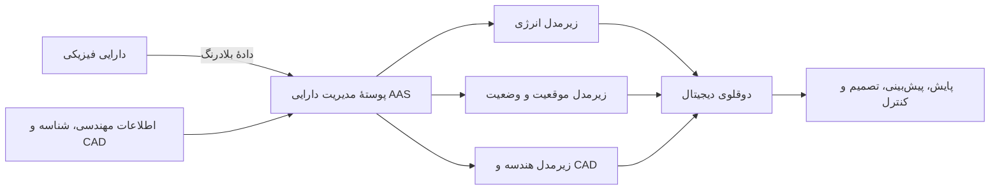

این اتصال امکان همگام‌سازی مداوم و تصمیم‌گیری بر اساس اطلاعات دقیق و به‌روز را فراهم می‌کند.

### ۲.۳.۲. پایگاه دادهٔ SQL

پایگاه دادهٔ رابطه‌ای برای دادهٔ ساخت‌یافته و روابط روشن مناسب است. مزایای آن عبارت‌اند از:

- حفظ یکپارچگی داده؛
- زبان پرس‌وجوی قدرتمند؛
- پشتیبانی از روابط پیچیده؛
- تراکنش‌های قابل اعتماد.

ویژگی‌های ACID شامل:

- **Atomicity:** تراکنش یا کامل انجام می‌شود یا اصلاً انجام نمی‌شود؛
- **Consistency:** داده از یک وضعیت معتبر به وضعیت معتبر دیگر می‌رود؛
- **Isolation:** تراکنش‌های هم‌زمان مزاحم یکدیگر نمی‌شوند؛
- **Durability:** پس از تأیید، نتیجهٔ تراکنش پایدار می‌ماند [84].

### ۲.۳.۳. پایگاه دادهٔ NoSQL

با افزایش حجم داده و تنوع دستگاه‌ها، ساختار صلب رابطه‌ای همیشه مناسب نیست. NoSQL خانواده‌ای از پایگاه‌های داده است که می‌تواند سندمحور، کلیدـمقدار، ستونی یا گرافی باشد [85–88].

مزایا:

- انعطاف در طرح داده؛
- مقیاس‌پذیری افقی؛
- مناسب برای داده‌های نیمه‌ساخت‌یافته و جریان‌های حجیم.

محدودیت‌ها:

- سازگاری و تراکنش ممکن است به قوت SQL نباشد؛
- نوع پرس‌وجو و مدل‌سازی وابسته به فناوری انتخابی است؛
- نبود طرح سخت‌گیرانه می‌تواند به بی‌نظمی فراداده منجر شود.

| نیاز | انتخاب رایج |
|---|---|
| تراکنش مالی یا دادهٔ ساخت‌یافته با روابط ثابت | SQL |
| دادهٔ حسگری حجیم و ساختار متغیر | NoSQL یا پایگاه سری زمانی |
| ارتباطات میان اجزای شبکه | پایگاه دادهٔ گرافی |
| آرشیو فایل، تصویر و مدل سه‌بعدی | ذخیره‌سازی شیءگرا |

### ۲.۳.۴. راهبرد ذخیره‌سازی

انتخاب فناوری ذخیره‌سازی باید بر اساس نحوهٔ استفاده و ارزش مورد انتظار داده انجام شود. عناصر مهم راهبرد عبارت‌اند از:

- سطح دسترسی: بلادرنگ یا دوره‌ای؛
- استاندارد کیفیت داده؛
- قوانین اداری و مالکیت داده؛
- حریم خصوصی و محرمانگی؛
- امنیت سایبری؛
- محل ذخیره‌سازی: داخل سازمان، مرکز داده یا ابر؛
- حجم فعلی و نرخ رشد؛
- مدت نگهداری و سیاست حذف؛
- ارتباط نزدیک میان روش دریافت و محل ذخیره [89].

> **نکتهٔ تکمیلی ـ افزودهٔ نویسندهٔ این نسخه**  
> معماری دادهٔ یک دوقلوی عملی معمولاً فقط «پایگاه داده» نیست و اجزای زیر را نیز دربر می‌گیرد:
> - کارگزار پیام مانند MQTT یا Kafka برای جریان داده؛
> - پایگاه سری زمانی برای سیگنال‌های پیوسته؛
> - دریاچهٔ داده برای آرشیو خام؛
> - کاتالوگ و واژگان معناشناختی؛
> - ثبت منشأ و نسب داده؛
> - مدیریت نسخهٔ مدل و ویژگی؛
> - کنترل دسترسی مبتنی بر نقش و ثبت رویداد امنیتی.

---

## ۲.۴. لایهٔ کاربرد

لایهٔ کاربرد دادهٔ ادراک و خروجی مدل دیجیتال را به بینش قابل استفاده تبدیل می‌کند. این لایه محل اجرای تحلیل‌های پیشرفته، پایش، تشخیص، مصورسازی، تصمیم‌سازی و کنترل است.

رابط گرافیکی می‌تواند وضعیت دارایی، هشدار، پیش‌بینی و شاخص‌های عملکرد را نمایش دهد. در دوقلوهای پیشرفته‌تر، یک سامانهٔ تصمیم‌یار می‌تواند از عامل یادگیری تقویتی یا سامانهٔ خبره برای پیشنهاد یا اجرای اقدام استفاده کند. مدل‌های زبانی بزرگ نیز می‌توانند ارتباط متنی و صوتی با کاربر را آسان کنند [90,91].

### ۲.۴.۱. تحلیل خوشه‌بندی

خوشه‌بندی نمونه‌ها را بر اساس شباهت در گروه‌ها قرار می‌دهد. در داده‌های پرابعاد، تشخیص ساختار گروه‌ها برای انسان دشوار است، به‌ویژه وقتی سامانه سریع و آنلاین باشد.

فاصلهٔ اقلیدسی یکی از معیارهای متداول شباهت است. دو روش پرکاربرد مقاله:

- K-means؛
- خوشه‌بندی سلسله‌مراتبی.

کاربرد در دوقلوی دیجیتال:

1. دادهٔ گذشته به خوشه‌های وضعیت تقسیم می‌شود؛
2. هر خوشه به یک حالت عملیاتی مانند عادی، ناپایدار یا کم‌بازده نسبت داده می‌شود؛
3. نمونهٔ جدید به نزدیک‌ترین خوشه تخصیص می‌یابد؛
4. سامانهٔ تصمیم‌یار توصیه یا اقدام مناسب را تولید می‌کند.

مزیت اصلی آن است که برای شروع به برچسب کامل نیاز ندارد. با این حال، پس از کشف خوشه‌ها باید معنای فیزیکی آن‌ها با دانش خبره بررسی شود.

### ۲.۴.۲. کاهش ابعاد

کاهش ابعاد، مجموعه‌ای با \(N\) متغیر را به \(M<N\) متغیر تبدیل می‌کند، درحالی‌که اطلاعات و روابط اصلی تا حد امکان حفظ می‌شوند.

#### PCA

- خطی؛
- سریع و مناسب پردازش بعدی؛
- مؤلفه‌هایی می‌سازد که بیشترین واریانس را توضیح می‌دهند؛
- برای کنترل، فشرده‌سازی و استخراج ویژگی مفید است.

#### t-SNE

- غیرخطی؛
- حفظ‌کنندهٔ همسایگی محلی؛
- مناسب نمایش خوشه‌ها در دو یا سه بعد؛
- محاسباتی سنگین و بیشتر مناسب مصورسازی است تا ورودی مستقیم مدل آنلاین.

#### UMAP

- روش غیرخطی برای حفظ ساختار محلی و بخشی از ساختار کلی؛
- در بسیاری کاربردها سریع‌تر از t-SNE؛
- مناسب مصورسازی داده‌های پیچیده [92].

| روش | خطی/غیرخطی | کاربرد مناسب | محدودیت اصلی |
|---|---|---|---|
| PCA | خطی | کاهش ویژگی، کنترل و مدل‌سازی | روابط غیرخطی را خوب نمایش نمی‌دهد |
| t-SNE | غیرخطی | نمایش دوبعدی خوشه‌ها | سرعت پایین و عدم ثبات هندسهٔ سراسری |
| UMAP | غیرخطی | مصورسازی سریع‌تر و ساختار منیفلد | حساس به پارامترها و تفسیر محورها دشوار است |

پس از کاهش ابعاد، داده را می‌توان با نمودار پراکندگی، نمودار زمانی یا مدل CAD نمایش داد تا کاربر رفتار دارایی را در فضای دیجیتال مشاهده کند.

> **نکتهٔ تکمیلی ـ افزودهٔ نویسندهٔ این نسخه**  
> برای مصورسازی، فاصله و اندازهٔ خوشه‌ها در t-SNE نباید همیشه به‌عنوان فاصلهٔ فیزیکی واقعی تفسیر شود. این روش عمدتاً همسایگی محلی را حفظ می‌کند و ممکن است چینش کلی در اجراهای مختلف تغییر کند.

### ۲.۴.۳. منطق فازی

منطق فازی برای استدلال تقریبی به جای تصمیم‌گیری کاملاً دودویی به کار می‌رود. درجهٔ عضویت یک متغیر می‌تواند بین صفر و یک باشد.

برای مثال، دمای یک تجهیز می‌تواند هم‌زمان تا حدودی «متوسط» و تا حدودی «بالا» باشد. توابع عضویت معمولاً مثلثی یا ذوزنقه‌ای هستند:

- تابع مثلثی یک قله با عضویت یک دارد و در دو طرف خطی کاهش می‌یابد؛
- تابع ذوزنقه‌ای یک ناحیهٔ تخت با عضویت یک و دو شیب کناری دارد.

یک کنترل‌کنندهٔ فازی شامل مراحل زیر است:

1. فازی‌سازی ورودی‌ها؛
2. اعمال قواعد خبره؛
3. ترکیب نتایج قواعد؛
4. غیرفازی‌سازی برای تولید فرمان عددی.

نمونهٔ قاعده:

```text
اگر دما بالا و نرخ افزایش دما زیاد است، توان گرمایش را به‌شدت کاهش بده.
```

منطق فازی می‌تواند مستقیماً اقدام کنترلی انجام دهد یا پیشنهاد قابل فهمی به کاربر ارائه کند.

### ۲.۴.۴. یادگیری تقویتی

در یادگیری تقویتی، یک عامل با محیط تعامل می‌کند و می‌آموزد چه عملی را در هر حالت انجام دهد تا پاداش تجمعی بیشینه شود [93–95].


اجزای اصلی:

- **حالت \(s\):** وضعیت فعلی سامانه؛
- **عمل \(a\):** تصمیم عامل؛
- **پاداش \(r\):** معیار مطلوبیت تصمیم؛
- **سیاست \(\pi\):** نگاشت حالت به عمل؛
- **هدف:** بیشینه کردن مجموع تنزیل‌شدهٔ پاداش‌ها.

#### Q-learning

برای فضای عمل گسسته مناسب است. تابع \(Q(s,a)\) ارزش انجام عمل \(a\) در حالت \(s\) را تخمین می‌زند [99]. عامل به‌تدریج می‌آموزد در هر حالت عملی را انتخاب کند که بیشترین ارزش بلندمدت را دارد.

#### روش گرادیان سیاست

در فضای عمل پیوسته، می‌توان سیاست پارامتری \(\pi_\theta(a|s)\) را مستقیماً یاد گرفت. شبکهٔ عصبی یا تقریب‌زنندهٔ دیگر احتمال یا مقدار عمل را تولید می‌کند [100,101].

#### کاربرد در تولید

- زمان‌بندی تولید؛
- کنترل فرایند؛
- بهینه‌سازی تعمیرات؛
- تنظیم بلادرنگ پارامترهای ماشین؛
- کنترل سامانه‌های غیرخطی و کم‌شناخته [96–106].

دوقلوی دیجیتال محیطی امن‌تر برای آموزش عامل فراهم می‌کند. عامل می‌تواند پیش از اعمال سیاست روی ماشین واقعی، در نسخهٔ مجازی میلیون‌ها سناریو را تجربه کند.

> **نکتهٔ تکمیلی ـ افزودهٔ نویسندهٔ این نسخه**  
> آموزش عامل صرفاً در شبیه‌ساز می‌تواند سیاستی تولید کند که از خطاهای مدل سوءاستفاده می‌کند. برای کاربرد صنعتی باید قیود ایمنی، محدودیت عمل، تصادفی‌سازی پارامترهای مدل و اعتبارسنجی مرحله‌ای روی سامانهٔ واقعی در نظر گرفته شود. روش‌های `Safe RL` و کنترل نظارتی برای این هدف اهمیت دارند.

### ۲.۴.۵. مدل‌های زبانی بزرگ برای تقویت ارتباط دوطرفه با انسان

مدل‌های زبانی بزرگ در پردازش زبان طبیعی پیشرفت چشمگیری ایجاد کرده‌اند. معماری Transformer با استفاده از سازوکار خودتوجهی، اهمیت بخش‌های مختلف ورودی را نسبت به یکدیگر محاسبه می‌کند و وابستگی‌های پیچیدهٔ متن را می‌آموزد [107,111].

این مدل‌ها از طریق API در شیمی، مواد پیشرفته، ساختمان هوشمند و تولید به کار گرفته شده‌اند [108–110]. در دوقلوی دیجیتال، LLM می‌تواند نقش رابط میان هدف انسان و مدل‌های تحلیلی را ایفا کند.

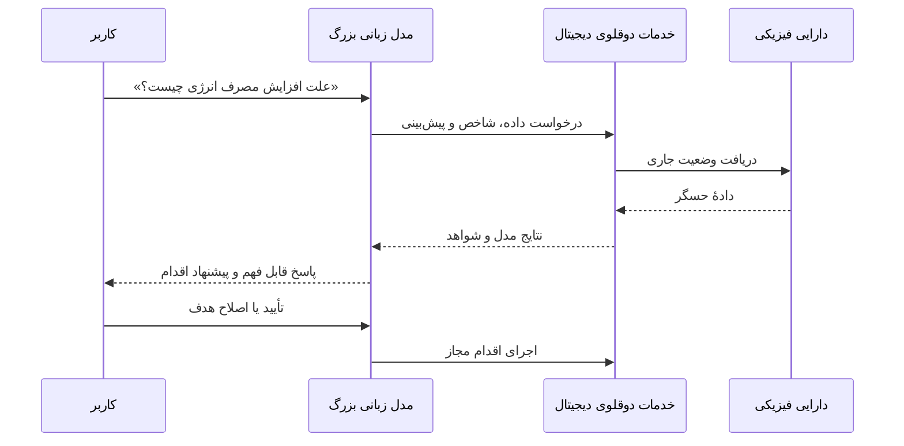

کاربر می‌تواند با فرمان متنی یا صوتی سؤال بپرسد، سناریو درخواست کند یا توضیح هشدار را بخواهد. LLM داده و خروجی مدل‌های تخصصی را دریافت و نتیجه را به زبان طبیعی بیان می‌کند. این حلقهٔ ارتباطی به حرکت از صنعت ۴.۰ به صنعت ۵.۰ انسان‌محور کمک می‌کند.

> **نکتهٔ تکمیلی ـ افزودهٔ نویسندهٔ این نسخه**  
> مدل زبانی نباید به‌تنهایی منبع حقیقت یا کنترل‌کنندهٔ مستقیم یک فرایند بحرانی باشد. معماری مطمئن‌تر شامل اتصال LLM به منابع معتبر دوقلو، بازیابی مبتنی بر سند، کنترل دسترسی، محدودیت ابزارها، ثبت همهٔ دستورات و تأیید انسانی برای اقدامات حساس است. پاسخ باید همراه با منشأ داده، زمان آخرین به‌روزرسانی و سطح عدم‌قطعیت ارائه شود.

---

# ۳. کاربرد یادگیری ماشین در فناوری دوقلوی دیجیتال

تعریف اولیهٔ دوقلو، بازنمایی مجازی یک شیء، فرایند یا سامانهٔ فیزیکی است. برخی دیدگاه‌ها بر مدل ریاضی و برخی بر مصورسازی تأکید دارند. دوقلوی مدرن معمولاً هر دو را ترکیب می‌کند: مدل‌های فیزیکی یا داده‌محور برای تحلیل و مدل‌های دوبعدی یا سه‌بعدی برای ایجاد زمینهٔ بصری.

دوقلوی دیجیتال با شبیه‌سازی یکسان نیست. شبیه‌سازی می‌تواند کاملاً آفلاین باشد، درحالی‌که دوقلو به جریان دادهٔ واقعی متصل است. شبیه‌ساز یکی از اجزای دوقلو است و برای پیش‌بینی، تشخیص عیب یا آزمون تصمیم استفاده می‌شود.

مقاله کاربردها را بر اساس مقیاس بررسی می‌کند:

- سطح واحد؛
- سطح سامانه؛
- سطح سامانه‌ای از سامانه‌ها.

---

## ۳.۱. دوقلوهای دیجیتال برای مواد پیشرفته

دوقلوی دیجیتال مواد، بازنمایی مجازی یک ماده است که رفتار و خواص آن را در شرایط مختلف بررسی می‌کند. این رویکرد امکان طراحی و آزمایش سریع‌تر را بدون اجرای مکرر آزمایش‌های فیزیکی پرهزینه فراهم می‌کند. ماده در سلسله‌مراتب دوقلو معمولاً در **سطح واحد** قرار می‌گیرد.

طرح‌ها و برنامه‌هایی مانند ICME، MGI، MGE، HCPS و صنعت ۴.۰ زیرساخت داده و طراحی مواد را توسعه داده‌اند [112,113]. در علم مواد، روش‌های فیزیکی مانند نظریهٔ تابعی چگالی و دینامیک مولکولی سابقهٔ طولانی دارند؛ اما علاقه به مدل‌های یادگیری ماشین رو به افزایش است.

### ۳.۱.۱. مدل جانشین برای شبیه‌سازی مواد

شبیه‌سازی‌های کوانتومی و مولکولی می‌توانند بسیار زمان‌بر باشند. یک مدل جانشین یادگیری ماشین پس از آموزش می‌تواند خروجی شبیه‌ساز را با هزینهٔ بسیار کمتر تقریب بزند.

Kadupitiya و همکاران مدلی برای تقریب خروجی شبیه‌سازی دینامیک مولکولی ارائه کردند که زمان محاسبه را حدود ده‌هزار برابر کاهش داد، درحالی‌که دقت بالایی حفظ شد [115]. این سرعت، مصورسازی و بهینه‌سازی سریع خواص ماده را ممکن می‌کند.

Shanks و همکاران نیز از فرایند گاوسی محلی به‌عنوان مدل جانشین برای شتاب دادن به بهینه‌سازی بیزی خواص ترموفیزیکی مواد استفاده کردند [116].

### ۳.۱.۲. تصویر مصنوعی و یادگیری ماشین در مقیاس اتمی

Vozza و همکاران با استفاده از شبیه‌سازی ساختار الکترونی، تصاویر مصنوعی میکروسکوپ تونلی روبشی تولید کردند. سپس روش‌هایی مانند YOLO و XGBoost برای ارتباط ساختار اتمی با ویژگی ماده به کار رفتند [117].


این رویکرد امکان ساخت مجموعه‌دادهٔ گسترده را در شرایطی فراهم می‌کند که تصویر آزمایشگاهی کم یا پرهزینه است.

### ۳.۱.۳. مدل خاکستری و دادهٔ مصنوعی

ترکیب دادهٔ آزمایشگاهی با دادهٔ شبیه‌سازی، کامل‌تر شدن مجموعه‌داده و کشف روابط پنهان را ممکن می‌کند. روش‌های پراش و مدل‌های مولد مانند GAN نیز برای تولید داده یا الگوهای مصنوعی به کار می‌روند [118–120].

یادگیری تقویتی نیز در طراحی مواد و بهینه‌سازی مولکول‌ها نتایج امیدوارکننده‌ای داشته است؛ به‌ویژه وقتی مدل تحلیلی دقیقی از سامانه در دسترس نیست [121,122].

### ۳.۱.۴. مدل‌سازی چندمقیاسی مواد

رفتار ماده در طول و زمان‌های مختلف تغییر می‌کند:


#### مقیاس اتمی و مولکولی

- دینامیک مولکولی؛
- مونت‌کارلو؛
- بررسی برهم‌کنش اتمی، ساختار بلوری، نقص و نفوذ.

#### مقیاس میکروسکوپی

- روش اجزای محدود ریزساختار؛
- روش المان گسسته؛
- مدل‌سازی دانه، فاز و نابجایی؛
- پیش‌بینی استحکام، شکل‌پذیری و چقرمگی [127,128].

#### مقیاس ماکروسکوپی

- تحلیل اجزای محدود و مدل‌های پیوسته؛
- پاسخ کلی در برابر بار مکانیکی، حرارتی و شیمیایی؛
- تحلیل عمر و عملکرد در شرایط بهره‌برداری.

### ۳.۱.۵. جمع‌بندی حوزهٔ مواد پیشرفته

یادگیری ماشین در دوقلوی مواد سه مزیت اصلی دارد:

- شتاب دادن به شبیه‌سازی‌های دقیق؛
- بهینه‌سازی ترکیب و ریزساختار؛
- اتصال اطلاعات چند مقیاس.

چالش‌ها:

- ادغام مدل‌های چندمقیاسی و چندفیزیکی؛
- کمبود دادهٔ آزمایشگاهی معتبر؛
- اختلاف میان دادهٔ شبیه‌سازی و واقعی؛
- نبود تعریف و استاندارد کاملاً تثبیت‌شده برای دوقلوی ماده.

مدل‌های مولد برای ساخت دادهٔ مصنوعی یکی از مسیرهای امیدبخش هستند.

> **نکتهٔ تکمیلی ـ افزودهٔ نویسندهٔ این نسخه**  
> یک دوقلوی مادهٔ کامل بهتر است فقط خواص اولیه را مدل نکند؛ بلکه تاریخچهٔ ساخت، ریزساختار، شرایط محیطی، پیری، آسیب تجمعی و عدم‌قطعیت اندازه‌گیری را نیز دنبال کند. به این ترتیب «گذرنامهٔ دیجیتال ماده» می‌تواند در کل چرخهٔ عمر قطعه استفاده شود.

---

## ۳.۲. فرایندهای تولید

دوقلوی دیجیتال از فناوری‌های توانمندساز کلیدی انقلاب صنعتی چهارم است و در سطح **فرایند و ماشین** نقش مهمی دارد [129–134]. در این سطح، همتای دیجیتال نصب‌شده در نرم‌افزار ماشین با سخت‌افزار و فرایند واقعی مانند جوشکاری، ماشین‌کاری، ریخته‌گری، ساخت افزایشی یا شکل‌دهی پلاستیک در ارتباط است.

این دوقلو می‌تواند قابلیت‌های زیر را به ماشین بدهد:

- نظارت؛
- تشخیص؛
- پیش‌بینی؛
- کنترل؛
- خودپایشی؛
- خودکنترلی [135].


### ۳.۲.۱. استاندارد ISO 23247

برخلاف حوزهٔ مواد، برای دوقلوهای تولید چارچوب استاندارد ISO 23247 وجود دارد [136–138]. بر اساس این استاندارد، اجزای فیزیکی و فرایندی باید از طریق ارتباط دستگاه‌ها به یکدیگر متصل و همگام باشند.

بازنمایی دیجیتال موجودیت تولید باید دو نوع اطلاعات داشته باشد:

- **اطلاعات ایستا:** مانند شناسه، هندسه و ظرفیت نامی؛
- **اطلاعات پویا:** مانند دما، نیرو، سرعت، وضعیت ابزار و کیفیت لحظه‌ای.

### ۳.۲.۲. همجوشی حسگر و تخمین سایش ابزار

Caggiano و همکاران برای حفاری آلیاژ تیتانیوم از چند حسگر استفاده کردند. ابتدا ویژگی‌های آماری سیگنال‌ها با PCA ترکیب و بردار الگوی همجوشی حسگر ساخته شد. سپس شبکهٔ عصبی سایش ابزار را تخمین زد [139].

این مدل در یک دوقلو می‌تواند زمان مناسب تعویض ابزار را پیش‌بینی و به سامانهٔ تصمیم‌یار اعلام کند.

### ۳.۲.۳. پردازش تصویر و کنترل جوشکاری

چند پژوهش از پردازش تصویر و یادگیری ماشین برای تخمین آنلاین عرض و عمق نفوذ جوش استفاده کرده‌اند [140–142]. خروجی مدل به حلقهٔ کنترل برمی‌گردد تا سرعت، جریان یا سایر پارامترها اصلاح شوند.

این نمونه نشان می‌دهد که یادگیری ماشین فقط برای پایش نیست؛ بلکه می‌تواند نقش **حسگر نرم** را داشته باشد. حسگر نرم کمیتی را تخمین می‌زند که اندازه‌گیری مستقیم آن دشوار یا پرهزینه است.

### ۳.۲.۴. تخمین فاصلهٔ مشعل با سیگنال صوتی

Chabot و همکاران ویژگی‌های حوزهٔ فرکانس صدای فرایند ساخت افزایشی قوسی سیمی را به رگرسیون خطی دادند تا فاصلهٔ نوک تماس تا قطعه تخمین زده شود [143]. این تخمین امکان ایجاد حلقهٔ بازخورد غیرمستقیم برای کنترل فاصله را فراهم می‌کند.

### ۳.۲.۵. مدل دینامیکی LSTM و کنترل پیش‌بین

Li و همکاران یک مدل بلندمدت از فرایند WAAM بر پایهٔ LSTM ساختند. مدل با استفاده از پارامترهای ورودی و مقادیر گذشته، هندسهٔ لایه را پیش‌بینی می‌کرد. سپس این مدل در کنترل‌کنندهٔ پیش‌بین مدل به کار رفت [144].

جریان کار:


### ۳.۲.۶. تشخیص ناهنجاری با خطای پیش‌بینی

اگر مدل دیجیتال فقط با دادهٔ فرایند سالم آموزش ببیند، اختلاف زیاد میان پیش‌بینی و اندازه‌گیری می‌تواند نشانهٔ ناهنجاری باشد. Reisch و همکاران این ایده را در ساخت افزایشی قوسی بررسی کردند [145].

\[
\text{Residual}_t = y_t - \hat{y}_t
\]

اگر باقی‌مانده از آستانهٔ آماری یا پویا عبور کند، سامانه هشدار می‌دهد.

> **نکتهٔ تکمیلی ـ افزودهٔ نویسندهٔ این نسخه**  
> آستانهٔ ثابت برای همهٔ شرایط مناسب نیست. خطای مدل در سرعت‌ها، مواد و هندسه‌های مختلف تغییر می‌کند. آستانهٔ وابسته به حالت یا مدل احتمالاتی معمولاً هشدار کاذب را کاهش می‌دهد.

### ۳.۲.۷. مدل پیش‌بینی برای بهینه‌سازی پارامتر

Chen و همکاران مدل‌هایی برای پیش‌بینی نیروی محوری و لایه‌لایه‌شدگی در حفاری کامپوزیت ساختند. نقشه‌های حاصل برای انتخاب پارامترهای حفاری بعدی و کاهش آسیب استفاده شدند [146].

Xia و همکاران نیز زبری سطح قطعات ساخت افزایشی را بر اساس پارامترهای فرایند تخمین زدند [147]. چنین مدل ایستایی را می‌توان در حلقهٔ بهینه‌سازی قرار داد تا ترکیب پارامترها با کیفیت بهتر پیدا شود [148].

### ۳.۲.۸. پایش بدون نظارت

در ماشین‌کاری تخلیهٔ الکتریکی، Caggiano و همکاران ویژگی‌های چندحسگری را استخراج و با خوشه‌بندی سلسله‌مراتبی وضعیت فرایند را گروه‌بندی کردند [149,150]. این روش قابلیت نظارت و تشخیص دوقلو را فراهم می‌کند.

Mattera و همکاران نیز پردازش تصویر و خوشه‌بندی را برای پایش آنلاین ساخت افزایشی به کار گرفتند تا ناهنجاری حین رسوب‌گذاری شناسایی شود [151].

### ۳.۲.۹. جمع‌بندی حوزهٔ فرایند تولید

تحقیقات سال‌های اخیر نشان می‌دهد که یادگیری ماشین می‌تواند در هر سه لایهٔ دوقلو حضور داشته باشد:

- در لایهٔ ادراک برای همجوشی حسگر و تخمین حالت؛
- در لایهٔ دیجیتال برای مدل‌سازی ایستا و پویا؛
- در لایهٔ کاربرد برای پایش، کنترل و بهینه‌سازی.

وجود استانداردهای بین‌المللی، پیاده‌سازی صنعتی را تسهیل می‌کند. جهت‌گیری آینده فقط افزایش سرعت و کیفیت نیست؛ بلکه پایداری، کاهش مصرف انرژی، کاهش ضایعات و انسان‌محوری اهمیت بیشتری خواهد یافت.

---

## ۳.۳. سامانه‌های تولید

در مقیاس سامانهٔ تولید، دوقلو در سطح **سامانه‌ای از سامانه‌ها** فعالیت می‌کند. ماشین‌ها، ربات‌ها، نوار نقاله، سلول‌های کاری و خطوط تولید با یکدیگر در ارتباط‌اند [152,153].

داده از حسگرها، تجهیزات اینترنت اشیا و سامانهٔ اجرای تولید یا MES دریافت می‌شود و وضعیت کل کارخانه را بازنمایی می‌کند [154].

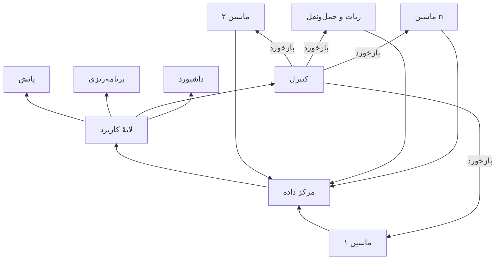

کاربردهای اصلی یادگیری ماشین در این سطح:

- پایش و کنترل بلادرنگ؛
- تعمیرات پیش‌بینانه؛
- برنامه‌ریزی و زمان‌بندی تولید؛
- راه‌اندازی مجازی؛
- بازپیکربندی خط تولید؛
- تصمیم‌گیری داده‌محور [155].

### ۳.۳.۱. کشف خودکار مدل شبیه‌سازی

Lugaresi و Matta روشی برای کشف خودکار ساختار سامانهٔ تولید از گزارش رویداد و تولید مدل شبیه‌سازی رویدادگسسته ارائه کردند [156].

مراحل کلی:

1. استخراج رخدادها از لاگ تولید؛
2. فرایندکاوی برای کشف توپولوژی؛
3. برآورد زمان پردازش، صف و خرابی؛
4. تولید مدل DES؛
5. استفاده از مدل برای پیش‌بینی و تصمیم بلادرنگ.

این روش زمان ساخت شیء دیجیتال را کاهش می‌دهد. دوقلو می‌تواند سناریوهای متعدد را شبیه‌سازی و با یادگیری تقویتی یا سامانهٔ تصمیم‌یار بهترین اقدام را انتخاب کند [157,158].

### ۳.۳.۲. بازپیکربندی و راه‌اندازی مجازی

در تولید انعطاف‌پذیر، چیدمان و ماژول‌ها باید با تغییر محصول سازگار شوند. Zhang رویکردی برای مدل‌سازی بازپیکربندی‌پذیر ارائه کرد که از تحلیل داده، خوشه‌بندی و تطبیق شباهت برای شناسایی ماژول‌های قابل استفاده و ساخت پیکربندی‌های جایگزین بهره می‌گیرد [96,103].

دوقلو امکان آزمون مجازی پیکربندی‌های جدید را پیش از تغییر واقعی کارخانه فراهم می‌کند. در نتیجه، ریسک توقف، برخورد تجهیز و کاهش ظرفیت پایین می‌آید.

### ۳.۳.۳. زمان‌بندی با الگوریتم ژنتیک و یادگیری تقویتی

Zhang و همکاران الگوریتم ترکیبی ژنتیک و یادگیری تقویتی را برای تولید برنامهٔ زمانی بهینه به کار گرفتند [103]. دوقلو نقش نسخهٔ مجازی کف کارخانه را دارد و سناریوهای برنامه‌ریزی در آن ارزیابی می‌شوند.

یادگیری ماشین برای پیش‌پردازش داده، انتخاب ویژگی و آموزش مدل به بهبود الگوریتم بهینه‌سازی کمک می‌کند.

### ۳.۳.۴. زمان‌بندی با DQN

Waschneck و همکاران عامل شبکهٔ Q عمیق را برای زمان‌بندی تولید نیمه‌رسانا آموزش دادند [102]. حالت سامانه شامل مواردی مانند:

- در دسترس بودن ماشین؛
- موعد تحویل کار؛
- زمان تنظیم؛
- بار صف.

عامل با آزمودن سیاست‌های مختلف، کاهش تأخیر و افزایش نرخ خروجی را می‌آموزد.

### ۳.۳.۵. نگهداری و تعمیرات با یادگیری تقویتی

Siraskar و همکاران کاربرد یادگیری تقویتی در تعمیرات پیش‌بینانه را مرور کردند [104]. عامل بر اساس دادهٔ پایش وضعیت تصمیم می‌گیرد چه زمانی تعمیر انجام شود تا:

- توقف تولید کمینه شود؛
- هزینهٔ تعمیر پایین بیاید؛
- قابلیت اطمینان ماشین حفظ شود.

### ۳.۳.۶. چالش‌های یادگیری تقویتی در سامانهٔ تولید

- نیاز به حجم زیاد تجربهٔ آموزشی؛
- مقیاس‌پذیری در کارخانه‌های بزرگ؛
- دشواری توضیح تصمیم عامل؛
- تغییر مداوم سفارش، ماشین و محدودیت؛
- خطر آزمون تصمیم نامطمئن روی سامانهٔ واقعی.

راهکارهای مطرح‌شده:

- یادگیری انتقالی [159]؛
- یادگیری تقویتی سلسله‌مراتبی [160]؛
- یادگیری تقویتی توضیح‌پذیر [161].

### ۳.۳.۷. جمع‌بندی حوزهٔ سامانهٔ تولید

ترکیب دوقلو و یادگیری ماشین امکان بهینه‌سازی منابع، تولید مدل خودکار، زمان‌بندی و نگهداری هوشمند را فراهم می‌کند. ماهیت چندمقیاسی دوقلو سبب می‌شود دادهٔ هر ماشین برای تحلیل عملکرد شبکهٔ تولید نیز به کار رود.

مسیر بعدی، تشخیص ناهنجاری در سطح شبکهٔ کارخانه‌ها و بررسی وابستگی‌های بین‌کارخانه‌ای است؛ یعنی گذار از پایش تک‌ماشین به پایش سامانه‌ای از سامانه‌ها.

> **نکتهٔ تکمیلی ـ افزودهٔ نویسندهٔ این نسخه**  
> در سطح کارخانه، مدل گرافی طبیعی است: ماشین، بافر و ایستگاه به‌عنوان گره و جریان مواد، انرژی یا اطلاعات به‌عنوان یال در نظر گرفته می‌شوند. شبکهٔ عصبی گرافی می‌تواند خرابی یا گلوگاه را با توجه به وابستگی اجزا تحلیل کند و برای دوقلوهای سامانه‌ای از سامانه‌ها گزینه‌ای مهم است.

---

## ۳.۴. محیط ساخته‌شده و انرژی پاک

ساختمان‌ها باید ضمن حفظ آسایش ساکنان، مصرف انرژی را کاهش دهند و با تولید متغیر انرژی تجدیدپذیر و بار شبکه سازگار شوند. **انعطاف‌پذیری انرژی** به معنی توانایی ساختمان برای تغییر زمان و مقدار مصرف یا تولید بر اساس آب‌وهوا، حضور افراد، تعرفه، بار شبکه و منابع تجدیدپذیر است [162].

دوقلوی ساختمان باید تعامل حرارتی میان اجزای زیر را بازنمایی کند:

- گرمای داخلی؛
- الگوی حضور؛
- شرایط اقلیمی؛
- دیوار، پنجره و جرم حرارتی؛
- پمپ حرارتی و HVAC؛
- پنل خورشیدی؛
- خودروی برقی؛
- ذخیره‌ساز انرژی.

### ۳.۴.۱. مدل جعبه‌سفید

نرم‌افزارهایی مانند EnergyPlus، TRNSYS و Modelica مدل‌های فیزیکی رفتار حرارتی و انرژی ساختمان را ایجاد می‌کنند [163].

مزیت: تفسیر فیزیکی و امکان آزمون سناریو.  
محدودیت: نیاز به اطلاعات دقیق ساختمان و هزینهٔ کالیبراسیون.

### ۳.۴.۲. مدل جعبه‌سیاه

مدل‌های آماری و یادگیری ماشین رابطهٔ داده‌های آب‌وهوا، حضور، کنترل و مصرف انرژی را می‌آموزند. این مدل‌ها برای پیش‌بینی بار و مصرف مناسب‌اند، اما خارج از شرایط آموزشی ممکن است ضعیف باشند.

### ۳.۴.۳. مدل خاکستری یا ترکیبی

Lin و همکاران مدل دینامیکی HVAC را با Modelica ساختند، اما برخی پارامترها مانند خواص فیزیکی دیوار با روش داده‌محور تخمین زده شدند [164]. این نمونه مدل فیزیکی را با کالیبراسیون داده‌محور ترکیب می‌کند.

روش دیگر آن است که مدل فیزیکی ساخته شود و سپس راهبرد کنترل با MPC یا الگوریتم یادگیری ماشین روی آن آزمایش شود [165,166]. یادگیری تقویتی نیز در لایهٔ کاربرد برای مدیریت انرژی استفاده می‌شود [167,168].

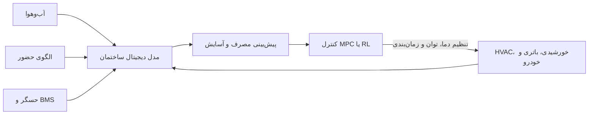

### ۳.۴.۴. دوقلو فراتر از مدل انرژی

مدل انرژی فقط یک جزء دوقلو است. دوقلو باید دادهٔ واقعی تجهیزات را از طریق اینترنت اشیا دریافت و به بازنمایی مجازی نگاشت کند [169].

پلتفرم Data Clearing House به‌عنوان مخزن یکپارچهٔ دادهٔ سری زمانی و فراداده عمل می‌کند. داده‌ها به مدل معنایی مبتنی بر Brick Schema نگاشت می‌شوند [170,171].

مزایای این رویکرد:

- دریافت داده از BMS و تجهیزات اینترنت اشیا؛
- حل ناسازگاری نام‌گذاری متغیرها؛
- افزایش قابلیت همکاری؛
- افزودن آسان مدل‌های تحلیلی جدید؛
- مقیاس‌پذیری در ساختمان‌های مختلف.

### ۳.۴.۵. پایش ناکارآمدی انرژی

Talei و همکاران از تحلیل سری زمانی و یادگیری بدون نظارت برای کشف ناکارآمدی مصرف HVAC استفاده کردند [172]. روش آن‌ها بازه‌هایی را مشخص می‌کرد که مصرف سیستم می‌توانست کاهش یابد.

نتیجهٔ این ماژول پایش می‌تواند وارد سامانهٔ تصمیم‌یار یا کنترل پیشرفته شود تا عملکرد و پایداری ساختمان بهبود یابد.

### ۳.۴.۶. جمع‌بندی حوزهٔ ساختمان و انرژی

دوقلوی ساختمان از سه مؤلفهٔ مکمل بهره می‌برد:

- مدل فیزیکی یا ترکیبی برای پیش‌بینی؛
- زیرساخت داده و معناشناسی برای یکپارچگی؛
- یادگیری ماشین برای پایش و بهینه‌سازی.

> **نکتهٔ تکمیلی ـ افزودهٔ نویسندهٔ این نسخه**  
> آسایش ساکنان، کیفیت هوای داخل، حفظ حریم خصوصی دادهٔ حضور و قابلیت توضیح تصمیم کنترل‌کننده باید هم‌زمان با کاهش انرژی در تابع هدف لحاظ شوند. کمینه کردن مصرف بدون قید آسایش می‌تواند راه‌حلی نامطلوب تولید کند.

---

# ۴. نتیجه‌گیری

این مقاله یک چارچوب عمومی برای دوقلوی دیجیتال ارائه و کاربرد آن را در چند حوزه بررسی می‌کند. نتیجهٔ اصلی آن است که آمار و یادگیری ماشین در توسعه و یکپارچه‌سازی دوقلوها نقشی اساسی دارند.

ویژگی‌های برجستهٔ دوقلوی دیجیتال عبارت‌اند از:

- ماهیت چندرشته‌ای؛
- ساختار چندمقیاسی؛
- اتصال پیوستهٔ جهان فیزیکی و دیجیتال؛
- ترکیب مدل، داده، تحلیل و تصمیم.

یادگیری ماشین در چهار فعالیت محوری به کار می‌رود:

1. **مدل‌سازی:** ساخت مدل ایستا، پویا و جانشین؛
2. **مصورسازی:** کاهش ابعاد و نمایش دادهٔ پیچیده؛
3. **پایش:** تشخیص ناهنجاری، خرابی و وضعیت؛
4. **بهینه‌سازی:** انتخاب پارامتر، برنامه‌ریزی، کنترل و نگهداری.

مقاله هم روش‌های کلاسیک مانند رگرسیون، PCA، خوشه‌بندی و منطق فازی را بررسی می‌کند و هم روش‌های جدیدتر مانند شبکه‌های عمیق، یادگیری تقویتی، مدل‌های مولد و مدل‌های زبانی بزرگ را.

حوزه‌های بررسی‌شده شامل مواد پیشرفته، فرایندهای تولید، سامانه‌های تولید و محیط ساخته‌شده است. در هر حوزه، دوقلوی دیجیتال می‌تواند به افزایش کیفیت، کاهش ضایعات، کاهش مصرف انرژی، پیش‌بینی خرابی و تصمیم‌گیری بهتر کمک کند.

با وجود پیشرفت‌ها، چالش‌های اصلی همچنان عبارت‌اند از:

- کمبود دادهٔ نماینده در شرایط مرزی و خطرناک؛
- بیش‌برازش و ضعف تعمیم؛
- هزینهٔ محاسباتی مدل‌های دقیق؛
- ادغام مدل‌های چندفیزیکی و چندمقیاسی؛
- دشواری تفسیر مدل‌های پیچیده؛
- نبود استانداردهای مشترک در همهٔ حوزه‌ها؛
- مدیریت داده، امنیت و همگام‌سازی بلادرنگ.

در مجموع، یادگیری ماشین فناوری مکمل دوقلوی دیجیتال نیست، بلکه در بسیاری از معماری‌های جدید یکی از اجزای مرکزی آن است.

---

# تحلیل تکمیلی و مسیرهای پژوهشی

> **کل این بخش افزودهٔ نویسندهٔ این نسخه است و مستقیماً بخشی از مقالهٔ اصلی نیست.**

## الف. نقاط قوت مقاله

- ارائهٔ یک معماری لایه‌ای ساده و قابل تعمیم؛
- پیوند دادن روش‌های یادگیری ماشین با هر لایه؛
- نگاه چندمقیاسی از ماده تا کارخانه و ساختمان؛
- توجه هم‌زمان به مدل‌سازی، پایش، کنترل و تعامل انسانی؛
- استفاده از نمونه‌های واقعی در تولید و مواد؛
- اشاره به استاندارد ISO 23247 و AAS.

## ب. محدودیت‌های مرور

- امنیت سایبری دوقلو به‌صورت مستقل و عمیق بررسی نشده است؛
- روش نظام‌مند جست‌وجو و غربال مقالات مانند مرورهای سیستماتیک کامل گزارش نشده است؛
- معیارهای کمی مقایسهٔ روش‌ها ارائه نشده‌اند؛
- مباحث عدم‌قطعیت، کالیبراسیون آنلاین و رانش مدل محدودند؛
- پردازش لبه و محدودیت تأخیر ارتباطی کمتر مورد توجه قرار گرفته است؛
- رابطهٔ دقیق LLM با کنترل ایمن صنعتی نیازمند چارچوب سخت‌گیرانه‌تری است.

## ج. مسائل باز مهم

### ۱. همگام‌سازی چندمقیاسی

هر مقیاس نرخ زمانی و مدل متفاوتی دارد. تغییر سریع فرایند باید به مدل ماشین و سپس مدل کارخانه منتقل شود؛ در مقابل، تصمیم سطح کارخانه باید به فرمان سطح ماشین تبدیل گردد. طراحی رابط میان مقیاس‌ها یک مسئلهٔ باز است.

### ۲. عدم‌قطعیت

خروجی دوقلو بهتر است فقط یک مقدار قطعی نباشد. برای تصمیم حساس باید بازهٔ اطمینان، احتمال خرابی و منشأ عدم‌قطعیت گزارش شود. روش‌های بیزی، ensemble و فرایند گاوسی برای این هدف مناسب‌اند.

### ۳. رانش داده و فرسودگی مدل

با سایش، تغییر ماده، تعمیر ماشین یا تغییر شرایط محیطی، توزیع داده عوض می‌شود. دوقلو باید رانش را تشخیص دهد و مدل را با کنترل کیفیت دوباره کالیبره کند.

### ۴. امنیت سایبری و اعتماد

حمله می‌تواند دادهٔ حسگر، مدل، فرمان کنترل یا کانال ارتباطی را هدف قرار دهد. یک دوقلوی امن باید:

- اصالت و تمامیت داده را بررسی کند؛
- رفتار غیرممکن فیزیکی را تشخیص دهد؛
- مدل و داده را نسخه‌بندی کند؛
- دسترسی را حداقل‌سازی کند؛
- مسیر تصمیم تا دادهٔ منبع را ثبت کند؛
- در شرایط عدم اطمینان به حالت امن برود.

### ۵. مدل‌های آگاه از فیزیک

ترکیب شبکهٔ عصبی با معادلات فیزیکی می‌تواند نیاز به داده را کاهش و تعمیم را بهتر کند. فیزیک ممکن است در معماری، تابع هزینه، قیود خروجی یا تولید داده وارد شود.

### ۶. مدل‌های گرافی

برای کارخانه، شبکهٔ انرژی و سامانه‌های اجزای متصل، نمایش گرافی طبیعی است. گره می‌تواند حسگر، ماشین یا زیرسامانه و یال می‌تواند اتصال فیزیکی، جریان ماده، وابستگی کنترل یا ارتباط داده باشد.

### ۷. دوقلوی انسان‌محور

هدف فقط خودکارسازی نیست. دوقلو باید دلیل هشدار، اثر تصمیم و سطح اطمینان را به کاربر توضیح دهد. LLM می‌تواند رابط باشد، اما تصمیم نهایی حساس باید تحت قیود ایمنی و نظارت انسانی قرار گیرد.

### ۸. MLOps برای دوقلوی دیجیتال

چرخهٔ عمر مدل شامل آموزش، اعتبارسنجی، استقرار، پایش، بازآموزی و بازنشستگی است. بدون MLOps، مدل پس از مدتی از وضعیت واقعی فاصله می‌گیرد و دوقلو به «نسخهٔ دیجیتال قدیمی» تبدیل می‌شود.

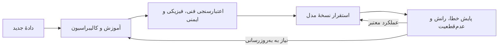

## د. چارچوب پیشنهادی برای ارزیابی یک دوقلوی مبتنی بر یادگیری ماشین

یک پژوهش کامل بهتر است معیارهای زیر را گزارش کند:

| بُعد | سؤال ارزیابی |
|---|---|
| دقت | خطای پیش‌بینی یا تشخیص چقدر است؟ |
| تعمیم | در شرایط جدید و مرزی چه عملکردی دارد؟ |
| بلادرنگ بودن | تأخیر استنتاج و به‌روزرسانی چقدر است؟ |
| عدم‌قطعیت | آیا سطح اطمینان خروجی گزارش می‌شود؟ |
| تفسیرپذیری | آیا دلیل تصمیم قابل توضیح است؟ |
| پایداری | در برابر نویز، دادهٔ گمشده و خرابی حسگر مقاوم است؟ |
| امنیت | در برابر دست‌کاری داده و فرمان چه حفاظتی دارد؟ |
| قابلیت همکاری | آیا از استاندارد و فرادادهٔ مشترک استفاده می‌کند؟ |
| مقیاس‌پذیری | از یک واحد به چند ماشین یا سایت قابل توسعه است؟ |
| پایداری زیست‌محیطی | اثر آن بر انرژی، مواد و ضایعات چیست؟ |

---

# راهنمای انتخاب روش یادگیری ماشین

| لایه/هدف | نوع داده | روش‌های مناسب | خروجی نمونه |
|---|---|---|---|
| همجوشی حسگر | سری زمانی چندحسگری | Kalman، رگرسیون، Bayesian، NN | تخمین حالت |
| حذف پرت | دادهٔ بدون برچسب | MCD، DBSCAN، Isolation Forest | امتیاز ناهنجاری |
| مدل ایستا | ورودی/خروجی مستقل از زمان | رگرسیون، SVR، MLP، Gaussian Process | کیفیت یا خاصیت |
| مدل پویا | سری زمانی | ARX، RNN، LSTM، GRU، State-space | پیش‌بینی آینده |
| طبقه‌بندی عیب | سیگنال یا تصویر برچسب‌دار | SVM، CNN، XGBoost، Transformer | نوع عیب |
| پایش بدون برچسب | ویژگی‌های فرایند | K-means، Hierarchical، Autoencoder | وضعیت یا خوشه |
| کاهش ابعاد | دادهٔ پرابعاد | PCA، UMAP، t-SNE | نمایش ۲بعدی/۳بعدی |
| کنترل گسسته | حالت و اعمال محدود | Q-learning، DQN | سیاست انتخاب عمل |
| کنترل پیوسته | فرمان پیوسته | Policy Gradient، PPO، Actor-Critic | مقدار فرمان |
| بهینه‌سازی ماده یا فرایند | تابع هدف پرهزینه | Bayesian Optimization، RL، GA | پارامتر بهینه |
| تعامل انسانی | متن، داده و ابزار دوقلو | LLM + RAG + Tool Use | پاسخ و پیشنهاد |

## قاعدهٔ عملی انتخاب مدل

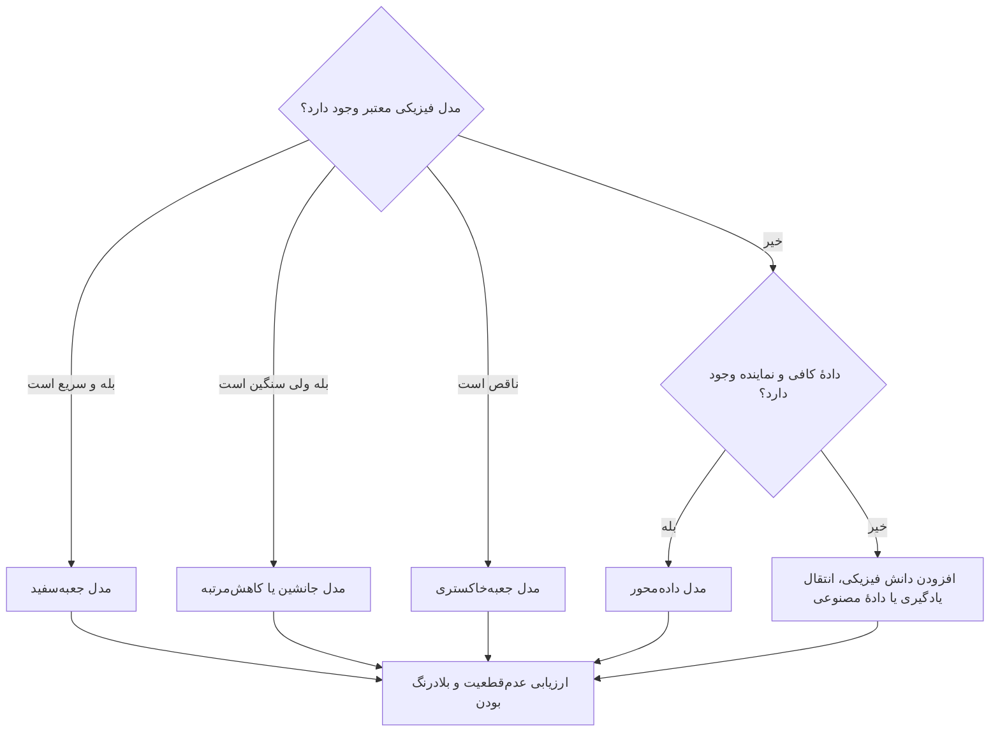

---

# واژه‌نامهٔ اختصارات

| اختصار | عبارت انگلیسی | معادل فارسی |
|---|---|---|
| DT | Digital Twin | دوقلوی دیجیتال |
| CPS | Cyber-Physical System | سامانهٔ سایبرفیزیکی |
| IoT | Internet of Things | اینترنت اشیا |
| AI | Artificial Intelligence | هوش مصنوعی |
| ML | Machine Learning | یادگیری ماشین |
| FEA | Finite Element Analysis | تحلیل اجزای محدود |
| FEM | Finite Element Method | روش اجزای محدود |
| DEM | Discrete Element Method | روش المان گسسته |
| MD | Molecular Dynamics | دینامیک مولکولی |
| MC | Monte Carlo | مونت‌کارلو |
| DFT | Density Functional Theory | نظریهٔ تابعی چگالی |
| OLS | Ordinary Least Squares | حداقل مربعات معمولی |
| KF | Kalman Filter | فیلتر کالمن |
| MCD | Minimum Covariance Determinant | دترمینان کوواریانس کمینه |
| DBSCAN | Density-Based Spatial Clustering of Applications with Noise | خوشه‌بندی چگالی‌مبنا با نویز |
| PCA | Principal Component Analysis | تحلیل مؤلفه‌های اصلی |
| t-SNE | t-Distributed Stochastic Neighbor Embedding | تعبیهٔ همسایهٔ تصادفی t-توزیع‌شده |
| UMAP | Uniform Manifold Approximation and Projection | تقریب و تصویرسازی منیفلد یکنواخت |
| ANN | Artificial Neural Network | شبکهٔ عصبی مصنوعی |
| RNN | Recurrent Neural Network | شبکهٔ عصبی بازگشتی |
| LSTM | Long Short-Term Memory | حافظهٔ بلندکوتاه‌مدت |
| GRU | Gated Recurrent Unit | واحد بازگشتی دروازه‌دار |
| AR | AutoRegressive | خودرگرسیو |
| ARX | AutoRegressive with eXogenous Input | خودرگرسیو با ورودی برون‌زا |
| RL | Reinforcement Learning | یادگیری تقویتی |
| DQN | Deep Q-Network | شبکهٔ Q عمیق |
| DSS | Decision Support System | سامانهٔ پشتیبان تصمیم |
| LLM | Large Language Model | مدل زبانی بزرگ |
| NLP | Natural Language Processing | پردازش زبان طبیعی |
| AAS | Asset Administration Shell | پوستهٔ مدیریت دارایی |
| SQL | Structured Query Language | زبان پرس‌وجوی ساخت‌یافته |
| NoSQL | Not Only SQL | خانوادهٔ پایگاه‌های غیررابطه‌ای |
| ACID | Atomicity, Consistency, Isolation, Durability | اتمی بودن، سازگاری، جداسازی و ماندگاری |
| MES | Manufacturing Execution System | سامانهٔ اجرای تولید |
| DES | Discrete Event Simulation | شبیه‌سازی رویدادگسسته |
| MPC | Model Predictive Control | کنترل پیش‌بین مدل |
| HVAC | Heating, Ventilation and Air Conditioning | گرمایش، تهویه و مطبوع‌سازی |
| BMS | Building Management System | سامانهٔ مدیریت ساختمان |
| WAAM | Wire Arc Additive Manufacturing | ساخت افزایشی قوسی سیمی |
| STM | Scanning Tunnelling Microscopy | میکروسکوپی تونلی روبشی |
| GAN | Generative Adversarial Network | شبکهٔ مولد تخاصمی |
| SoS | System of Systems | سامانه‌ای از سامانه‌ها |

---


# اطلاعات تکمیلی انتشار مقاله

- **قدردانی:** نویسندگان از حمایت پروژهٔ NEMESI متعلق به INVITALIA قدردانی کرده‌اند.
- **تأمین مالی:** مقاله اعلام می‌کند که پژوهش، تأمین مالی خارجی نداشته است.
- **دسترس‌پذیری داده:** در این مطالعه مجموعه‌دادهٔ جدیدی تولید یا تحلیل نشده است.
- **تعارض منافع:** نویسندگان اعلام کرده‌اند که تعارض منافع ندارند.
- **مشارکت نویسندگان:** مفهوم‌پردازی توسط GM، EY، SV و MV؛ روش‌شناسی و بررسی توسط گروه نویسندگان؛ نگارش پیش‌نویس اولیه توسط GM، EY، SV و MV و بازبینی نهایی توسط همهٔ نویسندگان انجام شده است.
- **مجوز انتشار:** مقاله با مجوز `CC BY-NC-ND 4.0` منتشر شده است. این مجوز اشتراک‌گذاری غیرتجاری با ذکر منبع را مجاز می‌داند، اما انتشار نسخهٔ تغییر‌یافته یا اقتباسی را محدود می‌کند. برای بازنشر عمومی این متن فارسی، شرایط مجوز و اجازهٔ صاحب حق باید بررسی شود.

---

# منابع مقاله

> منابع زیر با شماره‌های ارجاع‌شده در متن مقالهٔ اصلی مطابقت دارند. عنوان‌ها و اطلاعات کتاب‌شناختی به زبان اصلی حفظ شده‌اند.

1. Tao F, Qi Q, Wang L, Nee AYC. Digital twins and cyber–physical systems toward smart manufacturing and industry 4.0: correlation and comparison. Engineering. 2019;5(4):653–61.
2. Wu J, Yang Y, Cheng XUN, Zuo H, Cheng Z. The development of digital twin technology review. Chin Autom Congress. 2020;2020:4901–6.
3. Josifovska K, Yigitbas E, Engels G, Reference framework for digital twins within cyber-physical systems, in 2019 IEEE/ACM 5th International Workshop on Software Engineering for Smart Cyber-Physical Systems (SEsCPS), 2019, pp. 25–31.
4. Monostori L, et al. Cyber-physical systems in manufacturing. CIRP Ann. 2016;65(2):621–41. https://doi.org/10.1016/j.cirp.2016.06.005.
5. Javaid M, Haleem A, Suman R. Digital twin applications toward industry 4.0: A review. Cogn Robot. 2023;3:71–92.
6. Yao J-F, Yang Y, Wang X-C, Zhang X-P. Systematic review of digital twin technology and applications. Vis Comput Ind Biomed Art. 2023;6(1):10.
7. Nwogu C, Lugaresi G, Anagnostou A, Matta A, Taylor SJE. Towards a requirement-driven digital twin architecture. Procedia CIRP. 2022;107:758–63.
8. Protic A, Jin Z, Marian R, Abd K, Campbell D, Chahl J. Implementation of a bi-directional digital twin for industry 4 labs in academia: a solution based on OPC UA. IEEE Int Conf Ind Eng Eng Manag. 2020;2020:979–83.
9. G. Mattera, J. Polden, A. Caggiano, L. Nele, Z. Pan, and J. Norrish, “Semi-supervised Learning for Real-Time Anomaly Detection in Pulsed Transfer Wire Arc Additive Manufacturing,” J Manuf Process, 2024.
10. Lee J, Bagheri B, Kao H-A. A Cyber-Physical Systems architecture for Industry 4.0-based manufacturing systems. Manuf Lett. 2015;3:18–23. https://doi.org/10.1016/j.mfglet.2014.12.001.
11. Zhu Z, Liu C, Xu X. Visualisation of the digital twin data in manufacturing by using augmented reality. Procedia CIRP. 2019;81:898–903.
12. Liu M, Fang S, Dong H, Xu C. Review of digital twin about concepts, technologies, and industrial applications. J Manuf Syst. 2021;58:346–61.
13. Cimino C, Negri E, Fumagalli L. Review of digital twin applications in manufacturing. Comput Ind. 2019;113:103130. https://doi.org/10.1016/j.compind.2019.103130.
14. Qian C, Liu X, Ripley C, Qian M, Liang F, Yu W. Digital twin—cyber replica of physical things: architecture, applications and future research directions. Fut Internet. 2022;14(2):64. https://doi.org/10.3390/fi14020064.
15. Khan M, Wu X, Xu X, Dou W, Big data challenges and opportunities in the hype of Industry 4.0, in 2017 IEEE International Conference on Communications (ICC), IEEE, May 2017, pp. 1–6. https://doi.org/10.1109/ICC.2017.7996801.
16. Guo X, et al. A digital twin modeling method for array antenna assembly performance real-time analysis. Int J Adv Manuf Technol. 2023;126(7–8):3765–81. https://doi.org/10.1007/s00170-023-11324-1.
17. Eghbalian M, Ansari R, Haghighi S. A combined molecular dynamics-finite element multiscale modeling to analyze the mechanical prop- erties of randomly dispersed, chemisorbed carbon nanotubes/polymer nanocomposites. Mech Adv Mater Struct. 2023;30(24):5159–75. https://doi.org/10.1080/15376494.2022.2114038.
18. Doodman Tipi AR, Pariz N, and others, Improving the dynamic metal transfer model of gas metal arc welding (GMAW) process, in The International Journal of Advanced Manufacturing Technology, vol. 76, no. 1, pp. 657–668, 2015.
19. Xiao J, Liu N, Lua J, Saathoff C, Seneviratne WP, Data-Driven and Reduced-Order Modeling of Composite Drilling, in AIAA Scitech 2020 Forum, Reston, Virginia: American Institute of Aeronautics and Astronautics, 2020. https://doi.org/10.2514/6.2020-1859.
20. Deng T, Zhang K, Shen Z-JM. A systematic review of a digital twin city: a new pattern of urban governance toward smart cities. J Manag Sci Eng. 2021;6(2):125–34.
21. Farsi M, Daneshkhah A, Hosseinian-Far A, Jahankhani H, and others, Digital twin technologies and smart cities, vol. 1134. Springer, 2020.
22. Tuhaise VV, Tah JHM, Abanda FH. Technologies for digital twin applications in construction. Autom Constr. 2023;152:104931.
23. Opoku D-GJ, Perera S, Osei-Kyei R, Rashidi M. Digital twin application in the construction industry: a literature review. J Build Eng. 2021;40:102726.
24. Yang B, Lv Z, Wang F. Digital twins for intelligent green buildings. Buildings. 2022;12(6):856.
25. Vallée A. Digital twin for healthcare systems. Front Digit Health. 2023;5:1253050.
26. Rabah S, et al. Towards improving the future of manufacturing through digital twin and augmented reality technologies. Procedia Manuf. 2018;17:460–7.
27. Yin Y, Zheng P, Li C, Wang L. A state-of-the-art survey on Augmented Reality-assisted Digital Twin for futuristic human-centric industry transformation. Robot Comput Integr Manuf. 2023;81:102515.
28. Glaessgen E, and Stargel D, The digital twin paradigm for future NASA and US Air Force vehicles, in 53rd AIAA/ASME/ASCE/AHS/ASC structures, structural dynamics and materials conference 20th AIAA/ASME/AHS adaptive structures conference 14th AIAA, 2012, p. 1818.
29. Converso G, Gallo M, Murino T, Vespoli S. Predicting failure probability in Industry 4.0 production systems: a workload-based prognostic model for maintenance planning. Appl Sci. 2023;13(3):1938.
30. Caggiano A, Mattera G, Nele L. Smart tool wear monitoring of CFRP/CFRP stack drilling using autoencoders and memory-based neural networks. Appl Sci. 2023;13(5):3307.
31. Nele L, Mattera G, Vozza M. Deep neural networks for defects detection in gas metal arc welding. Appl Sci. 2022;12(7):3615.
32. Tao F, Xiao B, Qi Q, Cheng J, Ji P. Digital twin modeling. J Manuf Syst. 2022;64:372–89.
33. Caggiano A, Perez R, Segreto T, Teti R, Xirouchakis P. Advanced sensor signal feature extraction and pattern recognition for wire EDM process monitoring. Procedia CIRP. 2016;42:34–9. https://doi.org/10.1016/j.procir.2016.02.181.
34. Zhao S, Qiu X, Burnett I, Rigby M, Lele A. A lumped-parameter model for sound generation in gas metal arc welding. Mech Syst Signal Process. 2021;147:107085.
35. Xia C, et al. Model predictive control of layer width in wire arc additive manufacturing. J Manuf Process. 2020;58:179–86.
36. He R, Chen G, Dong C, Sun S, Shen X. Data-driven digital twin technology for optimized control in process systems. ISA Trans. 2019;95:221–34.
37. Bikas H, Stavropoulos P, Chryssolouris G. Additive manufacturing methods and modelling approaches: a critical review. Int J Adv Manuf Technol. 2016;83:389–405.
38. Jung TJ, Jeong YH, Shin Y. Simulation of directional drilling by dynamic finite element method. J Mech Sci Technol. 2022;36(7):3239–50.
39. Li JY, Yao XX, Zhang Z. Physical model based on data-driven analysis of chemical composition effects of friction stir welding. J Mater Eng Perform. 2020;29:6591–604.
40. Dhar R, Krishna A, and Muhammed B, Physics and data driven model for prediction of residual stresses in machining, arXiv preprint arXiv: 2403.18441, 2024.
41. Li H, Shi X, Wu B, Corradi DR, Pan Z, Li H. Wire arc additive manufacturing: a review on digital twinning and visualization process. J Manuf Process. 2024;116:293–305. https://doi.org/10.1016/j.jmapro.2024.03.001.
42. G. MATTERA, J. POLDEN, and L. NELE, “Monitoring Wire Arc Additive Manufacturing process of Inconel 718 thin-walled structure using wavelet decomposition and clustering analysis of welding signal,” Journal of Advanced Manufacturing Science and Technology, vol. 0, no. 0, pp. 2025006–0, 2024, https://doi.org/10.51393/j.jamst.2025006.
43. Farhadi A, Lee SKH, Hinchy EP, O’Dowd NP, McCarthy CT. The development of a digital twin framework for an industrial robotic drilling process. Sensors. 2022;22(19):7232.
44. C. Gao, H. Park, and A. Easwaran, “An anomaly detection framework for digital twin driven cyber-physical systems,” in Proceedings of the ACM/IEEE 12th International Conference on Cyber-Physical Systems, 2021, pp. 44–54.
45. Zhang H, Qi Q, Tao F. A multi-scale modeling method for digital twin shop-floor. J Manuf Syst. 2022;62:417–28.
46. Sasiadek JZ. Sensor fusion. Annu Rev Control. 2002;26(2):203–28.
47. S. Yazdkhasti and J. Z. Sasiadek, “Multi sensor fusion based on adaptive Kalman filtering,” in Advances in Aerospace Guidance, Navigation and Control: Selected Papers of the Fourth CEAS Specialist Conference on Guidance, Navigation and Control Held in Warsaw, Poland, April 2017, 2018, pp. 317–333.
48. Giacalone M, Panarello D, Mattera R. Multicollinearity in regression: an efficiency comparison between Lp-norm and least squares esti- mators. Qual Quant. 2018;52(4):1831–59. https://doi.org/10.1007/s11135-017-0571-y.
49. Subrahmanya N, Shin YC, Meckl PH. A Bayesian machine learning method for sensor selection and fusion with application to on-board fault diagnostics. Mech Syst Signal Process. 2010;24(1):182–92.
50. Ding D, He F, Yuan L, Pan Z, Wang L, Ros M. The first step towards intelligent wire arc additive manufacturing: an automatic bead mod- elling system using machine learning through industrial information integration. J Ind Inf Integr. 2021;23:100218. https://doi.org/10.1016/j.jii.2021.100218.
51. Mattera G, Caggiano A, Nele L. Reinforcement learning as data-driven optimization technique for GMAW process. Weld World. 2023. https://doi.org/10.1007/s40194-023-01641-0.
52. Xiong J, Zhang G, Hu J, Wu L. Bead geometry prediction for robotic GMAW-based rapid manufacturing through a neural network and a second-order regression analysis. J Intell Manuf. 2014;25(1):157–63.
53. Rousseeuw PJ, Van Driessen K. A fast algorithm for the minimum covariance determinant estimator. Technometrics. 1999;41(3):212–23.
54. Schubert E, Sander J, Ester M, Kriegel HP, Xu X. DBSCAN revisited, revisited: why and how you should (still) use DBSCAN. ACM Trans Database Syst. 2017;42(3):1–21.
55. F. T. Liu, K. M. Ting, and Z.-H. Zhou, “Isolation forest,” in 2008 eighth ieee international conference on data mining, 2008, pp. 413–422.
56. G. Mattera, J. Polden, A. Caggiano, P. Commins, L. Nele, and Z. Pan, “Anomaly Detection of Wire Arc Additively Manufactured Parts via Surface Tension Transfer through Unsupervised Machine Learning Techniques,” in 17th CIRP Conference on Intelligent Computation in Manufacturing Engineering, Naples: Procedia CIRP, 2023.
57. Sharma V. A study on data scaling methods for machine learning. Int J Glob Acad Sci Res. 2022;1(1):31–42.
58. Mu H, He F, Yuan L, Hatamian H, Commins P, Pan Z. Online distortion simulation using generative machine learning models: a step toward digital twin of metallic additive manufacturing. J Ind Inf Integr. 2024;38:100563.
59. Ying X. An overview of overfitting and its solutions. J Phys Conf Ser. 2019;1168:022022. https://doi.org/10.1088/1742-6596/1168/2/ 022022.
60. Haji SH, Abdulazeez AM. Comparison of optimization techniques based on gradient descent algorithm: a review. PalArch’s J Archaeol Egypt Egyptol. 2021;18(4):2715–43.
61. L. Datta, “A survey on activation functions and their relation with xavier and he normal initialization,” arXiv preprint arXiv:2 004.06632, 2020.
62. M. Cilimkovic, “Neural networks and back propagation algorithm,” Institute of Technology Blanchardstown, Blanchardstown Road North Dublin, vol. 15, no. 1, 2015.
63. Vahabli E, Rahmati S. Application of an RBF neural network for FDM parts’ surface roughness prediction for enhancing surface quality. Int J Precis Eng Manuf. 2016;17:1589–603.
64. X. Jiang, L. Zhou, and P. Li, Maximum thinning rate prediction of friction heat single point incremental forming for AZ31B magnesium alloy based on BP neural network, J Adv Manuf Syst 2023.
65. C. L. Poornima, C. S. Rao, and D. N. Varma, Predicting weld quality in duplex stainless steel butt joints during laser beam welding: a hybrid DNN-HEVA approach, J Adv Manuf Syst 2024.
66. I. Sülo, S. R. Keskin, G. Dogan, and T. Brown, Energy efficient smart buildings: LSTM neural networks for time series prediction, in 2019 International conference on deep learning and machine learning in emerging applications (Deep-ML), 2019, pp. 18–22.
67. Caggiano A, Zhang J, Alfieri V, Caiazzo F, Gao R, Teti R. Machine learning-based image processing for on-line defect recognition in addi- tive manufacturing. CIRP Ann. 2019;68(1):451–4.
68. A. D’Alterio, G. Mattera, and A. Caggiano, “Development of a vision system enhanced by deep learning to support robotic laser cleaning,” in Procedia CIRP, 18th CIRP Conference on Intelligent Computation in Manufacturing Engineering, Proceedia CIRP, Ed., 2024.
69. Tafarroj MM, Moghaddam MA, Dalir H, Kolahan F. Using hybrid artificial neural network and particle swarm optimization algorithm for modeling and optimization of welding process. J Adv Manuf Syst. 2021;20(04):783–99.
70. N. Yousef and A. Sata, “Intelligent Inspection for Evaluating Severity of Surface Defects in Investment Casting,” Journal of Advanced Manufacturing Systems, pp. 1–11, 2023.
71. V. Nigam, “Natural Language Processing: From Basics, to using RNN and LSTM,” Towards Data Science, 2019.
72. M. Said Elsayed, N.-A. Le-Khac, S. Dev, and A. D. Jurcut, “Network Anomaly Detection Using LSTM Based Autoencoder,” in Proceedings of the 16th ACM Symposium on QoS and Security for Wireless and Mobile Networks, New York, NY, USA: ACM, Nov. 2020, pp. 37–45. https://doi.org/10.1145/3416013.3426457.
73. J. Chung, Ç. Gülçehre, K. Cho, and Y. Bengio, “Gated Feedback Recurrent Neural Networks,” CoRR, vol. abs/1502.02367, 2015, [Online]. Available: http://arxiv.org/abs/1502.02367
74. T. Agrawal, “Optuna and AutoML,” in Hyperparameter Optimization in Machine Learning, Berkeley, CA: Apress, 2021, pp. 109–129. https://doi.org/10.1007/978-1-4842-6579-6_5.
75. Raptis TP, Passarella A, Conti M. Data management in industry 4.0: State of the art and open challenges. IEEE Access. 2019;7:97052–93.
76. Daki H, El Hannani A, Aqqal A, Haidine A, Dahbi A. Big Data management in smart grid: concepts, requirements and implementation. J Big Data. 2017;4:1–19.
77. Diène B, Rodrigues JJPC, Diallo O, Ndoye ELHM, Korotaev VV. Data management techniques for Internet of Things. Mech Syst Signal Process. 2020;138:106564.
78. T. Forni, M. Vozza, F. Le Piane, A. Lorenzoni, M. Baldoni, and F. Mercuri, “AI and data-driven infrastructures for workflow automation and integration in advanced research and industrial applications,” in Ital-IA Thematic Workshops, 2023. [Online]. Available: http://ceur-ws.org
79. P. Adolphs et al., “Struktur der verwaltungsschale: Fortentwicklung des referenzmodells für die Industrie 4.0-komponente,” Bundesmin- isterium für Wirtschaft und Energie (BMW), Berlin, pp. 345–361, 2016.
80. Z. Bradac, P. Marcon, F. Zezulka, J. Arm, and T. Benesl, “Digital twin and AAS in the industry 4.0 framework,” in IOP Conference Series: Materi- als Science and Engineering, 2019, p. 12001.
81. C. Wagner et al., “The role of the Industry 4.0 asset administration shell and the digital twin during the life cycle of a plant,” in 2017 22nd IEEE international conference on emerging technologies and factory automation (ETFA), 2017, pp. 1–8.
82. Date CJ. A Guide to the SQL Standard. Inc: Addison-Wesley Longman Publishing Co.; 1989.
83. V. F. de Oliveira, M. A. de O. Pessoa, F. Junqueira, and P. E. Miyagi, “SQL and NoSQL Databases in the Context of Industry 4.0,” Machines, vol. 10, no. 1, p. 20, 2021.
84. R. Elmasri and S. B. Navathe, “Fundamentals of Database Systems 7th ed.,” 2016, Pearson.
85. Shareef T, Sharif K, Rashid B. A survey of comparison different cloud database performance: SQL and NoSQL. Passer J Bas Appl Sci. 2022;4(1):45–57. https://doi.org/10.24271/psr.2022.301247.1104.
86. P. J. Sadalage and M. Fowler, NoSQL distilled: a brief guide to the emerging world of polyglot persistence. Pearson Education, 2013.
87. M. T. Özsu, P. Valduriez, and others, Principles of distributed database systems, vol. 2. Springer, 1999.
88. A. B. M. Moniruzzaman and S. A. Hossain, “Nosql database: New era of databases for big data analytics-classification, characteristics and comparison,” arXiv preprint arXiv:1307.0191, 2013.
89. Qi Q, et al. Enabling technologies and tools for digital twin. J Manuf Syst. 2021;58:3–21.
90. Mattera G, Mattera R. Shrinkage estimation with reinforcement learning of large variance matrices for portfolio selection. Intell Syst Appl. 2023;17:200181.
91. Tan CF, Wahidin LS, Khalil SN, Tamaldin N, Hu J, Rauterberg GWM. The application of expert system: a review of research and applications. ARPN J Eng Appl Sci. 2016;11(4):2448–53.
92. M. Vozza et al., “Advanced clustering technique for automatic labelling of welding signals,” in Procedia CIRP, 18th CIRP Conference on Intel- ligent Computation in Manufacturing Engineering, 2024.
93. R. S. Sutton and A. Barto, Reinforcement learning, Second edition. in Adaptive computation and machine learning. Cambridge, Massa- chusetts: The MIT Press, 2018.
94. Y. Li, “Deep Reinforcement Learning: An Overview,” 2017, arXiv. https://doi.org/10.48550/ARXIV.1701.07274.
95. Arulkumaran K, Deisenroth MP, Brundage M, Bharath AA. Deep reinforcement learning: a brief survey. IEEE Signal Process Mag. 2017;34(6):26–38. https://doi.org/10.1109/msp.2017.2743240.
96. Zhang C, Xu W, Liu J, Liu Z, Zhou Z, Pham DT. Digital twin-enabled reconfigurable modeling for smart manufacturing systems. Int J Comput Integr Manuf. 2019;34(7–8):709–33. https://doi.org/10.1080/0951192x.2019.1699256.
97. Nian R, Liu J, Huang B. A review On reinforcement learning: Introduction and applications in industrial process control. Comput Chem Eng. 2020;139:106886. https://doi.org/10.1016/j.compchemeng.2020.106886.
98. S. P. K. Spielberg, R. B. Gopaluni, and P. D. Loewen, “Deep reinforcement learning approaches for process control,” in 2017 6th International Symposium on Advanced Control of Industrial Processes (AdCONIP), IEEE, May 2017, pp. 201–206. https://doi.org/10.1109/ADCONIP.2017. 7983780.
99. Watkins CJCH, Dayan P. Q-learning. Mach Learn. 1992;8(3–4):279–92. https://doi.org/10.1007/bf00992698.
100. J. Schulman, F. Wolski, P. Dhariwal, A. Radford, and O. Klimov, “Proximal policy optimization algorithms,” arXiv preprint arXiv:1707.06347, 2017.
101. R. S. Sutton, D. Mcallester, S. Singh, and Y. Mansour, “Policy Gradient Methods for Reinforcement Learning with Function Approximation,” in Advances in Neural Information Processing Systems 12 , 1999.
102. B. Waschneck et al., “Deep reinforcement learning for semiconductor production scheduling,” in 2018 29th Annual SEMI Advanced Semi- conductor Manufacturing Conference (ASMC), IEEE, 2018, pp. 301–306. https://doi.org/10.1109/asmc.2018.8373191.
103. Zhang H, Zhang G, Yan Q. Digital twin-driven cyber-physical production system towards smart shop-floor. J Ambient Intell Humaniz Comput. 2018;10(11):4439–53. https://doi.org/10.1007/s12652-018-1125-4.
104. Siraskar R, Kumar S, Patil S, Bongale A, Kotecha K. Reinforcement learning for predictive maintenance: a systematic technical review. Artif Intell Rev. 2023;56(11):12885–947. https://doi.org/10.1007/s10462-023-10468-6.
105. G. Mattera, A. Caggiano, and L. Nele, “Optimal data-driven control of manufacturing processes using reinforcement learning: an applica- tion to wire arc additive manufacturing,” J Intell Manuf, pp. 1–20, 2024.
106. N. Nievas, A. Pagès-Bernaus, F. Bonada, L. Echeverria, and X. Domingo, “Reinforcement Learning for Autonomous Process Control in Industry 4.0: Advantages and Challenges,” Applied Artificial Intelligence, vol. 38, no. 1, Dec. 2024, https://doi.org/10.1080/08839514.2024. 2383101.
107. Boiko DA, MacKnight R, Kline B, Gomes G. Autonomous chemical research with large language models. Nature. 2023;624(7992):570–8. https://doi.org/10.1038/s41586-023-06792-0.
108. C. Liao, Y. Yu, Y. Mei, and Y. Wei, “From Words to Molecules: A Survey of Large Language Models in Chemistry,” Feb. 2024, [Online]. Available: http://arxiv.org/abs/2402.01439
109. Waterworth D, Sethuvenkatraman S, Sheng QZ. Advancing smart building readiness: automated metadata extraction using neural language processing methods. Adv Appl Energy. 2021;3:100041. https://doi.org/10.1016/j.adapen.2021.100041.
110. Javaid M, Haleem A, Singh RP. A study on ChatGPT for Industry 4.0: background, potentials, challenges, and eventualities. J Econ Technol. 2023;1:127–43. https://doi.org/10.1016/j.ject.2023.08.001.
111. A. Vaswani et al., “Attention is All you Need,” in Advances in Neural Information Processing Systems, I. Guyon, U. Von Luxburg, S. Bengio, H. Wal- lach, R. Fergus, S. Vishwanathan, and R. Garnett, Eds., Curran Associates, Inc., 2017. [Online]. Available: https://proceedings.neurips.cc/paper_ files/paper/2017/file/3f5ee243547dee91fbd053c1c4a845aa-Paper.pdf
112. Zhong RY, Xu X, Klotz E, Newman ST. Intelligent manufacturing in the context of industry 4.0: a review. Engineering. 2017;3(5):616–30. https://doi.org/10.1016/J.ENG.2017.05.015.
113. W. Yi Wang, J. Li, W. Liu, and Z.-K. Liu, Integrated computational materials engineering for advanced materials: a brief review, Comput Mater Sci, vol. 158, pp. 42–48, 2019, https://doi.org/10.1016/j.commatsci.2018.11.001.
114. Faber FA, et al. Prediction errors of molecular machine learning models lower than hybrid DFT error. J Chem Theory Comput. 2017;13(11):5255– 64. https://doi.org/10.1021/acs.jctc.7b00577.
115. Kadupitiya JCS, Sun F, Fox G, Jadhao V. Machine learning surrogates for molecular dynamics simulations of soft materials. J Comput Sci. 2020;42:101107.
116. Shanks BL, Sullivan HW, Shazed AR, Hoepfner MP. Accelerated bayesian inference for molecular simulations using local gaussian process surrogate models. J Chem Theory Comput. 2024;20(9):3798–808.
117. M. Vozza, T. Forni, F. Le Piane, and F. Mercuri, “Efficient Workflow Automation for Materials Modelling: Towards Predictive AI Systems Using High Throughput Synthetic Dataset Generation,” 2024.
118. Banko L, Lysogorskiy Y, Grochla D, Naujoks D, Drautz R, Ludwig A. Predicting structure zone diagrams for thin film synthesis by generative machine learning. Commun Mater. 2020;1(1):15. https://doi.org/10.1038/s43246-020-0017-2.
119. Kunka C, Shanker A, Chen EY, Kalidindi SR, Dingreville R. Decoding defect statistics from diffractograms via machine learning. NPJ Comput Mater. 2021;7(1):67. https://doi.org/10.1038/s41524-021-00539-z.
120. Coleman SP, Sichani MM, Spearot DE. A computational algorithm to produce virtual x-ray and electron diffraction patterns from atomistic simulations. JOM. 2014;66(3):408–16. https://doi.org/10.1007/s11837-013-0829-3.
121. Zhou Z, Kearnes S, Li L, Zare RN, Riley P. Optimization of molecules via deep reinforcement learning. Sci Rep. 2019;9(1):10752. https://doi.org/10.1038/s41598-019-47148-x.
122. Sui F, Guo R, Zhang Z, Gu GX, Lin L. Deep reinforcement learning for digital materials design. ACS Mater Lett. 2021;3(10):1433–9. https://doi.org/10.1021/acsmaterialslett.1c00390.
123. Matouš K, Geers MGD, Kouznetsova VG, Gillman A. A review of predictive nonlinear theories for multiscale modeling of heterogeneous materials. J Comput Phys. 2017;330:192–220.
124. M. F. Horstemeyer, “Multiscale modeling: a review,” Practical aspects of computational chemistry: methods, concepts and applications, pp. 87–135, 2010.
125. Schmauder S, Schäfer I. Multiscale materials modeling. Mater Today. 2016;19:130–1.
126. Gerold V, Kern J. The determination of atomic interaction energies in solid solutions from short range order coefficients—an inverse monte- carlo method. Acta Metall. 1987;35(2):393–9.
127. Gu X, Huang M, Qian J. DEM investigation on the evolution of microstructure in granular soils under shearing. Granul Matter. 2014;16(1):91–106.
128. Chawla N, et al. Microstructure-based simulation of thermomechanical behavior of composite materials by object-oriented finite element analysis. Mater Charact. 2002;49(5):395–407.
129. Leng J, Wang D, Shen W, Li X, Liu Q, Chen X. Digital twins-based smart manufacturing system design in Industry 4.0: a review. J Manuf Syst. 2021;60:119–37. https://doi.org/10.1016/j.jmsy.2021.05.011.
130. Ghobakhloo M. Industry 4.0, digitization, and opportunities for sustainability. J Clean Prod. 2020;252:119869. https://doi.org/10.1016/j.jclep ro.2019.119869.
131. Liu S, Bao J, Zheng P. A review of digital twin-driven machining: From digitization to intellectualization. J Manuf Syst. 2023;67:361–78.
132. Chen J, et al. Digital twin-driven real-time suppression of delamination damage in CFRP drilling. J Intell Manuf. 2024. https://doi.org/10.1007/ s10845-023-02315-w.
133. He Y, Guo J, Zheng X. From surveillance to digital twin: challenges and recent advances of signal processing for industrial Internet of Things. IEEE Signal Process Mag. 2018;35(5):120–9. https://doi.org/10.1109/MSP.2018.2842228.
134. Mattera G, Nele L, Paolella D. Monitoring and control the Wire Arc Additive Manufacturing process using artificial intelligence techniques: a review. J Intell Manuf. 2023. https://doi.org/10.1007/s10845-023-02085-5.
135. Mu H, He F, Yuan L, Commins P, Wang H, Pan Z. Toward a smart wire arc additive manufacturing system: a review on current developments and a framework of digital twin. J Manuf Syst. 2023;67:174–89.
136. Kim DB, Shao G, Jo G. A digital twin implementation architecture for wire+ arc additive manufacturing based on ISO 23247. Manuf Lett. 2022;34:1–5.
137. Cabral JVA, Gasca EAR, Alvares AJ. Digital twin implementation for machining center based on ISO 23247 standard. IEEE Lat Am Trans. 2023;21(5):628–35.
138. G. Shao and others, “Use case scenarios for digital twin implementation based on ISO 23247,” National institute of standards: Gaithersburg, MD, USA, 2021.
139. Caggiano A. Tool wear prediction in Ti-6Al-4V machining through multiple sensor monitoring and PCA features pattern recognition. Sensors. 2018;18(3):823.
140. Yu R, Cao Y, Chen H, Ye Q, Zhang Y. Deep learning based real-time and in-situ monitoring of weld penetration: Where we are and what are needed revolutionary solutions? J Manuf Process. 2023;93:15–46. https://doi.org/10.1016/j.jmapro.2023.03.011.
141. Cheng Y, Yu R, Zhou Q, Chen H, Yuan W, Zhang Y. Real-time sensing of gas metal arc welding process–a literature review and analysis. J Manuf Process. 2021;70:452–69. https://doi.org/10.1016/j.jmapro.2021.08.058.
142. Kershaw J, Yu R, Zhang Y, Wang P. Hybrid machine learning-enabled adaptive welding speed control. J Manuf Process. 2021;71:374–83. https://doi.org/10.1016/j.jmapro.2021.09.023.
143. Chabot A, Rauch M, Hascoët J-Y. Novel control model of Contact-Tip-to-Work Distance (CTWD) for sound monitoring of arc-based DED processes based on spectral analysis. Int J Adv Manuf Technol. 2021;116(11–12):3463–72. https://doi.org/10.1007/s00170-021-07621-2.
144. Z. Li, Z. Hou, Z. Pan, D. Wu, and J. Xu, “A Non-autoregressive Dynamic Model based Welding Parameter Planning Method for Varying Geometry Beads in WAAM,” IEEE Transactions on Industrial Electronics, 2022.
145. R. Reisch, T. Hauser, B. Lutz, M. Pantano, T. Kamps, and A. Knoll, “Distance-based multivariate anomaly detection in wire arc additive manu- facturing,” in 2020 19th IEEE International Conference on Machine Learning and Applications (ICMLA), 2020, pp. 659–664.
146. J. Chen et al., “Digital twin-driven real-time suppression of delamination damage in CFRP drilling,” J Intell Manuf, pp. 1–18, 2024.
147. Xia C, Pan Z, Polden J, Li H, Xu Y, Chen S. Modelling and prediction of surface roughness in wire arc additive manufacturing using machine learning. J Intell Manuf. 2022;33(5):1467–82. https://doi.org/10.1007/s10845-020-01725-4.
148. I. do V. Tomaz, F. H. G. Colaço, S. Sarfraz, D. Yu. Pimenov, M. K. Gupta, and G. Pintaude, “Investigations on quality characteristics in gas tungsten arc welding process using artificial neural network integrated with genetic algorithm,” The International Journal of Advanced Manufacturing Technology, vol. 113, no. 11–12, pp. 3569–3583, Apr. 2021, https://doi.org/10.1007/s00170-021-06846-5.
149. Caggiano A, Napolitano F, Teti R, Bonini S, Maradia U. Advanced die sinking EDM process monitoring based on anomaly detection for online identification of improper process conditions. Proc CIRP. 2020;88:381–6.
150. Caggiano A, Napolitano F, Teti R. Hierarchical cluster analysis for pattern recognition of process conditions in die sinking EDM process moni- toring. Proc CIRP. 2021;99:514–9.
151. G. Mattera, J. Polden, and L. Nele, “A Time-Frequency domain features extraction approach enhanced by computer vision for Wire Arc Addi- tive Manufacturing monitoring using Fourier and Wavelet transform,” J Adv Manuf Syst. 2024.
152. Grassi A, Guizzi G, Santillo LC, Vespoli S. Assessing the performances of a novel decentralised scheduling approach in Industry 4.0 and cloud manufacturing contexts. Int J Prod Res. 2021;59(20):6034–53. https://doi.org/10.1080/00207543.2020.1799105.
153. Grassi A, Guizzi G, Santillo LC, Vespoli S. A semi-heterarchical production control architecture for industry 4.0-based manufacturing systems. Manuf Lett. 2020;24:43–6. https://doi.org/10.1016/j.mfglet.2020.03.007.
154. Lu Y, Liu C, Wang KI-K, Huang H, Xu X. Digital Twin-driven smart manufacturing: connotation, reference model, applications and research issues. Robot Comput Integr Manuf. 2020;61:101837. https://doi.org/10.1016/j.rcim.2019.101837.
155. Guizzi G, Revetria R, Vanacore G, Vespoli S. On the open job-shop scheduling problem: a decentralized multi-agent approach for the manu- facturing system performance optimization. Proc CIRP. 2019;79:192–7. https://doi.org/10.1016/j.procir.2019.02.045.
156. Lugaresi G, Matta A. Automated manufacturing system discovery and digital twin generation. J Manuf Syst. 2021;59:51–66. https://doi.org/10.1016/j.jmsy.2021.01.005.
157. Marchesano MG, Guizzi G, Santillo LC, Vespoli S. A deep reinforcement learning approach for the throughput control of a flow-shop produc- tion system. IFAC-PapersOnLine. 2021;54(1):61–6. https://doi.org/10.1016/j.ifacol.2021.08.006.
158. M. G. Marchesano, G. Guizzi, L. C. Santillo, and S. Vespoli, “Dynamic Scheduling in a Flow Shop Using Deep Reinforcement Learning,” 2021, pp. 152–160. https://doi.org/10.1007/978-3-030-85874-2_16.
159. Chang J, Yu D, Hu Y, He W, Yu H. Deep reinforcement learning for dynamic flexible job shop scheduling with random job arrival. Processes. 2022;10(4):760. https://doi.org/10.3390/pr10040760.
160. Chang J, Yu D, Zhou Z, He W, Zhang L. Hierarchical reinforcement learning for multi-objective real-time flexible scheduling in a smart shop floor. Machines. 2022;10(12):1195. https://doi.org/10.3390/machines10121195.
161. Madumal P, Miller T, Sonenberg L, Vetere F. Explainable reinforcement learning through a causal lens. Proc AAAI Conf Artif Intell. 2020;34(03):2493–500. https://doi.org/10.1609/aaai.v34i03.5631.
162. Jensen SØ, et al. IEA EBC annex 67 energy flexible buildings. Energy Build. 2017;155:25–34. https://doi.org/10.1016/j.enbuild.2017.08.044.
163. Li H, Wang Z, Hong T, Piette MA. Energy flexibility of residential buildings: a systematic review of characterization and quantification methods and applications. Adv Appl Energy. 2021;3:100054. https://doi.org/10.1016/j.adapen.2021.100054.
164. Y.-W. Lin, T. L. E. Tang, and C. J. Spanos, “Hybrid Approach for Digital Twins in the Built Environment,” in Proceedings of the Twelfth ACM Interna- tional Conference on Future Energy Systems, New York, NY, USA: ACM, Jun. 2021, pp. 450–457. https://doi.org/10.1145/3447555.3466585.
165. Pean T, Costa-Castello R, Fuentes E, Salom J. Experimental testing of variable speed heat pump control strategies for enhancing energy flex- ibility in buildings. IEEE Access. 2019;7:37071–87. https://doi.org/10.1109/ACCESS.2019.2903084.
166. Zhou X, Du H, Sun Y, Ren H, Cui P, Ma Z. A new framework integrating reinforcement learning, a rule-based expert system, and decision tree analysis to improve building energy flexibility. J Build Eng. 2023;71:106536. https://doi.org/10.1016/j.jobe.2023.106536.
167. Yu L, Qin S, Zhang M, Shen C, Jiang T, Guan X. A review of deep reinforcement learning for smart building energy management. IEEE Internet Things J. 2021;8(15):12046–63. https://doi.org/10.1109/JIOT.2021.3078462.
168. Fu Q, Han Z, Chen J, Lu Y, Wu H, Wang Y. Applications of reinforcement learning for building energy efficiency control: a review. J Build Eng. 2022;50:104165. https://doi.org/10.1016/j.jobe.2022.104165.
169. Sifat MdMH, et al. Towards electric digital twin grid: technology and framework review. Energy and AI. 2023;11:100213. https://doi.org/10.1016/j.egyai.2022.100213.
170. D. Hugo et al., “A smart building semantic platform to enable data re-use in energy analytics applications: the Data Clearing House,” Nov. 2023.
171. Balaji B, et al. Brick: metadata schema for portable smart building applications. Appl Energy. 2018;226:1273–92. https://doi.org/10.1016/j. apenergy.2018.02.091.
172. Talei H, Benhaddou D, Gamarra C, Benbrahim H, Essaaidi M. Smart building energy inefficiencies detection through time series analysis and unsupervised machine learning. Energies (Basel). 2021;14(19):6042. https://doi.org/10.3390/en14196042.
---

## اطلاعات استناد به مقالهٔ مبنا

```bibtex
@article{Nele2024MachineLearningDigitalTwin,
  title   = {Towards the Application of Machine Learning in Digital Twin Technology: A Multi-scale Review},
  author  = {Nele, Luigi and Mattera, Giulio and Yap, Emily W. and Vozza, Mario and Vespoli, Silvestro},
  journal = {Discover Applied Sciences},
  volume  = {6},
  pages   = {502},
  year    = {2024},
  doi     = {10.1007/s42452-024-06206-4}
}
```
